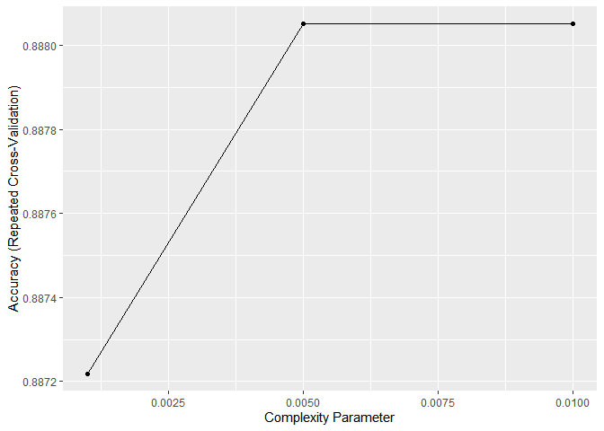
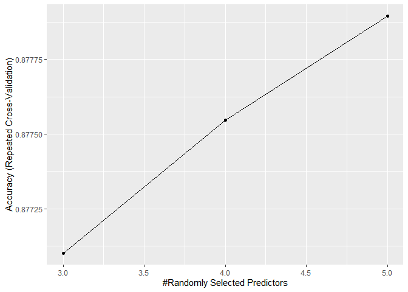
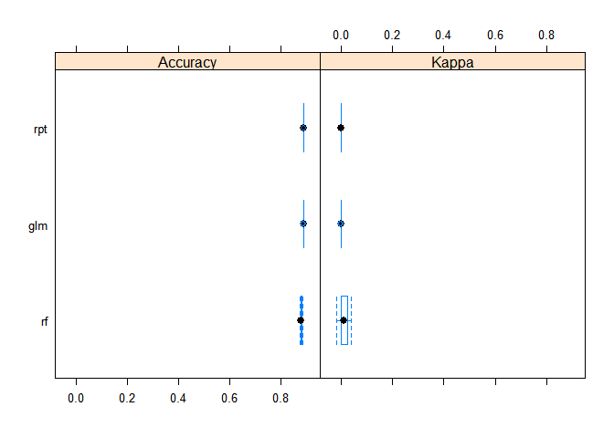
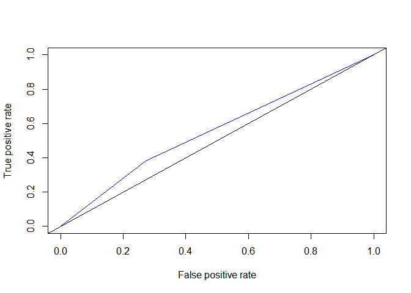

## 1. 병렬처리를 위한 패키지 불러오기


```r
library(caret) # 머신러닝을 위한 패키지
```

```
## 필요한 패키지를 로딩중입니다: ggplot2
```

```
## 필요한 패키지를 로딩중입니다: lattice
```

```r
library(tidyverse) # 데이터 핸들링 및 시각화를 위한 패키지
```

```
## -- Attaching packages --------------------------------------- tidyverse 1.3.1 --
```

```
## v tibble  3.1.6     v dplyr   1.0.7
## v tidyr   1.1.4     v stringr 1.4.0
## v readr   2.1.0     v forcats 0.5.1
## v purrr   0.3.4
```

```
## -- Conflicts ------------------------------------------ tidyverse_conflicts() --
## x dplyr::filter() masks stats::filter()
## x dplyr::lag()    masks stats::lag()
## x purrr::lift()   masks caret::lift()
```

```r
library(doParallel) # 병렬처리를 위한 패키지
```

```
## 필요한 패키지를 로딩중입니다: foreach
```

```
## 
## 다음의 패키지를 부착합니다: 'foreach'
```

```
## The following objects are masked from 'package:purrr':
## 
##     accumulate, when
```

```
## 필요한 패키지를 로딩중입니다: iterators
```

```
## 필요한 패키지를 로딩중입니다: parallel
```

- 병렬처리
  + 주 목적: 속도 때문에 씀
  + 원리 및 기타 설명은 다음 링크를 참고한다. 
  + https://freshrimpsushi.tistory.com/1266


```r
detectCores() # 현재 자기 컴퓨터의 코어 개수를 반환한다
```

```
## [1] 16
```

- 병렬처리에 쓸 코어를 등록한다. 
- 보통 50% 쓰는 것을 추천한다. (이유: 모형이 개발되는 동안 다른 간단한 작업도 해야 함)


```r
cl <- parallel::makeCluster(6, setup_timeout = 0.5)
registerDoParallel(cl)
```

## 2. 데이터 가져오기
- 경로를 확인한 뒤 데이터를 가져온다. 


```r
loan_data <- read.csv("data/cleaned_loan_data.csv", stringsAsFactors = FALSE)
dim(loan_data)
```

```
## [1] 29091     8
```

## 3. 데이터 전처리
- 경로를 확인한 뒤 데이터를 가져온다. 
- 먼저 중복값을 확인한다. 

```r
sapply(loan_data, function(x) sum(is.na(x)))
```

```
##    loan_status      loan_amnt          grade home_ownership     annual_inc 
##              0              0              0              0              0 
##            age        emp_cat         ir_cat 
##              0              0              0
```

- 데이터 타입을 확인한다. 

```r
loan_data %>% duplicated() %>% sum() # 374개 확인
```

```
## [1] 374
```

```r
loan_data2 <- loan_data %>% distinct()
```

- 데이터 타입을 확인한다. 

```r
glimpse(loan_data2)
```

```
## Rows: 28,717
## Columns: 8
## $ loan_status    <int> 0, 0, 0, 0, 0, 0, 1, 0, 1, 0, 0, 0, 0, 0, 1, 0, 0, 1, 0~
## $ loan_amnt      <int> 5000, 2400, 10000, 5000, 3000, 12000, 9000, 3000, 10000~
## $ grade          <chr> "B", "C", "C", "A", "E", "B", "C", "B", "B", "D", "C", ~
## $ home_ownership <chr> "RENT", "RENT", "RENT", "RENT", "RENT", "OWN", "RENT", ~
## $ annual_inc     <dbl> 24000.00, 12252.00, 49200.00, 36000.00, 48000.00, 75000~
## $ age            <int> 33, 31, 24, 39, 24, 28, 22, 22, 28, 22, 23, 27, 30, 24,~
## $ emp_cat        <chr> "0-15", "15-30", "0-15", "0-15", "0-15", "0-15", "0-15"~
## $ ir_cat         <chr> "08월 11일", "Missing", "11-13.5", "Missing", "Missing"~
```

- 우선 타겟 데이터는 영어로 표현한다. 

```r
loan_data2$loan_status <- factor(loan_data2$loan_status, levels = c(0, 1), labels = c("non_default", "default"))
loan_data2$grade <- as.factor(loan_data2$grade)
loan_data2$home_ownership <- as.factor(loan_data2$home_ownership)
```

- 만약 한꺼번에 하고 싶다면 다음과 같이 할 수 있다. 

```r
loan_data2 <- loan_data2 %>% 
  mutate_if(is.character, as.factor)
```

- chr 데이터가 모두 factor로 바뀌었는지 확인한다. 

```r
glimpse(loan_data2)
```

```
## Rows: 28,717
## Columns: 8
## $ loan_status    <fct> non_default, non_default, non_default, non_default, non~
## $ loan_amnt      <int> 5000, 2400, 10000, 5000, 3000, 12000, 9000, 3000, 10000~
## $ grade          <fct> B, C, C, A, E, B, C, B, B, D, C, A, B, A, B, B, B, B, B~
## $ home_ownership <fct> RENT, RENT, RENT, RENT, RENT, OWN, RENT, RENT, RENT, RE~
## $ annual_inc     <dbl> 24000.00, 12252.00, 49200.00, 36000.00, 48000.00, 75000~
## $ age            <int> 33, 31, 24, 39, 24, 28, 22, 22, 28, 22, 23, 27, 30, 24,~
## $ emp_cat        <fct> 0-15, 15-30, 0-15, 0-15, 0-15, 0-15, 0-15, 0-15, 0-15, ~
## $ ir_cat         <fct> 08월 11일, Missing, 11-13.5, Missing, Missing, 11-13.5,~
```

## 4. 데이터 분리
- 훈련 데이터와 테스트 데이터로 분리한다. 

```r
set.seed(2021)
inx   <- createDataPartition(loan_data2$loan_status, p = 0.6, list = F)
train <- loan_data2[ inx, ]
test  <- loan_data2[-inx, ]
```


## 5. 모형 개발 준비
- caret 패키지에서의 모형 개발 관련해서는 다음 웹사이트에서 확인 하기를 바란다. 
  + Ref. http://appliedpredictivemodeling.com/
  
### (1) Controller 
- trainControl 함수를 활용하여 기본 세팅을 진행한다. 


```r
control <- trainControl(
  method  = "repeatedcv",
  number  = 10, # 10겹
  repeats = 3, # 3번
  search  = "grid",
  classProbs = TRUE)
```

### (2) Feature Engineering
- 통계처리를 진행한다. 

```r
preProc <- c("BoxCox", 
             "center",
             "scale",
             "spatialSign",
             "corr",
             "zv")
```

### (3) 독립 변수와 종속 변수의 정의
-  독립변수와 종속 변수를 정의한다. 


```r
frml <- loan_status ~ loan_amnt + grade + home_ownership + annual_inc + age + emp_cat + ir_cat
```

## 6. 모형개발
- 개발준비가 끝났다면, 다양한 모델을 개발하도록 한다. 
- 

### (1) 로지스틱회귀분석

```r
logis <- train(
  frml, 
  data = train, 
  method = "glm", 
  metric = "Accuracy", 
  trControl = control, 
  preProcess = preProc
)

logis
```

```
## Generalized Linear Model 
## 
## 17231 samples
##     7 predictor
##     2 classes: 'non_default', 'default' 
## 
## Pre-processing: Box-Cox transformation (3), centered (20), scaled (20),
##  spatial sign transformation (20) 
## Resampling: Cross-Validated (10 fold, repeated 3 times) 
## Summary of sample sizes: 15509, 15508, 15508, 15507, 15508, 15507, ... 
## Resampling results:
## 
##   Accuracy   Kappa        
##   0.8878377  -0.0004200657
```
### (2) 의사결정나무
- 의사결정 나무에서 하이퍼파라미터를 정의한다. 

```r
rpartGrid <- expand.grid(cp = c(0.001, 0.005, 0.01))
modelLookup("rpart")
```

```
##   model parameter                label forReg forClass probModel
## 1 rpart        cp Complexity Parameter   TRUE     TRUE      TRUE
```

- 이제 모형을 개발한다. 

```r
set.seed(2021)
rpt <- train(
  frml, 
  data = train,
  method     = "rpart",
  metric     = "Accuracy",
  trControl  = control,
  preProcess = preProc,
  tuneGrid   = rpartGrid)

rpt
```

```
## CART 
## 
## 17231 samples
##     7 predictor
##     2 classes: 'non_default', 'default' 
## 
## Pre-processing: Box-Cox transformation (3), centered (20), scaled (20),
##  spatial sign transformation (20) 
## Resampling: Cross-Validated (10 fold, repeated 3 times) 
## Summary of sample sizes: 15508, 15507, 15508, 15508, 15508, 15508, ... 
## Resampling results across tuning parameters:
## 
##   cp     Accuracy   Kappa      
##   0.001  0.8872189  0.008546392
##   0.005  0.8880506  0.000000000
##   0.010  0.8880506  0.000000000
## 
## Accuracy was used to select the optimal model using the largest value.
## The final value used for the model was cp = 0.01.
```

```r
ggplot(rpt)
```

<!-- -->


```r
glimpse(train)
```

```
## Rows: 17,231
## Columns: 8
## $ loan_status    <fct> non_default, non_default, non_default, default, non_def~
## $ loan_amnt      <int> 2400, 5000, 3000, 9000, 3000, 10000, 3600, 9200, 10000,~
## $ grade          <fct> C, A, E, C, B, C, A, A, B, B, B, A, A, C, B, B, A, D, D~
## $ home_ownership <fct> RENT, RENT, RENT, RENT, RENT, RENT, MORTGAGE, RENT, OWN~
## $ annual_inc     <dbl> 12252.00, 36000.00, 48000.00, 30000.00, 15000.00, 42000~
## $ age            <int> 31, 39, 24, 22, 22, 23, 27, 24, 23, 31, 24, 38, 22, 27,~
## $ emp_cat        <fct> 15-30, 0-15, 0-15, 0-15, 0-15, 0-15, 0-15, 0-15, 0-15, ~
## $ ir_cat         <fct> Missing, Missing, Missing, 11-13.5, 08월 11일, Missing,~
```

```r
train
```

```
##       loan_status loan_amnt grade home_ownership annual_inc age emp_cat
## 2     non_default      2400     C           RENT   12252.00  31   15-30
## 4     non_default      5000     A           RENT   36000.00  39    0-15
## 5     non_default      3000     E           RENT   48000.00  24    0-15
## 7         default      9000     C           RENT   30000.00  22    0-15
## 8     non_default      3000     B           RENT   15000.00  22    0-15
## 11    non_default     10000     C           RENT   42000.00  23    0-15
## 12    non_default      3600     A       MORTGAGE  110000.00  27    0-15
## 14    non_default      9200     A           RENT   77385.19  24    0-15
## 16    non_default     10000     B            OWN   50000.00  23    0-15
## 18        default      6000     B           RENT   76000.00  31    0-15
## 22    non_default      8500     B           RENT   25000.00  24    0-15
## 23    non_default      4375     A       MORTGAGE   17108.00  38    0-15
## 25    non_default      5000     A           RENT   24044.00  22    0-15
## 26    non_default      7000     C           RENT   34000.00  27    0-15
## 27    non_default     12400     B           RENT   41000.00  36   15-30
## 28    non_default     10800     B           RENT   55596.00  35    0-15
## 29    non_default     15000     A           RENT   45000.00  23    0-15
## 33    non_default      3000     D       MORTGAGE   65000.00  26    0-15
## 34    non_default      4400     D           RENT   55000.00  24   15-30
## 35    non_default      6000     A       MORTGAGE   45600.00  21   15-30
## 36    non_default     14000     B           RENT   80000.00  26    0-15
## 37        default      5000     A       MORTGAGE  100000.00  27   15-30
## 38    non_default     10000     B           RENT   27000.00  23    0-15
## 39    non_default     10000     A           RENT   60000.00  37    0-15
## 40    non_default     11000     A           RENT   70000.00  26    0-15
## 41        default     15000     B       MORTGAGE   80000.00  26    0-15
## 43    non_default      7000     B           RENT   40000.00  22    0-15
## 44        default     12000     C           RENT   50000.00  29    0-15
## 46    non_default     10000     B            OWN   39000.00  33    0-15
## 48    non_default      7100     D       MORTGAGE   33000.00  29    0-15
## 49    non_default      8000     D           RENT   62000.00  29    0-15
## 51    non_default     16425     C           RENT   44544.00  27    0-15
## 52    non_default     15000     C            OWN   61000.00  25    0-15
## 53        default      6400     D           RENT   75000.00  35    0-15
## 54    non_default      3000     C           RENT   33600.00  27    0-15
## 55    non_default     12000     D           RENT   50000.00  25    0-15
## 56    non_default     14400     A            OWN  150000.00  25    0-15
## 58    non_default     11000     C       MORTGAGE   48000.00  26   15-30
## 59    non_default     15000     A       MORTGAGE   52000.00  37    0-15
## 60    non_default     10000     C           RENT   68000.00  29    0-15
## 62    non_default      4500     A           RENT   53000.00  40    0-15
## 65    non_default     12000     D           RENT   88365.00  28    0-15
## 69    non_default     10500     B           RENT   66000.00  31    0-15
## 70    non_default      7000     B            OWN   39120.00  23    0-15
## 73    non_default      6000     A            OWN   28800.00  26    0-15
## 75    non_default      9500     A       MORTGAGE   50000.00  27    0-15
## 76    non_default     24000     B           RENT   45000.00  40    0-15
## 80    non_default      5500     A       MORTGAGE  110000.00  25    0-15
## 81    non_default     11000     A            OWN   45608.00  26    0-15
## 82    non_default      8000     B       MORTGAGE   35000.00  35    0-15
## 84    non_default      8000     B       MORTGAGE   35000.00  24    0-15
## 85    non_default     10000     A           RENT   24000.00  33    0-15
## 87    non_default     10000     A           RENT   43000.00  37    0-15
## 88    non_default     12000     B           RENT   50000.00  26    0-15
## 89        default     19750     B           RENT   45000.00  42    0-15
## 92    non_default     18000     A           RENT   56964.00  29    0-15
## 93    non_default      2500     C           RENT   49500.00  22    0-15
## 94    non_default     35000     A       MORTGAGE  125000.00  23    0-15
## 96    non_default      7000     B           RENT   30000.00  23    0-15
## 97        default     24000     C       MORTGAGE   90000.00  24    0-15
## 98    non_default     10625     A       MORTGAGE   23000.00  22    0-15
## 99    non_default      5000     C           RENT   24000.00  37    0-15
## 101   non_default      6375     A           RENT   44000.00  25    0-15
## 104   non_default      6200     A       MORTGAGE   26500.00  44    0-15
## 107   non_default     14000     C           RENT   52800.00  23    0-15
## 108   non_default      8875     A       MORTGAGE   38000.00  26    0-15
## 109   non_default     13500     B           RENT   38000.00  21    0-15
## 110       default     12000     B           RENT   42000.00  24    0-15
## 111   non_default      6000     B       MORTGAGE   87000.00  24    0-15
## 113   non_default     12000     D       MORTGAGE   80000.00  26    0-15
## 114   non_default      7200     B           RENT   48000.00  22    0-15
## 115       default      5600     C       MORTGAGE   85000.00  24    0-15
## 116   non_default     12000     C           RENT   57000.00  23    0-15
## 117   non_default      8500     A           RENT   25000.00  23    0-15
## 118   non_default      8000     B           RENT   34000.00  22    0-15
## 119   non_default      8000     B           RENT   40000.00  25    0-15
## 120   non_default     15000     D       MORTGAGE   44400.00  23    0-15
## 122   non_default     10000     A       MORTGAGE   70000.00  23    0-15
## 123   non_default      8000     C           RENT   28000.00  25    0-15
## 124   non_default     22000     B       MORTGAGE   50000.00  22    0-15
## 125   non_default      6000     C       MORTGAGE   94800.00  23    0-15
## 129   non_default     10000     C           RENT   45900.00  65    0-15
## 131   non_default      7325     B           RENT   42000.00  23    0-15
## 132   non_default      4000     B           RENT  135000.00  28    0-15
## 134       default      7750     D           RENT   24000.00  24    0-15
## 136   non_default     14000     B           RENT   30000.00  21    0-15
## 137   non_default     13350     B           RENT   43000.00  31   15-30
## 140   non_default     35000     B       MORTGAGE  168000.00  25    0-15
## 141   non_default      9000     B       MORTGAGE   74000.00  22    0-15
## 143   non_default     13500     B           RENT   71000.00  26    0-15
## 146   non_default     14000     A           RENT   66000.00  26   30-45
## 147       default     12000     C       MORTGAGE   70000.00  33    0-15
## 149   non_default      9000     B           RENT   50000.00  25    0-15
## 152   non_default      3000     C           RENT   71000.00  22    0-15
## 153   non_default      7350     B       MORTGAGE   48000.00  21   15-30
## 154   non_default     11500     C           RENT   36000.00  30    0-15
## 155       default     13650     B       MORTGAGE   86000.00  32   15-30
## 156       default     10500     D           RENT   30000.00  25    0-15
## 157   non_default     12000     B           RENT   60000.00  28    0-15
## 159   non_default     11500     C       MORTGAGE   44200.00  27   15-30
## 160   non_default      7000     B       MORTGAGE   82000.00  26    0-15
## 161   non_default      2000     C           RENT   41000.00  27    0-15
## 163       default     15075     C           RENT   35000.00  31    0-15
## 164   non_default      5300     C           RENT   30000.00  25    0-15
## 165   non_default      8200     A           RENT   40000.00  26    0-15
## 168   non_default     12000     B           RENT   83000.00  31    0-15
## 169       default      9500     B       MORTGAGE   52500.00  22    0-15
## 172       default      7200     A           RENT   68000.00  23    0-15
## 174   non_default      1500     D       MORTGAGE  144000.00  24    0-15
## 176   non_default      2500     B       MORTGAGE   29000.00  54    0-15
## 179   non_default      4225     B       MORTGAGE   55200.00  25    0-15
## 180   non_default      3500     A       MORTGAGE   61440.00  35    0-15
## 183   non_default     12000     C           RENT   71000.00  29    0-15
## 185   non_default     14000     B       MORTGAGE   63000.00  25    0-15
## 186   non_default      6000     C       MORTGAGE   50000.00  35    0-15
## 188   non_default     10000     B           RENT   45000.00  29    0-15
## 189   non_default      8000     A           RENT   78000.00  31    0-15
## 190   non_default     14125     B           RENT   33000.00  25    0-15
## 191   non_default     14000     B           RENT   62800.00  24    0-15
## 192   non_default      4000     E       MORTGAGE   80000.00  25   15-30
## 194   non_default     10500     A       MORTGAGE   65000.00  23    0-15
## 196   non_default      7350     B           RENT   33000.00  24    0-15
## 197       default     10000     B           RENT   39000.00  22    0-15
## 198   non_default     12000     A           RENT   42000.00  32    0-15
## 200   non_default     18000     B            OWN   75000.00  29    0-15
## 201   non_default     12000     C           RENT   40000.00  24    0-15
## 203   non_default      6000     A       MORTGAGE   80000.00  25    0-15
## 204   non_default     12000     B           RENT   40000.00  27    0-15
## 205       default     12000     A           RENT   80000.00  30    0-15
## 206   non_default      7000     B           RENT   75000.00  29    0-15
## 208   non_default      3200     B           RENT   61200.00  26    0-15
## 209   non_default      8000     A           RENT   40000.00  22    0-15
## 210   non_default      5000     A       MORTGAGE   54000.00  22    0-15
## 211   non_default      1800     A           RENT   18000.00  21   15-30
## 212   non_default     35000     A           RENT   85000.00  37    0-15
## 213   non_default     18000     A           RENT   78000.00  34    0-15
## 214       default     14000     A            OWN   45600.00  23    0-15
## 215   non_default      5000     B           RENT   70000.00  38    0-15
## 216   non_default      8000     C           RENT   70000.00  25    0-15
## 217   non_default     10000     A       MORTGAGE   80000.00  24    0-15
## 218   non_default     10000     A           RENT   50000.00  23    0-15
## 219   non_default     12000     B       MORTGAGE   35000.00  23    0-15
## 220   non_default     23200     A       MORTGAGE   65000.00  31    0-15
## 221   non_default      4800     C       MORTGAGE   75000.00  25   15-30
## 225   non_default     12000     A            OWN   40000.00  21    0-15
## 227   non_default     12000     B           RENT   92500.00  26    0-15
## 229   non_default      6000     B           RENT   36000.00  25   15-30
## 231   non_default     14400     B           RENT   80000.00  22    0-15
## 232   non_default     10000     B           RENT   43000.00  27    0-15
## 234       default      8000     D           RENT   50000.00  21    0-15
## 235   non_default     13250     B            OWN   35000.00  37    0-15
## 239   non_default     13000     B           RENT  110000.00  40    0-15
## 240   non_default     28000     B           RENT  100000.00  25    0-15
## 242   non_default     20000     A           RENT   45000.00  22    0-15
## 243   non_default     18000     B           RENT  110000.00  27    0-15
## 247   non_default      4475     C           RENT   43680.00  28    0-15
## 249       default      5000     B           RENT   30000.00  26    0-15
## 250   non_default      3000     A           RENT   50000.00  25    0-15
## 251       default     12000     B           RENT   55000.00  45   15-30
## 253   non_default     10000     C           RENT   84000.00  25    0-15
## 254   non_default     15000     B            OWN  155000.00  32    0-15
## 258       default     24000     A       MORTGAGE  116400.00  32   15-30
## 265       default     10000     B           RENT   35000.00  27    0-15
## 267   non_default      9600     B           RENT   35000.00  25    0-15
## 268   non_default      9875     A       MORTGAGE   40000.00  22    0-15
## 269   non_default      4800     A           RENT   48000.00  23    0-15
## 270   non_default      7800     A            OWN   85000.00  30    0-15
## 271   non_default     20000     C       MORTGAGE   70000.00  26    0-15
## 272       default      9750     A           RENT   35000.00  27    0-15
## 273   non_default      5000     A       MORTGAGE   30000.00  25    0-15
## 275   non_default      7200     A           RENT   55000.00  25    0-15
## 278       default      8875     B       MORTGAGE   35360.00  25    0-15
## 279   non_default     15550     B           RENT   54000.00  23    0-15
## 280   non_default      7500     B           RENT   65000.00  29    0-15
## 281   non_default      8875     A            OWN   28800.00  22    0-15
## 283   non_default      5800     B           RENT   36000.00  27    0-15
## 285   non_default     10000     B           RENT   50000.00  35    0-15
## 287       default     12000     A           RENT   32000.00  29    0-15
## 289   non_default     14000     C           RENT   80000.00  23    0-15
## 290   non_default     12000     A       MORTGAGE   40246.00  38    0-15
## 291       default      8050     B           RENT   36000.00  22    0-15
## 293   non_default      7500     B           RENT   31200.00  22    0-15
## 294   non_default      7000     B           RENT   90000.00  35    0-15
## 296   non_default     16000     B           RENT   90000.00  27    0-15
## 297   non_default      9800     D           RENT   67000.00  39    0-15
## 298   non_default      5000     A           RENT  276000.00  28    0-15
## 299   non_default      9900     B           RENT   26400.00  22    0-15
## 302   non_default      6250     C           RENT   29120.00  25    0-15
## 303   non_default      6400     D           RENT   29120.00  25    0-15
## 306   non_default      6500     C       MORTGAGE   30000.00  25    0-15
## 307   non_default      8000     C           RENT   50000.00  24   15-30
## 309   non_default     10200     C           RENT   40000.00  26    0-15
## 310   non_default      9000     B       MORTGAGE   47000.00  28    0-15
## 314   non_default      8875     A           RENT   30000.00  25    0-15
## 316   non_default      8000     B           RENT   42000.00  31    0-15
## 318   non_default      9600     C       MORTGAGE   27000.00  21    0-15
## 320   non_default     15000     B       MORTGAGE   80000.00  23   15-30
## 321   non_default      9000     A       MORTGAGE   45000.00  25    0-15
## 322   non_default     10000     A           RENT   72500.00  36    0-15
## 323       default      1000     C           RENT   18408.00  51 Missing
## 327   non_default      3000     A       MORTGAGE   65000.00  27   15-30
## 332   non_default     21000     B       MORTGAGE  135000.00  24    0-15
## 333   non_default      8250     A       MORTGAGE   31500.00  25 Missing
## 334   non_default     13000     B           RENT   65000.00  31    0-15
## 335   non_default     18000     A       MORTGAGE   78000.00  29    0-15
## 336   non_default      7200     A       MORTGAGE   60000.00  31    0-15
## 337   non_default     16500     A           RENT   48000.00  22    0-15
## 339   non_default     18800     A       MORTGAGE   82000.00  35    0-15
## 340   non_default     26800     E       MORTGAGE   82000.00  42    0-15
## 341   non_default     19200     A       MORTGAGE   42000.00  24    0-15
## 342   non_default      4000     B       MORTGAGE   38000.00  23    0-15
## 345   non_default      2625     B       MORTGAGE   52800.00  23    0-15
## 347   non_default     11300     B       MORTGAGE   36000.00  23    0-15
## 351   non_default      4375     B            OWN   15000.00  28    0-15
## 353   non_default      6000     A           RENT   47000.00  24    0-15
## 354   non_default      4000     A       MORTGAGE  120000.00  44    0-15
## 358   non_default     10400     B           RENT   44000.00  24    0-15
## 359   non_default     11500     B           RENT   38500.00  27    0-15
## 361   non_default      3600     A           RENT   55000.00  25    0-15
## 362       default     10000     D           RENT   68000.00  32    0-15
## 363   non_default     15000     D       MORTGAGE   66000.00  24   15-30
## 365       default     16000     A           RENT   51000.00  51    0-15
## 366   non_default      8000     B           RENT   55000.00  23    0-15
## 367   non_default      7200     A       MORTGAGE   47000.00  41   15-30
## 368   non_default     12000     A           RENT   86000.00  27    0-15
## 369       default      2200     C            OWN   48000.00  24    0-15
## 371   non_default     14400     C           RENT   42996.00  22    0-15
## 372   non_default     14050     A       MORTGAGE  120000.00  33    0-15
## 373   non_default      6000     C            OWN   62691.00  38   15-30
## 374   non_default     10525     A           RENT   49668.00  29    0-15
## 378   non_default      3000     B           RENT   56312.00  33    0-15
## 379   non_default      9500     D           RENT   54011.00  26    0-15
## 380   non_default     19775     B           RENT   49110.32  30    0-15
## 381   non_default     30000     B           RENT   80000.00  29    0-15
## 385   non_default     24000     D           RENT   70000.00  53    0-15
## 386       default     21250     B           RENT   37000.00  22    0-15
## 390   non_default      3600     C           RENT   40000.00  23    0-15
## 391       default     15000     C           RENT   60000.00  23    0-15
## 393       default      4000     B           RENT   30000.00  27    0-15
## 394   non_default     13000     B       MORTGAGE   50000.00  22   15-30
## 395   non_default      5000     A       MORTGAGE   39396.00  22    0-15
## 398   non_default      8000     A           RENT   32400.00  22   15-30
## 399       default      1700     A       MORTGAGE   37800.00  34 Missing
## 400   non_default     16000     B           RENT   50000.00  35    0-15
## 403       default     13000     D           RENT   28000.00  26    0-15
## 404   non_default     18000     C       MORTGAGE   96000.00  30    0-15
## 407   non_default      7000     B           RENT   52000.00  23    0-15
## 408   non_default      8000     A           RENT   57600.00  41    0-15
## 411   non_default      6200     B       MORTGAGE   24000.00  36   15-30
## 416   non_default      3150     C           RENT   53000.00  36    0-15
## 418       default     28000     A       MORTGAGE  118000.00  24    0-15
## 420   non_default      3000     B       MORTGAGE   42000.00  25 Missing
## 425       default      8575     D       MORTGAGE   32000.00  28 Missing
## 426   non_default     10000     A           RENT   66000.00  27    0-15
## 428   non_default      8000     B           RENT   70000.00  24    0-15
## 429   non_default     25000     B       MORTGAGE   76896.00  23    0-15
## 431   non_default     16800     C           RENT   60000.00  22    0-15
## 432   non_default      8000     A       MORTGAGE  120000.00  32    0-15
## 434       default      5000     D       MORTGAGE   85000.00  33    0-15
## 435   non_default     18000     D            OWN  140000.00  28    0-15
## 436       default     10000     B            OWN   36000.00  30    0-15
## 438   non_default     10000     D           RENT   51360.00  22    0-15
## 439   non_default     25000     B           RENT  163000.00  29    0-15
## 440   non_default      2400     B       MORTGAGE   59393.00  24    0-15
## 444   non_default      5000     B            OWN   44475.00  24    0-15
## 445   non_default     14000     D       MORTGAGE   88000.00  31    0-15
## 447   non_default      1800     B           RENT  117000.00  27    0-15
## 452   non_default      9400     B           RENT   45500.00  26    0-15
## 457   non_default     35000     A       MORTGAGE  106000.00  22   15-30
## 459   non_default      5000     B           RENT   25000.00  26    0-15
## 461   non_default     12000     D       MORTGAGE   93000.00  25    0-15
## 463       default     22250     B           RENT   41000.00  23    0-15
## 465       default      7650     B           RENT   57000.00  23    0-15
## 466   non_default     13200     A       MORTGAGE   62500.00  21    0-15
## 467   non_default     12000     A           RENT   60000.00  21    0-15
## 468   non_default     15000     A           RENT   60000.00  26    0-15
## 469   non_default     12800     B       MORTGAGE   99600.00  25    0-15
## 472   non_default     10000     C           RENT   44160.00  23    0-15
## 473   non_default     14125     A           RENT   32000.00  23    0-15
## 475   non_default      9575     A           RENT   19498.00  27    0-15
## 478   non_default     10000     C           RENT   37500.00  25    0-15
## 480   non_default     14575     B           RENT   35000.00  26    0-15
## 481   non_default      9000     A       MORTGAGE   50000.00  28    0-15
## 486   non_default      7000     B           RENT   85000.00  26    0-15
## 487   non_default      7000     A           RENT   45000.00  26    0-15
## 490   non_default      5000     A           RENT   33000.00  29    0-15
## 495   non_default      6000     B           RENT   30000.00  22    0-15
## 496   non_default     20000     A           RENT   50000.00  54    0-15
## 497   non_default      3600     C           RENT   40000.00  24    0-15
## 498   non_default      6000     A           RENT   83954.00  23    0-15
## 499   non_default     10375     C           RENT   35000.00  27    0-15
## 501   non_default     10000     D           RENT   40000.00  27    0-15
## 502   non_default      5600     A            OWN   41100.00  24 Missing
## 503   non_default      6000     B           RENT   92000.00  23    0-15
## 504   non_default      8000     A           RENT   75000.00  23    0-15
## 505   non_default     10000     B       MORTGAGE   45000.00  23    0-15
## 510   non_default     21000     A       MORTGAGE  150500.00  39   15-30
## 512   non_default      7000     B           RENT   37500.00  23    0-15
## 513       default     12000     B           RENT   60000.00  23    0-15
## 515   non_default     12000     B           RENT   70000.00  24    0-15
## 517   non_default      9000     C           RENT   38000.00  35    0-15
## 518       default     10000     B            OWN   35000.00  21    0-15
## 519   non_default     10000     B       MORTGAGE   95000.00  23    0-15
## 521   non_default      8500     D           RENT   61000.00  29    0-15
## 522   non_default     27000     B            OWN  140000.00  29    0-15
## 524   non_default      7300     B           RENT   50000.00  21    0-15
## 525   non_default     18000     A       MORTGAGE   70000.00  31    0-15
## 526   non_default      5000     B            OWN   35000.00  23   15-30
## 528   non_default      3000     A           RENT   45000.00  25    0-15
## 529   non_default     28000     C       MORTGAGE  235000.00  27    0-15
## 531   non_default     12000     A           RENT   26000.00  24    0-15
## 532   non_default     10000     D           RENT   80000.00  29    0-15
## 533   non_default     11000     A           RENT   50000.00  22    0-15
## 535   non_default      5000     A       MORTGAGE   55000.00  27    0-15
## 539   non_default      5000     C       MORTGAGE  111740.00  29    0-15
## 542   non_default     25000     B           RENT  120000.00  24   30-45
## 544   non_default      8400     D           RENT   41500.00  26   15-30
## 545   non_default      5000     B       MORTGAGE   75000.00  26    0-15
## 548   non_default      6000     A           RENT   48000.00  31    0-15
## 552   non_default     12000     B           RENT   85000.00  27    0-15
## 553   non_default     10000     C           RENT   55000.00  27   15-30
## 554   non_default     12375     C           RENT   36000.00  36   15-30
## 555   non_default     10000     B           RENT   26000.00  22    0-15
## 556   non_default      4400     E           RENT   80000.00  24    0-15
## 557   non_default     25000     C       MORTGAGE   80000.00  25    0-15
## 558       default     14125     B       MORTGAGE   45696.00  22 Missing
## 560   non_default     35000     D       MORTGAGE  100000.00  23    0-15
## 561   non_default     35000     C       MORTGAGE  123000.00  37    0-15
## 562   non_default      7200     C       MORTGAGE   60000.00  26    0-15
## 563   non_default      4000     B           RENT   80000.00  27    0-15
## 564   non_default      7000     A           RENT   31000.00  25   15-30
## 565   non_default     15000     C       MORTGAGE   90000.00  41    0-15
## 567   non_default     13000     D           RENT   36000.00  24   15-30
## 568   non_default     28000     A           RENT   65000.00  27    0-15
## 570   non_default     14000     A           RENT   62004.00  41    0-15
## 571   non_default     11500     B           RENT   74000.00  29   15-30
## 575   non_default      5375     B           RENT   15360.00  28    0-15
## 576   non_default     12000     C       MORTGAGE   61000.00  22    0-15
## 577       default     12000     A           RENT   83000.00  23    0-15
## 579       default     13000     E           RENT   42000.00  31    0-15
## 580       default      7125     A       MORTGAGE   30000.00  21    0-15
## 583   non_default     10000     C           RENT   40000.00  22    0-15
## 586   non_default     19200     B       MORTGAGE   40000.00  28    0-15
## 588   non_default     20000     A           RENT   65000.00  29    0-15
## 592       default     15000     C           RENT   38000.00  21    0-15
## 596   non_default      7200     B           RENT   23000.00  24    0-15
## 597   non_default     11000     B           RENT   32000.00  23    0-15
## 600   non_default     11000     B       MORTGAGE   74000.00  43    0-15
## 603   non_default      3000     C           RENT  105000.00  32    0-15
## 604   non_default     17000     B            OWN   80000.00  41   15-30
## 605   non_default      5000     B       MORTGAGE   35000.00  29    0-15
## 606   non_default      6400     A            OWN   23000.00  39    0-15
## 607   non_default     13000     D           RENT   50000.00  23    0-15
## 608   non_default     10000     D           RENT   38200.00  25    0-15
## 609   non_default      5000     C           RENT   56000.00  24    0-15
## 610   non_default      7200     A           RENT   38000.00  23    0-15
## 612   non_default      9600     B       MORTGAGE  105000.00  25    0-15
## 613   non_default      6000     B           RENT   24000.00  22   15-30
## 614   non_default      6000     C       MORTGAGE   57600.00  30    0-15
## 615   non_default      7150     B           RENT   50000.00  26    0-15
## 617       default      8000     C            OWN  108000.00  22    0-15
## 619   non_default     12000     A       MORTGAGE   70800.00  41   30-45
## 621   non_default     12000     B           RENT   60000.00  23    0-15
## 623   non_default      4500     B           RENT   91500.00  29    0-15
## 625   non_default      3600     D           RENT   45000.00  28    0-15
## 626   non_default     21000     C       MORTGAGE  103000.00  24   15-30
## 627   non_default      7000     C           RENT   42000.00  22    0-15
## 630   non_default     17050     B       MORTGAGE   53000.00  28    0-15
## 631   non_default     16500     D           RENT  110000.00  26    0-15
## 633   non_default      7000     A       MORTGAGE   38400.00  37    0-15
## 634   non_default     24000     B       MORTGAGE   80000.00  23    0-15
## 636   non_default     22750     A            OWN   65000.00  42    0-15
## 638   non_default     30000     B       MORTGAGE  175000.00  26    0-15
## 641   non_default      7200     A           RENT   35000.00  25    0-15
## 642   non_default     15000     B            OWN   35000.00  28    0-15
## 643   non_default     10500     C           RENT   60000.00  28    0-15
## 644       default      5000     A       MORTGAGE   66000.00  26    0-15
## 645   non_default      4000     A       MORTGAGE   62000.00  23    0-15
## 647   non_default     15000     B       MORTGAGE   61000.00  41    0-15
## 648   non_default      2400     C            OWN   25000.00  22    0-15
## 649   non_default      5900     B           RENT   14400.00  21    0-15
## 651       default     13250     D           RENT   35000.00  31    0-15
## 652   non_default     20000     B       MORTGAGE  125000.00  25    0-15
## 655   non_default      7000     B       MORTGAGE   22000.00  22    0-15
## 656   non_default     10000     A       MORTGAGE   70000.00  30    0-15
## 657   non_default      2250     C       MORTGAGE   17352.00  22 Missing
## 658   non_default     23000     B           RENT   63208.00  25    0-15
## 660   non_default     10000     B       MORTGAGE   45500.00  29    0-15
## 661   non_default      5600     A           RENT   19200.00  24    0-15
## 662   non_default      4800     A            OWN   35000.00  26    0-15
## 665       default     24000     B           RENT  120000.00  24    0-15
## 667   non_default     10000     B           RENT   34000.00  21    0-15
## 669   non_default      9600     C           RENT   40000.00  24    0-15
## 671   non_default     12000     A           RENT  100000.00  58    0-15
## 673   non_default     12000     D           RENT   36000.00  35    0-15
## 674   non_default     18000     D           RENT   80000.00  43   15-30
## 680   non_default     17250     E           RENT   60000.00  35    0-15
## 684   non_default     15000     A       MORTGAGE   75000.00  28    0-15
## 685       default     10625     B           RENT   30000.00  26    0-15
## 686   non_default      8400     C           RENT   30000.00  23    0-15
## 687   non_default     16000     C       MORTGAGE   60000.00  35    0-15
## 688   non_default     15000     C       MORTGAGE   35000.00  24    0-15
## 689   non_default     13225     B       MORTGAGE   65000.00  27    0-15
## 691   non_default     10075     B       MORTGAGE   46000.00  24    0-15
## 693   non_default     14000     B       MORTGAGE   88000.00  27    0-15
## 697   non_default     18225     B           RENT   40000.00  38    0-15
## 700   non_default      6400     D           RENT   50000.00  32   15-30
## 702   non_default     18000     B       MORTGAGE   70000.00  30    0-15
## 703   non_default     15625     A       MORTGAGE   45000.00  45   15-30
## 704   non_default     24000     C           RENT   77000.00  54   15-30
## 705       default      5000     C       MORTGAGE   61400.00  21    0-15
## 707       default      5000     C           RENT   32000.00  25   15-30
## 708   non_default      6600     B           RENT   42000.00  25    0-15
## 709   non_default      7000     A       MORTGAGE   24000.00  30 Missing
## 710   non_default     20000     C           RENT  130000.00  25    0-15
## 711       default      8000     B           RENT   35000.00  24    0-15
## 713   non_default     20000     B           RENT   67000.00  34    0-15
## 715   non_default     10000     B       MORTGAGE  145000.00  23    0-15
## 716   non_default     18000     D           RENT   66000.00  26    0-15
## 717   non_default      4000     B           RENT  100000.00  29    0-15
## 718   non_default     15000     B           RENT   60000.00  37 Missing
## 719   non_default     24000     D            OWN  103000.00  24    0-15
## 721   non_default      8300     A           RENT   50000.00  21   30-45
## 722   non_default      7000     A            OWN   50000.00  23    0-15
## 723   non_default      2425     C            OWN   80004.00  24    0-15
## 724   non_default      6950     B           RENT   43000.00  32    0-15
## 725   non_default     12375     B            OWN   32000.00  31    0-15
## 726   non_default     14000     C           RENT   35000.00  27    0-15
## 727   non_default      5500     C           RENT   24000.00  24    0-15
## 728   non_default      4800     C           RENT   44600.00  26    0-15
## 731   non_default      5000     A       MORTGAGE   44136.00  33    0-15
## 733       default      5350     C       MORTGAGE   52000.00  36    0-15
## 734   non_default     10000     B           RENT   36000.00  31    0-15
## 735   non_default     12000     A           RENT   36500.00  38    0-15
## 737   non_default      3000     D       MORTGAGE   56604.00  30    0-15
## 738       default      6000     A           RENT   23040.00  21    0-15
## 740   non_default      5875     A            OWN   17640.00  36    0-15
## 743   non_default     11200     B           RENT   48000.00  31    0-15
## 746   non_default     21650     B       MORTGAGE   62361.00  26    0-15
## 747   non_default      9000     B           RENT   45000.00  23   15-30
## 748   non_default      6000     B           RENT   40000.00  25    0-15
## 749   non_default      5600     A           RENT   25000.00  27    0-15
## 750   non_default      7000     B           RENT   85000.00  30   15-30
## 751   non_default      6000     B           RENT   55000.00  25    0-15
## 753   non_default     13650     B           RENT   44000.00  27    0-15
## 756   non_default      8875     B           RENT   19240.00  25    0-15
## 757   non_default      9000     A           RENT   52800.00  24    0-15
## 759   non_default      6000     C       MORTGAGE   60000.00  29    0-15
## 760   non_default      7200     B            OWN   53000.00  25    0-15
## 761   non_default      8000     B           RENT   46330.00  23    0-15
## 763   non_default     14400     C           RENT   58977.00  23    0-15
## 766   non_default     10000     A       MORTGAGE   69077.00  22    0-15
## 767   non_default     12000     B           RENT  200000.00  24    0-15
## 768   non_default      5000     B       MORTGAGE  110000.00  26    0-15
## 769   non_default     21000     D           RENT   63500.00  33    0-15
## 770   non_default     24000     A       MORTGAGE   70000.00  23    0-15
## 773       default      5000     F           RENT   21000.00  21    0-15
## 775   non_default      4750     A            OWN   48000.00  33    0-15
## 776   non_default      5275     A            OWN   50000.00  27    0-15
## 778   non_default      9600     D           RENT   37000.00  25    0-15
## 779   non_default     22500     C           RENT   70000.00  23    0-15
## 782   non_default     19400     B           RENT   50000.00  23    0-15
## 783       default     10000     C           RENT   42000.00  22    0-15
## 785   non_default      4800     B           RENT   22000.00  31    0-15
## 786       default     18200     B           RENT   42000.00  22    0-15
## 787   non_default      6400     B           RENT   35000.00  21    0-15
## 788   non_default      2500     C           RENT   40000.00  24    0-15
## 789   non_default      6300     B           RENT   49000.00  32   15-30
## 791   non_default      6000     B       MORTGAGE  118000.00  31    0-15
## 792   non_default     18000     A       MORTGAGE   60000.00  24   15-30
## 794   non_default     34000     D           RENT   65000.00  22    0-15
## 796   non_default      5000     B            OWN   20000.00  23    0-15
## 797   non_default     10625     B           RENT   25000.00  23    0-15
## 800       default      8500     C           RENT   27050.00  28 Missing
## 801   non_default     12000     A       MORTGAGE   35000.00  36    0-15
## 802   non_default     11700     B           RENT   30000.00  26    0-15
## 803   non_default     15000     C           RENT   70000.00  32    0-15
## 804   non_default     13000     B       MORTGAGE  105000.00  24    0-15
## 805       default      9500     B       MORTGAGE   52000.00  23    0-15
## 811   non_default     25000     B           RENT   70000.00  27   15-30
## 812       default      5000     A           RENT   84855.00  29 Missing
## 813   non_default      5200     C           RENT   32160.00  25    0-15
## 814   non_default      6000     C       MORTGAGE   50000.00  31    0-15
## 815       default      4000     E           RENT   47000.00  28    0-15
## 817   non_default      8000     B           RENT  115000.00  25    0-15
## 818       default     16500     D       MORTGAGE   64000.00  23   15-30
## 819       default      4000     C            OWN   25000.00  23 Missing
## 820   non_default     12000     B           RENT   40100.00  23   15-30
## 821   non_default     10200     A       MORTGAGE   75000.00  23     45+
## 822   non_default     12000     B           RENT   95000.00  23    0-15
## 825   non_default     11000     A           RENT   37000.00  23   15-30
## 826   non_default     17000     B            OWN   60500.00  25    0-15
## 827   non_default     15000     C            OWN   60000.00  28    0-15
## 828   non_default     12000     A           RENT   52000.00  24    0-15
## 834   non_default      8000     A           RENT   28000.00  21    0-15
## 835   non_default      4000     A           RENT   70000.00  21    0-15
## 836   non_default      1500     C           RENT   90000.00  40    0-15
## 838   non_default      8000     B           RENT   38000.00  23    0-15
## 842   non_default      6000     A           RENT   28675.92  25    0-15
## 843   non_default     18000     A       MORTGAGE   72000.00  24   30-45
## 846   non_default      6000     B       MORTGAGE  127000.00  25    0-15
## 848   non_default     20000     C       MORTGAGE   90000.00  23    0-15
## 850   non_default     12000     B       MORTGAGE   63000.00  45    0-15
## 852       default      7175     A           RENT   60000.00  37    0-15
## 853   non_default     15000     B           RENT   80000.00  23    0-15
## 854   non_default     12000     B           RENT   47840.00  23    0-15
## 855   non_default     15000     A            OWN  130000.00  27    0-15
## 857   non_default     15000     C           RENT   60000.00  46    0-15
## 859   non_default      8000     A           RENT   54600.00  22    0-15
## 861   non_default      6000     B           RENT   42000.00  25    0-15
## 862   non_default      7000     A           RENT   85000.00  30    0-15
## 864   non_default     12000     A       MORTGAGE  243600.00  24    0-15
## 865       default     16000     C       MORTGAGE   70000.00  24    0-15
## 868   non_default     15000     A           RENT   47000.00  26    0-15
## 870   non_default      1200     A       MORTGAGE   39000.00  24    0-15
## 873   non_default     10400     C       MORTGAGE   45000.00  25    0-15
## 874   non_default      3500     B       MORTGAGE   57700.00  23   30-45
## 875       default     15000     B           RENT   90000.00  26    0-15
## 876   non_default     10000     A       MORTGAGE   80000.00  44    0-15
## 878   non_default     12000     B           RENT   90000.00  24    0-15
## 879   non_default      8875     A       MORTGAGE   58000.00  31   15-30
## 881   non_default      4000     C           RENT   90000.00  28    0-15
## 888   non_default     35000     A       MORTGAGE   84500.00  29    0-15
## 890       default      1400     A       MORTGAGE   30108.00  29 Missing
## 895   non_default      2000     A           RENT   33000.00  23    0-15
## 896   non_default      8000     B       MORTGAGE   80000.00  24   15-30
## 899   non_default      6000     A       MORTGAGE   44720.00  22    0-15
## 900   non_default     13000     B           RENT  170000.00  26    0-15
## 901   non_default     18650     B       MORTGAGE   50000.00  24    0-15
## 902       default      2400     B           RENT   43080.00  22    0-15
## 903   non_default      8000     B           RENT   60000.00  29    0-15
## 905   non_default      4800     A       MORTGAGE   50000.00  22    0-15
## 907   non_default      9250     B            OWN   20000.00  22 Missing
## 908       default      2400     B       MORTGAGE   72000.00  31    0-15
## 909   non_default      3000     C       MORTGAGE   70000.00  27    0-15
## 910   non_default     12000     C       MORTGAGE   40000.00  22    0-15
## 911       default     10000     D           RENT   30000.00  28   30-45
## 914   non_default     16000     A       MORTGAGE   70000.00  27    0-15
## 915   non_default     18000     C           RENT   52000.00  22    0-15
## 918   non_default     20000     C           RENT  140000.00  29    0-15
## 924   non_default      7000     A           RENT   42000.00  31    0-15
## 929   non_default     10000     A           RENT   48000.00  21    0-15
## 930   non_default      6000     B           RENT   26500.00  25    0-15
## 931   non_default      2400     C       MORTGAGE   39990.00  26    0-15
## 933   non_default     14000     B            OWN   38000.00  31    0-15
## 935       default      4200     A           RENT   35000.00  22    0-15
## 936   non_default     13250     C           RENT   37500.00  26    0-15
## 937   non_default      6000     A           RENT   24000.00  26    0-15
## 938   non_default      9000     A           RENT   45000.00  22    0-15
## 940   non_default     10000     C       MORTGAGE   77000.00  31    0-15
## 941   non_default      9000     C           RENT   40000.00  29    0-15
## 942       default      5325     B           RENT   22000.00  21 Missing
## 948   non_default      5000     B           RENT   47000.00  25    0-15
## 951   non_default      4000     B       MORTGAGE   55000.00  31   15-30
## 952   non_default      6000     B           RENT   42000.00  22   15-30
## 953   non_default     15000     A            OWN   44500.00  32    0-15
## 955   non_default     18000     B           RENT   50000.00  24    0-15
## 957   non_default     16000     A            OWN   51000.00  22    0-15
## 959   non_default      7000     A           RENT   29004.00  27    0-15
## 962   non_default      7200     B       MORTGAGE   55000.00  23    0-15
## 963   non_default     12000     C           RENT   70000.00  28    0-15
## 964   non_default      5000     A       MORTGAGE   50000.00  36    0-15
## 965   non_default      8200     A       MORTGAGE   65000.00  23    0-15
## 968   non_default     20000     B       MORTGAGE  210000.00  33   30-45
## 969   non_default      3600     B           RENT   37008.00  22    0-15
## 971   non_default      8000     B       MORTGAGE  140000.00  25    0-15
## 972   non_default     16000     B       MORTGAGE  120000.00  29    0-15
## 973       default      5000     B           RENT   30000.00  24    0-15
## 974   non_default     12000     A       MORTGAGE   52000.00  22    0-15
## 975       default      2800     A           RENT   27000.00  22    0-15
## 976   non_default     12000     B           RENT   39996.00  24    0-15
## 977       default      4000     A           RENT   54000.00  27    0-15
## 978   non_default      7000     A       MORTGAGE   23000.00  21    0-15
## 979   non_default      5600     B       MORTGAGE   35000.00  40    0-15
## 980   non_default      5000     A       MORTGAGE  138000.00  28    0-15
## 981   non_default     12000     D           RENT   68500.00  25    0-15
## 982   non_default      5500     B            OWN   31000.00  27    0-15
## 984   non_default     12000     B           RENT   63000.00  24   15-30
## 989   non_default      9000     B            OWN   28944.00  26   15-30
## 990   non_default      8575     C           RENT   35000.00  27   15-30
## 991   non_default      5400     A       MORTGAGE   38000.00  23    0-15
## 992   non_default     10000     D           RENT   72000.00  22    0-15
## 993       default      6000     C           RENT   32000.00  24    0-15
## 994   non_default     10000     C           RENT   33000.00  23    0-15
## 997       default      8000     B           RENT   60000.00  25 Missing
## 999   non_default     10000     A       MORTGAGE   80000.00  24    0-15
## 1000      default      6000     C       MORTGAGE   39168.00  25   15-30
## 1001  non_default     10000     A            OWN   37200.00  30 Missing
## 1002  non_default      5000     B           RENT   62400.00  22    0-15
## 1005  non_default      5450     A           RENT   83004.00  26    0-15
## 1006  non_default     13500     B       MORTGAGE   57700.00  21    0-15
## 1008  non_default      7000     A       MORTGAGE   96000.00  32    0-15
## 1009  non_default      3800     A            OWN   90000.00  36    0-15
## 1010  non_default     28000     A           RENT  110000.00  26   15-30
## 1011  non_default      6000     C           RENT   82000.00  25    0-15
## 1013  non_default     15000     D            OWN   62400.00  25 Missing
## 1014  non_default      7500     C           RENT   60000.00  25    0-15
## 1015  non_default     12000     A           RENT   48000.00  23    0-15
## 1016  non_default      2125     A           RENT   43000.00  26 Missing
## 1018  non_default     10000     B       MORTGAGE  200000.00  29   15-30
## 1021  non_default      6000     A       MORTGAGE  170000.00  32   15-30
## 1023  non_default      3000     A       MORTGAGE   70000.00  31    0-15
## 1026  non_default      6000     B       MORTGAGE   90000.00  26    0-15
## 1029  non_default     10000     B           RENT   56000.00  35    0-15
## 1030  non_default      5000     B           RENT   45000.00  22    0-15
## 1031  non_default      4000     B           RENT   32535.00  23    0-15
## 1032  non_default      8000     A           RENT   70000.00  26   15-30
## 1033  non_default     12000     A            OWN   98000.00  24    0-15
## 1036  non_default     12000     C           RENT   54000.00  23    0-15
## 1037  non_default      5300     C           RENT   28800.00  24    0-15
## 1038  non_default      8000     C       MORTGAGE   70000.00  22    0-15
## 1040  non_default      3800     A       MORTGAGE   62352.00  28    0-15
## 1041  non_default     20000     A           RENT   60000.00  23    0-15
## 1042  non_default      4200     A       MORTGAGE   60000.00  30    0-15
## 1045  non_default     10000     B           RENT   35000.00  24    0-15
## 1046  non_default      6500     A       MORTGAGE   38000.00  42    0-15
## 1047      default      9600     D           RENT   42000.00  22    0-15
## 1048  non_default     31000     E       MORTGAGE  180000.00  29    0-15
## 1049  non_default     14000     D       MORTGAGE  100000.00  23    0-15
## 1050  non_default      9000     B           RENT   24600.00  45    0-15
## 1051  non_default      6500     B       MORTGAGE   45000.00  22    0-15
## 1052  non_default     16500     B       MORTGAGE   55000.00  42    0-15
## 1054  non_default      5600     C           RENT   30000.00  27    0-15
## 1056  non_default      5000     B           RENT   35000.00  31    0-15
## 1060  non_default      9600     A           RENT   42000.00  28    0-15
## 1061  non_default      5200     C            OWN  107800.00  32    0-15
## 1062  non_default     11000     A           RENT   22000.00  24   15-30
## 1064      default      8475     B           RENT   38423.87  32    0-15
## 1065  non_default      9250     C           RENT   40000.00  29    0-15
## 1067  non_default      5000     A       MORTGAGE   64000.00  26    0-15
## 1068  non_default      3500     A           RENT   63945.00  27    0-15
## 1071      default      4000     A           RENT   47000.00  22    0-15
## 1074  non_default      6000     B       MORTGAGE   50000.00  22   15-30
## 1075  non_default     18000     B           RENT   63000.00  28   15-30
## 1076  non_default      3250     D           RENT   14400.00  22    0-15
## 1077  non_default      8875     B       MORTGAGE   33000.00  22    0-15
## 1079  non_default      6000     A       MORTGAGE   50364.00  22   15-30
## 1080  non_default      7500     A       MORTGAGE   57200.00  22    0-15
## 1082  non_default     35000     A       MORTGAGE  120000.00  29    0-15
## 1083  non_default     12000     A       MORTGAGE   74004.00  22    0-15
## 1084  non_default     13150     A            OWN   72000.00  34    0-15
## 1085  non_default      1200     C       MORTGAGE   60000.00  25    0-15
## 1087  non_default     20000     B       MORTGAGE   65000.00  31    0-15
## 1088  non_default      4300     B       MORTGAGE   48000.00  27    0-15
## 1092  non_default      9250     B           RENT   39000.00  21    0-15
## 1095  non_default     10000     B           RENT   70000.00  24    0-15
## 1100  non_default     20000     D       MORTGAGE   68000.00  22    0-15
## 1101  non_default      7500     A       MORTGAGE   55000.00  23    0-15
## 1103  non_default     10000     A       MORTGAGE   60000.00  23    0-15
## 1104      default     12000     B       MORTGAGE   54600.00  22   15-30
## 1106      default     15000     B       MORTGAGE   75000.00  22    0-15
## 1108  non_default      3000     B       MORTGAGE   81996.00  28   15-30
## 1109  non_default     10000     B           RENT   39600.00  22    0-15
## 1110  non_default      5600     A           RENT   43000.00  32   15-30
## 1111  non_default     21000     A       MORTGAGE   49200.00  22 Missing
## 1112      default     12300     A           RENT   45000.00  23    0-15
## 1113  non_default      6000     B            OWN   65000.00  23    0-15
## 1114  non_default     14550     B       MORTGAGE   45000.00  23    0-15
## 1115  non_default     25600     C           RENT  122000.00  31    0-15
## 1117  non_default      8000     D           RENT   48000.00  24   15-30
## 1118  non_default      6500     C       MORTGAGE   48500.00  23    0-15
## 1119  non_default      4000     C           RENT   36000.00  27    0-15
## 1120  non_default      7000     A           RENT   33000.00  23    0-15
## 1124  non_default      1325     A            OWN   39456.00  24   15-30
## 1126  non_default     15000     C       MORTGAGE  135000.00  20    0-15
## 1127  non_default     10000     C           RENT   64000.00  27    0-15
## 1129  non_default      6325     B           RENT   55000.00  26    0-15
## 1131  non_default     12000     A           RENT   65000.00  24    0-15
## 1133  non_default      6500     B       MORTGAGE   97296.00  28   15-30
## 1134  non_default      4000     B       MORTGAGE   37620.00  28    0-15
## 1135  non_default     15000     A       MORTGAGE  158000.00  28    0-15
## 1136  non_default     20000     A       MORTGAGE   55000.00  28    0-15
## 1137  non_default      6500     C            OWN   25000.00  29    0-15
## 1138  non_default      9000     B       MORTGAGE   80000.00  28    0-15
## 1140  non_default      7800     C       MORTGAGE  300000.00  26   15-30
## 1142  non_default     12000     B           RENT   80000.00  24    0-15
## 1143  non_default      5500     B           RENT   20000.00  35    0-15
## 1146      default     15200     C       MORTGAGE   96000.00  35    0-15
## 1148  non_default     15000     D           RENT   95000.00  22    0-15
## 1151  non_default      5000     A           RENT   40000.00  22 Missing
## 1152  non_default      8000     A       MORTGAGE   86400.00  32   15-30
## 1156  non_default      6250     B            OWN   25899.00  22    0-15
## 1158  non_default      6800     B           RENT   57000.00  28    0-15
## 1159  non_default     12000     B           RENT   86496.00  32    0-15
## 1161  non_default      9000     B           RENT   52000.00  22    0-15
## 1164  non_default     15600     B           RENT   60000.00  23    0-15
## 1166  non_default     14000     C           RENT   53000.00  21    0-15
## 1168  non_default     24000     A           RENT   62004.00  26    0-15
## 1169  non_default      7000     A       MORTGAGE   48000.00  37    0-15
## 1170  non_default      6000     B       MORTGAGE   39996.00  22    0-15
## 1171  non_default     14000     B            OWN   52000.00  28    0-15
## 1172      default      8000     B           RENT   36000.00  29    0-15
## 1173  non_default      1000     B           RENT   12000.00  25    0-15
## 1174  non_default      5000     A            OWN   30000.00  23    0-15
## 1180  non_default      5000     B           RENT   31000.00  30    0-15
## 1181      default     13000     B           RENT  118000.00  24    0-15
## 1182  non_default     11200     B           RENT   83000.00  35   15-30
## 1183  non_default      3200     B           RENT   54000.00  27    0-15
## 1184      default      6000     B           RENT   30000.00  48    0-15
## 1185  non_default      3100     B           RENT   20000.00  25    0-15
## 1186  non_default      5000     B            OWN   25000.00  37    0-15
## 1187  non_default     25000     B           RENT   80000.00  32    0-15
## 1190  non_default      6000     C           RENT   55000.00  22    0-15
## 1191  non_default     12000     C           RENT   36888.00  28    0-15
## 1192  non_default      8000     C           RENT   48500.00  24    0-15
## 1193  non_default     10000     B       MORTGAGE   32000.00  23   15-30
## 1194      default      3000     A           RENT   61160.00  24    0-15
## 1197  non_default     12000     B           RENT   50000.00  39    0-15
## 1199  non_default     12000     D           RENT   50000.00  31    0-15
## 1200  non_default     21600     E           RENT  120000.00  31    0-15
## 1203  non_default     12000     B           RENT   55000.00  26   15-30
## 1204  non_default      3000     B           RENT   30000.00  25    0-15
## 1205      default      7000     A           RENT   45000.00  22    0-15
## 1206  non_default     21000     B       MORTGAGE   60000.00  23   30-45
## 1207  non_default      6075     A       MORTGAGE   79200.00  26    0-15
## 1214  non_default     20000     E           RENT   61000.00  24    0-15
## 1215      default      3000     B           RENT   40000.00  28    0-15
## 1216      default     15075     C           RENT   37000.00  24    0-15
## 1220  non_default      5500     B       MORTGAGE   59000.00  33    0-15
## 1221      default     15000     F           RENT   67000.00  28    0-15
## 1224      default      8000     B           RENT   30000.00  26    0-15
## 1226  non_default     10000     C            OWN   25000.00  29    0-15
## 1227  non_default     18650     A       MORTGAGE   50000.00  25    0-15
## 1229  non_default      3500     C           RENT   34000.00  22    0-15
## 1231      default     12000     B           RENT   69600.00  29    0-15
## 1232      default      9000     B           RENT   35000.00  23    0-15
## 1233  non_default      4000     B           RENT   43000.00  24    0-15
## 1234  non_default      5000     B       MORTGAGE   55000.00  46    0-15
## 1235  non_default      7200     A       MORTGAGE   71000.00  25    0-15
## 1236  non_default      5500     A           RENT   63000.00  44    0-15
## 1237  non_default      3000     B           RENT   30000.00  35    0-15
## 1239  non_default      9000     A           RENT   80000.00  26    0-15
## 1240  non_default      6000     A           RENT   34000.00  38   15-30
## 1241  non_default      4000     A       MORTGAGE   80000.00  25    0-15
## 1242  non_default     25000     C           RENT  168000.00  32    0-15
## 1244  non_default     17000     B       MORTGAGE   76788.00  27    0-15
## 1245  non_default     20000     A           RENT   59000.00  31    0-15
## 1246  non_default      7700     A           RENT   24000.00  25    0-15
## 1248  non_default      6475     B           RENT   25000.00  23    0-15
## 1250  non_default     25000     C           RENT  110000.00  26    0-15
## 1252  non_default     25000     A       MORTGAGE  249999.96  29    0-15
## 1253  non_default     18000     A           RENT   43000.00  24    0-15
## 1254  non_default     12000     A       MORTGAGE   57758.88  31 Missing
## 1255  non_default      4000     A       MORTGAGE   89000.00  30    0-15
## 1257  non_default     10000     A       MORTGAGE   94800.00  84    0-15
## 1259  non_default      8000     A            OWN   19200.00  27    0-15
## 1261  non_default      2500     B           RENT   15600.00  23    0-15
## 1262  non_default      6000     A       MORTGAGE   70000.00  22   15-30
## 1263  non_default     35000     B       MORTGAGE  365000.00  25    0-15
## 1264  non_default     15000     D           RENT   59000.00  24    0-15
## 1265  non_default     18500     B       MORTGAGE   91000.00  30    0-15
## 1267  non_default     15000     B       MORTGAGE   62000.00  27    0-15
## 1268  non_default      4800     B       MORTGAGE  108000.00  25   15-30
## 1269  non_default     20000     B       MORTGAGE   90000.00  27    0-15
## 1273  non_default      2400     B       MORTGAGE   30000.00  21    0-15
## 1274  non_default      4000     A       MORTGAGE   57500.00  21    0-15
## 1276      default      3200     A       MORTGAGE   48000.00  22 Missing
## 1278      default     10000     D       MORTGAGE   80000.00  37    0-15
## 1279  non_default     15000     B           RENT   69000.00  23    0-15
## 1282  non_default     10075     D       MORTGAGE   56000.00  22    0-15
## 1284  non_default     20000     C           RENT   50000.00  30    0-15
## 1286  non_default      5000     A       MORTGAGE   45000.00  25    0-15
## 1287  non_default      9600     A           RENT   54000.00  22    0-15
## 1289  non_default      3000     C       MORTGAGE   68000.00  27    0-15
## 1291  non_default     15000     B       MORTGAGE   55000.00  24   15-30
## 1292  non_default     10000     A       MORTGAGE   98280.00  21    0-15
## 1296      default      3000     D           RENT   59100.00  28    0-15
## 1299  non_default      4000     D           RENT   75000.00  41    0-15
## 1300  non_default      7000     B           RENT   48000.00  26   15-30
## 1301  non_default      1500     C       MORTGAGE   92700.00  25    0-15
## 1302  non_default      5300     A           RENT   36000.00  32    0-15
## 1303  non_default      2400     B       MORTGAGE   57000.00  24    0-15
## 1305  non_default     10000     B       MORTGAGE   44959.00  26    0-15
## 1308      default      1000     D           RENT   14400.00  21    0-15
## 1309  non_default      1950     C           RENT   11340.00  43    0-15
## 1311  non_default     12000     C       MORTGAGE  200000.00  24   15-30
## 1312  non_default      9450     D           RENT   26000.00  21    0-15
## 1315  non_default      4800     B           RENT   24500.00  22    0-15
## 1317  non_default      7100     A           RENT   25000.00  23    0-15
## 1319  non_default      5000     B           RENT   48879.00  28    0-15
## 1320  non_default     10000     C           RENT   60000.00  50    0-15
## 1321  non_default     15000     C       MORTGAGE   55000.00  25    0-15
## 1322  non_default      8400     E           RENT   36000.00  25   15-30
## 1323  non_default      6000     C           RENT   29000.00  27    0-15
## 1324  non_default      6000     A       MORTGAGE   53000.00  25    0-15
## 1325  non_default      2500     C       MORTGAGE   33600.00  33 Missing
## 1329  non_default      7200     B           RENT  105000.00  23    0-15
## 1330  non_default      4400     A       MORTGAGE   95000.00  23    0-15
## 1331  non_default     23000     A       MORTGAGE  120000.00  26   15-30
## 1332  non_default      2000     C       MORTGAGE   70000.00  23    0-15
## 1333  non_default     12000     B           RENT   80000.00  51    0-15
## 1334  non_default      3000     A       MORTGAGE   45000.00  25    0-15
## 1335  non_default     15000     A       MORTGAGE  200000.00  28    0-15
## 1336  non_default     10200     B       MORTGAGE   70000.00  30    0-15
## 1337  non_default     24000     B       MORTGAGE   85000.00  27    0-15
## 1340  non_default      6000     C       MORTGAGE   54000.00  27    0-15
## 1341      default      1000     D            OWN   17280.00  38    0-15
## 1342  non_default     11000     B           RENT   58195.00  26    0-15
## 1343  non_default      9000     D           RENT   32000.00  29    0-15
## 1344  non_default      3000     B            OWN   20000.00  37    0-15
## 1345  non_default      2000     B           RENT   14400.00  24    0-15
## 1347  non_default     21000     C       MORTGAGE   96000.00  25    0-15
## 1348  non_default     15000     D           RENT  104371.43  27    0-15
## 1349  non_default      5000     A           RENT   26000.00  28    0-15
## 1350  non_default     10000     A           RENT   45000.00  30    0-15
## 1351  non_default     30000     D            OWN  102000.00  23    0-15
## 1352  non_default     12000     C       MORTGAGE   85000.00  25    0-15
## 1355  non_default     17625     B           RENT   37793.60  27    0-15
## 1356  non_default      8325     A           RENT   19000.00  32    0-15
## 1358  non_default     10500     C           RENT   40000.00  28    0-15
## 1360  non_default     25000     A       MORTGAGE  170000.00  36    0-15
## 1361  non_default      2000     C           RENT   62000.00  24    0-15
## 1362  non_default      2500     C       MORTGAGE   98480.00  34   15-30
## 1363  non_default     10000     B            OWN   35000.00  30    0-15
## 1366      default     21600     E           RENT   92001.00  33    0-15
## 1367  non_default      5500     B           RENT   55000.00  23    0-15
## 1370  non_default      7000     A           RENT   47000.00  24   15-30
## 1371  non_default     25000     A           RENT   80000.00  24    0-15
## 1376      default      6400     D           RENT   55200.00  24    0-15
## 1378      default     18000     A       MORTGAGE   80000.00  25    0-15
## 1379  non_default      8575     B       MORTGAGE   35000.00  24    0-15
## 1383  non_default      4500     B           RENT   24000.00  26   15-30
## 1384  non_default      5000     B       MORTGAGE  130000.00  35    0-15
## 1385  non_default     35000     A       MORTGAGE   96000.00  24    0-15
## 1386  non_default      4200     A       MORTGAGE   33600.00  23    0-15
## 1387  non_default     10000     B       MORTGAGE   37200.00  25 Missing
## 1388  non_default      5250     C           RENT   48000.00  27    0-15
## 1389  non_default      3000     B           RENT   22668.00  34 Missing
## 1390  non_default     11000     B       MORTGAGE   65000.00  37    0-15
## 1391      default      2000     D           RENT   30972.00  24    0-15
## 1392  non_default     35000     B       MORTGAGE  112800.00  23    0-15
## 1394  non_default     20000     C           RENT   85000.00  33   15-30
## 1395  non_default      7000     C           RENT   83000.00  26    0-15
## 1396  non_default      5000     C           RENT   60000.00  23   15-30
## 1397  non_default     25475     D       MORTGAGE   52800.00  29    0-15
## 1398  non_default     11000     A       MORTGAGE   45000.00  26    0-15
## 1403  non_default     14850     A           RENT   31500.00  25    0-15
## 1404  non_default     12650     A       MORTGAGE   87504.00  31    0-15
## 1408  non_default     10000     A           RENT   60000.00  28    0-15
## 1411  non_default      7000     B           RENT   75000.00  23    0-15
## 1414  non_default      6000     A       MORTGAGE   59000.00  22    0-15
## 1415      default     10000     D       MORTGAGE   40000.00  28   15-30
## 1416  non_default      1500     B           RENT   80000.00  29    0-15
## 1417  non_default     13200     B           RENT   31500.00  22    0-15
## 1418  non_default      6000     A            OWN   24000.00  27    0-15
## 1420  non_default      5000     B           RENT   45500.00  27    0-15
## 1421      default     18000     A           RENT   50000.00  24    0-15
## 1422  non_default      3000     B       MORTGAGE   49152.00  25    0-15
## 1423  non_default      7500     D           RENT   38400.00  26    0-15
## 1424  non_default      5000     C            OWN   75000.00  23    0-15
## 1425  non_default     12000     B           RENT   42000.00  27    0-15
## 1426  non_default     14000     A       MORTGAGE   31500.00  22    0-15
## 1427  non_default     10200     A       MORTGAGE   64000.00  30    0-15
## 1428  non_default     15000     E            OWN   48000.00  29    0-15
## 1430  non_default     18000     D       MORTGAGE   85500.00  22    0-15
## 1431      default      7500     B           RENT   40000.00  23    0-15
## 1432  non_default      1800     A       MORTGAGE   90000.00  28    0-15
## 1435  non_default     11000     C           RENT  108000.00  38    0-15
## 1436  non_default     20000     B           RENT   75000.00  25    0-15
## 1437  non_default      3775     C            OWN   22300.00  35    0-15
## 1438  non_default      6000     A       MORTGAGE  110000.00  28    0-15
## 1440  non_default      7750     A       MORTGAGE   90000.00  25   15-30
## 1441  non_default      7000     C           RENT   65000.00  22    0-15
## 1444      default      4000     B           RENT   32993.73  23    0-15
## 1447  non_default      5400     C           RENT  112000.00  24    0-15
## 1449      default     16250     B           RENT   53000.00  26    0-15
## 1453  non_default     12000     B           RENT   35000.00  22    0-15
## 1455  non_default     15000     C       MORTGAGE  100000.00  23    0-15
## 1456  non_default     18000     C       MORTGAGE   60000.00  26    0-15
## 1457      default      8300     A           RENT   30000.00  25    0-15
## 1458      default      7000     B           RENT   22776.00  25 Missing
## 1459  non_default      7000     C           RENT   50000.00  21    0-15
## 1460  non_default     10800     A            OWN   45000.00  37    0-15
## 1462  non_default     10000     B           RENT   36000.00  25    0-15
## 1463  non_default     18000     C           RENT   82570.00  22   30-45
## 1464  non_default      7200     B           RENT   49000.00  33    0-15
## 1465  non_default      5000     A            OWN   21600.00  22    0-15
## 1467  non_default      1200     B           RENT   29000.00  36    0-15
## 1469  non_default      8000     A       MORTGAGE   67200.00  38    0-15
## 1471  non_default     10000     B           RENT   39870.00  37    0-15
## 1472  non_default     27050     C           RENT   60000.00  66    0-15
## 1473  non_default      8000     D           RENT   35000.00  32    0-15
## 1474  non_default      7500     D           RENT   48000.00  37    0-15
## 1477  non_default     10000     B           RENT   60000.00  22    0-15
## 1481  non_default      6800     E           RENT   80000.00  24    0-15
## 1482  non_default     30000     D           RENT  171600.00  25    0-15
## 1483  non_default     12000     A           RENT   45204.00  24    0-15
## 1484  non_default     18000     B       MORTGAGE  170000.00  29   15-30
## 1485  non_default     12000     B           RENT   62400.00  27    0-15
## 1488  non_default     12000     A       MORTGAGE  350000.00  29   15-30
## 1489  non_default     12000     A       MORTGAGE   74000.00  37    0-15
## 1490  non_default      1000     B           RENT   74000.00  29    0-15
## 1491  non_default     20000     B           RENT   72000.00  39    0-15
## 1494  non_default     17000     B       MORTGAGE   50000.00  23    0-15
## 1495  non_default     12000     B       MORTGAGE   77000.00  24    0-15
## 1496  non_default     24000     B           RENT  100450.00  35    0-15
## 1501  non_default     12000     A       MORTGAGE  109000.00  25    0-15
## 1502  non_default     11125     C       MORTGAGE   75000.00  24    0-15
## 1504  non_default      3000     A           RENT   64000.00  26    0-15
## 1506  non_default      5000     B       MORTGAGE  101000.00  28    0-15
## 1507  non_default      3000     B           RENT  105000.00  32    0-15
## 1511  non_default      3500     B           RENT   39000.00  22   15-30
## 1512  non_default     15000     B           RENT   33800.00  21    0-15
## 1513  non_default     25000     A            OWN   84000.00  28    0-15
## 1514  non_default      5600     A           RENT   49000.00  31    0-15
## 1522  non_default     15000     D            OWN   89000.00  24    0-15
## 1523  non_default      7200     A           RENT   60000.00  27    0-15
## 1526      default     21200     B       MORTGAGE   60000.00  23   15-30
## 1527  non_default     17000     C       MORTGAGE   60000.00  39    0-15
## 1531      default      5000     A           RENT   37513.00  27    0-15
## 1532  non_default     12000     B       MORTGAGE   75000.00  32    0-15
## 1533  non_default     23000     C           RENT   80000.00  25    0-15
## 1534  non_default     14000     B           RENT   62000.00  48    0-15
## 1535  non_default      5000     B           RENT   26000.00  28    0-15
## 1536  non_default      2500     C       MORTGAGE   54000.00  29    0-15
## 1538  non_default      5000     A       MORTGAGE   36636.00  26 Missing
## 1539  non_default     15000     C           RENT   45000.00  49    0-15
## 1540      default      7200     C       MORTGAGE  114000.00  34    0-15
## 1542  non_default      8000     D           RENT  108000.00  26    0-15
## 1546  non_default     15000     C           RENT   60000.00  35    0-15
## 1547  non_default     12000     B       MORTGAGE   60000.00  26    0-15
## 1549  non_default     20000     B           RENT   63000.00  25    0-15
## 1550  non_default     20000     C           RENT   82000.00  22    0-15
## 1554      default     10000     C       MORTGAGE   60000.00  27    0-15
## 1555  non_default     10000     B           RENT   42000.00  22    0-15
## 1556  non_default      1450     C           RENT   55560.00  26    0-15
## 1557  non_default      2000     C       MORTGAGE   27600.00  24    0-15
## 1558  non_default      7000     A       MORTGAGE   70000.00  30    0-15
## 1559  non_default     10000     B           RENT   92000.00  23    0-15
## 1560      default      7750     C           RENT   26400.00  29    0-15
## 1562  non_default     10150     A           RENT  102000.00  27    0-15
## 1564  non_default     10000     A       MORTGAGE   55000.00  43    0-15
## 1566  non_default     15000     A       MORTGAGE   80000.00  34 Missing
## 1567  non_default     10000     C           RENT  150000.00  56    0-15
## 1568      default     10000     A           RENT   80000.00  22    0-15
## 1569  non_default      8000     C           RENT   87000.00  36    0-15
## 1570  non_default     12000     B           RENT   88000.00  26   15-30
## 1573  non_default     17500     B       MORTGAGE   78413.00  22   15-30
## 1574  non_default      6400     A            OWN   44000.00  23   15-30
## 1575  non_default     13000     A           RENT   33000.00  28    0-15
## 1576  non_default      8000     A           RENT   65000.00  23    0-15
## 1577  non_default      7800     B       MORTGAGE   48000.00  38    0-15
## 1578  non_default     15000     C           RENT   53000.00  25    0-15
## 1579  non_default     15000     B           RENT   95000.00  25    0-15
## 1580  non_default      2100     D           RENT   44400.00  25    0-15
## 1582  non_default     12000     B       MORTGAGE   37500.00  34    0-15
## 1583  non_default     10800     C           RENT   50000.00  28    0-15
## 1584  non_default     15000     B           RENT   47840.00  43   15-30
## 1585  non_default      7100     C       MORTGAGE   40000.00  25   15-30
## 1587  non_default      6000     B           RENT   51000.00  28    0-15
## 1589  non_default      2000     B       MORTGAGE   25056.00  30    0-15
## 1590  non_default      8000     D       MORTGAGE   75000.00  25    0-15
## 1591  non_default     10000     C           RENT   40000.00  23   15-30
## 1593  non_default     35000     E           RENT  200000.00  32    0-15
## 1595  non_default     20000     A       MORTGAGE  120000.00  24    0-15
## 1596  non_default     10000     B           RENT   45000.00  31    0-15
## 1600  non_default     20000     C       MORTGAGE  118560.00  45    0-15
## 1602  non_default     20000     B       MORTGAGE  120000.00  29    0-15
## 1603  non_default     20000     B           RENT   77000.00  30    0-15
## 1604  non_default      3500     A       MORTGAGE   60000.00  33    0-15
## 1605      default      5000     C            OWN   36000.00  24    0-15
## 1606      default      1300     C           RENT   60000.00  22    0-15
## 1607  non_default      7500     C           RENT   45000.00  27    0-15
## 1608  non_default      7800     A       MORTGAGE  117000.00  29    0-15
## 1611      default     15000     C           RENT   48000.00  24   15-30
## 1613  non_default      5375     B           RENT   18000.00  29    0-15
## 1615  non_default     17625     A           RENT   45000.00  23    0-15
## 1616      default      6000     C       MORTGAGE   66000.00  29    0-15
## 1619  non_default     12000     A           RENT   32000.00  24    0-15
## 1621  non_default     14675     B       MORTGAGE   40000.00  27    0-15
## 1622  non_default     15000     B           RENT   74000.00  37    0-15
## 1624  non_default     13000     A           RENT   44100.00  23    0-15
## 1626  non_default     11550     D           RENT   83954.00  25    0-15
## 1628  non_default      9000     D           RENT  160000.00  29    0-15
## 1630  non_default     13000     A       MORTGAGE   73000.00  27   30-45
## 1632  non_default      6000     C           RENT   30000.00  27    0-15
## 1633  non_default     20000     B           RENT   65000.00  23    0-15
## 1634      default      1100     C       MORTGAGE   36000.00  30    0-15
## 1635  non_default     10000     A           RENT   75000.00  33    0-15
## 1636  non_default      7000     B           RENT   54008.00  23    0-15
## 1637  non_default     14000     B       MORTGAGE   85000.00  35    0-15
## 1643  non_default     18000     E           RENT  180000.00  24   15-30
## 1644  non_default     10000     C       MORTGAGE  300000.00  27    0-15
## 1645  non_default      7000     A       MORTGAGE   35000.00  25   15-30
## 1647  non_default     10000     B           RENT   44000.00  22    0-15
## 1650  non_default     20000     B           RENT   57000.00  28   15-30
## 1651  non_default      7000     D           RENT   45000.00  23    0-15
## 1652  non_default     10000     C       MORTGAGE   72000.00  34    0-15
## 1653  non_default     10000     D           RENT   44000.00  27    0-15
## 1657  non_default     16000     D           RENT   65000.00  29   15-30
## 1659  non_default      6000     C       MORTGAGE   22500.00  52    0-15
## 1660      default      7000     A       MORTGAGE   47000.00  22     45+
## 1662  non_default      6000     B           RENT   54516.00  23 Missing
## 1666      default      5400     D           RENT   32000.00  22    0-15
## 1667  non_default     12775     B       MORTGAGE   38000.00  34    0-15
## 1668  non_default      5000     D           RENT   21600.00  25    0-15
## 1669  non_default     15600     C       MORTGAGE   75000.00  24    0-15
## 1671  non_default     10000     B           RENT   70000.00  22    0-15
## 1674  non_default     20000     B           RENT   65000.00  27   15-30
## 1675  non_default     16000     B           RENT   47000.00  29    0-15
## 1677  non_default     12500     B       MORTGAGE   50000.00  25    0-15
## 1678  non_default      6000     A       MORTGAGE   30000.00  28 Missing
## 1679  non_default      3500     A       MORTGAGE   47500.00  29    0-15
## 1682  non_default     15000     B       MORTGAGE   90000.00  25    0-15
## 1684  non_default     10000     B       MORTGAGE   65000.00  27    0-15
## 1685  non_default      2400     B       MORTGAGE   78000.00  23    0-15
## 1686      default     10000     C           RENT   51000.00  22    0-15
## 1687  non_default      9000     A       MORTGAGE  125000.00  32    0-15
## 1689  non_default     10000     B           RENT   21000.00  21    0-15
## 1690  non_default      6000     B       MORTGAGE  110000.00  28    0-15
## 1695  non_default      5000     A           RENT   80000.00  34    0-15
## 1696  non_default     17000     B       MORTGAGE  101000.00  25   15-30
## 1698  non_default      1600     A           RENT   67171.00  29   15-30
## 1699  non_default      1200     B       MORTGAGE   30000.00  31 Missing
## 1700  non_default     12000     B       MORTGAGE   36000.00  22    0-15
## 1701  non_default     28000     A           RENT  111000.00  27    0-15
## 1704  non_default     19000     C       MORTGAGE  115000.00  25    0-15
## 1705  non_default     35000     B            OWN   73440.00  26    0-15
## 1706      default      8000     B           RENT   47000.00  21    0-15
## 1707  non_default      7200     D           RENT   40000.00  22    0-15
## 1709  non_default     24250     E            OWN   55000.00  45    0-15
## 1716      default      9750     D           RENT   21600.00  28    0-15
## 1717  non_default     20000     A       MORTGAGE   63000.00  23    0-15
## 1718  non_default     12000     C           RENT   72000.00  28    0-15
## 1719  non_default      8000     B           RENT   50000.00  24    0-15
## 1720  non_default      6000     C           RENT   93000.00  35    0-15
## 1722  non_default     19600     B           RENT   45000.00  23    0-15
## 1723  non_default     11500     A       MORTGAGE   55000.00  30    0-15
## 1724  non_default      3000     B           RENT   28800.00  25    0-15
## 1725  non_default      5000     A           RENT   53000.00  22    0-15
## 1726      default      7000     B       MORTGAGE   54000.00  33    0-15
## 1729      default     15000     A       MORTGAGE   31000.00  26    0-15
## 1730  non_default     12000     C       MORTGAGE   46000.00  30    0-15
## 1731      default      1800     B           RENT   25000.00  23    0-15
## 1732  non_default     17000     D           RENT   90000.00  26    0-15
## 1734  non_default     10000     C           RENT   42000.00  22    0-15
## 1735  non_default     13000     B           RENT   38400.00  23    0-15
## 1736  non_default     12250     C       MORTGAGE   45000.00  31    0-15
## 1737  non_default     10000     C           RENT   61000.00  44    0-15
## 1738  non_default      2000     C           RENT   65000.00  22    0-15
## 1739  non_default      9500     A           RENT   20000.00  21    0-15
## 1740      default     21000     B           RENT   95000.00  33    0-15
## 1741  non_default     11300     C           RENT   35000.00  21    0-15
## 1743  non_default     18000     B           RENT   68000.00  21    0-15
## 1747  non_default      5000     B           RENT   21600.00  30    0-15
## 1749  non_default     14000     C       MORTGAGE   86000.00  29    0-15
## 1750  non_default     15000     D            OWN   50000.00  24    0-15
## 1751  non_default     23600     C           RENT  102000.00  25   15-30
## 1752  non_default      5100     A       MORTGAGE   36000.00  25    0-15
## 1753  non_default      7500     A       MORTGAGE   75000.00  27    0-15
## 1754  non_default     10000     B           RENT   58000.00  34    0-15
## 1756  non_default      2000     C            OWN  100000.00  28    0-15
## 1757  non_default      6000     A       MORTGAGE   45000.00  24    0-15
## 1758  non_default     10000     D           RENT   49000.00  22    0-15
## 1759  non_default     10000     B           RENT   26000.00  34    0-15
## 1766  non_default      9600     B       MORTGAGE   62100.00  26    0-15
## 1767  non_default     24000     A       MORTGAGE   88620.00  22   15-30
## 1768  non_default      9000     A       MORTGAGE   98400.00  23    0-15
## 1769  non_default      6000     B           RENT   30000.00  24    0-15
## 1770      default      5000     C           RENT   41000.00  22    0-15
## 1771  non_default     10000     B       MORTGAGE   48000.00  23   15-30
## 1772      default     10800     A           RENT   75000.00  26    0-15
## 1773  non_default      7200     B           RENT   50000.00  22    0-15
## 1774  non_default     10625     C       MORTGAGE   25000.00  28    0-15
## 1775      default      5000     C           RENT   35000.00  28    0-15
## 1776  non_default     10000     C           RENT   49639.62  24    0-15
## 1777  non_default      5000     C           RENT   40752.00  27    0-15
## 1778  non_default      8400     A       MORTGAGE   62000.00  26    0-15
## 1781  non_default      7000     C       MORTGAGE  125000.00  30   15-30
## 1782  non_default     15000     D           RENT   50000.00  27    0-15
## 1784  non_default     30000     C       MORTGAGE  125000.00  25    0-15
## 1788  non_default      8500     B           RENT   25000.00  26    0-15
## 1790  non_default     20000     B           RENT   94500.00  22    0-15
## 1791  non_default      6000     C           RENT   32000.00  27    0-15
## 1792  non_default     10000     A       MORTGAGE   72000.00  27    0-15
## 1793  non_default     12000     A           RENT  100000.00  24    0-15
## 1794  non_default      2500     C           RENT   39420.00  31    0-15
## 1795  non_default      6200     A            OWN   15000.00  21    0-15
## 1797  non_default     10000     C           RENT   45000.00  26    0-15
## 1798  non_default      4800     D            OWN   30000.00  37    0-15
## 1799  non_default     17050     B       MORTGAGE   60000.00  36    0-15
## 1800  non_default     12700     C           RENT   23000.00  23    0-15
## 1803  non_default     12000     D           RENT   48000.00  24    0-15
## 1804  non_default     12000     A           RENT   45000.00  22    0-15
## 1805  non_default     10400     C           RENT   57460.00  22    0-15
## 1806  non_default      5000     B           RENT   60400.00  30    0-15
## 1810  non_default     12000     B           RENT   35000.00  22   15-30
## 1811  non_default     20000     B            OWN   50000.00  25    0-15
## 1812      default     12000     C           RENT  159500.00  24    0-15
## 1814  non_default     33950     A       MORTGAGE   91000.00  30    0-15
## 1815  non_default      4250     B           RENT   50000.00  22    0-15
## 1817  non_default      1500     C       MORTGAGE   97000.00  42    0-15
## 1818  non_default     25000     A       MORTGAGE  200000.00  28   15-30
## 1819  non_default     12000     A           RENT   42900.00  25    0-15
## 1821  non_default      2400     B           RENT   45000.00  32    0-15
## 1824  non_default      5000     A       MORTGAGE   45600.00  50 Missing
## 1827  non_default     18000     A       MORTGAGE  140000.00  21    0-15
## 1828  non_default      6000     C           RENT   72000.00  27    0-15
## 1829  non_default     27000     C           RENT   83000.00  24    0-15
## 1832  non_default     10125     C           RENT   70000.00  24    0-15
## 1833  non_default      8000     B       MORTGAGE   47000.00  29    0-15
## 1835  non_default      6000     C           RENT   49000.00  27   15-30
## 1836  non_default     14000     D            OWN   70000.00  28    0-15
## 1838  non_default      8000     B       MORTGAGE   38000.00  23    0-15
## 1839  non_default     21000     A           RENT  125000.00  26    0-15
## 1840  non_default      6000     C           RENT   28800.00  36    0-15
## 1843  non_default     17500     A       MORTGAGE   40000.00  37    0-15
## 1844  non_default      6400     B           RENT   50000.00  30    0-15
## 1847  non_default     14000     B       MORTGAGE   72000.00  25    0-15
## 1848  non_default     18950     B           RENT   50000.00  26    0-15
## 1852  non_default     18000     B           RENT   90000.00  31    0-15
## 1853  non_default     10000     D           RENT   25000.00  37    0-15
## 1854  non_default      2125     C           RENT   35000.00  28    0-15
## 1858  non_default     16000     B           RENT   40000.00  27    0-15
## 1860  non_default      3600     C           RENT  106000.00  27   15-30
## 1861  non_default      8000     B           RENT   25000.00  26    0-15
## 1864  non_default     14000     B           RENT   84000.00  30    0-15
## 1865  non_default     16775     C       MORTGAGE  140000.00  29    0-15
## 1867  non_default     13225     C           RENT   35000.00  26    0-15
## 1868  non_default     10000     C           RENT   31000.00  24    0-15
## 1869  non_default     13500     A           RENT  100000.00  44    0-15
## 1870      default     20000     C           RENT   95000.00  23    0-15
## 1872  non_default     13475     B           RENT   35000.00  23    0-15
## 1873  non_default      4000     B           RENT   48000.00  22    0-15
## 1874      default      7500     D            OWN   67000.00  22    0-15
## 1875  non_default     10000     A           RENT   75000.00  22   15-30
## 1876  non_default      3725     B       MORTGAGE   27302.40  22    0-15
## 1877  non_default     20000     B       MORTGAGE   64049.00  28    0-15
## 1880  non_default     12000     B       MORTGAGE   97000.00  23    0-15
## 1882  non_default     24000     A       MORTGAGE   86000.00  22    0-15
## 1886  non_default     30000     A           RENT  161000.00  26    0-15
## 1889  non_default     17000     A       MORTGAGE   50000.00  25    0-15
## 1891  non_default      3600     A           RENT   85000.00  35    0-15
## 1892  non_default     15000     D       MORTGAGE   50000.00  25    0-15
## 1894  non_default      3600     C           RENT   36000.00  34    0-15
## 1896  non_default      6400     C           RENT   29000.00  22    0-15
## 1898  non_default     14000     A           RENT  115000.00  35    0-15
## 1899  non_default      4025     B           RENT   25000.00  23    0-15
## 1900  non_default      2600     B           RENT    9600.00  29    0-15
## 1901  non_default     16500     A            OWN   32968.00  22   30-45
## 1903  non_default      3825     C            OWN   21000.00  23 Missing
## 1904  non_default     11100     D       MORTGAGE   55000.00  22    0-15
## 1905  non_default     12000     B           RENT   40000.00  37    0-15
## 1910      default     10000     B           RENT   62000.00  26   15-30
## 1911      default      8000     B           RENT   60780.00  23 Missing
## 1914      default      9000     B           RENT   51000.00  37    0-15
## 1915  non_default     10900     B           RENT   55000.00  36    0-15
## 1918  non_default     10000     A            OWN  102672.00  31 Missing
## 1919  non_default      6000     A           RENT   46443.36  23    0-15
## 1921  non_default     10000     D           RENT   45500.00  39    0-15
## 1924  non_default     11200     A           RENT   52000.00  22 Missing
## 1928  non_default      1500     A       MORTGAGE   24000.00  38    0-15
## 1929  non_default      6500     A           RENT   80000.00  23    0-15
## 1930      default     10000     B       MORTGAGE   50000.00  22 Missing
## 1931  non_default      7125     B       MORTGAGE   36648.00  21 Missing
## 1933  non_default      3000     B       MORTGAGE   83000.00  43    0-15
## 1934  non_default      6500     A           RENT   28000.00  26    0-15
## 1936  non_default     10000     A           RENT   50000.00  21    0-15
## 1937  non_default      8000     A       MORTGAGE   50000.00  26    0-15
## 1939  non_default      3000     E           RENT   43000.00  22    0-15
## 1940  non_default      7925     C           RENT   30000.00  23    0-15
## 1944  non_default      4000     A       MORTGAGE  115000.00  25    0-15
## 1945  non_default     14950     B       MORTGAGE   75000.00  22   15-30
## 1946  non_default     16000     A           RENT   53000.00  22    0-15
## 1948  non_default     15000     B       MORTGAGE   73000.00  31    0-15
## 1949  non_default      1000     C            OWN   56000.00  27    0-15
## 1951  non_default     16000     E           RENT   45000.00  24    0-15
## 1953  non_default     17000     C            OWN   43200.00  26    0-15
## 1955  non_default     17475     B           RENT   40000.00  23    0-15
## 1956  non_default     16000     B       MORTGAGE   75000.00  24    0-15
## 1957  non_default     15000     C       MORTGAGE   75000.00  22    0-15
## 1963  non_default     10000     B           RENT   33200.00  27    0-15
## 1964      default     15000     A       MORTGAGE   95000.00  23    0-15
## 1966  non_default      4000     A       MORTGAGE   87000.00  24    0-15
## 1968      default      7500     A           RENT   60000.00  36    0-15
## 1970  non_default     16000     B       MORTGAGE   88000.00  22    0-15
## 1971  non_default      7000     B           RENT   24000.00  22   15-30
## 1972  non_default      6625     A       MORTGAGE   30000.00  35    0-15
## 1973  non_default      7000     A           RENT   48226.00  25    0-15
## 1974  non_default      7000     B       MORTGAGE   65000.00  29    0-15
## 1976  non_default     16000     B       MORTGAGE   34320.00  28    0-15
## 1978  non_default      3100     B       MORTGAGE   55000.00  24    0-15
## 1979  non_default      2500     A            OWN   48000.00  37    0-15
## 1980  non_default      9000     C           RENT   70000.00  22    0-15
## 1982  non_default     10800     C           RENT  115000.00  23    0-15
## 1984  non_default      5000     A       MORTGAGE   40000.00  22    0-15
## 1986  non_default      8600     B       MORTGAGE   40000.00  30    0-15
## 1988  non_default      5200     B           RENT   36850.00  22    0-15
## 1989  non_default      6000     A       MORTGAGE  120000.00  22 Missing
## 1990  non_default      2800     C           RENT   30000.00  26 Missing
## 1992  non_default      3200     C           RENT   38400.00  26    0-15
## 1994  non_default      6200     B           RENT   40000.00  22    0-15
## 1996  non_default     12000     C       MORTGAGE   47000.00  24    0-15
## 1997  non_default      3000     A           RENT   22800.00  22    0-15
## 1998      default     10000     C       MORTGAGE   80000.00  34    0-15
## 1999  non_default      8000     C           RENT   30188.40  23    0-15
## 2003  non_default      8000     A       MORTGAGE   70000.00  28    0-15
## 2004  non_default      5000     F           RENT  106300.00  24   15-30
## 2005  non_default     15000     C       MORTGAGE   31200.00  27    0-15
## 2007  non_default     14400     C            OWN   94104.00  30    0-15
## 2008  non_default     35000     A            OWN  277000.00  23    0-15
## 2009  non_default     17000     B       MORTGAGE   65000.00  26    0-15
## 2010  non_default      5600     A           RENT   36000.00  23    0-15
## 2013  non_default      8800     B           RENT   42000.00  27    0-15
## 2014  non_default      8000     D           RENT   45000.00  26    0-15
## 2016  non_default      5000     B       MORTGAGE   36000.00  30    0-15
## 2017  non_default     16000     D           RENT   74999.00  26    0-15
## 2019  non_default     15000     A       MORTGAGE   65004.00  30    0-15
## 2020  non_default      5200     C           RENT   45000.00  27    0-15
## 2024  non_default      2100     A       MORTGAGE   40000.00  25    0-15
## 2025  non_default      1000     B       MORTGAGE   70000.00  25    0-15
## 2028  non_default      3000     A       MORTGAGE   43200.00  31    0-15
## 2029  non_default     30000     B           RENT  220000.00  37    0-15
## 2030  non_default      4900     A       MORTGAGE   42000.00  24    0-15
## 2032  non_default      3600     B           RENT   52000.00  29    0-15
## 2033  non_default      6000     C           RENT   20400.00  39    0-15
## 2036  non_default     35000     B       MORTGAGE  160000.00  22    0-15
## 2037      default      7000     A           RENT   39000.00  35    0-15
## 2040  non_default     16000     A           RENT   35500.00  24    0-15
## 2042      default      7200     E           RENT   35000.00  37    0-15
## 2044  non_default     15600     B       MORTGAGE   70000.00  25    0-15
## 2047  non_default      7200     B           RENT   30000.00  22    0-15
## 2049  non_default      6000     A            OWN   50000.00  28   15-30
## 2051  non_default     10000     A       MORTGAGE   60000.00  26 Missing
## 2052  non_default     15000     A       MORTGAGE   36000.00  30    0-15
## 2056  non_default     16800     A       MORTGAGE   75000.00  28    0-15
## 2057  non_default      1800     A       MORTGAGE   58000.00  41    0-15
## 2058  non_default     16000     D           RENT   63336.00  22   15-30
## 2059  non_default      3000     B           RENT   90000.00  26    0-15
## 2060  non_default      5000     A       MORTGAGE   40000.00  23    0-15
## 2061  non_default     13000     A           RENT   25000.00  31    0-15
## 2062  non_default      4000     C       MORTGAGE   30000.00  33    0-15
## 2063  non_default     15000     A       MORTGAGE   85000.00  24    0-15
## 2064  non_default     35000     A           RENT  120000.00  23    0-15
## 2066  non_default     10000     B           RENT   73000.00  25    0-15
## 2067  non_default     14400     B           RENT   45000.00  23    0-15
## 2068      default      6075     B           RENT   12000.00  32    0-15
## 2069  non_default      8000     A           RENT   62400.00  29    0-15
## 2070  non_default     35000     A       MORTGAGE  125000.00  42    0-15
## 2071  non_default      1600     B           RENT   53616.00  23    0-15
## 2072  non_default      7750     A       MORTGAGE   70000.00  24    0-15
## 2073  non_default      6000     C           RENT   31200.00  27    0-15
## 2074  non_default      3000     C       MORTGAGE  130000.00  22    0-15
## 2075  non_default      5600     A       MORTGAGE   36000.00  24    0-15
## 2076      default      8000     C           RENT   33000.00  28    0-15
## 2077  non_default     30000     D       MORTGAGE  100000.00  30    0-15
## 2081  non_default      6000     B       MORTGAGE   77000.00  31   15-30
## 2083  non_default      8000     C       MORTGAGE   74500.00  22    0-15
## 2084  non_default      7500     B       MORTGAGE   40000.00  24    0-15
## 2086  non_default     18000     A       MORTGAGE   96720.00  25    0-15
## 2088  non_default      7000     A           RENT   73000.00  31    0-15
## 2089  non_default      3000     A       MORTGAGE   66000.00  35    0-15
## 2090  non_default      4000     B       MORTGAGE   52500.00  22    0-15
## 2092      default     35000     D           RENT  162000.00  31 Missing
## 2093  non_default      6000     A            OWN   27600.00  28    0-15
## 2094      default      6300     C       MORTGAGE   60000.00  24    0-15
## 2095  non_default      5000     A           RENT   36400.00  26    0-15
## 2096      default     16000     B            OWN   72000.00  24 Missing
## 2097  non_default      5000     A           RENT   24000.00  26    0-15
## 2098  non_default     12000     E           RENT   62200.00  29    0-15
## 2099  non_default      1300     A           RENT   41000.00  26    0-15
## 2102  non_default      7000     D           RENT   52800.00  22    0-15
## 2103  non_default      5000     A       MORTGAGE   52000.00  31    0-15
## 2105  non_default     12000     A           RENT   38400.00  26    0-15
## 2106  non_default      4000     A           RENT   48000.00  30    0-15
## 2107  non_default      7000     B       MORTGAGE  130000.00  30   15-30
## 2108  non_default      7600     A       MORTGAGE   70920.00  28   30-45
## 2110  non_default      8000     A            OWN   42000.00  24   15-30
## 2111  non_default      4475     B            OWN   15000.00  23 Missing
## 2113  non_default      4900     A       MORTGAGE   77000.00  27    0-15
## 2114  non_default     10000     A       MORTGAGE  127500.00  26    0-15
## 2115  non_default     16000     A           RENT  143000.00  23    0-15
## 2116  non_default     12000     B       MORTGAGE   64000.00  26    0-15
## 2117  non_default      3600     B       MORTGAGE   90000.00  23    0-15
## 2118  non_default     15000     B           RENT   60000.00  31    0-15
## 2122  non_default     16000     A            OWN   50000.00  34    0-15
## 2123      default     12000     A           RENT   60000.00  30    0-15
## 2124  non_default      4000     C       MORTGAGE   75000.00  35    0-15
## 2125      default      5000     A           RENT   40000.00  28 Missing
## 2126  non_default     35000     E       MORTGAGE  146000.00  34    0-15
## 2128  non_default      6000     C           RENT   60000.00  29    0-15
## 2131  non_default     10000     A           RENT   60000.00  37    0-15
## 2132  non_default      7000     A       MORTGAGE   74346.00  32   15-30
## 2136  non_default      6550     B           RENT   47000.00  22    0-15
## 2137  non_default      2500     B            OWN   53000.00  26    0-15
## 2139      default      8575     E           RENT   27840.00  29    0-15
## 2142  non_default      6000     B           RENT   40000.00  22    0-15
## 2143  non_default      8800     A           RENT   65000.00  27    0-15
## 2145  non_default      6000     A       MORTGAGE   32468.80  28   15-30
## 2146  non_default     12000     B           RENT   95000.00  26    0-15
## 2147  non_default      8300     A            OWN   35000.00  29 Missing
## 2148  non_default      5500     D           RENT   33900.00  24    0-15
## 2149  non_default     35000     A       MORTGAGE   95000.00  23   30-45
## 2150  non_default      3000     B           RENT   40000.00  37    0-15
## 2151  non_default      2500     C           RENT   50000.00  32    0-15
## 2152  non_default     12000     D       MORTGAGE   64000.00  24    0-15
## 2153  non_default      7200     A           RENT  149000.00  25   15-30
## 2154  non_default      2000     A       MORTGAGE   50000.00  23    0-15
## 2156  non_default     14000     A           RENT   28800.00  22    0-15
## 2159  non_default      3500     A       MORTGAGE   50000.00  21   30-45
## 2160  non_default      1950     B            OWN   12000.00  47 Missing
## 2161  non_default     12000     A       MORTGAGE   50000.00  35    0-15
## 2163  non_default      7000     A       MORTGAGE   60000.00  23    0-15
## 2167  non_default     14300     A       MORTGAGE   90000.00  22    0-15
## 2168      default      6000     B       MORTGAGE  126000.00  45    0-15
## 2172  non_default      5000     B           RENT   36000.00  35 Missing
## 2173      default     14000     A           RENT  150000.00  35    0-15
## 2174  non_default      5000     A       MORTGAGE   72000.00  24    0-15
## 2175  non_default      7500     B       MORTGAGE  153000.00  25    0-15
## 2176  non_default      3000     A           RENT   10000.00  24    0-15
## 2178  non_default      5500     B           RENT   36000.00  26    0-15
## 2179      default      3500     B           RENT   30000.00  32    0-15
## 2180  non_default     24000     A           RENT   95000.00  25    0-15
## 2182  non_default     12000     A           RENT   73200.00  28    0-15
## 2185      default      5000     D           RENT   50000.00  23    0-15
## 2186  non_default      1500     A       MORTGAGE   48000.00  36    0-15
## 2187  non_default      6000     A       MORTGAGE  100000.00  25    0-15
## 2188  non_default     30000     B       MORTGAGE  110000.00  41    0-15
## 2189      default      1200     C       MORTGAGE   90216.00  23    0-15
## 2190  non_default      7000     A            OWN   47000.00  25    0-15
## 2191  non_default      5600     A           RENT   70000.00  25    0-15
## 2195  non_default      8500     A       MORTGAGE   80000.00  27    0-15
## 2197  non_default      1600     A           RENT   15120.00  24    0-15
## 2198  non_default      3400     B           RENT   11000.00  25    0-15
## 2202  non_default     35000     A           RENT   95000.00  23    0-15
## 2204  non_default     15000     B           RENT   40000.00  23    0-15
## 2206  non_default      4000     A       MORTGAGE   94000.00  55    0-15
## 2207  non_default     20000     A            OWN   63440.00  29    0-15
## 2208  non_default     14000     A       MORTGAGE   90000.00  29    0-15
## 2209  non_default     15000     A       MORTGAGE  400000.00  33    0-15
## 2210  non_default     15000     A           RENT   31200.00  21 Missing
## 2211  non_default      6800     B       MORTGAGE   34600.00  23    0-15
## 2212  non_default      6400     B           RENT   80000.00  43    0-15
## 2215  non_default      8000     A           RENT   65000.00  30    0-15
## 2216  non_default      9250     A       MORTGAGE   31200.00  26    0-15
## 2217  non_default     18000     B       MORTGAGE  180396.00  29    0-15
## 2218  non_default      5400     B       MORTGAGE   40000.00  24    0-15
## 2219  non_default      1450     B           RENT   36000.00  31    0-15
## 2221  non_default      6000     A       MORTGAGE   76800.00  22    0-15
## 2222  non_default      8000     E       MORTGAGE   82000.00  39    0-15
## 2226  non_default     16000     B       MORTGAGE   80000.00  22   15-30
## 2228  non_default     20400     B       MORTGAGE  112000.00  24    0-15
## 2229  non_default      3000     B           RENT   56000.00  25    0-15
## 2231  non_default      3000     B           RENT   36000.00  22    0-15
## 2234  non_default      7200     A       MORTGAGE   56000.00  23    0-15
## 2235  non_default     20000     A           RENT  121000.00  24   15-30
## 2236  non_default      2300     A       MORTGAGE  109200.00  26   15-30
## 2237  non_default      4375     B           RENT   15000.00  26    0-15
## 2238  non_default      5600     A       MORTGAGE  134000.00  30   15-30
## 2242  non_default      5000     A       MORTGAGE   70000.00  22    0-15
## 2243  non_default      2800     C           RENT   45000.00  22    0-15
## 2244  non_default     15000     C       MORTGAGE  106000.00  35    0-15
## 2245  non_default      3500     D       MORTGAGE   21000.00  21    0-15
## 2246      default     14000     B       MORTGAGE   90000.00  26   15-30
## 2248  non_default     14000     B       MORTGAGE   76000.00  21    0-15
## 2249  non_default      4000     B       MORTGAGE   60000.00  27 Missing
## 2250  non_default      5000     A           RENT  120000.00  23    0-15
## 2251  non_default      3500     A       MORTGAGE   75000.00  27    0-15
## 2253  non_default      7800     A           RENT   54000.00  24    0-15
## 2256      default      5000     B           RENT   37516.80  23 Missing
## 2257  non_default      3200     B           RENT   60000.00  22   15-30
## 2258  non_default     12000     A       MORTGAGE   93000.00  25    0-15
## 2259  non_default     20000     B       MORTGAGE  172000.00  30    0-15
## 2260  non_default      5000     A           RENT   24000.00  24    0-15
## 2261  non_default      5500     A           RENT   28800.00  37    0-15
## 2263  non_default      7000     A           RENT   75000.00  26    0-15
## 2266  non_default      6800     B       MORTGAGE  122400.00  34    0-15
## 2267  non_default     13000     A           RENT  110000.00  24    0-15
## 2271  non_default      5000     B           RENT   48000.00  27    0-15
## 2273  non_default     10675     A       MORTGAGE   75600.00  22    0-15
## 2274  non_default     12000     B           RENT   37076.00  32    0-15
## 2276      default     13650     D       MORTGAGE   57600.00  27    0-15
## 2277  non_default      5000     C       MORTGAGE  105000.00  32   15-30
## 2278      default     15000     B           RENT   68962.00  36    0-15
## 2279      default      7200     B           RENT   45000.00  27    0-15
## 2280  non_default     24000     A       MORTGAGE   85000.00  26   15-30
## 2281  non_default      6400     B       MORTGAGE   20000.00  23    0-15
## 2282  non_default      8000     D       MORTGAGE   84000.00  55    0-15
## 2284  non_default      7500     A       MORTGAGE   35000.00  24    0-15
## 2286  non_default     10000     C           RENT   80000.00  24    0-15
## 2287  non_default      2400     B           RENT   30000.00  33    0-15
## 2288  non_default      7500     A       MORTGAGE   83000.00  29     45+
## 2289  non_default     30000     A           RENT   80000.00  34    0-15
## 2291  non_default      8000     C           RENT   35000.00  22    0-15
## 2292      default      5000     D           RENT   38000.00  32    0-15
## 2293  non_default     21000     B       MORTGAGE  267000.00  43    0-15
## 2294  non_default      5000     A            OWN   37000.00  34   15-30
## 2295  non_default      7500     A           RENT   49000.00  22    0-15
## 2297  non_default     20000     B       MORTGAGE  120000.00  27   15-30
## 2298  non_default      7000     B       MORTGAGE   85000.00  24    0-15
## 2299  non_default     12250     A       MORTGAGE   56000.00  24    0-15
## 2302  non_default      7000     C       MORTGAGE   38000.00  21   15-30
## 2304  non_default      2000     A       MORTGAGE   22800.00  22    0-15
## 2305  non_default      6000     A       MORTGAGE   62400.00  30    0-15
## 2310  non_default     25000     A       MORTGAGE  156000.00  34    0-15
## 2312  non_default      7000     C       MORTGAGE   80000.00  24    0-15
## 2315  non_default     27250     A       MORTGAGE   63200.00  25    0-15
## 2316  non_default     12000     B       MORTGAGE   65000.00  24    0-15
## 2317  non_default      4000     A       MORTGAGE   47580.00  22   15-30
## 2318  non_default     14400     B           RENT  135000.00  24    0-15
## 2321  non_default      7500     B           RENT   40000.00  30    0-15
## 2322      default      6250     D       MORTGAGE   28000.00  43    0-15
## 2323  non_default      3000     A           RENT   47000.00  22    0-15
## 2328  non_default     15000     E           RENT   47000.00  24   15-30
## 2330  non_default      1200     A           RENT   20400.00  23    0-15
## 2332  non_default      1600     D           RENT   14400.00  24    0-15
## 2335  non_default      6600     A           RENT   64000.00  22    0-15
## 2336  non_default      5200     C           RENT   30000.00  23    0-15
## 2337  non_default      7000     C           RENT   62000.00  30    0-15
## 2338  non_default     12000     A           RENT   60000.00  23    0-15
## 2342  non_default      6000     B           RENT   52800.00  24    0-15
## 2343  non_default     15000     A            OWN   31200.00  25   15-30
## 2346  non_default      3600     B           RENT   45000.00  27    0-15
## 2347  non_default     30000     D       MORTGAGE  131000.00  27    0-15
## 2348      default     13575     B           RENT   60000.00  29    0-15
## 2351  non_default     10000     C           RENT   65000.00  26    0-15
## 2352  non_default      3600     D           RENT   47000.00  22    0-15
## 2355  non_default      9600     A           RENT   70560.00  23    0-15
## 2356  non_default     12000     B           RENT   30000.00  37    0-15
## 2357  non_default      6000     A       MORTGAGE   38000.00  22    0-15
## 2359  non_default     10000     B           RENT   21600.00  24 Missing
## 2360  non_default      6000     B       MORTGAGE   36000.00  30    0-15
## 2361  non_default      2000     B           RENT    8400.00  23 Missing
## 2362  non_default      5400     A       MORTGAGE   42000.00  22    0-15
## 2364  non_default     15000     A       MORTGAGE   90000.00  31    0-15
## 2369  non_default     28000     A           RENT   65000.00  23    0-15
## 2370  non_default      6000     A            OWN   30000.00  26    0-15
## 2371  non_default      8000     B           RENT   32000.00  27    0-15
## 2375      default      2000     B           RENT   24000.00  24 Missing
## 2376  non_default     10000     A       MORTGAGE   75000.00  40    0-15
## 2377  non_default     35000     B       MORTGAGE  250000.00  28    0-15
## 2378  non_default     10000     A       MORTGAGE   40000.00  22    0-15
## 2379  non_default      4500     B           RENT   48000.00  28    0-15
## 2380  non_default      3200     B       MORTGAGE   81100.00  24    0-15
## 2381  non_default     14000     A           RENT   37947.00  21    0-15
## 2385  non_default     15000     B       MORTGAGE   53808.00  47    0-15
## 2386  non_default     15000     C       MORTGAGE   67200.00  25   15-30
## 2387  non_default     12000     B       MORTGAGE   47500.00  24    0-15
## 2389  non_default      3500     A       MORTGAGE   37980.00  25    0-15
## 2390  non_default     12000     A           RENT   38000.00  27    0-15
## 2391  non_default      6800     B           RENT   53000.00  26    0-15
## 2392  non_default     10925     B       MORTGAGE   96000.00  25    0-15
## 2393  non_default      8650     A       MORTGAGE   60000.00  28    0-15
## 2394  non_default      3500     A           RENT   59000.00  24    0-15
## 2396  non_default      4950     A            OWN   13200.00  23    0-15
## 2397      default     10000     C           RENT   90000.00  31   30-45
## 2398  non_default     10000     A           RENT   66000.00  29    0-15
## 2399  non_default      4800     B           RENT   33000.00  26    0-15
## 2401  non_default      3000     B       MORTGAGE   34800.00  27    0-15
## 2403  non_default      6000     C       MORTGAGE  195000.00  34    0-15
## 2407  non_default      3700     C           RENT   40000.00  28    0-15
## 2408  non_default      3000     A           RENT   18000.00  21    0-15
## 2409  non_default      1800     C       MORTGAGE   70000.00  32    0-15
## 2410  non_default      5000     A           RENT   35000.00  33    0-15
## 2415  non_default     10000     A            OWN   85000.00  24    0-15
## 2419  non_default     16000     A       MORTGAGE   98000.00  34    0-15
## 2420  non_default     21000     A           RENT   79000.00  24   15-30
## 2422  non_default      4400     B       MORTGAGE  120000.00  23   15-30
## 2427  non_default     18000     B           RENT   85000.00  25    0-15
## 2428  non_default     15000     C           RENT   30000.00  22    0-15
## 2429  non_default     22000     B           RENT   84000.00  23    0-15
## 2430  non_default      9000     A       MORTGAGE   54000.00  27    0-15
## 2432  non_default     11200     B           RENT   78402.00  26    0-15
## 2433  non_default      4000     A           RENT   45000.00  22    0-15
## 2435  non_default      6000     C       MORTGAGE  180000.00  43    0-15
## 2436  non_default     16000     D       MORTGAGE  144000.00  27   15-30
## 2438  non_default     12000     B       MORTGAGE   60000.00  23    0-15
## 2439  non_default     17200     C           RENT   75000.00  29    0-15
## 2441  non_default      3000     B           RENT   43500.00  30    0-15
## 2444  non_default     23500     C       MORTGAGE   48000.00  25    0-15
## 2446  non_default     25000     A       MORTGAGE  118000.00  26    0-15
## 2447  non_default     11050     B           RENT  120000.00  27    0-15
## 2448  non_default     11200     C            OWN   46000.00  30    0-15
## 2451  non_default      8000     C       MORTGAGE  110000.00  25    0-15
## 2454  non_default      8500     C           RENT   18000.00  26    0-15
## 2455  non_default     14000     A       MORTGAGE  111239.96  24    0-15
## 2456  non_default     18000     A       MORTGAGE   46000.00  27    0-15
## 2457  non_default      3650     B       MORTGAGE   12960.00  24    0-15
## 2458  non_default      2400     B           RENT    8280.00  22 Missing
## 2459  non_default      8000     C           RENT   90000.00  26    0-15
## 2460  non_default     12500     E       MORTGAGE   96000.00  27    0-15
## 2461  non_default      6400     A           RENT   35000.00  43 Missing
## 2462  non_default      2400     C           RENT   35000.00  22    0-15
## 2464  non_default     20000     B           RENT  110000.00  23    0-15
## 2466  non_default     11500     B           RENT   50000.00  35    0-15
## 2467  non_default     25000     B           RENT   66000.00  24    0-15
## 2468  non_default      5300     C           RENT   43218.00  27    0-15
## 2470  non_default     21600     A       MORTGAGE   70000.00  48    0-15
## 2471  non_default      5000     A           RENT   42000.00  22    0-15
## 2473  non_default      4500     A           RENT   36000.00  21    0-15
## 2474  non_default      3500     C           RENT   26400.00  22    0-15
## 2475  non_default      2500     C           RENT   48000.00  47    0-15
## 2476  non_default      5000     B       MORTGAGE   34000.00  36    0-15
## 2482  non_default     17000     A       MORTGAGE   61200.00  29 Missing
## 2483  non_default      2400     A           RENT   63300.00  23    0-15
## 2484  non_default     10000     B       MORTGAGE   89000.00  27    0-15
## 2486  non_default      6700     B       MORTGAGE   40000.00  22    0-15
## 2489  non_default     16950     D           RENT   55000.00  21    0-15
## 2491  non_default     15000     D           RENT   64000.00  25    0-15
## 2492      default      4950     B       MORTGAGE   19200.00  22   15-30
## 2493  non_default      5875     B           RENT   40000.00  26    0-15
## 2496  non_default      5000     A       MORTGAGE   95000.00  47    0-15
## 2497  non_default      5825     A           RENT   12000.00  23    0-15
## 2498  non_default      2000     A       MORTGAGE   30000.00  31    0-15
## 2499  non_default     12500     A       MORTGAGE   70000.00  39    0-15
## 2500  non_default     12000     A       MORTGAGE  125000.00  45    0-15
## 2501  non_default      4600     A           RENT   27864.00  23    0-15
## 2503  non_default      1000     D       MORTGAGE   45727.20  27    0-15
## 2504  non_default      8000     A            OWN   35400.00  22    0-15
## 2506  non_default      2400     A           RENT   40000.00  23    0-15
## 2507  non_default      6000     A       MORTGAGE   80000.00  25   15-30
## 2512      default      4000     C           RENT   16800.00  22    0-15
## 2513  non_default      3200     B           RENT   44568.00  22    0-15
## 2514  non_default      4350     A           RENT   30000.00  22 Missing
## 2521  non_default     16000     A       MORTGAGE  110000.00  36    0-15
## 2522  non_default     15000     B           RENT   50000.00  26    0-15
## 2525  non_default     12000     A       MORTGAGE   82524.00  31    0-15
## 2526      default     35000     C           RENT   70000.00  24   15-30
## 2527  non_default     11325     C            OWN   40000.00  35    0-15
## 2528  non_default      2500     A           RENT   61200.00  31 Missing
## 2531  non_default      3000     B           RENT   61200.00  23    0-15
## 2534  non_default      6000     B           RENT   44000.00  25    0-15
## 2536  non_default     12000     B           RENT   70000.00  27    0-15
## 2537  non_default      9450     A           RENT   25000.00  24    0-15
## 2538  non_default      8000     A       MORTGAGE   50000.00  22    0-15
## 2541  non_default      6075     B           RENT   23850.00  29    0-15
## 2542  non_default      4000     C       MORTGAGE   50000.00  30    0-15
## 2543      default      4350     C           RENT   90000.00  35    0-15
## 2544  non_default      9000     C       MORTGAGE  180000.00  31    0-15
## 2546  non_default     10000     A       MORTGAGE   60000.00  22   15-30
## 2548  non_default     12875     B           RENT   35000.00  26   30-45
## 2549  non_default      4000     A            OWN   29120.00  27    0-15
## 2550  non_default      1000     B           RENT   54000.00  26   15-30
## 2552  non_default      8875     E           RENT   38200.00  41    0-15
## 2553  non_default      2300     B           RENT   62400.00  25    0-15
## 2554      default      6850     B           RENT   53000.00  22    0-15
## 2557  non_default     14000     D            OWN   85000.00  23    0-15
## 2558  non_default     16000     A           RENT  125000.00  22    0-15
## 2560  non_default      6300     B       MORTGAGE   65000.00  24   15-30
## 2561  non_default      6200     A       MORTGAGE   62000.00  24    0-15
## 2564  non_default     10625     A           RENT   24000.00  25    0-15
## 2566  non_default      7000     A           RENT   35000.00  23    0-15
## 2567  non_default     10200     D       MORTGAGE   40000.00  29    0-15
## 2568      default      2000     B           RENT   21600.00  21    0-15
## 2569  non_default     13000     B           RENT   50000.00  22    0-15
## 2570  non_default      8000     A       MORTGAGE   55000.00  25    0-15
## 2571  non_default      7200     B           RENT   38400.00  26    0-15
## 2572  non_default      4400     A            OWN   49000.00  29 Missing
## 2573  non_default     24000     A       MORTGAGE  200000.00  31    0-15
## 2574  non_default     14000     C       MORTGAGE   38400.00  29    0-15
## 2575  non_default     10000     C       MORTGAGE   65000.00  38    0-15
## 2583  non_default      4400     D       MORTGAGE   82000.00  29    0-15
## 2584  non_default      8000     A       MORTGAGE   60000.00  23    0-15
## 2585  non_default     14000     A       MORTGAGE  115000.00  33    0-15
## 2586  non_default     10000     A       MORTGAGE  180000.00  32    0-15
## 2587  non_default      4900     B           RENT   30000.00  27   15-30
## 2591  non_default     12000     A           RENT   39600.00  24 Missing
## 2592  non_default     14000     B           RENT   75000.00  34    0-15
## 2594  non_default     14000     A       MORTGAGE   92000.00  29    0-15
## 2597  non_default      4400     B           RENT   37440.00  33    0-15
## 2598  non_default      2100     B       MORTGAGE   50000.00  27    0-15
## 2599      default      6000     A           RENT   37200.00  27    0-15
## 2600  non_default      6000     B           RENT   21000.00  29    0-15
## 2601  non_default      6000     C       MORTGAGE   50000.00  30    0-15
## 2603  non_default      4200     A           RENT   35000.00  27    0-15
## 2607  non_default     12400     A           RENT   72000.00  30    0-15
## 2608  non_default     15000     A       MORTGAGE   66000.00  23    0-15
## 2610  non_default      2000     A           RENT   25000.00  24    0-15
## 2612  non_default     30000     A       MORTGAGE  150000.00  39    0-15
## 2613  non_default     10000     A           RENT   75000.00  28    0-15
## 2614  non_default     10375     B       MORTGAGE   45975.25  22    0-15
## 2615  non_default      5000     C           RENT   56650.00  57    0-15
## 2616  non_default      9200     A       MORTGAGE  100000.00  26    0-15
## 2618  non_default      3600     D       MORTGAGE   49200.00  44    0-15
## 2619      default      5500     B       MORTGAGE   40000.00  26    0-15
## 2621  non_default      5000     B           RENT   37000.00  22    0-15
## 2625  non_default     10625     A           RENT   33000.00  27    0-15
## 2626  non_default      3600     B       MORTGAGE   25000.00  21    0-15
## 2627      default      8000     C           RENT   31000.00  26    0-15
## 2628  non_default      8000     A           RENT   15500.00  21    0-15
## 2629  non_default     17000     A       MORTGAGE   48000.00  35    0-15
## 2630  non_default      3500     B       MORTGAGE   42000.00  22 Missing
## 2632  non_default     15000     B           RENT   44000.00  27    0-15
## 2633  non_default     25000     A       MORTGAGE  200000.00  38    0-15
## 2635  non_default      6625     A       MORTGAGE   64000.00  22    0-15
## 2636  non_default      3000     A           RENT   29102.88  30    0-15
## 2639  non_default     12600     B            OWN   50000.00  23    0-15
## 2640  non_default      4850     A           RENT   40000.00  24    0-15
## 2644  non_default      6000     A            OWN   45000.00  21    0-15
## 2646      default      1000     B           RENT   33600.00  54    0-15
## 2647  non_default     15600     A            OWN   55000.00  38    0-15
## 2648  non_default      8000     A       MORTGAGE   53000.00  24   15-30
## 2650      default      8000     D           RENT   19200.00  22    0-15
## 2651  non_default      7200     B           RENT   45000.00  24    0-15
## 2652  non_default     10000     A           RENT   79000.00  35    0-15
## 2653  non_default      7800     D           RENT   78000.00  26    0-15
## 2654  non_default      7000     A           RENT   45000.00  26    0-15
## 2657  non_default     30000     A           RENT  120000.00  25   15-30
## 2658      default     14400     B       MORTGAGE   75000.00  26    0-15
## 2659  non_default      8675     A       MORTGAGE   42000.00  24    0-15
## 2660  non_default      4200     B           RENT   72500.00  22    0-15
## 2662  non_default     14950     A           RENT  165000.00  25    0-15
## 2663  non_default      4500     C           RENT   35000.00  22    0-15
## 2664  non_default      6000     B           RENT   40000.00  24    0-15
## 2666      default      3000     C           RENT   36000.00  29    0-15
## 2667  non_default     24000     A           RENT   65000.00  26    0-15
## 2669  non_default     18000     C       MORTGAGE  140000.00  28    0-15
## 2671  non_default     18000     B       MORTGAGE   90000.00  25    0-15
## 2673  non_default      7000     A           RENT   50026.00  26    0-15
## 2675  non_default     15000     A       MORTGAGE   86000.00  23    0-15
## 2676      default      6000     D           RENT   39564.00  42    0-15
## 2677  non_default      2400     B           RENT   39800.00  35    0-15
## 2680  non_default     15000     B           RENT   72000.00  25    0-15
## 2682      default      1500     B           RENT   21600.00  30    0-15
## 2684  non_default     13200     D       MORTGAGE   49000.00  35    0-15
## 2685  non_default      4800     B            OWN  105000.00  26    0-15
## 2686  non_default     12000     B       MORTGAGE  125000.00  25    0-15
## 2687  non_default      1500     B           RENT   48000.00  35    0-15
## 2688  non_default     16000     A       MORTGAGE  480000.00  41    0-15
## 2689  non_default      1000     B       MORTGAGE   36000.00  21    0-15
## 2691  non_default      1500     A       MORTGAGE   60000.00  29    0-15
## 2693      default     14000     B            OWN   45760.00  27    0-15
## 2695  non_default      8250     A           RENT   48000.00  35    0-15
## 2700  non_default      4900     C       MORTGAGE   80000.00  25    0-15
## 2702      default      3800     A       MORTGAGE   47000.00  29    0-15
## 2704  non_default     12000     A           RENT  120000.00  32    0-15
## 2706  non_default      5000     A            OWN   25000.00  22 Missing
## 2708  non_default     10000     A       MORTGAGE   80000.00  29   15-30
## 2709  non_default     18200     B           RENT   36400.00  25    0-15
## 2711  non_default      6250     B       MORTGAGE   36000.00  33   30-45
## 2714  non_default      8000     A           RENT   42682.00  28    0-15
## 2717  non_default     17400     B           RENT  133000.00  24    0-15
## 2718  non_default      6000     B           RENT  108000.00  27    0-15
## 2720  non_default      7000     B       MORTGAGE   84000.00  27    0-15
## 2723  non_default      5500     A           RENT   30000.00  36    0-15
## 2725  non_default     11000     B           RENT   60000.00  46    0-15
## 2726  non_default     15000     C       MORTGAGE  112000.00  27    0-15
## 2727  non_default     12075     B           RENT  170000.00  27    0-15
## 2729  non_default     15000     A       MORTGAGE   43000.00  28    0-15
## 2732  non_default     24400     A       MORTGAGE   90000.00  27    0-15
## 2734      default     10000     B           RENT   40000.00  24    0-15
## 2735  non_default      6000     C           RENT   60000.00  39    0-15
## 2736  non_default      3000     D           RENT   60000.00  25    0-15
## 2739  non_default     12000     B       MORTGAGE   63150.00  23    0-15
## 2745  non_default      9500     B           RENT   46000.00  25    0-15
## 2747  non_default     30000     C       MORTGAGE   60000.00  26    0-15
## 2748  non_default      5375     A       MORTGAGE   54000.00  30    0-15
## 2750  non_default      5000     A            OWN   15000.00  29    0-15
## 2753  non_default     28000     A       MORTGAGE  300000.00  66    0-15
## 2755  non_default      5225     B       MORTGAGE   55000.00  24    0-15
## 2756  non_default      5000     D           RENT   90000.00  26    0-15
## 2758  non_default     20000     C       MORTGAGE   78000.00  33    0-15
## 2759  non_default     10000     A       MORTGAGE   79200.00  36   15-30
## 2760  non_default     14000     A           RENT   30000.00  34    0-15
## 2761  non_default      4600     A       MORTGAGE   30000.00  23   15-30
## 2765  non_default      8500     A           RENT   42000.00  21    0-15
## 2767  non_default      6400     A       MORTGAGE   51000.00  34 Missing
## 2772  non_default      9400     A       MORTGAGE   98280.00  23    0-15
## 2773  non_default      4000     C       MORTGAGE  103000.00  23    0-15
## 2777  non_default     14075     B       MORTGAGE   57468.00  23    0-15
## 2778  non_default      8000     A       MORTGAGE   33600.00  27 Missing
## 2779      default      7125     B       MORTGAGE   22800.00  22    0-15
## 2780  non_default      6500     B       MORTGAGE   56650.00  22    0-15
## 2787  non_default     20900     B           RENT   82000.00  23    0-15
## 2790  non_default      2600     C           RENT   74029.56  23   15-30
## 2791  non_default     11500     A       MORTGAGE   29000.00  23    0-15
## 2792  non_default      5000     B            OWN   50000.00  24    0-15
## 2795  non_default      5800     B       MORTGAGE   72000.00  34    0-15
## 2796      default      5000     A       MORTGAGE   42082.00  27    0-15
## 2797  non_default      2600     D           RENT   15000.00  29 Missing
## 2801  non_default      4200     B       MORTGAGE   72000.00  23    0-15
## 2802  non_default      4200     A           RENT   69000.00  26    0-15
## 2804  non_default      5000     A       MORTGAGE   72000.00  25    0-15
## 2805  non_default     14125     A            OWN   30000.00  23 Missing
## 2806  non_default     10000     A           RENT   85000.00  30    0-15
## 2807  non_default     10000     B            OWN  180000.00  31   15-30
## 2808  non_default      5400     A       MORTGAGE   38000.00  25    0-15
## 2810  non_default     24000     C       MORTGAGE  134500.00  30    0-15
## 2811  non_default     12000     A       MORTGAGE   77000.00  25    0-15
## 2812  non_default      4925     B            OWN   46000.00  53    0-15
## 2813      default      7200     B           RENT   31700.00  21    0-15
## 2814  non_default     30000     E       MORTGAGE   81840.00  42    0-15
## 2815  non_default     20000     A           RENT  101000.00  31    0-15
## 2816      default      8000     D           RENT   21000.00  22    0-15
## 2818  non_default      6400     B       MORTGAGE   37000.00  23    0-15
## 2819  non_default      9600     A       MORTGAGE   54000.00  26    0-15
## 2822  non_default      9600     B           RENT   59000.00  33   15-30
## 2824  non_default     18000     A       MORTGAGE  140000.00  27    0-15
## 2828  non_default      4200     B           RENT   55000.00  41    0-15
## 2829      default     12600     B            OWN   38000.00  30   15-30
## 2830  non_default      4800     B       MORTGAGE   54000.00  23   15-30
## 2833  non_default      4750     A       MORTGAGE   30000.00  28 Missing
## 2834  non_default      7500     A           RENT   66000.00  26    0-15
## 2836  non_default     35000     B       MORTGAGE  156000.00  26    0-15
## 2837  non_default      6400     A       MORTGAGE   95000.00  22    0-15
## 2838  non_default     10800     D           RENT   48000.00  29    0-15
## 2839  non_default      3000     C           RENT   74500.00  40    0-15
## 2840  non_default     15000     A       MORTGAGE   65000.00  39   15-30
## 2841  non_default     10200     A       MORTGAGE  130000.00  27    0-15
## 2842  non_default     20000     B           RENT   74000.00  24    0-15
## 2845  non_default     21000     B           RENT   93000.00  22    0-15
## 2846  non_default     12000     A       MORTGAGE   61000.00  28   15-30
## 2847  non_default      5400     C           RENT   54000.00  27    0-15
## 2848  non_default     12000     B           RENT  140000.00  28    0-15
## 2850  non_default      6500     B       MORTGAGE   38492.00  23    0-15
## 2852  non_default      3600     B           RENT   54000.00  23    0-15
## 2853  non_default      2400     B           RENT   15000.00  49    0-15
## 2854      default      4000     A       MORTGAGE   80000.00  22    0-15
## 2855  non_default      5200     A       MORTGAGE   70000.00  27    0-15
## 2857      default      1800     A           RENT   50400.00  37    0-15
## 2858  non_default     10000     D       MORTGAGE   60000.00  25    0-15
## 2862  non_default      2100     A           RENT    8000.00  22 Missing
## 2864  non_default      5000     A           RENT  100000.00  23    0-15
## 2865  non_default     12000     C       MORTGAGE   45600.00  23    0-15
## 2870  non_default     20000     B           RENT   72000.00  34    0-15
## 2874  non_default      6000     B           RENT   48000.00  38    0-15
## 2875  non_default     35000     B       MORTGAGE  185000.00  24 Missing
## 2876  non_default      4625     B       MORTGAGE   40000.00  31    0-15
## 2879  non_default     15000     A           RENT  130000.00  27    0-15
## 2880      default      8000     C           RENT   36000.00  26    0-15
## 2882  non_default      3800     A            OWN   79200.00  24    0-15
## 2883  non_default      3000     B            OWN   14400.00  21    0-15
## 2887  non_default     12000     A            OWN   45000.00  27    0-15
## 2888  non_default     13000     A       MORTGAGE   80000.00  37    0-15
## 2893  non_default     15000     D           RENT   90000.00  24   15-30
## 2895  non_default     10000     A           RENT   45000.00  22    0-15
## 2896  non_default      8000     A           RENT   50000.00  23    0-15
## 2897  non_default     35000     B           RENT   77100.00  26    0-15
## 2900  non_default      5000     B           RENT   52273.00  39    0-15
## 2903  non_default     20000     A           RENT  148080.00  34    0-15
## 2904      default      7500     B       MORTGAGE   50000.00  24    0-15
## 2906  non_default     35000     A       MORTGAGE   95000.00  29    0-15
## 2908  non_default      3600     A       MORTGAGE   90000.00  25   15-30
## 2909  non_default      5600     C           RENT   48000.00  29    0-15
## 2910  non_default      7575     A       MORTGAGE   21600.00  21    0-15
## 2913  non_default      9300     A       MORTGAGE   45760.00  27    0-15
## 2914  non_default      7000     B            OWN   38400.00  26 Missing
## 2915  non_default      8400     D       MORTGAGE   43200.00  22    0-15
## 2916  non_default     17000     A       MORTGAGE   70000.00  38   15-30
## 2918  non_default      3000     D       MORTGAGE   65000.00  31    0-15
## 2919  non_default     12000     A            OWN   42000.00  42    0-15
## 2921  non_default      1450     A           RENT   24000.00  27    0-15
## 2923      default      7000     A            OWN   27600.00  24    0-15
## 2929  non_default     10000     B           RENT   52000.00  22    0-15
## 2930  non_default     12000     D       MORTGAGE   60000.00  25    0-15
## 2932  non_default     15000     D           RENT   52800.00  32    0-15
## 2933  non_default      3600     C           RENT   26400.00  21    0-15
## 2934  non_default     11325     B       MORTGAGE   25920.00  22    0-15
## 2936  non_default     20000     A       MORTGAGE  150000.00  32    0-15
## 2940  non_default      3000     A       MORTGAGE   45000.00  27    0-15
## 2941  non_default     12000     B           RENT   77000.00  26    0-15
## 2942  non_default     20000     B            OWN   50000.00  24    0-15
## 2943      default      7000     A           RENT   43200.00  22    0-15
## 2945  non_default      8000     A       MORTGAGE   28776.00  21 Missing
## 2946  non_default      5000     B       MORTGAGE   83000.00  28    0-15
## 2950  non_default      8000     D       MORTGAGE   48661.80  24    0-15
## 2952  non_default      7500     D           RENT  120000.00  34    0-15
## 2954  non_default      6000     B           RENT   40000.00  32    0-15
## 2956      default      7500     A           RENT   50000.00  21    0-15
## 2957  non_default      6000     A           RENT   41000.00  24    0-15
## 2962      default      9000     A           RENT   34320.00  26    0-15
## 2963      default     10000     A           RENT   55000.00  25   15-30
## 2964  non_default      6000     A       MORTGAGE   54000.00  23    0-15
## 2965  non_default      8975     A       MORTGAGE   32500.00  31    0-15
## 2966      default      8000     A           RENT   40000.00  30    0-15
## 2967  non_default     11975     A           RENT   50000.00  21    0-15
## 2968  non_default     11000     A       MORTGAGE  144000.00  27   15-30
## 2972  non_default      3200     B           RENT   22000.00  23    0-15
## 2975  non_default      7000     D       MORTGAGE   62000.00  45    0-15
## 2977  non_default     13000     B       MORTGAGE   90000.00  24    0-15
## 2978  non_default     15000     C       MORTGAGE  120000.00  27    0-15
## 2979  non_default      7500     A            OWN   90000.00  27    0-15
## 2981  non_default     10000     A            OWN   35000.00  24    0-15
## 2982  non_default      1500     D           RENT   60000.00  28   15-30
## 2985  non_default      5000     A            OWN   60000.00  23    0-15
## 2988  non_default     12000     A       MORTGAGE   60000.00  24 Missing
## 2989  non_default      7800     B           RENT   45000.00  23    0-15
## 2992  non_default      2500     A           RENT   35000.00  26    0-15
## 2994  non_default      1925     A            OWN   30000.00  26    0-15
## 2995  non_default      1000     A           RENT   40000.00  22    0-15
## 3001  non_default     19850     B           RENT   53313.00  29   15-30
## 3002  non_default      8000     B           RENT  160000.00  28    0-15
## 3005  non_default      4000     B           RENT  115000.00  32    0-15
## 3010      default      5000     C       MORTGAGE   54000.00  28    0-15
## 3011  non_default      2000     C           RENT   62000.00  22    0-15
## 3012  non_default     10000     A            OWN   50000.00  32 Missing
## 3014  non_default      4100     D           RENT   44000.00  23    0-15
## 3015  non_default      4200     C       MORTGAGE   43200.00  30    0-15
## 3019  non_default      4425     A           RENT   60000.00  53    0-15
## 3022      default      4800     C       MORTGAGE   46525.00  30    0-15
## 3024  non_default     31300     B       MORTGAGE   58000.00  26    0-15
## 3025  non_default      3000     A           RENT   62000.00  36    0-15
## 3027      default     15000     B       MORTGAGE   42655.80  48 Missing
## 3028  non_default      4800     A       MORTGAGE   65000.00  29    0-15
## 3030  non_default      7000     A            OWN  160000.00  22    0-15
## 3032  non_default      7200     A       MORTGAGE   62400.00  23    0-15
## 3033  non_default      4200     A           RENT   47500.00  24    0-15
## 3034  non_default     18200     A       MORTGAGE   80000.00  25    0-15
## 3037  non_default     20000     C       MORTGAGE   84000.00  25   15-30
## 3038  non_default      3000     D           RENT   52000.00  32    0-15
## 3039      default      2800     B           RENT   64800.00  27    0-15
## 3040  non_default      4000     C           RENT   48000.00  33    0-15
## 3041  non_default      3775     B       MORTGAGE   55000.00  26    0-15
## 3042  non_default      6000     B           RENT   37200.00  21    0-15
## 3043      default      7500     C           RENT   38400.00  22   30-45
## 3044  non_default     20000     A           RENT   54996.00  35    0-15
## 3045  non_default     16000     A           RENT   36000.00  36    0-15
## 3046  non_default      6000     A       MORTGAGE   96000.00  38    0-15
## 3047  non_default      1000     B           RENT   20000.00  29    0-15
## 3048  non_default     12000     A           RENT   85000.00  39    0-15
## 3049  non_default      2550     C           RENT   25200.00  27    0-15
## 3050  non_default      6000     A       MORTGAGE   60000.00  32   15-30
## 3052  non_default      8000     B            OWN   35000.00  22    0-15
## 3053  non_default     13250     B           RENT   40000.00  26    0-15
## 3054  non_default     11400     A       MORTGAGE   90000.00  33    0-15
## 3055  non_default      8000     D           RENT   32000.00  34    0-15
## 3057  non_default     22000     E       MORTGAGE  108996.00  29    0-15
## 3058  non_default      2400     B       MORTGAGE   72000.00  23   15-30
## 3060  non_default     10000     B           RENT  100000.00  22    0-15
## 3061  non_default      7500     A       MORTGAGE   48000.00  33    0-15
## 3062  non_default     10000     B       MORTGAGE  104000.00  27   15-30
## 3065  non_default     10000     A       MORTGAGE   48000.00  26    0-15
## 3066  non_default     10000     A           RENT   66000.00  28    0-15
## 3068  non_default     10000     A           RENT   57000.00  26    0-15
## 3070      default      3500     B           RENT   55000.00  32    0-15
## 3071  non_default     13000     A           RENT   70000.00  24    0-15
## 3072  non_default      4000     A       MORTGAGE   57886.00  27    0-15
## 3074  non_default     35000     D       MORTGAGE   96000.00  25   30-45
## 3075  non_default      8000     B            OWN   95000.00  39    0-15
## 3077  non_default     10000     B       MORTGAGE   98000.00  24    0-15
## 3078  non_default      2500     D           RENT   28200.00  21    0-15
## 3080  non_default      9000     A           RENT  115000.00  25    0-15
## 3081  non_default      5000     A       MORTGAGE   86400.00  28 Missing
## 3084  non_default      9000     A       MORTGAGE   96000.00  23    0-15
## 3086  non_default     12000     A           RENT   90000.00  26    0-15
## 3087  non_default      2200     A       MORTGAGE   31544.00  21 Missing
## 3089  non_default     14000     B       MORTGAGE   75000.00  23    0-15
## 3091  non_default      8000     A           RENT   64000.00  57   15-30
## 3093  non_default      3500     A           RENT   36000.00  25    0-15
## 3094  non_default      3000     C       MORTGAGE  120000.00  25    0-15
## 3096  non_default      6000     B           RENT   26400.00  26    0-15
## 3097  non_default      9000     B       MORTGAGE   60000.00  31    0-15
## 3100      default      9950     C       MORTGAGE   36400.00  22    0-15
## 3101  non_default      6000     A            OWN   21600.00  39    0-15
## 3105  non_default     35000     B       MORTGAGE  165000.00  27    0-15
## 3107  non_default      7000     A       MORTGAGE   43000.00  21    0-15
## 3110  non_default      5375     C            OWN   20868.00  25    0-15
## 3112  non_default     20000     A           RENT   72000.00  27    0-15
## 3113  non_default      4000     A           RENT   62500.00  25    0-15
## 3114  non_default      5000     B           RENT   39000.00  23    0-15
## 3116  non_default      8000     B       MORTGAGE  120000.00  22    0-15
## 3117  non_default      8000     B           RENT   20000.00  28    0-15
## 3118  non_default     12000     B           RENT   60000.00  29    0-15
## 3119  non_default      4500     A       MORTGAGE  125000.00  39    0-15
## 3121  non_default     10600     C       MORTGAGE   47000.00  22    0-15
## 3122  non_default      1500     A           RENT   22968.00  28    0-15
## 3124  non_default      7500     B       MORTGAGE   84000.00  26    0-15
## 3125  non_default      7800     A       MORTGAGE   58600.00  23    0-15
## 3128  non_default      2000     A       MORTGAGE   93000.00  23    0-15
## 3129  non_default      5000     B       MORTGAGE   48000.00  38    0-15
## 3131  non_default     10400     A       MORTGAGE   67000.00  26    0-15
## 3132  non_default     25000     B           RENT   92000.00  25    0-15
## 3136      default      8000     A           RENT   27000.00  24    0-15
## 3137  non_default      3600     C            OWN   32000.00  36    0-15
## 3141  non_default      3000     A       MORTGAGE   90000.00  23 Missing
## 3142  non_default     16800     A            OWN   69500.00  23    0-15
## 3144  non_default     12000     A       MORTGAGE   92000.00  23   15-30
## 3145  non_default     12000     A           RENT   60000.00  26    0-15
## 3149      default      9600     D           RENT   45000.00  22    0-15
## 3150  non_default      6800     A           RENT   60000.00  24    0-15
## 3151  non_default      5000     A           RENT   34000.00  25    0-15
## 3152  non_default     12000     B           RENT   84000.00  28    0-15
## 3153  non_default     15000     B       MORTGAGE   58000.00  33    0-15
## 3154      default     10000     C       MORTGAGE   30000.00  22    0-15
## 3157  non_default     13750     A       MORTGAGE   76875.00  22    0-15
## 3158  non_default     12025     B       MORTGAGE   80000.00  36    0-15
## 3160  non_default     24000     A       MORTGAGE   52800.00  32    0-15
## 3161  non_default      4800     A       MORTGAGE   50000.00  31    0-15
## 3162  non_default     35000     A           RENT   80000.00  45    0-15
## 3165  non_default     14000     D       MORTGAGE   61000.00  39    0-15
## 3166      default      1500     D            OWN   48000.00  22    0-15
## 3167  non_default     20000     A            OWN   68000.00  27   15-30
## 3168  non_default     10000     A           RENT   54000.00  33    0-15
## 3171  non_default      2400     A           RENT   50000.00  34    0-15
## 3174  non_default     15000     A       MORTGAGE  294000.00  23    0-15
## 3176  non_default      6000     A           RENT   84996.00  24    0-15
## 3177  non_default      2500     B            OWN   23964.00  22 Missing
## 3178  non_default      6000     A            OWN   36000.00  22 Missing
## 3179  non_default     12000     A       MORTGAGE   72000.00  24    0-15
## 3181  non_default     20000     B       MORTGAGE   60000.00  28    0-15
## 3182      default     15000     A           RENT   80000.00  21    0-15
## 3186  non_default      6000     A       MORTGAGE   41000.00  23    0-15
## 3188  non_default      4000     C           RENT   34800.00  45    0-15
## 3189  non_default     13000     B       MORTGAGE  130000.00  32    0-15
## 3190  non_default     20000     A       MORTGAGE  200000.00  44 Missing
## 3191  non_default     27000     A       MORTGAGE   54000.00  34    0-15
## 3192  non_default      9000     A           RENT  112440.00  27    0-15
## 3195  non_default      5000     A       MORTGAGE   80000.00  25    0-15
## 3196  non_default     16800     B           RENT  125000.00  24    0-15
## 3197  non_default      5000     B       MORTGAGE   36000.00  43    0-15
## 3199  non_default      3900     B       MORTGAGE   84000.00  22    0-15
## 3202  non_default      8900     B       MORTGAGE  120000.00  22    0-15
## 3204      default     16800     D           RENT   75000.00  22    0-15
## 3205  non_default     15000     A       MORTGAGE   50000.00  22    0-15
## 3206      default      6000     A           RENT   51928.00  26    0-15
## 3207  non_default      7600     A            OWN   28000.00  35    0-15
## 3208  non_default     10000     B           RENT  120000.00  21    0-15
## 3210      default      8000     B           RENT   25000.00  25    0-15
## 3211      default      6100     C       MORTGAGE   23748.00  30 Missing
## 3216  non_default      1000     A           RENT   85000.00  52    0-15
## 3218  non_default      8000     A           RENT   36000.00  23    0-15
## 3219  non_default      2000     A           RENT   40800.00  22    0-15
## 3224  non_default      6000     C            OWN  106870.00  25    0-15
## 3225  non_default     15000     B           RENT  109000.00  24    0-15
## 3226  non_default      5000     A       MORTGAGE   80796.00  23    0-15
## 3232  non_default      9200     A           RENT   82000.00  25    0-15
## 3234  non_default     12000     A       MORTGAGE   90000.00  24    0-15
## 3236  non_default      5500     B           RENT   33600.00  23    0-15
## 3237  non_default      5000     A       MORTGAGE   60000.00  29    0-15
## 3238      default      5600     C           RENT   85000.00  45    0-15
## 3239  non_default     11200     C       MORTGAGE  179000.00  31    0-15
## 3241  non_default     10000     C           RENT   80000.00  22    0-15
## 3242  non_default      3000     B       MORTGAGE   18840.00  25    0-15
## 3243      default      5875     A       MORTGAGE   22000.00  25   15-30
## 3244  non_default      7200     A           RENT   75000.00  29    0-15
## 3245  non_default     15000     B       MORTGAGE   78840.00  39   15-30
## 3249  non_default     14000     C           RENT  113000.00  23    0-15
## 3250  non_default     14000     A           RENT   86000.00  23    0-15
## 3251  non_default      8000     D       MORTGAGE   75000.00  24    0-15
## 3252  non_default     13250     A       MORTGAGE   69000.00  21    0-15
## 3253  non_default     12000     A       MORTGAGE  240000.00  29   15-30
## 3254  non_default     10000     B            OWN   70000.00  25    0-15
## 3255  non_default      3000     B           RENT   78000.00  28   15-30
## 3256  non_default     10000     D            OWN   45000.00  29    0-15
## 3258  non_default     10000     A       MORTGAGE   60000.00  22    0-15
## 3259  non_default      9250     B            OWN   75000.00  26   15-30
## 3260  non_default      9000     D           RENT   75000.00  27    0-15
## 3262  non_default     15000     B            OWN   40000.00  23    0-15
## 3264      default      1500     D           RENT   27000.00  24    0-15
## 3265  non_default     21000     B            OWN   75000.00  23    0-15
## 3266  non_default     12000     A           RENT   71000.00  30    0-15
## 3267  non_default      3125     A       MORTGAGE   42000.00  24    0-15
## 3268  non_default     16000     A           RENT   75000.00  30    0-15
## 3270  non_default     20000     A       MORTGAGE   68000.00  29    0-15
## 3271  non_default      7000     C           RENT   60000.00  26    0-15
## 3272  non_default      5000     A       MORTGAGE   34348.80  23    0-15
## 3273  non_default      8400     A       MORTGAGE   86000.00  32    0-15
## 3274  non_default      6625     B       MORTGAGE   75000.00  27    0-15
## 3275  non_default      8000     D       MORTGAGE   60000.00  26    0-15
## 3276      default      4000     C           RENT   40000.00  30    0-15
## 3277      default      4200     B           RENT   28080.00  22 Missing
## 3280  non_default      5175     A       MORTGAGE   36000.00  26    0-15
## 3284  non_default     10000     B       MORTGAGE   96000.00  46    0-15
## 3285  non_default     12000     A       MORTGAGE   34000.00  26    0-15
## 3286  non_default     35000     A       MORTGAGE  185232.00  27    0-15
## 3290  non_default     12000     A       MORTGAGE  158367.00  28    0-15
## 3291  non_default      8400     A            OWN   80000.00  28   15-30
## 3292      default      8000     B       MORTGAGE   62004.00  25    0-15
## 3293  non_default      7500     A       MORTGAGE   26400.00  25    0-15
## 3294  non_default     15000     A       MORTGAGE   48000.00  22    0-15
## 3296  non_default     15025     A       MORTGAGE   49200.00  30    0-15
## 3297  non_default     31825     B       MORTGAGE   70000.00  30    0-15
## 3298  non_default     12000     A           RENT   52000.00  29    0-15
## 3299  non_default      8000     B            OWN   24000.00  22    0-15
## 3301  non_default      9000     A       MORTGAGE   57700.00  25   30-45
## 3303  non_default     13000     A       MORTGAGE   57000.00  25    0-15
## 3304  non_default     15000     A       MORTGAGE  115000.00  24    0-15
## 3305  non_default     10000     C       MORTGAGE   42000.00  34    0-15
## 3307  non_default      4000     A       MORTGAGE   74448.00  24    0-15
## 3310  non_default      3000     A       MORTGAGE   24000.00  21    0-15
## 3311  non_default     14000     A       MORTGAGE   60000.00  25    0-15
## 3312  non_default      4000     B       MORTGAGE   60000.00  25    0-15
## 3313  non_default     10000     C           RENT   84000.00  25    0-15
## 3314  non_default      2000     A           RENT   14000.00  21    0-15
## 3315  non_default     13000     A       MORTGAGE   60000.00  28   30-45
## 3317  non_default     15000     A       MORTGAGE   85000.00  22 Missing
## 3318  non_default     26375     B       MORTGAGE  105000.00  33    0-15
## 3319  non_default      1000     A           RENT   28000.00  25    0-15
## 3320  non_default      6200     B            OWN   58000.00  31    0-15
## 3321      default      1500     B           RENT   32304.00  24   15-30
## 3323  non_default      6000     A           RENT  175000.00  28    0-15
## 3324  non_default      8800     C           RENT   46000.00  35    0-15
## 3325  non_default     28000     B           RENT  115000.00  35    0-15
## 3327  non_default      8000     A           RENT   68500.00  27    0-15
## 3330  non_default     12000     C           RENT   62000.00  28    0-15
## 3333      default     12000     D           RENT  250000.00  27   15-30
## 3337  non_default     29550     A           RENT  148616.00  29    0-15
## 3338  non_default     35000     D           RENT   89000.00  34    0-15
## 3339  non_default      8400     D           RENT   55000.00  26    0-15
## 3340  non_default      6500     B       MORTGAGE   65338.00  22    0-15
## 3341  non_default     35000     C       MORTGAGE  151000.00  24    0-15
## 3342  non_default     10000     B           RENT   70000.00  27    0-15
## 3344  non_default     15000     A           RENT   37200.00  29    0-15
## 3345  non_default      6000     A       MORTGAGE   52000.00  28    0-15
## 3349  non_default      5000     D            OWN   20800.00  24    0-15
## 3350  non_default     23850     D           RENT   75000.00  28    0-15
## 3353      default      4200     B           RENT   56650.00  30    0-15
## 3355  non_default      8400     A            OWN   45500.00  28    0-15
## 3357  non_default      6800     A           RENT   27600.00  23    0-15
## 3358  non_default     15625     B           RENT   46000.00  25    0-15
## 3359  non_default      7000     A           RENT   25000.00  27    0-15
## 3361      default     35000     D            OWN  100000.00  23    0-15
## 3362  non_default      4800     B           RENT   51000.00  30   15-30
## 3365  non_default     12000     B           RENT   38000.00  32    0-15
## 3366  non_default     10000     B       MORTGAGE   95000.00  24    0-15
## 3368  non_default     23000     D       MORTGAGE  155142.00  26    0-15
## 3372  non_default      6000     A       MORTGAGE   31776.00  21    0-15
## 3373  non_default      5000     A       MORTGAGE   76000.00  39    0-15
## 3374      default     11500     A       MORTGAGE   27600.00  25    0-15
## 3375  non_default      6600     C       MORTGAGE   43000.00  22    0-15
## 3376  non_default      7200     A       MORTGAGE   72000.00  22 Missing
## 3378  non_default     24000     E       MORTGAGE   85000.00  28    0-15
## 3379  non_default      2000     B           RENT   38400.00  21    0-15
## 3381  non_default      7200     B           RENT   35000.00  34    0-15
## 3383  non_default     18750     A       MORTGAGE   75000.00  30    0-15
## 3384  non_default     12500     A       MORTGAGE   32500.00  25    0-15
## 3386  non_default      7000     A           RENT   36000.00  23    0-15
## 3387      default      6000     A            OWN   69600.00  45    0-15
## 3389  non_default      3000     B       MORTGAGE   48000.00  22    0-15
## 3390  non_default      9100     B       MORTGAGE   66000.00  35    0-15
## 3391  non_default     12000     B           RENT   80000.00  23    0-15
## 3392  non_default      3000     B       MORTGAGE   65000.00  27    0-15
## 3394  non_default      6000     B       MORTGAGE   84000.00  36    0-15
## 3395  non_default      7200     B           RENT   48000.00  23   15-30
## 3398  non_default     10000     A       MORTGAGE   50000.00  23    0-15
## 3399  non_default     10000     A            OWN   50000.00  34 Missing
## 3400  non_default     10000     A       MORTGAGE   60000.00  24    0-15
## 3403  non_default     10000     A       MORTGAGE   57664.00  23    0-15
## 3404  non_default      9600     C       MORTGAGE   64212.00  26    0-15
## 3405  non_default      6000     B           RENT   69500.00  22    0-15
## 3406  non_default      6600     B       MORTGAGE   65000.00  24   15-30
## 3408  non_default     16500     D       MORTGAGE   75000.00  31    0-15
## 3409  non_default      9600     C           RENT   33280.00  23    0-15
## 3411  non_default      4800     B       MORTGAGE  163232.00  27    0-15
## 3412      default     15000     D           RENT   94000.00  23    0-15
## 3417  non_default     10000     D           RENT  126000.00  35   15-30
## 3420  non_default      5000     A           RENT   60996.00  24    0-15
## 3421  non_default     18250     C           RENT   45000.00  29    0-15
## 3422  non_default      7200     C           RENT   64000.00  23    0-15
## 3424  non_default      5000     B            OWN   43200.00  27    0-15
## 3430  non_default      8000     C           RENT   67200.00  23 Missing
## 3431  non_default      5300     A       MORTGAGE   65304.00  27    0-15
## 3432  non_default     15000     A       MORTGAGE   85000.00  38    0-15
## 3433      default     12000     A           RENT   41830.08  32 Missing
## 3434  non_default     35000     B       MORTGAGE  139000.00  35    0-15
## 3435      default      5600     C           RENT   40000.00  27    0-15
## 3438  non_default     35000     D           RENT  125000.00  23    0-15
## 3439  non_default      7000     A       MORTGAGE   84000.00  31    0-15
## 3441  non_default     12000     A       MORTGAGE   31303.00  26    0-15
## 3445  non_default      2000     C           RENT   31200.00  24    0-15
## 3446  non_default      7200     D       MORTGAGE   65000.00  24   15-30
## 3447  non_default     15000     B       MORTGAGE   95000.00  24    0-15
## 3449  non_default     12800     B       MORTGAGE   52000.00  23    0-15
## 3450  non_default      3000     A           RENT   42000.00  23    0-15
## 3451  non_default      1200     B           RENT   58700.00  23    0-15
## 3452  non_default      3825     B       MORTGAGE   26000.00  25    0-15
## 3453  non_default      7000     C           RENT   60000.00  22    0-15
## 3456  non_default     25000     C           RENT   60000.00  28    0-15
## 3457  non_default     11000     C       MORTGAGE   85000.00  23    0-15
## 3458  non_default      8875     D           RENT   32400.00  42    0-15
## 3459  non_default      5000     A            OWN   66000.00  22   15-30
## 3460  non_default     15000     A       MORTGAGE   90000.00  23    0-15
## 3461  non_default      8500     C           RENT   30000.00  23    0-15
## 3462  non_default      2300     D           RENT   78000.00  23    0-15
## 3463      default      3600     D       MORTGAGE   23000.00  23   15-30
## 3464  non_default      5000     B       MORTGAGE  120000.00  29    0-15
## 3465  non_default     21000     B           RENT  117000.00  29    0-15
## 3466  non_default     14400     C           RENT   78000.00  23    0-15
## 3469  non_default      6500     B           RENT   28800.00  41    0-15
## 3470  non_default      6000     A            OWN   52000.00  23   15-30
## 3471  non_default      2800     B           RENT   15600.00  27    0-15
## 3473  non_default     12000     A       MORTGAGE   50000.00  24    0-15
## 3476  non_default     15000     B           RENT   55000.00  27    0-15
## 3477  non_default      4500     B           RENT   60000.00  27    0-15
## 3478  non_default      9000     B           RENT   33000.00  21    0-15
## 3480  non_default     10625     B       MORTGAGE   57600.00  28   15-30
## 3481  non_default     35000     A           RENT   83000.00  24   15-30
## 3482      default      7000     A       MORTGAGE   54000.00  23    0-15
## 3485  non_default      4000     B           RENT   19200.00  28    0-15
## 3486  non_default     12000     A           RENT   39900.00  21    0-15
## 3487      default      5000     A           RENT   27096.00  25    0-15
## 3488  non_default     15000     A       MORTGAGE   62000.00  30    0-15
## 3489  non_default      3000     B       MORTGAGE   39996.00  24    0-15
## 3490  non_default      3000     C           RENT   40000.00  23    0-15
## 3491  non_default     10000     C       MORTGAGE   50000.00  22   15-30
## 3493  non_default      2600     B       MORTGAGE   77000.00  28    0-15
## 3494  non_default     21000     B           RENT  285000.00  34    0-15
## 3495  non_default     15000     E           RENT  183000.00  27    0-15
## 3497  non_default      3000     A           RENT   49000.00  38    0-15
## 3499  non_default     35000     A       MORTGAGE  240000.00  27    0-15
## 3501  non_default      7500     A       MORTGAGE   40000.00  22    0-15
## 3502  non_default     10200     B       MORTGAGE  126000.00  25    0-15
## 3505      default     11000     B       MORTGAGE   29232.00  24    0-15
## 3506  non_default     10000     A       MORTGAGE   50000.00  29    0-15
## 3508  non_default      4000     A           RENT   50000.00  31    0-15
## 3510  non_default     11650     A       MORTGAGE  100000.00  25    0-15
## 3513  non_default     10375     A       MORTGAGE   30000.00  39 Missing
## 3514  non_default      2000     B            OWN   16200.00  22 Missing
## 3518  non_default     11000     B       MORTGAGE   30000.00  35    0-15
## 3519  non_default      6000     C            OWN   44000.00  24    0-15
## 3523  non_default      8000     A            OWN   24000.00  22    0-15
## 3528  non_default      2000     D           RENT  108000.00  26    0-15
## 3530  non_default      2050     C       MORTGAGE   35380.00  28    0-15
## 3531  non_default      7500     D            OWN   66000.00  22    0-15
## 3533  non_default      7200     B       MORTGAGE   51600.00  23    0-15
## 3534  non_default      6800     A           RENT  124000.00  23    0-15
## 3535  non_default     12500     A       MORTGAGE   53000.00  30    0-15
## 3536  non_default      5000     C           RENT   30000.00  26    0-15
## 3537      default      2600     A       MORTGAGE   43000.00  22    0-15
## 3538  non_default     15000     A       MORTGAGE   75000.00  24    0-15
## 3539  non_default      2000     C           RENT   42000.00  33    0-15
## 3540  non_default      6400     A           RENT   90000.00  30    0-15
## 3541      default      5000     A       MORTGAGE   65000.00  25   15-30
## 3545  non_default     13800     A       MORTGAGE   48000.00  33    0-15
## 3546      default     10700     C           RENT   60000.00  25    0-15
## 3547  non_default     11500     A           RENT   34100.00  26    0-15
## 3548  non_default     10000     B           RENT   60000.00  32    0-15
## 3551  non_default     15000     A       MORTGAGE   30000.00  21    0-15
## 3554  non_default      5000     A       MORTGAGE   65000.00  26    0-15
## 3555  non_default     12000     C       MORTGAGE  160000.00  40    0-15
## 3557  non_default      7000     B           RENT   35000.00  28    0-15
## 3559  non_default      1400     F           RENT   22000.00  31    0-15
## 3561  non_default      4000     B           RENT   34000.00  23    0-15
## 3564  non_default     12000     A            OWN   24000.00  23    0-15
## 3566  non_default     14000     A           RENT   69000.00  31    0-15
## 3567  non_default      4000     A       MORTGAGE  112000.00  22    0-15
## 3569  non_default      2000     C           RENT   20400.00  29    0-15
## 3570  non_default      6000     A           RENT   41000.00  30   15-30
## 3571  non_default      2000     A       MORTGAGE  132000.00  26    0-15
## 3573  non_default      1700     A       MORTGAGE   32000.00  22    0-15
## 3574  non_default     10000     A       MORTGAGE  130000.00  26    0-15
## 3577  non_default     12000     B            OWN   41600.00  22    0-15
## 3578  non_default      8000     D            OWN   48000.00  28 Missing
## 3580  non_default      7500     D       MORTGAGE   35000.00  36    0-15
## 3581      default      5000     A           RENT   90000.00  23    0-15
## 3582  non_default     14000     B       MORTGAGE   72000.00  29    0-15
## 3583  non_default     30000     B       MORTGAGE  500000.00  23    0-15
## 3584      default      5000     B           RENT   25000.00  30    0-15
## 3585  non_default     10000     C       MORTGAGE   70000.00  24    0-15
## 3586  non_default     35000     A       MORTGAGE  118400.00  29    0-15
## 3587  non_default      7500     A           RENT   55000.00  24    0-15
## 3588  non_default     10000     D       MORTGAGE  300000.00  42    0-15
## 3589  non_default      7000     B           RENT   65000.00  28    0-15
## 3590  non_default      9200     A       MORTGAGE   72996.00  27    0-15
## 3591  non_default     30000     D       MORTGAGE  200000.00  26    0-15
## 3592      default     10300     D       MORTGAGE   26400.00  41    0-15
## 3594  non_default      8000     B            OWN  102000.00  25   15-30
## 3595  non_default      7200     B           RENT   60036.00  23    0-15
## 3596  non_default      3000     A           RENT   67000.00  31    0-15
## 3598  non_default     12000     A       MORTGAGE   85000.00  27    0-15
## 3599  non_default     16000     A       MORTGAGE   60000.00  26    0-15
## 3600  non_default     10000     C           RENT   57000.00  25    0-15
## 3601  non_default      5000     A           RENT   54000.00  32    0-15
## 3602  non_default     16000     A       MORTGAGE   79500.00  47    0-15
## 3603  non_default      7200     B       MORTGAGE   57000.00  22    0-15
## 3604  non_default     20000     C       MORTGAGE   75000.00  35    0-15
## 3605  non_default      3450     B           RENT   14000.00  26    0-15
## 3606  non_default      9500     A           RENT   56400.00  22    0-15
## 3607  non_default     25000     D       MORTGAGE   82000.00  28    0-15
## 3608  non_default      6000     B           RENT   50000.00  34    0-15
## 3609  non_default     10000     C       MORTGAGE   94000.00  30    0-15
## 3611  non_default     17000     B       MORTGAGE   72000.00  26   15-30
## 3612      default      4800     B       MORTGAGE   69600.00  35    0-15
## 3613  non_default      8000     B       MORTGAGE   35000.00  26    0-15
## 3614  non_default      7000     A           RENT   78300.00  24    0-15
## 3615  non_default     10000     B           RENT   93000.00  47    0-15
## 3616  non_default      8000     C           RENT   70000.00  26    0-15
## 3618  non_default      8875     C            OWN   30000.00  34    0-15
## 3620  non_default     11100     A           RENT   30000.00  22    0-15
## 3624  non_default     14000     A       MORTGAGE   40000.00  31    0-15
## 3625  non_default      1825     C       MORTGAGE   98000.00  29    0-15
## 3626      default     25000     A       MORTGAGE   90111.00  30    0-15
## 3627  non_default     12000     C           RENT   47000.00  25    0-15
## 3632  non_default      5000     B           RENT  100000.00  27    0-15
## 3633  non_default     10000     A           RENT   21120.00  32    0-15
## 3634  non_default     15000     A           RENT  125000.00  25    0-15
## 3635      default      4000     B           RENT  150000.00  27    0-15
## 3639  non_default      9600     B           RENT   24000.00  25    0-15
## 3640  non_default     28000     B       MORTGAGE  180000.00  30    0-15
## 3641  non_default     10000     B       MORTGAGE   60000.00  30    0-15
## 3644  non_default     35000     C           RENT  160000.00  29    0-15
## 3646  non_default     15000     C            OWN   54000.00  25    0-15
## 3648  non_default      4000     A           RENT   95000.00  24    0-15
## 3650  non_default     15000     A       MORTGAGE   83004.00  35    0-15
## 3651  non_default     15000     A           RENT   84000.00  23 Missing
## 3652  non_default      9600     C           RENT   40000.00  26    0-15
## 3653  non_default     15000     B            OWN   65000.00  43    0-15
## 3654  non_default     14500     B       MORTGAGE   52000.00  25    0-15
## 3655  non_default     10000     C       MORTGAGE   45600.00  26    0-15
## 3657  non_default     21000     A       MORTGAGE  120000.00  25    0-15
## 3662  non_default      2000     B       MORTGAGE   48000.00  24 Missing
## 3663      default      3675     B       MORTGAGE   45000.00  28    0-15
## 3665  non_default      8150     D           RENT   66500.00  24    0-15
## 3668  non_default      3000     E           RENT   70000.00  26    0-15
## 3671  non_default     10000     C            OWN   42000.00  27    0-15
## 3672  non_default     15000     A            OWN  190000.00  31    0-15
## 3673      default      6000     C           RENT   41600.00  33    0-15
## 3675  non_default     14100     A           RENT   83203.68  30    0-15
## 3676  non_default      7000     B       MORTGAGE   54000.00  22    0-15
## 3677  non_default      6000     A           RENT   33000.00  28    0-15
## 3679  non_default      8625     A           RENT   60626.00  23    0-15
## 3682  non_default      6000     A           RENT   30000.00  29    0-15
## 3684  non_default     10000     A       MORTGAGE   63132.00  22    0-15
## 3687  non_default      6300     A       MORTGAGE   50000.00  29    0-15
## 3689  non_default      6000     A           RENT  110000.00  53    0-15
## 3690  non_default     15000     D           RENT  113000.00  32    0-15
## 3692  non_default     18250     A       MORTGAGE   63000.00  33    0-15
## 3693  non_default     11000     B       MORTGAGE   46000.00  26    0-15
## 3694  non_default     10000     A       MORTGAGE   65000.00  21    0-15
## 3695  non_default     12800     B           RENT   58000.00  23    0-15
## 3697  non_default      5200     D           RENT   52000.00  21    0-15
## 3699  non_default      7200     B           RENT   29088.00  44    0-15
## 3704  non_default      9000     B       MORTGAGE   54000.00  39   15-30
## 3705  non_default      5000     A           RENT  115000.00  24    0-15
## 3706      default      4800     D           RENT   35000.00  32   15-30
## 3708  non_default      2400     B       MORTGAGE  120000.00  23    0-15
## 3709  non_default     14500     A           RENT   55000.00  24    0-15
## 3711  non_default     10000     A       MORTGAGE  120000.00  27    0-15
## 3713  non_default     12000     A           RENT   24000.00  32    0-15
## 3714  non_default      2000     B           RENT   35000.00  25    0-15
## 3719  non_default      9950     A       MORTGAGE   31000.00  29    0-15
## 3720  non_default      9750     D           RENT   25000.00  28 Missing
## 3723  non_default     11000     A       MORTGAGE   47000.00  38    0-15
## 3724  non_default      5500     D       MORTGAGE   57000.00  25   15-30
## 3725  non_default     10000     B           RENT   92000.00  36    0-15
## 3726  non_default      3000     B       MORTGAGE   40000.00  30    0-15
## 3727  non_default      4800     B            OWN   95000.00  28    0-15
## 3728  non_default      5000     B       MORTGAGE   70000.00  41    0-15
## 3730  non_default     17500     B           RENT   48500.00  27    0-15
## 3731  non_default     17200     A       MORTGAGE   50000.00  26    0-15
## 3732  non_default     10000     A           RENT   70000.00  22    0-15
## 3734  non_default      3500     A           RENT   77000.00  25    0-15
## 3739  non_default      7850     C       MORTGAGE   25500.00  23    0-15
## 3741  non_default     22000     A       MORTGAGE   52000.00  23   15-30
## 3742  non_default      4000     A       MORTGAGE   60000.00  35    0-15
## 3743  non_default      6000     A           RENT   34000.00  24    0-15
## 3744  non_default     14125     A           RENT   36500.00  30    0-15
## 3746  non_default     15000     B           RENT   32000.00  27    0-15
## 3747  non_default      8000     A           RENT   67200.00  27    0-15
## 3748  non_default      5000     B       MORTGAGE  170000.00  24   15-30
## 3749  non_default      3900     A       MORTGAGE   38100.00  26    0-15
## 3751  non_default      8500     B       MORTGAGE   54000.00  23    0-15
## 3753      default      7000     A           RENT   42000.00  36    0-15
## 3754  non_default      6400     C       MORTGAGE   97000.00  24    0-15
## 3756  non_default     18000     B           RENT   33000.00  23    0-15
## 3757  non_default     30000     E       MORTGAGE  225000.00  25    0-15
## 3759  non_default     14000     A       MORTGAGE   75000.00  32    0-15
## 3760  non_default     14000     C           RENT   46900.00  35    0-15
## 3761  non_default     15000     C       MORTGAGE  120000.00  25    0-15
## 3762  non_default      9000     A           RENT   64000.00  26    0-15
## 3764  non_default     12000     A       MORTGAGE  120000.00  31    0-15
## 3766  non_default      7000     B       MORTGAGE   64000.00  28    0-15
## 3767      default     15000     A       MORTGAGE   50400.00  32    0-15
## 3768      default      6000     C           RENT   48996.00  29    0-15
## 3770  non_default      6000     A            OWN   47000.00  32    0-15
## 3771  non_default      8000     A       MORTGAGE   42000.00  24 Missing
## 3773  non_default      6000     A           RENT   25000.00  23    0-15
## 3774  non_default      6700     A       MORTGAGE  135000.00  26    0-15
## 3776  non_default     12000     B       MORTGAGE   68000.00  31    0-15
## 3777  non_default     24000     A       MORTGAGE  119500.00  23    0-15
## 3779  non_default      7000     A       MORTGAGE  115742.00  29   15-30
## 3782  non_default      3000     A           RENT   18072.00  32 Missing
## 3783  non_default     12200     A           RENT   82100.00  21    0-15
## 3784      default     10800     D           RENT   63000.00  21    0-15
## 3787      default      2000     B       MORTGAGE   52645.00  25   15-30
## 3789  non_default     22000     B           RENT   92000.00  28    0-15
## 3790  non_default     10600     C           RENT   35000.00  34    0-15
## 3791  non_default     13600     B           RENT   80000.00  30    0-15
## 3793  non_default     17600     A       MORTGAGE   87048.00  40    0-15
## 3798  non_default     15000     B       MORTGAGE   85000.00  29    0-15
## 3799  non_default     10000     C       MORTGAGE  103800.00  28 Missing
## 3800  non_default     12000     A           RENT   30000.00  28    0-15
## 3802  non_default      9000     B       MORTGAGE   43000.00  22    0-15
## 3803      default      8400     C       MORTGAGE  100000.00  23    0-15
## 3804  non_default     10000     B           RENT  108000.00  30    0-15
## 3805  non_default      8000     A           RENT   32000.00  48    0-15
## 3806      default     21600     C           RENT   60000.00  24    0-15
## 3807  non_default     10000     D           RENT   30000.00  27    0-15
## 3810  non_default     28000     B       MORTGAGE  400000.00  43    0-15
## 3811  non_default     14275     B           RENT   78000.00  21    0-15
## 3812      default     35000     E           RENT  270000.00  27    0-15
## 3815  non_default      9175     E            OWN   50000.00  25    0-15
## 3817  non_default     14000     A       MORTGAGE   45000.00  45    0-15
## 3819  non_default      6625     D       MORTGAGE   55000.00  23    0-15
## 3821  non_default      3000     B           RENT   41000.00  26    0-15
## 3827  non_default     10000     E           RENT   94000.00  24    0-15
## 3830  non_default     12750     D           RENT   58000.00  22    0-15
## 3831  non_default      7000     A           RENT   60000.00  23    0-15
## 3832  non_default      6200     B           RENT   60000.00  23    0-15
## 3833  non_default      2000     A           RENT   15600.00  21    0-15
## 3834  non_default      7800     D           RENT   93158.00  32   15-30
## 3836  non_default     10000     A       MORTGAGE  187000.00  40    0-15
## 3837      default      8000     C       MORTGAGE   66000.00  25    0-15
## 3838  non_default     30000     B       MORTGAGE   65000.00  31   15-30
## 3839      default      2000     A           RENT   18000.00  25    0-15
## 3841  non_default     17825     A       MORTGAGE   79000.00  23   15-30
## 3844  non_default     12000     B       MORTGAGE  132500.00  26    0-15
## 3845  non_default      4000     A           RENT   53285.00  22    0-15
## 3846  non_default     16875     A           RENT   86400.00  49    0-15
## 3847      default      6000     B           RENT   47000.00  25    0-15
## 3848  non_default     11000     B           RENT   42000.00  22    0-15
## 3850  non_default      9000     C       MORTGAGE   68000.00  22    0-15
## 3851  non_default      8500     C           RENT   58000.00  27    0-15
## 3853  non_default      1600     A           RENT   28800.00  25    0-15
## 3854  non_default      8000     A       MORTGAGE  175000.00  25    0-15
## 3857  non_default      1500     A       MORTGAGE  102540.00  30    0-15
## 3858  non_default      8000     B           RENT  160000.00  27    0-15
## 3860  non_default      2400     A           RENT   56000.00  23    0-15
## 3861  non_default      5000     B           RENT   28800.00  28    0-15
## 3862  non_default      7600     A       MORTGAGE  100000.00  27    0-15
## 3863  non_default      8800     C       MORTGAGE  174000.00  25    0-15
## 3866  non_default      6000     A       MORTGAGE   25000.00  33    0-15
## 3868  non_default      2200     A           RENT   75000.00  23    0-15
## 3869  non_default      6400     B       MORTGAGE   76000.00  27    0-15
## 3871  non_default      2000     D           RENT   32500.00  48    0-15
## 3872  non_default     17000     A       MORTGAGE   72000.00  24    0-15
## 3873      default     18000     A           RENT  115000.00  23    0-15
## 3875  non_default      3000     A           RENT   51000.00  24    0-15
## 3878  non_default     16000     A       MORTGAGE  100995.00  24    0-15
## 3879  non_default     35000     A       MORTGAGE  144000.00  28    0-15
## 3881      default     10000     D       MORTGAGE  120000.00  23    0-15
## 3882  non_default     12000     A       MORTGAGE  100000.00  27    0-15
## 3884  non_default     21850     B       MORTGAGE   50000.00  29    0-15
## 3886      default      7000     A            OWN   22800.00  30 Missing
## 3888  non_default      7000     A       MORTGAGE   96000.00  30    0-15
## 3889  non_default      5000     B           RENT   35000.00  25    0-15
## 3891      default      8000     D       MORTGAGE   65000.00  29    0-15
## 3892  non_default      6000     B           RENT   34000.00  26    0-15
## 3894  non_default      7000     B           RENT   37200.00  25    0-15
## 3895  non_default     16000     A       MORTGAGE  180000.00  27    0-15
## 3896  non_default     11000     A       MORTGAGE  120000.00  30    0-15
## 3898  non_default      8000     A       MORTGAGE   55000.00  28    0-15
## 3899  non_default     12000     A       MORTGAGE   59500.00  26    0-15
## 3900  non_default     15000     A           RENT   85000.00  25    0-15
## 3901  non_default      5000     A           RENT   47000.00  23    0-15
## 3902  non_default     10225     C           RENT   50000.00  28    0-15
## 3903  non_default     15000     C       MORTGAGE   72000.00  38    0-15
## 3904  non_default      5000     A           RENT   36000.00  35    0-15
## 3906      default      8875     A       MORTGAGE   58044.00  29    0-15
## 3910  non_default      3600     A       MORTGAGE   84554.16  23    0-15
## 3911  non_default      9000     B            OWN   60000.00  25    0-15
## 3913  non_default      7200     B           RENT   35000.00  21   15-30
## 3916  non_default     10000     D       MORTGAGE   68000.00  34   15-30
## 3920  non_default      4000     A       MORTGAGE   90000.00  37    0-15
## 3922  non_default     12000     B       MORTGAGE   70000.00  35    0-15
## 3924  non_default     12000     A       MORTGAGE  100000.00  30    0-15
## 3926  non_default     16200     C       MORTGAGE   86400.00  24    0-15
## 3927  non_default     10000     C       MORTGAGE   81000.00  38    0-15
## 3929  non_default     11000     B           RENT   30000.00  27    0-15
## 3931  non_default     22000     A       MORTGAGE  140000.00  28    0-15
## 3937  non_default     21000     C            OWN   82000.00  29    0-15
## 3939  non_default      8000     A       MORTGAGE   61200.00  30 Missing
## 3940  non_default      2400     B       MORTGAGE   91000.00  24   30-45
## 3941  non_default     12000     A           RENT   63000.00  32    0-15
## 3942  non_default      3600     A       MORTGAGE   59000.00  23    0-15
## 3943  non_default      5600     A       MORTGAGE  101400.00  26   15-30
## 3947  non_default     21000     B       MORTGAGE  158000.00  30    0-15
## 3948  non_default     10000     A       MORTGAGE   82000.00  27    0-15
## 3950  non_default     10000     B           RENT   88000.00  26   15-30
## 3951  non_default     16000     A           RENT  130000.00  34   15-30
## 3953  non_default     35000     A       MORTGAGE  128000.00  26    0-15
## 3955  non_default      4800     B       MORTGAGE  130900.00  29    0-15
## 3956  non_default      3000     A            OWN   16000.00  29    0-15
## 3959  non_default      6500     C           RENT   42000.00  25    0-15
## 3962  non_default     21000     A       MORTGAGE   86000.00  23    0-15
## 3964  non_default      2400     B           RENT   38400.00  27    0-15
## 3965  non_default      6000     A       MORTGAGE   76486.08  26    0-15
## 3966  non_default     12650     A           RENT   60000.00  27    0-15
## 3970      default     18000     B       MORTGAGE   85000.00  27    0-15
## 3973  non_default      8000     D           RENT  120000.00  22    0-15
## 3974  non_default      9600     C           RENT   25000.00  28    0-15
## 3976  non_default      7000     A       MORTGAGE   41000.00  21    0-15
## 3981  non_default     12600     B           RENT   74000.00  22    0-15
## 3982  non_default     31400     C       MORTGAGE  250000.00  36    0-15
## 3983  non_default      8000     A           RENT   34000.00  34    0-15
## 3985  non_default      7250     B           RENT   62467.00  25    0-15
## 3986      default      8500     B       MORTGAGE   62400.00  33    0-15
## 3987  non_default      5000     A           RENT   28800.00  25    0-15
## 3988  non_default      7200     B       MORTGAGE   58000.00  25    0-15
## 3989  non_default     12000     A       MORTGAGE   82000.00  41   15-30
## 3992  non_default      2000     B           RENT   12000.00  39 Missing
## 3993  non_default      4000     C           RENT   75000.00  31    0-15
## 3994  non_default     10000     A           RENT   50000.00  24    0-15
## 3996  non_default      9600     A           RENT   60000.00  22    0-15
## 3997  non_default     18825     A           RENT   42000.00  34    0-15
## 3999  non_default      5500     A           RENT   25200.00  23    0-15
## 4001  non_default      1000     A           RENT   30000.00  24    0-15
## 4002      default      2400     D       MORTGAGE   31200.00  25   15-30
## 4003  non_default      3500     B           RENT   47496.00  23    0-15
## 4004  non_default      7000     A           RENT   30000.00  22    0-15
## 4005  non_default      3600     A           RENT   14400.00  28    0-15
## 4006      default      5500     B           RENT   18000.00  25    0-15
## 4007  non_default      6000     A       MORTGAGE   57600.00  30    0-15
## 4008      default      1550     C           RENT   12732.00  25 Missing
## 4010  non_default      2700     C       MORTGAGE   88500.00  32    0-15
## 4011  non_default      5600     B       MORTGAGE   60000.00  29    0-15
## 4012  non_default      2500     A            OWN   33000.00  21 Missing
## 4013  non_default      8600     E       MORTGAGE   59774.00  22   15-30
## 4015  non_default      8000     A           RENT   52500.00  28    0-15
## 4017      default     18000     B           RENT   82500.00  23    0-15
## 4018  non_default      5000     A           RENT   39996.00  34    0-15
## 4019  non_default      6600     A       MORTGAGE   95000.00  26   15-30
## 4020  non_default      2400     B            OWN   19200.00  21    0-15
## 4022  non_default     12500     A       MORTGAGE   65004.00  22    0-15
## 4023  non_default      2400     A       MORTGAGE   38769.12  34    0-15
## 4024  non_default     18000     A       MORTGAGE   89204.40  23    0-15
## 4025  non_default     12000     D       MORTGAGE  300000.00  26    0-15
## 4026  non_default      3000     C           RENT  125000.00  30    0-15
## 4028  non_default      4000     D            OWN   36000.00  44    0-15
## 4030  non_default      3600     B           RENT   20000.00  24    0-15
## 4031  non_default     10950     A       MORTGAGE   48000.00  30    0-15
## 4032  non_default     10000     E           RENT   26400.00  37    0-15
## 4033  non_default      5000     A       MORTGAGE   48000.00  22    0-15
## 4034  non_default      1000     A            OWN   38400.00  25   30-45
## 4035  non_default      2500     C            OWN   40000.00  21    0-15
## 4036  non_default      5000     A           RENT   26400.00  24    0-15
## 4040      default      9000     C           RENT  115000.00  33    0-15
## 4041  non_default      5000     C           RENT   38400.00  28    0-15
## 4042      default     15000     B           RENT  150000.00  53    0-15
## 4043  non_default      3000     A       MORTGAGE   42000.00  22   15-30
## 4046  non_default      3600     A           RENT   60000.00  23    0-15
## 4047  non_default     13600     A           RENT   85000.00  23    0-15
## 4048      default      3000     A       MORTGAGE   87000.00  28    0-15
## 4049  non_default      8250     A       MORTGAGE   43000.00  38    0-15
## 4052  non_default      5000     B       MORTGAGE  100000.00  31    0-15
## 4054  non_default      3600     B            OWN   20988.00  33    0-15
## 4060      default      3100     A       MORTGAGE   32000.00  29    0-15
## 4062  non_default      3400     C           RENT   44000.00  34    0-15
## 4063  non_default     16000     A            OWN   35000.00  37 Missing
## 4067  non_default     10000     A           RENT   57600.00  26   15-30
## 4068  non_default      4000     B           RENT   77250.00  22    0-15
## 4070  non_default     18400     B           RENT   62500.00  33    0-15
## 4072  non_default     20000     B       MORTGAGE  130000.00  34    0-15
## 4073  non_default      1200     A           RENT   85000.00  37   15-30
## 4074  non_default      4950     A           RENT   15000.00  22    0-15
## 4075  non_default      1500     B       MORTGAGE   70632.00  33 Missing
## 4077      default      5000     D           RENT   36000.00  22    0-15
## 4078  non_default     30000     D           RENT  140000.00  31    0-15
## 4082  non_default      4500     A       MORTGAGE   70000.00  31    0-15
## 4083  non_default     15000     A           RENT   86400.00  32    0-15
## 4084      default      6450     B           RENT   29361.00  22    0-15
## 4086      default     25000     C       MORTGAGE  108000.00  31    0-15
## 4087  non_default      2400     C           RENT   90050.00  29    0-15
## 4088  non_default     12000     A       MORTGAGE   56000.00  33    0-15
## 4089  non_default     10000     B       MORTGAGE   80000.00  25    0-15
## 4090  non_default     34000     B       MORTGAGE  160000.00  28    0-15
## 4095      default      6000     B       MORTGAGE   59000.00  23    0-15
## 4097  non_default      3500     A           RENT   30000.00  21    0-15
## 4098  non_default     35000     A           RENT  230000.00  32   15-30
## 4099  non_default      4800     A           RENT   20400.00  27 Missing
## 4103  non_default      5875     A       MORTGAGE   62000.00  24   15-30
## 4104  non_default     17000     A       MORTGAGE   70000.00  24    0-15
## 4105      default      2000     B           RENT   48000.00  24    0-15
## 4106      default     18000     B           RENT   42480.00  43    0-15
## 4107  non_default      2000     A       MORTGAGE   55000.00  23    0-15
## 4108  non_default      7000     B       MORTGAGE  156000.00  26    0-15
## 4109  non_default     15000     A       MORTGAGE  100000.00  25    0-15
## 4110  non_default      7000     A       MORTGAGE  200000.00  27    0-15
## 4111  non_default     22000     A       MORTGAGE   55000.00  28    0-15
## 4119  non_default      5000     A           RENT   92001.00  30    0-15
## 4120  non_default     12000     A       MORTGAGE  105000.00  29    0-15
## 4125  non_default     12000     B       MORTGAGE   75000.00  32    0-15
## 4126  non_default     10000     B           RENT   64000.00  32    0-15
## 4129  non_default      2500     A       MORTGAGE   36000.00  41    0-15
## 4130  non_default      5000     A           RENT   20000.00  34    0-15
## 4132      default      9800     A           RENT   50000.00  23    0-15
## 4134  non_default     12700     D       MORTGAGE   43400.00  30    0-15
## 4137  non_default     10500     A       MORTGAGE   70000.00  23 Missing
## 4139      default     30000     A       MORTGAGE   61500.00  22    0-15
## 4140  non_default     25000     B            OWN   54000.00  22 Missing
## 4141      default      6000     A       MORTGAGE   66000.00  23    0-15
## 4145  non_default      3600     B           RENT   80000.00  22    0-15
## 4146  non_default      2500     C       MORTGAGE   55000.00  34    0-15
## 4148  non_default      4000     A       MORTGAGE   61000.00  30    0-15
## 4152  non_default      9000     D           RENT   30000.00  25   15-30
## 4155  non_default      7200     A       MORTGAGE   85000.00  26    0-15
## 4156  non_default      7500     A            OWN   35000.00  26    0-15
## 4157  non_default      7125     A       MORTGAGE   33600.00  25   15-30
## 4159  non_default      2100     A       MORTGAGE   64000.00  23    0-15
## 4160  non_default      7800     A       MORTGAGE   50000.00  22    0-15
## 4161  non_default      8000     B       MORTGAGE   90000.00  24    0-15
## 4162  non_default     12000     A           RENT   80800.00  23    0-15
## 4163  non_default      1500     A       MORTGAGE   96000.00  23    0-15
## 4164  non_default     10400     B       MORTGAGE  110888.00  32    0-15
## 4165  non_default      6225     A           RENT   81000.00  28    0-15
## 4166  non_default     12000     A       MORTGAGE  150000.00  25    0-15
## 4167      default      4800     A       MORTGAGE  102000.00  30    0-15
## 4168  non_default     21000     B           RENT   68666.00  28    0-15
## 4172  non_default      7000     A            OWN   22800.00  37   15-30
## 4173  non_default     15000     D       MORTGAGE  122000.00  28    0-15
## 4174  non_default     12000     C           RENT   48000.00  25    0-15
## 4175  non_default      6000     A           RENT   53000.00  25   15-30
## 4177  non_default     12800     A           RENT   38500.00  23    0-15
## 4178  non_default      8000     A       MORTGAGE  150000.00  24    0-15
## 4179  non_default      5400     A       MORTGAGE   50000.00  26   15-30
## 4180  non_default     12000     B           RENT   50000.00  21    0-15
## 4182  non_default      4800     A           RENT   55200.00  25    0-15
## 4183  non_default      6500     C           RENT   50000.00  29    0-15
## 4184  non_default     10000     A       MORTGAGE  100000.00  35    0-15
## 4186  non_default      2000     B           RENT   40000.00  23    0-15
## 4188      default      4200     D           RENT   70000.00  32    0-15
## 4191  non_default      4000     A            OWN   47000.00  25    0-15
## 4192  non_default      8400     A       MORTGAGE   52000.00  23    0-15
## 4193  non_default     15600     A       MORTGAGE   90000.00  32    0-15
## 4194  non_default     11800     A       MORTGAGE  102500.00  26    0-15
## 4195  non_default      4200     A           RENT   12000.00  48    0-15
## 4196  non_default     12000     A       MORTGAGE  120155.00  24    0-15
## 4198  non_default      7200     A           RENT   37200.00  24    0-15
## 4200  non_default      6000     C       MORTGAGE   45000.00  26    0-15
## 4203  non_default     14000     B       MORTGAGE   97000.00  43    0-15
## 4205  non_default     35000     D       MORTGAGE  130000.00  26    0-15
## 4206  non_default      2000     C           RENT   45000.00  23    0-15
## 4207      default      2000     C       MORTGAGE   33000.00  21    0-15
## 4213  non_default      1500     A           RENT   30000.00  23    0-15
## 4214  non_default      5000     B           RENT  150000.00  23    0-15
## 4215  non_default      6000     B       MORTGAGE   60000.00  22   15-30
## 4217  non_default      9000     B       MORTGAGE   60000.00  35    0-15
## 4219  non_default     10500     A       MORTGAGE   57600.00  24    0-15
## 4222  non_default      8000     D       MORTGAGE   68000.00  23    0-15
## 4223  non_default     12000     B           RENT   86000.00  24    0-15
## 4224  non_default      5000     A           RENT   54590.00  28    0-15
## 4225  non_default      9600     A       MORTGAGE   28000.00  25 Missing
## 4226  non_default      7125     A       MORTGAGE   74004.00  40    0-15
## 4228  non_default     19000     A           RENT   78000.00  23    0-15
## 4229  non_default      8000     C           RENT   83200.00  52    0-15
## 4231  non_default     10000     C           RENT   50000.00  24    0-15
## 4233  non_default     13275     D           RENT   54000.00  23    0-15
## 4234  non_default      5500     A       MORTGAGE   65004.00  22    0-15
## 4235  non_default     10000     A           RENT   80000.00  31    0-15
## 4237  non_default      2400     D           RENT   21600.00  22    0-15
## 4239  non_default      5000     A            OWN   63000.00  31 Missing
## 4240  non_default      3800     B       MORTGAGE   45000.00  25    0-15
## 4241  non_default     10000     B       MORTGAGE   60000.00  24    0-15
## 4242  non_default      1500     D       MORTGAGE   45996.00  25    0-15
## 4249  non_default      3000     C           RENT   56000.00  31   15-30
## 4251  non_default     19075     A       MORTGAGE   82000.00  26    0-15
## 4253  non_default     12000     B       MORTGAGE   73527.00  32    0-15
## 4254  non_default      5600     C       MORTGAGE   48000.00  34    0-15
## 4259  non_default     12000     A       MORTGAGE   90000.00  23    0-15
## 4261  non_default      5000     C       MORTGAGE   60000.00  25    0-15
## 4262  non_default      6500     A       MORTGAGE   55236.00  37    0-15
## 4263  non_default     12000     A       MORTGAGE  165000.00  34   15-30
## 4264  non_default      2800     C           RENT   86400.00  24    0-15
## 4265  non_default      8150     A       MORTGAGE   75000.00  22    0-15
## 4271  non_default      1500     B           RENT   39600.00  28    0-15
## 4272  non_default      6000     B           RENT   40000.00  27    0-15
## 4273  non_default     10000     C       MORTGAGE   35640.00  24    0-15
## 4274  non_default      9000     A           RENT   60000.00  23    0-15
## 4276  non_default      4900     B           RENT   43000.00  27    0-15
## 4277      default     12000     A           RENT  187000.00  34    0-15
## 4278  non_default      7500     A            OWN   26300.00  21 Missing
## 4279  non_default      1000     A           RENT   12480.00  29 Missing
## 4280  non_default      1000     A           RENT   40000.00  23    0-15
## 4281  non_default      4500     A           RENT   32000.00  34    0-15
## 4282  non_default      5000     A           RENT   24000.00  23    0-15
## 4283  non_default     12000     D           RENT  102000.00  30    0-15
## 4284  non_default     12000     A       MORTGAGE   64000.00  28    0-15
## 4285  non_default      2400     B           RENT   60500.00  27    0-15
## 4286  non_default      7500     A           RENT   55000.00  36    0-15
## 4287  non_default      6000     A       MORTGAGE   80000.00  27    0-15
## 4290  non_default      6800     B           RENT   64000.00  80    0-15
## 4292  non_default      1500     B           RENT   20004.00  27    0-15
## 4293  non_default     14000     B       MORTGAGE   45000.00  32    0-15
## 4294  non_default      6000     A           RENT   57000.00  24    0-15
## 4295  non_default      7500     A       MORTGAGE   95000.00  49    0-15
## 4297  non_default      5000     A       MORTGAGE   30000.00  33    0-15
## 4298  non_default      3000     B           RENT   21000.00  41    0-15
## 4299  non_default      7000     A           RENT   40000.00  22    0-15
## 4302  non_default     20000     B       MORTGAGE   95000.00  32   15-30
## 4303  non_default     35000     A           RENT  115000.00  23    0-15
## 4304  non_default      4500     A           RENT   42000.00  21    0-15
## 4305  non_default     35000     A       MORTGAGE  144000.00  35    0-15
## 4307  non_default     10000     B       MORTGAGE  100000.00  28    0-15
## 4308      default     12000     C            OWN   87500.00  21    0-15
## 4309  non_default      6000     A           RENT   55000.00  24    0-15
## 4310      default      2400     B       MORTGAGE   31000.00  30   15-30
## 4313  non_default      6500     A       MORTGAGE   30000.00  26    0-15
## 4316  non_default      2500     A       MORTGAGE   33600.00  24    0-15
## 4318  non_default      4000     A           RENT   30000.00  22    0-15
## 4319  non_default      9000     D           RENT   56000.00  24   30-45
## 4321  non_default      2500     B       MORTGAGE   68000.00  28    0-15
## 4325  non_default      3625     A           RENT   65000.00  32    0-15
## 4326  non_default     20000     A           RENT   66000.00  32    0-15
## 4328  non_default     11000     B       MORTGAGE   82500.00  36   30-45
## 4330      default      1000     C           RENT   18000.00  28    0-15
## 4332  non_default      8800     B       MORTGAGE  109000.00  24    0-15
## 4333  non_default     19750     A           RENT   38000.00  23    0-15
## 4334  non_default     11200     A       MORTGAGE   54000.00  32   30-45
## 4335      default      6775     A           RENT   75000.00  25    0-15
## 4336      default      6000     C       MORTGAGE   85000.00  22    0-15
## 4337  non_default      3500     A            OWN   70254.00  28    0-15
## 4338  non_default      4000     A           RENT   45000.00  21    0-15
## 4339  non_default      6000     C           RENT   30000.00  23    0-15
## 4340  non_default      2500     D           RENT   45300.00  30    0-15
## 4341  non_default      4400     B           RENT   24000.00  53    0-15
## 4343  non_default      6000     B           RENT   80000.00  32    0-15
## 4345  non_default     16000     A            OWN   56100.00  33    0-15
## 4347  non_default      7000     A       MORTGAGE   88800.00  30   15-30
## 4349      default      4500     C            OWN   55000.00  27    0-15
## 4351  non_default     10000     A           RENT   56000.00  24    0-15
## 4353  non_default     19450     B       MORTGAGE   82600.00  29    0-15
## 4354  non_default      2400     B           RENT   70000.00  28    0-15
## 4355  non_default     14000     A       MORTGAGE  115200.00  25    0-15
## 4356  non_default     10000     A       MORTGAGE  150000.00  35   15-30
## 4357  non_default      1950     B           RENT   90000.00  36    0-15
## 4358  non_default      2900     B           RENT   31200.00  26    0-15
## 4360  non_default      9000     B           RENT   30000.00  22    0-15
## 4363  non_default     15000     A            OWN   57000.00  27   15-30
## 4365  non_default      4800     C           RENT   50000.00  25    0-15
## 4366  non_default      6075     A       MORTGAGE   66300.00  32    0-15
## 4367  non_default      9500     D       MORTGAGE   46000.00  31    0-15
## 4368  non_default      4200     A       MORTGAGE  108000.00  24    0-15
## 4370  non_default      6300     A           RENT   54503.00  25    0-15
## 4373  non_default      3000     D           RENT   57996.00  65    0-15
## 4374  non_default      5500     B       MORTGAGE   72060.00  22    0-15
## 4375  non_default      5500     A           RENT   60000.00  30    0-15
## 4376  non_default      4500     A           RENT   55000.00  24    0-15
## 4377      default     15000     C       MORTGAGE   90000.00  38    0-15
## 4378  non_default     25000     B       MORTGAGE  110000.00  23 Missing
## 4379  non_default     13200     B            OWN   52000.00  21    0-15
## 4380  non_default      5000     A       MORTGAGE   38000.00  35    0-15
## 4382  non_default      8000     D           RENT   56888.00  27    0-15
## 4383      default     10000     C           RENT   39000.00  25    0-15
## 4384  non_default     30000     B            OWN   80196.00  23    0-15
## 4386  non_default      4700     A           RENT   41000.00  23    0-15
## 4387  non_default      1800     B           RENT   21000.00  24    0-15
## 4389  non_default     25600     B       MORTGAGE   85000.00  24   15-30
## 4390  non_default      4400     E           RENT   14400.00  22    0-15
## 4397  non_default      3000     B           RENT   51600.00  24    0-15
## 4399  non_default      1800     C           RENT   45000.00  36    0-15
## 4401  non_default     18000     F       MORTGAGE   72000.00  25    0-15
## 4403  non_default     12000     C           RENT   65000.00  33   15-30
## 4404  non_default     17500     A           RENT   75000.00  26    0-15
## 4407  non_default      8000     B       MORTGAGE   84996.00  30    0-15
## 4409  non_default      6400     B           RENT   65000.00  24    0-15
## 4410  non_default     15000     C           RENT   34800.00  22    0-15
## 4411  non_default      2200     B           RENT   38400.00  25    0-15
## 4412  non_default      8000     A       MORTGAGE  120000.00  35    0-15
## 4413  non_default      5600     A           RENT   38000.00  24    0-15
## 4415  non_default      5000     B           RENT   49000.00  24    0-15
## 4416      default      6000     B            OWN   68000.00  25    0-15
## 4417  non_default      5000     B       MORTGAGE   70000.00  28    0-15
## 4418  non_default      5000     B           RENT   35000.00  21   15-30
## 4419  non_default      3000     D           RENT   46000.00  24 Missing
## 4420  non_default      7200     D       MORTGAGE   65000.00  43   15-30
## 4422  non_default      6200     A           RENT   65000.00  23    0-15
## 4423  non_default      4000     D           RENT   50000.00  24    0-15
## 4424  non_default     14000     D       MORTGAGE  145000.00  29    0-15
## 4425  non_default     15000     B       MORTGAGE  100000.00  33   15-30
## 4427  non_default     21600     A           RENT  112140.00  24   15-30
## 4429  non_default     20000     B            OWN   48000.00  23    0-15
## 4433  non_default     32000     A       MORTGAGE  135000.00  30    0-15
## 4436  non_default      2200     B           RENT    7200.00  29 Missing
## 4438  non_default      3000     A            OWN   18000.00  22    0-15
## 4439  non_default      1000     C           RENT   25000.00  26    0-15
## 4442  non_default     20000     A           RENT  140000.00  27    0-15
## 4443  non_default      6000     A       MORTGAGE   62000.00  21    0-15
## 4446  non_default     10000     D       MORTGAGE   95234.00  35   30-45
## 4452  non_default      9600     A       MORTGAGE   71000.00  23    0-15
## 4453  non_default      8600     A       MORTGAGE   53724.00  23    0-15
## 4455  non_default     12800     A           RENT   40000.00  22    0-15
## 4456  non_default      5400     A       MORTGAGE   47000.00  21    0-15
## 4457  non_default      5000     C           RENT   98000.00  44   15-30
## 4458  non_default      9600     A       MORTGAGE   73000.00  32    0-15
## 4459      default      8000     A       MORTGAGE   36000.00  26 Missing
## 4464  non_default      7000     A           RENT   24000.00  31    0-15
## 4465  non_default      6000     A           RENT   34039.08  22 Missing
## 4466  non_default     18825     A       MORTGAGE   55530.00  29   15-30
## 4467  non_default      5000     B       MORTGAGE   55000.00  25    0-15
## 4468  non_default      8400     D           RENT   68926.08  26    0-15
## 4469      default      2500     B       MORTGAGE   32000.00  21    0-15
## 4471  non_default      4200     C       MORTGAGE   65000.00  24    0-15
## 4472  non_default      8500     A            OWN   25000.00  40    0-15
## 4473      default      6000     A       MORTGAGE   71000.00  25    0-15
## 4475  non_default     12000     C           RENT   75000.00  22    0-15
## 4476  non_default      5000     B       MORTGAGE   78000.00  23    0-15
## 4478  non_default      2000     C           RENT   25209.60  44    0-15
## 4479  non_default     12000     A       MORTGAGE  128000.00  24    0-15
## 4480  non_default     10200     A           RENT  132000.00  36    0-15
## 4481  non_default     15000     A            OWN   36000.00  36    0-15
## 4483  non_default     16000     A       MORTGAGE  144000.00  29    0-15
## 4484  non_default     24000     A           RENT   66000.00  23    0-15
## 4485  non_default     14000     A       MORTGAGE  160000.00  38    0-15
## 4486  non_default      7000     B       MORTGAGE  275000.00  30    0-15
## 4487  non_default      2200     B       MORTGAGE   86015.00  43    0-15
## 4488      default      7000     A           RENT   80000.00  23   15-30
## 4489  non_default      7200     B       MORTGAGE  170000.00  46    0-15
## 4490  non_default      1900     A       MORTGAGE   72000.00  31   15-30
## 4493  non_default      9100     A       MORTGAGE   42000.00  25    0-15
## 4495  non_default      3000     A           RENT   48000.00  25    0-15
## 4499  non_default      7200     A       MORTGAGE   50000.00  26    0-15
## 4500  non_default     12000     A           RENT   75000.00  24    0-15
## 4501  non_default     15000     B           RENT  156000.00  26    0-15
## 4502  non_default     10000     B           RENT   50000.00  24    0-15
## 4503  non_default      7600     A       MORTGAGE   30000.00  21    0-15
## 4504      default     15000     B           RENT   40000.00  23    0-15
## 4505  non_default      3000     A       MORTGAGE   45000.00  39    0-15
## 4509  non_default     15000     A       MORTGAGE   50000.00  24    0-15
## 4510  non_default     15000     A            OWN   62000.00  29    0-15
## 4511  non_default      4000     C       MORTGAGE   44000.00  23    0-15
## 4513  non_default     18000     C           RENT   60372.00  28    0-15
## 4514  non_default      9000     B           RENT   86250.00  24    0-15
## 4518  non_default      2350     B           RENT   14400.00  26 Missing
## 4519      default      3500     A       MORTGAGE   86964.00  23    0-15
## 4521  non_default      1000     B            OWN   50000.00  22   30-45
## 4522  non_default     12000     B           RENT   36000.00  25    0-15
## 4525  non_default      6000     B       MORTGAGE   96000.00  28    0-15
## 4527  non_default     12000     A           RENT   80000.00  32    0-15
## 4528      default      8000     A       MORTGAGE   40000.00  44    0-15
## 4531      default      7000     C           RENT   38000.00  29    0-15
## 4532  non_default      3000     C           RENT   70000.00  23    0-15
## 4533  non_default     14000     A           RENT  105000.00  37    0-15
## 4534  non_default      8000     A           RENT  164000.00  40    0-15
## 4535  non_default      5000     A           RENT   32400.00  29 Missing
## 4536  non_default     10000     C           RENT   90000.00  27    0-15
## 4537  non_default     11000     A       MORTGAGE   80000.00  25    0-15
## 4538  non_default      8000     B            OWN   36000.00  24    0-15
## 4539  non_default     11000     B            OWN   45843.20  23    0-15
## 4540  non_default      9000     A       MORTGAGE   52260.00  28    0-15
## 4544  non_default     10000     B       MORTGAGE   68000.00  23    0-15
## 4545  non_default     15000     A           RENT   50000.00  36    0-15
## 4546  non_default      3000     B           RENT   25000.00  22    0-15
## 4549  non_default     15000     A           RENT   36000.00  21    0-15
## 4551  non_default     12800     A       MORTGAGE   60000.00  39    0-15
## 4553  non_default      9350     A       MORTGAGE   48500.00  30    0-15
## 4555  non_default     11200     B       MORTGAGE   71000.00  37    0-15
## 4557      default      5000     B       MORTGAGE   64800.00  29    0-15
## 4559  non_default      5000     B            OWN  120000.00  28    0-15
## 4560  non_default      5000     A           RENT   44004.00  22    0-15
## 4561  non_default      4200     B           RENT   55000.00  23   15-30
## 4565  non_default     30000     A       MORTGAGE   84000.00  34    0-15
## 4566  non_default     12000     A           RENT   75000.00  43    0-15
## 4567  non_default     16000     A       MORTGAGE   67200.00  23    0-15
## 4568  non_default     28250     D       MORTGAGE  120000.00  32    0-15
## 4569  non_default     16000     A       MORTGAGE   75000.00  24    0-15
## 4570  non_default      5000     A       MORTGAGE  115000.00  29   15-30
## 4571  non_default     18950     C           RENT   60000.00  30    0-15
## 4572      default     12000     D       MORTGAGE   44004.00  27    0-15
## 4575      default      5000     A       MORTGAGE   92000.00  30    0-15
## 4577  non_default      1500     E           RENT   64000.00  51    0-15
## 4579  non_default     12000     A           RENT   47000.00  22    0-15
## 4580  non_default     10625     A       MORTGAGE   40000.00  29    0-15
## 4581  non_default     10000     B       MORTGAGE   43200.00  23    0-15
## 4584  non_default      5000     A       MORTGAGE   40000.00  21   15-30
## 4585  non_default      6200     B           RENT   46200.00  22    0-15
## 4586  non_default      3000     A           RENT   39000.00  28    0-15
## 4588  non_default      6000     B       MORTGAGE  150792.00  27   15-30
## 4589      default     15000     C       MORTGAGE  104000.00  26    0-15
## 4597  non_default     12000     A       MORTGAGE   76000.00  24   15-30
## 4598  non_default     14000     B           RENT   56000.00  27    0-15
## 4599  non_default     20000     A       MORTGAGE   90000.00  24    0-15
## 4600  non_default      7400     B           RENT   42000.00  23    0-15
## 4601  non_default      7000     E       MORTGAGE   54000.00  25    0-15
## 4604  non_default      5000     B           RENT   35000.00  22    0-15
## 4605  non_default      6000     A           RENT  125004.00  28    0-15
## 4606  non_default     22800     B            OWN   43000.00  22    0-15
## 4608  non_default     20000     A           RENT   50000.00  55    0-15
## 4609  non_default      3600     B       MORTGAGE   46858.08  28 Missing
## 4610  non_default     14000     A           RENT   40000.00  24    0-15
## 4612  non_default     28000     B       MORTGAGE  124800.00  23    0-15
## 4613  non_default     14000     A           RENT  180000.00  41   15-30
## 4615  non_default      4000     A           RENT   45000.00  28    0-15
## 4616  non_default      5000     B           RENT   41600.00  34    0-15
## 4617  non_default      4000     A       MORTGAGE   60000.00  24    0-15
## 4618  non_default      5000     B           RENT  145000.00  27   15-30
## 4621  non_default      6000     A           RENT   60000.00  23    0-15
## 4622      default      3000     A       MORTGAGE   37000.00  32   15-30
## 4623      default      5000     D           RENT   50400.00  23    0-15
## 4625  non_default      5150     A       MORTGAGE  111000.00  31    0-15
## 4626      default      4800     B       MORTGAGE   36000.00  23    0-15
## 4627      default      7600     D       MORTGAGE   48000.00  28 Missing
## 4629  non_default     11875     B           RENT   50000.00  25    0-15
## 4630  non_default      1400     C           RENT   58000.00  27    0-15
## 4631  non_default      2400     A       MORTGAGE   39600.00  34   15-30
## 4632      default     20000     C       MORTGAGE   90000.00  25    0-15
## 4633  non_default     10000     B           RENT  157500.00  23    0-15
## 4634  non_default     12000     A           RENT   48400.00  32    0-15
## 4635  non_default      4800     C           RENT   14400.00  28    0-15
## 4638  non_default     12000     A           RENT   88000.00  49    0-15
## 4640      default      4800     C           RENT   48000.00  26    0-15
## 4641      default     10000     C           RENT  132600.00  31    0-15
## 4643  non_default     12000     A       MORTGAGE   62000.00  29    0-15
## 4644  non_default      7000     B           RENT   45000.00  36   15-30
## 4654  non_default     28000     C       MORTGAGE   72000.00  28    0-15
## 4656      default     30000     B           RENT   84000.00  22    0-15
## 4658  non_default      3500     B           RENT   33000.00  21    0-15
## 4660  non_default      7200     A           RENT   43108.00  29    0-15
## 4663  non_default      4500     A           RENT   41700.00  29    0-15
## 4664  non_default      8000     A           RENT   26000.00  35    0-15
## 4667  non_default      9000     A       MORTGAGE   84191.00  26    0-15
## 4668  non_default      9600     C       MORTGAGE   84500.00  28    0-15
## 4669  non_default      5375     B           RENT   23400.00  41    0-15
## 4671  non_default      3350     A           RENT   36000.00  25    0-15
## 4672      default      9000     C       MORTGAGE   78000.00  31    0-15
## 4673  non_default     12800     A           RENT   77385.19  24    0-15
## 4676      default      9375     B           RENT   30000.00  22    0-15
## 4678  non_default     15000     A       MORTGAGE   65000.00  33    0-15
## 4680      default      4050     A       MORTGAGE   75000.00  31   15-30
## 4683  non_default     18000     B       MORTGAGE  180000.00  46   30-45
## 4684  non_default     35000     A       MORTGAGE  151000.00  38    0-15
## 4685  non_default     25000     A           RENT   65800.00  31   15-30
## 4686  non_default     10000     A            OWN   52000.00  26    0-15
## 4687  non_default     25000     B       MORTGAGE   74000.00  21   15-30
## 4688  non_default      4200     A           RENT   40000.00  21    0-15
## 4689  non_default     30000     B       MORTGAGE  140000.00  31    0-15
## 4691  non_default     10000     B           RENT   96000.00  23   30-45
## 4692  non_default     26000     C           RENT   85000.00  45    0-15
## 4693  non_default      7125     A       MORTGAGE   99600.00  22   15-30
## 4694  non_default      3600     D           RENT  105000.00  22    0-15
## 4695  non_default      5000     B            OWN   37000.00  27    0-15
## 4697  non_default      5000     A            OWN   54080.00  26   15-30
## 4698  non_default     24000     A       MORTGAGE  153660.00  35    0-15
## 4700  non_default      9150     A       MORTGAGE  122500.00  43    0-15
## 4701  non_default      5400     A           RENT   36000.00  26 Missing
## 4704  non_default      5200     A       MORTGAGE   49536.00  22    0-15
## 4705  non_default      3500     C            OWN   32000.00  23    0-15
## 4706  non_default      4500     A           RENT   39000.00  35    0-15
## 4707      default     12000     A           RENT   30000.00  34    0-15
## 4715  non_default      8650     A       MORTGAGE   60000.00  25    0-15
## 4718  non_default     32400     A           RENT   67920.00  44    0-15
## 4719  non_default     10000     A       MORTGAGE   35000.00  32    0-15
## 4720  non_default      8000     B       MORTGAGE   70000.00  30   15-30
## 4721  non_default      9050     A       MORTGAGE   45000.00  24    0-15
## 4722  non_default     16000     B           RENT  200000.00  29    0-15
## 4723  non_default      5300     B       MORTGAGE  105000.00  26    0-15
## 4724  non_default     13000     A       MORTGAGE   72100.00  22    0-15
## 4725  non_default      8400     B           RENT   41000.00  33    0-15
## 4727      default     14400     B           RENT  125000.00  25    0-15
## 4729  non_default     10000     B       MORTGAGE   56500.00  37    0-15
## 4730  non_default      7200     A       MORTGAGE   78000.00  26    0-15
## 4731  non_default      8800     A           RENT   48000.00  22    0-15
## 4732  non_default     10800     A       MORTGAGE   53000.00  25   30-45
## 4734  non_default      5600     C           RENT   34444.00  29    0-15
## 4735      default      7000     C       MORTGAGE   58000.00  40    0-15
## 4736  non_default     12500     B           RENT   31000.00  23    0-15
## 4737  non_default      9000     A       MORTGAGE  190000.00  31    0-15
## 4740  non_default      4500     A       MORTGAGE   55000.00  26 Missing
## 4741  non_default      2500     B            OWN   12000.00  24    0-15
## 4742  non_default     12000     A           RENT   80000.00  23    0-15
## 4743  non_default     11300     B       MORTGAGE   52000.00  24    0-15
## 4745  non_default     35000     D       MORTGAGE  395000.00  34    0-15
## 4746  non_default     10500     A            OWN   41400.00  32 Missing
## 4747  non_default      8400     B       MORTGAGE   48000.00  34    0-15
## 4748  non_default      5000     B       MORTGAGE   24996.00  23    0-15
## 4749  non_default      4800     B       MORTGAGE   72000.00  25    0-15
## 4750  non_default     10500     A       MORTGAGE   48000.00  23    0-15
## 4752      default      5000     C       MORTGAGE   24000.00  22    0-15
## 4753  non_default      6500     B           RENT   38400.00  34    0-15
## 4754  non_default     20000     E           RENT  105000.00  64    0-15
## 4755  non_default     20000     C       MORTGAGE  201000.00  33    0-15
## 4756  non_default      7000     A       MORTGAGE   65000.00  23    0-15
## 4757  non_default     13750     B       MORTGAGE   47500.00  24    0-15
## 4759  non_default      4000     B       MORTGAGE   69000.00  28    0-15
## 4760  non_default     17000     A       MORTGAGE   61147.00  24    0-15
## 4761  non_default     12000     A       MORTGAGE   36000.00  37    0-15
## 4763  non_default     12000     B           RENT   33600.00  22    0-15
## 4764  non_default     12000     A       MORTGAGE   55000.00  40    0-15
## 4765  non_default      2000     A       MORTGAGE   61000.00  32    0-15
## 4767  non_default     26000     C       MORTGAGE   78000.00  30    0-15
## 4769  non_default      9600     B           RENT   60000.00  27    0-15
## 4771  non_default     30000     D       MORTGAGE   78252.00  35   15-30
## 4772  non_default      7200     A           RENT   82060.56  30    0-15
## 4776  non_default     13000     A           RENT  110400.00  26    0-15
## 4777  non_default      4000     B           RENT   30996.00  28    0-15
## 4778  non_default      1500     B           RENT   48000.00  33    0-15
## 4781  non_default     20000     B       MORTGAGE  132650.00  28   15-30
## 4782  non_default      6350     A       MORTGAGE   61260.00  37    0-15
## 4784  non_default      9100     B       MORTGAGE   81000.00  22    0-15
## 4785  non_default      9200     B            OWN   41100.00  24    0-15
## 4786  non_default     17000     B           RENT   70000.00  49    0-15
## 4787  non_default     15000     B           RENT   77000.00  23    0-15
## 4788  non_default     10000     B       MORTGAGE   36588.00  26 Missing
## 4791  non_default      8400     A       MORTGAGE   50000.00  37    0-15
## 4793  non_default      6000     C       MORTGAGE   24000.00  25    0-15
## 4795  non_default     10000     B       MORTGAGE   48000.00  23    0-15
## 4796  non_default      3400     A           RENT   24290.40  23    0-15
## 4797  non_default      4000     A           RENT   30000.00  34    0-15
## 4798  non_default      2000     B           RENT   60000.00  27    0-15
## 4799  non_default     12000     C       MORTGAGE   85000.00  26    0-15
## 4800  non_default     22250     B       MORTGAGE  135000.00  33    0-15
## 4804  non_default      5000     B           RENT   75000.00  23    0-15
## 4806  non_default     15000     B           RENT   65000.00  21    0-15
## 4807      default      7075     D            OWN   62910.00  33    0-15
## 4808  non_default      3700     A           RENT   94000.00  28    0-15
## 4814  non_default      3600     A           RENT   45000.00  23    0-15
## 4815  non_default      7200     A            OWN   10080.00  33    0-15
## 4817  non_default     30000     B           RENT   61200.00  34   15-30
## 4819  non_default     10200     B           RENT   90000.00  22    0-15
## 4820      default      5000     A           RENT   15000.00  31 Missing
## 4822  non_default     35000     A            OWN   90000.00  23   15-30
## 4824  non_default      9000     A       MORTGAGE   50000.00  25    0-15
## 4825  non_default     21600     B       MORTGAGE   88055.00  29    0-15
## 4826  non_default      5000     B       MORTGAGE  110000.00  30    0-15
## 4827  non_default     14400     B       MORTGAGE   88000.00  27    0-15
## 4828  non_default     21000     B       MORTGAGE  108000.00  25    0-15
## 4830  non_default     10000     A            OWN   72000.00  27    0-15
## 4832      default     25000     C       MORTGAGE   73476.00  23    0-15
## 4834  non_default      5000     A       MORTGAGE   45000.00  24    0-15
## 4838  non_default     11800     A       MORTGAGE  175000.00  36    0-15
## 4839  non_default      7000     A       MORTGAGE   44000.00  25    0-15
## 4843  non_default      6000     B           RENT   45000.00  27    0-15
## 4845  non_default      1200     B           RENT   43200.00  25 Missing
## 4847  non_default      7000     A       MORTGAGE   70000.00  21    0-15
## 4848  non_default     12025     C           RENT 1782000.00  63    0-15
## 4849  non_default      5600     A       MORTGAGE   70000.00  28    0-15
## 4850      default     20000     D           RENT   53000.00  22    0-15
## 4852  non_default     10700     C       MORTGAGE  117000.00  38    0-15
## 4853  non_default     14600     A           RENT   30000.00  23    0-15
## 4854  non_default      7200     A       MORTGAGE  115000.00  32    0-15
## 4855  non_default      3300     A       MORTGAGE   65000.00  24   15-30
## 4856      default      6250     A       MORTGAGE   38484.00  22    0-15
## 4857  non_default      6000     B            OWN   48000.00  25    0-15
## 4859  non_default      6800     A       MORTGAGE   45000.00  25    0-15
## 4861      default      5000     C           RENT   80000.00  24    0-15
## 4862  non_default      5000     A       MORTGAGE   75000.00  23    0-15
## 4863  non_default      8000     D           RENT   56400.00  27    0-15
## 4864  non_default      6500     A       MORTGAGE   73000.00  25    0-15
## 4865  non_default      5000     A           RENT   32000.00  26    0-15
## 4867      default      4000     A           RENT  110000.00  28    0-15
## 4870  non_default      6200     A           RENT   65000.00  24    0-15
## 4872  non_default      3000     A           RENT   75000.00  22    0-15
## 4873  non_default     18000     A           RENT   80000.00  21    0-15
## 4875  non_default     10000     A       MORTGAGE  120000.00  25    0-15
## 4877  non_default      9300     D           RENT   42000.00  27    0-15
## 4880  non_default      2000     C           RENT   19200.00  24    0-15
## 4881  non_default     14000     B       MORTGAGE   72000.00  27    0-15
## 4885  non_default     10000     B           RENT   74000.00  28    0-15
## 4890  non_default     22000     B           RENT   82600.00  26   15-30
## 4893  non_default      3800     A           RENT   26400.00  23   15-30
## 4894      default      2000     A           RENT   20400.00  29    0-15
## 4895      default     10000     F           RENT   45600.00  30    0-15
## 4896  non_default     10000     B           RENT   50000.00  31    0-15
## 4898      default     16450     B            OWN   38400.00  33    0-15
## 4899  non_default      8500     A       MORTGAGE   78000.00  24    0-15
## 4900  non_default     29800     B            OWN   62352.00  23    0-15
## 4901  non_default     10000     A       MORTGAGE   62000.00  23    0-15
## 4903  non_default      5325     B       MORTGAGE   82000.00  24    0-15
## 4904  non_default      7500     A       MORTGAGE   45000.00  30    0-15
## 4906  non_default      2500     A       MORTGAGE   34000.00  25    0-15
## 4908  non_default      3000     C           RENT   60000.00  27    0-15
## 4911  non_default      4000     B       MORTGAGE  120000.00  23    0-15
## 4912  non_default     12000     B           RENT  100000.00  25    0-15
## 4914  non_default     10000     A       MORTGAGE   64500.00  23    0-15
## 4915  non_default      7400     A           RENT  140000.00  28    0-15
## 4916  non_default     10000     A           RENT   74000.00  33    0-15
## 4917  non_default      2000     B           RENT   48000.00  31    0-15
## 4918  non_default      5825     C           RENT   26000.00  26    0-15
## 4919  non_default      8400     A           RENT   45000.00  24    0-15
## 4920  non_default     16000     C       MORTGAGE   68000.00  39    0-15
## 4921  non_default     16500     A           RENT   47000.00  38    0-15
## 4922  non_default     35000     D       MORTGAGE  116000.00  25    0-15
## 4925  non_default      7200     A            OWN   24000.00  29    0-15
## 4926  non_default      5500     C       MORTGAGE   85000.00  25    0-15
## 4927  non_default      7450     B       MORTGAGE  114996.00  33    0-15
## 4928  non_default      5000     C           RENT   26400.00  21    0-15
## 4929  non_default      6000     A            OWN   16000.00  23 Missing
## 4930  non_default     12800     B           RENT   40000.00  21 Missing
## 4932  non_default     11200     D           RENT   42000.00  21    0-15
## 4937  non_default     12375     B       MORTGAGE   55000.00  23    0-15
## 4938  non_default      6000     C            OWN   21000.00  23    0-15
## 4939  non_default     15875     A       MORTGAGE   53000.00  31   15-30
## 4943  non_default     11200     A           RENT   61200.00  22    0-15
## 4944  non_default     16000     B       MORTGAGE   70000.00  23    0-15
## 4948      default      3000     E           RENT   24000.00  37    0-15
## 4951  non_default      6000     A       MORTGAGE   60000.00  23   15-30
## 4952  non_default     10825     B           RENT   35000.00  44    0-15
## 4955      default      1000     A       MORTGAGE   30000.00  23    0-15
## 4957  non_default      2000     B           RENT   69996.00  30    0-15
## 4959  non_default     10000     A           RENT  100000.00  25    0-15
## 4962  non_default      4500     A           RENT   70000.00  29    0-15
## 4963  non_default     11425     A           RENT   52500.00  27    0-15
## 4965  non_default     10000     C       MORTGAGE   97000.00  29   15-30
## 4967      default      2000     B           RENT   25000.00  25 Missing
## 4968  non_default      4200     A           RENT   31200.00  25    0-15
## 4969  non_default     22000     B       MORTGAGE   80000.00  23    0-15
## 4972  non_default      7200     B           RENT   24000.00  38    0-15
## 4973      default      1000     C       MORTGAGE   32352.00  22    0-15
## 4974  non_default      1400     A       MORTGAGE   30000.00  23    0-15
## 4975  non_default     15000     D       MORTGAGE  204000.00  27    0-15
## 4978  non_default     13000     B           RENT   38400.00  42    0-15
## 4980  non_default      7000     B       MORTGAGE   90000.00  22    0-15
## 4981  non_default     15000     C       MORTGAGE   59800.00  23   15-30
## 4983  non_default     10000     A       MORTGAGE   30000.00  32    0-15
## 4984  non_default      6000     B           RENT   66000.00  62    0-15
## 4985  non_default      4000     A           RENT   47088.00  24    0-15
## 4987  non_default      2500     D           RENT   22200.00  21    0-15
## 4990  non_default      4000     B           RENT   51600.00  23    0-15
## 4992  non_default     35000     A       MORTGAGE   85000.00  24    0-15
## 4993  non_default     13250     A            OWN   60000.00  22    0-15
## 4994  non_default      6000     A       MORTGAGE   53808.00  22    0-15
## 4995  non_default     10000     B       MORTGAGE   40000.00  24    0-15
## 4998  non_default      2800     A       MORTGAGE   53000.00  26    0-15
## 4999  non_default     35000     C       MORTGAGE  150000.00  26    0-15
## 5000  non_default      5200     A           RENT   40000.00  39    0-15
## 5001  non_default     12800     A       MORTGAGE   72000.00  35    0-15
## 5003  non_default      8000     A       MORTGAGE   51000.00  28   15-30
## 5005  non_default     20000     A           RENT   80000.00  23    0-15
## 5006  non_default      6125     C            OWN   66000.00  40   15-30
## 5007  non_default      5000     A       MORTGAGE  110000.00  24    0-15
## 5008  non_default      5000     C            OWN  115000.00  23    0-15
## 5010  non_default      6000     A           RENT   75000.00  23    0-15
## 5012  non_default      8000     A       MORTGAGE   38496.00  25    0-15
## 5013  non_default      2100     A       MORTGAGE   61000.00  22    0-15
## 5015  non_default     25000     B       MORTGAGE   75000.00  33    0-15
## 5017  non_default      2500     A       MORTGAGE   74000.00  22    0-15
## 5019  non_default      4800     B           RENT   40000.00  27    0-15
## 5021  non_default     16000     A           RENT   50000.00  50    0-15
## 5022  non_default      4000     A       MORTGAGE   40000.00  23   30-45
## 5024  non_default      6000     C       MORTGAGE   92000.00  28    0-15
## 5026  non_default      3000     C           RENT   18000.00  24    0-15
## 5028  non_default      6000     B           RENT   72000.00  43    0-15
## 5030  non_default     14000     A       MORTGAGE  104800.00  38    0-15
## 5033  non_default      4300     A       MORTGAGE   30000.00  34    0-15
## 5034  non_default     12000     A            OWN   90000.00  21    0-15
## 5036  non_default     10000     A       MORTGAGE   57600.00  23 Missing
## 5039      default     12000     D       MORTGAGE  133000.00  31    0-15
## 5040  non_default     30000     B       MORTGAGE  900000.00  50    0-15
## 5042      default     15600     D       MORTGAGE   87000.00  49   15-30
## 5046  non_default      6825     A       MORTGAGE   38400.00  44    0-15
## 5047  non_default      5000     A       MORTGAGE   45000.00  27    0-15
## 5048  non_default     14775     A       MORTGAGE   36000.00  24 Missing
## 5050  non_default      6000     A            OWN   19200.00  29    0-15
## 5051  non_default     21000     B       MORTGAGE   90000.00  23   15-30
## 5052  non_default     12000     A       MORTGAGE   85000.00  26    0-15
## 5057  non_default     20000     C           RENT   75000.00  27    0-15
## 5059  non_default      8000     A           RENT   40000.00  31    0-15
## 5061  non_default     11325     B           RENT   36000.00  25    0-15
## 5062  non_default      2500     C       MORTGAGE   62000.00  31    0-15
## 5064  non_default      6000     C           RENT   61400.00  30    0-15
## 5067      default      8000     C           RENT  128000.00  39    0-15
## 5068      default     10000     B           RENT   48000.00  31    0-15
## 5070  non_default      7400     B       MORTGAGE   80000.00  27    0-15
## 5072      default      9750     C       MORTGAGE   82248.00  25    0-15
## 5074  non_default      7200     A            OWN   74004.00  34    0-15
## 5075      default      3600     A           RENT   24000.00  24    0-15
## 5076  non_default      6000     B       MORTGAGE   43000.00  24    0-15
## 5078  non_default     11100     A           RENT   75000.00  31    0-15
## 5079  non_default     12000     C           RENT   85000.00  30    0-15
## 5080  non_default      8000     A           RENT   35000.00  24    0-15
## 5081  non_default     10000     B           RENT   66000.00  32    0-15
## 5082  non_default      4800     B       MORTGAGE   39600.00  25    0-15
## 5083      default      7200     B           RENT   14400.00  22    0-15
## 5084  non_default      2000     C       MORTGAGE   80000.00  24    0-15
## 5085  non_default      6000     A           RENT   80000.00  31    0-15
## 5088  non_default      3600     C           RENT   60000.00  22 Missing
## 5090  non_default      6000     B            OWN   31200.00  27 Missing
## 5091  non_default      3000     B       MORTGAGE   66000.00  23    0-15
## 5094  non_default      9000     A           RENT  133800.00  24    0-15
## 5095      default      3000     C           RENT   55000.00  37    0-15
## 5096  non_default     11325     B           RENT   25000.00  29    0-15
## 5098  non_default      2100     A       MORTGAGE   45000.00  32    0-15
## 5099      default      6000     D           RENT   32124.00  23 Missing
## 5100  non_default      1500     C           RENT   25200.00  26    0-15
## 5101  non_default      7500     D           RENT   58000.00  22    0-15
## 5103  non_default     12475     A       MORTGAGE   66000.00  48    0-15
## 5104  non_default      3200     A       MORTGAGE   50000.00  37    0-15
## 5105  non_default     28000     B       MORTGAGE   62000.00  34   15-30
## 5106  non_default      1200     A       MORTGAGE   60000.00  23    0-15
## 5109  non_default      7500     A       MORTGAGE  109000.00  23    0-15
## 5110  non_default      7500     A       MORTGAGE  138000.00  26    0-15
## 5111  non_default      6000     D       MORTGAGE   20400.00  22    0-15
## 5112  non_default      7350     B       MORTGAGE  220000.00  34    0-15
## 5113      default     32000     C       MORTGAGE   60000.00  33    0-15
## 5115  non_default      8000     A       MORTGAGE   50000.00  25    0-15
## 5117      default      6000     A       MORTGAGE   52800.00  25    0-15
## 5119  non_default      8000     D           RENT   50000.00  36    0-15
## 5121  non_default     10000     D           RENT   48000.00  23    0-15
## 5122  non_default      7200     B       MORTGAGE   95000.00  22    0-15
## 5123  non_default     10000     B           RENT  125000.00  28    0-15
## 5124  non_default      3000     D           RENT   18000.00  23    0-15
## 5125  non_default      8000     B       MORTGAGE  101000.00  32    0-15
## 5128  non_default      8000     A       MORTGAGE   79200.00  29 Missing
## 5131  non_default     35000     B       MORTGAGE   80000.00  22    0-15
## 5132  non_default      6925     D           RENT   40000.00  26    0-15
## 5133  non_default      3000     A           RENT   52000.00  23    0-15
## 5135  non_default     10000     A           RENT  100000.00  31    0-15
## 5136  non_default      5500     A       MORTGAGE   57000.00  35    0-15
## 5138  non_default      6000     B           RENT   78000.00  23    0-15
## 5139  non_default      6800     B           RENT   29120.00  22    0-15
## 5140  non_default      6000     A       MORTGAGE   89000.00  38    0-15
## 5141  non_default     14500     B           RENT   35000.00  26 Missing
## 5144  non_default      6000     A       MORTGAGE   50000.00  31    0-15
## 5146  non_default      8000     A       MORTGAGE   45000.00  28    0-15
## 5149  non_default     12000     B       MORTGAGE   78000.00  28   15-30
## 5150      default      5000     B           RENT   37000.00  32    0-15
## 5153  non_default      2500     B           RENT   53000.00  33    0-15
## 5154  non_default      4800     B       MORTGAGE   95000.00  32    0-15
## 5156  non_default      8000     A       MORTGAGE   55000.00  31    0-15
## 5159  non_default     12000     A       MORTGAGE   80000.00  32    0-15
## 5162  non_default     15000     A       MORTGAGE  135000.00  34    0-15
## 5163  non_default      1600     C           RENT   43200.00  29    0-15
## 5166  non_default     11500     C           RENT   32000.00  30    0-15
## 5170  non_default      4000     B           RENT   60000.00  32    0-15
## 5172  non_default      6800     B           RENT   55000.00  23    0-15
## 5173  non_default      3000     A           RENT   42000.00  32    0-15
## 5175  non_default      7000     B           RENT   62100.00  23    0-15
## 5178  non_default      4200     D           RENT   30000.00  26    0-15
## 5179  non_default      4200     C            OWN   50000.00  26    0-15
## 5180  non_default      8400     B       MORTGAGE   65454.00  25    0-15
## 5188  non_default      7000     A           RENT   51000.00  23    0-15
## 5189  non_default     15000     A       MORTGAGE  155004.00  32    0-15
## 5190      default      8000     B           RENT   14400.00  22    0-15
## 5192  non_default      7000     C       MORTGAGE  115000.00  25    0-15
## 5195  non_default     12000     B           RENT   60000.00  24    0-15
## 5196  non_default      3600     B           RENT   21600.00  25    0-15
## 5198      default      8000     C           RENT   52500.00  24    0-15
## 5200  non_default      7000     A            OWN   37200.00  21    0-15
## 5201  non_default     15000     B       MORTGAGE  185000.00  30    0-15
## 5202  non_default      6000     A           RENT   47000.00  31    0-15
## 5203  non_default      4800     C           RENT   27000.00  21 Missing
## 5205      default      5000     A           RENT   75000.00  23    0-15
## 5210  non_default      3600     A       MORTGAGE   80004.00  25    0-15
## 5212  non_default      1800     D            OWN   65000.00  30    0-15
## 5213  non_default      7000     D       MORTGAGE  120000.00  24    0-15
## 5214  non_default      6400     C           RENT   41508.00  25 Missing
## 5215  non_default     16800     D       MORTGAGE   85000.00  28    0-15
## 5216  non_default      3350     B           RENT   30000.00  34    0-15
## 5218  non_default      5000     A       MORTGAGE  120000.00  25    0-15
## 5219  non_default      1600     B           RENT   25000.00  25    0-15
## 5221      default      9200     A           RENT   29000.00  26   15-30
## 5223  non_default      4600     C       MORTGAGE   70000.00  34    0-15
## 5224  non_default     13000     A       MORTGAGE   70000.00  23    0-15
## 5225  non_default      6000     A       MORTGAGE   59000.00  25    0-15
## 5226  non_default      2200     D           RENT   15000.00  21    0-15
## 5227  non_default      4000     A       MORTGAGE   34000.00  32    0-15
## 5228  non_default      7200     B           RENT   90000.00  30    0-15
## 5229  non_default      5000     B           RENT   53922.00  31   15-30
## 5230      default      4800     C           RENT   36000.00  22    0-15
## 5231  non_default     11600     A           RENT   70000.00  26    0-15
## 5233  non_default      3000     A       MORTGAGE   32400.00  31    0-15
## 5235  non_default     25000     A       MORTGAGE   80000.00  29    0-15
## 5236  non_default     18500     A       MORTGAGE  115000.00  28    0-15
## 5239  non_default      4800     C           RENT   35000.00  28    0-15
## 5240  non_default      8000     A           RENT   72000.00  49    0-15
## 5242  non_default      2000     A           RENT   30000.00  28   15-30
## 5243  non_default     12000     C           RENT   45000.00  29    0-15
## 5244  non_default     12000     A       MORTGAGE   62000.00  25    0-15
## 5245  non_default     28000     A       MORTGAGE  400000.00  31    0-15
## 5247      default     16000     A           RENT   62000.00  23   15-30
## 5248      default     11400     B       MORTGAGE   58800.00  29 Missing
## 5250  non_default      8875     D           RENT   26124.00  21    0-15
## 5252  non_default      8000     B           RENT   38000.00  24    0-15
## 5253  non_default     15000     B           RENT   65000.00  36    0-15
## 5255  non_default      7000     B           RENT   32000.00  21    0-15
## 5257  non_default      4000     A            OWN   78386.00  24    0-15
## 5259  non_default      8000     B       MORTGAGE   50000.00  24   15-30
## 5260  non_default     10000     B       MORTGAGE   75996.00  25    0-15
## 5261  non_default      3000     B           RENT   43949.00  23    0-15
## 5262  non_default     15000     A       MORTGAGE   35000.00  24    0-15
## 5263  non_default     22000     A       MORTGAGE   68804.00  28    0-15
## 5264  non_default     15825     D       MORTGAGE  116000.00  23    0-15
## 5265  non_default      4200     A           RENT   23520.00  23    0-15
## 5267  non_default      3250     B       MORTGAGE   49272.00  27    0-15
## 5269  non_default     16500     A       MORTGAGE  130000.00  32    0-15
## 5270  non_default      9600     A       MORTGAGE   35360.00  22    0-15
## 5272  non_default     10000     D           RENT   74520.00  33    0-15
## 5274  non_default      6000     B           RENT   42000.00  34    0-15
## 5275      default     18200     B       MORTGAGE   55000.00  25    0-15
## 5277  non_default      2500     A       MORTGAGE   28000.00  23    0-15
## 5278  non_default     14400     B           RENT   85000.00  38    0-15
## 5279  non_default      5600     C       MORTGAGE  120000.00  26    0-15
## 5281  non_default      8000     A       MORTGAGE  138000.00  25   15-30
## 5284  non_default     12000     A            OWN   50000.00  27    0-15
## 5288  non_default      7500     B       MORTGAGE   71500.00  26    0-15
## 5290  non_default      1500     A           RENT   45000.00  34    0-15
## 5291  non_default      6000     B       MORTGAGE   28440.00  24 Missing
## 5294  non_default     35000     B       MORTGAGE  130000.00  25   15-30
## 5295  non_default     12000     A       MORTGAGE   80000.00  25    0-15
## 5298  non_default     12250     B           RENT   28800.00  24    0-15
## 5300      default      3000     B           RENT   34580.00  31    0-15
## 5301  non_default      8650     A           RENT   60682.00  31    0-15
## 5302  non_default     23400     A           RENT   66960.00  22    0-15
## 5304  non_default     10000     D           RENT  115000.00  37    0-15
## 5305  non_default      7000     B           RENT   72000.00  28    0-15
## 5307  non_default      5000     A           RENT   42000.00  28    0-15
## 5308  non_default     32000     A       MORTGAGE  170000.00  39   15-30
## 5309  non_default     13200     C       MORTGAGE   95000.00  31    0-15
## 5310  non_default      6500     B       MORTGAGE   55000.00  25    0-15
## 5311  non_default     15000     D       MORTGAGE   58000.00  24    0-15
## 5313      default      8000     A           RENT   38000.00  35   15-30
## 5314  non_default     10200     B       MORTGAGE   38000.00  28    0-15
## 5316      default      3600     A           RENT   70000.00  27    0-15
## 5317  non_default      6400     A       MORTGAGE   50000.00  23    0-15
## 5318  non_default      1500     A       MORTGAGE   98400.00  28    0-15
## 5319  non_default      7525     B           RENT   50000.00  26    0-15
## 5320  non_default     12000     B           RENT   70000.00  25    0-15
## 5321  non_default      4000     D       MORTGAGE   51684.36  25   15-30
## 5322  non_default     10000     D           RENT   65000.00  44    0-15
## 5323  non_default     19000     B       MORTGAGE  114000.00  38   15-30
## 5325  non_default     24000     A       MORTGAGE  107000.00  25    0-15
## 5326  non_default      3900     C           RENT   20400.00  31    0-15
## 5330  non_default      2000     A       MORTGAGE   35000.00  30   15-30
## 5332  non_default      3300     A       MORTGAGE   30000.00  35    0-15
## 5333  non_default      3500     D           RENT   62400.00  25    0-15
## 5334  non_default     13600     B       MORTGAGE  121000.00  25    0-15
## 5335  non_default     10000     B       MORTGAGE   85000.00  37   15-30
## 5336  non_default     28000     D           RENT   95004.00  24    0-15
## 5339      default      7650     E           RENT   39000.00  29    0-15
## 5340  non_default      8500     B       MORTGAGE   49000.00  27   15-30
## 5342      default      3550     B           RENT   10200.00  40 Missing
## 5343  non_default     11400     B       MORTGAGE  118000.00  38    0-15
## 5344  non_default      7000     A       MORTGAGE   60000.00  30    0-15
## 5345  non_default      5375     B           RENT   24000.00  24    0-15
## 5346  non_default      1000     A       MORTGAGE   80400.00  25   15-30
## 5347  non_default     12800     B           RENT   60000.00  23    0-15
## 5348  non_default     35000     E       MORTGAGE  125000.00  25    0-15
## 5349  non_default      7950     D           RENT   41000.00  28    0-15
## 5351  non_default     10000     A           RENT   78000.00  21    0-15
## 5352  non_default      3500     C           RENT   38400.00  39    0-15
## 5353  non_default      6075     A       MORTGAGE   28800.00  24    0-15
## 5354  non_default      2200     D           RENT   45500.00  27    0-15
## 5355  non_default      9000     C           RENT   90000.00  27    0-15
## 5357  non_default      5500     C           RENT   24000.00  23    0-15
## 5361  non_default      8000     B       MORTGAGE  105600.00  22    0-15
## 5362  non_default      5000     B           RENT   90000.00  24    0-15
## 5363  non_default      1000     B       MORTGAGE   36000.00  22    0-15
## 5369  non_default     20500     A           RENT   50000.00  26    0-15
## 5371  non_default      1500     E           RENT   24000.00  22    0-15
## 5372  non_default      5800     A       MORTGAGE   24000.00  25 Missing
## 5373      default      8000     C           RENT   50000.00  23    0-15
## 5375  non_default      6300     B       MORTGAGE   55000.00  25    0-15
## 5376  non_default      9175     B       MORTGAGE  125000.00  34    0-15
## 5378  non_default     12000     A           RENT   70000.00  26    0-15
## 5379  non_default     10000     A       MORTGAGE  105000.00  30    0-15
## 5380  non_default      9000     A           RENT   59520.00  29   15-30
## 5381  non_default     12000     A            OWN   66500.00  29    0-15
## 5383  non_default      6000     C       MORTGAGE   56000.00  26    0-15
## 5385  non_default      2800     A       MORTGAGE  110000.00  22    0-15
## 5387  non_default      7000     B           RENT   40000.00  22    0-15
## 5389  non_default     15000     D            OWN   60000.00  22    0-15
## 5390  non_default      6000     A       MORTGAGE   65000.00  43   30-45
## 5391      default      8500     C           RENT   52968.00  22    0-15
## 5394  non_default     15000     C            OWN   66000.00  22    0-15
## 5395  non_default      8000     A       MORTGAGE   88000.00  24    0-15
## 5396  non_default      5000     C           RENT   32000.00  23    0-15
## 5397      default      5000     B           RENT   45000.00  35    0-15
## 5399  non_default      3625     A            OWN   19000.00  22    0-15
## 5400  non_default      8000     A           RENT   48000.00  23    0-15
## 5401      default     11000     A            OWN   27852.00  29    0-15
## 5402  non_default      4200     B       MORTGAGE   29000.00  21    0-15
## 5404  non_default     12800     B       MORTGAGE   83820.00  32    0-15
## 5405  non_default     14125     C       MORTGAGE   44400.00  25    0-15
## 5406  non_default      9600     B           RENT   94837.00  24    0-15
## 5407  non_default     13400     B           RENT   38000.00  26    0-15
## 5408  non_default      4000     A           RENT   30000.00  24    0-15
## 5410  non_default      4200     A       MORTGAGE   84000.00  23    0-15
## 5412  non_default      4400     B       MORTGAGE   55000.00  23    0-15
## 5414  non_default     12000     A           RENT   65000.00  47    0-15
## 5415  non_default      2000     A           RENT   55000.00  23    0-15
## 5416  non_default     12000     A       MORTGAGE   55000.00  29    0-15
## 5418      default     10000     C            OWN   34800.00  28    0-15
## 5420  non_default      6500     B       MORTGAGE   26010.00  31    0-15
## 5422  non_default      8000     B       MORTGAGE   40000.00  25    0-15
## 5425  non_default      4350     A            OWN   31200.00  28    0-15
## 5426  non_default     11200     C           RENT   63000.00  28    0-15
## 5427  non_default     10000     D       MORTGAGE  135000.00  25    0-15
## 5428  non_default      8000     C       MORTGAGE   75000.00  29    0-15
## 5429  non_default     22400     A       MORTGAGE  113000.00  23    0-15
## 5432  non_default      2200     B            OWN   40000.00  31    0-15
## 5433  non_default     24000     A       MORTGAGE  131004.00  24   15-30
## 5434  non_default      8000     B       MORTGAGE   85000.00  37   15-30
## 5435      default      7000     A           RENT   55000.00  24    0-15
## 5436  non_default     13600     B            OWN   53400.00  26    0-15
## 5439  non_default      6000     B       MORTGAGE   32760.00  25    0-15
## 5442  non_default      8000     C       MORTGAGE   52500.00  22    0-15
## 5447  non_default      8000     A       MORTGAGE   32000.00  21 Missing
## 5448      default      2200     A       MORTGAGE   45000.00  31    0-15
## 5450  non_default      2425     A           RENT   36000.00  23    0-15
## 5451  non_default      4000     C           RENT   37200.00  21    0-15
## 5452  non_default      4500     A            OWN   41500.00  27   15-30
## 5453      default      3200     D           RENT   60000.00  22    0-15
## 5454  non_default      4000     A           RENT   95000.00  32   15-30
## 5455  non_default      3000     E       MORTGAGE   43000.00  36    0-15
## 5456      default     17000     B       MORTGAGE   30000.00  24    0-15
## 5460  non_default      5000     B           RENT  200000.00  35    0-15
## 5461  non_default      6000     B           RENT   20400.00  26    0-15
## 5462  non_default      6000     B           RENT   50000.00  28    0-15
## 5463      default      5225     A       MORTGAGE  135000.00  24    0-15
## 5464  non_default      7800     B           RENT   33000.00  22    0-15
## 5465  non_default      3500     B           RENT   62400.00  29    0-15
## 5466      default      6000     B           RENT   30000.00  22    0-15
## 5469  non_default     18000     A       MORTGAGE   86100.00  34    0-15
## 5470  non_default     14800     A           RENT   28800.00  25    0-15
## 5471  non_default      2500     D       MORTGAGE   70000.00  21 Missing
## 5473  non_default      4800     A       MORTGAGE   20000.00  26    0-15
## 5475  non_default     10000     B           RENT   39580.80  22    0-15
## 5477  non_default      3500     A       MORTGAGE   63000.00  30   15-30
## 5479  non_default     13500     A       MORTGAGE  117500.00  30    0-15
## 5480  non_default      4650     B           RENT   22392.00  24 Missing
## 5481  non_default      3000     B       MORTGAGE   50496.00  24    0-15
## 5484  non_default      6400     A           RENT   62758.00  22    0-15
## 5485  non_default      4800     B            OWN  120000.00  27   30-45
## 5487  non_default      8000     D           RENT  143400.00  24    0-15
## 5488  non_default      9600     B       MORTGAGE  126000.00  34    0-15
## 5489  non_default      9000     B       MORTGAGE   51000.00  26    0-15
## 5490  non_default      8000     A       MORTGAGE   90000.00  26    0-15
## 5492  non_default     20000     A       MORTGAGE   60000.00  29    0-15
## 5493  non_default     14000     B           RENT   76500.00  31    0-15
## 5496  non_default      3700     A       MORTGAGE   70000.00  33    0-15
## 5499  non_default     15000     B       MORTGAGE  109000.00  33 Missing
## 5500  non_default      3200     A       MORTGAGE   63996.00  33    0-15
## 5501  non_default      2200     B       MORTGAGE   50123.00  28    0-15
## 5505  non_default      4000     E           RENT   72000.00  29    0-15
## 5506  non_default      5200     C       MORTGAGE   35000.00  35    0-15
## 5507      default      7000     B           RENT   30000.00  21    0-15
## 5508      default     13000     D           RENT  120000.00  26    0-15
## 5509  non_default     20000     B            OWN   58000.00  22   15-30
## 5510  non_default     19425     B           RENT   54000.00  45    0-15
## 5512  non_default      7000     A       MORTGAGE   93000.00  27   30-45
## 5513  non_default      4200     A       MORTGAGE   75000.00  29    0-15
## 5515  non_default      2500     B           RENT   33000.00  25    0-15
## 5516  non_default      5600     A       MORTGAGE   70000.00  27   15-30
## 5521  non_default      8000     B           RENT   26000.00  22    0-15
## 5522  non_default     13500     A           RENT   64402.00  29    0-15
## 5523  non_default      6200     A       MORTGAGE   76800.00  36   15-30
## 5524  non_default     24000     A       MORTGAGE   70000.00  28 Missing
## 5525  non_default      5000     A           RENT   21648.00  24    0-15
## 5526  non_default     16800     B       MORTGAGE   60000.00  22    0-15
## 5528  non_default      5000     B            OWN   42000.00  33 Missing
## 5529  non_default     14400     C       MORTGAGE  117600.00  29   15-30
## 5530  non_default      4000     B       MORTGAGE   37000.00  37    0-15
## 5531  non_default      1500     C           RENT   40000.00  23    0-15
## 5532  non_default     12500     A           RENT  182500.00  39    0-15
## 5533  non_default      2000     C       MORTGAGE   51024.00  24   15-30
## 5536  non_default     21000     B       MORTGAGE  127000.00  27    0-15
## 5539  non_default      3000     A            OWN   16620.00  33 Missing
## 5540  non_default     30000     B       MORTGAGE  120000.00  23    0-15
## 5541  non_default     18250     A       MORTGAGE   37000.00  28    0-15
## 5543  non_default      1400     A       MORTGAGE   92000.00  22    0-15
## 5544  non_default     18500     A           RENT   75000.00  25    0-15
## 5545  non_default      5000     D            OWN   42000.00  21    0-15
## 5546  non_default     22250     G           RENT   95000.00  38    0-15
## 5550  non_default      6000     A           RENT   24000.00  23    0-15
## 5551  non_default     11000     B       MORTGAGE   80000.00  34    0-15
## 5552  non_default     12000     A       MORTGAGE   60000.00  23    0-15
## 5553  non_default      4350     B           RENT   50000.00  46    0-15
## 5558  non_default      7200     A           RENT   18200.00  27    0-15
## 5560  non_default     20000     A       MORTGAGE  180000.00  29    0-15
## 5561  non_default      5000     A       MORTGAGE   42000.00  73    0-15
## 5562  non_default      6000     A       MORTGAGE   92259.00  24    0-15
## 5564  non_default      5000     A           RENT   39000.00  22    0-15
## 5565  non_default      1000     A       MORTGAGE  115000.00  27    0-15
## 5567  non_default     20000     A       MORTGAGE   51000.00  42    0-15
## 5568      default     10175     C           RENT  158000.00  27    0-15
## 5569  non_default      5000     B           RENT   30000.00  29    0-15
## 5571  non_default      4000     B           RENT   42000.00  23    0-15
## 5572  non_default      5600     A            OWN   27000.00  28    0-15
## 5573  non_default      2500     D       MORTGAGE   60000.00  22    0-15
## 5574  non_default      6750     B       MORTGAGE   60000.00  22    0-15
## 5578  non_default      3700     A           RENT   48000.00  24 Missing
## 5579  non_default      2000     A            OWN   56000.00  24    0-15
## 5580  non_default     13000     A       MORTGAGE  102000.00  26    0-15
## 5581  non_default      6000     A       MORTGAGE  100000.00  22    0-15
## 5585  non_default      6000     A           RENT   51000.00  34    0-15
## 5586  non_default      2500     A           RENT  119004.00  32    0-15
## 5588  non_default     30000     D       MORTGAGE  200000.00  21   15-30
## 5589  non_default      4200     C            OWN   35000.00  29    0-15
## 5590  non_default      3200     A            OWN   50000.00  28    0-15
## 5594  non_default     10000     C           RENT   42000.00  25    0-15
## 5598  non_default     20000     A           RENT  162000.00  32    0-15
## 5599  non_default     10000     A           RENT   35000.00  27   15-30
## 5600  non_default      4800     A           RENT   33600.00  38    0-15
## 5601  non_default      8000     B       MORTGAGE  100000.00  24    0-15
## 5604  non_default      3000     A       MORTGAGE  110400.00  24    0-15
## 5605      default      7500     B           RENT   30000.00  21    0-15
## 5609  non_default      6625     C       MORTGAGE   40269.00  22   15-30
## 5612  non_default      6400     B           RENT   33000.00  24   15-30
## 5613  non_default      8000     B       MORTGAGE  102500.00  27    0-15
## 5614  non_default      7000     B           RENT   52000.00  25    0-15
## 5615      default      3000     B           RENT   42000.00  22    0-15
## 5620  non_default     14400     E           RENT   74000.00  23    0-15
## 5621  non_default      6000     B           RENT   24000.00  24    0-15
## 5624      default     12000     B       MORTGAGE  108000.00  32    0-15
## 5629  non_default      4000     B           RENT   28550.00  29    0-15
## 5630  non_default     25000     A       MORTGAGE   69000.00  25   15-30
## 5631  non_default     17875     A            OWN   30000.00  32    0-15
## 5632  non_default     18000     B           RENT   66000.00  35    0-15
## 5633  non_default      3000     A       MORTGAGE  110000.00  38   15-30
## 5634  non_default      2500     A       MORTGAGE  110000.00  23    0-15
## 5635  non_default     12000     A       MORTGAGE  198000.00  26    0-15
## 5638  non_default      8300     B           RENT   45020.00  22    0-15
## 5639  non_default      7800     B            OWN  120000.00  34    0-15
## 5640  non_default      2400     A       MORTGAGE   55000.00  28    0-15
## 5641      default      4000     A           RENT   50582.00  22    0-15
## 5644  non_default     18000     B       MORTGAGE  123504.00  28    0-15
## 5645  non_default     14000     A           RENT   80000.00  32    0-15
## 5646  non_default     15000     A           RENT   87000.00  26    0-15
## 5649  non_default     15000     B            OWN   48000.00  21    0-15
## 5650      default      1500     C           RENT   14400.00  25    0-15
## 5652  non_default      7500     B           RENT   47500.00  21    0-15
## 5653      default      1600     A           RENT   40000.00  31    0-15
## 5656  non_default     14000     B           RENT   62400.00  28    0-15
## 5658      default      2400     B            OWN   10800.00  30 Missing
## 5662      default      7200     A            OWN   25000.00  23    0-15
## 5664  non_default     21000     B       MORTGAGE   90000.00  29    0-15
## 5665  non_default      4200     C           RENT   65000.00  32    0-15
## 5666  non_default     10000     A       MORTGAGE  108000.00  24    0-15
## 5667  non_default      5900     A       MORTGAGE   77040.00  35    0-15
## 5668  non_default     15000     A           RENT  100000.00  24    0-15
## 5669      default     16000     C           RENT   55000.00  25    0-15
## 5671  non_default     12000     A       MORTGAGE   71000.00  28    0-15
## 5674  non_default      1700     A       MORTGAGE   63000.00  27    0-15
## 5680  non_default     20000     A       MORTGAGE  178650.00  33    0-15
## 5681  non_default     17000     B           RENT   61000.00  32    0-15
## 5683  non_default     12000     A       MORTGAGE   53000.00  26   15-30
## 5684  non_default      5000     B       MORTGAGE   58560.00  25    0-15
## 5688  non_default     15000     A       MORTGAGE  132000.00  23    0-15
## 5690  non_default     17000     C           RENT  170000.00  39    0-15
## 5691  non_default      1500     A           RENT   42769.00  25    0-15
## 5693  non_default     18000     B       MORTGAGE  175000.00  22   15-30
## 5694  non_default     25475     D           RENT   63000.00  27 Missing
## 5695  non_default     18000     B       MORTGAGE  350000.00  43    0-15
## 5698  non_default      9600     C           RENT   28800.00  41    0-15
## 5699  non_default      5000     B            OWN   37560.00  25    0-15
## 5700  non_default      4500     C            OWN   24000.00  41    0-15
## 5701  non_default      5000     A       MORTGAGE  165000.00  23    0-15
## 5703  non_default     12000     C            OWN   87600.00  28    0-15
## 5704  non_default      6000     C           RENT   65000.00  23    0-15
## 5706  non_default      8000     A       MORTGAGE   65000.00  32    0-15
## 5707  non_default     24000     A            OWN   70000.00  33   15-30
## 5708      default      6000     B       MORTGAGE   61000.00  24   15-30
## 5713  non_default     15000     B       MORTGAGE   54000.00  22    0-15
## 5715  non_default     12000     A       MORTGAGE  100000.00  26   15-30
## 5716  non_default     19750     A            OWN   51000.00  29    0-15
## 5719  non_default      6000     A           RENT   67644.00  24    0-15
## 5722  non_default     10400     A       MORTGAGE   48000.00  43    0-15
## 5724  non_default     30000     A           RENT   80690.00  26    0-15
## 5725  non_default     21000     D           RENT  112000.00  25    0-15
## 5726  non_default     10000     B       MORTGAGE   91000.00  24    0-15
## 5727  non_default      2000     B       MORTGAGE   50000.00  27    0-15
## 5728  non_default      5600     B           RENT   93600.00  28    0-15
## 5729  non_default      3000     A           RENT   37440.00  29    0-15
## 5732  non_default     13000     B       MORTGAGE   34000.00  31   15-30
## 5733  non_default     13250     A       MORTGAGE   52000.00  21    0-15
## 5735  non_default     15000     A       MORTGAGE  127500.00  22    0-15
## 5738  non_default      4800     C           RENT   41504.40  22    0-15
## 5743  non_default      5000     A           RENT   75000.00  23    0-15
## 5744  non_default      6000     B       MORTGAGE  120000.00  30    0-15
## 5745  non_default      7500     B       MORTGAGE   85000.00  29    0-15
## 5746      default     15000     C           RENT   65000.00  24    0-15
## 5747  non_default      9600     C       MORTGAGE  300000.00  28    0-15
## 5748  non_default     24000     A           RENT   66143.38  25    0-15
## 5751  non_default     12000     B           RENT   47700.00  31    0-15
## 5752  non_default      7200     B           RENT   35004.00  25    0-15
## 5755  non_default      9000     A       MORTGAGE   48800.00  24    0-15
## 5756  non_default     18000     B           RENT   81000.00  38    0-15
## 5760      default     21000     D           RENT  112511.52  28    0-15
## 5763  non_default     14400     A            OWN   50000.00  26    0-15
## 5764  non_default      2000     A       MORTGAGE   38400.00  23   15-30
## 5765  non_default     18000     B       MORTGAGE  156000.00  47    0-15
## 5766  non_default      6500     A            OWN   57600.00  22   15-30
## 5767  non_default     12800     A       MORTGAGE   65000.00  22    0-15
## 5769  non_default      6000     A            OWN   51000.00  23   15-30
## 5770  non_default     10000     D           RENT   45000.00  36    0-15
## 5774  non_default      7500     D           RENT   51000.00  28    0-15
## 5775      default     15000     A       MORTGAGE   75000.00  26    0-15
## 5777  non_default      8000     A           RENT   65004.00  24    0-15
## 5778  non_default      7000     B           RENT  200000.00  50    0-15
## 5779  non_default     11800     C       MORTGAGE  126000.00  24    0-15
## 5781  non_default      3300     B       MORTGAGE   52000.00  26    0-15
## 5782  non_default      4800     B            OWN   55000.00  22    0-15
## 5783  non_default      6500     A       MORTGAGE   99518.42  28    0-15
## 5786  non_default      7000     B       MORTGAGE   70000.00  24   15-30
## 5787  non_default      6500     B           RENT   20000.00  22    0-15
## 5792  non_default      8800     D           RENT   37824.00  48   15-30
## 5794  non_default     12000     A           RENT   36000.00  29   15-30
## 5795  non_default     30000     B       MORTGAGE   77800.00  25   15-30
## 5797      default     10000     A           RENT   38400.00  23   15-30
## 5799  non_default     13800     B       MORTGAGE   75000.00  31    0-15
## 5800  non_default      8000     A           RENT   50000.00  43 Missing
## 5802  non_default      1600     C           RENT   40000.00  31    0-15
## 5803  non_default      4200     B       MORTGAGE   70000.00  29    0-15
## 5804  non_default     14400     A       MORTGAGE  135000.00  28    0-15
## 5805  non_default      2500     B           RENT   64000.00  26    0-15
## 5806  non_default     26000     C       MORTGAGE  127992.00  26    0-15
## 5808  non_default     24000     A       MORTGAGE  124992.00  31   15-30
## 5810  non_default      4000     D           RENT   45000.00  24    0-15
## 5812      default     21000     B           RENT   78000.00  31    0-15
## 5814  non_default     14400     A           RENT   85000.00  27    0-15
## 5817  non_default     16000     A           RENT   80000.00  27    0-15
## 5820  non_default     15000     D           RENT   75531.00  26    0-15
## 5821  non_default      8000     A       MORTGAGE   22000.00  36    0-15
## 5823  non_default      7000     A       MORTGAGE   65000.00  23    0-15
## 5824  non_default      4800     C       MORTGAGE   52800.00  29    0-15
## 5825  non_default      8000     A           RENT   24000.00  22    0-15
## 5826  non_default      3600     C           RENT   36000.00  25    0-15
## 5827  non_default      5000     D           RENT   70000.00  26    0-15
## 5828  non_default     21000     B       MORTGAGE   60000.00  23    0-15
## 5829  non_default      3000     B            OWN   28000.00  34    0-15
## 5830  non_default      2000     B           RENT   50000.00  27    0-15
## 5831      default      5000     E       MORTGAGE   45000.00  27    0-15
## 5832  non_default      8000     A           RENT   30000.00  22    0-15
## 5833  non_default      7000     B           RENT   52000.00  28    0-15
## 5834  non_default      6750     A           RENT   41000.00  26    0-15
## 5835  non_default      7000     B            OWN   75000.00  26   15-30
## 5836  non_default      9000     C       MORTGAGE   57000.00  26    0-15
## 5840  non_default      2000     B       MORTGAGE   51000.00  30    0-15
## 5842      default     16000     D           RENT   95000.00  31    0-15
## 5844  non_default     13000     B           RENT   59000.00  29    0-15
## 5847  non_default     10000     A       MORTGAGE  120000.00  26    0-15
## 5848  non_default      4800     C            OWN   65000.00  26    0-15
## 5849  non_default      3000     C           RENT   38400.00  30 Missing
## 5850  non_default     12000     D       MORTGAGE   70000.00  23    0-15
## 5851  non_default      8000     C           RENT   55000.00  32    0-15
## 5855  non_default     14400     A       MORTGAGE   60000.00  40    0-15
## 5856  non_default      4100     C            OWN   60000.00  46   15-30
## 5859      default     10000     B       MORTGAGE   80000.00  30    0-15
## 5863  non_default      2500     A       MORTGAGE   32500.00  22    0-15
## 5865  non_default      9500     A           RENT   28000.00  24    0-15
## 5867  non_default      1500     A       MORTGAGE   65004.00  30    0-15
## 5868      default      5400     B       MORTGAGE   50000.00  23    0-15
## 5869      default      9000     A           RENT   39359.00  23    0-15
## 5872  non_default      5000     C           RENT   73500.00  24    0-15
## 5874  non_default      2000     B           RENT   50400.00  22    0-15
## 5880  non_default      5000     C           RENT   64000.00  27    0-15
## 5882  non_default      5600     B           RENT   40000.00  25    0-15
## 5885  non_default      6000     A           RENT   69000.00  22    0-15
## 5886      default      7000     D            OWN   60000.00  28   15-30
## 5888  non_default     10500     B           RENT   38400.00  33    0-15
## 5889  non_default     10000     A           RENT   60000.00  22 Missing
## 5890  non_default     11000     B           RENT   45000.00  28    0-15
## 5892  non_default      6900     B       MORTGAGE   60000.00  25    0-15
## 5893  non_default      2000     A       MORTGAGE   98000.00  25    0-15
## 5895  non_default      6000     A           RENT  100000.00  25    0-15
## 5896  non_default      1500     B           RENT   80000.00  38    0-15
## 5900  non_default      5000     A           RENT   58000.00  24    0-15
## 5903  non_default      6000     C           RENT   55000.00  39    0-15
## 5904  non_default      6000     C       MORTGAGE   43000.00  24    0-15
## 5905  non_default      5000     A       MORTGAGE  101000.00  33    0-15
## 5907  non_default      2400     A           RENT   95000.00  24    0-15
## 5911  non_default      6400     A           RENT   75000.00  29    0-15
## 5916  non_default     15000     B       MORTGAGE   65000.00  33    0-15
## 5917  non_default     10000     A       MORTGAGE   45000.00  28    0-15
## 5920  non_default      3500     B           RENT   24240.00  22    0-15
## 5921  non_default     10000     B           RENT   39996.00  25    0-15
## 5922      default      3300     C            OWN   41196.00  33    0-15
## 5924  non_default     25000     A           RENT   50000.00  25    0-15
## 5927  non_default      3750     D       MORTGAGE  480000.00  33    0-15
## 5930  non_default      2100     B           RENT   39000.00  27    0-15
## 5931  non_default      2400     C       MORTGAGE   40000.00  28    0-15
## 5932  non_default      5000     B            OWN   62236.00  22 Missing
## 5934  non_default     10000     B       MORTGAGE  110000.00  32    0-15
## 5937  non_default     12000     B           RENT   84000.00  26   15-30
## 5943  non_default      4000     C           RENT   86400.00  49    0-15
## 5944  non_default     11500     B           RENT   79000.00  26    0-15
## 5946  non_default      8000     A       MORTGAGE   75000.00  29    0-15
## 5948  non_default      6425     A            OWN   38000.00  28    0-15
## 5949  non_default      6000     A       MORTGAGE  200000.00  37    0-15
## 5952  non_default     10000     C       MORTGAGE  285000.00  33    0-15
## 5953  non_default     10000     A           RENT   45500.00  22    0-15
## 5958  non_default      2000     B       MORTGAGE   56000.00  24    0-15
## 5959  non_default     10000     A           RENT   42000.00  23    0-15
## 5960  non_default     20000     B       MORTGAGE   70000.00  35    0-15
## 5961  non_default      5000     B       MORTGAGE   54000.00  23 Missing
## 5964  non_default     12000     C       MORTGAGE  165500.00  22    0-15
## 5965  non_default      2800     B           RENT   10560.00  23    0-15
## 5966  non_default     11000     A           RENT  100000.00  24    0-15
## 5968  non_default     10000     A            OWN   97333.00  26    0-15
## 5969      default      4000     B           RENT   58800.00  26    0-15
## 5972  non_default     15000     A       MORTGAGE  190300.00  26    0-15
## 5973  non_default      6000     A       MORTGAGE   45000.00  32   15-30
## 5975  non_default     10000     B       MORTGAGE   35000.00  33    0-15
## 5977  non_default     12000     B           RENT   65000.00  30    0-15
## 5981      default     15000     E       MORTGAGE   65000.00  37    0-15
## 5982  non_default      4200     C           RENT   21600.00  23    0-15
## 5984  non_default      4500     A           RENT   67000.00  43    0-15
## 5987  non_default     18000     A           RENT   65000.00  25    0-15
## 5988  non_default     13000     A       MORTGAGE   59000.00  23    0-15
## 5989  non_default      4800     A           RENT   20000.00  26    0-15
## 5990      default      3000     D           RENT   51996.00  22    0-15
## 5993  non_default      4400     A       MORTGAGE   71000.00  26    0-15
## 5994  non_default     12000     A       MORTGAGE  140000.00  23    0-15
## 5995  non_default      5400     D            OWN   25104.00  26    0-15
## 5996  non_default      6000     C       MORTGAGE   61000.00  21    0-15
## 5997  non_default      3000     A       MORTGAGE   45600.00  27    0-15
## 5999  non_default      7600     A       MORTGAGE   57400.00  31    0-15
## 6002  non_default      6400     A           RENT   30000.00  23    0-15
## 6004  non_default      5000     C       MORTGAGE   53500.00  29    0-15
## 6005      default     10000     A       MORTGAGE   50000.00  26    0-15
## 6006  non_default      7000     A       MORTGAGE   51000.00  27    0-15
## 6007  non_default      2800     B            OWN   50000.00  23    0-15
## 6009  non_default     10000     A       MORTGAGE   34000.00  23    0-15
## 6010  non_default     14400     A       MORTGAGE   83199.96  23    0-15
## 6011  non_default      9475     C       MORTGAGE   66901.00  29   15-30
## 6013  non_default     22000     B           RENT  119000.00  39    0-15
## 6014  non_default     14350     B       MORTGAGE  100000.00  22    0-15
## 6015  non_default      6500     A       MORTGAGE  170000.00  35    0-15
## 6018  non_default     12000     A           RENT   38400.00  26    0-15
## 6019  non_default      9000     A       MORTGAGE   35500.00  23    0-15
## 6021  non_default      3000     A           RENT    8472.00  29    0-15
## 6025  non_default     14000     A       MORTGAGE   57000.00  26   15-30
## 6027  non_default     14000     A           RENT   40404.00  29    0-15
## 6028  non_default      7500     A           RENT   80000.00  33    0-15
## 6029  non_default     13200     A           RENT   62000.00  22    0-15
## 6032  non_default      6400     B       MORTGAGE   41000.00  22    0-15
## 6033      default      1600     B           RENT   12000.00  21    0-15
## 6034  non_default     12000     A       MORTGAGE   65000.00  31    0-15
## 6035  non_default      8000     B       MORTGAGE   65000.00  31    0-15
## 6037  non_default     14000     A       MORTGAGE   70000.00  25    0-15
## 6038  non_default      8000     A       MORTGAGE   60000.00  22    0-15
## 6043  non_default      7000     C           RENT   41000.00  35    0-15
## 6044      default     15000     A       MORTGAGE   54000.00  26    0-15
## 6045  non_default      3700     B       MORTGAGE  186000.00  27    0-15
## 6047  non_default      3600     B           RENT   67000.00  25    0-15
## 6048  non_default      3600     C           RENT   36000.00  22    0-15
## 6050  non_default     10000     C           RENT   38400.00  27    0-15
## 6052  non_default     10000     C           RENT   50000.00  22    0-15
## 6053  non_default      8850     A       MORTGAGE   60000.00  23    0-15
## 6054  non_default     16500     A       MORTGAGE   65000.00  23    0-15
## 6056  non_default     10400     C           RENT   62000.00  27    0-15
## 6057  non_default     14500     A       MORTGAGE  120000.00  28    0-15
## 6059  non_default      7150     A           RENT   61200.00  26    0-15
## 6060  non_default     12000     C       MORTGAGE  138600.00  28    0-15
## 6062  non_default      1000     A       MORTGAGE   62400.00  27   15-30
## 6064  non_default      6000     B           RENT   25000.00  25    0-15
## 6066      default      8500     A       MORTGAGE   60000.00  26   30-45
## 6068      default     10000     C           RENT   84996.00  23    0-15
## 6069  non_default      2400     B       MORTGAGE   94342.00  22 Missing
## 6077  non_default     15000     A       MORTGAGE  250000.00  26   15-30
## 6081  non_default     24800     A       MORTGAGE  130000.00  29    0-15
## 6082  non_default      7200     B           RENT   42504.00  27    0-15
## 6083  non_default     30000     A           RENT  131000.00  21    0-15
## 6084  non_default     25000     A       MORTGAGE  112224.00  38    0-15
## 6085      default      8000     B       MORTGAGE   50000.00  26    0-15
## 6086  non_default     28000     A       MORTGAGE  157000.00  25    0-15
## 6087  non_default     17000     D       MORTGAGE   75996.00  30    0-15
## 6088  non_default      9000     B           RENT   46704.00  24    0-15
## 6089      default     11400     E       MORTGAGE   55000.00  23    0-15
## 6091      default      4500     B           RENT   66000.00  25    0-15
## 6092  non_default      3600     A       MORTGAGE   65000.00  23    0-15
## 6093      default      7000     B           RENT   34800.00  23    0-15
## 6095  non_default      7000     A           RENT   28800.00  26    0-15
## 6096  non_default     30000     A           RENT  105000.00  29    0-15
## 6097  non_default     28000     A       MORTGAGE  258000.00  31    0-15
## 6098  non_default      7775     A       MORTGAGE   42000.00  43    0-15
## 6100  non_default     14000     B       MORTGAGE  120000.00  27    0-15
## 6101  non_default      7200     B       MORTGAGE   81600.00  26    0-15
## 6102  non_default     21600     B       MORTGAGE  108000.00  27   15-30
## 6104  non_default      7500     C           RENT   36000.00  25    0-15
## 6105  non_default     10225     B       MORTGAGE   35000.00  31    0-15
## 6106      default      4800     B            OWN   27000.00  22    0-15
## 6109  non_default      9600     A       MORTGAGE   49000.00  23    0-15
## 6110  non_default      5600     A       MORTGAGE   44582.00  24    0-15
## 6111  non_default     13000     C           RENT   65000.00  37    0-15
## 6112  non_default      5000     B           RENT   65000.00  22    0-15
## 6113  non_default      7200     C       MORTGAGE   75000.00  26    0-15
## 6114  non_default     10000     B       MORTGAGE  123000.00  55    0-15
## 6116  non_default     11000     A           RENT   32400.00  33    0-15
## 6117  non_default      1600     B            OWN   48000.00  31    0-15
## 6118  non_default     10625     A       MORTGAGE   28800.00  23 Missing
## 6121  non_default      6800     E       MORTGAGE   70000.00  36   15-30
## 6122  non_default      6000     C       MORTGAGE   32000.00  41    0-15
## 6126  non_default     11600     B       MORTGAGE   58000.00  26    0-15
## 6128  non_default      7250     A           RENT   39750.00  28    0-15
## 6130  non_default      2400     C           RENT   57500.00  22    0-15
## 6134  non_default      8500     A       MORTGAGE   75000.00  24    0-15
## 6135  non_default      6400     A       MORTGAGE   90000.00  22    0-15
## 6136  non_default     30000     A       MORTGAGE  225000.00  28    0-15
## 6137  non_default      5000     C           RENT   33600.00  23    0-15
## 6138  non_default      4800     A       MORTGAGE   70000.00  25    0-15
## 6139  non_default     10000     B           RENT   55000.00  23   15-30
## 6140      default      6500     D       MORTGAGE   54000.00  22    0-15
## 6142  non_default      4000     A           RENT   65000.00  27    0-15
## 6145  non_default      8000     A       MORTGAGE   72252.00  21    0-15
## 6147  non_default      2000     A       MORTGAGE   32000.00  23    0-15
## 6150  non_default      3000     A       MORTGAGE   75000.00  31    0-15
## 6151  non_default      5000     B           RENT   34800.00  41    0-15
## 6157  non_default      3000     B           RENT   14400.00  35    0-15
## 6158  non_default      8800     B       MORTGAGE  125000.00  33   15-30
## 6159  non_default      5000     B       MORTGAGE  140000.00  28    0-15
## 6160  non_default      1200     B            OWN    9600.00  21    0-15
## 6161  non_default      1600     D           RENT   21600.00  22    0-15
## 6162  non_default      1500     A           RENT   24000.00  21    0-15
## 6164  non_default     11000     A            OWN   75000.00  25    0-15
## 6165      default      7500     D           RENT   91500.00  24    0-15
## 6167  non_default      3500     A           RENT   30720.00  29    0-15
## 6168  non_default      5000     A            OWN   40000.00  23    0-15
## 6169  non_default      3000     D       MORTGAGE   96000.00  28    0-15
## 6172  non_default      7500     A       MORTGAGE   45600.00  27    0-15
## 6174  non_default     20000     B       MORTGAGE   63000.00  24    0-15
## 6175  non_default     12000     A       MORTGAGE   80000.00  27    0-15
## 6176  non_default      5800     A       MORTGAGE   75000.00  25    0-15
## 6177  non_default      8000     D           RENT  116664.00  24   15-30
## 6178  non_default     24000     B           RENT   70000.00  24    0-15
## 6179  non_default     12000     C           RENT   60000.00  27    0-15
## 6182  non_default     10000     E            OWN  120000.00  24    0-15
## 6185  non_default      2500     A           RENT   26400.00  53    0-15
## 6189  non_default     18000     A       MORTGAGE   90000.00  30   15-30
## 6190  non_default     12000     A       MORTGAGE  105000.00  34    0-15
## 6191  non_default     16000     D       MORTGAGE   72000.00  26    0-15
## 6192      default      4000     B       MORTGAGE   40000.00  23    0-15
## 6193  non_default      8000     D           RENT   40000.00  24    0-15
## 6194  non_default     18900     B       MORTGAGE   85800.00  21   15-30
## 6195  non_default      8800     A           RENT   47000.00  22   15-30
## 6196  non_default      4000     A       MORTGAGE   45600.00  33    0-15
## 6197  non_default      9000     B       MORTGAGE   57600.00  38    0-15
## 6198  non_default      8000     C           RENT   24000.00  27 Missing
## 6202  non_default      9750     A       MORTGAGE   70000.00  22    0-15
## 6203  non_default      8000     B       MORTGAGE   42000.00  23    0-15
## 6204  non_default      7000     B       MORTGAGE  145000.00  24    0-15
## 6205  non_default      8000     C           RENT   48000.00  22    0-15
## 6207      default      2500     A           RENT   32004.00  42    0-15
## 6208      default     35000     A       MORTGAGE  150000.00  31    0-15
## 6209  non_default      9600     B           RENT   85000.00  23    0-15
## 6210  non_default     10000     B           RENT   75000.00  23    0-15
## 6211  non_default     12100     D       MORTGAGE   74000.00  27    0-15
## 6213  non_default      8400     C           RENT   60000.00  25   15-30
## 6214  non_default      8400     B       MORTGAGE   37000.00  26    0-15
## 6215  non_default      3000     D       MORTGAGE   70000.00  27    0-15
## 6217  non_default     24000     A       MORTGAGE  200000.00  24    0-15
## 6218  non_default      3500     A       MORTGAGE   48000.00  25   15-30
## 6228  non_default     16000     A       MORTGAGE  108717.00  35    0-15
## 6229  non_default     10800     B       MORTGAGE   89000.00  30    0-15
## 6233  non_default      7200     A           RENT   50000.00  25    0-15
## 6234      default      1325     C           RENT   24000.00  25    0-15
## 6236  non_default      7000     D           RENT   30000.00  27    0-15
## 6237      default      6000     B           RENT   28000.00  25    0-15
## 6238  non_default      4000     B           RENT   38400.00  23    0-15
## 6239  non_default      9600     D           RENT   33600.00  29    0-15
## 6240  non_default      8575     D           RENT   32000.00  25    0-15
## 6243  non_default      8000     A           RENT   42000.00  33    0-15
## 6245  non_default     10000     B            OWN   55000.00  22    0-15
## 6246  non_default      6500     A       MORTGAGE   55000.00  25    0-15
## 6250  non_default     18000     B           RENT   80000.00  28    0-15
## 6251  non_default      1900     C           RENT   32000.00  24    0-15
## 6252  non_default      5500     A           RENT   59000.00  21    0-15
## 6255  non_default     13800     C           RENT   67300.00  42    0-15
## 6256  non_default      1400     A       MORTGAGE   54000.00  23   15-30
## 6257  non_default      6000     B           RENT   63552.00  30 Missing
## 6259  non_default      6000     A           RENT   55182.40  40    0-15
## 6261  non_default      6000     B       MORTGAGE   85000.00  38    0-15
## 6262  non_default      9175     B            OWN   25000.00  32    0-15
## 6263  non_default      6000     B       MORTGAGE   64000.00  22    0-15
## 6264  non_default     15000     B       MORTGAGE   90000.00  24    0-15
## 6265  non_default     12000     A           RENT  111996.00  30    0-15
## 6266      default      8025     C       MORTGAGE   55000.00  28    0-15
## 6269  non_default      3000     B           RENT   74250.00  23    0-15
## 6270  non_default      5125     B            OWN   50000.00  27 Missing
## 6272  non_default     11500     B       MORTGAGE   68000.00  23    0-15
## 6273      default     12000     A       MORTGAGE   36000.00  25    0-15
## 6276  non_default     21000     B       MORTGAGE  145000.00  37    0-15
## 6277  non_default     10000     A       MORTGAGE   86748.00  23    0-15
## 6279  non_default      3075     C       MORTGAGE   32678.40  32    0-15
## 6280  non_default      5000     B           RENT   52000.00  26    0-15
## 6281  non_default     20000     B       MORTGAGE   82000.00  29    0-15
## 6285  non_default      4200     A            OWN   21600.00  27    0-15
## 6287  non_default      5000     A       MORTGAGE   46551.00  28   30-45
## 6288  non_default      1200     B           RENT   36000.00  24    0-15
## 6289  non_default      4400     D           RENT   24000.00  31    0-15
## 6290  non_default      7000     C           RENT   45000.00  43    0-15
## 6291      default      4000     B           RENT   18000.00  22   15-30
## 6292  non_default     19400     C           RENT   55438.00  21    0-15
## 6295      default      2500     D           RENT   39000.00  35    0-15
## 6296  non_default     24000     B           RENT  100300.00  36    0-15
## 6297  non_default      8575     C       MORTGAGE   63000.00  28    0-15
## 6299  non_default     35000     D       MORTGAGE  130000.00  33    0-15
## 6300  non_default     10625     A           RENT   30000.00  25   30-45
## 6301  non_default      6000     B       MORTGAGE   95610.00  24   15-30
## 6307  non_default     18400     C           RENT  150000.00  42   15-30
## 6308      default      2500     B           RENT   66072.00  36    0-15
## 6309  non_default     28000     D       MORTGAGE  185000.00  29    0-15
## 6311  non_default      5000     A           RENT   60000.00  28   15-30
## 6312  non_default      3250     B       MORTGAGE    9600.00  36    0-15
## 6313  non_default      3725     B           RENT  140000.00  46    0-15
## 6314  non_default     12000     B       MORTGAGE   93218.00  22    0-15
## 6316  non_default      2800     B           RENT    9600.00  60    0-15
## 6321  non_default      6000     C       MORTGAGE   55000.00  30    0-15
## 6322  non_default      8000     B           RENT   48000.00  25    0-15
## 6323  non_default      9500     A       MORTGAGE   55000.00  22   15-30
## 6324  non_default      6000     B           RENT   60000.00  22    0-15
## 6327  non_default     20000     B           RENT   67500.00  34    0-15
## 6328  non_default     10000     A       MORTGAGE  125000.00  25    0-15
## 6329  non_default     15000     B           RENT   90000.00  22    0-15
## 6330  non_default     12500     B           RENT  101877.00  27    0-15
## 6331  non_default     17600     C           RENT   59256.00  25 Missing
## 6337  non_default      3200     B           RENT   51000.00  22    0-15
## 6339  non_default      6000     A           RENT   50000.00  24    0-15
## 6341  non_default      5000     A       MORTGAGE   62000.00  27    0-15
## 6342  non_default      8000     D           RENT   80000.00  37    0-15
## 6343  non_default      4850     A           RENT   54000.00  24    0-15
## 6344  non_default      8000     B           RENT   40000.00  23    0-15
## 6347  non_default      5000     A       MORTGAGE   62500.00  41   15-30
## 6348  non_default      6800     D       MORTGAGE   67000.00  27    0-15
## 6352  non_default     28000     A           RENT   85000.00  26    0-15
## 6356  non_default     10200     D           RENT   70000.00  28    0-15
## 6357  non_default      6000     B           RENT   47000.00  24   15-30
## 6359  non_default      5000     A       MORTGAGE  118000.00  24   15-30
## 6360  non_default      7500     B           RENT   30000.00  23    0-15
## 6361  non_default     17000     A       MORTGAGE   90000.00  31    0-15
## 6364  non_default      3000     C           RENT   48000.00  22    0-15
## 6365  non_default      3200     B           RENT   56000.00  29    0-15
## 6367  non_default      8475     A       MORTGAGE   57400.00  25    0-15
## 6368  non_default      4000     A       MORTGAGE   24000.00  35    0-15
## 6370  non_default     13500     A       MORTGAGE   76000.00  24    0-15
## 6371  non_default      7000     C       MORTGAGE   60000.00  23    0-15
## 6372  non_default      3600     B           RENT   60000.00  23    0-15
## 6373  non_default     20000     D           RENT   60000.00  24    0-15
## 6375  non_default      2000     D           RENT    9600.00  21    0-15
## 6376  non_default     10000     B           RENT   55000.00  31    0-15
## 6377  non_default     11600     B           RENT   71000.00  26    0-15
## 6379  non_default     15600     A           RENT   62000.00  25    0-15
## 6381  non_default      8000     D       MORTGAGE   45000.00  22    0-15
## 6382  non_default     12000     A           RENT   33000.00  23    0-15
## 6383  non_default     28000     A       MORTGAGE  115000.00  28    0-15
## 6384      default      5000     D           RENT   46000.00  26    0-15
## 6385  non_default      1500     D       MORTGAGE   39600.00  32    0-15
## 6386  non_default      5025     A       MORTGAGE   53000.00  22    0-15
## 6387  non_default      5550     A           RENT   47004.00  22    0-15
## 6388  non_default     15000     B            OWN   57240.00  27    0-15
## 6389  non_default      6625     A       MORTGAGE   48000.00  29   15-30
## 6390  non_default      4800     C       MORTGAGE   72000.00  30    0-15
## 6393  non_default      7000     B           RENT   34482.00  23   15-30
## 6394  non_default     24000     B           RENT   60000.00  25    0-15
## 6395  non_default      4800     C       MORTGAGE  128000.00  23    0-15
## 6396  non_default      6000     B           RENT   37200.00  24    0-15
## 6397  non_default     22000     B       MORTGAGE   80000.00  29    0-15
## 6398  non_default     15000     A       MORTGAGE   60000.00  25   15-30
## 6399  non_default     15000     D       MORTGAGE   89000.00  28    0-15
## 6400  non_default      9600     B           RENT   24000.00  23 Missing
## 6401  non_default     12600     B       MORTGAGE   42500.00  23    0-15
## 6403  non_default     14000     B       MORTGAGE   45000.00  23    0-15
## 6405  non_default     13000     A           RENT   68000.00  29    0-15
## 6406  non_default     24000     D           RENT  110000.00  24    0-15
## 6407  non_default      3000     A       MORTGAGE   70000.00  27    0-15
## 6409  non_default      9000     B       MORTGAGE  110000.00  24    0-15
## 6411  non_default      8700     C       MORTGAGE  102000.00  33    0-15
## 6413  non_default      2000     B       MORTGAGE   48000.00  26    0-15
## 6414  non_default     10000     A       MORTGAGE   51000.00  22    0-15
## 6415  non_default     11000     D       MORTGAGE   50000.00  24    0-15
## 6418  non_default      4500     C           RENT  110000.00  39    0-15
## 6419  non_default      5000     C       MORTGAGE   88500.00  23    0-15
## 6420  non_default     12375     B       MORTGAGE   50000.00  26    0-15
## 6421  non_default      9975     B           RENT   29004.00  22 Missing
## 6422      default      8000     B           RENT   40000.00  27   15-30
## 6423  non_default     19125     C       MORTGAGE   56000.00  24    0-15
## 6424  non_default     32500     B           RENT   65000.00  24    0-15
## 6425  non_default     29800     B            OWN   75000.00  24   15-30
## 6426  non_default     12000     A       MORTGAGE   56500.00  36    0-15
## 6427      default      4000     D       MORTGAGE   60000.00  23    0-15
## 6433  non_default     12000     B           RENT  115000.00  26    0-15
## 6435  non_default     10000     A       MORTGAGE   96000.00  26    0-15
## 6437  non_default      2800     C           RENT   45000.00  28    0-15
## 6438  non_default      7000     D       MORTGAGE   37000.00  25    0-15
## 6439      default      4500     A       MORTGAGE   39660.00  26    0-15
## 6440      default     10000     D       MORTGAGE   36000.00  24    0-15
## 6443  non_default      1600     C       MORTGAGE  130000.00  31   15-30
## 6444  non_default      9000     A       MORTGAGE   75000.00  29    0-15
## 6445  non_default     11200     B           RENT   61000.00  24    0-15
## 6446  non_default     14000     B           RENT  120000.00  23    0-15
## 6447  non_default     15000     D       MORTGAGE   85000.00  34    0-15
## 6450  non_default      4800     B       MORTGAGE   38628.96  22    0-15
## 6452  non_default     10000     C       MORTGAGE   83050.00  24    0-15
## 6453  non_default      2000     A       MORTGAGE   59000.00  23    0-15
## 6454  non_default      1000     B           RENT   34800.00  23    0-15
## 6455  non_default     10000     B           RENT   53000.00  22    0-15
## 6459  non_default      5000     B           RENT   21600.00  26    0-15
## 6460  non_default      7000     A           RENT   28800.00  23    0-15
## 6461  non_default      6000     A           RENT   18000.00  27    0-15
## 6463  non_default      4000     B           RENT   95000.00  23    0-15
## 6464  non_default     35000     B       MORTGAGE   60000.00  28    0-15
## 6465  non_default      9600     B           RENT   46000.00  22    0-15
## 6466      default      4500     C           RENT   45000.00  28    0-15
## 6468  non_default      5650     D            OWN   20000.00  25    0-15
## 6470  non_default      6000     A           RENT   96000.00  25    0-15
## 6471  non_default      3625     C       MORTGAGE   20000.00  23    0-15
## 6474  non_default      8000     B       MORTGAGE  100800.00  26    0-15
## 6475  non_default      3000     B       MORTGAGE   71400.00  22 Missing
## 6476  non_default     11000     C           RENT   29000.00  21    0-15
## 6478  non_default      6800     B           RENT   54000.00  24   15-30
## 6479  non_default     12000     D           RENT   50400.00  29    0-15
## 6482  non_default     10000     A       MORTGAGE  240000.00  29    0-15
## 6483  non_default      5000     B       MORTGAGE   75000.00  32    0-15
## 6485  non_default      4000     B       MORTGAGE   40000.00  23   15-30
## 6487  non_default     18000     C           RENT   65000.00  25    0-15
## 6489  non_default     10000     A           RENT   26400.00  22    0-15
## 6495  non_default      7000     A       MORTGAGE   48000.00  29    0-15
## 6496  non_default     10000     C       MORTGAGE   55140.00  27    0-15
## 6497      default      4000     D           RENT   18720.00  23    0-15
## 6498  non_default     35000     C       MORTGAGE  230000.00  25    0-15
## 6501  non_default      3600     A       MORTGAGE   50000.00  23    0-15
## 6502  non_default      3600     A           RENT   60000.00  39    0-15
## 6503  non_default      5000     B           RENT   42072.00  27    0-15
## 6504  non_default     18400     A       MORTGAGE  100000.00  37    0-15
## 6505  non_default     11100     B           RENT   50000.00  32    0-15
## 6506  non_default     10000     B       MORTGAGE   63000.00  23    0-15
## 6507  non_default      4800     B       MORTGAGE   54600.00  26   30-45
## 6508  non_default      2400     C           RENT   67000.00  26    0-15
## 6509  non_default      6000     B           RENT  225000.00  24    0-15
## 6510  non_default     10000     A           RENT   90000.00  25    0-15
## 6513  non_default      9800     A       MORTGAGE   56500.00  23    0-15
## 6514  non_default      7000     A       MORTGAGE   36000.00  26    0-15
## 6517  non_default      7000     B       MORTGAGE  130000.00  24    0-15
## 6519      default      4500     C           RENT   60000.00  28    0-15
## 6520  non_default     30000     B       MORTGAGE  150000.00  23    0-15
## 6522  non_default      1500     A            OWN   57600.00  22 Missing
## 6523  non_default      6000     A           RENT   70000.00  26    0-15
## 6525  non_default     12000     B       MORTGAGE  112000.00  23    0-15
## 6526  non_default      5400     B           RENT   55000.00  23    0-15
## 6528  non_default      7800     A       MORTGAGE   59000.00  26 Missing
## 6529  non_default      3200     A       MORTGAGE   82000.00  26    0-15
## 6534      default     10000     B       MORTGAGE   38000.00  42    0-15
## 6536  non_default      4800     B       MORTGAGE   71711.00  25   15-30
## 6537  non_default     12000     C           RENT   72000.00  24    0-15
## 6538  non_default      9350     A           RENT   50000.00  22    0-15
## 6540  non_default      6000     A           RENT   48000.00  24    0-15
## 6541  non_default     13600     B           RENT   73000.00  25   15-30
## 6545  non_default      5400     A       MORTGAGE  120000.00  37    0-15
## 6546  non_default      8400     C           RENT   51996.00  26    0-15
## 6548  non_default      2800     B           RENT   37440.00  27    0-15
## 6549      default      3500     A           RENT   26400.00  21    0-15
## 6550  non_default      6600     A           RENT   34800.00  23    0-15
## 6552  non_default      3600     A           RENT   30000.00  23    0-15
## 6553  non_default      5000     A           RENT   53000.00  29    0-15
## 6554  non_default     20000     E           RENT  160000.00  26    0-15
## 6555  non_default     12000     A           RENT   66000.00  23    0-15
## 6559  non_default     18000     B       MORTGAGE   65000.00  23    0-15
## 6560  non_default      3000     A            OWN   70000.00  32    0-15
## 6562      default      4800     C           RENT   48000.00  24    0-15
## 6563  non_default      6200     B       MORTGAGE   46709.04  33 Missing
## 6566  non_default      3600     B           RENT   45000.00  23    0-15
## 6568  non_default      6000     B            OWN   53000.00  26    0-15
## 6570  non_default      4000     E           RENT   51630.00  23    0-15
## 6571  non_default      2500     A       MORTGAGE   60000.00  28    0-15
## 6574  non_default     12000     A       MORTGAGE   92000.00  35    0-15
## 6576  non_default      6000     B           RENT   27031.00  26    0-15
## 6579  non_default      8000     B           RENT   62000.00  32    0-15
## 6580      default     10000     B       MORTGAGE  150000.00  30    0-15
## 6582  non_default      4200     A       MORTGAGE   75000.00  23    0-15
## 6584  non_default     10000     B       MORTGAGE   68000.00  50    0-15
## 6585  non_default      2600     E           RENT   21600.00  24    0-15
## 6586  non_default      6000     A       MORTGAGE  100000.00  24    0-15
## 6587  non_default     29100     D           RENT   70000.00  22    0-15
## 6588      default      6400     D       MORTGAGE   50000.00  22   15-30
## 6589      default      9800     A       MORTGAGE   50000.00  25    0-15
## 6590  non_default      6000     A           RENT   36000.00  29    0-15
## 6591  non_default     15000     C           RENT   46890.00  26    0-15
## 6593  non_default      2100     B       MORTGAGE   54996.00  23   15-30
## 6594  non_default      6000     C       MORTGAGE   70000.00  24    0-15
## 6595  non_default     20000     A           RENT   39915.00  48    0-15
## 6596  non_default      7000     B           RENT  100840.00  26    0-15
## 6597  non_default     25000     B       MORTGAGE   57120.00  25 Missing
## 6598  non_default      4200     D            OWN   24000.00  22    0-15
## 6599  non_default     35000     B           RENT   85000.00  29    0-15
## 6601  non_default      8000     C           RENT   60000.00  22    0-15
## 6605  non_default      6000     B       MORTGAGE   40000.00  26    0-15
## 6606  non_default     15000     B       MORTGAGE   43000.00  26    0-15
## 6607  non_default     14000     A           RENT   46000.00  22    0-15
## 6609  non_default      8000     A       MORTGAGE   70000.00  25    0-15
## 6612  non_default      9000     D       MORTGAGE   82000.00  23    0-15
## 6613      default     14500     A       MORTGAGE   76500.00  26    0-15
## 6616  non_default      4800     B           RENT   32000.00  24    0-15
## 6617      default      9000     B       MORTGAGE  110000.00  30    0-15
## 6619  non_default      3600     D           RENT  132000.00  33    0-15
## 6620  non_default     15000     E            OWN   33600.00  36 Missing
## 6621  non_default      1000     B           RENT   30000.00  21    0-15
## 6622  non_default      9600     A       MORTGAGE   96000.00  31    0-15
## 6623  non_default      2850     A           RENT   90000.00  22    0-15
## 6625  non_default      5350     B       MORTGAGE   58000.00  30   15-30
## 6626  non_default     12000     C           RENT   51000.00  23    0-15
## 6628      default      4800     B       MORTGAGE   60000.00  26    0-15
## 6630  non_default      1300     B           RENT   89000.00  25    0-15
## 6631  non_default      5550     B            OWN   38400.00  26    0-15
## 6633      default      6000     A           RENT   35000.00  29    0-15
## 6634  non_default     30000     E           RENT   79000.00  26    0-15
## 6636  non_default      5000     C       MORTGAGE   78000.00  28    0-15
## 6637  non_default     35000     D       MORTGAGE  140000.00  31   15-30
## 6638  non_default      3500     B       MORTGAGE   60000.00  22    0-15
## 6639  non_default      2000     C            OWN   14400.00  33    0-15
## 6642  non_default      1700     C           RENT   33000.00  29    0-15
## 6643  non_default     10000     C       MORTGAGE   87600.00  24   15-30
## 6646  non_default      5000     B           RENT   52100.00  29   15-30
## 6647  non_default      5000     A       MORTGAGE   48000.00  29    0-15
## 6648  non_default      4900     B           RENT   69600.00  24    0-15
## 6649  non_default     18000     B            OWN   86000.00  35    0-15
## 6652  non_default      1900     A       MORTGAGE   40200.00  28    0-15
## 6653      default     35000     B       MORTGAGE  110000.00  30    0-15
## 6656  non_default      3975     B       MORTGAGE   50000.00  30    0-15
## 6659  non_default     21000     C       MORTGAGE  120000.00  25   15-30
## 6660  non_default      7000     C       MORTGAGE   52500.00  32    0-15
## 6662  non_default      2500     A           RENT   40000.00  27    0-15
## 6663  non_default      2400     B           RENT   32000.00  22    0-15
## 6665  non_default      3600     D           RENT   45600.00  22    0-15
## 6666  non_default     10000     B           RENT  140000.00  22    0-15
## 6667  non_default     13000     B           RENT   40000.00  25    0-15
## 6669  non_default     10000     A           RENT   29000.00  25    0-15
## 6670  non_default      8000     B           RENT   28800.00  22    0-15
## 6671      default      3600     C           RENT   67000.00  25    0-15
## 6672  non_default      7700     A           RENT   23400.00  22 Missing
## 6678  non_default      4000     B           RENT   33600.00  31    0-15
## 6683  non_default     15000     C           RENT   60000.00  24    0-15
## 6684  non_default     10000     A       MORTGAGE  143004.00  33   15-30
## 6685  non_default     15000     A           RENT   33000.00  28    0-15
## 6688  non_default      3500     A            OWN   77000.00  23    0-15
## 6689  non_default      5000     A           RENT   24720.00  33    0-15
## 6692  non_default     16000     E       MORTGAGE   64000.00  31   15-30
## 6695      default      6000     D           RENT   39000.00  24    0-15
## 6698  non_default      6000     D       MORTGAGE   50000.00  28    0-15
## 6699  non_default      6000     A       MORTGAGE   45100.00  28    0-15
## 6700  non_default     12000     A           RENT   65000.00  34    0-15
## 6701  non_default     13250     B           RENT   33300.80  22    0-15
## 6702  non_default      5000     A       MORTGAGE   52000.00  29    0-15
## 6703  non_default      8500     B           RENT   38400.00  25   15-30
## 6704  non_default     12000     A           RENT   60000.00  31    0-15
## 6705  non_default      7400     A           RENT   62000.00  25    0-15
## 6707  non_default     11000     A           RENT   44975.52  25    0-15
## 6708  non_default     15000     D           RENT   90000.00  26    0-15
## 6709  non_default      2000     D       MORTGAGE   45000.00  25    0-15
## 6710  non_default     11000     A           RENT   94527.68  31    0-15
## 6712  non_default      7500     B           RENT  100300.00  24    0-15
## 6713  non_default      5000     B       MORTGAGE   25480.00  23    0-15
## 6715  non_default     10000     C       MORTGAGE  190000.00  22    0-15
## 6717  non_default      3500     B       MORTGAGE   64000.00  27    0-15
## 6719      default      5000     A       MORTGAGE   52500.00  23    0-15
## 6720  non_default     11575     A           RENT   40000.00  22    0-15
## 6722  non_default      4000     A       MORTGAGE   58000.00  34   15-30
## 6723      default      3500     C            OWN   25000.00  31    0-15
## 6724  non_default     14000     B       MORTGAGE  190000.00  29    0-15
## 6726  non_default     12000     B           RENT   96000.00  25    0-15
## 6727  non_default      1800     A       MORTGAGE   25000.00  22    0-15
## 6728  non_default      1400     A           RENT   24960.00  35    0-15
## 6731  non_default     11200     A           RENT  110000.00  24    0-15
## 6732  non_default     18000     E           RENT   58240.00  21   15-30
## 6733  non_default      3000     D           RENT   33600.00  29    0-15
## 6735      default      7500     A       MORTGAGE   60000.00  29    0-15
## 6736  non_default     19200     B       MORTGAGE  104740.00  21    0-15
## 6738  non_default      3000     B       MORTGAGE   31200.00  37    0-15
## 6740  non_default      4200     A       MORTGAGE   94000.00  36    0-15
## 6743      default      4800     B       MORTGAGE   57600.00  23    0-15
## 6744  non_default     24200     A       MORTGAGE   55000.00  25    0-15
## 6745  non_default      9000     B       MORTGAGE   85000.00  61    0-15
## 6746      default      7100     A            OWN   26000.00  22    0-15
## 6749  non_default     12800     B       MORTGAGE   67422.00  29   15-30
## 6750  non_default      4200     A           RENT   85000.00  30    0-15
## 6751  non_default      6000     B       MORTGAGE  100000.00  35    0-15
## 6752  non_default      4000     A           RENT   70000.00  26    0-15
## 6758  non_default     10000     A       MORTGAGE   67000.00  30    0-15
## 6759  non_default      7200     C           RENT   43200.00  24    0-15
## 6761  non_default     14000     A       MORTGAGE   72000.00  30    0-15
## 6762  non_default      7200     A            OWN   62000.00  39    0-15
## 6764  non_default      5575     B            OWN   62000.00  23    0-15
## 6765  non_default      7125     A            OWN   21600.00  21 Missing
## 6766      default      7000     C       MORTGAGE   55000.00  25    0-15
## 6767  non_default      8400     C           RENT   42000.00  37    0-15
## 6769  non_default      8400     B           RENT   35960.00  26    0-15
## 6770      default      5000     C           RENT   80000.00  22    0-15
## 6771  non_default      4500     A       MORTGAGE   70000.00  22    0-15
## 6772  non_default      5000     B           RENT   29120.00  24    0-15
## 6773  non_default      5850     A           RENT   60000.00  24    0-15
## 6774  non_default     18000     B            OWN  120000.00  29    0-15
## 6775  non_default     10000     D       MORTGAGE   52000.00  24 Missing
## 6776  non_default      8150     C       MORTGAGE   41979.60  34    0-15
## 6777  non_default      5425     A       MORTGAGE   76000.00  26    0-15
## 6779  non_default      4000     A       MORTGAGE   74000.00  22    0-15
## 6783  non_default      3900     A       MORTGAGE   20112.00  36 Missing
## 6784  non_default     15000     A       MORTGAGE   59000.00  22    0-15
## 6791  non_default     20000     A       MORTGAGE   72000.00  23    0-15
## 6792      default      3000     C           RENT   31400.00  31    0-15
## 6793      default      6000     B       MORTGAGE   52000.00  25    0-15
## 6795  non_default      7000     A           RENT   27600.00  21    0-15
## 6798  non_default     16000     A       MORTGAGE  104676.00  26 Missing
## 6799  non_default      6000     A           RENT   43200.00  44 Missing
## 6800  non_default     10000     A           RENT   39500.00  25    0-15
## 6801  non_default      2400     A       MORTGAGE   84000.00  34    0-15
## 6802  non_default     15000     C       MORTGAGE  100000.00  26    0-15
## 6803      default      3000     C       MORTGAGE   45000.00  30    0-15
## 6804  non_default      9000     A           RENT   56000.00  41    0-15
## 6805  non_default      5000     A           RENT   40000.00  27    0-15
## 6806  non_default     15000     B       MORTGAGE   62916.00  21   15-30
## 6808  non_default     14000     B           RENT   62000.00  23   15-30
## 6811  non_default      7200     B       MORTGAGE   79700.00  26    0-15
## 6812  non_default     13000     A       MORTGAGE   54000.00  24   15-30
## 6813  non_default      6600     B           RENT   36000.00  25    0-15
## 6815  non_default      5000     A           RENT  100000.00  23    0-15
## 6818  non_default      3000     C           RENT   52000.00  25    0-15
## 6819  non_default      8500     A       MORTGAGE   48000.00  30    0-15
## 6820  non_default     10400     A       MORTGAGE   67000.00  24    0-15
## 6821  non_default      7500     B       MORTGAGE   28000.00  32    0-15
## 6823  non_default     11500     A            OWN   24840.00  27    0-15
## 6825      default      2000     C            OWN   35000.00  34    0-15
## 6827      default      8875     B           RENT   21312.00  26    0-15
## 6828  non_default     14400     B       MORTGAGE  139992.00  26    0-15
## 6829  non_default     10000     A       MORTGAGE   94000.00  35    0-15
## 6830  non_default      9600     C           RENT   65000.00  22    0-15
## 6832  non_default      7250     B       MORTGAGE   49000.00  38    0-15
## 6833      default      6000     B           RENT   33000.00  29    0-15
## 6835  non_default      5400     B           RENT   35000.00  23    0-15
## 6836  non_default      5000     A            OWN   24000.00  42    0-15
## 6838  non_default     15000     B       MORTGAGE  120000.00  30    0-15
## 6842  non_default     30000     E       MORTGAGE  129996.00  29    0-15
## 6843      default      6125     D       MORTGAGE   40300.00  28    0-15
## 6844  non_default      6000     B       MORTGAGE   68000.00  30    0-15
## 6845  non_default     12000     A       MORTGAGE  120000.00  23    0-15
## 6846  non_default     24000     B       MORTGAGE   95000.00  26    0-15
## 6847  non_default     19550     D           RENT  130000.00  22    0-15
## 6848  non_default      5000     A       MORTGAGE   46800.00  23 Missing
## 6849  non_default     15350     A       MORTGAGE   80000.00  32    0-15
## 6850  non_default     24000     B       MORTGAGE   85000.00  34    0-15
## 6852  non_default      7000     B            OWN   65000.00  22    0-15
## 6853  non_default     12000     A       MORTGAGE   35000.00  28   15-30
## 6854  non_default      4050     B           RENT   82000.00  25    0-15
## 6855  non_default      7000     B       MORTGAGE   87996.00  24    0-15
## 6856  non_default     10625     B           RENT   39000.00  35    0-15
## 6857  non_default      3025     B           RENT   17436.00  25 Missing
## 6860  non_default     10000     D           RENT   49000.00  38   30-45
## 6862  non_default     30000     A       MORTGAGE   96636.00  28    0-15
## 6864  non_default      5550     A       MORTGAGE   80000.00  24    0-15
## 6865  non_default     15000     A            OWN   72000.00  23 Missing
## 6866  non_default     28800     A           RENT   89000.00  29    0-15
## 6867  non_default     14000     D           RENT  122400.00  30    0-15
## 6868  non_default      5600     A           RENT   30996.00  24    0-15
## 6869  non_default      2000     B       MORTGAGE   64800.00  26    0-15
## 6871  non_default      6000     A       MORTGAGE   55000.00  38   15-30
## 6872  non_default      2100     B       MORTGAGE   54000.00  33    0-15
## 6874  non_default      9000     A           RENT   60000.00  33    0-15
## 6876  non_default      5100     B       MORTGAGE   58800.00  22    0-15
## 6878  non_default      7200     B           RENT   61490.00  21    0-15
## 6883  non_default      6000     A           RENT   36000.00  39    0-15
## 6884  non_default     14750     A       MORTGAGE   69500.00  27   15-30
## 6885  non_default      8000     A            OWN   52000.00  26    0-15
## 6886  non_default      7000     B           RENT   48409.60  30    0-15
## 6889  non_default     24000     B       MORTGAGE   65000.00  28   15-30
## 6890  non_default     24000     D           RENT  124080.00  24    0-15
## 6897  non_default     11125     B       MORTGAGE  193086.00  29    0-15
## 6904  non_default     12000     D           RENT   60500.00  24    0-15
## 6906  non_default      4800     C           RENT   21600.00  22    0-15
## 6907  non_default      6400     B       MORTGAGE   39000.00  27    0-15
## 6910  non_default      3300     A       MORTGAGE   79100.00  23    0-15
## 6911  non_default      9600     A           RENT   65450.00  24    0-15
## 6914      default      9250     B           RENT   40000.00  35    0-15
## 6916      default      3250     A       MORTGAGE   45292.80  23    0-15
## 6917      default      3000     B           RENT   20000.00  30    0-15
## 6918  non_default      5000     B       MORTGAGE   84000.00  25    0-15
## 6920  non_default      9000     B       MORTGAGE  102500.00  27    0-15
## 6921  non_default      3000     A       MORTGAGE   48156.00  22    0-15
## 6922  non_default      8000     B       MORTGAGE  100000.00  23    0-15
## 6923  non_default      4500     A           RENT   18000.00  23 Missing
## 6924  non_default     11000     B           RENT   46000.00  22    0-15
## 6926  non_default     15000     B       MORTGAGE   75000.00  25    0-15
## 6927  non_default     16750     B            OWN   34000.00  27    0-15
## 6929      default      2500     A           RENT   36000.00  22    0-15
## 6930  non_default     16000     A           RENT   69000.00  31    0-15
## 6932  non_default      4000     B           RENT   80000.00  25    0-15
## 6933  non_default      6700     B       MORTGAGE   58000.00  28    0-15
## 6934  non_default     17000     A       MORTGAGE   60000.00  24    0-15
## 6938  non_default      5200     A       MORTGAGE   60000.00  22    0-15
## 6940  non_default      8000     B           RENT   31200.00  24    0-15
## 6942  non_default     21000     B       MORTGAGE   74800.00  27    0-15
## 6945  non_default     15000     A       MORTGAGE   84000.00  29    0-15
## 6948  non_default      8000     D           RENT   44000.00  33    0-15
## 6949  non_default     10750     A       MORTGAGE   81000.00  26    0-15
## 6951  non_default      3000     A           RENT   33000.00  26    0-15
## 6952  non_default     15000     A       MORTGAGE   85000.00  28    0-15
## 6953      default     12000     B           RENT   32500.00  22    0-15
## 6955  non_default      6000     A       MORTGAGE  103000.00  32    0-15
## 6957      default      4325     A           RENT   48000.00  23    0-15
## 6958  non_default      4000     D           RENT   30000.00  25    0-15
## 6959  non_default      3400     D           RENT   60000.00  24    0-15
## 6960  non_default      9500     D           RENT   61000.00  36    0-15
## 6962  non_default     16750     B           RENT   46272.00  23    0-15
## 6965  non_default      5000     A           RENT   62000.00  25    0-15
## 6967  non_default      4400     D           RENT   30000.00  31    0-15
## 6969  non_default     25000     D           RENT  108000.00  27    0-15
## 6970  non_default      8000     A            OWN   39480.00  37    0-15
## 6971  non_default      7500     A           RENT   38500.00  41    0-15
## 6973  non_default     10000     B           RENT   54996.00  29    0-15
## 6974  non_default      1200     C           RENT    8088.00  21 Missing
## 6976  non_default      4800     E       MORTGAGE   99996.00  30   30-45
## 6977  non_default     14000     B           RENT   77700.00  25    0-15
## 6979  non_default      3000     A            OWN   33600.00  36 Missing
## 6981  non_default     18000     A           RENT   95000.00  24    0-15
## 6983  non_default     13000     B       MORTGAGE   51000.00  21   15-30
## 6987  non_default      4000     A       MORTGAGE  100000.00  28    0-15
## 6991  non_default      7000     B           RENT   30000.00  31    0-15
## 6992  non_default     11000     A       MORTGAGE   82500.00  28   15-30
## 6993  non_default      8000     A       MORTGAGE   78000.00  32    0-15
## 6994  non_default     11200     B           RENT   68000.00  25    0-15
## 6996  non_default      3000     A           RENT   32000.00  42    0-15
## 6997  non_default      6600     A            OWN   26400.00  35   15-30
## 6999  non_default     20500     A       MORTGAGE   65000.00  26    0-15
## 7002  non_default     10625     C       MORTGAGE   60785.00  23   15-30
## 7004  non_default      2500     C       MORTGAGE   96000.00  27    0-15
## 7005  non_default     14125     B       MORTGAGE   75000.00  21    0-15
## 7006  non_default     35000     C       MORTGAGE  170000.00  29    0-15
## 7007  non_default      5000     A       MORTGAGE   62000.00  23    0-15
## 7008  non_default      6400     D           RENT   70000.00  21    0-15
## 7009  non_default      2500     D           RENT   70000.00  22    0-15
## 7011  non_default      1775     A           RENT   22800.00  23    0-15
## 7014  non_default     30000     D           RENT  160000.00  61    0-15
## 7015  non_default      8625     A       MORTGAGE   45000.00  39    0-15
## 7016  non_default     11000     B           RENT   45504.00  22    0-15
## 7017  non_default      2300     B           RENT   30000.00  26    0-15
## 7019  non_default      9600     D           RENT   45996.00  27    0-15
## 7024  non_default      3400     D           RENT   35000.00  26    0-15
## 7025  non_default     24000     C       MORTGAGE  135000.00  26   15-30
## 7027  non_default      4325     A       MORTGAGE   44300.00  28   15-30
## 7030  non_default      2000     B           RENT   80000.00  23    0-15
## 7032  non_default     11200     D           RENT   55259.00  33    0-15
## 7033  non_default      6800     A            OWN   35000.00  39    0-15
## 7035  non_default     22000     A       MORTGAGE   90000.00  23    0-15
## 7036  non_default     11000     D           RENT   40000.00  22    0-15
## 7037  non_default      2000     D           RENT   48000.00  24    0-15
## 7038  non_default      7000     A            OWN   91000.00  28    0-15
## 7039  non_default     12000     A       MORTGAGE   85000.00  24    0-15
## 7040  non_default      3600     A           RENT   36000.00  22    0-15
## 7042      default      5125     A           RENT   60000.00  21    0-15
## 7043  non_default     22000     E           RENT  103000.00  46    0-15
## 7046      default      6000     B           RENT   63000.00  31   15-30
## 7047  non_default      5000     D           RENT   72000.00  22    0-15
## 7048  non_default     12000     A           RENT   51600.00  27    0-15
## 7049  non_default      6000     B           RENT   41000.00  23    0-15
## 7050  non_default      2125     C       MORTGAGE   46000.00  25    0-15
## 7052      default      9600     A           RENT   65000.00  26    0-15
## 7053  non_default     10650     B       MORTGAGE   48000.00  32    0-15
## 7060  non_default      3000     C       MORTGAGE   44160.00  22    0-15
## 7062  non_default     16000     C           RENT   50000.00  24    0-15
## 7063  non_default     16800     E       MORTGAGE   60000.00  41    0-15
## 7065  non_default      7450     D           RENT   55000.00  29    0-15
## 7066  non_default     12000     A       MORTGAGE   80000.00  21    0-15
## 7067      default      6000     C           RENT   38000.00  25    0-15
## 7070  non_default     14000     A            OWN   33000.00  24    0-15
## 7071  non_default      8000     A           RENT   62000.00  22    0-15
## 7073  non_default     14200     A       MORTGAGE   53549.88  34   15-30
## 7074  non_default     16000     A       MORTGAGE  105000.00  25    0-15
## 7076  non_default     19200     A       MORTGAGE   65000.00  27   15-30
## 7077  non_default      8000     B           RENT   70000.00  31    0-15
## 7079  non_default      3600     D       MORTGAGE   65592.00  21    0-15
## 7085  non_default      7000     A           RENT   45000.00  37    0-15
## 7086  non_default      3200     D           RENT   33600.00  35    0-15
## 7089  non_default      7500     A            OWN   28800.00  24 Missing
## 7090  non_default      5000     B       MORTGAGE   52000.00  38    0-15
## 7091  non_default      1500     C           RENT   26000.00  29    0-15
## 7092  non_default      1500     C           RENT    8400.00  24 Missing
## 7093  non_default      7000     A       MORTGAGE   53000.00  61    0-15
## 7094  non_default      6000     A           RENT   51600.00  27    0-15
## 7095  non_default      4500     B           RENT   36000.00  31    0-15
## 7097  non_default      6000     A       MORTGAGE  144000.00  30    0-15
## 7098  non_default      5000     A            OWN   61000.00  34    0-15
## 7104  non_default     17700     B           RENT  105600.00  31    0-15
## 7105  non_default      3000     A       MORTGAGE   55000.00  22    0-15
## 7108  non_default      3075     B           RENT   30000.00  25    0-15
## 7109  non_default      6000     A       MORTGAGE   45000.00  35    0-15
## 7113  non_default      3000     B           RENT   62000.00  24    0-15
## 7114  non_default     12500     A       MORTGAGE   75000.00  26    0-15
## 7115  non_default      3000     B           RENT   28000.00  22    0-15
## 7116  non_default      5000     D           RENT   60000.00  23    0-15
## 7117  non_default      5600     B           RENT   36276.00  25    0-15
## 7118  non_default      4900     A       MORTGAGE   90000.00  23    0-15
## 7119  non_default      4550     C           RENT   42000.00  23    0-15
## 7120  non_default      2000     A           RENT   40800.00  27    0-15
## 7125  non_default      2500     B           RENT   75000.00  28   15-30
## 7128  non_default      6900     B           RENT   27000.00  27    0-15
## 7129  non_default      3600     B           RENT   65000.00  23    0-15
## 7131  non_default      2000     A       MORTGAGE   42500.00  25   15-30
## 7132  non_default     16000     B           RENT  175000.00  35    0-15
## 7133  non_default     10000     B           RENT   80000.00  43    0-15
## 7135  non_default      8400     D       MORTGAGE  240000.00  28    0-15
## 7138  non_default      4150     E       MORTGAGE   62000.00  27    0-15
## 7143      default      3000     E           RENT   30000.00  24    0-15
## 7144  non_default      2500     D           RENT   41500.00  22    0-15
## 7146  non_default      8000     B       MORTGAGE   60000.00  38    0-15
## 7149  non_default     15000     D           RENT   54996.00  23    0-15
## 7152  non_default     13000     B       MORTGAGE   48000.00  22    0-15
## 7153  non_default     35000     B            OWN  104000.00  27    0-15
## 7155  non_default      2000     A           RENT   68500.00  29    0-15
## 7156      default      6350     A       MORTGAGE   43200.00  24    0-15
## 7157  non_default     14400     A           RENT   48000.00  45    0-15
## 7158  non_default      1000     B           RENT   23712.00  25   15-30
## 7159  non_default      8000     C           RENT   66000.00  27    0-15
## 7160  non_default     11000     F       MORTGAGE   63000.00  25    0-15
## 7161  non_default     14800     B           RENT   68000.00  28    0-15
## 7164  non_default      6000     A       MORTGAGE   24996.00  28    0-15
## 7165  non_default     15000     D           RENT   32568.00  28    0-15
## 7166  non_default      4800     A       MORTGAGE   36000.00  27    0-15
## 7168      default      5500     A       MORTGAGE   45000.00  22 Missing
## 7169  non_default      8500     B       MORTGAGE   54000.00  24    0-15
## 7172  non_default     11000     D           RENT   97500.00  27    0-15
## 7174  non_default      3200     C           RENT   31200.00  23    0-15
## 7176  non_default      4200     B           RENT   48000.00  37    0-15
## 7177  non_default      3000     B           RENT   60000.00  28    0-15
## 7180  non_default      8000     B       MORTGAGE   44000.00  28    0-15
## 7181  non_default      4750     C            OWN   21600.00  38    0-15
## 7183  non_default      8800     A       MORTGAGE   64000.00  33    0-15
## 7185  non_default      3600     A       MORTGAGE   60000.00  25    0-15
## 7187      default      5000     A           RENT   45000.00  28    0-15
## 7188  non_default     12000     A           RENT  113000.00  24    0-15
## 7191  non_default     18000     B           RENT   80000.00  28    0-15
## 7192  non_default     10000     A       MORTGAGE   57240.00  31    0-15
## 7194  non_default     15000     B           RENT   47881.47  28   15-30
## 7198  non_default     12000     A           RENT   48609.60  22    0-15
## 7200  non_default     15000     A       MORTGAGE   37000.00  22    0-15
## 7203  non_default     15000     B       MORTGAGE  199000.00  25    0-15
## 7204  non_default      2650     A       MORTGAGE   47000.00  27    0-15
## 7205  non_default      3500     A       MORTGAGE   72000.00  36    0-15
## 7206  non_default      6000     B           RENT   35004.00  24    0-15
## 7207  non_default     15000     A           RENT   43000.00  22    0-15
## 7208  non_default      2000     C           RENT   50000.00  30    0-15
## 7209  non_default      2100     B            OWN  113400.00  27    0-15
## 7212  non_default      5000     A       MORTGAGE   48000.00  26    0-15
## 7213  non_default      6400     A       MORTGAGE  103000.00  30   15-30
## 7214  non_default     18000     B       MORTGAGE   69900.00  32   15-30
## 7215  non_default      3000     A           RENT   17520.00  37    0-15
## 7216  non_default      2400     B           RENT   70000.00  34   15-30
## 7217  non_default      5600     B           RENT   69600.00  29   15-30
## 7220  non_default     18000     A       MORTGAGE  153600.00  25    0-15
## 7221  non_default      5000     D       MORTGAGE  165000.00  30    0-15
## 7222  non_default      8000     B       MORTGAGE  225000.00  33    0-15
## 7224  non_default      6000     A       MORTGAGE   96000.00  30   15-30
## 7227  non_default     20000     A           RENT  160000.00  22    0-15
## 7228  non_default      3000     A           RENT   65000.00  22    0-15
## 7229  non_default      6000     B           RENT   40000.00  27    0-15
## 7230  non_default      5125     A       MORTGAGE   63500.00  34     45+
## 7231  non_default     15000     C       MORTGAGE   77927.00  23    0-15
## 7232  non_default      3300     A       MORTGAGE   57600.00  24 Missing
## 7233  non_default      4600     C           RENT   58000.00  27    0-15
## 7234  non_default     10000     B       MORTGAGE   85000.00  23    0-15
## 7235      default      2250     D       MORTGAGE   27600.00  30    0-15
## 7238  non_default      2500     C           RENT   68004.00  29    0-15
## 7239  non_default      3500     B           RENT   45000.00  23    0-15
## 7240  non_default     14400     B           RENT   96000.00  30    0-15
## 7242  non_default      1800     B           RENT   35000.00  23    0-15
## 7243  non_default      3850     A           RENT   48500.00  23    0-15
## 7246      default      8275     D       MORTGAGE  155000.00  28    0-15
## 7247  non_default     12000     D           RENT  130000.00  31    0-15
## 7248  non_default      6500     D           RENT   84000.00  23    0-15
## 7249  non_default      3600     B           RENT   39500.00  28    0-15
## 7250  non_default     12000     A           RENT   42000.00  26    0-15
## 7251  non_default      8000     C       MORTGAGE   90000.00  30    0-15
## 7258  non_default     15000     A       MORTGAGE  175000.00  29    0-15
## 7261  non_default     18000     C       MORTGAGE   93000.00  30    0-15
## 7266  non_default     14125     B           RENT   40000.00  22    0-15
## 7267  non_default     12000     A           RENT   54000.00  24    0-15
## 7268  non_default      5600     A       MORTGAGE   49200.00  25    0-15
## 7271  non_default      6000     C           RENT   37008.00  36    0-15
## 7273  non_default      2400     E           RENT   38568.00  36    0-15
## 7274  non_default      7500     A           RENT   51000.00  22   15-30
## 7276  non_default      8000     A       MORTGAGE   97700.00  25    0-15
## 7277      default      6000     C           RENT   36000.00  22    0-15
## 7279  non_default     12000     B            OWN   72000.00  27    0-15
## 7280      default      6000     D           RENT   31200.00  21    0-15
## 7281  non_default      8500     A           RENT   54000.00  32   15-30
## 7282  non_default     24000     B       MORTGAGE   92000.00  29    0-15
## 7284  non_default     21000     A           RENT   42000.00  36    0-15
## 7286  non_default      4950     B       MORTGAGE   50004.00  22 Missing
## 7288  non_default      6900     B           RENT   28000.00  22    0-15
## 7292  non_default      5000     A           RENT   19140.00  21 Missing
## 7294  non_default      4200     A           RENT   60000.00  31    0-15
## 7295  non_default      9600     B       MORTGAGE   65000.00  24    0-15
## 7296      default      6000     C           RENT   35000.00  25    0-15
## 7297  non_default      9600     B           RENT   83000.00  25    0-15
## 7299  non_default      6000     C           RENT   48000.00  25    0-15
## 7303  non_default      6500     A            OWN   38000.00  27 Missing
## 7305  non_default      5000     A            OWN   75000.00  23    0-15
## 7309  non_default      3600     A           RENT   40000.00  21    0-15
## 7310  non_default      8000     A       MORTGAGE   87000.00  23   30-45
## 7312  non_default      6000     E           RENT   30000.00  29    0-15
## 7313  non_default      4800     A           RENT   45000.00  26    0-15
## 7315  non_default      2000     A           RENT   35400.00  25    0-15
## 7320  non_default      6000     A            OWN   24000.00  30    0-15
## 7321  non_default      5400     B           RENT   24000.00  26    0-15
## 7325  non_default      8000     A           RENT   48000.00  41    0-15
## 7326  non_default      8000     A       MORTGAGE   70000.00  22    0-15
## 7327  non_default      6300     B            OWN   28000.00  30    0-15
## 7328  non_default     10000     A       MORTGAGE   38014.00  25    0-15
## 7331  non_default      7500     C           RENT   37000.00  31    0-15
## 7332  non_default     10000     A       MORTGAGE   62000.00  24    0-15
## 7335  non_default      4800     C           RENT   29000.00  22    0-15
## 7337  non_default      3600     B           RENT   65000.00  23    0-15
## 7338  non_default      4800     C           RENT   61000.00  30    0-15
## 7340  non_default      2500     A           RENT   61000.00  23    0-15
## 7341  non_default     35000     A           RENT  162500.00  25    0-15
## 7342  non_default      3000     B       MORTGAGE   72000.00  30   15-30
## 7344      default     10625     A       MORTGAGE   59000.00  25    0-15
## 7346  non_default     15000     B       MORTGAGE   76960.00  51    0-15
## 7349  non_default      3000     A       MORTGAGE   46000.00  23    0-15
## 7351  non_default      5400     B       MORTGAGE   81000.00  35    0-15
## 7354  non_default     12000     B       MORTGAGE   26000.00  26    0-15
## 7355  non_default     20000     B       MORTGAGE   80000.00  36    0-15
## 7356  non_default     15000     E           RENT   55200.00  24    0-15
## 7358  non_default      2800     A           RENT   47000.00  28    0-15
## 7359  non_default     15000     A       MORTGAGE   90000.00  29    0-15
## 7361  non_default      9000     B           RENT   44000.00  26    0-15
## 7363  non_default     16000     C       MORTGAGE   75000.00  32    0-15
## 7364  non_default     20000     B       MORTGAGE  183000.00  24    0-15
## 7365  non_default     12000     D       MORTGAGE   65000.00  37    0-15
## 7366  non_default      4200     B       MORTGAGE   51600.00  22    0-15
## 7367      default     14000     A       MORTGAGE   83000.00  21    0-15
## 7371  non_default     18000     B       MORTGAGE  140000.00  48    0-15
## 7372      default      3600     D           RENT   80000.00  36    0-15
## 7373  non_default     10000     B       MORTGAGE  100000.00  23    0-15
## 7374  non_default     24000     A       MORTGAGE  190000.00  25    0-15
## 7375  non_default      9200     A           RENT   40000.00  41    0-15
## 7377  non_default     18000     B            OWN   65280.00  23    0-15
## 7378  non_default     10500     A       MORTGAGE   70000.00  42   15-30
## 7379  non_default     10000     A       MORTGAGE   48000.00  24    0-15
## 7382  non_default      8000     A            OWN   54800.00  22    0-15
## 7383  non_default     15000     A       MORTGAGE  105804.00  24   30-45
## 7384  non_default     16400     B           RENT   61000.00  24    0-15
## 7385  non_default      5000     A           RENT   50000.00  22   15-30
## 7388  non_default     13200     A           RENT   60000.00  22    0-15
## 7391  non_default     10000     C           RENT   30000.00  23    0-15
## 7392  non_default      6000     A       MORTGAGE  100000.00  41    0-15
## 7394  non_default      6000     B           RENT   70000.00  32    0-15
## 7395      default      3500     B           RENT   65000.00  32    0-15
## 7396      default      4600     D           RENT   58800.00  26    0-15
## 7398  non_default      5500     D           RENT   34000.00  26    0-15
## 7399  non_default     21000     A       MORTGAGE   85000.00  35    0-15
## 7400  non_default      8000     A           RENT   75638.00  23    0-15
## 7404  non_default     11000     A           RENT   82863.00  35    0-15
## 7406      default      5000     D           RENT   69900.00  23    0-15
## 7407  non_default      9000     C           RENT   51000.00  32    0-15
## 7408  non_default      6500     A           RENT   95000.00  24    0-15
## 7410  non_default     12000     B       MORTGAGE   90000.00  22    0-15
## 7411  non_default     10000     A           RENT  200000.00  24    0-15
## 7413  non_default      2100     A           RENT   80000.00  25   15-30
## 7414  non_default     11000     A       MORTGAGE   96000.00  24    0-15
## 7415      default      7500     E       MORTGAGE  160000.00  26    0-15
## 7417  non_default      7200     E           RENT   40000.00  22    0-15
## 7418      default     15000     A           RENT   95600.00  23    0-15
## 7419  non_default      5000     A       MORTGAGE  225000.00  35   15-30
## 7422  non_default      7500     B       MORTGAGE  120000.00  31   15-30
## 7423  non_default      2400     B           RENT   27259.44  22    0-15
## 7426  non_default      9000     B       MORTGAGE   64973.00  36    0-15
## 7429  non_default      3000     A           RENT   43200.00  28    0-15
## 7430  non_default      6000     C       MORTGAGE   37000.00  41    0-15
## 7431      default     16000     B       MORTGAGE   61000.00  32    0-15
## 7432  non_default      4000     B           RENT  130000.00  26    0-15
## 7433  non_default     18000     B       MORTGAGE  200000.00  35    0-15
## 7435  non_default     15000     B            OWN   45000.00  29   15-30
## 7438  non_default     10000     A           RENT   58000.00  29    0-15
## 7439  non_default     14000     C           RENT   66000.00  23    0-15
## 7442      default     10000     D       MORTGAGE   75000.00  22    0-15
## 7443  non_default      7500     E       MORTGAGE  175000.00  31    0-15
## 7444  non_default      2500     B       MORTGAGE   84000.00  21   30-45
## 7445  non_default      4800     A           RENT   30000.00  23    0-15
## 7446  non_default     10625     B       MORTGAGE   32400.00  29    0-15
## 7447  non_default      4200     B            OWN   50988.00  25   15-30
## 7448  non_default      5400     D           RENT   18000.00  24    0-15
## 7450  non_default      8400     B       MORTGAGE   37308.00  22    0-15
## 7451  non_default      7400     B       MORTGAGE   63000.00  29    0-15
## 7452  non_default      3200     B       MORTGAGE  113000.00  26    0-15
## 7454  non_default      2600     A       MORTGAGE   36000.00  32    0-15
## 7456      default     20000     B           RENT   33000.00  24    0-15
## 7457  non_default     12000     B            OWN   96000.00  34    0-15
## 7458  non_default      5000     C       MORTGAGE   43000.00  28    0-15
## 7459  non_default      3500     B           RENT   66504.00  32    0-15
## 7460  non_default      5000     D           RENT  170000.00  25    0-15
## 7462  non_default     14000     A           RENT   70000.00  21    0-15
## 7463  non_default      1800     B           RENT   15000.00  28    0-15
## 7464  non_default     20000     B       MORTGAGE   78000.00  42    0-15
## 7465  non_default      4400     B           RENT   30000.00  29    0-15
## 7466  non_default     15000     E       MORTGAGE   63830.00  30    0-15
## 7467  non_default      6000     B       MORTGAGE   65000.00  24    0-15
## 7468  non_default     10000     A           RENT   90000.00  23    0-15
## 7469  non_default     16000     B       MORTGAGE  102000.00  27    0-15
## 7471  non_default      3575     B       MORTGAGE   50000.00  29    0-15
## 7472  non_default      5000     D           RENT   70000.00  23    0-15
## 7474  non_default     14000     C           RENT   66000.00  27    0-15
## 7475  non_default      8000     C       MORTGAGE   83135.00  28    0-15
## 7478  non_default      5600     B           RENT   69000.00  24    0-15
## 7480      default      4200     B            OWN   21600.00  26 Missing
## 7481  non_default      2000     C       MORTGAGE   40000.00  21    0-15
## 7482  non_default      5000     A       MORTGAGE   73000.00  37    0-15
## 7485  non_default      6000     B       MORTGAGE   93000.00  26   15-30
## 7489  non_default     10000     D           RENT   27000.00  27    0-15
## 7495  non_default      5000     B           RENT   40992.00  23    0-15
## 7497  non_default      8000     D            OWN   24000.00  23    0-15
## 7498  non_default     10500     A           RENT   41900.00  22    0-15
## 7500  non_default      5000     F       MORTGAGE   35000.00  22 Missing
## 7501  non_default     25000     B       MORTGAGE   80000.00  31    0-15
## 7502  non_default      6000     B           RENT   95000.00  29    0-15
## 7504  non_default      5000     C           RENT   66000.00  27    0-15
## 7506  non_default      5000     B       MORTGAGE  110000.00  40    0-15
## 7508  non_default     20000     C       MORTGAGE   89900.00  30    0-15
## 7511  non_default      3000     A           RENT   27996.00  22    0-15
## 7512  non_default      7475     A       MORTGAGE   25000.00  29    0-15
## 7513  non_default      3000     C           RENT   48750.00  32    0-15
## 7514  non_default     12375     C       MORTGAGE   53000.00  25    0-15
## 7517  non_default     23750     B       MORTGAGE   80000.00  27    0-15
## 7518  non_default     16000     C       MORTGAGE  100000.00  25    0-15
## 7520  non_default     20000     B       MORTGAGE  120000.00  24    0-15
## 7522  non_default     10000     C           RENT   97000.00  23   15-30
## 7523  non_default      8000     A       MORTGAGE  141000.00  29    0-15
## 7525  non_default     10000     A       MORTGAGE   70000.00  29   30-45
## 7527  non_default      3600     C       MORTGAGE   65004.00  24    0-15
## 7530      default     11500     B       MORTGAGE   28800.00  22    0-15
## 7531  non_default     12000     C       MORTGAGE   54400.00  24    0-15
## 7533  non_default      1000     C       MORTGAGE   30000.00  45    0-15
## 7536  non_default      8000     C           RENT   52000.00  28    0-15
## 7537  non_default      5275     A            OWN  120000.00  24    0-15
## 7539  non_default      2400     B           RENT   39000.00  30    0-15
## 7540      default      7200     C            OWN   35000.00  21    0-15
## 7541  non_default     18000     A       MORTGAGE   51996.00  21    0-15
## 7543  non_default      6500     B       MORTGAGE   84000.00  25    0-15
## 7544  non_default     12000     A       MORTGAGE  114000.00  28    0-15
## 7547      default     10000     A       MORTGAGE   50000.00  23    0-15
## 7549  non_default      4250     A       MORTGAGE   72000.00  33    0-15
## 7551  non_default      3500     A            OWN   18000.00  22    0-15
## 7552  non_default      2750     B           RENT   37000.00  30    0-15
## 7553  non_default      4000     B       MORTGAGE   66000.00  26    0-15
## 7555  non_default      3600     A       MORTGAGE   40000.00  59    0-15
## 7556  non_default      7000     A       MORTGAGE   55000.00  28   15-30
## 7557  non_default      6000     B           RENT   21600.00  26    0-15
## 7558  non_default      9600     A           RENT   70000.00  35    0-15
## 7559  non_default      8825     A       MORTGAGE   64000.00  28    0-15
## 7560      default      2000     C       MORTGAGE   27385.00  32    0-15
## 7561  non_default      3000     A           RENT   40000.00  33    0-15
## 7562  non_default      8000     B           RENT   21600.00  27    0-15
## 7563  non_default      5600     B       MORTGAGE   60000.00  23 Missing
## 7564  non_default     10000     B       MORTGAGE   78096.00  32    0-15
## 7565  non_default      6000     A       MORTGAGE   70000.00  32    0-15
## 7566  non_default     12600     B           RENT   30000.00  22    0-15
## 7569  non_default      6600     A           RENT   52000.00  23    0-15
## 7570  non_default      6000     B       MORTGAGE   59700.00  28   15-30
## 7571  non_default      5000     A       MORTGAGE   36000.00  33    0-15
## 7572  non_default      6000     B           RENT   30840.00  41    0-15
## 7573  non_default     12000     B       MORTGAGE   54000.00  29   30-45
## 7574  non_default     11200     D       MORTGAGE  186600.00  29    0-15
## 7575  non_default     10000     A       MORTGAGE   65000.00  28    0-15
## 7576  non_default      9000     C           RENT   62000.00  29   15-30
## 7577  non_default     10000     A           RENT   85500.00  26    0-15
## 7578  non_default      7950     D           RENT   24000.00  28 Missing
## 7580  non_default      4000     A           RENT   25200.00  21    0-15
## 7582  non_default      9000     A       MORTGAGE   80000.00  23    0-15
## 7583      default      4800     E           RENT   45000.00  23    0-15
## 7584  non_default     11000     A       MORTGAGE   75000.00  22    0-15
## 7588  non_default     21400     C       MORTGAGE   85000.00  23    0-15
## 7591  non_default     15000     B       MORTGAGE   39000.00  35    0-15
## 7592  non_default      7175     C           RENT   40100.00  32    0-15
## 7594  non_default      2500     B           RENT   12000.00  21 Missing
## 7595      default      2400     B            OWN  372000.00  30 Missing
## 7598  non_default      6000     D           RENT   33000.00  43    0-15
## 7599  non_default     10800     B           RENT   48000.00  34    0-15
## 7600  non_default      2800     B       MORTGAGE   58000.00  27    0-15
## 7601  non_default      5000     E           RENT   97500.00  26   15-30
## 7602  non_default     12000     B           RENT  150000.00  34    0-15
## 7603  non_default      8000     D           RENT   65004.00  32    0-15
## 7605  non_default      6300     B           RENT   37000.00  26    0-15
## 7606  non_default      5000     A           RENT   35000.00  23    0-15
## 7608  non_default      8000     B       MORTGAGE   80000.00  23    0-15
## 7609      default      2000     D           RENT   33000.00  38    0-15
## 7611  non_default     10400     B       MORTGAGE   47000.00  25    0-15
## 7612  non_default      6000     D       MORTGAGE   35000.00  24    0-15
## 7613  non_default      3000     B            OWN   26400.00  24    0-15
## 7615  non_default      7700     C           RENT   52700.00  37    0-15
## 7617  non_default      1000     C           RENT   11220.00  22 Missing
## 7618  non_default     10000     B           RENT   30720.00  26    0-15
## 7619  non_default     10000     B           RENT   19200.00  21    0-15
## 7621  non_default      6000     A           RENT   76000.00  31    0-15
## 7622      default      5650     B       MORTGAGE   72000.00  23    0-15
## 7624  non_default     12000     C           RENT   58000.00  35    0-15
## 7625  non_default     10000     F       MORTGAGE  185000.00  48    0-15
## 7627  non_default      4000     B       MORTGAGE   52800.00  22    0-15
## 7628  non_default      4800     B       MORTGAGE   65000.00  20   15-30
## 7632  non_default     14125     C       MORTGAGE   45000.00  26     45+
## 7635  non_default     10000     C       MORTGAGE  146000.00  37    0-15
## 7636  non_default     16000     A           RENT   65000.00  22    0-15
## 7640  non_default      1450     B       MORTGAGE   55000.00  35    0-15
## 7641  non_default      1500     B           RENT   41004.00  21    0-15
## 7642      default      5000     C       MORTGAGE  128000.00  33    0-15
## 7643  non_default     16000     B           RENT   83000.00  25    0-15
## 7644  non_default     12000     A       MORTGAGE  155000.00  24    0-15
## 7645  non_default      5000     B       MORTGAGE   75000.00  30    0-15
## 7646  non_default      8000     D           RENT   42000.00  30    0-15
## 7647  non_default     35000     E            OWN  104000.00  27    0-15
## 7648  non_default     12600     D       MORTGAGE   55993.60  39    0-15
## 7650  non_default      5100     A           RENT   37200.00  21    0-15
## 7651  non_default      3250     A           RENT   30000.00  25    0-15
## 7652  non_default      6500     B       MORTGAGE   55605.00  24    0-15
## 7654  non_default     12000     B       MORTGAGE   61000.00  28    0-15
## 7655  non_default      6600     B           RENT   60000.00  22    0-15
## 7660  non_default     10000     A       MORTGAGE   28800.00  22    0-15
## 7661  non_default      6000     B           RENT  105500.00  22    0-15
## 7663  non_default      3000     C       MORTGAGE   42000.00  37    0-15
## 7664  non_default      6000     A           RENT   26000.00  21    0-15
## 7669  non_default      6000     A           RENT   46500.00  39    0-15
## 7670  non_default      6000     C           RENT   28800.00  30    0-15
## 7671  non_default      2100     B           RENT   21600.00  22    0-15
## 7672  non_default      6800     B       MORTGAGE   41600.00  22    0-15
## 7674  non_default      9600     A       MORTGAGE   40000.00  30    0-15
## 7676      default      9600     B       MORTGAGE   93600.00  23 Missing
## 7677  non_default     20000     A           RENT   87000.00  27    0-15
## 7678  non_default      5000     B       MORTGAGE   38400.00  22 Missing
## 7679  non_default      4000     A       MORTGAGE   83200.00  23    0-15
## 7681  non_default      5600     B           RENT   62000.00  23 Missing
## 7684  non_default      6200     A       MORTGAGE  100000.00  21    0-15
## 7685  non_default      9000     A            OWN   30000.00  21    0-15
## 7686  non_default     10000     C           RENT   31200.00  27    0-15
## 7689  non_default      8000     B           RENT   21600.00  22    0-15
## 7691  non_default     10000     C       MORTGAGE   32400.00  25    0-15
## 7692      default     11500     B           RENT   40000.00  23    0-15
## 7693  non_default      1500     B           RENT   33996.00  35    0-15
## 7695  non_default      4000     B       MORTGAGE   77000.00  24    0-15
## 7696  non_default      7000     A           RENT   50000.00  23    0-15
## 7697  non_default     19150     A       MORTGAGE   79100.00  31    0-15
## 7698  non_default      9500     B       MORTGAGE   35004.00  30    0-15
## 7699  non_default      8000     A           RENT   39996.00  35    0-15
## 7700  non_default      9000     B           RENT   39600.00  23    0-15
## 7701  non_default      6000     B       MORTGAGE  109000.00  24   15-30
## 7702  non_default     14000     D       MORTGAGE  132000.00  24    0-15
## 7703  non_default     12500     A       MORTGAGE   85000.00  28    0-15
## 7704  non_default      5500     B           RENT   48000.00  22    0-15
## 7706  non_default      6400     B           RENT   80000.00  32    0-15
## 7707  non_default     12000     D       MORTGAGE   78000.00  29    0-15
## 7708  non_default      7500     B           RENT   25000.00  37    0-15
## 7709  non_default      6000     A           RENT   30000.00  23    0-15
## 7712  non_default      5000     D           RENT   24000.00  22    0-15
## 7713  non_default      4800     B       MORTGAGE   90000.00  35    0-15
## 7716  non_default      2400     B            OWN   38400.00  32    0-15
## 7718  non_default     14000     B       MORTGAGE  140400.00  42    0-15
## 7719      default      5000     B           RENT   24000.00  31    0-15
## 7720  non_default      4800     D            OWN   52800.00  22    0-15
## 7722  non_default     15500     B            OWN   38400.00  26    0-15
## 7727  non_default      2800     B           RENT   48956.00  46    0-15
## 7728  non_default      5000     A       MORTGAGE   30000.00  31 Missing
## 7729  non_default      7000     B           RENT   37800.00  39    0-15
## 7730  non_default      3500     D           RENT   22292.00  22    0-15
## 7731  non_default     12000     A       MORTGAGE   74700.00  24    0-15
## 7732  non_default     16000     B       MORTGAGE   55152.00  24    0-15
## 7736  non_default      7000     C           RENT   90000.00  24    0-15
## 7739  non_default     10000     E           RENT   96000.00  26    0-15
## 7742  non_default      6000     B           RENT  100000.00  34    0-15
## 7743  non_default      6000     D           RENT   60000.00  23    0-15
## 7744  non_default     18000     C       MORTGAGE  100000.00  28    0-15
## 7747  non_default     17000     A           RENT   51000.00  23     45+
## 7749  non_default      3500     B           RENT   38000.00  21    0-15
## 7750      default     16000     B       MORTGAGE   42000.00  35    0-15
## 7752  non_default      4800     A           RENT   24000.00  39    0-15
## 7753  non_default      9000     B           RENT   75000.00  22    0-15
## 7754  non_default      4200     C       MORTGAGE   55000.00  24    0-15
## 7755  non_default      3500     B           RENT   47000.00  25    0-15
## 7757  non_default     12000     D       MORTGAGE   73000.00  22    0-15
## 7760      default     35000     E           RENT   85000.00  31    0-15
## 7761  non_default      3500     A       MORTGAGE  112000.00  24    0-15
## 7762  non_default      7200     B       MORTGAGE   43000.00  23   30-45
## 7764      default     20000     B           RENT   75000.00  28    0-15
## 7767  non_default      6400     D           RENT   51000.00  37    0-15
## 7768  non_default      3600     C           RENT   39996.00  70 Missing
## 7770  non_default      3600     C       MORTGAGE   43200.00  25    0-15
## 7771  non_default     14000     A       MORTGAGE   96000.00  35    0-15
## 7777  non_default     15000     A           RENT   97440.00  25    0-15
## 7779  non_default      1200     C           RENT   44000.00  27    0-15
## 7780  non_default     21000     C       MORTGAGE  117516.00  31    0-15
## 7785  non_default      9000     A           RENT   60000.00  22    0-15
## 7788  non_default     10000     B           RENT   82800.00  24    0-15
## 7789  non_default      5000     D       MORTGAGE   29000.00  31    0-15
## 7792  non_default     12000     A           RENT   73000.00  25    0-15
## 7797  non_default      9250     B           RENT   19000.00  28    0-15
## 7799  non_default      5600     B           RENT   52800.00  42    0-15
## 7800      default     21000     E           RENT  150000.00  34    0-15
## 7801  non_default      4800     B       MORTGAGE   35000.00  21    0-15
## 7803  non_default      6000     B           RENT   84000.00  29    0-15
## 7804      default     12000     A           RENT   31800.00  22 Missing
## 7805  non_default      1000     B       MORTGAGE   55000.00  59    0-15
## 7809  non_default      4800     B           RENT   19800.00  22 Missing
## 7810  non_default      1775     A       MORTGAGE   55000.00  33    0-15
## 7811  non_default     12000     B           RENT   57000.00  26    0-15
## 7812  non_default      5000     A       MORTGAGE   26004.00  22    0-15
## 7813  non_default      3975     B       MORTGAGE   35568.00  29    0-15
## 7814  non_default      4500     C           RENT   41000.00  23    0-15
## 7815  non_default     20000     B           RENT   95000.00  23    0-15
## 7816      default      3500     C           RENT   22800.00  27    0-15
## 7818  non_default      2000     B           RENT   35000.00  24    0-15
## 7820  non_default      9000     B           RENT   55000.00  25    0-15
## 7821  non_default      1750     A           RENT   10008.00  25 Missing
## 7823  non_default      2800     C           RENT   72000.00  36    0-15
## 7824  non_default      5000     A           RENT   21000.00  26    0-15
## 7826  non_default     10950     A           RENT   47908.00  37    0-15
## 7827  non_default      3000     D           RENT   55000.00  33    0-15
## 7828  non_default     12000     A       MORTGAGE   96000.00  24    0-15
## 7829  non_default      1500     A           RENT   63128.00  25 Missing
## 7832  non_default      4800     C           RENT   54000.00  31    0-15
## 7835  non_default      6800     A           RENT   68004.00  25    0-15
## 7836      default      8000     E           RENT   84000.00  22    0-15
## 7837  non_default      5000     A       MORTGAGE   65000.00  34    0-15
## 7838  non_default     16000     A           RENT   44000.00  23    0-15
## 7840  non_default     15000     A           RENT   99000.00  23    0-15
## 7841  non_default     20000     B           RENT   90000.00  30    0-15
## 7842  non_default      5000     B       MORTGAGE   48000.00  44    0-15
## 7843  non_default      4600     B           RENT   40000.00  23    0-15
## 7844  non_default     10625     A           RENT   62467.00  24    0-15
## 7845  non_default      4000     A       MORTGAGE   55000.00  23    0-15
## 7848  non_default     21000     B           RENT   80000.00  23    0-15
## 7851  non_default     10825     B            OWN   44630.28  27    0-15
## 7853  non_default     15000     D            OWN   60000.00  24    0-15
## 7855  non_default      4800     A       MORTGAGE   35000.00  24    0-15
## 7857  non_default      4000     B       MORTGAGE   53400.00  27    0-15
## 7858  non_default     25000     D       MORTGAGE   95000.00  26    0-15
## 7859  non_default      3075     B           RENT   44000.00  26    0-15
## 7860  non_default      8000     D           RENT   45000.00  23    0-15
## 7861  non_default     13000     A       MORTGAGE   83200.00  33   15-30
## 7863  non_default      4800     A       MORTGAGE  110000.00  30    0-15
## 7864  non_default      1600     C           RENT   60000.00  23    0-15
## 7865  non_default      7500     B       MORTGAGE   71000.00  23    0-15
## 7866  non_default      1800     B       MORTGAGE   51000.00  29    0-15
## 7869  non_default     13000     B           RENT   55000.00  28    0-15
## 7870      default     12000     B           RENT   37200.00  22    0-15
## 7871  non_default      5000     D           RENT   35000.00  42    0-15
## 7872  non_default      5000     B           RENT   61000.00  22    0-15
## 7873  non_default      2000     A       MORTGAGE   50031.00  21   15-30
## 7874  non_default     29175     A       MORTGAGE  103000.00  25    0-15
## 7875  non_default      7200     A       MORTGAGE   40000.00  26    0-15
## 7877  non_default      2400     B           RENT   60000.00  25    0-15
## 7878  non_default     15500     B       MORTGAGE   80000.00  25    0-15
## 7882  non_default      9000     D            OWN   41000.00  26    0-15
## 7883  non_default     12000     A       MORTGAGE  120000.00  22    0-15
## 7888  non_default      2000     A           RENT  130000.00  25    0-15
## 7889  non_default     18225     B       MORTGAGE   50000.00  31    0-15
## 7890  non_default      9600     A           RENT   55000.00  23   15-30
## 7894      default     10000     C           RENT   40000.00  27    0-15
## 7895  non_default      6000     A       MORTGAGE   77000.00  36    0-15
## 7898  non_default      4800     C       MORTGAGE   71000.00  25 Missing
## 7901  non_default      3600     A           RENT   55000.00  23    0-15
## 7902  non_default      6000     C           RENT   50000.00  22    0-15
## 7905      default      6000     C       MORTGAGE   60000.00  28   15-30
## 7907  non_default      6000     B           RENT   95000.00  26    0-15
## 7908      default     30000     D       MORTGAGE  120000.00  39    0-15
## 7909  non_default      8000     A       MORTGAGE   33000.00  23    0-15
## 7910  non_default      3000     B            OWN   19200.00  25    0-15
## 7911  non_default      9800     A       MORTGAGE  140004.00  27   15-30
## 7912  non_default      8000     C           RENT   62000.00  26    0-15
## 7913  non_default     15000     B           RENT   48000.00  28    0-15
## 7914  non_default      6150     B       MORTGAGE   72000.00  27   15-30
## 7915  non_default      7800     D           RENT   33600.00  24    0-15
## 7916  non_default     13500     C           RENT   57772.00  24    0-15
## 7920  non_default      7000     A           RENT   95000.00  25    0-15
## 7921      default     15000     D       MORTGAGE   40000.00  22    0-15
## 7922      default      2875     B            OWN   40800.00  37    0-15
## 7923  non_default     18500     C           RENT   60000.00  30    0-15
## 7924  non_default      2000     A           RENT   69000.00  27    0-15
## 7925  non_default      7000     A            OWN   42000.00  22    0-15
## 7926  non_default      6000     C       MORTGAGE   50000.00  24    0-15
## 7927  non_default     11200     B           RENT   30809.00  30    0-15
## 7928  non_default      6000     A           RENT   37920.00  24    0-15
## 7929  non_default     21000     C           RENT  125000.00  25   15-30
## 7930  non_default      8000     C           RENT   35000.00  27    0-15
## 7932  non_default      7800     D           RENT   43955.48  23    0-15
## 7935  non_default      7600     C           RENT   80000.00  36    0-15
## 7937  non_default      1400     B           RENT   45000.00  26 Missing
## 7939  non_default      8750     B       MORTGAGE   66000.00  23    0-15
## 7940  non_default     28000     D       MORTGAGE   95000.00  24    0-15
## 7944  non_default      3000     A           RENT   75000.00  23    0-15
## 7947  non_default      4000     B       MORTGAGE   30000.00  29    0-15
## 7948      default      5000     A           RENT   48000.00  31    0-15
## 7949  non_default     12000     A           RENT   84000.00  51    0-15
## 7950  non_default      3000     D       MORTGAGE   65000.00  28    0-15
## 7951  non_default     24000     E           RENT   95000.00  22    0-15
## 7953  non_default      4800     A       MORTGAGE   45000.00  32    0-15
## 7954  non_default      8000     C       MORTGAGE   86400.00  29    0-15
## 7956  non_default     35000     B       MORTGAGE   95000.00  24    0-15
## 7957  non_default     30000     D           RENT  112260.00  29    0-15
## 7958  non_default      8325     A       MORTGAGE  106369.00  35    0-15
## 7959  non_default     10000     D       MORTGAGE   49000.00  24    0-15
## 7960  non_default     14000     A       MORTGAGE   65000.00  24    0-15
## 7961  non_default      4800     A           RENT   35000.00  22    0-15
## 7962  non_default     15000     A       MORTGAGE   56000.00  24    0-15
## 7963  non_default      5050     A       MORTGAGE   72000.00  43    0-15
## 7964  non_default     12000     A            OWN  112000.00  30    0-15
## 7966  non_default     10000     B           RENT   47000.00  31    0-15
## 7968  non_default      6000     A           RENT   13440.00  25    0-15
## 7969  non_default     12000     A           RENT   20400.00  48    0-15
## 7970      default      5000     A            OWN   48600.00  23    0-15
## 7971  non_default      6000     D           RENT   65600.00  27    0-15
## 7972      default      6000     D       MORTGAGE   56160.00  24    0-15
## 7975  non_default      4800     A       MORTGAGE   76000.00  41   15-30
## 7976  non_default      2000     A       MORTGAGE   23652.00  27    0-15
## 7979      default     12000     A           RENT   36000.00  29    0-15
## 7980  non_default      7200     A       MORTGAGE   75600.00  24    0-15
## 7981  non_default      2050     B           RENT   25000.00  22    0-15
## 7982  non_default      8000     A       MORTGAGE   94700.00  27    0-15
## 7985  non_default      1800     D           RENT   45000.00  22    0-15
## 7986  non_default      7000     A       MORTGAGE   75000.00  26    0-15
## 7989  non_default      3000     B           RENT   36000.00  29    0-15
## 7990  non_default      8000     A       MORTGAGE   51000.00  23    0-15
## 7992  non_default     12500     D       MORTGAGE  135000.00  23    0-15
## 7995  non_default      6000     A           RENT  165996.00  35    0-15
## 7997  non_default      6000     A           RENT   71000.00  28    0-15
## 7998  non_default      5000     D       MORTGAGE   80000.00  24    0-15
## 7999  non_default      5600     D       MORTGAGE   45000.00  26    0-15
## 8000  non_default      4000     A       MORTGAGE   69000.00  33    0-15
## 8005  non_default     10000     D           RENT   40000.00  26    0-15
## 8009  non_default     25000     D           RENT   69000.00  25   15-30
## 8011  non_default     12000     B           RENT   64500.00  26    0-15
## 8014  non_default      6000     A       MORTGAGE   42000.00  28    0-15
## 8017  non_default      6000     C           RENT   33000.00  29    0-15
## 8020  non_default      3650     B       MORTGAGE  105000.00  22    0-15
## 8021  non_default      6400     F           RENT   44000.00  22    0-15
## 8024  non_default      8000     A           RENT   56000.00  25   15-30
## 8026  non_default      4800     B           RENT   26004.00  22    0-15
## 8027  non_default     10000     A       MORTGAGE   90000.00  25    0-15
## 8028  non_default      6000     B       MORTGAGE  105000.00  26    0-15
## 8029  non_default      9000     B       MORTGAGE   72396.00  29    0-15
## 8031  non_default     22500     B            OWN   92000.00  26    0-15
## 8035  non_default      2100     C           RENT   87000.00  23    0-15
## 8036      default      1600     D           RENT   39000.00  27    0-15
## 8037  non_default     17950     B       MORTGAGE  113000.00  24    0-15
## 8038  non_default      7800     B       MORTGAGE   74000.00  28    0-15
## 8041  non_default     10000     A       MORTGAGE  130000.00  30    0-15
## 8043  non_default      7600     B           RENT   28000.00  27    0-15
## 8044  non_default      8000     B           RENT   41000.00  25    0-15
## 8045  non_default     15000     A           RENT   40000.00  23   15-30
## 8046  non_default      4000     A       MORTGAGE   51000.00  26    0-15
## 8047  non_default      4300     A           RENT   60000.00  39    0-15
## 8048  non_default      1500     A           RENT   55000.00  41    0-15
## 8051  non_default      4500     A           RENT   55000.00  23    0-15
## 8055  non_default      3000     B       MORTGAGE   90000.00  25    0-15
## 8056  non_default      4900     A       MORTGAGE  118443.00  25    0-15
## 8058  non_default      3500     A       MORTGAGE   44000.00  22    0-15
## 8059  non_default      6500     A       MORTGAGE   68000.00  22    0-15
## 8061  non_default      8000     B       MORTGAGE   50000.00  22    0-15
## 8062  non_default     10000     A       MORTGAGE   56000.00  24    0-15
## 8063  non_default     10600     C           RENT   65600.00  33    0-15
## 8065  non_default     10000     A            OWN  141000.00  24    0-15
## 8066  non_default      3200     B           RENT   31200.00  22    0-15
## 8068  non_default      9000     B           RENT   36000.00  23    0-15
## 8070  non_default      2275     A       MORTGAGE   65000.00  23    0-15
## 8073  non_default      5200     D       MORTGAGE  110000.00  30    0-15
## 8074  non_default      4600     C           RENT   24000.00  21    0-15
## 8075  non_default      7500     B           RENT   50000.00  25    0-15
## 8076  non_default      3000     A       MORTGAGE   48000.00  39 Missing
## 8077  non_default      1200     B       MORTGAGE   65000.00  25    0-15
## 8078  non_default      9500     D           RENT   75000.00  24    0-15
## 8079      default     35000     F           RENT  120366.05  23    0-15
## 8080      default     11375     B       MORTGAGE  157124.00  37   30-45
## 8081  non_default     10000     B       MORTGAGE   44000.00  24    0-15
## 8082  non_default      4400     A            OWN   48000.00  24    0-15
## 8083  non_default      4275     D       MORTGAGE   54500.00  29    0-15
## 8085  non_default     18325     A       MORTGAGE  159960.00  26    0-15
## 8090  non_default      6000     A           RENT   30000.00  31    0-15
## 8091  non_default     17000     B           RENT   90000.00  23   15-30
## 8094  non_default      5775     B       MORTGAGE   83000.00  24 Missing
## 8096  non_default      5000     C       MORTGAGE   40000.00  22    0-15
## 8098  non_default      4000     B           RENT   25200.00  22    0-15
## 8102  non_default     13000     B           RENT   75000.00  24    0-15
## 8103  non_default     15000     A       MORTGAGE  109000.00  26   15-30
## 8104  non_default     15000     A       MORTGAGE   53000.00  24    0-15
## 8105  non_default      2400     C           RENT   26400.00  21    0-15
## 8107      default     29100     C       MORTGAGE   52000.00  24    0-15
## 8110  non_default     12000     B           RENT   56755.00  22    0-15
## 8111  non_default      4200     A       MORTGAGE   38400.00  21    0-15
## 8112  non_default     12025     C       MORTGAGE  100000.00  29    0-15
## 8114  non_default      8500     B           RENT   42000.00  27    0-15
## 8115  non_default     25000     C       MORTGAGE  192000.00  46    0-15
## 8116  non_default      4250     A           RENT   35000.00  24    0-15
## 8118  non_default      9000     B       MORTGAGE  250000.00  26    0-15
## 8119  non_default     10175     C       MORTGAGE   60000.00  34    0-15
## 8120  non_default      2400     A            OWN   24000.00  24    0-15
## 8121  non_default      9000     A       MORTGAGE   62000.00  23    0-15
## 8123  non_default      3200     B           RENT   12000.00  21 Missing
## 8124  non_default     25000     B           RENT   60000.00  24    0-15
## 8125  non_default      6000     D           RENT   50000.00  31    0-15
## 8126  non_default     11800     C           RENT   94000.00  22    0-15
## 8127  non_default     14000     B            OWN   47000.00  34    0-15
## 8130      default      4925     B       MORTGAGE  120000.00  30    0-15
## 8132  non_default      3000     D       MORTGAGE   60000.00  28   15-30
## 8136  non_default      9750     B       MORTGAGE   39800.00  23    0-15
## 8137  non_default      4800     B           RENT   32640.00  23    0-15
## 8139      default      1000     B       MORTGAGE   26400.00  22 Missing
## 8142  non_default      9600     A            OWN   52000.00  52    0-15
## 8145  non_default     14400     E           RENT   56400.00  21    0-15
## 8147  non_default     10425     A       MORTGAGE   60000.00  25    0-15
## 8151  non_default      8000     B           RENT   82000.00  26    0-15
## 8153  non_default      3000     A       MORTGAGE   80000.00  23 Missing
## 8154  non_default      9600     D           RENT   90000.00  27    0-15
## 8155  non_default      6575     A           RENT   86000.00  24   15-30
## 8158  non_default      2075     C           RENT   60000.00  29    0-15
## 8159  non_default     13175     B       MORTGAGE  290000.00  29    0-15
## 8161  non_default      5600     A       MORTGAGE   67000.00  23    0-15
## 8162  non_default      4750     B           RENT   20400.00  22    0-15
## 8164  non_default     10000     A       MORTGAGE  102000.00  28    0-15
## 8165  non_default      1100     B           RENT   14400.00  23    0-15
## 8166  non_default     12250     D           RENT   50000.00  22    0-15
## 8168  non_default     13750     B       MORTGAGE   65000.00  34    0-15
## 8169      default      5400     C           RENT   60000.00  37    0-15
## 8172  non_default      4800     D           RENT   59000.00  26    0-15
## 8173      default      2500     D            OWN   36000.00  28    0-15
## 8177  non_default      2200     A           RENT   30000.00  31    0-15
## 8179  non_default     16000     A       MORTGAGE  120000.00  24    0-15
## 8181  non_default      6000     B           RENT   66000.00  22    0-15
## 8183  non_default      3450     B       MORTGAGE   45000.00  27   15-30
## 8186  non_default      6000     B       MORTGAGE   50000.00  44    0-15
## 8191      default      7700     C       MORTGAGE  100000.00  26    0-15
## 8192  non_default     10000     A       MORTGAGE   60000.00  22 Missing
## 8195  non_default      5750     C           RENT   85000.00  42    0-15
## 8197  non_default     27400     B       MORTGAGE  108000.00  28    0-15
## 8198  non_default      4200     B           RENT   36000.00  22    0-15
## 8200      default      2500     A       MORTGAGE  110004.00  24    0-15
## 8202  non_default      9750     A            OWN   33600.00  25   15-30
## 8203      default      1000     B           RENT   36000.00  30    0-15
## 8204      default      5000     A           RENT   12000.00  27    0-15
## 8205  non_default      3000     B       MORTGAGE   88200.00  26    0-15
## 8206  non_default     13000     B       MORTGAGE   45000.00  23    0-15
## 8207  non_default     10000     A            OWN   32956.00  26    0-15
## 8208  non_default      3000     A           RENT   85000.00  23    0-15
## 8209  non_default      5000     B           RENT   40000.00  27    0-15
## 8210  non_default      4200     C           RENT   43000.00  37    0-15
## 8211  non_default      7000     B       MORTGAGE   64500.00  23    0-15
## 8213  non_default     10500     C       MORTGAGE  115000.00  33    0-15
## 8214  non_default     12000     C           RENT   72000.00  22    0-15
## 8216  non_default     12000     A       MORTGAGE  144000.00  26    0-15
## 8217  non_default      2800     A           RENT   48000.00  27    0-15
## 8218      default      6725     B       MORTGAGE   42000.00  23    0-15
## 8219  non_default      8000     B       MORTGAGE   61000.00  22    0-15
## 8221  non_default     14000     B           RENT   55000.00  26    0-15
## 8222  non_default     12000     A       MORTGAGE   98000.00  26    0-15
## 8224  non_default     16800     C           RENT   66000.00  22   15-30
## 8226  non_default      5000     C           RENT   68000.00  39    0-15
## 8227  non_default      6000     A       MORTGAGE   45000.00  23    0-15
## 8229  non_default     16800     D       MORTGAGE   72000.00  29    0-15
## 8230  non_default      4000     D       MORTGAGE  138000.00  37   15-30
## 8231      default      2400     C           RENT   99999.00  25    0-15
## 8232  non_default      3000     E           RENT   43200.00  29    0-15
## 8233  non_default      9600     C           RENT   94000.00  24    0-15
## 8234  non_default     14000     C           RENT   32000.00  22    0-15
## 8238  non_default     12900     C       MORTGAGE  180000.00  34    0-15
## 8239      default      7400     C           RENT   49995.00  24 Missing
## 8243  non_default      4350     B       MORTGAGE  124000.00  27    0-15
## 8244  non_default     10000     A           RENT   46877.88  26 Missing
## 8246  non_default     35000     C       MORTGAGE   94000.00  22    0-15
## 8247  non_default      1000     A       MORTGAGE   52000.00  32    0-15
## 8248      default      2000     B           RENT   32000.00  24    0-15
## 8250  non_default      7200     A           RENT   41000.00  30    0-15
## 8251  non_default      6000     C       MORTGAGE   36000.00  38    0-15
## 8252  non_default      7000     A           RENT  123000.00  31    0-15
## 8254  non_default      8000     B       MORTGAGE   65000.00  24    0-15
## 8255  non_default      6000     B       MORTGAGE  130000.00  24   15-30
## 8256  non_default      8500     B       MORTGAGE   60000.00  24    0-15
## 8258  non_default     10625     D       MORTGAGE   30000.00  25 Missing
## 8259  non_default      5000     C           RENT   38000.00  24    0-15
## 8260  non_default      4850     A       MORTGAGE   57900.00  22    0-15
## 8262  non_default      7000     A       MORTGAGE   53160.00  23 Missing
## 8265  non_default      5000     C           RENT   60000.00  24    0-15
## 8267  non_default      7000     B       MORTGAGE   25000.00  30 Missing
## 8268  non_default      9000     A       MORTGAGE   55000.00  41   15-30
## 8269  non_default     10200     C           RENT  100000.00  24    0-15
## 8270      default     18000     C       MORTGAGE   70000.00  28   15-30
## 8271  non_default     11000     B       MORTGAGE   47110.00  24    0-15
## 8274  non_default      8000     C           RENT   48000.00  23 Missing
## 8275      default      9000     A       MORTGAGE   76000.00  28    0-15
## 8276  non_default      6250     A       MORTGAGE   34800.00  38    0-15
## 8282  non_default      7000     A           RENT   45000.00  27    0-15
## 8283  non_default      5000     D       MORTGAGE   60000.00  26    0-15
## 8284  non_default      7200     E            OWN   41496.00  23    0-15
## 8286  non_default      4000     B           RENT   40000.00  38    0-15
## 8288  non_default      6600     C       MORTGAGE   37200.00  30    0-15
## 8290  non_default      1000     E       MORTGAGE   50300.00  25    0-15
## 8291  non_default      5300     B       MORTGAGE   71000.00  33    0-15
## 8293      default     15000     D           RENT   54000.00  25    0-15
## 8296  non_default     17000     B           RENT   95000.00  26   15-30
## 8300  non_default     11000     A           RENT   38400.00  29    0-15
## 8301  non_default      7000     C            OWN   58800.00  32   15-30
## 8302  non_default      6000     A       MORTGAGE  112445.00  32    0-15
## 8303  non_default     19000     A           RENT   62004.00  26    0-15
## 8308  non_default      9425     B           RENT   72800.00  28    0-15
## 8309  non_default     12000     A       MORTGAGE   55000.00  31    0-15
## 8314  non_default      5000     B       MORTGAGE   60000.00  28    0-15
## 8317  non_default      8800     B            OWN   55600.00  32    0-15
## 8318  non_default     10000     B       MORTGAGE  140000.00  22    0-15
## 8319  non_default      8400     B           RENT   56000.00  23    0-15
## 8321  non_default      8800     A           RENT   48000.00  29    0-15
## 8322  non_default     11025     B           RENT   60000.00  39    0-15
## 8323  non_default     20400     B           RENT   72000.00  29    0-15
## 8325  non_default      3000     A           RENT   25000.00  28    0-15
## 8326  non_default      8000     C       MORTGAGE   75000.00  24   15-30
## 8328  non_default      1925     C       MORTGAGE   36000.00  28   15-30
## 8330  non_default     16000     B           RENT   45000.00  22    0-15
## 8331  non_default      5000     A       MORTGAGE   79200.00  23   15-30
## 8332      default     18300     B       MORTGAGE   74900.00  24    0-15
## 8333  non_default      3000     B           RENT   52000.00  24    0-15
## 8334  non_default      1500     B           RENT   34942.00  25    0-15
## 8336  non_default     15000     A       MORTGAGE   90000.00  25    0-15
## 8338  non_default      8000     A           RENT   86000.00  28    0-15
## 8343  non_default      6000     B           RENT   63000.00  22   15-30
## 8344  non_default      9600     C       MORTGAGE   60000.00  24    0-15
## 8345  non_default     12000     B           RENT   40000.00  38   15-30
## 8346  non_default      6000     B           RENT   67000.00  27    0-15
## 8347  non_default     10000     A           RENT   33000.00  23    0-15
## 8348  non_default      8000     D       MORTGAGE  120000.00  28    0-15
## 8349  non_default      2300     C           RENT   30000.00  39    0-15
## 8350  non_default     14400     A           RENT   57000.00  24    0-15
## 8351      default     13250     C       MORTGAGE   36000.00  21    0-15
## 8353  non_default      6000     C           RENT   24000.00  24 Missing
## 8354      default      6000     C       MORTGAGE   54902.52  25   30-45
## 8355  non_default      5000     C            OWN  105000.00  23    0-15
## 8356      default     10000     B       MORTGAGE   43000.00  24    0-15
## 8357      default      3000     B       MORTGAGE   48000.00  25    0-15
## 8359  non_default      6000     A       MORTGAGE  106000.00  33    0-15
## 8364  non_default      2200     A           RENT   22000.00  24 Missing
## 8365  non_default      1000     C       MORTGAGE   28000.00  21    0-15
## 8366  non_default      5000     C       MORTGAGE   60000.00  23    0-15
## 8368  non_default     35000     B       MORTGAGE   79750.00  35    0-15
## 8369  non_default      2500     A       MORTGAGE  220000.00  29    0-15
## 8370      default     10000     A           RENT   25000.00  21    0-15
## 8371  non_default     15000     C           RENT   65000.00  25    0-15
## 8372      default      4000     C            OWN   24000.00  27    0-15
## 8375  non_default     18600     A       MORTGAGE   82305.00  26    0-15
## 8377      default      1200     B            OWN   30480.00  37    0-15
## 8379  non_default      7200     A           RENT   60000.00  24    0-15
## 8381  non_default     23000     B           RENT   65000.00  24    0-15
## 8382  non_default      6000     B           RENT   46151.04  24    0-15
## 8383  non_default     12500     B           RENT   60000.00  24    0-15
## 8384  non_default      1800     A           RENT    9600.00  30 Missing
## 8385  non_default      2500     A       MORTGAGE   70000.00  56   15-30
## 8386  non_default     18000     A           RENT   84000.00  52    0-15
## 8388  non_default      8000     B           RENT   42000.00  24    0-15
## 8389  non_default      6400     C           RENT   30000.00  23    0-15
## 8390  non_default     12000     A            OWN   31000.00  25    0-15
## 8391  non_default     24000     E           RENT   65000.00  23    0-15
## 8392  non_default      3000     B           RENT   55500.00  22    0-15
## 8393  non_default     25000     B            OWN  125000.00  25   15-30
## 8396  non_default      9200     B           RENT   50000.00  49    0-15
## 8399  non_default      2200     A       MORTGAGE  175000.00  35    0-15
## 8401  non_default      4000     A       MORTGAGE   60000.00  25    0-15
## 8402      default      3075     D       MORTGAGE   28000.00  36    0-15
## 8403  non_default      8000     C            OWN   96000.00  23    0-15
## 8406  non_default      4000     A           RENT   36000.00  22    0-15
## 8407  non_default      3500     C           RENT   38400.00  22    0-15
## 8409  non_default      5000     B       MORTGAGE   67200.00  22    0-15
## 8411  non_default     21000     B       MORTGAGE  136000.00  40    0-15
## 8412  non_default     10000     A       MORTGAGE   60000.00  21    0-15
## 8413      default     10000     A       MORTGAGE   72000.00  28    0-15
## 8417  non_default     12000     A       MORTGAGE  100000.00  31    0-15
## 8420  non_default      5000     B           RENT   28800.00  32   15-30
## 8422  non_default     19000     B           RENT   47000.00  25    0-15
## 8423  non_default     15000     A       MORTGAGE   56000.00  28    0-15
## 8424  non_default      6600     B       MORTGAGE   66000.00  25    0-15
## 8429  non_default      7500     A       MORTGAGE   31000.00  21   15-30
## 8431  non_default      9000     A       MORTGAGE   75000.00  21    0-15
## 8433  non_default     12000     E           RENT  129005.00  30    0-15
## 8434      default      5000     A           RENT   40000.00  39    0-15
## 8436  non_default     30000     D       MORTGAGE  125004.00  30    0-15
## 8437  non_default      9000     A            OWN   69000.00  23    0-15
## 8438  non_default      9500     C            OWN   33600.00  33    0-15
## 8439  non_default      3825     A       MORTGAGE   35000.00  23    0-15
## 8443  non_default      5425     B           RENT   22718.00  22    0-15
## 8446  non_default     30000     A       MORTGAGE  144000.00  28   15-30
## 8448  non_default     15000     A           RENT   51500.00  24    0-15
## 8452  non_default      5000     A           RENT   36100.00  23    0-15
## 8456  non_default      4800     A           RENT   45840.00  24    0-15
## 8458  non_default     16000     C           RENT   45000.00  41    0-15
## 8461  non_default      7000     B           RENT   35000.00  26    0-15
## 8463  non_default      6000     B           RENT   55000.00  23    0-15
## 8466  non_default     23000     B       MORTGAGE   84000.00  23    0-15
## 8467  non_default      6000     B       MORTGAGE   36852.00  24 Missing
## 8470  non_default      4200     A       MORTGAGE   96000.00  24    0-15
## 8471      default      5000     C           RENT   48000.00  26    0-15
## 8472  non_default      7875     B           RENT   47000.00  28    0-15
## 8474  non_default      2000     C           RENT   22000.00  23    0-15
## 8475  non_default      3000     B           RENT   72000.00  23    0-15
## 8476  non_default      7000     C           RENT   65000.00  30   15-30
## 8477  non_default      4000     B           RENT   36000.00  22   15-30
## 8478      default      9000     C           RENT   45512.00  25    0-15
## 8481  non_default      6000     D           RENT  107000.00  23    0-15
## 8482  non_default     11525     C           RENT   41000.00  24    0-15
## 8484  non_default     20000     C       MORTGAGE   52000.00  22    0-15
## 8485  non_default      3000     F           RENT   29000.00  25    0-15
## 8486  non_default      8000     B       MORTGAGE   48000.00  27    0-15
## 8488  non_default     12000     B       MORTGAGE   61000.00  26    0-15
## 8489  non_default      4500     A       MORTGAGE   90000.00  30   15-30
## 8490  non_default      2200     B           RENT   39000.00  23   15-30
## 8491      default     10500     B           RENT   35000.00  22    0-15
## 8493  non_default     10000     D       MORTGAGE   60000.00  25 Missing
## 8497  non_default      3200     B           RENT   31000.00  23    0-15
## 8499  non_default     10000     A           RENT   55000.00  25    0-15
## 8501  non_default      7500     C       MORTGAGE  100000.00  25   15-30
## 8502  non_default      5600     A           RENT   81600.00  25    0-15
## 8503  non_default     17000     A           RENT   62000.00  25    0-15
## 8505  non_default      2000     B            OWN   54000.00  22    0-15
## 8506  non_default      7000     A       MORTGAGE   25500.00  22    0-15
## 8507  non_default     16200     C           RENT   50000.00  28    0-15
## 8508      default      6125     A           RENT  120000.00  32   15-30
## 8509  non_default     10000     A           RENT   43200.00  27    0-15
## 8510  non_default     13675     A       MORTGAGE   90000.00  23    0-15
## 8511  non_default     15000     D       MORTGAGE   45000.00  28    0-15
## 8512  non_default      2000     A       MORTGAGE   38423.00  22    0-15
## 8515  non_default      5000     B           RENT   50176.00  28    0-15
## 8521  non_default      1500     A           RENT   58000.00  22    0-15
## 8522  non_default     17475     B           RENT   45000.00  27    0-15
## 8524  non_default      7200     A       MORTGAGE   78500.00  23   30-45
## 8525  non_default      8500     C       MORTGAGE   65000.00  23    0-15
## 8526  non_default      9800     D       MORTGAGE  136000.00  23    0-15
## 8527      default     15000     A       MORTGAGE   45600.00  30    0-15
## 8530  non_default     10000     C           RENT   62000.00  24    0-15
## 8533  non_default      6000     A       MORTGAGE   47000.00  23    0-15
## 8536      default      7000     B           RENT   42614.00  22    0-15
## 8541  non_default      3375     C           RENT   33000.00  21    0-15
## 8542      default      6000     C           RENT   27120.00  33 Missing
## 8545  non_default      5000     B       MORTGAGE   98000.00  41   15-30
## 8546  non_default     12000     A       MORTGAGE   95400.00  21    0-15
## 8547  non_default      7550     B       MORTGAGE  175000.00  25    0-15
## 8548  non_default      2000     B       MORTGAGE   70000.00  22    0-15
## 8550  non_default     17600     B       MORTGAGE  100000.00  25    0-15
## 8553  non_default      7000     B           RENT   89000.00  25    0-15
## 8554  non_default     10000     D           RENT   90000.00  30   15-30
## 8557  non_default     35000     C       MORTGAGE  215000.00  23   15-30
## 8558  non_default     10000     A       MORTGAGE   30000.00  30    0-15
## 8559  non_default      2500     A       MORTGAGE   81000.00  28    0-15
## 8561  non_default      2500     C       MORTGAGE   56810.00  26   15-30
## 8563  non_default     13800     B           RENT   80600.00  25   15-30
## 8565  non_default      2500     A           RENT   48000.00  28    0-15
## 8568  non_default     10000     A           RENT   40000.00  24    0-15
## 8569  non_default      5000     B           RENT   50000.00  23    0-15
## 8571  non_default      4000     A       MORTGAGE   60000.00  25    0-15
## 8572  non_default     14000     A            OWN   35000.00  27    0-15
## 8575  non_default      3250     B       MORTGAGE   39000.00  22    0-15
## 8576  non_default      4000     B       MORTGAGE   55000.00  29    0-15
## 8577  non_default     12000     B       MORTGAGE  145000.00  24    0-15
## 8578  non_default      3600     B           RENT   30000.00  22    0-15
## 8579  non_default      4000     C       MORTGAGE   49000.00  23    0-15
## 8581  non_default      4000     B       MORTGAGE   60000.00  39   15-30
## 8584  non_default      8400     D           RENT   52500.00  23    0-15
## 8585  non_default      5000     A       MORTGAGE   56000.00  25 Missing
## 8587  non_default     16000     D            OWN   75000.00  27   15-30
## 8588  non_default      5975     B       MORTGAGE   34800.00  26    0-15
## 8591  non_default      3000     A           RENT   48000.00  29    0-15
## 8592  non_default     10000     D            OWN   28800.00  22    0-15
## 8593  non_default      8000     A       MORTGAGE  145000.00  25    0-15
## 8594  non_default      3000     A           RENT   24000.00  31    0-15
## 8595  non_default      2500     B           RENT   80000.00  38    0-15
## 8596  non_default      3200     A           RENT   18000.00  21    0-15
## 8597  non_default      2650     C       MORTGAGE   52000.00  22    0-15
## 8598  non_default     14000     A           RENT   65000.00  22    0-15
## 8600  non_default     35000     D       MORTGAGE  119000.00  22   15-30
## 8601      default      7425     B            OWN   71884.00  56    0-15
## 8603  non_default     19000     B       MORTGAGE  105000.00  23    0-15
## 8604  non_default     15000     A           RENT  100000.00  26    0-15
## 8606  non_default      7300     A       MORTGAGE   63000.00  23    0-15
## 8608  non_default      2800     B       MORTGAGE   60000.00  22    0-15
## 8609  non_default      9000     B           RENT   83000.00  23    0-15
## 8610  non_default     28000     D       MORTGAGE  110000.00  26    0-15
## 8611  non_default     30000     C           RENT   92004.00  23    0-15
## 8613  non_default      7200     A       MORTGAGE   69935.00  23    0-15
## 8614  non_default     16000     B           RENT  113000.00  24    0-15
## 8616  non_default      4000     B           RENT   75000.00  25    0-15
## 8617  non_default      4750     B           RENT   60000.00  30    0-15
## 8619  non_default      4375     A           RENT   50000.00  23    0-15
## 8620  non_default      1400     B           RENT   18576.00  27    0-15
## 8623  non_default      6000     B           RENT  110000.00  24    0-15
## 8624  non_default      3900     B           RENT   55000.00  28    0-15
## 8627  non_default      1800     B           RENT   34000.00  21    0-15
## 8630  non_default      5000     B            OWN   41000.00  29    0-15
## 8631  non_default      9000     B           RENT   40000.00  22    0-15
## 8633      default     13000     B           RENT   67000.00  27    0-15
## 8637      default      8000     A       MORTGAGE   87000.00  23   15-30
## 8638  non_default      9600     B       MORTGAGE   62000.00  30    0-15
## 8639  non_default      7200     A       MORTGAGE  157000.00  31    0-15
## 8642  non_default     20675     A       MORTGAGE   73000.00  34    0-15
## 8644  non_default      6600     D           RENT   36000.00  31    0-15
## 8646  non_default     25000     A       MORTGAGE  115000.00  28    0-15
## 8648  non_default      4400     B           RENT   19200.00  22   15-30
## 8649  non_default      4000     C           RENT   86095.00  27    0-15
## 8650      default      5500     C           RENT   57000.00  26    0-15
## 8651  non_default      3050     B       MORTGAGE   56160.00  23    0-15
## 8652  non_default      1500     B           RENT   52000.00  21    0-15
## 8654  non_default      5500     C           RENT  105000.00  28    0-15
## 8655  non_default      8000     C           RENT   54000.00  28    0-15
## 8658  non_default      2000     C           RENT   35000.00  26    0-15
## 8659  non_default      2400     B       MORTGAGE   33280.00  32    0-15
## 8662      default     15000     B           RENT   65000.00  25    0-15
## 8664  non_default     24000     A       MORTGAGE  150000.00  24    0-15
## 8665  non_default      7000     B       MORTGAGE   90000.00  24    0-15
## 8666  non_default     10000     B       MORTGAGE   72000.00  27    0-15
## 8667  non_default     11000     A       MORTGAGE   51300.00  25    0-15
## 8668  non_default      6000     B           RENT   95000.00  24    0-15
## 8669  non_default     16000     B           RENT   43000.00  25    0-15
## 8670  non_default      6150     A           RENT   77385.19  24    0-15
## 8671  non_default     23750     C       MORTGAGE  110000.00  26   15-30
## 8672  non_default      9000     C       MORTGAGE   65100.00  23    0-15
## 8673  non_default     14300     B            OWN   44390.00  23    0-15
## 8674  non_default     10000     A           RENT   20000.00  22    0-15
## 8675  non_default      4000     B           RENT   12360.00  37    0-15
## 8679  non_default      3600     A       MORTGAGE   60000.00  46    0-15
## 8680  non_default     15000     C       MORTGAGE   74628.00  31    0-15
## 8682  non_default      7800     B       MORTGAGE   26000.00  23    0-15
## 8685  non_default     11000     A       MORTGAGE   55000.00  27    0-15
## 8687  non_default     14700     A           RENT   37000.00  27   15-30
## 8688      default      9000     B       MORTGAGE  141000.00  54    0-15
## 8690  non_default     14750     C       MORTGAGE   42000.00  22    0-15
## 8691  non_default      4200     A       MORTGAGE   66000.00  31    0-15
## 8692  non_default     11200     A       MORTGAGE   40000.00  28    0-15
## 8693  non_default      6000     A           RENT   65000.00  31    0-15
## 8695  non_default     35000     C           RENT   65500.00  23    0-15
## 8696  non_default      8000     C       MORTGAGE  130000.00  25    0-15
## 8697  non_default      6000     A       MORTGAGE  150000.00  32   15-30
## 8698  non_default      8000     B           RENT   65000.00  22    0-15
## 8700  non_default     15600     A       MORTGAGE   86000.00  28   15-30
## 8703  non_default      2000     D           RENT   32000.00  23    0-15
## 8704  non_default      6000     C       MORTGAGE   42000.00  22   15-30
## 8709  non_default     24000     B           RENT  180000.00  36    0-15
## 8714  non_default      4000     A           RENT   24960.00  29   15-30
## 8715  non_default      5000     D       MORTGAGE  120000.00  24   15-30
## 8717  non_default     12000     A       MORTGAGE   85920.00  20    0-15
## 8718  non_default     12000     A           RENT   57000.00  30   15-30
## 8719  non_default      3500     C       MORTGAGE   75000.00  26    0-15
## 8720  non_default      5400     C           RENT   18000.00  22    0-15
## 8721  non_default     20000     B       MORTGAGE   89000.00  22    0-15
## 8723  non_default      2000     C           RENT   67000.00  26    0-15
## 8724  non_default      6500     C       MORTGAGE   68000.00  25    0-15
## 8725  non_default     10975     A       MORTGAGE  125000.00  33    0-15
## 8726  non_default      4000     A       MORTGAGE   67000.00  24    0-15
## 8727  non_default      8000     A       MORTGAGE   65000.00  24    0-15
## 8728  non_default     12000     D       MORTGAGE   54000.00  25    0-15
## 8731  non_default      5500     B           RENT   35000.00  32    0-15
## 8733  non_default      2400     A           RENT   48000.00  23    0-15
## 8736  non_default      3000     C       MORTGAGE   39000.00  25    0-15
## 8740      default      3000     B       MORTGAGE   66000.00  34   15-30
## 8741  non_default      7000     B           RENT   64000.00  28    0-15
## 8742  non_default      6400     C       MORTGAGE   63000.00  28    0-15
## 8747      default      8000     C       MORTGAGE   52000.00  31    0-15
## 8748  non_default     10000     A       MORTGAGE  100000.00  24    0-15
## 8751  non_default      4000     A       MORTGAGE   95000.00  30    0-15
## 8753  non_default      3600     B           RENT   48000.00  33    0-15
## 8754  non_default      8000     C           RENT   86400.00  34    0-15
## 8755  non_default      2400     D           RENT   36069.00  27    0-15
## 8756  non_default      4000     B            OWN   14400.00  22    0-15
## 8761  non_default     35000     E       MORTGAGE  300000.00  37   15-30
## 8762  non_default      6000     B       MORTGAGE  120000.00  23    0-15
## 8763  non_default      5000     C           RENT   29000.00  29    0-15
## 8765      default      4500     B       MORTGAGE   42000.00  26    0-15
## 8766  non_default      5200     A       MORTGAGE   61250.00  39    0-15
## 8767  non_default      7000     D            OWN   50400.00  23   30-45
## 8768  non_default     25000     B           RENT   90000.00  25   15-30
## 8769  non_default     16800     B       MORTGAGE   80000.00  30    0-15
## 8770  non_default      2200     C           RENT   24000.00  23    0-15
## 8772  non_default      1525     C           RENT   26989.22  26    0-15
## 8773  non_default     10000     B       MORTGAGE   63000.00  21    0-15
## 8774  non_default      2400     A       MORTGAGE   67900.00  26    0-15
## 8775  non_default      7500     B           RENT   35000.00  25    0-15
## 8776  non_default      5700     C           RENT   35000.00  22    0-15
## 8777  non_default      3000     D           RENT   25000.00  27    0-15
## 8778  non_default      4800     A           RENT   89000.00  26 Missing
## 8779  non_default      2200     A           RENT   35360.00  21    0-15
## 8780  non_default      6000     B           RENT   55560.00  31    0-15
## 8781      default     35000     C       MORTGAGE  120000.00  31    0-15
## 8782  non_default      2500     B       MORTGAGE   50400.00  23    0-15
## 8783  non_default      8000     A       MORTGAGE   54000.00  24    0-15
## 8784  non_default     18000     A           RENT   86000.00  26    0-15
## 8787  non_default      6400     B           RENT   36000.00  30    0-15
## 8788  non_default      5000     A       MORTGAGE  144000.00  27    0-15
## 8789  non_default      9000     B       MORTGAGE   40000.00  32    0-15
## 8791  non_default     27500     B            OWN   85000.00  24    0-15
## 8792  non_default      1800     C           RENT  145000.00  33    0-15
## 8793  non_default     10000     A           RENT   50000.00  25    0-15
## 8794  non_default      1000     B       MORTGAGE   36000.00  31 Missing
## 8796  non_default      6000     B       MORTGAGE   70000.00  22   15-30
## 8798  non_default     18000     A       MORTGAGE  110000.00  33    0-15
## 8799  non_default     16000     B           RENT  105000.00  27    0-15
## 8801  non_default      6125     A           RENT   70000.00  29    0-15
## 8802  non_default      7500     B           RENT   60000.00  22   15-30
## 8804  non_default      3800     A       MORTGAGE   21600.00  21    0-15
## 8805  non_default      4000     E           RENT   36000.00  36    0-15
## 8806  non_default      7500     A           RENT   31000.00  31    0-15
## 8809  non_default     13625     B           RENT   64900.00  26    0-15
## 8810  non_default     15000     C       MORTGAGE  370000.00  25    0-15
## 8812  non_default     14400     B       MORTGAGE   65000.00  26    0-15
## 8815  non_default      5000     A       MORTGAGE   45000.00  26    0-15
## 8816  non_default      8000     B           RENT   50000.00  24    0-15
## 8817  non_default     10000     A           RENT   60000.00  24    0-15
## 8818  non_default     10000     B           RENT   85248.00  27    0-15
## 8819  non_default     20000     B           RENT  350000.00  28    0-15
## 8823  non_default     12000     B           RENT  120000.00  35    0-15
## 8824  non_default      7000     B           RENT   45000.00  25    0-15
## 8831  non_default      5000     B           RENT   71000.00  22    0-15
## 8832  non_default     11200     B           RENT   87500.00  29    0-15
## 8834  non_default      3600     A           RENT   32000.00  24    0-15
## 8835  non_default      3050     A           RENT   36000.00  32    0-15
## 8839  non_default      7000     A       MORTGAGE   74400.00  50    0-15
## 8842  non_default      9600     B       MORTGAGE   24000.00  28    0-15
## 8843  non_default     10000     B       MORTGAGE   41004.00  41    0-15
## 8844  non_default     15000     A       MORTGAGE   70000.00  27    0-15
## 8846  non_default      6000     B       MORTGAGE  141000.00  43   15-30
## 8848  non_default     12000     B           RENT   39600.00  25    0-15
## 8850  non_default      3500     A           RENT   35000.00  24    0-15
## 8852  non_default      8000     B           RENT  130000.00  23    0-15
## 8853  non_default     14400     B           RENT   84000.00  32 Missing
## 8854  non_default      3000     B           RENT   18000.00  22    0-15
## 8855      default      2000     E       MORTGAGE   72000.00  39   15-30
## 8856  non_default      1800     B           RENT   33195.20  23    0-15
## 8858  non_default     12000     C           RENT   24000.00  22    0-15
## 8859  non_default      6000     D           RENT   25200.00  32 Missing
## 8860  non_default      2000     C       MORTGAGE  124000.00  36    0-15
## 8862  non_default      3000     A           RENT   45000.00  24   15-30
## 8864  non_default      8500     A           RENT   44000.00  22    0-15
## 8865  non_default     10000     A           RENT   80000.00  22    0-15
## 8866  non_default      8000     D       MORTGAGE   88000.00  30    0-15
## 8867  non_default     10000     A           RENT   33000.00  37    0-15
## 8870  non_default      6000     B       MORTGAGE  105000.00  24    0-15
## 8872  non_default     10300     B           RENT   45000.00  21    0-15
## 8873  non_default      3000     A       MORTGAGE   66000.00  29    0-15
## 8875  non_default      6700     C           RENT   85000.00  23    0-15
## 8877  non_default      7500     C       MORTGAGE   90000.00  34    0-15
## 8878  non_default     10000     C       MORTGAGE  100000.00  29    0-15
## 8881      default     12000     A           RENT   36000.00  28    0-15
## 8882  non_default      9000     A       MORTGAGE   96000.00  33    0-15
## 8883  non_default      6000     A           RENT   46000.00  30    0-15
## 8887  non_default      5000     D            OWN   60000.00  31    0-15
## 8888  non_default      9600     B       MORTGAGE   78000.00  29    0-15
## 8889  non_default      6000     A       MORTGAGE   25800.00  30    0-15
## 8891  non_default     10000     C           RENT  140000.00  47    0-15
## 8893  non_default      4500     A       MORTGAGE   48000.00  29    0-15
## 8894  non_default     15000     C           RENT   80000.00  28    0-15
## 8895  non_default      4000     A       MORTGAGE   60000.00  30    0-15
## 8898  non_default      8000     B       MORTGAGE   38000.00  22    0-15
## 8899  non_default      3500     B           RENT   53000.00  28    0-15
## 8901  non_default      8550     B           RENT   42000.00  22    0-15
## 8902  non_default      3600     A       MORTGAGE   44000.00  32    0-15
## 8904  non_default      2200     D           RENT   16200.00  21    0-15
## 8906      default      2800     A       MORTGAGE   15204.00  23 Missing
## 8907  non_default      8000     A           RENT   70000.00  29   15-30
## 8908  non_default     13800     A           RENT   79000.00  24    0-15
## 8910  non_default      7000     A       MORTGAGE   30000.00  32   15-30
## 8911  non_default      6400     D           RENT   38000.00  34    0-15
## 8914      default      6000     A           RENT   48000.00  22    0-15
## 8916  non_default      3600     B           RENT   24000.00  21 Missing
## 8918  non_default      3500     C       MORTGAGE   60000.00  40    0-15
## 8919  non_default     11650     B           RENT   40000.00  23    0-15
## 8920      default      3625     B           RENT   58000.00  23    0-15
## 8921  non_default      1825     D           RENT   14400.00  21    0-15
## 8922  non_default      4000     A           RENT   23400.00  27    0-15
## 8923  non_default      6000     C           RENT   50000.00  25    0-15
## 8924  non_default     10875     A            OWN   51500.00  50    0-15
## 8925  non_default      6000     D           RENT   30000.00  24    0-15
## 8926  non_default      3600     C           RENT   68480.00  37    0-15
## 8927  non_default      6000     A       MORTGAGE  114000.00  40    0-15
## 8931  non_default      7000     A           RENT   52249.92  31    0-15
## 8933  non_default      1000     B           RENT   48000.00  33    0-15
## 8934  non_default      1000     A           RENT   21000.00  28    0-15
## 8935  non_default      4000     B           RENT   45200.00  30    0-15
## 8938  non_default     35000     D       MORTGAGE  177632.00  44    0-15
## 8940  non_default     20000     C       MORTGAGE   93000.00  30    0-15
## 8941  non_default      4800     B           RENT  160800.00  29    0-15
## 8942  non_default      7200     C           RENT   62000.00  28    0-15
## 8943      default      4800     A       MORTGAGE   24600.00  32    0-15
## 8945  non_default     11200     A       MORTGAGE  102000.00  25    0-15
## 8947  non_default      5600     B           RENT   48000.00  24    0-15
## 8948  non_default      4800     B           RENT   60000.00  46    0-15
## 8951  non_default     12000     A           RENT   91392.00  23    0-15
## 8957  non_default     12000     A       MORTGAGE  159996.00  23    0-15
## 8958  non_default     14000     A       MORTGAGE  320000.00  33    0-15
## 8959  non_default      5000     B            OWN   50000.00  22    0-15
## 8960  non_default      4000     A       MORTGAGE   48000.00  26    0-15
## 8961  non_default     10625     B           RENT  117000.00  40    0-15
## 8962  non_default     11750     A       MORTGAGE   49000.00  30    0-15
## 8963  non_default      5000     A           RENT   25200.00  32    0-15
## 8966      default      2800     A           RENT   54000.00  21    0-15
## 8968  non_default      5000     A           RENT   56000.00  26    0-15
## 8973  non_default      5000     B       MORTGAGE   99600.00  22    0-15
## 8974  non_default     12000     A           RENT   42000.00  37    0-15
## 8975  non_default      6400     E           RENT   50000.00  23    0-15
## 8977  non_default      6500     A            OWN   36000.00  24 Missing
## 8978  non_default     10000     A       MORTGAGE   93000.00  32    0-15
## 8980  non_default      3200     A       MORTGAGE   55530.00  21    0-15
## 8983  non_default     12000     C           RENT   60000.00  30    0-15
## 8985  non_default      4000     B           RENT   58000.00  27    0-15
## 8987  non_default      4400     D           RENT   59976.00  37 Missing
## 8988  non_default     16000     A       MORTGAGE   97000.00  23    0-15
## 8990      default     11200     A       MORTGAGE   50400.00  23    0-15
## 8993  non_default      9800     A           RENT  107000.00  26    0-15
## 8997  non_default      3000     C           RENT   60000.00  26    0-15
## 8998  non_default      6000     C       MORTGAGE   43200.00  26    0-15
## 8999  non_default      8000     A           RENT   55000.00  23    0-15
## 9000  non_default      7000     A       MORTGAGE  155000.00  31    0-15
## 9002  non_default     10000     D            OWN   98000.00  23    0-15
## 9003  non_default     20000     B           RENT   75000.00  27    0-15
## 9006  non_default      3100     E       MORTGAGE   96000.00  37    0-15
## 9008  non_default      8400     A       MORTGAGE   72000.00  22    0-15
## 9009  non_default     12000     A           RENT   48672.00  23    0-15
## 9010  non_default      5000     D           RENT   38000.04  29    0-15
## 9012      default     35000     B       MORTGAGE  487000.00  39    0-15
## 9013  non_default     13500     B       MORTGAGE   55000.00  22    0-15
## 9014  non_default     15000     A       MORTGAGE   43200.00  32    0-15
## 9015  non_default      8500     B       MORTGAGE   70000.00  29    0-15
## 9016  non_default      5600     B       MORTGAGE   95000.00  30    0-15
## 9017  non_default     14400     B           RENT   72000.00  23    0-15
## 9018  non_default      7000     E           RENT   43000.00  23    0-15
## 9021  non_default      4500     A       MORTGAGE   99000.00  29   30-45
## 9022  non_default      5000     C       MORTGAGE   39996.00  24    0-15
## 9025      default      5000     C           RENT   43200.00  39    0-15
## 9026  non_default     15000     C       MORTGAGE  130000.00  23    0-15
## 9027  non_default      4000     D           RENT   34000.00  27    0-15
## 9029  non_default      1500     B           RENT   44400.00  23    0-15
## 9030  non_default      4200     B           RENT   29000.00  26    0-15
## 9031      default      9750     D           RENT   20800.00  31    0-15
## 9032  non_default      5000     A           RENT   81000.00  24    0-15
## 9033  non_default      7000     A           RENT   97000.00  26    0-15
## 9034  non_default     10000     C       MORTGAGE   45600.00  23    0-15
## 9036  non_default     11000     B           RENT   90000.00  24    0-15
## 9037  non_default      6000     B       MORTGAGE   99780.00  29    0-15
## 9039  non_default      4000     C           RENT   45000.00  21    0-15
## 9040  non_default      4000     D       MORTGAGE   40000.00  36   15-30
## 9041      default      8000     B           RENT   42000.00  24    0-15
## 9042  non_default      5000     A       MORTGAGE   26000.00  23    0-15
## 9045  non_default     15000     B       MORTGAGE  130000.00  25   15-30
## 9047  non_default      2000     C            OWN   42000.00  36    0-15
## 9052  non_default     12000     A           RENT   52000.00  30    0-15
## 9053  non_default      4000     A       MORTGAGE   45000.00  25    0-15
## 9056  non_default      1200     B       MORTGAGE   30000.00  23    0-15
## 9057  non_default     14400     A           RENT   59000.00  23    0-15
## 9058  non_default     10000     B            OWN   96000.00  31    0-15
## 9059  non_default      7000     A           RENT   62000.00  33   15-30
## 9060  non_default      5000     C           RENT   36000.00  23    0-15
## 9061  non_default      2000     A       MORTGAGE   54000.00  48    0-15
## 9063  non_default      5000     C           RENT   33600.00  21    0-15
## 9065  non_default      5000     D           RENT   56000.00  24    0-15
## 9066  non_default     12000     C           RENT   55000.00  33    0-15
## 9067      default      6000     C           RENT   72000.00  26   30-45
## 9070  non_default     10000     A       MORTGAGE   65000.00  23    0-15
## 9071      default      7125     B       MORTGAGE   60000.00  32    0-15
## 9072  non_default      1925     B       MORTGAGE   54996.00  23    0-15
## 9073  non_default     13000     A       MORTGAGE   79000.00  27    0-15
## 9074  non_default      7200     B           RENT   68000.00  34    0-15
## 9075  non_default     12000     C       MORTGAGE   80000.00  24   15-30
## 9076  non_default     11000     A       MORTGAGE  100000.00  23    0-15
## 9079      default      9000     D           RENT   38400.00  28    0-15
## 9080  non_default      2975     A       MORTGAGE   30000.00  35    0-15
## 9081      default      2050     C       MORTGAGE   33000.00  24   15-30
## 9084  non_default      3000     B           RENT   41000.00  25    0-15
## 9085      default      1300     C           RENT   70000.00  24     45+
## 9086  non_default      9150     C           RENT  120000.00  33    0-15
## 9088      default      3000     B           RENT   19200.00  23    0-15
## 9091  non_default     12000     A       MORTGAGE   31000.00  32    0-15
## 9092  non_default      5000     A       MORTGAGE  109000.00  25    0-15
## 9094  non_default      6000     A       MORTGAGE   40000.00  36    0-15
## 9095      default     17600     C       MORTGAGE  100000.00  32    0-15
## 9096  non_default      5300     A       MORTGAGE   36000.00  25    0-15
## 9097  non_default      7000     A           RENT   65000.00  28    0-15
## 9100      default     21000     B       MORTGAGE  175000.00  27   30-45
## 9101  non_default      3000     A       MORTGAGE   16908.00  36 Missing
## 9102  non_default      6200     A           RENT   72000.00  22    0-15
## 9103  non_default      9000     A       MORTGAGE   38000.00  25   15-30
## 9105  non_default      1200     A            OWN   20000.00  23    0-15
## 9106  non_default      1000     B           RENT   33388.00  21    0-15
## 9107  non_default      3500     B       MORTGAGE   50000.00  24    0-15
## 9108  non_default      3600     B           RENT   40000.00  24    0-15
## 9109  non_default      6000     A           RENT   24000.00  30 Missing
## 9110  non_default     14000     A           RENT   41000.00  22    0-15
## 9112  non_default      5000     C           RENT   28000.00  40    0-15
## 9113  non_default      4200     A            OWN   24000.00  24    0-15
## 9115  non_default      9000     A       MORTGAGE   54216.00  27    0-15
## 9116  non_default      5000     D       MORTGAGE   59000.00  24    0-15
## 9117  non_default     13600     D       MORTGAGE   65000.00  23    0-15
## 9118  non_default      8800     B           RENT  145000.00  32    0-15
## 9119  non_default      5000     A       MORTGAGE   36600.00  27    0-15
## 9120  non_default      4600     B           RENT   73000.00  24    0-15
## 9121      default     25000     D            OWN   84000.00  28    0-15
## 9122  non_default      3800     A            OWN   20000.00  30   15-30
## 9123  non_default      2000     C       MORTGAGE   60000.00  23    0-15
## 9124  non_default      2400     B           RENT   48000.00  23    0-15
## 9125      default      1300     A           RENT   50000.00  26   15-30
## 9126  non_default     10000     B            OWN  100000.00  26    0-15
## 9127      default      9600     A           RENT   43200.00  25    0-15
## 9129  non_default     15000     B           RENT   36000.00  25    0-15
## 9131  non_default      1000     A            OWN   41000.00  22    0-15
## 9132  non_default      2000     C           RENT   35000.00  22    0-15
## 9135  non_default      3200     B           RENT   65004.00  24    0-15
## 9136  non_default      3200     C            OWN   25200.00  24    0-15
## 9138  non_default     11200     A       MORTGAGE  122000.00  30    0-15
## 9139  non_default      3000     D           RENT   78000.00  23    0-15
## 9141  non_default     15000     D       MORTGAGE  100000.00  25    0-15
## 9142  non_default     14000     A       MORTGAGE   40000.00  22    0-15
## 9145  non_default      2500     A       MORTGAGE   84996.00  31    0-15
## 9146      default     10000     B           RENT   30000.00  21    0-15
## 9147  non_default      9000     C           RENT   30000.00  21    0-15
## 9149  non_default      7200     C           RENT   46000.00  25    0-15
## 9150  non_default     33000     B       MORTGAGE   70000.00  27    0-15
## 9154  non_default      9000     A       MORTGAGE   80000.00  24    0-15
## 9155  non_default     11000     B       MORTGAGE   85000.00  26    0-15
## 9156      default      2000     A           RENT   19200.00  29    0-15
## 9158  non_default      8000     B           RENT   31200.00  23    0-15
## 9159  non_default     12000     A       MORTGAGE   46800.00  24    0-15
## 9161  non_default      5500     A           RENT   48000.00  25    0-15
## 9162      default     10000     C           RENT   60000.00  25    0-15
## 9163      default     30000     E       MORTGAGE  116000.00  46    0-15
## 9164  non_default     21000     B       MORTGAGE   90000.00  38    0-15
## 9165      default      4000     C       MORTGAGE   50400.00  27    0-15
## 9166  non_default      4800     C           RENT   65004.00  25    0-15
## 9170  non_default     13425     D           RENT  130000.00  27    0-15
## 9171  non_default      1050     A       MORTGAGE   61000.00  27    0-15
## 9172  non_default     15000     A       MORTGAGE   55000.00  23   15-30
## 9173  non_default      1200     A       MORTGAGE   69600.00  23    0-15
## 9174  non_default     10000     D       MORTGAGE  110000.00  31    0-15
## 9175  non_default      8000     B       MORTGAGE   54000.00  24    0-15
## 9180  non_default     20000     C           RENT   81000.00  22    0-15
## 9181  non_default      1200     D           RENT   57000.00  41    0-15
## 9182  non_default     11000     C           RENT   29472.00  23    0-15
## 9185  non_default      3025     B           RENT   80000.00  28    0-15
## 9186  non_default      2750     C           RENT   60000.00  23    0-15
## 9187  non_default     10000     A           RENT   25000.00  42 Missing
## 9188      default      4800     A            OWN   48000.00  22    0-15
## 9190      default      4000     A       MORTGAGE   75000.00  27    0-15
## 9192  non_default      3500     B       MORTGAGE   35000.00  22    0-15
## 9193  non_default      4000     C           RENT   39996.00  29    0-15
## 9194  non_default     12000     B           RENT   95000.00  36    0-15
## 9196  non_default      9000     B           RENT   99000.00  51    0-15
## 9197  non_default      9000     A           RENT   55070.00  33    0-15
## 9199  non_default      2000     C           RENT   45500.00  25    0-15
## 9200  non_default      9450     D           RENT   34200.00  26    0-15
## 9204  non_default      6000     D       MORTGAGE   65000.00  39    0-15
## 9205  non_default      4300     B            OWN   85000.00  22 Missing
## 9208  non_default      5000     A           RENT   39000.00  25    0-15
## 9210      default      2800     B           RENT   24000.00  23    0-15
## 9211  non_default      3000     A            OWN   26000.00  34    0-15
## 9212  non_default      8000     A           RENT   27024.00  21    0-15
## 9213  non_default      3200     D           RENT   36000.00  22 Missing
## 9216  non_default      3000     B       MORTGAGE   30000.00  22    0-15
## 9219  non_default     12000     A            OWN   50000.00  26    0-15
## 9220  non_default      2500     B            OWN   12000.00  26    0-15
## 9221  non_default      6000     A           RENT   32000.00  21    0-15
## 9223  non_default     14700     A           RENT   82440.00  24    0-15
## 9225  non_default      8000     A           RENT   80000.00  26    0-15
## 9226  non_default      4400     B       MORTGAGE   37000.00  34    0-15
## 9228  non_default     12000     B           RENT   80000.00  23    0-15
## 9229  non_default      7000     B           RENT   94000.00  33    0-15
## 9234      default      8000     C           RENT   58000.00  24    0-15
## 9235  non_default      8000     A       MORTGAGE   42000.00  23    0-15
## 9236      default     17000     C           RENT   35400.00  26    0-15
## 9237  non_default      7500     B       MORTGAGE   52176.00  23    0-15
## 9240  non_default      8000     D           RENT  195700.00  26    0-15
## 9242  non_default      9600     A            OWN   26400.00  24    0-15
## 9243  non_default      4625     A            OWN   43200.00  29   15-30
## 9246  non_default     10000     A           RENT   75000.00  26    0-15
## 9247  non_default      3000     A       MORTGAGE   68000.00  28    0-15
## 9252  non_default      9600     D       MORTGAGE   65000.00  54    0-15
## 9254  non_default      4000     D       MORTGAGE   52200.00  40    0-15
## 9256  non_default     20000     B           RENT   85000.00  27    0-15
## 9257  non_default      9950     A       MORTGAGE   95000.00  23    0-15
## 9259  non_default      4000     D            OWN   25062.24  22    0-15
## 9262      default     14000     D           RENT   45000.00  25    0-15
## 9264  non_default      1875     A           RENT   13200.00  21    0-15
## 9265  non_default      5500     A       MORTGAGE  145986.62  27    0-15
## 9266  non_default      2950     D           RENT   19200.00  41    0-15
## 9269  non_default      6000     C           RENT   32004.00  28    0-15
## 9270  non_default      5000     A           RENT   19200.00  34   15-30
## 9271  non_default     21725     D           RENT   60000.00  35   15-30
## 9273  non_default     24000     B       MORTGAGE  112689.00  24    0-15
## 9274  non_default      8000     A       MORTGAGE   96000.00  30    0-15
## 9275  non_default      6000     B           RENT   65000.00  31    0-15
## 9276  non_default      9100     B           RENT   57500.00  22    0-15
## 9279      default      8875     B       MORTGAGE   37000.00  35    0-15
## 9280  non_default      2500     A       MORTGAGE   65000.00  28    0-15
## 9281  non_default      4000     B           RENT   55000.00  23    0-15
## 9282  non_default      5000     B           RENT   42000.00  24    0-15
## 9283  non_default      9000     A       MORTGAGE   75000.00  22    0-15
## 9287  non_default      2500     A       MORTGAGE   93132.00  30    0-15
## 9288  non_default      1500     A       MORTGAGE   35376.00  28 Missing
## 9290  non_default     10000     C           RENT   54996.00  24    0-15
## 9293  non_default      5600     B           RENT  102552.00  26    0-15
## 9294  non_default      4000     B           RENT   50000.00  28    0-15
## 9295  non_default      3150     B           RENT   96000.00  22    0-15
## 9297  non_default      2000     B           RENT   36000.00  27    0-15
## 9299  non_default     10000     C           RENT  140900.00  32    0-15
## 9302  non_default      6700     C           RENT   53000.00  33    0-15
## 9303  non_default     10000     B           RENT   62364.00  22    0-15
## 9304  non_default     20000     C       MORTGAGE  120000.00  24   15-30
## 9306  non_default      1750     B           RENT    9840.00  26    0-15
## 9307  non_default      8000     C           RENT   82710.00  29    0-15
## 9309  non_default      3200     C           RENT   78000.00  25    0-15
## 9310  non_default      3200     D           RENT   42000.00  35    0-15
## 9315  non_default     12000     C       MORTGAGE   42000.00  23   15-30
## 9316  non_default      9000     B           RENT   33000.00  22    0-15
## 9318  non_default      3725     A           RENT  120000.00  23    0-15
## 9321  non_default      4950     B       MORTGAGE   75000.00  23   15-30
## 9324  non_default      4200     C           RENT   30000.00  28    0-15
## 9326  non_default      8000     B           RENT   95000.00  31    0-15
## 9327  non_default     18000     A           RENT   82000.00  23    0-15
## 9329      default      2400     A           RENT   22800.00  31    0-15
## 9330      default      8000     D           RENT   25000.00  33   15-30
## 9331  non_default      5000     A       MORTGAGE   95000.00  30   15-30
## 9332  non_default     10000     B           RENT   80038.00  23    0-15
## 9335  non_default      4000     C           RENT   40000.00  32    0-15
## 9336  non_default      1000     B       MORTGAGE   84000.00  28    0-15
## 9337  non_default      6000     A       MORTGAGE  130000.00  23 Missing
## 9338  non_default      5000     B       MORTGAGE   65004.00  21   15-30
## 9339  non_default      8000     A           RENT   62000.00  40    0-15
## 9340  non_default      1000     A            OWN   39000.00  22    0-15
## 9341  non_default      6000     B           RENT   28800.00  23    0-15
## 9342  non_default     10000     D       MORTGAGE   45000.00  26    0-15
## 9343  non_default      8000     B            OWN   42000.00  21    0-15
## 9345  non_default      9000     A           RENT   45000.00  23    0-15
## 9346  non_default      5000     C       MORTGAGE   83200.00  34    0-15
## 9348  non_default      5000     C           RENT   34400.00  25    0-15
## 9351  non_default      1700     A           RENT   27000.00  44    0-15
## 9352  non_default      4800     A            OWN   28000.00  33    0-15
## 9353  non_default      1350     B           RENT   23004.00  21    0-15
## 9357  non_default      9450     A       MORTGAGE   30000.00  31    0-15
## 9358  non_default      5000     A           RENT   50000.00  24    0-15
## 9360      default     18000     G       MORTGAGE  300000.00  28   15-30
## 9361  non_default      7000     D           RENT   30000.00  22    0-15
## 9362  non_default     12000     A       MORTGAGE   91228.00  24    0-15
## 9363  non_default     10000     A       MORTGAGE   62500.00  22    0-15
## 9364  non_default     19200     B           RENT   82000.00  27 Missing
## 9365  non_default     10000     D           RENT   77500.00  31    0-15
## 9366      default      6000     B       MORTGAGE  100000.00  37    0-15
## 9369  non_default     14000     B       MORTGAGE  180000.00  24    0-15
## 9370  non_default      4500     B       MORTGAGE   40000.00  25    0-15
## 9373  non_default      4375     B           RENT   16800.00  24 Missing
## 9376  non_default     10000     A       MORTGAGE   75000.00  26    0-15
## 9377  non_default      6500     B           RENT   45000.00  27    0-15
## 9378  non_default      2500     A           RENT   16560.00  28 Missing
## 9379  non_default     10000     A           RENT   68000.00  24    0-15
## 9380  non_default      1500     C           RENT   27340.00  41    0-15
## 9383  non_default      6000     B       MORTGAGE   26004.00  26    0-15
## 9385  non_default      3850     A       MORTGAGE   55000.00  23    0-15
## 9386  non_default     10000     B           RENT   72000.00  36    0-15
## 9387  non_default      6000     A           RENT   50508.00  22    0-15
## 9388  non_default     10000     A       MORTGAGE   66000.00  23 Missing
## 9392  non_default      4000     C           RENT   78972.00  22    0-15
## 9393  non_default      4800     A           RENT   24000.00  26    0-15
## 9394  non_default     35000     B            OWN  100505.00  25    0-15
## 9397  non_default     25000     B       MORTGAGE   61080.00  24   15-30
## 9399  non_default     24000     B       MORTGAGE   85000.00  25   15-30
## 9400  non_default      6000     D       MORTGAGE   71000.00  26    0-15
## 9402  non_default     13125     B       MORTGAGE  150000.00  33    0-15
## 9403      default     10000     E           RENT   31504.27  40    0-15
## 9405  non_default      4975     B       MORTGAGE   80000.00  30    0-15
## 9406  non_default     10000     B           RENT   55000.00  23    0-15
## 9408  non_default      6000     B       MORTGAGE   50780.00  41    0-15
## 9409  non_default      5000     D       MORTGAGE   24000.00  23    0-15
## 9412  non_default     12800     B       MORTGAGE  116000.00  52    0-15
## 9416  non_default      7600     C       MORTGAGE   64197.00  33    0-15
## 9423  non_default      6000     A           RENT   80000.00  33    0-15
## 9428  non_default      6000     A       MORTGAGE   60000.00  28    0-15
## 9430  non_default      1600     B           RENT   51000.00  27    0-15
## 9432      default      4500     D       MORTGAGE   36000.00  44    0-15
## 9433  non_default      3000     B       MORTGAGE   78000.00  26    0-15
## 9434  non_default     10300     A       MORTGAGE   48852.00  24    0-15
## 9435      default      6000     B           RENT   74000.00  23    0-15
## 9436  non_default      8875     B       MORTGAGE   72500.00  31    0-15
## 9437  non_default     20000     D           RENT  150000.00  24    0-15
## 9439  non_default     10000     A       MORTGAGE   70000.00  25    0-15
## 9440  non_default     15000     A       MORTGAGE   55000.00  35    0-15
## 9442  non_default     17400     A       MORTGAGE   56000.00  24    0-15
## 9445  non_default      2400     B            OWN   20400.00  21    0-15
## 9446  non_default      3500     C       MORTGAGE   40000.00  25   15-30
## 9447  non_default     15000     A           RENT  230000.00  32    0-15
## 9449  non_default      5600     B       MORTGAGE   90000.00  25    0-15
## 9451  non_default     11200     D           RENT   66500.00  34    0-15
## 9454      default      2000     A       MORTGAGE   12600.00  22 Missing
## 9460  non_default      6300     B       MORTGAGE   57000.00  39   15-30
## 9461  non_default      5100     C           RENT   35368.00  21    0-15
## 9463  non_default      5250     B           RENT   39000.00  28   15-30
## 9465  non_default     10000     A       MORTGAGE   48528.00  28   30-45
## 9466  non_default     13000     A       MORTGAGE   86000.00  25    0-15
## 9468  non_default     11000     B       MORTGAGE  205000.00  24    0-15
## 9470  non_default      7725     B       MORTGAGE  105000.00  30   15-30
## 9471      default      1550     A       MORTGAGE   22000.00  23    0-15
## 9472      default      7750     B           RENT  112000.00  25    0-15
## 9473  non_default      9225     A           RENT   63000.00  22    0-15
## 9474  non_default      4500     B           RENT   25596.00  23    0-15
## 9475  non_default      7525     A           RENT   85000.00  27    0-15
## 9477  non_default      2325     A       MORTGAGE   50000.00  37    0-15
## 9480  non_default      4475     B       MORTGAGE   74000.00  26   15-30
## 9481  non_default      7000     A            OWN   30000.00  23 Missing
## 9482  non_default     35000     D       MORTGAGE  648000.00  40    0-15
## 9485  non_default      8775     A       MORTGAGE  168000.00  47    0-15
## 9486  non_default      1525     A       MORTGAGE   65000.00  24    0-15
## 9488  non_default      8850     B       MORTGAGE  120000.00  35    0-15
## 9490  non_default      8000     A       MORTGAGE   32000.00  29   15-30
## 9491  non_default      6000     A           RENT   60000.00  21    0-15
## 9493  non_default     12000     B           RENT   76000.00  30    0-15
## 9494  non_default      5550     A       MORTGAGE   66420.00  38    0-15
## 9495  non_default      3000     A           RENT   65000.00  31    0-15
## 9496      default      5125     A       MORTGAGE   34800.00  25    0-15
## 9499  non_default     35000     C       MORTGAGE  160000.00  23    0-15
## 9500  non_default      8000     D       MORTGAGE   85000.00  36    0-15
## 9503  non_default      4000     C           RENT   42500.00  25    0-15
## 9504  non_default      8000     A       MORTGAGE   30000.00  37    0-15
## 9507      default     10800     C           RENT   48000.00  26    0-15
## 9509  non_default      4000     A           RENT   52000.00  31    0-15
## 9512  non_default      4500     B       MORTGAGE   65000.00  27    0-15
## 9513      default      3450     B           RENT   25000.00  25    0-15
## 9514  non_default      5000     A       MORTGAGE   48000.00  24    0-15
## 9516  non_default      5000     A       MORTGAGE   73000.00  22    0-15
## 9517  non_default      2000     A            OWN   24000.00  32    0-15
## 9519  non_default      5750     C       MORTGAGE   95000.00  24 Missing
## 9520  non_default      8325     A       MORTGAGE   78000.00  26   15-30
## 9522  non_default      8000     A           RENT   36996.00  31    0-15
## 9523  non_default     35000     B       MORTGAGE  390000.00  33    0-15
## 9525  non_default      8000     C           RENT   95000.00  25    0-15
## 9526  non_default     15000     B       MORTGAGE   59700.00  26    0-15
## 9528  non_default      6400     D           RENT   34200.00  26    0-15
## 9529  non_default      9000     C           RENT   66000.00  28    0-15
## 9530  non_default     18000     B       MORTGAGE  200000.00  24    0-15
## 9531  non_default     10000     B           RENT   24996.00  26    0-15
## 9532      default      6100     C       MORTGAGE   72000.00  38    0-15
## 9533  non_default     10000     A           RENT   58216.00  23    0-15
## 9536  non_default      1000     C       MORTGAGE   48000.00  25   15-30
## 9537  non_default      8000     A       MORTGAGE   55000.00  24    0-15
## 9539  non_default     12000     B           RENT   48605.00  31    0-15
## 9543  non_default     11525     B           RENT   78262.34  27    0-15
## 9544  non_default      3000     A       MORTGAGE   87600.00  24    0-15
## 9545      default     16000     C       MORTGAGE  110000.00  24    0-15
## 9547  non_default      8675     D           RENT   42000.00  25    0-15
## 9549  non_default     25000     A            OWN  150075.00  21    0-15
## 9550  non_default      8000     B       MORTGAGE   78420.00  26    0-15
## 9552  non_default     10000     B       MORTGAGE  115000.00  23    0-15
## 9554  non_default      6400     A       MORTGAGE   40740.00  31   15-30
## 9557  non_default      7000     B           RENT   35000.00  23    0-15
## 9559  non_default      3600     B            OWN  120000.00  23   15-30
## 9561  non_default      2500     A           RENT   22178.61  45    0-15
## 9562  non_default      4400     C           RENT   60000.00  22    0-15
## 9563      default     20000     C           RENT   75000.00  35    0-15
## 9564  non_default      8000     E       MORTGAGE   85000.00  32    0-15
## 9565  non_default      9000     B           RENT  174708.00  25    0-15
## 9566  non_default     25000     B       MORTGAGE  100596.00  35    0-15
## 9567  non_default      2500     C           RENT   26004.00  28    0-15
## 9569  non_default      9000     D       MORTGAGE   49633.00  25    0-15
## 9570      default      8000     A       MORTGAGE   96000.00  29    0-15
## 9571  non_default      1800     B           RENT   48000.00  23    0-15
## 9572  non_default     10000     B           RENT   46000.00  32   15-30
## 9573  non_default      9200     B            OWN   30200.00  26    0-15
## 9575  non_default     13000     E           RENT   65000.00  22    0-15
## 9577      default      7000     B       MORTGAGE   43200.00  23    0-15
## 9578  non_default      4500     A       MORTGAGE   57000.00  30    0-15
## 9579      default      6500     C           RENT   21600.00  24 Missing
## 9580  non_default     12000     A            OWN   49441.60  26    0-15
## 9585  non_default      4000     B           RENT   30000.00  22    0-15
## 9587  non_default      4800     C           RENT   39996.00  26    0-15
## 9590  non_default     10000     A           RENT   78204.00  23    0-15
## 9593  non_default      7200     A       MORTGAGE  113676.00  24    0-15
## 9594  non_default      6000     C       MORTGAGE  140000.00  23    0-15
## 9595  non_default     15000     F           RENT   50880.00  32    0-15
## 9597  non_default      8000     B       MORTGAGE   68000.00  25   15-30
## 9598  non_default      8000     B           RENT   70000.00  23    0-15
## 9599  non_default     12000     B       MORTGAGE   85000.00  22    0-15
## 9600  non_default     24000     E       MORTGAGE  100000.00  24    0-15
## 9601  non_default     12000     A       MORTGAGE  100000.00  34    0-15
## 9602  non_default      4500     A       MORTGAGE  120000.00  33    0-15
## 9604  non_default     10000     C       MORTGAGE   72972.35  25    0-15
## 9608  non_default      8000     B       MORTGAGE   40800.00  24    0-15
## 9609  non_default      5075     B           RENT   22800.00  43    0-15
## 9610  non_default      6500     B       MORTGAGE   32400.00  30    0-15
## 9611  non_default      6000     D       MORTGAGE   73000.00  32    0-15
## 9613  non_default     13250     D            OWN   35000.00  28    0-15
## 9614  non_default     10000     A       MORTGAGE   96000.00  23    0-15
## 9615  non_default     15000     D       MORTGAGE   86000.00  33    0-15
## 9623  non_default     10000     B       MORTGAGE   87000.00  26    0-15
## 9624  non_default     14000     A       MORTGAGE   70000.00  32    0-15
## 9625  non_default      5000     A       MORTGAGE   60000.00  33    0-15
## 9627  non_default      7000     A       MORTGAGE   72000.00  31    0-15
## 9628  non_default      5400     C       MORTGAGE   45000.00  27    0-15
## 9629  non_default      5700     C       MORTGAGE   41033.00  21    0-15
## 9630      default      1875     A           RENT   15204.00  31 Missing
## 9631  non_default     10000     E           RENT   30000.00  24    0-15
## 9632  non_default      9000     A            OWN   72000.00  24   15-30
## 9633  non_default     21250     C           RENT   40000.00  37    0-15
## 9634  non_default      5000     A            OWN   68000.00  43    0-15
## 9636  non_default      6000     D           RENT   65000.00  26    0-15
## 9637  non_default      5000     B       MORTGAGE  115000.00  27   15-30
## 9642  non_default     17300     D       MORTGAGE   56400.00  22    0-15
## 9643  non_default      6000     A            OWN   19000.00  21    0-15
## 9645  non_default     15000     D           RENT   44400.00  32    0-15
## 9646  non_default      9000     A       MORTGAGE   96000.00  22   30-45
## 9651  non_default     15000     B       MORTGAGE   60000.00  28    0-15
## 9652  non_default     12000     B       MORTGAGE   84000.00  22    0-15
## 9653  non_default      9000     A           RENT   45000.00  21    0-15
## 9654  non_default      1000     A           RENT   45000.00  21    0-15
## 9655  non_default      9400     B           RENT   50400.00  23    0-15
## 9656  non_default      2400     B           RENT   28000.00  25    0-15
## 9658      default      6000     C           RENT   65000.00  25    0-15
## 9660  non_default      2500     A       MORTGAGE   22000.00  27    0-15
## 9661  non_default      4000     B           RENT   63000.00  21    0-15
## 9662  non_default      4800     C       MORTGAGE  105000.00  25   15-30
## 9663  non_default      5000     A       MORTGAGE   64500.00  23    0-15
## 9664      default      1500     B       MORTGAGE   55000.00  23    0-15
## 9665  non_default     18000     B       MORTGAGE   60000.00  43    0-15
## 9666  non_default      5500     A       MORTGAGE   54996.00  24    0-15
## 9667  non_default      8000     B           RENT   55550.00  23   15-30
## 9668      default      2000     B       MORTGAGE   30000.00  26    0-15
## 9669  non_default      3200     A           RENT  110000.00  30    0-15
## 9671  non_default      1000     B           RENT   40000.00  24    0-15
## 9674  non_default      1500     A       MORTGAGE   46144.00  25    0-15
## 9677  non_default      8000     A            OWN   46000.00  27 Missing
## 9678  non_default     15000     B       MORTGAGE  100000.00  31    0-15
## 9679  non_default      3600     B           RENT   84996.00  26    0-15
## 9681  non_default      4500     B           RENT   35000.00  23    0-15
## 9685  non_default      3600     D       MORTGAGE   43000.00  23    0-15
## 9688  non_default     15825     A       MORTGAGE   51000.00  26    0-15
## 9691  non_default     15000     A       MORTGAGE   61200.00  32 Missing
## 9692  non_default      6400     A       MORTGAGE  123735.00  42    0-15
## 9697  non_default     10000     D           RENT   60000.00  28    0-15
## 9698  non_default     10000     A       MORTGAGE   60000.00  27    0-15
## 9699  non_default      5000     B           RENT   12000.00  21    0-15
## 9702  non_default      9700     A       MORTGAGE   63000.00  23    0-15
## 9703  non_default      4200     A       MORTGAGE   68004.00  24    0-15
## 9704  non_default      2150     D           RENT   63600.00  26    0-15
## 9706  non_default     12000     C           RENT   67200.00  25    0-15
## 9707      default      5000     C            OWN   32500.00  23    0-15
## 9708  non_default     15000     B           RENT  200004.00  24    0-15
## 9710  non_default     28000     D       MORTGAGE  105018.00  24   30-45
## 9711  non_default     18000     A       MORTGAGE  143000.00  30    0-15
## 9713  non_default     10100     B           RENT   50400.00  38    0-15
## 9714  non_default      5500     A            OWN   35000.00  23    0-15
## 9718  non_default     10000     A           RENT   75000.00  25    0-15
## 9719  non_default      7000     A       MORTGAGE   57800.00  33    0-15
## 9720  non_default     13500     B       MORTGAGE   33225.00  31    0-15
## 9721  non_default     15500     A       MORTGAGE   66000.00  26   15-30
## 9723  non_default     18000     A       MORTGAGE   63000.00  27    0-15
## 9724      default     12000     D           RENT   72000.00  25   15-30
## 9726  non_default      4800     B           RENT   52000.00  26    0-15
## 9728  non_default      6000     C       MORTGAGE   56368.00  22    0-15
## 9729      default      5000     A            OWN   36000.00  31   15-30
## 9730  non_default      3000     B           RENT   27500.00  27    0-15
## 9731  non_default     10000     C            OWN   95000.00  24    0-15
## 9732  non_default      3000     A           RENT   33000.00  25    0-15
## 9736  non_default     18000     C       MORTGAGE  113300.00  28   15-30
## 9737  non_default      2000     B           RENT   75000.00  24    0-15
## 9738  non_default      8000     B           RENT   61995.00  25    0-15
## 9739  non_default      5600     A       MORTGAGE   57912.00  34    0-15
## 9741  non_default      5600     B            OWN   91000.00  35    0-15
## 9742  non_default     15000     D            OWN  250000.00  30    0-15
## 9743  non_default      1800     A           RENT   22584.00  26 Missing
## 9744  non_default     24000     A            OWN   80256.00  30    0-15
## 9745  non_default     10600     B           RENT   75000.00  22    0-15
## 9746  non_default     10000     B       MORTGAGE   86004.00  43    0-15
## 9747  non_default     14650     A       MORTGAGE   45000.00  26    0-15
## 9748  non_default     15850     A           RENT   84000.00  23    0-15
## 9749      default      5500     A       MORTGAGE   36780.00  25 Missing
## 9752  non_default      8000     A           RENT   35000.00  34    0-15
## 9754  non_default      4500     A           RENT   43738.00  25    0-15
## 9756  non_default     18000     A       MORTGAGE   51996.00  26    0-15
## 9757  non_default      3600     D           RENT   28000.00  31    0-15
## 9759  non_default     11200     B       MORTGAGE   63000.00  21    0-15
## 9761  non_default      6500     C           RENT   42000.00  39    0-15
## 9762  non_default     15000     B       MORTGAGE  142000.00  40    0-15
## 9766  non_default      1000     A            OWN   50112.00  24 Missing
## 9769  non_default     10000     B       MORTGAGE   38400.00  24   15-30
## 9771  non_default     12000     A       MORTGAGE   97000.00  28    0-15
## 9774  non_default     13000     B       MORTGAGE   83000.00  25   15-30
## 9775  non_default     10000     A           RENT   47800.00  29    0-15
## 9778  non_default     12100     B           RENT  105000.00  26    0-15
## 9779  non_default      3400     A           RENT   80004.00  23    0-15
## 9781  non_default      2500     B           RENT   40000.00  25    0-15
## 9783  non_default      3000     A           RENT   55000.00  23    0-15
## 9784  non_default      6800     E           RENT   50000.00  31    0-15
## 9785  non_default     35000     D            OWN  115000.00  24    0-15
## 9787  non_default      4925     B           RENT   42100.00  28    0-15
## 9788  non_default      2000     B           RENT   24000.00  39    0-15
## 9789  non_default      5600     B       MORTGAGE   35000.00  35    0-15
## 9792      default     11200     C       MORTGAGE   72000.00  30   15-30
## 9793  non_default      7500     D           RENT  140000.00  48    0-15
## 9794  non_default     16000     B       MORTGAGE  110000.00  38    0-15
## 9796  non_default      3500     B            OWN   43000.00  22    0-15
## 9799  non_default      3600     A       MORTGAGE   57700.00  44    0-15
## 9801  non_default      5000     A           RENT   48000.00  22    0-15
## 9802  non_default      8800     B       MORTGAGE   54000.00  23    0-15
## 9803  non_default      2400     D           RENT   30000.00  21    0-15
## 9804      default      1000     B           RENT   35000.00  25    0-15
## 9805  non_default      4200     B            OWN   24000.00  23 Missing
## 9808  non_default     10000     A       MORTGAGE  100000.00  29    0-15
## 9810      default      4400     B           RENT   49000.00  23    0-15
## 9817      default      5500     B           RENT   57600.00  26   15-30
## 9818  non_default     16800     B       MORTGAGE   65500.00  23    0-15
## 9819  non_default      8000     D       MORTGAGE   82000.00  32    0-15
## 9820  non_default      3300     B            OWN   16800.00  48    0-15
## 9821  non_default      2000     B           RENT   40000.00  24    0-15
## 9822  non_default     12000     B       MORTGAGE   71000.00  41    0-15
## 9824  non_default      2000     C           RENT   18000.00  23    0-15
## 9825  non_default      2500     A       MORTGAGE   60000.00  22   15-30
## 9826  non_default      2000     C           RENT   80000.00  35    0-15
## 9827  non_default     15000     B       MORTGAGE  120000.00  47    0-15
## 9828  non_default      1200     A       MORTGAGE   25200.00  23 Missing
## 9831  non_default     12000     A       MORTGAGE   61000.00  22   15-30
## 9832  non_default      8000     B       MORTGAGE  100010.00  40    0-15
## 9833  non_default      9000     D           RENT   24000.00  32    0-15
## 9834  non_default      2000     A           RENT   19728.00  22    0-15
## 9835  non_default      6000     B       MORTGAGE   98000.00  21    0-15
## 9836  non_default     12400     C           RENT   65000.00  32   15-30
## 9837      default      6000     D       MORTGAGE   60000.00  22    0-15
## 9840  non_default      4000     A       MORTGAGE   63996.00  22    0-15
## 9845  non_default     10000     C           RENT   50000.00  22    0-15
## 9846  non_default     13000     B           RENT   48000.00  22    0-15
## 9848  non_default      6000     C       MORTGAGE   78000.00  23    0-15
## 9849  non_default     20000     D           RENT   57000.00  23    0-15
## 9850  non_default      2400     A       MORTGAGE   51000.00  23    0-15
## 9852  non_default      9000     A       MORTGAGE   59000.00  23    0-15
## 9854  non_default      1200     C           RENT    9600.00  25 Missing
## 9855      default      8475     C       MORTGAGE  122708.00  24    0-15
## 9859  non_default     14125     A            OWN   27800.00  25 Missing
## 9860  non_default      3000     A       MORTGAGE   60000.00  25    0-15
## 9861  non_default     11200     A       MORTGAGE   87000.00  22    0-15
## 9863  non_default     15000     B           RENT   43000.00  22    0-15
## 9864  non_default      5000     B           RENT   65004.00  34    0-15
## 9866  non_default      5600     B           RENT   56880.00  23    0-15
## 9867  non_default     10000     B           RENT   50000.00  33    0-15
## 9873  non_default      2600     C           RENT   32000.00  28    0-15
## 9875  non_default      3200     A       MORTGAGE   40000.00  33    0-15
## 9877  non_default     15000     B       MORTGAGE   76000.00  22    0-15
## 9878  non_default      8000     A           RENT   93000.00  27    0-15
## 9882  non_default     11000     B           RENT   68000.00  28    0-15
## 9884  non_default      8500     B            OWN   51996.00  36    0-15
## 9886  non_default      4600     B           RENT   45840.00  41    0-15
## 9887  non_default     11000     B       MORTGAGE   43200.00  36    0-15
## 9888  non_default     17000     B       MORTGAGE   73000.00  22    0-15
## 9891      default      1000     C           RENT   10140.00  21 Missing
## 9892      default     11000     A           RENT   35000.00  25   15-30
## 9893  non_default      4000     A       MORTGAGE   65000.00  26    0-15
## 9894  non_default     11000     A       MORTGAGE   42000.00  24    0-15
## 9895  non_default      4000     C           RENT   70000.00  24   15-30
## 9897  non_default     25000     B           RENT   67000.00  24    0-15
## 9899  non_default     12000     B       MORTGAGE   60000.00  24    0-15
## 9901  non_default     15000     A           RENT   60000.00  31    0-15
## 9903  non_default     10000     B       MORTGAGE   35000.00  25    0-15
## 9904  non_default     35000     D       MORTGAGE  350000.00  35    0-15
## 9907  non_default      2000     A           RENT   46080.00  30    0-15
## 9908  non_default      7000     A            OWN   29000.00  52   15-30
## 9909  non_default     15000     C           RENT   62000.00  32    0-15
## 9911  non_default      5000     B           RENT   50000.00  48    0-15
## 9913  non_default     10000     B       MORTGAGE   65000.00  24    0-15
## 9914  non_default      7600     A       MORTGAGE  115000.00  25    0-15
## 9915  non_default     15000     A       MORTGAGE   69000.00  26    0-15
## 9916  non_default     13600     B           RENT   57840.00  25    0-15
## 9918  non_default      3000     B       MORTGAGE   50000.00  30    0-15
## 9919  non_default      4000     B           RENT   41000.00  31    0-15
## 9921  non_default     15000     A       MORTGAGE   40000.00  24    0-15
## 9923  non_default      6475     B           RENT   42000.00  66    0-15
## 9926  non_default      3000     A       MORTGAGE  130000.00  25    0-15
## 9927  non_default      8000     A       MORTGAGE   61000.00  26    0-15
## 9928  non_default      3750     A       MORTGAGE  120000.00  23    0-15
## 9929  non_default      8325     C       MORTGAGE   69000.00  23   15-30
## 9931  non_default     20000     A           RENT   85000.00  23    0-15
## 9932  non_default      3000     B       MORTGAGE   40000.00  24    0-15
## 9933  non_default      8000     B           RENT   50000.00  37    0-15
## 9935  non_default     13650     E           RENT   51000.00  25    0-15
## 9936  non_default      6000     G           RENT   40255.00  23    0-15
## 9937  non_default      8000     C            OWN   48000.00  29    0-15
## 9938      default      8000     D           RENT   39666.00  34    0-15
## 9940  non_default     10625     B           RENT   16800.00  26 Missing
## 9941  non_default      4000     A       MORTGAGE   67000.00  32   15-30
## 9948      default      6000     D           RENT   55000.00  21    0-15
## 9951  non_default      6000     B       MORTGAGE   40800.00  27    0-15
## 9952      default      2100     B       MORTGAGE   55963.00  25   15-30
## 9953  non_default      1500     C           RENT   57000.00  25    0-15
## 9954  non_default      7000     A           RENT   75000.00  25    0-15
## 9955      default     30000     D       MORTGAGE   72357.00  23    0-15
## 9956  non_default      3000     D           RENT   30960.00  24    0-15
## 9957  non_default     12000     A           RENT   70000.00  21    0-15
## 9958  non_default      3000     A           RENT   78000.00  22    0-15
## 9959  non_default      9600     B       MORTGAGE   75000.00  42    0-15
## 9961  non_default      7000     A       MORTGAGE   60000.00  33   15-30
## 9962  non_default      1200     A           RENT   16200.00  21    0-15
## 9963  non_default      6000     B            OWN   19200.00  33    0-15
## 9966  non_default      5000     A       MORTGAGE   35000.00  25    0-15
## 9967  non_default      5400     C           RENT   75000.00  29    0-15
## 9968  non_default      7600     C       MORTGAGE  144000.00  36    0-15
## 9971  non_default     25000     A            OWN   74360.00  24    0-15
## 9973  non_default      4000     B       MORTGAGE   96000.00  31   15-30
## 9974  non_default      4000     A           RENT   75000.00  29    0-15
## 9979  non_default      8000     A           RENT   82000.00  28    0-15
## 9980      default      4000     D       MORTGAGE   30000.00  31    0-15
## 9981  non_default      4800     D            OWN   27996.00  23    0-15
## 9982  non_default     10000     B           RENT   72000.00  23   15-30
## 9984  non_default      6000     C           RENT   50000.00  23    0-15
## 9986  non_default      4000     A       MORTGAGE   90000.00  23    0-15
## 9987  non_default      4600     A           RENT  100000.00  24    0-15
## 9988      default      3000     C           RENT   36000.00  47    0-15
## 9990      default      4500     A       MORTGAGE   28000.00  26    0-15
## 9991  non_default     35000     D       MORTGAGE  230000.00  27   15-30
## 9993  non_default     10000     A       MORTGAGE   85000.00  27   15-30
## 9996  non_default     17200     D           RENT   90000.00  27    0-15
## 9997  non_default     24000     A           RENT   81000.00  38    0-15
## 9999  non_default     12000     D       MORTGAGE  113000.00  24    0-15
## 10001 non_default     24000     A           RENT   48000.00  26    0-15
## 10003 non_default      4200     A       MORTGAGE   63096.00  26    0-15
## 10004 non_default      8000     A           RENT   28000.00  44    0-15
## 10005 non_default     35000     E           RENT  108160.00  26    0-15
## 10006 non_default     10000     B       MORTGAGE  135000.00  32    0-15
## 10012 non_default     10000     A            OWN   50004.00  28    0-15
## 10013     default      3100     B           RENT   30892.80  31    0-15
## 10015 non_default      4800     A       MORTGAGE   53004.00  25    0-15
## 10016 non_default     10000     D           RENT   95000.00  41    0-15
## 10017 non_default      9600     A       MORTGAGE   56004.00  30    0-15
## 10018 non_default     10800     B       MORTGAGE   80000.00  26   15-30
## 10020 non_default     12000     B           RENT   30000.00  22    0-15
## 10021 non_default      2850     A       MORTGAGE  114996.00  42    0-15
## 10022 non_default      9000     D           RENT   41500.00  23    0-15
## 10023     default     12000     D       MORTGAGE   60000.00  27    0-15
## 10026 non_default      1000     A       MORTGAGE   39000.00  21   30-45
## 10028 non_default      6000     B            OWN   37500.00  21    0-15
## 10031 non_default      2400     C       MORTGAGE   56148.00  28   15-30
## 10032 non_default     12000     A       MORTGAGE   80000.00  34    0-15
## 10033 non_default     10000     C       MORTGAGE  150000.00  29    0-15
## 10034 non_default     10000     A       MORTGAGE   52000.00  31    0-15
## 10037 non_default      7000     A           RENT   43000.00  28    0-15
## 10038 non_default     16000     A       MORTGAGE  160000.00  27   15-30
## 10039 non_default      6000     A           RENT   38000.00  25    0-15
## 10040 non_default      7500     C           RENT   46000.00  27    0-15
## 10041 non_default      3900     B           RENT   30000.00  28    0-15
## 10042 non_default     11000     A           RENT   55000.00  28    0-15
## 10045 non_default      1600     B       MORTGAGE   70000.00  24   15-30
## 10047 non_default     21000     C       MORTGAGE   84000.00  26    0-15
## 10049 non_default      6400     A           RENT   36000.00  26    0-15
## 10051 non_default     12000     D       MORTGAGE   62400.00  36    0-15
## 10052     default      6600     B           RENT   26240.00  37    0-15
## 10053 non_default      6000     A           RENT   75000.00  29    0-15
## 10054 non_default      7000     A       MORTGAGE   54200.00  26    0-15
## 10055 non_default     25000     B       MORTGAGE  145000.00  28    0-15
## 10056     default      5000     B           RENT   60000.00  27    0-15
## 10057 non_default      3000     B           RENT   32796.00  30    0-15
## 10058 non_default     24000     B       MORTGAGE  130000.00  27    0-15
## 10061 non_default     15000     C           RENT   60000.00  25    0-15
## 10067 non_default      9250     A       MORTGAGE   57000.00  23    0-15
## 10068 non_default      2500     A           RENT   46000.00  26   15-30
## 10071 non_default      8000     D            OWN   32400.00  37    0-15
## 10072 non_default      5000     A       MORTGAGE  105000.00  26    0-15
## 10073 non_default      9600     A       MORTGAGE   64000.00  22    0-15
## 10074 non_default     15000     A       MORTGAGE   60000.00  22    0-15
## 10075 non_default      1750     B       MORTGAGE   10800.00  24    0-15
## 10082 non_default     14000     B           RENT   54000.00  25    0-15
## 10084 non_default     11000     A            OWN  158000.00  29   15-30
## 10085 non_default      8875     D           RENT   38000.00  30    0-15
## 10087 non_default      9000     A       MORTGAGE   65004.00  28    0-15
## 10088 non_default      7975     A       MORTGAGE   43200.00  22 Missing
## 10091     default     10000     D       MORTGAGE   48200.00  27    0-15
## 10092 non_default     20000     C       MORTGAGE   79000.00  31    0-15
## 10096 non_default      2600     D           RENT   40000.00  28    0-15
## 10097 non_default     12000     C           RENT   92000.00  25    0-15
## 10098 non_default      5175     B       MORTGAGE   90000.00  26   15-30
## 10107 non_default      7000     B           RENT   50000.00  35    0-15
## 10108 non_default     10000     A           RENT   63000.00  29   15-30
## 10110 non_default      3000     A           RENT   43000.00  23    0-15
## 10111     default     13000     B           RENT   60000.00  22    0-15
## 10113 non_default     10000     B       MORTGAGE  195054.78  25    0-15
## 10114 non_default      4800     A           RENT   33000.00  22    0-15
## 10116     default      4000     C       MORTGAGE   42000.00  24    0-15
## 10118     default      7200     B           RENT   28800.00  34    0-15
## 10119 non_default      9250     D           RENT   31000.00  41    0-15
## 10121 non_default     10400     B           RENT   90000.00  43    0-15
## 10123 non_default     11000     A       MORTGAGE  105000.00  27    0-15
## 10124 non_default      6800     A            OWN  144000.00  23    0-15
## 10125 non_default      5000     A           RENT   23484.00  26 Missing
## 10127 non_default      2800     B       MORTGAGE   52000.00  28    0-15
## 10129 non_default      4000     C       MORTGAGE   24000.00  45    0-15
## 10130 non_default     15000     B           RENT   61800.00  24    0-15
## 10133 non_default      3000     A            OWN   47000.00  22    0-15
## 10135 non_default     18000     A           RENT   60000.00  33    0-15
## 10141 non_default     35000     A       MORTGAGE   94400.00  25    0-15
## 10142 non_default      6800     D            OWN   60000.00  39    0-15
## 10143 non_default      3000     D       MORTGAGE   61000.00  24    0-15
## 10144 non_default      6000     B       MORTGAGE   49992.00  26   30-45
## 10145 non_default      9800     A       MORTGAGE  130000.00  31    0-15
## 10146 non_default     12000     C           RENT   86004.00  26    0-15
## 10147 non_default     10000     B       MORTGAGE   41000.00  42   15-30
## 10149 non_default     10000     A       MORTGAGE   40000.00  38    0-15
## 10150 non_default     15000     B       MORTGAGE   72000.00  35    0-15
## 10154 non_default     28000     A       MORTGAGE  132652.80  24    0-15
## 10155 non_default     14000     A           RENT   61000.00  22    0-15
## 10160 non_default     15000     A           RENT   48000.00  70    0-15
## 10162 non_default      2500     B           RENT   42000.00  34    0-15
## 10164 non_default      9600     A           RENT   30000.00  28    0-15
## 10165     default      5000     A       MORTGAGE   50000.00  22    0-15
## 10170 non_default      5500     B       MORTGAGE   44000.00  29    0-15
## 10172 non_default      7100     A           RENT   95000.00  25    0-15
## 10173 non_default     10400     A           RENT   65000.00  28    0-15
## 10175 non_default     35000     D           RENT   80000.00  28    0-15
## 10176 non_default     11525     A       MORTGAGE  106800.00  24    0-15
## 10177 non_default     10200     A       MORTGAGE  125000.00  26   15-30
## 10179 non_default     35000     C       MORTGAGE  300000.00  31    0-15
## 10180 non_default      3500     B       MORTGAGE   68000.00  33    0-15
## 10182 non_default      5000     C       MORTGAGE   80000.00  21    0-15
## 10183 non_default      2500     B            OWN   24000.00  22    0-15
## 10184 non_default      3600     A       MORTGAGE   60000.00  27    0-15
## 10190 non_default      6000     A       MORTGAGE   30720.00  35    0-15
## 10191 non_default      7000     A       MORTGAGE   73440.00  24    0-15
## 10192 non_default      5600     B           RENT   52884.00  29    0-15
## 10193 non_default     13100     A           RENT   71040.00  24    0-15
## 10195 non_default      5875     C           RENT   49680.00  26    0-15
## 10199 non_default     17750     C           RENT   48000.00  22    0-15
## 10201 non_default     25000     B       MORTGAGE  100000.00  26    0-15
## 10202 non_default      6000     C            OWN   55000.00  25    0-15
## 10204     default     10000     B       MORTGAGE   56820.00  28   15-30
## 10206     default      5000     A           RENT   24996.00  35    0-15
## 10207 non_default      6000     A           RENT   35000.00  27    0-15
## 10209     default      3000     C           RENT   45314.00  32   15-30
## 10211 non_default     11500     A       MORTGAGE   53913.00  22    0-15
## 10212 non_default      8000     E           RENT   30000.00  22 Missing
## 10216 non_default      6000     D           RENT   35004.00  24    0-15
## 10218     default     12000     D       MORTGAGE   60000.00  25    0-15
## 10220     default     12000     B           RENT   75000.00  27    0-15
## 10221 non_default      3500     B           RENT   31500.00  31    0-15
## 10223     default     15000     D            OWN   74000.00  23    0-15
## 10224 non_default      4000     A           RENT   27600.00  22    0-15
## 10227 non_default      3000     A       MORTGAGE   75000.00  24   15-30
## 10232 non_default      8000     B           RENT   27996.00  30    0-15
## 10233 non_default     12000     B           RENT   26000.00  25    0-15
## 10237 non_default      9600     A           RENT   21600.00  22    0-15
## 10239 non_default      8450     A           RENT   30000.00  39    0-15
## 10241 non_default     18800     A           RENT   55000.00  26    0-15
## 10242 non_default     10800     B       MORTGAGE   50000.00  26    0-15
## 10245 non_default      3200     B       MORTGAGE  160000.00  32    0-15
## 10248 non_default      4500     A       MORTGAGE   50004.00  53   15-30
## 10249     default      7000     A            OWN   30156.00  29 Missing
## 10250 non_default      9000     A       MORTGAGE  140000.00  28   30-45
## 10251 non_default     15000     D       MORTGAGE   52360.00  23 Missing
## 10253 non_default     17000     B           RENT   78000.00  23    0-15
## 10254     default     10000     A       MORTGAGE   45912.00  28    0-15
## 10255 non_default      6500     A           RENT   21600.00  37    0-15
## 10256 non_default      9000     B            OWN  178000.00  47   30-45
## 10257 non_default      8000     B       MORTGAGE   48000.00  26    0-15
## 10259 non_default      1050     A           RENT    6000.00  24    0-15
## 10260 non_default      5600     C           RENT   40000.00  28    0-15
## 10261 non_default      6000     A       MORTGAGE   72000.00  38    0-15
## 10262 non_default      3200     A       MORTGAGE   51996.00  30    0-15
## 10263 non_default     10000     C       MORTGAGE   39216.00  23    0-15
## 10269 non_default     10000     A            OWN   35000.00  33    0-15
## 10270 non_default     10000     A       MORTGAGE   50004.00  29    0-15
## 10272 non_default     10000     C       MORTGAGE   55000.00  23   15-30
## 10273 non_default      3000     A       MORTGAGE  112000.00  24    0-15
## 10274 non_default      4000     B           RENT   70000.00  29    0-15
## 10275 non_default     12000     B       MORTGAGE  115800.00  24    0-15
## 10277 non_default      6000     A           RENT   34000.00  27    0-15
## 10279 non_default      4500     B           RENT   42000.00  22    0-15
## 10281 non_default      3500     B           RENT   27048.00  29    0-15
## 10282     default     10000     C           RENT   35238.48  27    0-15
## 10283 non_default     12000     A       MORTGAGE   75000.00  24    0-15
## 10284 non_default      4200     C       MORTGAGE   52000.00  30    0-15
## 10285 non_default      3000     C           RENT   85000.00  41    0-15
## 10287 non_default     12000     A       MORTGAGE   33600.00  24 Missing
## 10288     default      7000     D           RENT   27600.00  24    0-15
## 10290 non_default     14000     B       MORTGAGE   59000.00  31    0-15
## 10291 non_default      8250     A       MORTGAGE   53329.00  31    0-15
## 10292 non_default     10000     A           RENT   62000.00  42   30-45
## 10293 non_default     17400     B           RENT   82000.00  24    0-15
## 10294 non_default     18000     A           RENT  132000.00  27    0-15
## 10295 non_default     11300     A           RENT   71000.00  23    0-15
## 10298     default     20000     B       MORTGAGE   69600.00  23 Missing
## 10299     default     16000     C       MORTGAGE   55000.00  30    0-15
## 10301 non_default      6600     A       MORTGAGE  120000.00  32    0-15
## 10302 non_default     12000     A       MORTGAGE  150000.00  25   15-30
## 10304     default      1800     C       MORTGAGE   48000.00  23    0-15
## 10305 non_default      4000     C           RENT   44700.00  22    0-15
## 10306 non_default      3600     A           RENT   51300.00  25    0-15
## 10307 non_default     12500     A           RENT   49000.00  21    0-15
## 10308     default      2500     D           RENT   43000.00  22    0-15
## 10311 non_default      3000     C           RENT   53000.00  25    0-15
## 10314 non_default     12000     B           RENT   72000.00  23   30-45
## 10315 non_default      3200     C           RENT   30000.00  25    0-15
## 10316 non_default     13000     A       MORTGAGE  222000.00  34    0-15
## 10317 non_default      2400     C           RENT   48000.00  24    0-15
## 10318     default     20000     B       MORTGAGE  100970.00  27    0-15
## 10319 non_default     20375     A           RENT   54000.00  23    0-15
## 10320 non_default      9000     B           RENT   46200.00  23    0-15
## 10321 non_default     10000     A           RENT   80000.00  26    0-15
## 10322     default      3600     C            OWN   48000.00  26    0-15
## 10327 non_default      6000     C           RENT   50000.00  25    0-15
## 10328 non_default     10200     A       MORTGAGE  125000.00  40    0-15
## 10330 non_default      3000     A           RENT   57000.00  21    0-15
## 10331 non_default      2650     B           RENT   46728.00  23    0-15
## 10332 non_default      2400     A       MORTGAGE  150600.00  23    0-15
## 10333 non_default      3600     A           RENT   30000.00  24    0-15
## 10334 non_default     12000     A           RENT   32000.00  37    0-15
## 10336 non_default     12500     A           RENT   98850.00  29    0-15
## 10337 non_default      9050     A       MORTGAGE   42000.00  33    0-15
## 10338 non_default      5000     C       MORTGAGE  114996.00  25    0-15
## 10339 non_default      6000     A            OWN   42000.00  23    0-15
## 10340 non_default      4000     A       MORTGAGE   54000.00  24    0-15
## 10341 non_default     12000     C       MORTGAGE   36000.00  44    0-15
## 10343 non_default      8975     B           RENT   52800.00  26    0-15
## 10344     default      7500     D       MORTGAGE   85000.00  34    0-15
## 10345 non_default      4800     A            OWN   50000.00  23    0-15
## 10346 non_default      6000     B       MORTGAGE   72000.00  30    0-15
## 10347 non_default     14400     A       MORTGAGE   92000.00  35   15-30
## 10348 non_default      7000     C           RENT   65000.00  22    0-15
## 10355 non_default     20000     C       MORTGAGE  120602.40  34    0-15
## 10356 non_default     10000     A           RENT   30000.00  26    0-15
## 10357     default      9000     A       MORTGAGE   91200.00  30    0-15
## 10358 non_default     20000     E           RENT  130000.00  36    0-15
## 10359 non_default     10200     A           RENT   42000.00  24    0-15
## 10360 non_default      7200     A           RENT   34200.00  35    0-15
## 10362 non_default      3200     B           RENT   28000.00  22    0-15
## 10367 non_default     10425     B       MORTGAGE   98320.00  35    0-15
## 10368 non_default     10000     A           RENT   41000.00  24    0-15
## 10370 non_default      9600     C           RENT   78000.00  37    0-15
## 10371 non_default      6000     A           RENT   75000.00  28    0-15
## 10373     default     10000     B           RENT   45000.00  23    0-15
## 10375 non_default      4000     C           RENT   27993.00  25    0-15
## 10376     default      2000     B           RENT   32496.00  41    0-15
## 10377     default     10000     D       MORTGAGE   90000.00  28    0-15
## 10379 non_default      5000     C           RENT   68004.00  33   15-30
## 10380     default      5725     C       MORTGAGE   22404.00  28    0-15
## 10382     default      6725     A       MORTGAGE   36000.00  23    0-15
## 10383 non_default      1500     A           RENT   71000.00  22    0-15
## 10387 non_default     15000     C           RENT   36000.00  23    0-15
## 10388 non_default     14125     A           RENT   39000.00  27    0-15
## 10392 non_default      5000     C       MORTGAGE  120000.00  26   15-30
## 10395 non_default      5000     B           RENT   75000.00  22    0-15
## 10396 non_default      4500     A       MORTGAGE   66000.00  21    0-15
## 10397 non_default     25000     B       MORTGAGE  210000.00  44 Missing
## 10398 non_default     11500     A           RENT   22188.00  28    0-15
## 10401 non_default     13000     B           RENT   46000.00  24   15-30
## 10402 non_default     12000     A            OWN  110400.00  21    0-15
## 10405     default      5600     B           RENT   30000.00  38    0-15
## 10406 non_default      6000     C       MORTGAGE   84996.00  32    0-15
## 10407     default     15000     A       MORTGAGE   60000.00  31    0-15
## 10409 non_default      3200     A       MORTGAGE   60000.00  25    0-15
## 10413     default      7500     C       MORTGAGE   92004.00  26    0-15
## 10414 non_default      7475     C       MORTGAGE   42320.00  45    0-15
## 10419 non_default     11000     A            OWN   45000.00  24    0-15
## 10420 non_default     11500     B       MORTGAGE   74263.00  22    0-15
## 10421 non_default      3000     B           RENT   45000.00  22    0-15
## 10423     default      2400     C           RENT   60000.00  24    0-15
## 10426 non_default      8000     A       MORTGAGE   69912.00  26    0-15
## 10428     default      5000     B       MORTGAGE   65000.00  21    0-15
## 10430 non_default      4000     A       MORTGAGE   45000.00  32    0-15
## 10432 non_default      1400     B       MORTGAGE   53408.00  32    0-15
## 10434 non_default     24000     B           RENT   78000.00  27    0-15
## 10442 non_default     13800     A           RENT  117500.00  26    0-15
## 10448 non_default      6000     B       MORTGAGE   29004.00  23    0-15
## 10450 non_default     10000     A           RENT   44000.00  24    0-15
## 10454 non_default     30000     D           RENT   75000.00  25    0-15
## 10456 non_default      1000     B       MORTGAGE   37000.00  28    0-15
## 10459 non_default      1950     B           RENT   16800.00  23    0-15
## 10460 non_default      5000     A       MORTGAGE   32400.00  22 Missing
## 10461 non_default     10500     A           RENT   45000.00  22    0-15
## 10463 non_default      8450     C           RENT  100000.00  22    0-15
## 10464 non_default      4300     A       MORTGAGE   27000.00  27    0-15
## 10465 non_default      5400     A       MORTGAGE  121008.00  28    0-15
## 10467 non_default      5000     B           RENT   36996.00  22    0-15
## 10472 non_default      5200     B       MORTGAGE   81120.00  28    0-15
## 10473 non_default      2500     A           RENT   42000.00  28    0-15
## 10474 non_default      6000     A       MORTGAGE   35000.00  33    0-15
## 10475 non_default     10000     B       MORTGAGE   69000.00  30    0-15
## 10476 non_default     16000     A       MORTGAGE   39000.00  29    0-15
## 10477 non_default      3000     A           RENT   35000.00  27    0-15
## 10478 non_default      7200     B           RENT   50000.00  28    0-15
## 10481 non_default      3600     A       MORTGAGE   95000.00  33   15-30
## 10482 non_default      1000     A           RENT   39996.00  24    0-15
## 10484 non_default      9000     A           RENT   62400.00  22   15-30
## 10485 non_default      7500     A           RENT  115000.00  29    0-15
## 10488 non_default     16000     B           RENT   70000.00  40    0-15
## 10489 non_default      3600     B           RENT   50000.00  34    0-15
## 10491 non_default      5000     B           RENT   19200.00  32    0-15
## 10492 non_default      3000     A       MORTGAGE   58000.00  24    0-15
## 10493 non_default     10000     A           RENT   36000.00  25    0-15
## 10495     default     12000     C           RENT   79500.00  23    0-15
## 10497 non_default     15000     C           RENT   60000.00  35   15-30
## 10499     default      9450     B           RENT   23004.00  36    0-15
## 10500 non_default     10000     A       MORTGAGE   75000.00  35    0-15
## 10501 non_default      3000     A       MORTGAGE   71040.00  26    0-15
## 10502 non_default     24000     A       MORTGAGE   72000.00  32    0-15
## 10503 non_default     15000     B       MORTGAGE   41604.00  30    0-15
## 10504 non_default      8500     A       MORTGAGE   73000.00  32    0-15
## 10506 non_default     11000     D           RENT   41280.00  24    0-15
## 10507 non_default     11000     B            OWN   39996.00  23    0-15
## 10508 non_default      4300     A       MORTGAGE   86604.00  26    0-15
## 10510 non_default     11200     A       MORTGAGE   72000.00  24    0-15
## 10511 non_default      8000     D       MORTGAGE  112000.00  30    0-15
## 10512     default      5000     B           RENT   65004.00  22    0-15
## 10519 non_default      2000     A           RENT   34884.00  23    0-15
## 10521 non_default      6800     B           RENT   28800.00  25    0-15
## 10523 non_default      4200     C       MORTGAGE   78000.00  23    0-15
## 10525 non_default      3600     B           RENT   72000.00  26    0-15
## 10526 non_default      9600     A           RENT   81960.00  22   15-30
## 10528 non_default      2800     C       MORTGAGE   82116.00  31    0-15
## 10529     default     10000     E           RENT   75000.00  24    0-15
## 10532 non_default     10000     B       MORTGAGE   74000.00  23    0-15
## 10533 non_default     25000     B           RENT  133300.00  24    0-15
## 10542 non_default      4325     B           RENT   23000.00  23    0-15
## 10543 non_default     13000     B           RENT   38400.00  25    0-15
## 10544 non_default     20000     C           RENT  100000.00  25    0-15
## 10545 non_default      8000     D            OWN   33600.00  32    0-15
## 10546 non_default      9600     A       MORTGAGE  125000.32  26    0-15
## 10547 non_default      4750     B           RENT   14400.00  23    0-15
## 10553 non_default      2500     B           RENT   26568.00  42    0-15
## 10555 non_default      1000     A       MORTGAGE   28800.00  25 Missing
## 10557 non_default      6400     B           RENT   26400.00  24    0-15
## 10558 non_default      4875     B           RENT   64052.00  32    0-15
## 10559 non_default     11000     B       MORTGAGE  140000.00  31    0-15
## 10560 non_default      1500     C       MORTGAGE   85000.00  25    0-15
## 10562 non_default     35000     B       MORTGAGE  107000.00  27    0-15
## 10563 non_default      7200     A       MORTGAGE   45000.00  24    0-15
## 10564     default      8000     D       MORTGAGE  132000.00  23   15-30
## 10567 non_default      5600     A           RENT   60000.00  23    0-15
## 10568 non_default      5500     A       MORTGAGE   65000.00  24    0-15
## 10572     default      3000     E           RENT   10800.00  36    0-15
## 10573 non_default      9000     A           RENT   46000.00  30    0-15
## 10574 non_default     10000     B            OWN   34500.00  33    0-15
## 10576 non_default      2350     C           RENT   22000.00  38    0-15
## 10577 non_default     12500     C            OWN   38400.00  25    0-15
## 10578 non_default     10000     B           RENT   50000.00  28   15-30
## 10580 non_default      2000     A            OWN   94500.00  26    0-15
## 10582 non_default      2700     A       MORTGAGE   47500.00  36    0-15
## 10584 non_default      3500     C       MORTGAGE   36000.00  24   15-30
## 10586     default     24000     B       MORTGAGE   53000.00  22    0-15
## 10587     default      9450     A           RENT   33600.00  24    0-15
## 10588 non_default      3425     C           RENT   35000.00  31    0-15
## 10589 non_default      4000     A            OWN   50000.00  29    0-15
## 10590 non_default      1000     A           RENT   49000.00  25    0-15
## 10591 non_default     22000     B           RENT   57000.00  22    0-15
## 10594 non_default     12000     B       MORTGAGE  110000.00  30    0-15
## 10595 non_default     15000     B       MORTGAGE   47000.00  24    0-15
## 10596 non_default      2000     A           RENT   20000.00  21    0-15
## 10599 non_default      9000     C           RENT   60000.00  31    0-15
## 10602 non_default     10000     A       MORTGAGE  120000.00  25   15-30
## 10603 non_default      5000     B       MORTGAGE   50000.00  24    0-15
## 10604 non_default      6200     A       MORTGAGE   48000.00  38    0-15
## 10605 non_default      5000     C       MORTGAGE   19200.00  22    0-15
## 10606 non_default      6000     A       MORTGAGE  100000.00  58    0-15
## 10607 non_default     14500     C       MORTGAGE  130000.00  22    0-15
## 10609 non_default      7900     B           RENT   37000.00  27    0-15
## 10610     default      5000     C           RENT   21600.00  23    0-15
## 10611 non_default     10000     B       MORTGAGE   85000.00  24    0-15
## 10612 non_default     15000     A       MORTGAGE  110004.00  25    0-15
## 10614 non_default      8000     A            OWN   50000.00  30 Missing
## 10615 non_default     25000     C           RENT  185000.00  24    0-15
## 10617     default      9600     B           RENT   28800.00  21    0-15
## 10618 non_default      6000     B       MORTGAGE   99996.00  33    0-15
## 10621 non_default     30000     F           RENT   90000.00  23    0-15
## 10622 non_default      4500     A           RENT   42000.00  26    0-15
## 10623     default     35000     G            OWN   80000.00  24    0-15
## 10624 non_default      7200     A       MORTGAGE   85000.00  23    0-15
## 10625 non_default      1200     B       MORTGAGE   61000.00  27    0-15
## 10626     default      3000     B           RENT   76000.00  32    0-15
## 10627 non_default      7000     A           RENT   26004.00  25    0-15
## 10628 non_default      3000     B           RENT   24000.00  22    0-15
## 10629 non_default     12000     A           RENT   80400.00  31    0-15
## 10630 non_default      8875     B           RENT   24500.00  26    0-15
## 10632 non_default     10000     A       MORTGAGE   71000.00  33    0-15
## 10633 non_default     21000     B       MORTGAGE   90000.00  28    0-15
## 10634 non_default      8000     A            OWN   47232.00  27    0-15
## 10636 non_default      4000     C           RENT   45000.00  25    0-15
## 10637 non_default     16700     B           RENT   54996.00  23    0-15
## 10638 non_default      2500     D       MORTGAGE   42000.00  24    0-15
## 10642 non_default      6000     A           RENT   42000.00  26    0-15
## 10643 non_default     20000     A       MORTGAGE   86376.00  24    0-15
## 10644 non_default      5000     B           RENT   61000.00  28    0-15
## 10645 non_default     16000     D       MORTGAGE   85000.00  31    0-15
## 10648 non_default      4200     A       MORTGAGE   73073.26  28    0-15
## 10650 non_default     10000     A           RENT   79200.00  28    0-15
## 10651 non_default      6000     B           RENT   35000.00  27    0-15
## 10652 non_default     25000     B           RENT   78504.00  23   15-30
## 10654 non_default      4300     B            OWN   40000.00  26    0-15
## 10656     default      5350     C       MORTGAGE   36000.00  27    0-15
## 10657 non_default     13050     A           RENT  135000.00  24    0-15
## 10658 non_default     10000     C       MORTGAGE   91092.00  23    0-15
## 10661 non_default      5400     D           RENT   25300.00  26    0-15
## 10663 non_default      2800     B           RENT   46800.00  22    0-15
## 10665 non_default     10000     A       MORTGAGE   33600.00  47    0-15
## 10666     default      6000     C           RENT   31200.00  25    0-15
## 10668 non_default      9000     A       MORTGAGE   64000.00  34    0-15
## 10669 non_default     10000     A            OWN  104000.00  25    0-15
## 10670 non_default     10000     D           RENT   54996.00  25    0-15
## 10671 non_default      6000     C            OWN   24000.00  22    0-15
## 10672     default      6625     C           RENT   28000.00  21    0-15
## 10673 non_default     10975     A       MORTGAGE   54000.00  32    0-15
## 10676 non_default     14000     A       MORTGAGE   81000.00  29    0-15
## 10677     default     10000     B       MORTGAGE  127000.00  40   15-30
## 10679 non_default     10000     A       MORTGAGE   60000.00  29    0-15
## 10680 non_default     12000     B           RENT   54996.00  25    0-15
## 10681 non_default      9000     B            OWN   35004.00  22    0-15
## 10685 non_default      1200     B           RENT   14400.00  22    0-15
## 10687 non_default      3800     A       MORTGAGE   60000.00  23   15-30
## 10688 non_default     18500     B       MORTGAGE   77000.00  27    0-15
## 10689 non_default      3000     B           RENT   30000.00  24    0-15
## 10690 non_default     20000     B       MORTGAGE   78000.00  24    0-15
## 10691 non_default     10000     A       MORTGAGE   40000.00  28    0-15
## 10695 non_default     14000     A       MORTGAGE   85634.00  30    0-15
## 10696 non_default      2500     A       MORTGAGE   41000.00  24    0-15
## 10697 non_default     11000     B            OWN  126996.00  23    0-15
## 10699 non_default      2400     B           RENT   57110.00  36    0-15
## 10703 non_default      9000     B           RENT   57500.00  23    0-15
## 10704 non_default      5500     B           RENT   25000.00  32    0-15
## 10706 non_default      1600     C           RENT   22800.00  23    0-15
## 10709 non_default      7500     A       MORTGAGE  130000.00  32    0-15
## 10710 non_default      2500     B           RENT   14400.00  34    0-15
## 10711 non_default      3000     B           RENT   20004.00  21    0-15
## 10712 non_default      6500     B           RENT   42000.00  23    0-15
## 10713 non_default     21000     B           RENT   75000.00  22    0-15
## 10717 non_default      2500     B           RENT   39996.00  58    0-15
## 10719 non_default      3000     A           RENT   23000.00  22    0-15
## 10720     default     10000     C           RENT   52000.00  23    0-15
## 10721 non_default     10500     A       MORTGAGE   90000.00  39    0-15
## 10722 non_default      3000     A       MORTGAGE   50000.00  24    0-15
## 10724 non_default     12100     A            OWN   56400.00  34    0-15
## 10725 non_default      3000     C           RENT   23004.00  33    0-15
## 10729 non_default      6000     A           RENT   18200.00  22    0-15
## 10731 non_default     15000     B           RENT   28800.00  26    0-15
## 10732 non_default      2000     A       MORTGAGE   54000.00  23    0-15
## 10735     default      6000     B       MORTGAGE  126000.00  26    0-15
## 10736     default      2000     A           RENT   45000.00  25    0-15
## 10737 non_default      5000     A           RENT   40000.00  27    0-15
## 10739 non_default      1000     A            OWN   15600.00  21    0-15
## 10742 non_default      7200     B           RENT   54996.00  24    0-15
## 10744 non_default     10000     B       MORTGAGE   50750.00  22    0-15
## 10747 non_default      8000     B           RENT   75000.00  23    0-15
## 10748 non_default      7500     A       MORTGAGE   83000.00  31    0-15
## 10750 non_default      5750     A           RENT   85000.00  25    0-15
## 10751 non_default     11000     A       MORTGAGE   54000.00  24    0-15
## 10753 non_default      8000     B       MORTGAGE   63189.00  23    0-15
## 10754 non_default      4200     D            OWN   49000.00  36 Missing
## 10757 non_default     10000     C       MORTGAGE  305000.00  47    0-15
## 10758 non_default      8000     B       MORTGAGE   55000.00  29    0-15
## 10760 non_default      2000     B           RENT   14400.00  26    0-15
## 10762 non_default      1350     C           RENT   69600.00  22    0-15
## 10763 non_default      4800     B       MORTGAGE   23000.00  22    0-15
## 10764 non_default     10000     C       MORTGAGE  134400.00  26    0-15
## 10766 non_default      6000     A           RENT   61000.00  25   15-30
## 10768 non_default      4000     B       MORTGAGE   35000.00  35 Missing
## 10770 non_default     28000     D            OWN  140000.00  27    0-15
## 10771 non_default     12000     A           RENT   69600.00  22    0-15
## 10775 non_default     35000     C           RENT  170000.00  30    0-15
## 10778 non_default      2800     B           RENT   23760.00  23    0-15
## 10779     default     10000     D           RENT   50004.00  27    0-15
## 10780 non_default     14525     B           RENT   46152.00  41    0-15
## 10781 non_default      1200     B       MORTGAGE   78400.00  32    0-15
## 10782 non_default      4000     A           RENT   38400.00  24    0-15
## 10783 non_default     12000     D            OWN   48000.00  28    0-15
## 10785     default      9600     D           RENT   40000.00  25    0-15
## 10786 non_default      4200     B           RENT   48000.00  27    0-15
## 10788 non_default      3000     B           RENT   35000.00  22    0-15
## 10790 non_default      5000     C           RENT   20000.00  31    0-15
## 10791 non_default      5600     A       MORTGAGE   85000.00  37    0-15
## 10792 non_default     15000     E            OWN   79200.00  27    0-15
## 10794 non_default      4800     A            OWN   36000.00  30    0-15
## 10798 non_default      2125     B       MORTGAGE   40000.00  24    0-15
## 10799 non_default     30000     B       MORTGAGE  129996.00  23    0-15
## 10805 non_default     12000     A           RENT   52000.00  32    0-15
## 10806 non_default     10250     A       MORTGAGE   80000.00  25   15-30
## 10807 non_default      2000     A       MORTGAGE   42000.00  34   15-30
## 10809 non_default      3300     C       MORTGAGE   20400.00  34    0-15
## 10810 non_default      2200     B           RENT   70000.00  27    0-15
## 10811 non_default      7000     A           RENT   64000.00  22    0-15
## 10812 non_default      9000     A           RENT   51000.00  24    0-15
## 10813 non_default      9600     A           RENT   71000.00  25    0-15
## 10814 non_default     12000     A           RENT   39779.00  25    0-15
## 10815 non_default     10000     E           RENT   50800.00  33   15-30
## 10817 non_default     12000     A           RENT   56000.00  27    0-15
## 10819 non_default      6000     B           RENT   22800.00  25 Missing
## 10822 non_default      5600     C       MORTGAGE  115000.00  29    0-15
## 10825 non_default     10000     A       MORTGAGE  110000.00  34    0-15
## 10826 non_default      1000     C       MORTGAGE   44928.00  28    0-15
## 10829 non_default     20000     B       MORTGAGE  195000.00  23    0-15
## 10830 non_default     15000     B       MORTGAGE   82000.00  25    0-15
## 10831 non_default     10500     D       MORTGAGE   72000.00  26    0-15
## 10832 non_default      3500     A           RENT    8400.00  26 Missing
## 10833 non_default      9000     A       MORTGAGE   52000.00  24    0-15
## 10835 non_default     10800     D           RENT   79135.00  25    0-15
## 10836 non_default      2000     A            OWN   28800.00  22    0-15
## 10837 non_default      4800     B           RENT   32000.00  22    0-15
## 10838 non_default      6000     A           RENT   30000.00  27    0-15
## 10843 non_default      8000     C       MORTGAGE   71000.00  33    0-15
## 10844 non_default      8000     C           RENT   55000.00  24    0-15
## 10845 non_default      5000     A           RENT   34000.00  50    0-15
## 10846 non_default     10000     C       MORTGAGE  193000.00  24   15-30
## 10848 non_default      9600     A       MORTGAGE   80730.00  26    0-15
## 10850 non_default      4000     A       MORTGAGE   59000.00  27    0-15
## 10851 non_default      8000     B           RENT   35142.00  31 Missing
## 10853 non_default     33000     C           RENT   67746.00  24    0-15
## 10854 non_default     20000     B           RENT   76000.00  23    0-15
## 10855 non_default      6000     A            OWN  100000.00  27    0-15
## 10860 non_default      8000     A           RENT   45000.00  32    0-15
## 10862 non_default      6000     B           RENT   45000.00  24    0-15
## 10863 non_default      3300     A       MORTGAGE   54400.00  24    0-15
## 10864 non_default      6000     B       MORTGAGE   57600.00  22   15-30
## 10865 non_default     14000     B           RENT  130000.00  36    0-15
## 10866 non_default     10000     E           RENT   95000.00  25    0-15
## 10867 non_default      4000     C           RENT   75000.00  29    0-15
## 10868 non_default      3000     A       MORTGAGE   72000.00  24    0-15
## 10870 non_default      3800     A       MORTGAGE   30000.00  23    0-15
## 10873 non_default      5000     B       MORTGAGE   88000.00  22    0-15
## 10875 non_default      5000     B       MORTGAGE  110000.00  26    0-15
## 10878 non_default     11000     A       MORTGAGE  117000.00  22    0-15
## 10879 non_default     12000     B           RENT   75000.00  22   15-30
## 10882     default      9600     B       MORTGAGE   80004.00  41    0-15
## 10883 non_default      6500     B           RENT   52000.00  39    0-15
## 10885 non_default      3000     B           RENT   60000.00  26    0-15
## 10886 non_default      4000     A           RENT   50000.00  24    0-15
## 10888 non_default      8000     B           RENT   30000.00  25    0-15
## 10889 non_default      7000     D           RENT   32000.00  32    0-15
## 10892 non_default      4800     D           RENT   33000.00  24    0-15
## 10893 non_default      8500     B           RENT   47000.00  25    0-15
## 10896 non_default      4125     D           RENT   22812.72  25    0-15
## 10898 non_default      5500     C           RENT   44196.00  27    0-15
## 10899 non_default     12000     B           RENT   50004.00  22   15-30
## 10900 non_default      6500     B       MORTGAGE   57600.00  24    0-15
## 10901 non_default     17500     A       MORTGAGE   43000.00  27    0-15
## 10902 non_default      5300     D           RENT   36000.00  24    0-15
## 10904 non_default      5000     A       MORTGAGE   31000.00  24   15-30
## 10905 non_default     15000     D           RENT   56000.00  28    0-15
## 10906 non_default     19000     C           RENT   54000.00  25    0-15
## 10907 non_default     15000     B       MORTGAGE   77004.00  25    0-15
## 10910     default      3200     D           RENT   18996.00  22    0-15
## 10911 non_default     21000     B           RENT   66000.00  31    0-15
## 10913 non_default      9000     A       MORTGAGE   57359.00  46    0-15
## 10914 non_default      4200     B           RENT   36996.00  25    0-15
## 10915 non_default      4800     D           RENT   65000.00  37    0-15
## 10919 non_default      4000     C           RENT   42000.00  41    0-15
## 10924 non_default     25000     B           RENT   52000.00  22    0-15
## 10928     default      2000     A       MORTGAGE   34000.00  25   15-30
## 10929 non_default      6500     B           RENT   40000.00  28    0-15
## 10930 non_default     10000     C           RENT   59000.00  25    0-15
## 10933 non_default      5000     A       MORTGAGE  100000.00  26    0-15
## 10934 non_default      9000     D       MORTGAGE   70000.00  48   30-45
## 10936 non_default      3900     A       MORTGAGE   16800.00  24 Missing
## 10938 non_default      5000     A           RENT   60000.00  23    0-15
## 10939 non_default      8100     A       MORTGAGE   68069.00  24 Missing
## 10942 non_default      8000     D            OWN   52680.00  27   15-30
## 10943 non_default      6000     A       MORTGAGE   54000.00  31 Missing
## 10948 non_default      5600     B           RENT   43860.00  26    0-15
## 10951 non_default      3000     D            OWN   26400.00  21    0-15
## 10952 non_default     24000     E           RENT   53000.00  27    0-15
## 10953 non_default      5000     A           RENT   48000.00  32    0-15
## 10955 non_default      4200     B           RENT   35000.00  24    0-15
## 10956 non_default      8000     A       MORTGAGE   86000.00  25    0-15
## 10957 non_default      2500     D           RENT   31000.00  24    0-15
## 10958 non_default      6000     A            OWN   30000.00  34    0-15
## 10960 non_default      9000     A       MORTGAGE   41000.00  33    0-15
## 10963 non_default     15000     A       MORTGAGE  125000.00  24    0-15
## 10964 non_default      4000     B       MORTGAGE   48000.00  22    0-15
## 10966 non_default      9000     B           RENT   27000.00  42    0-15
## 10967 non_default     10000     A       MORTGAGE   70000.00  22    0-15
## 10969 non_default     15000     D           RENT   75000.00  21    0-15
## 10970 non_default     10000     A           RENT   99000.00  26    0-15
## 10971 non_default      4000     A           RENT   21000.00  29    0-15
## 10972 non_default      5000     A       MORTGAGE   80000.00  36   15-30
## 10973 non_default      4000     A       MORTGAGE  120996.00  37    0-15
## 10974 non_default      6000     E           RENT   25000.00  25    0-15
## 10979 non_default      7875     A       MORTGAGE   60000.00  26    0-15
## 10980 non_default      6000     A           RENT   66400.00  26    0-15
## 10983 non_default      6850     A       MORTGAGE   53000.00  24    0-15
## 10986 non_default      5100     B       MORTGAGE   59500.00  26    0-15
## 10987     default     10000     C       MORTGAGE   30000.00  35    0-15
## 10988 non_default      9275     A       MORTGAGE   44004.00  33    0-15
## 10992 non_default      7000     B            OWN   48000.00  23    0-15
## 10993 non_default      4500     A           RENT   24000.00  26    0-15
## 10994 non_default     12000     D       MORTGAGE   52000.00  29    0-15
## 10996 non_default      3000     B           RENT   40000.00  24    0-15
## 10998 non_default      5000     D       MORTGAGE   25380.00  35    0-15
## 10999 non_default     12000     D           RENT   81744.00  42    0-15
## 11000 non_default     15000     B       MORTGAGE   52000.00  24    0-15
## 11001 non_default     24000     D       MORTGAGE   95000.00  38    0-15
## 11002 non_default      4200     A           RENT   30000.00  21    0-15
## 11003 non_default      7000     B            OWN   60000.00  28    0-15
## 11004 non_default      1000     B            OWN   16800.00  51    0-15
## 11008 non_default      3000     B       MORTGAGE  113316.00  23    0-15
## 11011 non_default      2000     C           RENT   60000.00  23 Missing
## 11013 non_default     15000     C       MORTGAGE   95000.00  27    0-15
## 11014 non_default     16000     A           RENT   80000.00  23    0-15
## 11016 non_default     35000     B           RENT   85000.00  22   15-30
## 11017 non_default      2700     B           RENT   40560.00  29    0-15
## 11018     default      5600     D           RENT   66500.00  24    0-15
## 11020 non_default      8000     A       MORTGAGE   89440.00  22    0-15
## 11021 non_default      9975     C           RENT   83200.00  22   15-30
## 11022 non_default      6000     C            OWN   46000.00  30   15-30
## 11023 non_default     28000     D       MORTGAGE  180000.00  30    0-15
## 11026 non_default      4800     B           RENT  103641.00  24   15-30
## 11027 non_default     12000     B       MORTGAGE   62510.00  23    0-15
## 11028     default      7000     B           RENT   44400.00  27    0-15
## 11029 non_default      6000     D           RENT   33864.00  29    0-15
## 11030 non_default      3500     D       MORTGAGE   75500.00  28    0-15
## 11031 non_default      5200     A       MORTGAGE   31000.00  25 Missing
## 11032     default     14125     B           RENT   34800.00  33   15-30
## 11033 non_default      3000     A       MORTGAGE   54000.00  23    0-15
## 11035 non_default      1500     A           RENT   24000.00  24    0-15
## 11037 non_default     14000     B       MORTGAGE   82000.00  27    0-15
## 11040 non_default      8000     B           RENT   42000.00  30    0-15
## 11041 non_default     21450     A           RENT   60000.00  25    0-15
## 11042 non_default     15000     B       MORTGAGE  107004.00  38    0-15
## 11043 non_default     14400     B       MORTGAGE  120000.00  28    0-15
## 11044 non_default      7000     B           RENT   42000.00  28    0-15
## 11046 non_default     16075     B           RENT   54000.00  22    0-15
## 11047     default      8000     D           RENT   42000.00  24    0-15
## 11054 non_default      8000     A            OWN   24000.00  23    0-15
## 11055 non_default     12000     B           RENT   59000.00  22   15-30
## 11056 non_default     10000     A       MORTGAGE   65000.00  24    0-15
## 11058 non_default      9600     A       MORTGAGE   49200.00  27   15-30
## 11059 non_default     10000     D            OWN  105000.00  26    0-15
## 11060 non_default     10400     F           RENT   57600.00  27    0-15
## 11061 non_default      4400     A       MORTGAGE   94128.00  44    0-15
## 11064 non_default      5000     A       MORTGAGE   48996.00  38    0-15
## 11066 non_default      7225     A           RENT   28800.00  29    0-15
## 11068 non_default      6000     B           RENT   16000.00  21   15-30
## 11069 non_default      5000     A           RENT   59600.00  28    0-15
## 11070 non_default      3000     B           RENT   32400.00  23    0-15
## 11071 non_default      8750     B           RENT   65000.00  27    0-15
## 11072 non_default      1000     A           RENT   29000.00  22    0-15
## 11073 non_default      7000     A       MORTGAGE   84000.00  27    0-15
## 11075 non_default     15000     C           RENT   57000.00  42    0-15
## 11076 non_default      8000     C       MORTGAGE   50000.00  30    0-15
## 11077 non_default      9000     A           RENT   22000.00  42    0-15
## 11079 non_default      6500     C           RENT   35000.00  25 Missing
## 11080 non_default     13000     A           RENT   87000.00  25    0-15
## 11082 non_default     15000     B           RENT   61500.00  28    0-15
## 11085 non_default     12375     A       MORTGAGE   33000.00  22    0-15
## 11093 non_default     11000     B           RENT   39000.00  27    0-15
## 11094 non_default      9700     B       MORTGAGE   40800.00  25    0-15
## 11095 non_default     35000     D           RENT   85000.00  53   15-30
## 11097 non_default     21000     B       MORTGAGE  225000.00  25   15-30
## 11100 non_default      4000     B           RENT   43200.00  22   15-30
## 11101 non_default     14000     D           RENT   85000.00  37   15-30
## 11102 non_default      5000     D           RENT   50000.00  23    0-15
## 11104     default      4200     A            OWN   32700.00  24    0-15
## 11105 non_default      2000     B           RENT   48000.00  25    0-15
## 11107 non_default      9000     B       MORTGAGE   89796.00  25    0-15
## 11110 non_default     12000     A       MORTGAGE   90000.00  27    0-15
## 11111 non_default     13000     A       MORTGAGE   54000.00  25    0-15
## 11112     default      4500     D       MORTGAGE   21216.00  21    0-15
## 11113 non_default      6000     A       MORTGAGE  154000.00  24    0-15
## 11114 non_default     20000     B           RENT   52500.00  30    0-15
## 11115 non_default     21000     B           RENT  110000.00  39   15-30
## 11116 non_default      3000     A       MORTGAGE   66000.00  29 Missing
## 11117 non_default      6000     B           RENT   50100.00  31    0-15
## 11120     default      5000     B           RENT   38000.00  23    0-15
## 11121 non_default      6000     B       MORTGAGE   79992.00  23   15-30
## 11122 non_default     10000     D           RENT  275000.00  27    0-15
## 11123 non_default      6000     C           RENT   42000.00  24   15-30
## 11126 non_default     10000     A            OWN   82500.00  24    0-15
## 11127 non_default      3000     C           RENT   51600.00  24    0-15
## 11128 non_default     12000     A           RENT   91200.00  34    0-15
## 11129 non_default      4000     B       MORTGAGE   42000.00  38    0-15
## 11130 non_default      5600     B           RENT   57995.00  29    0-15
## 11131 non_default     15000     B           RENT   36000.00  25    0-15
## 11134 non_default      6000     D           RENT   33600.00  27    0-15
## 11135 non_default      3300     B           RENT   37500.00  29    0-15
## 11137 non_default      4500     A       MORTGAGE   38000.00  22   15-30
## 11140 non_default     10000     C           RENT   56000.00  39   15-30
## 11141 non_default      4375     A           RENT   24480.00  26    0-15
## 11143 non_default      5600     B            OWN   35000.00  26    0-15
## 11145 non_default     12000     B           RENT   61000.00  24    0-15
## 11146 non_default      7000     A           RENT   60000.00  25    0-15
## 11147 non_default      5000     C           RENT   45000.00  38    0-15
## 11148 non_default      5000     C       MORTGAGE   95400.00  26    0-15
## 11149     default      4375     B           RENT   14400.00  24    0-15
## 11150 non_default      2425     A           RENT   78100.00  31    0-15
## 11151 non_default     24000     B       MORTGAGE  268000.00  41    0-15
## 11153 non_default     11200     A       MORTGAGE   31200.00  25    0-15
## 11154 non_default     10000     A           RENT   70000.00  23    0-15
## 11155 non_default      4000     A       MORTGAGE   92000.00  36   15-30
## 11156 non_default     10000     D       MORTGAGE   90000.00  25    0-15
## 11158 non_default      8000     B           RENT   42996.00  23    0-15
## 11159     default     16300     D       MORTGAGE   62664.00  28    0-15
## 11162 non_default      1000     A           RENT   17000.00  27    0-15
## 11164     default     15000     B           RENT   30000.00  31    0-15
## 11165 non_default      6000     A       MORTGAGE   70000.00  34    0-15
## 11166     default      1200     A           RENT   19200.00  35    0-15
## 11167 non_default     10000     C            OWN  120000.00  30    0-15
## 11170 non_default     35000     C       MORTGAGE  122000.00  25    0-15
## 11171     default      2000     B           RENT   32640.00  24    0-15
## 11172 non_default     12000     A       MORTGAGE   66000.00  22    0-15
## 11173 non_default      6250     A       MORTGAGE   45000.00  21    0-15
## 11174 non_default     35000     B           RENT   78956.80  24    0-15
## 11175 non_default      7200     A       MORTGAGE  106000.00  34    0-15
## 11176 non_default      8000     B            OWN   29894.00  39   30-45
## 11177 non_default     10000     A       MORTGAGE   52000.00  27    0-15
## 11179 non_default      4000     B           RENT   30000.00  34    0-15
## 11180     default      5000     C            OWN   30000.00  33    0-15
## 11181 non_default      6000     A       MORTGAGE   50400.00  33    0-15
## 11187 non_default      4000     C            OWN   36000.00  24    0-15
## 11189 non_default     18000     A       MORTGAGE  104000.00  29    0-15
## 11191 non_default     18000     B           RENT   63000.00  22    0-15
## 11192 non_default      4000     B       MORTGAGE   64000.00  24   30-45
## 11193 non_default      3200     C       MORTGAGE   37344.00  23    0-15
## 11194 non_default      6000     A       MORTGAGE  125000.00  21    0-15
## 11195 non_default      5600     A       MORTGAGE   37459.00  21    0-15
## 11196 non_default      5000     A       MORTGAGE   44400.00  29 Missing
## 11197 non_default     10000     B           RENT   36000.00  28    0-15
## 11198 non_default      4800     C           RENT   45000.00  26    0-15
## 11200 non_default      4500     B       MORTGAGE   86000.00  27    0-15
## 11202 non_default      3500     C       MORTGAGE   74000.00  26    0-15
## 11203     default      6700     A           RENT   21600.00  21 Missing
## 11204 non_default      8000     C           RENT   43000.00  27    0-15
## 11205     default      7000     D           RENT   41520.00  27    0-15
## 11209 non_default      2000     B            OWN   40000.00  34    0-15
## 11210 non_default      1000     B            OWN   40000.00  39    0-15
## 11211 non_default     20000     C       MORTGAGE   95000.00  23    0-15
## 11212 non_default      8000     B           RENT   40000.00  21    0-15
## 11215 non_default      7600     B       MORTGAGE   42000.00  23    0-15
## 11216 non_default      9000     A       MORTGAGE   65000.00  27    0-15
## 11218 non_default      6000     A       MORTGAGE   31200.00  25    0-15
## 11219 non_default      3000     A           RENT   76000.00  29    0-15
## 11223 non_default      6000     B           RENT   78000.00  41    0-15
## 11224 non_default      3000     A       MORTGAGE   95000.00  49    0-15
## 11227 non_default      5475     C           RENT   25000.00  30    0-15
## 11229 non_default      7000     A       MORTGAGE  140000.00  45   15-30
## 11230 non_default      4200     B           RENT   43200.00  27    0-15
## 11231 non_default     10000     A       MORTGAGE  140004.00  36    0-15
## 11232 non_default      9000     B           RENT   37500.00  22    0-15
## 11234 non_default      6000     B            OWN   85224.00  31   15-30
## 11235 non_default      4375     B           RENT   20004.00  36    0-15
## 11236 non_default     11000     C           RENT   39500.00  22    0-15
## 11237     default     10625     C            OWN   25000.00  37    0-15
## 11240 non_default      3000     B       MORTGAGE   57600.00  27    0-15
## 11241 non_default      8000     C           RENT   54000.00  27    0-15
## 11243 non_default      8000     B            OWN   75996.00  29    0-15
## 11244 non_default      2400     C           RENT   25000.00  24 Missing
## 11245 non_default     10000     A            OWN   75000.00  23    0-15
## 11247 non_default      4400     A            OWN   41520.00  25    0-15
## 11248 non_default      3200     B           RENT   63996.00  33    0-15
## 11249 non_default      2500     D           RENT   45996.00  27    0-15
## 11250 non_default      7000     B           RENT   39996.00  22    0-15
## 11251 non_default      5000     B           RENT   24000.00  29    0-15
## 11253 non_default     10000     A       MORTGAGE  107004.00  22    0-15
## 11254 non_default      2000     B           RENT   35000.00  29    0-15
## 11255 non_default     25000     B       MORTGAGE  125000.00  24    0-15
## 11256 non_default     10000     A       MORTGAGE  105600.00  27    0-15
## 11262 non_default     10000     A           RENT  117000.00  37    0-15
## 11264 non_default     14000     B       MORTGAGE  120000.00  24   15-30
## 11265 non_default      6000     A           RENT   28284.00  23    0-15
## 11266 non_default      4500     A       MORTGAGE   58000.00  21    0-15
## 11267 non_default     30000     D           RENT   70000.00  24    0-15
## 11268 non_default      7050     A       MORTGAGE   42000.00  22    0-15
## 11269 non_default     10000     B       MORTGAGE   75000.00  25    0-15
## 11270 non_default     24375     B            OWN   55000.00  37    0-15
## 11271 non_default      4300     B           RENT   30000.00  24    0-15
## 11272 non_default      7200     A           RENT   30000.00  27    0-15
## 11273 non_default      8400     A       MORTGAGE   86000.00  29    0-15
## 11274 non_default      9000     B           RENT   36000.00  23 Missing
## 11279 non_default      4000     B           RENT   38196.00  33    0-15
## 11280 non_default      5000     B       MORTGAGE   55000.00  23    0-15
## 11283 non_default      3300     D           RENT   33600.00  26    0-15
## 11284 non_default      3000     B           RENT   35256.00  24    0-15
## 11285 non_default      8000     B       MORTGAGE  103000.00  24    0-15
## 11288 non_default     15000     B       MORTGAGE   90000.00  29    0-15
## 11291 non_default      4000     E       MORTGAGE   77705.40  23    0-15
## 11294 non_default      9750     B       MORTGAGE   46350.00  25    0-15
## 11296 non_default     11000     C       MORTGAGE   95000.00  28    0-15
## 11299 non_default      5600     B           RENT   56056.00  28    0-15
## 11300 non_default      6000     B           RENT   23631.00  22 Missing
## 11301 non_default      8000     B           RENT   60000.00  22    0-15
## 11302 non_default     11500     B           RENT   48000.00  35    0-15
## 11303     default      9950     C           RENT   25404.00  32   15-30
## 11304 non_default     10000     B           RENT   47508.00  41    0-15
## 11305 non_default      5600     B           RENT   25000.00  23    0-15
## 11306 non_default     20000     D       MORTGAGE   80000.00  46    0-15
## 11307 non_default     17000     D       MORTGAGE  100079.00  22    0-15
## 11308 non_default      3000     A           RENT   36000.00  35    0-15
## 11312 non_default      6000     B           RENT   85000.00  27    0-15
## 11315 non_default      3600     A       MORTGAGE   55000.00  29    0-15
## 11316 non_default     12000     A       MORTGAGE   78000.00  28    0-15
## 11317 non_default      1800     C           RENT   18000.00  26    0-15
## 11318 non_default      7000     A       MORTGAGE   84000.00  23    0-15
## 11320 non_default      7000     C           RENT   42000.00  22    0-15
## 11321 non_default      7000     C       MORTGAGE   62400.00  23   15-30
## 11323 non_default      9000     A       MORTGAGE   45149.00  25 Missing
## 11324 non_default      5000     B       MORTGAGE   50000.00  43    0-15
## 11325 non_default      4000     D       MORTGAGE   33996.00  24    0-15
## 11326 non_default     10000     C       MORTGAGE  204000.00  47    0-15
## 11327 non_default      6850     B           RENT   42000.00  25    0-15
## 11329 non_default      1000     A           RENT   50400.00  26    0-15
## 11330 non_default     15000     B       MORTGAGE  172000.00  24    0-15
## 11333     default      3000     B           RENT   43000.00  22    0-15
## 11335 non_default      2800     A           RENT   50000.00  24    0-15
## 11337 non_default      4800     D           RENT   33000.00  23    0-15
## 11340 non_default      5200     B       MORTGAGE   98000.00  40    0-15
## 11341 non_default     15000     B           RENT   52596.00  22    0-15
## 11344 non_default      6000     C           RENT   36000.00  22    0-15
## 11348 non_default      4800     A           RENT   96900.00  34    0-15
## 11351 non_default     20000     A           RENT   58800.00  23    0-15
## 11352 non_default     10000     A           RENT   50000.00  24 Missing
## 11355 non_default      5000     D       MORTGAGE  104606.00  24    0-15
## 11356     default     15000     B           RENT   50000.00  22    0-15
## 11357 non_default      1500     A           RENT    9600.00  22    0-15
## 11360 non_default      7000     B           RENT   28500.00  25    0-15
## 11361 non_default     10800     B       MORTGAGE   65000.00  23    0-15
## 11363     default      1500     C       MORTGAGE   80000.00  31    0-15
## 11366 non_default     10000     D           RENT   30000.00  28    0-15
## 11367 non_default      6500     C            OWN   35000.00  21    0-15
## 11369     default      2800     C           RENT   50000.00  24    0-15
## 11370 non_default     30000     B       MORTGAGE  110000.00  27    0-15
## 11371 non_default     11000     A           RENT   33000.00  23    0-15
## 11374 non_default     10000     A       MORTGAGE  100000.00  23    0-15
## 11375 non_default      6000     D           RENT   75000.00  23    0-15
## 11377 non_default      5600     B           RENT   54000.00  22    0-15
## 11378 non_default      5000     A           RENT   41500.00  48    0-15
## 11381 non_default     14000     A           RENT   42000.00  26    0-15
## 11382 non_default      8200     A       MORTGAGE  150000.00  25    0-15
## 11383 non_default      7000     A           RENT   50000.00  22    0-15
## 11384     default      2000     C           RENT   39500.00  24    0-15
## 11385     default      6000     A           RENT   51000.00  29    0-15
## 11386 non_default     13250     B       MORTGAGE   65496.00  21    0-15
## 11387 non_default      3075     B           RENT   12000.00  23    0-15
## 11389 non_default     10000     A       MORTGAGE  185000.00  24    0-15
## 11390     default      6000     B           RENT   30000.00  28    0-15
## 11391 non_default      8000     A            OWN   40000.00  35    0-15
## 11392 non_default      5400     D           RENT   63000.00  23    0-15
## 11394 non_default      2800     A           RENT   44000.00  25    0-15
## 11396 non_default      5500     A           RENT   38400.00  24    0-15
## 11398 non_default      7000     B           RENT   50000.00  29    0-15
## 11399 non_default      6000     A       MORTGAGE   31000.00  25    0-15
## 11402 non_default      4200     C       MORTGAGE   72061.00  44    0-15
## 11403 non_default      4200     A       MORTGAGE   66500.00  31    0-15
## 11406 non_default     16000     C       MORTGAGE   80000.00  31    0-15
## 11407 non_default      4500     C            OWN   48000.00  27    0-15
## 11408 non_default     12000     B           RENT   95500.00  27    0-15
## 11410 non_default     24000     A           RENT   60000.00  22    0-15
## 11411 non_default     20000     B           RENT   45600.00  60    0-15
## 11413 non_default      1700     B           RENT   17688.00  23    0-15
## 11414 non_default      1000     A           RENT   22000.00  42 Missing
## 11415 non_default      4200     A       MORTGAGE   51000.00  25    0-15
## 11417 non_default      2700     A           RENT   26000.00  23    0-15
## 11418 non_default      6000     E           RENT   36000.00  26    0-15
## 11419 non_default     12000     A           RENT   84695.00  36    0-15
## 11423 non_default     13200     B           RENT   90000.00  34    0-15
## 11424 non_default      7000     C            OWN   40000.00  32    0-15
## 11426 non_default     12800     A       MORTGAGE  100000.00  30    0-15
## 11427 non_default      2100     A       MORTGAGE   72000.00  25    0-15
## 11428 non_default      5000     C       MORTGAGE   69000.00  26    0-15
## 11432 non_default      5200     B           RENT   38000.00  25    0-15
## 11433     default      3000     B           RENT   42000.00  22    0-15
## 11435 non_default     10000     A           RENT   43000.00  24    0-15
## 11436 non_default     11200     B           RENT   80000.00  25    0-15
## 11437 non_default      1500     B       MORTGAGE   80000.00  22    0-15
## 11438 non_default      8875     A       MORTGAGE   30996.00  29    0-15
## 11440 non_default      7125     D           RENT   22800.00  32    0-15
## 11441 non_default      6500     B           RENT   30000.00  37    0-15
## 11443     default     24000     B       MORTGAGE   80000.00  26    0-15
## 11444 non_default      7000     B           RENT   99000.00  29    0-15
## 11445 non_default      1500     C           RENT   54000.00  24    0-15
## 11446 non_default      5800     C           RENT   27252.00  23    0-15
## 11447 non_default      5000     A           RENT   78000.00  25    0-15
## 11448 non_default      2000     B       MORTGAGE   70000.00  22    0-15
## 11452 non_default      5000     D       MORTGAGE   64312.00  22    0-15
## 11454 non_default     10950     A            OWN   34000.00  23    0-15
## 11455     default      3000     C       MORTGAGE  108000.00  27    0-15
## 11456     default      5000     B           RENT   24000.00  30   15-30
## 11457     default      9250     B            OWN   19200.00  26    0-15
## 11459 non_default      6000     E       MORTGAGE   72000.00  24    0-15
## 11460 non_default     10000     C           RENT   54000.00  44    0-15
## 11466 non_default     28000     B       MORTGAGE  120000.00  25   15-30
## 11468 non_default     18000     A       MORTGAGE   82000.00  28    0-15
## 11470 non_default      4000     A       MORTGAGE   85000.00  23   15-30
## 11471 non_default      6000     C           RENT   28800.00  21    0-15
## 11473 non_default     33950     D           RENT   80000.00  22    0-15
## 11476     default      8000     B           RENT   69000.00  32    0-15
## 11477 non_default      1500     A           RENT   22800.00  40    0-15
## 11479 non_default     10800     D           RENT   69996.00  27    0-15
## 11480 non_default      1500     B           RENT   36000.00  24    0-15
## 11481 non_default      3000     B       MORTGAGE   69000.00  24    0-15
## 11482 non_default      2000     A           RENT   44000.00  25    0-15
## 11485 non_default     14500     A           RENT   30000.00  26 Missing
## 11486 non_default      6500     B       MORTGAGE   40500.00  25    0-15
## 11487 non_default      1600     B           RENT   42000.00  30    0-15
## 11489 non_default      2000     B            OWN   23040.00  23    0-15
## 11490 non_default     13000     A       MORTGAGE   60000.00  24    0-15
## 11493 non_default      1225     A       MORTGAGE   42000.00  32 Missing
## 11494     default     10000     A            OWN   60000.00  23    0-15
## 11496 non_default     13000     A       MORTGAGE  141996.00  28    0-15
## 11497 non_default     15000     A           RENT   72000.00  26    0-15
## 11499 non_default     12000     B       MORTGAGE   84000.00  30    0-15
## 11500 non_default      8000     D           RENT   70000.00  23    0-15
## 11502 non_default     30000     D           RENT   77500.00  23    0-15
## 11503 non_default      6000     A       MORTGAGE   40000.00  34    0-15
## 11504 non_default     20000     B           RENT   67000.00  23    0-15
## 11505     default      3000     A           RENT   50000.00  23    0-15
## 11506 non_default      7500     B           RENT   21996.00  30    0-15
## 11507 non_default      7200     B       MORTGAGE   40000.00  23    0-15
## 11508 non_default     12000     A           RENT  150000.00  30   15-30
## 11509 non_default      4500     A           RENT   40000.00  22    0-15
## 11510     default      5425     D            OWN  150000.00  30    0-15
## 11511 non_default      8800     B       MORTGAGE   60000.00  22    0-15
## 11512 non_default     24000     A           RENT   72000.00  29    0-15
## 11513 non_default      3000     A       MORTGAGE   41000.00  21 Missing
## 11514 non_default      8500     A       MORTGAGE   95000.00  32    0-15
## 11515 non_default     15000     B       MORTGAGE   32000.00  25    0-15
## 11518 non_default     18300     B       MORTGAGE  108000.00  26    0-15
## 11519 non_default      4000     A       MORTGAGE   60000.00  23    0-15
## 11520 non_default      6000     C       MORTGAGE   46000.00  22    0-15
## 11521 non_default      5000     B       MORTGAGE   38000.00  24   15-30
## 11523 non_default     19425     B           RENT   70000.00  23    0-15
## 11524 non_default      2800     A            OWN   37000.00  29    0-15
## 11525 non_default      4500     D           RENT   50400.00  34    0-15
## 11526 non_default     11000     A           RENT   53004.00  26   15-30
## 11528 non_default      5000     B           RENT   63000.00  25   15-30
## 11529 non_default     19800     D       MORTGAGE  165000.00  47    0-15
## 11532 non_default      6000     B           RENT   28000.00  23    0-15
## 11537 non_default     10000     B           RENT   22000.00  26    0-15
## 11538 non_default      8000     B       MORTGAGE   28650.00  39    0-15
## 11539 non_default      4000     B           RENT   54000.00  27    0-15
## 11540 non_default     13000     A            OWN   35556.00  24    0-15
## 11541 non_default      7500     A       MORTGAGE  132000.00  40    0-15
## 11542 non_default      8500     A       MORTGAGE   57253.00  41 Missing
## 11543 non_default      4000     B           RENT   50000.00  25    0-15
## 11546 non_default      7450     C       MORTGAGE   70600.00  22    0-15
## 11547 non_default      3000     C           RENT   24000.00  38    0-15
## 11550 non_default     12500     A           RENT   40000.00  26    0-15
## 11552 non_default      9000     C            OWN   60000.00  60    0-15
## 11557     default     15000     B           RENT   50172.00  22    0-15
## 11558 non_default      3500     A           RENT   31200.00  25    0-15
## 11559 non_default     25000     A           RENT   81000.00  25    0-15
## 11560 non_default      4000     C           RENT   30000.00  22    0-15
## 11561 non_default      8000     B       MORTGAGE  126000.00  30    0-15
## 11562 non_default      9800     A       MORTGAGE   27600.00  23 Missing
## 11563 non_default     34800     E           RENT  137000.00  25   15-30
## 11565     default      3200     C           RENT   65000.00  24    0-15
## 11566 non_default      7000     B           RENT  150000.00  26    0-15
## 11568 non_default      9000     A           RENT   45888.00  24    0-15
## 11569 non_default      7200     B       MORTGAGE   69000.00  33   15-30
## 11570 non_default     12000     B           RENT  170000.00  23   15-30
## 11571 non_default      8000     C           RENT   85000.00  24    0-15
## 11572 non_default      4000     A           RENT   50004.00  22    0-15
## 11573 non_default      5000     B           RENT   26400.00  44    0-15
## 11575 non_default     12000     D       MORTGAGE   44000.00  25    0-15
## 11576 non_default      7000     B           RENT   85000.00  23    0-15
## 11581 non_default     10000     A       MORTGAGE   69504.00  24    0-15
## 11582 non_default      8000     A           RENT   45286.80  23    0-15
## 11585 non_default      5000     A       MORTGAGE   72000.00  31    0-15
## 11586 non_default      4750     B            OWN   24600.00  22    0-15
## 11590 non_default     16000     B           RENT  100000.00  27    0-15
## 11591 non_default     11000     B           RENT   38000.00  40   15-30
## 11592 non_default      4800     A       MORTGAGE   32400.00  25    0-15
## 11594 non_default     12000     A            OWN   30000.00  22 Missing
## 11595 non_default     12700     A       MORTGAGE   50400.00  36    0-15
## 11597 non_default     10800     A       MORTGAGE  110000.00  25    0-15
## 11599 non_default      5000     B           RENT   30900.00  22    0-15
## 11602 non_default      4000     A       MORTGAGE   50000.00  27    0-15
## 11603 non_default      4500     C       MORTGAGE  115000.00  28    0-15
## 11604 non_default      2400     C           RENT   41300.00  24    0-15
## 11605 non_default     12000     A       MORTGAGE   92000.00  41    0-15
## 11607 non_default      6600     B           RENT   21888.00  23    0-15
## 11609 non_default     18000     C       MORTGAGE   92000.00  23    0-15
## 11610 non_default      2000     C       MORTGAGE   68000.00  27    0-15
## 11611     default      6600     D           RENT   58479.00  40   15-30
## 11612 non_default     13075     A       MORTGAGE   35000.00  38    0-15
## 11615 non_default     12500     B           RENT   46000.00  23    0-15
## 11616 non_default      4500     C           RENT   59000.00  23    0-15
## 11617 non_default      7500     B           RENT   45756.00  29    0-15
## 11618 non_default     14700     A       MORTGAGE  144000.00  24    0-15
## 11622     default      5000     C           RENT   42000.00  22    0-15
## 11624 non_default      5000     D       MORTGAGE   96000.00  25   15-30
## 11625 non_default      2000     C           RENT   30000.00  21    0-15
## 11628 non_default      6000     B       MORTGAGE   60000.00  28    0-15
## 11630 non_default     35000     D           RENT  108350.00  58    0-15
## 11632     default     16000     C           RENT   45000.00  24    0-15
## 11633     default     13200     D           RENT   60000.00  26    0-15
## 11634 non_default      4500     B           RENT   48000.00  26   15-30
## 11636 non_default      3000     D           RENT   46750.00  30    0-15
## 11637 non_default     10400     B           RENT   39000.00  28    0-15
## 11638 non_default      2500     D           RENT   47004.00  26    0-15
## 11639 non_default      3625     E            OWN   16020.00  24 Missing
## 11640 non_default      5000     C           RENT   48000.00  44    0-15
## 11641 non_default      3000     B            OWN   96000.00  28   15-30
## 11642 non_default      8000     A       MORTGAGE   65458.00  36    0-15
## 11645 non_default      4200     B            OWN   55600.00  27    0-15
## 11646 non_default      3500     B           RENT   42000.00  21    0-15
## 11647 non_default      6000     A       MORTGAGE  135000.00  24    0-15
## 11650     default      4000     B           RENT   26004.00  29    0-15
## 11651 non_default     12000     D           RENT   94140.00  31    0-15
## 11652 non_default      5400     B           RENT   40000.00  32    0-15
## 11653 non_default     12500     A       MORTGAGE   63550.00  28    0-15
## 11655 non_default     14000     C           RENT   32500.00  24    0-15
## 11656 non_default      9600     A           RENT   55000.00  26    0-15
## 11657 non_default     10000     C       MORTGAGE  155000.00  25    0-15
## 11658 non_default      3000     A       MORTGAGE   47000.00  26    0-15
## 11660 non_default     18000     B           RENT  125000.00  36    0-15
## 11663 non_default      2250     A           RENT   52500.00  36 Missing
## 11665 non_default     35000     A       MORTGAGE  160000.00  23    0-15
## 11666 non_default      2000     A           RENT   18000.00  47    0-15
## 11667 non_default      8000     D           RENT   37008.00  25    0-15
## 11668 non_default      8000     A       MORTGAGE   69936.00  27    0-15
## 11672 non_default     22000     B           RENT   52000.00  25    0-15
## 11673 non_default      3500     A       MORTGAGE  105508.00  24   15-30
## 11674 non_default      7000     C       MORTGAGE   44000.00  28    0-15
## 11675     default      3000     C           RENT   55000.00  25    0-15
## 11676 non_default      9000     B           RENT   45600.00  41    0-15
## 11677     default      3600     C           RENT   50000.00  22    0-15
## 11680 non_default      4000     A       MORTGAGE   40000.00  27    0-15
## 11683 non_default      7000     A           RENT   50000.00  28    0-15
## 11684 non_default      4000     C           RENT   62000.00  26    0-15
## 11685     default     19000     G       MORTGAGE   80000.00  22    0-15
## 11686     default      6600     C           RENT   30000.00  24    0-15
## 11688 non_default      9600     E           RENT   78000.00  27    0-15
## 11689 non_default      2525     B           RENT   12960.00  21    0-15
## 11693 non_default      4900     D            OWN   18000.00  21    0-15
## 11694 non_default      7500     A           RENT   60000.00  31    0-15
## 11695 non_default     35000     B       MORTGAGE  275000.00  27    0-15
## 11696 non_default      3000     B       MORTGAGE  105000.00  35   15-30
## 11697 non_default      8000     B            OWN   24000.00  28    0-15
## 11698 non_default      9800     A           RENT   28000.00  26    0-15
## 11700 non_default      4000     B       MORTGAGE   35000.00  40    0-15
## 11701 non_default      2400     B       MORTGAGE   91000.00  41    0-15
## 11702 non_default     10000     A       MORTGAGE   48000.00  28    0-15
## 11703 non_default      6000     A            OWN  116000.00  27    0-15
## 11704 non_default      2000     A       MORTGAGE  123996.00  26   30-45
## 11706 non_default      4000     B           RENT   22000.00  37    0-15
## 11707 non_default     16700     A       MORTGAGE   33400.00  28   15-30
## 11713 non_default     24000     B           RENT   75000.00  24    0-15
## 11718 non_default      3075     A           RENT   36000.00  29    0-15
## 11719 non_default     35000     A           RENT  250000.00  33    0-15
## 11721 non_default      8000     B           RENT   37876.80  24    0-15
## 11723     default      2100     B       MORTGAGE   80000.00  23    0-15
## 11724 non_default      4800     A       MORTGAGE   80000.00  23     45+
## 11728 non_default      2000     A       MORTGAGE   28596.00  21    0-15
## 11730     default      8000     A           RENT   37000.00  27    0-15
## 11734     default      5000     B           RENT   36000.00  26    0-15
## 11736 non_default      9050     A           RENT   62130.00  33    0-15
## 11737 non_default      8500     A           RENT   57600.00  30    0-15
## 11739 non_default     12750     A       MORTGAGE   80000.00  31    0-15
## 11740 non_default      6000     A       MORTGAGE  110000.00  30    0-15
## 11741 non_default     20000     B           RENT  140000.00  29    0-15
## 11743 non_default      7000     A           RENT   43000.00  26    0-15
## 11744 non_default     14400     A       MORTGAGE  100000.00  27    0-15
## 11745 non_default      1000     B            OWN   28176.00  25    0-15
## 11746 non_default     25000     F       MORTGAGE   71007.00  28    0-15
## 11747 non_default     35000     D       MORTGAGE  240000.00  29    0-15
## 11749     default     10000     B           RENT   54996.00  28    0-15
## 11750 non_default      6000     A       MORTGAGE   72000.00  27    0-15
## 11751 non_default      9500     A       MORTGAGE   52500.00  32    0-15
## 11752 non_default     20400     D       MORTGAGE   40700.00  27    0-15
## 11754 non_default     10000     A       MORTGAGE   80000.00  38    0-15
## 11756 non_default     11500     B           RENT   74000.00  24    0-15
## 11757 non_default      4000     D           RENT   40800.00  27    0-15
## 11758 non_default      6000     B           RENT   55000.00  28    0-15
## 11759 non_default      5600     A           RENT   19800.00  24    0-15
## 11760 non_default      4800     C       MORTGAGE   70000.00  26    0-15
## 11763 non_default     12000     D           RENT   65000.00  24    0-15
## 11764 non_default      8000     A           RENT   65000.00  26    0-15
## 11767 non_default     12000     A       MORTGAGE   75000.00  31    0-15
## 11769 non_default     12000     B           RENT   63000.00  28    0-15
## 11770 non_default      9000     C           RENT   60000.00  26    0-15
## 11772 non_default      5825     C            OWN   63180.00  26    0-15
## 11774 non_default      2400     B           RENT   69996.00  29    0-15
## 11776 non_default      5500     B           RENT   33000.00  24    0-15
## 11777     default     12000     B           RENT   55000.00  32    0-15
## 11779 non_default     16000     C           RENT   90000.00  28    0-15
## 11780 non_default      2500     B           RENT   92500.00  23    0-15
## 11781 non_default     13000     B           RENT   62496.00  28    0-15
## 11783 non_default     18000     B           RENT  102000.00  31    0-15
## 11784 non_default     15000     B       MORTGAGE  100000.00  25    0-15
## 11787 non_default      6000     B       MORTGAGE   70356.00  28   15-30
## 11789 non_default      4100     D           RENT   65000.00  34    0-15
## 11790 non_default     10000     B           RENT   36000.00  45    0-15
## 11791 non_default     14500     A       MORTGAGE   64000.00  35    0-15
## 11792 non_default      7000     B       MORTGAGE   59796.00  25    0-15
## 11795     default      3600     A           RENT   30000.00  34    0-15
## 11798 non_default     15000     A       MORTGAGE  175000.00  44    0-15
## 11800 non_default      4000     B           RENT   12600.00  22    0-15
## 11802 non_default      4700     A       MORTGAGE  145596.00  23    0-15
## 11804 non_default      3500     A       MORTGAGE   70000.00  23    0-15
## 11805 non_default      6000     B           RENT   85000.00  25    0-15
## 11806 non_default      1825     C           RENT   19200.00  25    0-15
## 11809 non_default      5000     A           RENT   24000.00  25    0-15
## 11811 non_default      2500     A       MORTGAGE   42000.00  21    0-15
## 11813 non_default     11700     B       MORTGAGE   45192.00  21    0-15
## 11815 non_default      1500     C       MORTGAGE   35000.00  41   15-30
## 11816 non_default     15000     B           RENT   80000.00  29   30-45
## 11819 non_default     10000     A           RENT   36396.00  22    0-15
## 11821 non_default      4800     A       MORTGAGE   54000.00  32    0-15
## 11823 non_default     12500     F           RENT   43560.00  25    0-15
## 11824 non_default      8000     C           RENT   50000.00  27    0-15
## 11825     default      8000     A           RENT   39000.00  29    0-15
## 11828 non_default     14000     A           RENT   33200.00  30    0-15
## 11831 non_default     12000     B           RENT   85000.00  39    0-15
## 11832 non_default     10000     A           RENT   35000.00  23    0-15
## 11833 non_default     10000     D       MORTGAGE   53000.00  24    0-15
## 11834 non_default      9600     B       MORTGAGE   55000.00  24    0-15
## 11837 non_default     14000     A       MORTGAGE   86500.00  23   15-30
## 11838 non_default     25000     E           RENT  104000.00  24    0-15
## 11839 non_default     10000     C       MORTGAGE   99000.00  44    0-15
## 11840 non_default      5375     A            OWN   14400.00  25    0-15
## 11842     default      5000     B       MORTGAGE   36300.00  25    0-15
## 11844     default      5000     B           RENT   46500.00  22    0-15
## 11845 non_default     10000     A           RENT   54000.00  35 Missing
## 11846 non_default     10000     E           RENT   70000.00  26    0-15
## 11848 non_default      6300     A       MORTGAGE   51500.00  24    0-15
## 11851 non_default     10000     B       MORTGAGE   90000.00  25    0-15
## 11852 non_default     14000     A       MORTGAGE  260000.00  51    0-15
## 11853 non_default     11000     A           RENT   39520.00  23    0-15
## 11854     default     11000     B           RENT   42000.00  21    0-15
## 11857 non_default     15000     E           RENT   36000.00  29    0-15
## 11860 non_default      6500     A       MORTGAGE   60000.00  25   15-30
## 11861 non_default      4800     B           RENT   69000.00  29   15-30
## 11862 non_default     35000     E       MORTGAGE  102000.00  33   15-30
## 11863 non_default      6800     A           RENT   45000.00  21    0-15
## 11864 non_default      8000     B       MORTGAGE   50000.00  29    0-15
## 11865 non_default     10000     B       MORTGAGE   44000.00  38    0-15
## 11866 non_default      8500     A       MORTGAGE   60000.00  29    0-15
## 11867 non_default      9350     B           RENT   83196.00  32    0-15
## 11868 non_default      5000     B           RENT   85272.00  23    0-15
## 11872 non_default     10000     D           RENT   50000.00  25    0-15
## 11873 non_default     10400     D           RENT   60000.00  23    0-15
## 11875 non_default     10000     D           RENT   67600.00  24    0-15
## 11876 non_default     10000     A       MORTGAGE   68000.00  26    0-15
## 11878 non_default     10000     B           RENT   45000.00  29    0-15
## 11879 non_default      1000     B       MORTGAGE   52000.00  54    0-15
## 11882 non_default      7500     A           RENT   30000.00  24    0-15
## 11885 non_default      4000     A           RENT   55000.00  26    0-15
## 11887 non_default      5000     A            OWN   50000.00  22    0-15
## 11890     default      4500     B       MORTGAGE   73000.00  24    0-15
## 11892 non_default      6000     A       MORTGAGE   30000.00  29    0-15
## 11893 non_default      5000     B           RENT   53000.00  36    0-15
## 11895 non_default     12000     A           RENT   68400.00  26    0-15
## 11897 non_default      7000     A       MORTGAGE  160000.00  29    0-15
## 11898     default      8000     D       MORTGAGE   54600.00  24    0-15
## 11899 non_default     10000     A           RENT   32997.60  29    0-15
## 11900 non_default      8500     B       MORTGAGE  220000.00  29   15-30
## 11904 non_default      5000     A           RENT   24000.00  29    0-15
## 11907 non_default      7000     A           RENT   29736.00  31    0-15
## 11909 non_default      6250     A       MORTGAGE   50004.00  22    0-15
## 11910 non_default     14000     D           RENT   59004.00  30    0-15
## 11913 non_default      8000     B           RENT   39860.00  22    0-15
## 11914     default     10000     B           RENT   36000.00  27    0-15
## 11915 non_default      5000     A       MORTGAGE   60000.00  25    0-15
## 11921 non_default      3000     B           RENT   57000.00  40    0-15
## 11923 non_default      1000     A       MORTGAGE  135600.00  34    0-15
## 11924 non_default      4000     B           RENT   28704.00  24    0-15
## 11927 non_default     16000     B           RENT   66000.00  25    0-15
## 11928 non_default      9600     B       MORTGAGE   82000.00  23    0-15
## 11930 non_default     20000     B       MORTGAGE   96000.00  26    0-15
## 11932 non_default     35000     E       MORTGAGE  225000.00  27   30-45
## 11933 non_default      7475     A       MORTGAGE   40500.00  36    0-15
## 11935 non_default      9500     A       MORTGAGE  126000.00  33   15-30
## 11936 non_default      7200     A           RENT   32000.00  21    0-15
## 11937 non_default     15000     B           RENT   50000.00  23    0-15
## 11938 non_default      6500     A           RENT   24000.00  36    0-15
## 11939 non_default     11300     A       MORTGAGE   55000.00  26    0-15
## 11940 non_default      4000     C       MORTGAGE   57600.00  22    0-15
## 11942 non_default      6500     A       MORTGAGE   73000.00  24    0-15
## 11945 non_default     14000     A       MORTGAGE  120000.00  33    0-15
## 11947 non_default      5000     A       MORTGAGE   78000.00  27    0-15
## 11948 non_default      1200     C           RENT   48000.00  25    0-15
## 11950 non_default      5600     C           RENT   40000.00  23    0-15
## 11951 non_default     15600     E           RENT  100000.00  27    0-15
## 11954 non_default      7000     A       MORTGAGE   90000.00  34    0-15
## 11959 non_default      7000     A       MORTGAGE   96000.00  23    0-15
## 11962     default     10000     B            OWN   78996.00  22    0-15
## 11963 non_default      9600     D           RENT   36000.00  24    0-15
## 11964 non_default      9300     A           RENT   66800.00  22    0-15
## 11965 non_default      7900     A           RENT   36572.88  31 Missing
## 11967 non_default     15000     C           RENT   72900.00  38    0-15
## 11969 non_default     15000     B       MORTGAGE   55000.00  46    0-15
## 11971 non_default      4200     D           RENT   41000.00  23    0-15
## 11975 non_default      9000     A       MORTGAGE   42000.00  33    0-15
## 11976 non_default      5800     A       MORTGAGE   30280.00  23    0-15
## 11977 non_default     13000     A            OWN   40000.00  23    0-15
## 11978 non_default     24000     B       MORTGAGE  177160.00  25    0-15
## 11979 non_default     10000     A       MORTGAGE   50000.00  26    0-15
## 11981 non_default     20000     B           RENT   77625.00  29    0-15
## 11982 non_default      1800     D           RENT   50000.00  39    0-15
## 11984 non_default     12000     B       MORTGAGE   87360.00  34    0-15
## 11985 non_default      9600     A       MORTGAGE  150000.00  23   15-30
## 11989 non_default      8000     D           RENT   35000.00  26    0-15
## 11990 non_default     16000     B           RENT   48000.00  23    0-15
## 11996 non_default      7000     B           RENT   53250.00  27    0-15
## 11997 non_default      7000     B           RENT   82000.00  24    0-15
## 11998 non_default     10050     B       MORTGAGE   56000.00  27    0-15
## 12001 non_default      1750     C       MORTGAGE   15000.00  23    0-15
## 12002 non_default      4000     B           RENT   19200.00  29    0-15
## 12004 non_default     10000     B           RENT   30680.00  23    0-15
## 12005 non_default     11400     A       MORTGAGE   50129.00  23   15-30
## 12008 non_default      2400     A       MORTGAGE   49000.00  23   15-30
## 12009 non_default      8800     B       MORTGAGE  250000.00  23   15-30
## 12010 non_default      6800     A       MORTGAGE   63000.00  23   15-30
## 12013 non_default      4000     A       MORTGAGE   57600.00  23    0-15
## 12014 non_default      8000     A           RENT   19200.00  33    0-15
## 12016 non_default      3000     B       MORTGAGE   75000.00  24    0-15
## 12017 non_default      5000     A       MORTGAGE   55000.00  22    0-15
## 12019 non_default     24000     C       MORTGAGE   90000.00  24    0-15
## 12023 non_default      3000     B           RENT   17520.00  23    0-15
## 12025 non_default      2800     C           RENT   30000.00  30    0-15
## 12026 non_default     22250     B       MORTGAGE   42000.00  24    0-15
## 12027 non_default      9000     A           RENT   58000.00  24    0-15
## 12028 non_default      4000     C           RENT   45000.00  31    0-15
## 12029 non_default      7600     B           RENT   67000.00  26    0-15
## 12030 non_default      4800     C            OWN   95000.00  24    0-15
## 12031 non_default     10000     A       MORTGAGE   75000.00  27   15-30
## 12032 non_default      6000     A       MORTGAGE  127000.00  26    0-15
## 12033 non_default      4100     A       MORTGAGE  147000.00  26    0-15
## 12034 non_default      4000     C           RENT   70000.00  26    0-15
## 12035 non_default     12375     A           RENT   42000.00  25    0-15
## 12037 non_default     20000     B       MORTGAGE   78000.00  30    0-15
## 12040 non_default     12000     B       MORTGAGE  100000.00  22    0-15
## 12041 non_default      7250     A       MORTGAGE   80000.00  22    0-15
## 12042 non_default      2800     B           RENT   35000.00  22    0-15
## 12043 non_default      5000     B           RENT   36000.00  50    0-15
## 12044 non_default     25000     C           RENT   66000.00  22    0-15
## 12045 non_default     12000     A           RENT   70000.00  22    0-15
## 12046 non_default      6800     A       MORTGAGE   50000.00  22    0-15
## 12048 non_default     20000     E           RENT   75000.00  30    0-15
## 12049 non_default      7000     A           RENT   41779.00  29    0-15
## 12050 non_default     10000     B       MORTGAGE   66000.00  23    0-15
## 12051     default     10000     A           RENT   29000.00  22    0-15
## 12052 non_default      6425     B       MORTGAGE   33168.00  21    0-15
## 12053     default     16000     D       MORTGAGE   78500.00  25    0-15
## 12054 non_default     14400     A       MORTGAGE   48000.00  31    0-15
## 12055 non_default      8000     A           RENT   37648.00  24    0-15
## 12057 non_default      4200     C       MORTGAGE   57000.00  23    0-15
## 12058 non_default     13125     A       MORTGAGE  106358.00  28    0-15
## 12059 non_default     10000     E       MORTGAGE   44000.00  26    0-15
## 12060 non_default      7200     B           RENT   76000.00  29    0-15
## 12061 non_default     14500     A       MORTGAGE   52000.00  24   15-30
## 12063 non_default      5000     A       MORTGAGE   57600.00  23    0-15
## 12064 non_default      8000     A       MORTGAGE   70000.00  46    0-15
## 12067 non_default      4800     C           RENT   38790.00  22    0-15
## 12069 non_default     11000     A           RENT   48000.00  41    0-15
## 12072 non_default     10225     E            OWN   60000.00  36    0-15
## 12074 non_default     16000     C           RENT   65000.00  30    0-15
## 12075 non_default      8000     A            OWN   65000.00  28    0-15
## 12076 non_default      8000     C           RENT   54600.00  26    0-15
## 12077 non_default     14400     A       MORTGAGE   90000.00  31    0-15
## 12079 non_default     12000     A       MORTGAGE  113000.00  23    0-15
## 12081 non_default     21000     D           RENT   90000.00  28   15-30
## 12082 non_default     10000     A       MORTGAGE   87200.00  23    0-15
## 12083 non_default      6400     A       MORTGAGE  100000.00  33    0-15
## 12084 non_default     12000     B           RENT   38000.00  21    0-15
## 12085 non_default      8000     A           RENT   35000.00  22    0-15
## 12086 non_default     11200     C           RENT  132000.00  40   15-30
## 12090 non_default      7675     B            OWN   38400.00  23    0-15
## 12091 non_default      5000     A       MORTGAGE   65000.00  25   15-30
## 12093 non_default     10000     C       MORTGAGE  114600.00  23    0-15
## 12094 non_default     15000     B       MORTGAGE   81500.00  23    0-15
## 12096 non_default     14000     D           RENT   80000.00  28    0-15
## 12097 non_default     10000     A            OWN   50004.00  25    0-15
## 12099 non_default      6000     E           RENT   50000.00  36    0-15
## 12100 non_default     12000     C       MORTGAGE   79872.00  32    0-15
## 12101 non_default      5000     A           RENT   65000.00  23    0-15
## 12105 non_default      5600     A           RENT   25000.00  21    0-15
## 12106 non_default      3600     A           RENT   48000.00  32    0-15
## 12108 non_default     13250     A           RENT   25200.00  33    0-15
## 12109 non_default     25000     C           RENT   91800.00  24    0-15
## 12111 non_default     28000     F           RENT  115000.00  35    0-15
## 12112 non_default      1200     F           RENT   24000.00  27    0-15
## 12113 non_default     18000     C       MORTGAGE   85000.00  30    0-15
## 12114 non_default      5700     A           RENT   39996.00  36    0-15
## 12115 non_default      8000     A       MORTGAGE  106800.00  35 Missing
## 12116 non_default     10000     D           RENT   40000.00  22    0-15
## 12118 non_default      8500     A           RENT   60000.00  51    0-15
## 12119     default     10000     B       MORTGAGE   75000.00  36    0-15
## 12121 non_default      1500     B           RENT   15874.00  21 Missing
## 12124     default     12000     B           RENT   47000.00  25 Missing
## 12127 non_default     12500     A       MORTGAGE   60000.00  26   15-30
## 12129 non_default      7000     A           RENT   80000.00  35    0-15
## 12130 non_default      2000     A           RENT   22000.00  22    0-15
## 12132 non_default      7200     A           RENT   60000.00  28    0-15
## 12134 non_default      9000     B           RENT   72000.00  26    0-15
## 12135 non_default      8000     A           RENT   90000.00  23    0-15
## 12136 non_default      3600     A           RENT   36000.00  24    0-15
## 12137 non_default      6000     B           RENT   71000.00  22    0-15
## 12138 non_default     20000     E           RENT   93500.00  27    0-15
## 12141     default      1400     B           RENT   48000.00  23   15-30
## 12143 non_default     10000     B           RENT   43288.00  31    0-15
## 12144 non_default     12000     A           RENT   75000.00  22   15-30
## 12146 non_default     10000     A       MORTGAGE  175000.00  24    0-15
## 12149 non_default      8000     A       MORTGAGE   30000.00  25 Missing
## 12151 non_default     35000     C       MORTGAGE  100000.00  32    0-15
## 12152 non_default      5000     A           RENT  100000.00  24    0-15
## 12153 non_default     35000     D           RENT  145000.00  40    0-15
## 12154 non_default      2275     C       MORTGAGE   16000.00  23    0-15
## 12156 non_default      5000     D       MORTGAGE  125000.00  25    0-15
## 12159 non_default      8000     A            OWN  100000.00  30    0-15
## 12160 non_default     14000     B           RENT   39900.00  26    0-15
## 12161 non_default      5950     A           RENT   29376.00  23    0-15
## 12162     default     12000     B       MORTGAGE   85248.00  25    0-15
## 12164 non_default      7200     A       MORTGAGE   64000.00  34    0-15
## 12165 non_default      4000     B           RENT   63000.00  22    0-15
## 12167 non_default      1400     A           RENT   54000.00  31    0-15
## 12169 non_default      5000     A           RENT   16800.00  29    0-15
## 12170 non_default      1200     A           RENT   60000.00  25    0-15
## 12171 non_default      2500     A           RENT  121000.00  26    0-15
## 12172 non_default     12000     A       MORTGAGE  123600.00  38   15-30
## 12173 non_default     10800     B            OWN   27000.00  22    0-15
## 12175 non_default     14000     A           RENT  126251.00  36   15-30
## 12176 non_default      7000     A           RENT   38000.00  27    0-15
## 12177 non_default      5625     C           RENT   25000.00  24    0-15
## 12179 non_default      3600     D           RENT   48000.00  23    0-15
## 12180     default      5000     A           RENT   35004.00  24    0-15
## 12181 non_default      9600     A       MORTGAGE  120000.00  30    0-15
## 12183 non_default      8500     B       MORTGAGE   52000.00  25    0-15
## 12184 non_default      9600     B       MORTGAGE   85000.00  24    0-15
## 12185 non_default      4000     A       MORTGAGE   28000.00  23    0-15
## 12187 non_default     15000     B            OWN   97000.00  23   30-45
## 12188 non_default      6000     A            OWN   58000.00  30    0-15
## 12192 non_default      6000     A       MORTGAGE   35000.00  33    0-15
## 12194 non_default     10000     B       MORTGAGE   50000.00  30    0-15
## 12196 non_default      8000     B           RENT   30000.00  26    0-15
## 12197 non_default     10000     A       MORTGAGE   53004.00  23    0-15
## 12199 non_default      6000     A       MORTGAGE  120000.00  26    0-15
## 12200 non_default      7200     C       MORTGAGE   79632.00  24    0-15
## 12201 non_default      2000     A       MORTGAGE   60000.00  27    0-15
## 12203 non_default     20000     B           RENT  155000.00  31    0-15
## 12204 non_default      8000     B       MORTGAGE   99996.00  25    0-15
## 12209 non_default      8850     B       MORTGAGE   60000.00  42    0-15
## 12210 non_default     10000     B       MORTGAGE  140000.00  27    0-15
## 12214 non_default     11000     A            OWN   36000.00  21 Missing
## 12215     default     15000     D           RENT   36000.00  37    0-15
## 12216 non_default     19000     B       MORTGAGE   92795.00  26    0-15
## 12218     default      4500     A            OWN   26880.00  36    0-15
## 12219 non_default      7500     A           RENT   38000.00  22    0-15
## 12220 non_default      4000     A           RENT   47000.00  23    0-15
## 12222 non_default     18000     B       MORTGAGE  134748.00  31   15-30
## 12226 non_default     16750     D           RENT   42000.00  23    0-15
## 12227 non_default     16800     E       MORTGAGE   80000.00  26    0-15
## 12228 non_default      9750     C       MORTGAGE   52000.00  22    0-15
## 12232 non_default      1675     B           RENT   24960.00  23    0-15
## 12233 non_default      4600     B       MORTGAGE   90000.00  39    0-15
## 12234 non_default      5000     B            OWN   18000.00  21 Missing
## 12235 non_default     11000     A           RENT   32000.00  25    0-15
## 12236 non_default     17400     A       MORTGAGE  120000.00  22    0-15
## 12238 non_default      1800     C           RENT   23766.00  31    0-15
## 12239 non_default      8000     B           RENT   56000.00  23    0-15
## 12240 non_default      7000     A       MORTGAGE   75000.00  24 Missing
## 12241 non_default     10000     A            OWN   39500.00  40    0-15
## 12243 non_default     12000     A           RENT   47256.00  29    0-15
## 12245 non_default     10400     B       MORTGAGE   40800.00  23    0-15
## 12247 non_default      8000     A            OWN   32800.00  23    0-15
## 12250 non_default      5000     B       MORTGAGE   92000.00  32    0-15
## 12251 non_default      5000     A       MORTGAGE  190000.00  24    0-15
## 12252 non_default      2500     B           RENT   40000.00  23    0-15
## 12253 non_default      3000     A            OWN   40000.00  23    0-15
## 12254 non_default      4000     B       MORTGAGE   25000.00  24    0-15
## 12256     default      6000     B           RENT   39000.00  22    0-15
## 12257 non_default      9125     B       MORTGAGE  100000.00  23    0-15
## 12263 non_default      2200     D           RENT   50004.00  32    0-15
## 12264 non_default      8000     A       MORTGAGE   57000.00  24    0-15
## 12265 non_default     11625     B       MORTGAGE   96000.00  26    0-15
## 12266 non_default     13600     A       MORTGAGE   83600.00  26    0-15
## 12267 non_default     12000     A       MORTGAGE  114400.00  28    0-15
## 12268 non_default     12000     B       MORTGAGE   51996.00  24    0-15
## 12270     default      8525     D       MORTGAGE   90000.00  61    0-15
## 12271 non_default      5000     A       MORTGAGE  198171.96  30    0-15
## 12272 non_default      7200     A           RENT   35000.00  28    0-15
## 12274 non_default      5000     A       MORTGAGE   45000.00  24   15-30
## 12276 non_default     15000     C       MORTGAGE   45000.00  31   15-30
## 12277 non_default     12000     A       MORTGAGE   37500.00  21   15-30
## 12278 non_default     10000     A           RENT   37200.00  22    0-15
## 12280 non_default      4750     B           RENT   20000.00  32    0-15
## 12281 non_default      6000     A           RENT   77385.19  28    0-15
## 12282 non_default      4200     A           RENT   61600.00  35    0-15
## 12283 non_default     15000     B           RENT   68000.00  22    0-15
## 12284 non_default     15000     C           RENT  140000.00  22    0-15
## 12287 non_default      1200     C           RENT   16800.00  36    0-15
## 12288 non_default      4000     A           RENT   50000.00  23    0-15
## 12289 non_default     15000     B       MORTGAGE   92000.00  24    0-15
## 12290 non_default     14800     C       MORTGAGE  125000.00  26    0-15
## 12291 non_default     12000     A       MORTGAGE   72000.00  28    0-15
## 12292 non_default      2000     A       MORTGAGE   46000.00  24   15-30
## 12294     default      4250     C           RENT   10380.00  34 Missing
## 12296 non_default     14500     D           RENT   42000.00  25    0-15
## 12297     default      4200     D       MORTGAGE   38496.00  26    0-15
## 12298 non_default     14000     A       MORTGAGE   76000.00  25    0-15
## 12300 non_default     12000     A       MORTGAGE  100000.00  25    0-15
## 12302 non_default     15000     C       MORTGAGE   75600.00  25    0-15
## 12303 non_default      2100     C           RENT   60000.00  22    0-15
## 12304     default      1400     D       MORTGAGE   19200.00  22    0-15
## 12306 non_default      5400     A       MORTGAGE   75000.00  21    0-15
## 12307 non_default     12000     B       MORTGAGE  136000.00  32    0-15
## 12308 non_default      2400     A           RENT   60000.00  36    0-15
## 12309 non_default      4000     C           RENT   21000.00  24    0-15
## 12310 non_default      4800     B           RENT   50000.00  28    0-15
## 12311 non_default      7000     C       MORTGAGE   48000.00  29    0-15
## 12314     default     12000     B       MORTGAGE  180000.00  26    0-15
## 12315 non_default     12000     B           RENT   52000.00  28    0-15
## 12317 non_default      4000     B           RENT   63500.00  27    0-15
## 12318 non_default     35000     C           RENT   80000.00  29    0-15
## 12321 non_default     10000     A           RENT  115000.00  25    0-15
## 12322 non_default     13200     A           RENT   72000.00  24    0-15
## 12325 non_default     20000     B            OWN   56000.00  23    0-15
## 12326 non_default      8000     B           RENT   42000.00  70    0-15
## 12328 non_default      8725     A           RENT   54000.00  43    0-15
## 12330 non_default      4800     B           RENT   92000.00  23    0-15
## 12332 non_default      6000     B           RENT   14880.00  24    0-15
## 12333     default      3600     C            OWN   35000.00  25    0-15
## 12335 non_default      5000     A           RENT   34000.00  31    0-15
## 12336 non_default      7000     A           RENT   65000.00  26    0-15
## 12338 non_default      1400     A           RENT   78411.00  31    0-15
## 12339 non_default      4000     B       MORTGAGE   46000.00  22    0-15
## 12340 non_default     10000     B       MORTGAGE  205000.00  24    0-15
## 12341 non_default      5000     C           RENT   50004.00  24    0-15
## 12342 non_default      6400     B           RENT   18000.00  29 Missing
## 12343 non_default     17000     B           RENT   60000.00  23    0-15
## 12345 non_default      5400     A       MORTGAGE   62400.00  28 Missing
## 12346 non_default      8000     A           RENT   70000.00  22    0-15
## 12352 non_default      8000     B           RENT   68848.00  36    0-15
## 12354 non_default      2500     A            OWN   31577.00  23    0-15
## 12355 non_default     12000     A       MORTGAGE   61000.00  22    0-15
## 12358 non_default      8075     C           RENT   54000.00  22    0-15
## 12360 non_default      4800     C           RENT   40000.00  30    0-15
## 12362 non_default     12000     A           RENT   75000.00  22    0-15
## 12363 non_default      4500     A           RENT   32000.00  24 Missing
## 12365 non_default      7200     C           RENT   49920.00  24    0-15
## 12371 non_default      5600     A           RENT   52800.00  22    0-15
## 12372 non_default      5000     C           RENT   55000.00  27   15-30
## 12373 non_default     10400     A       MORTGAGE   76248.00  33   15-30
## 12374 non_default      8000     A       MORTGAGE   81900.00  29   15-30
## 12376 non_default     10800     A       MORTGAGE   84000.00  38   15-30
## 12377 non_default      8000     B           RENT   68120.00  27    0-15
## 12378 non_default     18000     B       MORTGAGE  110000.00  23    0-15
## 12380 non_default      9600     B           RENT   97500.00  23    0-15
## 12381 non_default      4800     D           RENT   14004.00  36    0-15
## 12387 non_default      8400     A       MORTGAGE   63000.00  22    0-15
## 12389 non_default      2500     D       MORTGAGE  135000.00  36    0-15
## 12390 non_default      9500     A       MORTGAGE  100000.00  32    0-15
## 12392 non_default      9000     A           RENT   33000.00  25    0-15
## 12393 non_default     12000     B       MORTGAGE  115000.00  44    0-15
## 12394 non_default      7500     A       MORTGAGE   65000.00  28    0-15
## 12396 non_default      2400     B       MORTGAGE  106000.00  31   15-30
## 12397 non_default     15000     E            OWN   62972.00  24    0-15
## 12399 non_default      6000     A       MORTGAGE  126000.00  25 Missing
## 12400 non_default     15000     C            OWN   48000.00  24    0-15
## 12402 non_default     15000     B       MORTGAGE   84000.00  38    0-15
## 12403 non_default      5750     C       MORTGAGE   38970.81  31 Missing
## 12405 non_default      6000     C           RENT  145000.00  29    0-15
## 12407 non_default      9000     A           RENT   92000.00  23    0-15
## 12409 non_default     10000     A           RENT   73000.00  26    0-15
## 12410 non_default      3000     A       MORTGAGE   27000.00  26 Missing
## 12411 non_default     16000     C       MORTGAGE  100000.00  27    0-15
## 12415 non_default     15000     C           RENT   48000.00  26    0-15
## 12418 non_default     12000     D           RENT  125000.00  23    0-15
## 12419 non_default      6000     A       MORTGAGE   64000.00  45    0-15
## 12421 non_default      6000     B           RENT   40000.00  26    0-15
## 12422 non_default     11750     E           RENT   72000.00  22   15-30
## 12423 non_default      7500     C       MORTGAGE   28800.00  32    0-15
## 12425 non_default     12000     E           RENT   50000.00  24    0-15
## 12426 non_default      8000     C       MORTGAGE  125000.00  25 Missing
## 12428 non_default     10000     B           RENT   90000.00  24   30-45
## 12430 non_default      4000     C           RENT   40000.00  23    0-15
## 12432 non_default      7000     A       MORTGAGE   54996.00  37    0-15
## 12433 non_default      2600     E           RENT   38000.00  32    0-15
## 12434 non_default      8775     C           RENT   42240.00  34    0-15
## 12435 non_default      8800     B       MORTGAGE  119000.00  27    0-15
## 12436 non_default     10000     A            OWN   30000.00  25   15-30
## 12437 non_default      4000     B           RENT   58000.00  22    0-15
## 12439 non_default      8000     A       MORTGAGE   96000.00  26    0-15
## 12443 non_default     16000     E           RENT  110000.00  38    0-15
## 12444 non_default      3000     A           RENT   72054.00  26    0-15
## 12445 non_default     12000     A       MORTGAGE   76494.00  24    0-15
## 12446 non_default     10000     A       MORTGAGE  132000.00  22    0-15
## 12447 non_default     14000     C           RENT   45000.00  31    0-15
## 12449 non_default      8900     B           RENT  116400.00  31    0-15
## 12453 non_default     12000     A           RENT   72800.00  36    0-15
## 12455 non_default     15000     B       MORTGAGE   60000.00  23    0-15
## 12456 non_default     12000     B           RENT  150000.00  31    0-15
## 12458 non_default     12000     B       MORTGAGE   83000.00  28    0-15
## 12461 non_default     13800     A           RENT  105000.00  24    0-15
## 12462 non_default      5000     A       MORTGAGE  130000.00  23    0-15
## 12465 non_default     35000     C       MORTGAGE   79000.00  22    0-15
## 12469     default      4800     B           RENT   31200.00  22 Missing
## 12470 non_default     10000     B            OWN   60000.00  24    0-15
## 12472 non_default     15000     B       MORTGAGE   96120.12  28 Missing
## 12473 non_default      7300     A           RENT   50000.00  27    0-15
## 12474 non_default     30000     D       MORTGAGE  130000.00  24    0-15
## 12479 non_default      2500     B       MORTGAGE   36500.00  24    0-15
## 12480 non_default      4375     A            OWN   17760.00  39    0-15
## 12481 non_default     12000     D           RENT   70000.00  33    0-15
## 12482     default      6000     A       MORTGAGE   68000.00  24    0-15
## 12484 non_default      1800     A           RENT   14400.00  24    0-15
## 12487 non_default      7275     A       MORTGAGE   16000.00  30    0-15
## 12488 non_default      5000     A           RENT   61000.00  22    0-15
## 12489 non_default     14000     D       MORTGAGE   57000.00  24    0-15
## 12491 non_default     35000     C       MORTGAGE  144000.00  30    0-15
## 12492 non_default      9925     C           RENT   24168.00  36    0-15
## 12493 non_default     21000     B           RENT  200000.00  38    0-15
## 12495 non_default      4000     A           RENT   40000.00  24    0-15
## 12497 non_default     13000     A           RENT   36000.00  24    0-15
## 12498 non_default     12000     B           RENT   90000.00  49    0-15
## 12499 non_default      1500     C       MORTGAGE   47800.00  22    0-15
## 12500 non_default     28000     B           RENT  151200.00  23    0-15
## 12501 non_default     14000     A           RENT   57600.00  27    0-15
## 12503 non_default      1800     A           RENT   33000.00  22    0-15
## 12506 non_default     15000     B           RENT   76000.00  23    0-15
## 12509 non_default      2700     A           RENT   15000.00  30 Missing
## 12510 non_default     10625     E       MORTGAGE   34560.00  27    0-15
## 12512 non_default      5875     D           RENT   56000.00  23    0-15
## 12513 non_default      8000     A           RENT   53688.00  26    0-15
## 12515 non_default      9500     A           RENT   55000.00  53    0-15
## 12516 non_default      7000     A            OWN   60000.00  28   15-30
## 12517 non_default      5500     D           RENT   50000.00  21    0-15
## 12518 non_default      9000     A       MORTGAGE   36000.00  26   15-30
## 12519     default      2500     A           RENT   42228.00  25    0-15
## 12520 non_default      4000     A           RENT   48000.00  26    0-15
## 12523 non_default      4500     A           RENT   35000.00  27    0-15
## 12527 non_default      6000     D           RENT   40000.00  39    0-15
## 12528 non_default     10000     A       MORTGAGE  150000.00  60    0-15
## 12529 non_default      6000     A           RENT   61500.00  33    0-15
## 12530 non_default      5600     A           RENT   52000.00  24    0-15
## 12532 non_default      6000     A           RENT   47000.00  24    0-15
## 12533 non_default      7025     A           RENT   20000.00  27    0-15
## 12534 non_default     12000     A           RENT   80000.00  31    0-15
## 12537 non_default      6000     A       MORTGAGE   45378.00  23   15-30
## 12538 non_default      9125     A       MORTGAGE   45000.00  22    0-15
## 12540 non_default      5000     B       MORTGAGE   60000.00  27    0-15
## 12542 non_default     10000     B            OWN  158000.00  35    0-15
## 12544 non_default     11500     B       MORTGAGE   71738.00  27    0-15
## 12549 non_default      4200     B           RENT   40000.00  25    0-15
## 12550 non_default      2500     B           RENT   36000.00  32    0-15
## 12551 non_default     12000     A           RENT   61000.00  25    0-15
## 12552 non_default     10000     A           RENT   51000.00  28    0-15
## 12553 non_default      4000     A           RENT   14400.00  22    0-15
## 12554 non_default     10500     A           RENT   35220.00  25    0-15
## 12555 non_default      5000     C       MORTGAGE  120000.00  28    0-15
## 12557 non_default     10000     B       MORTGAGE  110000.00  27    0-15
## 12558     default      5000     B           RENT   55000.00  30    0-15
## 12559     default      5250     A           RENT   24000.00  23    0-15
## 12560 non_default      5700     A       MORTGAGE   72800.00  51    0-15
## 12561     default      2200     A       MORTGAGE   36000.00  23    0-15
## 12562 non_default      6000     A           RENT   58000.00  22    0-15
## 12564 non_default     12250     B           RENT   25960.00  23    0-15
## 12565 non_default     14125     A       MORTGAGE   48000.00  23    0-15
## 12567 non_default      4800     C           RENT   50000.00  22    0-15
## 12568 non_default      6000     A       MORTGAGE   52000.00  25    0-15
## 12570 non_default     12000     A           RENT   89000.00  29    0-15
## 12572 non_default      2400     C       MORTGAGE   30996.00  32    0-15
## 12575 non_default     11000     A           RENT   38400.00  66    0-15
## 12576 non_default      9000     B           RENT   42597.00  33    0-15
## 12578 non_default     16000     B           RENT   64000.00  23    0-15
## 12579 non_default      9950     A       MORTGAGE  100000.00  31    0-15
## 12585 non_default      3050     A       MORTGAGE   60000.00  26    0-15
## 12587 non_default     12000     A       MORTGAGE   50000.00  22    0-15
## 12589 non_default     12000     A       MORTGAGE  145000.00  22   15-30
## 12590 non_default     14625     C       MORTGAGE   80000.00  25    0-15
## 12591 non_default      4000     D            OWN   30000.00  23    0-15
## 12592 non_default     10500     F           RENT   39204.00  25    0-15
## 12593 non_default      6000     D       MORTGAGE   30652.00  23    0-15
## 12594 non_default     20000     B       MORTGAGE   60000.00  26    0-15
## 12596 non_default      5500     A           RENT  170000.00  38    0-15
## 12597 non_default     10000     C       MORTGAGE   62000.00  26    0-15
## 12599 non_default      4500     A           RENT   30996.00  25    0-15
## 12603 non_default     12000     B           RENT   40000.00  28   15-30
## 12605 non_default      9000     C       MORTGAGE   91200.00  38    0-15
## 12608 non_default      3000     A           RENT   25200.00  34 Missing
## 12609 non_default      2000     A       MORTGAGE   36000.00  22    0-15
## 12610 non_default      9000     A       MORTGAGE   57248.00  28    0-15
## 12611     default     10000     C           RENT   35000.00  33    0-15
## 12612 non_default     11000     A       MORTGAGE  110000.00  28    0-15
## 12613 non_default     20000     B       MORTGAGE   51319.00  23    0-15
## 12614 non_default      4000     A       MORTGAGE   57600.00  23   15-30
## 12615 non_default      5000     A           RENT   66000.00  33   15-30
## 12616 non_default      5500     B           RENT   60000.00  29    0-15
## 12617 non_default      2000     A           RENT   30000.00  33    0-15
## 12618 non_default      8000     A       MORTGAGE   90000.00  27    0-15
## 12619 non_default     10000     A           RENT   18000.00  24    0-15
## 12620 non_default     15000     B           RENT   75000.00  21    0-15
## 12625 non_default      6000     A           RENT   51000.00  29    0-15
## 12627 non_default      7800     A       MORTGAGE   60000.00  22    0-15
## 12629 non_default      4000     B           RENT   57000.00  22    0-15
## 12630 non_default     12000     B       MORTGAGE   53851.00  21    0-15
## 12636 non_default     10000     A           RENT   35000.00  21    0-15
## 12637 non_default     15000     C       MORTGAGE   38400.00  27    0-15
## 12638 non_default     12000     B       MORTGAGE  110000.00  26    0-15
## 12640 non_default      5500     A           RENT   42000.00  34    0-15
## 12641 non_default      9800     B           RENT   60000.00  22    0-15
## 12642 non_default     14400     B           RENT   72000.00  24    0-15
## 12645 non_default      6000     C           RENT   65000.00  25    0-15
## 12646 non_default     22000     C       MORTGAGE   97000.00  24    0-15
## 12647 non_default      6000     A           RENT   65004.00  35    0-15
## 12648 non_default     10000     A       MORTGAGE   80000.00  31    0-15
## 12649 non_default     15000     E       MORTGAGE   97000.00  23    0-15
## 12651     default     25000     C       MORTGAGE   59000.00  22   15-30
## 12652 non_default     10000     D           RENT   37500.00  26    0-15
## 12654 non_default      4000     C       MORTGAGE   50000.00  25    0-15
## 12655 non_default      1800     B       MORTGAGE   32496.00  31    0-15
## 12656     default      6950     A           RENT   14400.00  37    0-15
## 12657 non_default      5650     C           RENT   36000.00  26    0-15
## 12659 non_default     10200     A           RENT   83500.00  48    0-15
## 12660 non_default      4675     B           RENT   50000.00  32    0-15
## 12661 non_default     12000     A       MORTGAGE  140000.00  32    0-15
## 12663 non_default      2100     C       MORTGAGE   72000.00  24    0-15
## 12665 non_default      5000     B       MORTGAGE   35184.00  34 Missing
## 12667 non_default     10000     A            OWN   64000.00  21   15-30
## 12668 non_default     20500     B       MORTGAGE   84000.00  28   15-30
## 12670     default      5000     A       MORTGAGE   24000.00  26    0-15
## 12671 non_default     10000     A            OWN   26000.00  25 Missing
## 12672 non_default      6000     C           RENT   85000.00  27   15-30
## 12674 non_default     12400     A       MORTGAGE   78000.00  23   15-30
## 12675 non_default     10500     A           RENT   85000.00  24    0-15
## 12676 non_default      6000     A           RENT   57006.00  31    0-15
## 12679 non_default     18225     D           RENT   50000.00  26    0-15
## 12680 non_default     10000     A       MORTGAGE  120000.00  28    0-15
## 12683 non_default      5000     A       MORTGAGE   45600.00  30    0-15
## 12685 non_default      6000     A       MORTGAGE  102500.00  28    0-15
## 12687 non_default     10000     C           RENT  120000.00  26    0-15
## 12692     default      8000     E           RENT  120000.00  25    0-15
## 12695 non_default     10000     A           RENT   85000.00  22    0-15
## 12696 non_default     15000     B       MORTGAGE   85000.00  23    0-15
## 12697 non_default     24000     E           RENT  125000.00  29    0-15
## 12699 non_default      5050     A       MORTGAGE   69900.00  25    0-15
## 12700 non_default     20000     B       MORTGAGE  260000.00  29    0-15
## 12703 non_default      6000     B       MORTGAGE   85596.00  23    0-15
## 12704 non_default      6000     B       MORTGAGE  150000.00  26    0-15
## 12707 non_default      8000     A           RENT   42000.00  27    0-15
## 12708     default      3000     B           RENT   47277.00  33    0-15
## 12709     default     10200     B            OWN   50004.00  27    0-15
## 12711 non_default      4000     D            OWN   30000.00  21    0-15
## 12713 non_default      6400     D       MORTGAGE   52584.00  22    0-15
## 12714 non_default      5800     A           RENT  144000.00  26    0-15
## 12717     default      7000     E            OWN   75996.00  26    0-15
## 12718 non_default      8000     A       MORTGAGE   54000.00  25   15-30
## 12719 non_default     12000     A       MORTGAGE  100000.00  24    0-15
## 12720 non_default      2000     B           RENT   40000.00  31    0-15
## 12723 non_default      7000     A       MORTGAGE   54996.00  32    0-15
## 12724 non_default      4000     B           RENT   19200.00  45    0-15
## 12725 non_default      2000     A       MORTGAGE   31200.00  22 Missing
## 12726 non_default     12000     B       MORTGAGE   54996.00  22    0-15
## 12727 non_default     15000     B       MORTGAGE  110000.00  26    0-15
## 12728 non_default     18000     B           RENT   64000.00  27    0-15
## 12729 non_default     10000     A           RENT   75000.00  32    0-15
## 12733 non_default      4975     A       MORTGAGE   48000.00  29   15-30
## 12734 non_default      9000     A           RENT   56000.00  24    0-15
## 12735 non_default      7250     A           RENT   80000.00  24    0-15
## 12736 non_default      8100     A           RENT   78000.00  23   15-30
## 12737 non_default      3600     B       MORTGAGE   48000.00  34    0-15
## 12740 non_default     20000     C       MORTGAGE   75000.00  34    0-15
## 12741 non_default     10000     A       MORTGAGE   44004.00  27    0-15
## 12745 non_default      3000     C       MORTGAGE   15000.00  57    0-15
## 12746 non_default     18150     C       MORTGAGE   88000.00  23    0-15
## 12748 non_default      3500     B           RENT   56000.00  29    0-15
## 12749 non_default      8000     A           RENT   60000.00  30    0-15
## 12750 non_default      8975     D           RENT   33000.00  26    0-15
## 12752 non_default     20000     B           RENT  125000.00  23    0-15
## 12754 non_default     10000     A       MORTGAGE   42504.00  25    0-15
## 12755 non_default      3000     B           RENT   45000.00  34    0-15
## 12757 non_default     12000     A           RENT   58800.00  30    0-15
## 12759 non_default     10000     B           RENT  115000.00  25    0-15
## 12760 non_default      4500     A       MORTGAGE   65004.00  25    0-15
## 12762 non_default     10000     B            OWN   54996.00  24    0-15
## 12763 non_default     25000     C           RENT  124499.61  38    0-15
## 12764 non_default     10400     A           RENT   37000.00  23    0-15
## 12768 non_default      9850     B       MORTGAGE  105000.00  24    0-15
## 12769 non_default      5200     A       MORTGAGE   61200.00  25    0-15
## 12770 non_default      5000     A           RENT   28500.00  47    0-15
## 12771 non_default     20000     B       MORTGAGE   49000.00  26    0-15
## 12772 non_default     18000     B       MORTGAGE   90000.00  31    0-15
## 12773 non_default     14000     B           RENT  101644.00  37    0-15
## 12774 non_default      8000     B           RENT  180000.00  27    0-15
## 12777 non_default     10000     B       MORTGAGE  108000.00  28    0-15
## 12779 non_default      8500     A       MORTGAGE   71000.00  23    0-15
## 12780 non_default      6500     B       MORTGAGE   27036.00  31    0-15
## 12781 non_default     12800     B           RENT   35000.00  27    0-15
## 12783 non_default      1500     C           RENT   28000.00  23    0-15
## 12785 non_default      7000     A       MORTGAGE   30000.00  22    0-15
## 12786 non_default      6000     A       MORTGAGE  130000.00  23   15-30
## 12787 non_default     12000     A       MORTGAGE   52000.00  47    0-15
## 12789     default     20000     C       MORTGAGE  115000.00  28    0-15
## 12790 non_default      2000     B           RENT   17616.00  24 Missing
## 12792 non_default      6000     C       MORTGAGE  120000.00  23   15-30
## 12794 non_default      7200     A           RENT   22000.00  25    0-15
## 12795 non_default      8000     D           RENT   45000.00  28    0-15
## 12796 non_default     12000     A       MORTGAGE   62500.00  27    0-15
## 12797 non_default      8000     B           RENT   40000.00  24    0-15
## 12798 non_default     12000     B           RENT   39996.00  39    0-15
## 12799 non_default      4000     A           RENT   28800.00  23    0-15
## 12800 non_default      1200     A           RENT   17112.00  44 Missing
## 12801     default     10000     E           RENT   19896.00  37    0-15
## 12803 non_default      1500     C           RENT   27996.00  30    0-15
## 12804 non_default      5000     A       MORTGAGE   34000.00  26    0-15
## 12805 non_default     14400     B           RENT   81380.00  26    0-15
## 12806 non_default     12000     A       MORTGAGE   75000.00  25    0-15
## 12807 non_default      4200     B           RENT   33600.00  28   15-30
## 12809 non_default      2000     B            OWN   28872.00  23    0-15
## 12811 non_default      7200     B            OWN   35000.00  26 Missing
## 12812 non_default      6500     B       MORTGAGE   98000.00  24   15-30
## 12816 non_default      5000     B           RENT   50000.00  29    0-15
## 12818 non_default     13600     A       MORTGAGE  115000.00  22    0-15
## 12819 non_default     20000     B       MORTGAGE  120000.00  34    0-15
## 12820     default     10750     B            OWN   49200.00  26    0-15
## 12821 non_default      9600     B       MORTGAGE   80600.00  26    0-15
## 12822 non_default     10000     B       MORTGAGE   92004.00  29    0-15
## 12823 non_default     13300     A           RENT   33000.00  24    0-15
## 12824 non_default     14400     A            OWN   78000.00  29    0-15
## 12826 non_default     16000     C       MORTGAGE   72087.00  28    0-15
## 12827 non_default     14400     A       MORTGAGE   81600.00  21    0-15
## 12828 non_default      9050     A           RENT   45000.00  26    0-15
## 12829 non_default      3600     C           RENT   42000.00  33    0-15
## 12831 non_default     12000     B       MORTGAGE   55000.00  22    0-15
## 12833 non_default     16050     E           RENT   45000.00  25    0-15
## 12835 non_default      2000     A       MORTGAGE   72000.00  25 Missing
## 12836 non_default     14000     B       MORTGAGE  112000.00  32    0-15
## 12838 non_default      4450     B       MORTGAGE   45000.00  30    0-15
## 12839 non_default     12000     B       MORTGAGE  130000.00  36    0-15
## 12840 non_default     14400     C           RENT   80000.00  23    0-15
## 12841 non_default     20000     D           RENT   80000.00  22    0-15
## 12842 non_default      1000     A           RENT   69000.00  23    0-15
## 12844 non_default      4500     A       MORTGAGE   48000.00  25 Missing
## 12846 non_default      8000     A       MORTGAGE   75000.00  34    0-15
## 12847 non_default     10800     B           RENT   68000.00  25   15-30
## 12851 non_default      9600     B           RENT   75000.00  26    0-15
## 12854 non_default     10000     B           RENT   40000.00  22    0-15
## 12855 non_default      3850     C           RENT   32000.00  24    0-15
## 12856 non_default      7200     A           RENT   42000.00  21    0-15
## 12857 non_default      4000     A       MORTGAGE   34600.00  24    0-15
## 12859 non_default     10000     D           RENT   65000.00  24    0-15
## 12860 non_default     10000     D           RENT   48000.00  25    0-15
## 12861 non_default      7200     A       MORTGAGE   44000.00  22    0-15
## 12862 non_default      8000     A       MORTGAGE   40000.00  21    0-15
## 12863 non_default     15000     E       MORTGAGE  140000.00  41    0-15
## 12865 non_default     25000     C       MORTGAGE  168000.00  31    0-15
## 12866 non_default      5000     C       MORTGAGE  144000.00  29    0-15
## 12867 non_default      7000     C           RENT  125000.00  35    0-15
## 12870 non_default      6500     A       MORTGAGE   65004.00  22    0-15
## 12871     default      6400     E           RENT   75000.00  26    0-15
## 12872 non_default     10000     E           RENT   95400.00  39    0-15
## 12873     default      8000     A           RENT   80000.00  25    0-15
## 12874 non_default      6375     B           RENT   32000.00  26    0-15
## 12875 non_default      9500     A       MORTGAGE   48152.00  23    0-15
## 12876 non_default      6000     A           RENT   63550.00  33    0-15
## 12877     default      6200     G       MORTGAGE   62900.00  36   15-30
## 12878 non_default     25000     F       MORTGAGE   75000.00  24    0-15
## 12880 non_default     10000     D           RENT   70000.00  36    0-15
## 12884 non_default      8125     C           RENT   30000.00  23    0-15
## 12886 non_default      4200     A           RENT   65000.00  26    0-15
## 12887 non_default     13000     B           RENT   70000.00  24    0-15
## 12889 non_default      8400     B       MORTGAGE   54000.00  25    0-15
## 12892 non_default      8000     A       MORTGAGE   66996.00  32    0-15
## 12893 non_default      1500     B       MORTGAGE   92700.00  26    0-15
## 12896 non_default      9000     A           RENT  110500.00  22    0-15
## 12898 non_default     20000     B           RENT   84000.00  23   15-30
## 12900 non_default     10000     A           RENT   43000.00  25    0-15
## 12904     default     18000     A            OWN   59928.00  23    0-15
## 12905 non_default     10000     A       MORTGAGE   55000.00  24   15-30
## 12907 non_default     10000     A       MORTGAGE   30000.00  33   30-45
## 12908 non_default     10000     B           RENT   89904.00  27    0-15
## 12909 non_default      5000     B           RENT   54000.00  26    0-15
## 12911 non_default     25000     D       MORTGAGE  290000.00  36    0-15
## 12912 non_default     24000     D       MORTGAGE  125000.00  26    0-15
## 12915 non_default     12000     A           RENT   80004.00  24    0-15
## 12916 non_default     13050     A           RENT   92500.00  34    0-15
## 12917 non_default     12000     B           RENT   41004.00  29    0-15
## 12922 non_default     15000     B       MORTGAGE   50000.00  26    0-15
## 12923 non_default     11700     C           RENT   25000.00  32    0-15
## 12924 non_default      2000     A            OWN   42300.00  31   15-30
## 12925 non_default      7200     B       MORTGAGE   53000.00  31    0-15
## 12926 non_default      8775     A           RENT   46104.00  22    0-15
## 12927 non_default     12000     A       MORTGAGE   50000.00  25   15-30
## 12928 non_default     16000     B           RENT   43680.00  39    0-15
## 12930 non_default     12000     C       MORTGAGE   78000.00  26    0-15
## 12931 non_default     15000     A           RENT   36000.00  26    0-15
## 12932 non_default      5200     C           RENT   45000.00  35    0-15
## 12933 non_default      6000     B           RENT   48000.00  25    0-15
## 12934 non_default     15000     F           RENT   58000.00  40    0-15
## 12935 non_default     10000     A       MORTGAGE   54000.00  34    0-15
## 12937 non_default      2000     A       MORTGAGE   44000.00  24    0-15
## 12939 non_default     12000     A       MORTGAGE   95000.00  33   15-30
## 12941 non_default      5500     E           RENT   33000.00  22    0-15
## 12942 non_default     18000     B       MORTGAGE   68000.00  31    0-15
## 12943 non_default      8000     A           RENT   43300.00  24    0-15
## 12944 non_default      6500     A       MORTGAGE   97192.00  30    0-15
## 12945     default      6000     C           RENT   90000.00  26    0-15
## 12946 non_default     13000     B       MORTGAGE   78000.00  28   15-30
## 12948 non_default      6550     A       MORTGAGE   62000.00  31    0-15
## 12950 non_default     10000     B           RENT   38004.00  22    0-15
## 12952     default      8875     B           RENT   23000.00  22    0-15
## 12956 non_default     16725     B       MORTGAGE   69638.40  27    0-15
## 12957 non_default     20000     B       MORTGAGE  120000.00  64    0-15
## 12958 non_default     25000     C           RENT   53000.00  22    0-15
## 12959 non_default      7000     B           RENT   26280.00  29    0-15
## 12961 non_default     12000     B           RENT   40000.00  27    0-15
## 12962 non_default     25000     C       MORTGAGE  150000.00  44   15-30
## 12963 non_default      9000     A           RENT   37000.00  32   15-30
## 12964     default      5000     E           RENT   54996.00  31    0-15
## 12965 non_default      9600     C            OWN   65000.00  23    0-15
## 12966     default      3250     B       MORTGAGE   32000.00  25    0-15
## 12969 non_default      4200     C           RENT   14400.00  31    0-15
## 12970 non_default     13225     B       MORTGAGE   64000.00  24    0-15
## 12976 non_default      3700     B       MORTGAGE  117000.00  23   15-30
## 12977 non_default      3000     D           RENT   21000.00  31    0-15
## 12979     default     25000     B            OWN   55000.00  22    0-15
## 12981 non_default     20000     F       MORTGAGE  170000.00  28    0-15
## 12982 non_default     18000     B       MORTGAGE  120000.00  27   15-30
## 12983 non_default     17000     D       MORTGAGE   95000.00  26    0-15
## 12984 non_default     25000     D           RENT   53000.00  26    0-15
## 12986 non_default     20000     D       MORTGAGE   83000.00  23    0-15
## 12987 non_default      6400     A           RENT   42000.00  28    0-15
## 12988 non_default     10000     A           RENT   32000.00  23    0-15
## 12989 non_default     12000     B           RENT   60000.00  22    0-15
## 12991 non_default     18000     B       MORTGAGE   57000.00  23    0-15
## 12992 non_default     10000     B           RENT   29000.00  21    0-15
## 12993 non_default     25000     B       MORTGAGE  150000.00  25    0-15
## 12994 non_default      4000     B           RENT   34800.00  22 Missing
## 12995 non_default     25000     D       MORTGAGE  174996.00  29    0-15
## 12997 non_default      3600     A       MORTGAGE   65000.00  30    0-15
## 12998 non_default      8000     B           RENT   51996.00  25    0-15
## 13000 non_default      2400     C           RENT   16428.00  26    0-15
## 13001     default     20000     C       MORTGAGE   98000.00  27    0-15
## 13003 non_default     12000     A           RENT   33280.00  28    0-15
## 13008 non_default      2000     B            OWN   42900.00  22    0-15
## 13009 non_default     10000     D           RENT   68000.00  24    0-15
## 13010 non_default      8000     B           RENT  125000.00  26    0-15
## 13011 non_default      9600     A       MORTGAGE   65000.00  29    0-15
## 13012 non_default     25000     C           RENT   78000.00  23    0-15
## 13013 non_default      4000     C           RENT   36000.00  31    0-15
## 13014 non_default      7000     A           RENT   42000.00  25    0-15
## 13017 non_default     11800     A           RENT   40000.00  24    0-15
## 13019 non_default     14500     A       MORTGAGE   52828.00  28    0-15
## 13020 non_default      6500     A       MORTGAGE   48000.00  42   30-45
## 13023     default      8500     A           RENT   75000.00  25    0-15
## 13024 non_default     25000     B       MORTGAGE   72444.00  24    0-15
## 13029 non_default     10000     E           RENT   46000.00  35    0-15
## 13030 non_default      8000     A       MORTGAGE   72000.00  36    0-15
## 13031 non_default      6000     A       MORTGAGE   36000.00  27 Missing
## 13032     default      2375     B           RENT    9600.00  21 Missing
## 13033     default      3800     A           RENT   13200.00  32    0-15
## 13035 non_default      3500     A       MORTGAGE   75996.00  38    0-15
## 13037     default      2000     D           RENT   43200.00  24    0-15
## 13038 non_default      4500     C           RENT   35004.00  46    0-15
## 13040 non_default     12800     A       MORTGAGE   76800.00  26    0-15
## 13043 non_default      7200     A       MORTGAGE   60000.00  23    0-15
## 13044 non_default      6400     B       MORTGAGE  103000.00  24    0-15
## 13045 non_default     25000     C       MORTGAGE  232500.00  26    0-15
## 13046 non_default      6500     B       MORTGAGE   80000.00  28    0-15
## 13047 non_default      1800     A            OWN   27996.00  29    0-15
## 13049 non_default      5600     C       MORTGAGE   80000.00  39   15-30
## 13051 non_default      5000     A           RENT   39996.00  25    0-15
## 13053 non_default      4800     A           RENT   33600.00  29    0-15
## 13054 non_default     18400     B       MORTGAGE  120000.00  30    0-15
## 13056 non_default     25000     B       MORTGAGE   70000.00  24    0-15
## 13057 non_default     12200     D       MORTGAGE   51600.00  30    0-15
## 13059 non_default      7200     A           RENT   40351.56  31    0-15
## 13060 non_default      8000     D           RENT   70000.00  28    0-15
## 13061 non_default      5300     A           RENT   20160.00  27    0-15
## 13062 non_default      8000     B       MORTGAGE   78000.00  31    0-15
## 13064 non_default      6000     B           RENT   72000.00  29    0-15
## 13065     default     15000     C           RENT   75000.00  23   30-45
## 13066 non_default     20000     C           RENT   65000.00  32    0-15
## 13068 non_default     12000     B           RENT   46000.00  28    0-15
## 13069 non_default      6000     A           RENT   40000.00  22    0-15
## 13070 non_default     25000     C           RENT  430000.00  36    0-15
## 13072 non_default     12000     A           RENT   29435.00  24   15-30
## 13075 non_default      3000     B       MORTGAGE   80000.00  27    0-15
## 13076 non_default     12000     A           RENT   64575.00  24    0-15
## 13081 non_default     12000     A           RENT   35400.00  24    0-15
## 13084 non_default      5600     B       MORTGAGE   56000.00  21    0-15
## 13085 non_default      6000     A           RENT   50000.00  23    0-15
## 13088 non_default      8000     B           RENT   43000.00  33    0-15
## 13089     default     10000     C           RENT   84000.00  33    0-15
## 13091 non_default     14000     B           RENT  120000.00  24    0-15
## 13094 non_default      2500     A       MORTGAGE   39996.00  42    0-15
## 13096     default      2300     C           RENT   68000.00  29    0-15
## 13097 non_default     12500     B           RENT   45000.00  25    0-15
## 13098 non_default     10000     B       MORTGAGE   75000.00  34    0-15
## 13099 non_default     13000     A       MORTGAGE   48500.00  26    0-15
## 13100     default      9000     A       MORTGAGE   86400.00  23    0-15
## 13101 non_default     11000     D           RENT   67000.00  44    0-15
## 13103 non_default      5000     A       MORTGAGE   85000.00  23    0-15
## 13104 non_default      7000     A           RENT   32769.00  22    0-15
## 13106     default      7000     A           RENT   42000.00  33    0-15
## 13107     default     16000     D       MORTGAGE   55530.00  23    0-15
## 13110 non_default     18000     D           RENT   72000.00  24    0-15
## 13111     default      1000     B           RENT   13728.00  24 Missing
## 13113 non_default      2400     A       MORTGAGE   81504.00  23    0-15
## 13114 non_default      9600     A       MORTGAGE   35500.00  28   15-30
## 13115 non_default      3000     B           RENT   51996.00  23    0-15
## 13116 non_default      6800     B       MORTGAGE   95000.00  25    0-15
## 13117 non_default     10000     A       MORTGAGE   30000.00  23    0-15
## 13119 non_default      2000     B            OWN   86004.00  31    0-15
## 13121 non_default      1200     B           RENT   36000.00  23    0-15
## 13122 non_default     18000     C            OWN  334000.00  34   15-30
## 13125 non_default     20000     B       MORTGAGE  110000.00  45    0-15
## 13126 non_default      2725     B           RENT   27000.00  29    0-15
## 13127 non_default      9000     A           RENT   36000.00  43    0-15
## 13128 non_default      5000     A            OWN   40000.00  35    0-15
## 13130 non_default      4000     A       MORTGAGE   37000.00  24    0-15
## 13132 non_default      6300     D           RENT   75000.00  24    0-15
## 13133     default      5000     B       MORTGAGE  132996.00  24    0-15
## 13134 non_default      4000     B           RENT   31000.00  27    0-15
## 13137 non_default     14000     B           RENT   39000.00  22    0-15
## 13138 non_default      5000     E           RENT   27911.52  29    0-15
## 13140 non_default     15150     D       MORTGAGE   45324.00  29    0-15
## 13141     default     12000     E       MORTGAGE   57600.00  34    0-15
## 13142 non_default      7500     E           RENT   50000.00  26    0-15
## 13143 non_default      9875     A           RENT   30000.00  22    0-15
## 13144 non_default      8500     B       MORTGAGE   21221.00  25    0-15
## 13145 non_default     15250     C           RENT   38272.00  24    0-15
## 13146 non_default     12000     B           RENT   42000.00  42    0-15
## 13147 non_default     24250     D       MORTGAGE  120000.00  23    0-15
## 13149 non_default     24250     E       MORTGAGE   60996.00  28    0-15
## 13154 non_default     10000     A           RENT   40000.00  24    0-15
## 13155 non_default      8000     A            OWN   48000.00  32    0-15
## 13157 non_default      4800     B       MORTGAGE   90000.00  23    0-15
## 13158     default      3600     D           RENT   39772.00  25    0-15
## 13160 non_default      3000     B           RENT   50000.00  28    0-15
## 13162 non_default      8000     B           RENT   87000.00  25    0-15
## 13164 non_default      2000     C           RENT   75000.00  22   30-45
## 13165 non_default     10000     B           RENT   72000.00  25    0-15
## 13166 non_default     25000     C       MORTGAGE  138000.00  29    0-15
## 13168 non_default      8000     B           RENT   43000.00  23    0-15
## 13173 non_default     10000     C       MORTGAGE   42500.00  24   15-30
## 13174 non_default      5000     A            OWN   64000.00  27   15-30
## 13177 non_default     25000     B       MORTGAGE  105000.00  24    0-15
## 13179 non_default     14400     B           RENT  100000.00  22    0-15
## 13180 non_default      6500     A       MORTGAGE  480000.00  29    0-15
## 13181 non_default     13500     B       MORTGAGE   36000.00  27    0-15
## 13182 non_default      5000     A           RENT  100000.00  36    0-15
## 13185 non_default     10000     A           RENT   48000.00  23    0-15
## 13186 non_default     20000     B       MORTGAGE   83000.00  30    0-15
## 13187     default      6700     A           RENT   12000.00  22    0-15
## 13188 non_default     10000     A       MORTGAGE   90000.00  30    0-15
## 13191 non_default      8000     C       MORTGAGE   58000.00  24   15-30
## 13192 non_default     25000     C       MORTGAGE   96000.00  22    0-15
## 13193 non_default      3000     A           RENT   79272.00  44    0-15
## 13198 non_default      6000     A           RENT   46200.00  21   15-30
## 13199 non_default     12000     B       MORTGAGE  160000.00  25    0-15
## 13203     default     10000     A            OWN   68700.00  27    0-15
## 13206 non_default     20000     B           RENT   75000.00  28    0-15
## 13208 non_default     10000     A       MORTGAGE   85000.00  38    0-15
## 13209 non_default     14000     E           RENT   95000.00  23    0-15
## 13210     default      3000     B           RENT   41000.00  28    0-15
## 13211 non_default      7000     A           RENT   85000.00  29    0-15
## 13212 non_default      8000     A       MORTGAGE   54300.00  25 Missing
## 13214     default      3800     D           RENT   75000.00  23    0-15
## 13216 non_default     15000     B       MORTGAGE   32304.00  48   15-30
## 13217 non_default      8000     B           RENT   27000.00  26    0-15
## 13218 non_default      6200     D           RENT   30000.00  22    0-15
## 13221 non_default      5000     D           RENT   24000.00  30    0-15
## 13222 non_default     10000     B       MORTGAGE   62000.00  24    0-15
## 13223 non_default     14000     B           RENT   75000.00  26    0-15
## 13224 non_default     12300     B           RENT   30000.00  24    0-15
## 13225 non_default     10000     A       MORTGAGE   87000.00  23    0-15
## 13226 non_default     10000     F       MORTGAGE  180000.00  25   15-30
## 13227 non_default      8400     B       MORTGAGE   48250.00  32    0-15
## 13228 non_default      7200     A           RENT   54996.00  22    0-15
## 13229 non_default     11000     A           RENT   70000.00  43   15-30
## 13230 non_default      6000     A       MORTGAGE  150000.00  25    0-15
## 13231 non_default      4375     B            OWN   16500.00  23    0-15
## 13232 non_default     10000     B           RENT   85000.00  24    0-15
## 13233 non_default      3000     A       MORTGAGE  150000.00  36    0-15
## 13234 non_default      7700     B       MORTGAGE  100000.00  24    0-15
## 13235 non_default      9000     A           RENT   84000.00  34    0-15
## 13238 non_default     10000     A           RENT   43337.00  33   15-30
## 13243 non_default      6000     A           RENT   55000.00  26   15-30
## 13246 non_default      6500     A           RENT   50000.00  36    0-15
## 13247     default     25000     D           RENT   90000.00  39    0-15
## 13249 non_default     20000     C       MORTGAGE   92000.00  33    0-15
## 13253 non_default     10000     A           RENT   45756.00  23    0-15
## 13255 non_default     22000     F           RENT   72000.00  22    0-15
## 13257     default      7000     A       MORTGAGE  250000.00  24    0-15
## 13258 non_default      9000     C           RENT  180000.00  28    0-15
## 13261 non_default      4000     B       MORTGAGE  154000.00  34    0-15
## 13262 non_default      5000     D           RENT  150000.00  23    0-15
## 13263 non_default     15000     B       MORTGAGE   60996.00  36    0-15
## 13264 non_default      1200     C           RENT   43000.00  35   15-30
## 13265 non_default      8750     C           RENT   59000.00  31    0-15
## 13269 non_default      4800     C       MORTGAGE   36000.00  23    0-15
## 13272     default     10000     B       MORTGAGE   68000.00  23    0-15
## 13273 non_default     12000     A           RENT   75000.00  34    0-15
## 13274 non_default     20000     C           RENT   80000.00  24    0-15
## 13275 non_default      5000     A           RENT   12000.00  26 Missing
## 13279 non_default     25000     B       MORTGAGE  140000.00  24    0-15
## 13281 non_default     18000     C       MORTGAGE   53000.00  21    0-15
## 13282 non_default     12000     C           RENT   46000.00  22    0-15
## 13283 non_default     14500     A            OWN   44000.00  24    0-15
## 13284 non_default     20000     D       MORTGAGE  114996.00  25    0-15
## 13286 non_default      8000     A            OWN   26400.00  26    0-15
## 13287 non_default      7750     B       MORTGAGE   62000.00  24    0-15
## 13288 non_default      6000     A       MORTGAGE   34000.00  26    0-15
## 13289 non_default     10750     A       MORTGAGE   53742.00  25    0-15
## 13290 non_default     15000     C           RENT   72000.00  25    0-15
## 13291 non_default      6000     D       MORTGAGE   55777.00  30    0-15
## 13292 non_default      5000     A           RENT   58800.00  24    0-15
## 13293 non_default     13600     A           RENT   70000.00  22    0-15
## 13294 non_default     10000     D           RENT   80000.00  24    0-15
## 13296     default     13000     A           RENT   66000.00  23    0-15
## 13298 non_default     16000     B       MORTGAGE  120000.00  23    0-15
## 13299 non_default      7000     A           RENT  115200.00  22    0-15
## 13300 non_default      5500     B       MORTGAGE  100000.00  38    0-15
## 13301 non_default     12500     A           RENT   50000.00  22    0-15
## 13302 non_default      6450     B       MORTGAGE  126000.00  29    0-15
## 13303 non_default      5000     A       MORTGAGE   64000.00  25    0-15
## 13305 non_default      5000     B           RENT   30000.00  26    0-15
## 13308 non_default      8000     A       MORTGAGE   35000.00  26    0-15
## 13312 non_default     12200     A       MORTGAGE   86400.00  24    0-15
## 13313 non_default      5000     A           RENT  108000.00  23   15-30
## 13314 non_default     10000     B           RENT   32400.00  40    0-15
## 13318 non_default      5000     A           RENT   29730.00  23    0-15
## 13320 non_default     10000     A           RENT   60000.00  33    0-15
## 13321 non_default      8000     A       MORTGAGE   27360.00  24    0-15
## 13322 non_default     10000     A           RENT   38000.00  26    0-15
## 13323 non_default     10000     A            OWN   24000.00  24    0-15
## 13324 non_default     21000     B       MORTGAGE  135000.00  24    0-15
## 13325     default     20000     D       MORTGAGE  120000.00  39    0-15
## 13326 non_default     13750     A            OWN   33716.00  22    0-15
## 13327 non_default      3200     B       MORTGAGE   62496.00  30   15-30
## 13333 non_default     20000     C           RENT   62400.00  39    0-15
## 13334 non_default     12000     B       MORTGAGE   80000.00  25    0-15
## 13335 non_default     20000     A       MORTGAGE  109000.00  26    0-15
## 13336 non_default     12000     B       MORTGAGE   70000.00  25    0-15
## 13338 non_default      5525     B       MORTGAGE   46800.00  34    0-15
## 13340 non_default      4000     A       MORTGAGE   70000.00  25    0-15
## 13341 non_default     20000     B       MORTGAGE   85000.00  24    0-15
## 13342 non_default     10000     B           RENT   65000.00  22    0-15
## 13344 non_default     12000     A       MORTGAGE  140000.00  34    0-15
## 13346 non_default     25000     E       MORTGAGE  330000.00  28    0-15
## 13348     default     25000     C       MORTGAGE   79000.00  62   15-30
## 13351 non_default     16000     C           RENT   72000.00  24    0-15
## 13352 non_default     10000     E       MORTGAGE  100400.00  24    0-15
## 13354 non_default      4000     A           RENT   20000.00  25    0-15
## 13358 non_default      6000     A       MORTGAGE   44000.00  23 Missing
## 13359 non_default      6000     A           RENT   54000.00  28    0-15
## 13361 non_default     10500     B           RENT   75000.00  28    0-15
## 13362 non_default      1500     B       MORTGAGE   35000.00  21     45+
## 13363 non_default     25000     D       MORTGAGE   88000.00  24    0-15
## 13365     default      1000     A            OWN   33240.00  41 Missing
## 13369 non_default      5400     A            OWN   22296.00  26 Missing
## 13370 non_default     20000     B           RENT   92407.00  25    0-15
## 13374 non_default     12000     E       MORTGAGE   93000.00  29    0-15
## 13375     default     14000     C           RENT   65000.00  38    0-15
## 13376 non_default     10000     B           RENT   43000.00  24    0-15
## 13377 non_default      3600     D           RENT   90000.00  30   15-30
## 13379 non_default     10000     C           RENT   48000.00  29    0-15
## 13383 non_default      3500     A       MORTGAGE   57550.00  26 Missing
## 13384     default      7000     B       MORTGAGE   29500.00  32    0-15
## 13385 non_default      7000     A           RENT   28608.00  26    0-15
## 13386 non_default      3000     B           RENT   31000.00  28    0-15
## 13387 non_default      7000     B       MORTGAGE   59020.51  26   30-45
## 13388 non_default     10400     A           RENT   36000.00  43    0-15
## 13390 non_default      8000     A           RENT   56004.00  32    0-15
## 13391 non_default     12000     A       MORTGAGE  122000.00  23    0-15
## 13393 non_default     10000     E           RENT  110000.00  23    0-15
## 13394 non_default      3000     A           RENT   70000.00  22    0-15
## 13395 non_default     12000     C           RENT   65400.00  22    0-15
## 13396 non_default     12250     A           RENT   32000.00  26    0-15
## 13399 non_default      2400     D       MORTGAGE   45868.00  22    0-15
## 13403     default     10000     A       MORTGAGE   96000.00  28    0-15
## 13406 non_default     20000     B       MORTGAGE  500000.00  51    0-15
## 13407 non_default     20000     B           RENT   54000.00  32    0-15
## 13410 non_default      5500     E           RENT   36000.00  23    0-15
## 13411 non_default      4800     A       MORTGAGE   89602.00  28    0-15
## 13412 non_default      8000     A       MORTGAGE   60000.00  30    0-15
## 13413 non_default      5000     E           RENT   27000.00  23    0-15
## 13415 non_default     12000     A       MORTGAGE   73000.00  29    0-15
## 13416 non_default      5500     A           RENT   45000.00  35    0-15
## 13417 non_default      8000     A           RENT   66000.00  32    0-15
## 13419     default      5000     D           RENT   66000.00  27    0-15
## 13420 non_default      7500     A       MORTGAGE   45000.00  35    0-15
## 13421 non_default      6475     A           RENT   30000.00  35    0-15
## 13422     default     10000     B           RENT   30000.00  22    0-15
## 13424 non_default      1200     A           RENT   14400.00  24    0-15
## 13425 non_default     10000     A           RENT   24000.00  26    0-15
## 13428     default      5000     C           RENT   22992.00  24    0-15
## 13429 non_default     10000     C       MORTGAGE   80000.00  27    0-15
## 13430 non_default     12000     B            OWN   69996.00  52    0-15
## 13432 non_default      7200     A           RENT   90000.00  28    0-15
## 13433 non_default     11200     A           RENT   30852.00  24    0-15
## 13436 non_default      2000     B           RENT   60000.00  22    0-15
## 13441 non_default     20000     D           RENT   99000.00  23   15-30
## 13444 non_default     12000     A       MORTGAGE   97000.00  31    0-15
## 13445 non_default      8000     A       MORTGAGE   65200.00  34    0-15
## 13447 non_default     13500     B       MORTGAGE   94500.00  25    0-15
## 13448 non_default      5025     C           RENT   40000.00  22    0-15
## 13450 non_default      8000     B       MORTGAGE   70000.00  26   15-30
## 13452 non_default      9000     F       MORTGAGE  100000.00  27   15-30
## 13454 non_default      8400     D           RENT   33144.00  35    0-15
## 13455 non_default     10000     D       MORTGAGE   61000.00  24    0-15
## 13457 non_default     14550     A       MORTGAGE  106500.00  35    0-15
## 13459 non_default      6000     B           RENT   56000.00  25    0-15
## 13462 non_default      1500     B           RENT   35000.00  25    0-15
## 13468 non_default      6000     A           RENT   70000.00  36    0-15
## 13470 non_default      5000     A           RENT   25000.00  24    0-15
## 13471 non_default     14000     E       MORTGAGE   70000.00  34    0-15
## 13473 non_default      1200     B       MORTGAGE   64000.00  24    0-15
## 13475 non_default      9000     C           RENT   42000.00  29   15-30
## 13476 non_default     12000     B           RENT   46000.00  29    0-15
## 13477     default      5000     C       MORTGAGE   48000.00  35 Missing
## 13478 non_default     17600     B           RENT   65500.00  22    0-15
## 13480 non_default     10000     B       MORTGAGE  120000.00  25    0-15
## 13481 non_default     10000     B       MORTGAGE  135000.00  24    0-15
## 13482     default      5000     B       MORTGAGE   38400.00  23   15-30
## 13483 non_default     12000     A           RENT  125000.00  38    0-15
## 13484 non_default     20000     F           RENT   90000.00  23    0-15
## 13485 non_default      2500     B       MORTGAGE   37000.00  22   15-30
## 13487 non_default      6825     A           RENT   24000.00  24    0-15
## 13488     default      4000     B           RENT   54000.00  23    0-15
## 13489 non_default      6000     A            OWN   95000.00  53   15-30
## 13490 non_default     12000     B       MORTGAGE   85000.00  35    0-15
## 13492 non_default      5000     A           RENT   16800.00  32    0-15
## 13493 non_default      6250     A       MORTGAGE   46500.00  31    0-15
## 13494     default      7000     B       MORTGAGE   73000.00  23   15-30
## 13495 non_default     10000     E           RENT  100000.00  24    0-15
## 13496 non_default     16000     D           RENT   68500.00  23    0-15
## 13497 non_default      9500     A           RENT   96000.00  32    0-15
## 13499 non_default     11200     A           RENT   45600.00  33    0-15
## 13500 non_default      3600     B           RENT   54250.00  46    0-15
## 13503 non_default      2400     C           RENT   12000.00  28    0-15
## 13505 non_default     15000     B       MORTGAGE   67000.00  39    0-15
## 13506 non_default     14400     A       MORTGAGE   82000.00  23    0-15
## 13507 non_default     16000     E           RENT   50000.00  30    0-15
## 13509     default      2100     E           RENT   60000.00  24   15-30
## 13512 non_default      1000     B           RENT   51298.20  27    0-15
## 13513 non_default     20000     B       MORTGAGE   94976.00  25    0-15
## 13515     default      7350     A            OWN   22000.00  21   15-30
## 13516 non_default      1500     B           RENT   36000.00  21    0-15
## 13517 non_default     12000     A           RENT   68000.00  31    0-15
## 13520 non_default      8000     B       MORTGAGE  120000.00  30    0-15
## 13521 non_default     10000     A       MORTGAGE   83000.00  23    0-15
## 13523 non_default      8000     B       MORTGAGE   44000.00  39    0-15
## 13524 non_default     20000     B           RENT  104000.00  26    0-15
## 13528     default      4000     C           RENT   12000.00  24    0-15
## 13530 non_default     25000     B       MORTGAGE  155000.00  36    0-15
## 13531     default     10000     F            OWN   35000.00  23 Missing
## 13533 non_default     14250     A           RENT  119000.00  47    0-15
## 13534 non_default     25000     E       MORTGAGE  100000.00  23    0-15
## 13535 non_default      9000     B           RENT   74000.00  26    0-15
## 13536 non_default     10000     A       MORTGAGE   79000.00  25   15-30
## 13537 non_default     15000     B           RENT  108000.00  32    0-15
## 13538 non_default     16000     A       MORTGAGE   40000.00  26    0-15
## 13539 non_default     25000     C       MORTGAGE  140000.00  41    0-15
## 13540 non_default      4000     B       MORTGAGE   26400.00  25    0-15
## 13541 non_default      6400     B       MORTGAGE   30000.00  21    0-15
## 13543 non_default     12500     C       MORTGAGE   58000.00  28    0-15
## 13544 non_default     25000     F       MORTGAGE  165000.00  25    0-15
## 13545 non_default     20000     D       MORTGAGE  104000.00  28    0-15
## 13546 non_default      7000     C           RENT   45000.00  28    0-15
## 13547 non_default     14400     B           RENT   94500.00  26    0-15
## 13548 non_default      3250     B       MORTGAGE   42000.00  25    0-15
## 13549 non_default      4000     A           RENT   50000.00  25    0-15
## 13552 non_default      1475     A           RENT  101000.00  22    0-15
## 13553 non_default      2500     B       MORTGAGE   57744.00  23    0-15
## 13555 non_default      9200     C       MORTGAGE   64260.00  22   15-30
## 13556 non_default      6600     C           RENT   21600.00  24    0-15
## 13557 non_default     22000     B       MORTGAGE   90000.00  37    0-15
## 13558 non_default     12000     B       MORTGAGE  124000.00  24    0-15
## 13559 non_default     20000     A       MORTGAGE   68670.00  22    0-15
## 13560 non_default     18000     A           RENT   45996.00  34    0-15
## 13562 non_default      9000     A       MORTGAGE   71352.00  27    0-15
## 13564 non_default      8000     B           RENT   60400.00  23    0-15
## 13565 non_default      7000     A       MORTGAGE   57000.00  23    0-15
## 13570 non_default      6000     B           RENT   37000.00  32    0-15
## 13571 non_default     10000     B           RENT   56448.00  41    0-15
## 13572 non_default      4500     C           RENT   54396.00  26   15-30
## 13573 non_default      4000     B       MORTGAGE   27000.00  23 Missing
## 13576 non_default      9000     D           RENT   75000.00  23    0-15
## 13577 non_default     25000     D       MORTGAGE   80000.00  24    0-15
## 13579 non_default      1200     A           RENT   11000.00  23 Missing
## 13580 non_default      5000     B           RENT   37200.00  38    0-15
## 13582 non_default      6250     A       MORTGAGE   19253.00  21 Missing
## 13584 non_default      8000     A       MORTGAGE   95000.00  33    0-15
## 13585 non_default      6500     A           RENT   33000.00  22    0-15
## 13586     default      4500     D           RENT   50000.00  22 Missing
## 13588 non_default      4800     A       MORTGAGE   49200.00  26    0-15
## 13589 non_default      8000     A           RENT   38000.00  23    0-15
## 13591 non_default      8400     C           RENT   71000.00  27    0-15
## 13593 non_default      6000     A            OWN   68400.00  24    0-15
## 13594 non_default      8000     C       MORTGAGE   96000.00  33    0-15
## 13595 non_default     20000     A           RENT   90000.00  27    0-15
## 13596 non_default     18500     F       MORTGAGE  140000.00  29    0-15
## 13601 non_default      1800     C           RENT   45000.00  25    0-15
## 13602 non_default      4500     A           RENT   36000.00  22    0-15
## 13603 non_default     20000     A       MORTGAGE   63844.00  27   15-30
## 13606 non_default      8500     A           RENT   26000.00  22 Missing
## 13607 non_default     18000     C           RENT   52000.00  25    0-15
## 13608 non_default     13750     A       MORTGAGE  108000.00  27    0-15
## 13609 non_default     14000     C           RENT   69000.00  24    0-15
## 13610 non_default      8050     C           RENT   40000.00  48    0-15
## 13612 non_default      6000     A       MORTGAGE   80004.00  24   15-30
## 13614     default      5000     A           RENT   40800.00  35    0-15
## 13616 non_default     25000     C       MORTGAGE  105000.00  27    0-15
## 13617 non_default     10750     C       MORTGAGE   78750.00  35    0-15
## 13620 non_default      6000     B           RENT   26780.00  25    0-15
## 13621 non_default     12000     A       MORTGAGE   66912.00  26   15-30
## 13622 non_default     18000     C           RENT  144500.00  22    0-15
## 13625 non_default      1000     B            OWN   19200.00  25    0-15
## 13626 non_default      7000     C       MORTGAGE  160000.00  27    0-15
## 13627 non_default     20000     B            OWN   63400.00  26    0-15
## 13629 non_default     12000     A       MORTGAGE   75000.00  33    0-15
## 13630 non_default     22000     A           RENT  190000.00  27    0-15
## 13632 non_default     18000     A            OWN   46000.00  27    0-15
## 13633 non_default      1000     D           RENT   39600.00  25    0-15
## 13634 non_default      6000     E       MORTGAGE   41000.00  27    0-15
## 13635 non_default     25000     B       MORTGAGE   78456.00  42    0-15
## 13636 non_default      5000     B           RENT   49560.00  22    0-15
## 13637 non_default      4000     C           RENT   65499.00  25    0-15
## 13638 non_default      2000     A           RENT   33000.00  31    0-15
## 13639 non_default      4000     C       MORTGAGE   50000.00  47    0-15
## 13641 non_default     15000     B           RENT   71000.00  38    0-15
## 13643 non_default      5000     C           RENT   14000.00  34    0-15
## 13644 non_default      8000     C           RENT   80000.00  31    0-15
## 13645 non_default      7000     B       MORTGAGE   39300.00  22    0-15
## 13648 non_default      1000     B           RENT   14400.00  40    0-15
## 13650 non_default     18000     C       MORTGAGE   95004.00  24    0-15
## 13651 non_default     25000     D       MORTGAGE  130000.00  40    0-15
## 13652 non_default      9000     C            OWN   60000.00  29    0-15
## 13653 non_default     16000     A       MORTGAGE  100000.00  27    0-15
## 13654 non_default     12000     B           RENT   60000.00  26    0-15
## 13655 non_default     10000     D           RENT   90000.00  21    0-15
## 13657 non_default     12000     A           RENT   26400.00  32    0-15
## 13658 non_default      4900     B           RENT   51630.00  24    0-15
## 13659     default     12250     A       MORTGAGE   40000.00  26    0-15
## 13662 non_default     24000     A       MORTGAGE   60400.00  22    0-15
## 13663 non_default      6500     C           RENT   85296.00  25    0-15
## 13665 non_default      4000     C       MORTGAGE  146000.00  21    0-15
## 13666 non_default     12450     C           RENT  201400.00  40    0-15
## 13667 non_default      6000     D           RENT   34000.00  23    0-15
## 13668 non_default      6500     B       MORTGAGE   65004.00  22    0-15
## 13669 non_default     20000     A       MORTGAGE   90000.00  25   15-30
## 13671 non_default     15000     A           RENT   38400.00  23   15-30
## 13674 non_default     24000     E           RENT  103832.00  28   15-30
## 13677     default     12000     C           RENT   60000.00  23    0-15
## 13678 non_default     10000     A           RENT   31200.00  36    0-15
## 13680 non_default     14400     B           RENT   64000.00  25    0-15
## 13682 non_default      6400     A       MORTGAGE   75000.00  23    0-15
## 13685 non_default      3000     B            OWN   12000.00  28 Missing
## 13687 non_default     20000     B       MORTGAGE   85000.00  28    0-15
## 13688 non_default     12800     B           RENT   62000.00  31    0-15
## 13689 non_default      7000     C           RENT   97000.00  33    0-15
## 13692     default     10000     B           RENT   40000.00  23   15-30
## 13695 non_default     12000     B       MORTGAGE   95000.00  24    0-15
## 13697 non_default      1000     A       MORTGAGE   90000.00  26   15-30
## 13698 non_default      7000     A           RENT   60000.00  26    0-15
## 13699 non_default      3500     C           RENT   57000.00  22    0-15
## 13700 non_default     12000     B       MORTGAGE   50400.00  25    0-15
## 13701     default     10000     C       MORTGAGE  132000.00  27    0-15
## 13702 non_default      4900     D       MORTGAGE   60000.00  41   15-30
## 13703 non_default      3000     C           RENT   45000.00  32    0-15
## 13704 non_default      1200     A           RENT   75000.00  31    0-15
## 13707 non_default     10800     A           RENT   69350.00  41    0-15
## 13710 non_default     11200     D       MORTGAGE   57000.00  25    0-15
## 13712 non_default     24000     A       MORTGAGE  130104.00  23    0-15
## 13715 non_default      6800     A       MORTGAGE   44000.00  30    0-15
## 13716 non_default     16800     C       MORTGAGE   60000.00  28   30-45
## 13717     default      8300     C       MORTGAGE   22800.00  22 Missing
## 13720 non_default     25000     B       MORTGAGE  110000.00  30   15-30
## 13721 non_default      4500     A       MORTGAGE  780000.00  58    0-15
## 13723 non_default      1000     C       MORTGAGE   50000.00  30   15-30
## 13724 non_default     25000     D            OWN   70000.00  28    0-15
## 13725 non_default     25000     B       MORTGAGE  150000.00  27    0-15
## 13730 non_default     22000     A       MORTGAGE  132000.00  35    0-15
## 13734 non_default      5000     B           RENT   36000.00  23    0-15
## 13735 non_default     12000     B           RENT   55000.00  28    0-15
## 13736 non_default      4000     D           RENT   35000.00  21    0-15
## 13737 non_default      5500     B           RENT   21600.00  23    0-15
## 13738     default      6000     D           RENT   60000.00  23    0-15
## 13740 non_default      9800     B           RENT   36000.00  25    0-15
## 13741 non_default     10750     A       MORTGAGE   44000.00  24    0-15
## 13742     default      6000     A       MORTGAGE   26400.00  27    0-15
## 13744 non_default     10000     B           RENT   53500.00  22    0-15
## 13746 non_default      6000     B            OWN   40000.00  22    0-15
## 13747 non_default      6000     B       MORTGAGE   98056.00  32    0-15
## 13748     default      8000     A       MORTGAGE   42000.00  29    0-15
## 13751 non_default      1500     C       MORTGAGE   84996.00  26    0-15
## 13753 non_default      1500     A       MORTGAGE   67386.00  28    0-15
## 13756 non_default      8500     A           RENT   49232.04  24    0-15
## 13757 non_default      9200     C           RENT   62000.00  22    0-15
## 13759 non_default      1500     C           RENT   14400.00  34    0-15
## 13760 non_default      9000     C           RENT   36000.00  22    0-15
## 13762 non_default     20000     A       MORTGAGE  140000.00  24    0-15
## 13763 non_default      2000     B            OWN   26000.00  23    0-15
## 13766 non_default     15125     B           RENT   82308.00  24    0-15
## 13767     default     20000     B           RENT   40000.00  25    0-15
## 13768 non_default      6400     B           RENT   75000.00  24    0-15
## 13769 non_default     20000     B       MORTGAGE   65004.00  26    0-15
## 13771 non_default      5000     B           RENT   31577.60  35    0-15
## 13772 non_default     10000     D       MORTGAGE   85000.00  26    0-15
## 13773     default      4000     C           RENT   15996.00  22    0-15
## 13775 non_default      5100     B       MORTGAGE   54000.00  25    0-15
## 13777 non_default      3000     B       MORTGAGE   45000.00  25    0-15
## 13780 non_default      7200     A           RENT   60000.00  42    0-15
## 13781 non_default     20000     A       MORTGAGE  140000.00  22    0-15
## 13784     default     14000     A       MORTGAGE   75000.00  26    0-15
## 13785 non_default      1400     B       MORTGAGE   13200.00  23    0-15
## 13786 non_default      8000     A       MORTGAGE   63000.00  32    0-15
## 13789 non_default     25000     C       MORTGAGE  500000.00  43    0-15
## 13790 non_default     10200     A       MORTGAGE   92496.00  22    0-15
## 13791 non_default     15000     A       MORTGAGE  120000.00  33   15-30
## 13792 non_default     16000     A       MORTGAGE   80000.00  27    0-15
## 13794 non_default     10000     C           RENT   45000.00  25    0-15
## 13795 non_default     20000     D       MORTGAGE   65000.00  24    0-15
## 13796 non_default      7000     B       MORTGAGE   40000.00  23    0-15
## 13797 non_default      5000     A           RENT   40000.00  24    0-15
## 13798 non_default      9600     C            OWN   48000.00  29    0-15
## 13799 non_default      2000     B       MORTGAGE  948000.00  34   30-45
## 13802 non_default     25000     D           RENT   80000.00  35   15-30
## 13803 non_default     15000     A       MORTGAGE   55000.00  23    0-15
## 13806 non_default     12000     C       MORTGAGE   75000.00  24   15-30
## 13807 non_default     12000     A           RENT  105000.00  53    0-15
## 13808     default      5000     A            OWN   56400.00  21    0-15
## 13809     default      5000     B           RENT   30000.00  22    0-15
## 13810 non_default      8000     D           RENT   56000.00  31    0-15
## 13812     default     15000     B       MORTGAGE  102000.00  23    0-15
## 13814 non_default     11700     A       MORTGAGE   77705.88  23 Missing
## 13816 non_default     12000     B           RENT   80004.00  25    0-15
## 13817 non_default      1500     B           RENT   14400.00  26    0-15
## 13818 non_default     20000     A           RENT   59000.00  26    0-15
## 13823 non_default     15000     D           RENT   54996.00  28    0-15
## 13824 non_default     17500     A       MORTGAGE   41600.00  34   15-30
## 13825 non_default      5000     A       MORTGAGE   72000.00  22   15-30
## 13827 non_default     14550     B           RENT   48000.00  24    0-15
## 13828 non_default     10000     A       MORTGAGE   70000.00  39    0-15
## 13831 non_default     20000     E       MORTGAGE  101000.00  23   15-30
## 13832 non_default     20000     C           RENT   92000.00  29    0-15
## 13833 non_default     15000     C           RENT   65000.00  36    0-15
## 13836 non_default      5000     B       MORTGAGE   39600.00  25    0-15
## 13837     default      5000     C           RENT   28000.00  23    0-15
## 13841     default     14000     A       MORTGAGE   42000.00  21    0-15
## 13842     default     15000     E       MORTGAGE  170000.00  33    0-15
## 13843     default      6500     A       MORTGAGE   64800.00  27    0-15
## 13844 non_default     10000     A           RENT   35000.00  30    0-15
## 13846 non_default      2500     B           RENT   48000.00  37    0-15
## 13849 non_default      5625     A           RENT   75000.00  28    0-15
## 13851 non_default      8475     A       MORTGAGE   44000.00  26    0-15
## 13852 non_default      3525     A       MORTGAGE   70000.00  23    0-15
## 13855 non_default      7500     A       MORTGAGE  100000.00  25    0-15
## 13856 non_default      5575     D       MORTGAGE  120000.00  50    0-15
## 13857 non_default      6275     A            OWN  135000.00  33    0-15
## 13858 non_default      3900     A           RENT   78000.00  37    0-15
## 13859 non_default      5675     A           RENT   66500.00  23    0-15
## 13861 non_default      6325     A       MORTGAGE  130000.00  25    0-15
## 13862 non_default      9450     A           RENT   95000.00  31    0-15
## 13863 non_default      2500     A           RENT   25000.00  23    0-15
## 13865 non_default      3025     A       MORTGAGE  200000.00  24    0-15
## 13866 non_default      3775     A           RENT   50000.00  32    0-15
## 13867 non_default      1375     A           RENT   37500.00  38    0-15
## 13868 non_default      6575     A       MORTGAGE  100000.00  27    0-15
## 13870 non_default      3250     A           RENT   35000.00  22    0-15
## 13871 non_default      7800     A       MORTGAGE   79000.00  32    0-15
## 13872 non_default      4975     A           RENT   95000.00  22    0-15
## 13874 non_default      7700     A       MORTGAGE   54500.00  41    0-15
## 13876 non_default      6300     A       MORTGAGE   80000.00  26    0-15
## 13877     default      7025     A           RENT   36500.00  22    0-15
## 13879 non_default      3425     A            OWN   30000.00  25    0-15
## 13881     default      6800     A           RENT   54000.00  23    0-15
## 13885 non_default      3725     A           RENT   33000.00  23    0-15
## 13886 non_default      7050     B           RENT   80000.00  35    0-15
## 13887 non_default      6675     A            OWN   75000.00  24    0-15
## 13889 non_default      7800     A           RENT   75000.00  73    0-15
## 13890 non_default      4750     B           RENT   39996.00  34    0-15
## 13893 non_default      2475     A           RENT   75800.00  27    0-15
## 13895     default      1950     B       MORTGAGE  100128.00  24    0-15
## 13896 non_default      1450     A       MORTGAGE   45000.00  23    0-15
## 13897 non_default      3075     A       MORTGAGE   30000.00  24 Missing
## 13898 non_default      4725     A           RENT   27600.00  26    0-15
## 13899 non_default      2700     A           RENT   31200.00  22    0-15
## 13901 non_default      8225     A           RENT   77000.00  29    0-15
## 13902 non_default      5875     A       MORTGAGE   77237.00  22    0-15
## 13903 non_default      5850     A           RENT   70000.00  30    0-15
## 13904 non_default      1075     A           RENT   38000.00  23    0-15
## 13906 non_default      6000     A       MORTGAGE   57006.00  26   30-45
## 13907 non_default     11500     D           RENT   36000.00  28    0-15
## 13909 non_default      1675     A           RENT   46300.00  23    0-15
## 13910 non_default      2375     B           RENT   71004.00  35    0-15
## 13911     default      7300     B       MORTGAGE   65000.00  23    0-15
## 13912 non_default     10000     C       MORTGAGE   53004.00  28    0-15
## 13915 non_default      3700     B           RENT   36000.00  23    0-15
## 13918 non_default      4375     B           RENT   96000.00  27    0-15
## 13919 non_default      1675     A           RENT   60000.00  24    0-15
## 13920 non_default      3000     C           RENT   20004.00  24    0-15
## 13921 non_default      2400     C       MORTGAGE   95000.00  29    0-15
## 13922 non_default      8000     D           RENT  300000.00  29    0-15
## 13923 non_default     16000     A       MORTGAGE   60000.00  28    0-15
## 13925 non_default     15000     A           RENT   49812.00  24    0-15
## 13926     default      4000     A           RENT   40000.00  25 Missing
## 13928     default      7000     C           RENT   67350.00  28   15-30
## 13930 non_default     23000     A           RENT   91440.00  29    0-15
## 13933 non_default      2000     A           RENT   35416.56  40    0-15
## 13934 non_default      9000     A           RENT   88000.00  27   15-30
## 13936 non_default     12000     B           RENT   36000.00  24    0-15
## 13937 non_default     14000     C       MORTGAGE   93500.00  25    0-15
## 13939 non_default     13000     B       MORTGAGE  121000.00  25    0-15
## 13941 non_default     12000     A           RENT   35000.00  24    0-15
## 13944 non_default      6000     A            OWN   19200.00  23 Missing
## 13946 non_default     20000     A       MORTGAGE  145000.00  43    0-15
## 13947 non_default     20000     D           RENT   57000.00  61    0-15
## 13948 non_default      7200     C           RENT   32000.00  35    0-15
## 13950 non_default     13000     B       MORTGAGE  120000.00  25    0-15
## 13951 non_default     11000     B       MORTGAGE  130000.00  27    0-15
## 13952 non_default     19000     A           RENT   71000.00  29    0-15
## 13956     default      6000     B       MORTGAGE   53000.00  28    0-15
## 13957 non_default      7000     B           RENT   37000.00  24    0-15
## 13958 non_default     16000     A       MORTGAGE  100000.00  23    0-15
## 13963 non_default      8000     A           RENT   35004.00  23    0-15
## 13964 non_default      3500     C           RENT   20640.00  38    0-15
## 13965 non_default     25000     E       MORTGAGE  140000.00  28    0-15
## 13966 non_default      4000     A       MORTGAGE   51540.00  29    0-15
## 13967 non_default      6400     B            OWN   24000.00  24    0-15
## 13969     default     10000     A       MORTGAGE   55000.00  22   15-30
## 13971 non_default     20000     B           RENT   75000.00  24    0-15
## 13973 non_default     12000     B       MORTGAGE   98000.00  30    0-15
## 13974 non_default      6000     C       MORTGAGE   60000.00  27     45+
## 13975 non_default     20000     B       MORTGAGE   98080.00  29    0-15
## 13977 non_default     25000     B       MORTGAGE  120000.00  26    0-15
## 13978 non_default     15000     E           RENT  105504.00  23    0-15
## 13979 non_default     20000     A       MORTGAGE   86000.00  35   15-30
## 13980 non_default     24000     A       MORTGAGE  105000.00  28    0-15
## 13982 non_default     10000     A           RENT   72000.00  23    0-15
## 13984 non_default      1600     B           RENT   24000.00  33    0-15
## 13987 non_default     24500     A       MORTGAGE   52000.00  25   15-30
## 13988 non_default      6000     A           RENT   66000.00  31    0-15
## 13989     default     22000     B       MORTGAGE   72500.00  23    0-15
## 13991     default     11500     D           RENT   25200.00  28    0-15
## 13993 non_default     10000     B           RENT  144000.00  28   15-30
## 13994 non_default     15000     A       MORTGAGE   84000.00  32    0-15
## 13999 non_default      5000     A       MORTGAGE   36000.00  27    0-15
## 14000 non_default     25000     B            OWN  190000.00  26   30-45
## 14001 non_default      7750     C           RENT   23000.00  22    0-15
## 14002 non_default     10000     A           RENT   27996.00  23    0-15
## 14005 non_default      7000     B           RENT   38400.00  25    0-15
## 14006 non_default      9250     A           RENT   24000.00  23    0-15
## 14007 non_default      7000     C           RENT   30000.00  29    0-15
## 14008 non_default     12000     A       MORTGAGE  185000.00  25    0-15
## 14009 non_default      4900     C           RENT   21600.00  25    0-15
## 14010 non_default     14000     B       MORTGAGE  104000.00  24    0-15
## 14016 non_default      4400     D           RENT   24000.00  38    0-15
## 14020 non_default      8500     A       MORTGAGE   28000.00  22    0-15
## 14023 non_default     12000     B           RENT   83000.00  26    0-15
## 14024 non_default     15000     D       MORTGAGE   90000.00  43    0-15
## 14025 non_default      4800     B           RENT   27880.00  26    0-15
## 14026 non_default      9000     B            OWN   80000.00  23    0-15
## 14027     default      3700     A       MORTGAGE   40000.00  28   15-30
## 14030 non_default     14600     C           RENT   40000.00  31    0-15
## 14034 non_default      8400     C           RENT   57996.00  30    0-15
## 14038 non_default      3600     C           RENT   10800.00  22 Missing
## 14040 non_default     12000     D           RENT   90000.00  25    0-15
## 14041 non_default      7000     C           RENT   49500.00  23    0-15
## 14044 non_default      8000     A       MORTGAGE   97500.00  35   15-30
## 14045 non_default     12000     A       MORTGAGE   70000.00  31    0-15
## 14046 non_default      5400     E           RENT   75108.00  22    0-15
## 14047 non_default      6000     C           RENT  408000.00  37    0-15
## 14050 non_default      2000     A       MORTGAGE   21600.00  23    0-15
## 14053 non_default      4900     A           RENT   25200.00  32    0-15
## 14055 non_default     15000     B           RENT   44104.00  28    0-15
## 14057 non_default      5575     A       MORTGAGE   97781.00  23    0-15
## 14058 non_default      1775     A           RENT   40000.00  21    0-15
## 14059 non_default      3500     A           RENT   24000.00  31    0-15
## 14060 non_default      2500     C           RENT   95000.00  31    0-15
## 14061     default     13000     B       MORTGAGE   68000.00  35    0-15
## 14062 non_default     20400     A           RENT   50000.00  33    0-15
## 14065 non_default     12000     D           RENT   75000.00  28    0-15
## 14066 non_default     20000     A       MORTGAGE  189000.00  33    0-15
## 14067 non_default     13000     A           RENT   61211.04  35    0-15
## 14068     default      4500     A           RENT   50000.00  22    0-15
## 14070 non_default     18000     D       MORTGAGE   62000.00  23    0-15
## 14071 non_default      5000     B           RENT   40000.00  21    0-15
## 14074 non_default     14400     A       MORTGAGE  125000.00  29   15-30
## 14075 non_default     10000     B           RENT   50000.00  30    0-15
## 14077     default     10000     D       MORTGAGE  160000.00  25    0-15
## 14078 non_default     14400     A       MORTGAGE  145000.00  23    0-15
## 14080 non_default     18000     A           RENT  175000.00  30    0-15
## 14082 non_default      7875     B       MORTGAGE  290000.00  27    0-15
## 14083 non_default      4000     A       MORTGAGE   72500.00  32    0-15
## 14084 non_default     17000     B           RENT   72194.00  46    0-15
## 14090 non_default      9500     A       MORTGAGE   62400.00  24    0-15
## 14091 non_default      4800     C           RENT   26085.36  24    0-15
## 14093 non_default     20000     A           RENT  156000.00  30    0-15
## 14095 non_default      6000     A           RENT   33500.00  33    0-15
## 14096 non_default      8400     A       MORTGAGE   70000.00  31    0-15
## 14097 non_default     12000     B       MORTGAGE   42000.00  28    0-15
## 14098 non_default     10000     A           RENT   51996.00  32    0-15
## 14099 non_default      5000     D            OWN  120000.00  29    0-15
## 14100 non_default      5000     B       MORTGAGE  130000.00  27    0-15
## 14101 non_default     15000     A       MORTGAGE   96300.00  26   15-30
## 14102 non_default      5000     B       MORTGAGE   45000.00  27    0-15
## 14104 non_default     12000     A           RENT   30000.00  24    0-15
## 14106 non_default     11000     A           RENT   85000.00  24    0-15
## 14108 non_default     23000     A       MORTGAGE   99200.00  23    0-15
## 14109 non_default     24000     A       MORTGAGE  160000.00  37    0-15
## 14110 non_default      8400     A           RENT   73500.00  22    0-15
## 14112 non_default      7000     D       MORTGAGE   40000.00  24    0-15
## 14114     default      5000     C           RENT   70000.00  44    0-15
## 14115 non_default     10000     A       MORTGAGE   78000.00  35    0-15
## 14116 non_default     20000     A       MORTGAGE  115000.00  25    0-15
## 14117 non_default     13000     B       MORTGAGE   77500.00  32    0-15
## 14119 non_default     12000     A       MORTGAGE   60000.00  28    0-15
## 14120 non_default     24000     B           RENT  125004.00  31    0-15
## 14121 non_default     12000     D           RENT   65000.00  26    0-15
## 14122 non_default      9800     B       MORTGAGE  102000.00  24    0-15
## 14124 non_default     11000     B       MORTGAGE   81000.00  38    0-15
## 14125 non_default      8000     A           RENT   18000.00  42    0-15
## 14127 non_default      8500     A           RENT   24996.00  26    0-15
## 14128 non_default     10000     A           RENT   52000.00  25    0-15
## 14130 non_default      6000     A           RENT   86000.00  22   15-30
## 14131 non_default      2400     D           RENT   60000.00  26    0-15
## 14132 non_default      5000     B       MORTGAGE   38400.00  23    0-15
## 14133 non_default     20000     A           RENT   98000.00  33    0-15
## 14134 non_default      7750     A       MORTGAGE   55000.00  23    0-15
## 14135     default      7000     B           RENT   84000.00  25    0-15
## 14136 non_default     10000     A           RENT   60000.00  25    0-15
## 14138 non_default      6000     A       MORTGAGE   53000.00  33    0-15
## 14140     default     25000     E       MORTGAGE   85000.00  24    0-15
## 14141 non_default      4800     A           RENT   60000.00  24    0-15
## 14142 non_default     25000     B           RENT  120000.00  23    0-15
## 14143 non_default      4000     C           RENT   42996.00  22    0-15
## 14144 non_default     15000     A           RENT   65000.00  24    0-15
## 14145 non_default     10000     A           RENT   30000.00  24    0-15
## 14146 non_default      6300     B       MORTGAGE   60000.00  33    0-15
## 14147 non_default     25000     B       MORTGAGE   83000.00  26    0-15
## 14148 non_default     10000     B       MORTGAGE   51000.00  32    0-15
## 14149 non_default     10000     A       MORTGAGE   62000.00  23    0-15
## 14150 non_default      9200     C       MORTGAGE  154000.00  25    0-15
## 14151 non_default     15675     A           RENT   63000.00  24    0-15
## 14152 non_default      6500     A            OWN   60000.00  25    0-15
## 14154 non_default     10000     A           RENT   83000.00  23    0-15
## 14158 non_default      6000     B           RENT   60000.00  32    0-15
## 14160 non_default     14000     A       MORTGAGE  150000.00  29 Missing
## 14161 non_default     11000     A           RENT   39996.00  22    0-15
## 14165 non_default     10000     D       MORTGAGE   78652.00  26    0-15
## 14166 non_default     10800     A           RENT   45000.00  26    0-15
## 14168 non_default      2600     B           RENT   37000.00  30    0-15
## 14171 non_default      4200     C       MORTGAGE   31000.00  34    0-15
## 14172 non_default     12000     A            OWN   81000.00  33    0-15
## 14173 non_default      8000     B            OWN   30000.00  36 Missing
## 14177 non_default     15800     C       MORTGAGE   36000.00  23    0-15
## 14178 non_default      3100     C           RENT   31200.00  30    0-15
## 14180 non_default      3500     C       MORTGAGE  176600.00  31    0-15
## 14182 non_default      7000     A           RENT   50400.00  29    0-15
## 14183 non_default     10000     A           RENT   85000.00  23    0-15
## 14187 non_default     18200     B           RENT   36000.00  24    0-15
## 14190 non_default     20000     A           RENT  120000.00  27    0-15
## 14191 non_default     12000     A            OWN   19008.00  22 Missing
## 14192 non_default      5000     C            OWN   50000.00  43    0-15
## 14193 non_default     15000     B       MORTGAGE   43000.00  43    0-15
## 14196 non_default      3600     C           RENT   40000.00  29    0-15
## 14197 non_default     13800     A       MORTGAGE   43000.00  28    0-15
## 14200 non_default      6000     C            OWN   88000.00  60    0-15
## 14202 non_default      2600     B       MORTGAGE   72000.00  27    0-15
## 14203 non_default      1500     C           RENT   30132.00  42    0-15
## 14205 non_default     12000     A           RENT   67000.00  28 Missing
## 14207 non_default     21250     A           RENT   51060.00  25   15-30
## 14209 non_default     10000     C           RENT   70000.00  31    0-15
## 14210 non_default     15000     A       MORTGAGE  150000.00  25    0-15
## 14211 non_default     12000     B           RENT   93000.00  35    0-15
## 14212     default      2000     C           RENT   33000.00  21    0-15
## 14213     default      5000     B           RENT  304800.00  53    0-15
## 14214 non_default     15000     B           RENT   29040.00  26    0-15
## 14215 non_default     22000     A       MORTGAGE   90996.00  40    0-15
## 14217 non_default      5000     B           RENT   72467.00  28    0-15
## 14220 non_default      4000     D           RENT   67200.00  24    0-15
## 14221 non_default     12400     B       MORTGAGE   80000.00  31    0-15
## 14222     default     15000     A       MORTGAGE  126000.00  30   15-30
## 14225 non_default      7000     B           RENT   55000.00  34    0-15
## 14226     default      8500     A           RENT   23000.00  27    0-15
## 14228 non_default      1925     A           RENT   42000.00  25    0-15
## 14229 non_default     15000     A           RENT   40000.00  27    0-15
## 14231 non_default      5250     A            OWN   78000.00  28    0-15
## 14237 non_default      6000     D           RENT   55000.00  48    0-15
## 14238 non_default     24000     G           RENT  147000.00  23    0-15
## 14243     default      5000     C       MORTGAGE   60000.00  30    0-15
## 14245 non_default     10750     A       MORTGAGE   80000.00  30    0-15
## 14248 non_default      7000     C            OWN   34000.00  28    0-15
## 14249 non_default     15000     D           RENT   88000.00  45    0-15
## 14250 non_default     22000     D            OWN   60000.00  28    0-15
## 14251 non_default     10000     B           RENT   60000.00  34    0-15
## 14252 non_default      4800     A           RENT   20400.00  23    0-15
## 14259 non_default     15000     A           RENT   48000.00  23    0-15
## 14261 non_default      8000     A       MORTGAGE  113000.00  23   15-30
## 14267 non_default     25000     B           RENT   48000.00  33    0-15
## 14268 non_default     20000     A       MORTGAGE   97000.00  33    0-15
## 14269 non_default     12000     A       MORTGAGE   40000.00  46    0-15
## 14272 non_default     12000     C           RENT   62500.00  26    0-15
## 14273 non_default      2250     B            OWN   70000.00  27    0-15
## 14274 non_default      5000     C           RENT   39996.00  25    0-15
## 14275 non_default      1500     C       MORTGAGE   60000.00  28    0-15
## 14276 non_default      6400     E           RENT   35000.00  22    0-15
## 14277 non_default      2400     C           RENT   30000.00  24    0-15
## 14279     default     15000     B           RENT   87000.00  32    0-15
## 14280 non_default     10800     B       MORTGAGE   78000.00  30    0-15
## 14281 non_default     10000     D            OWN   43680.00  29    0-15
## 14282 non_default     12250     A       MORTGAGE   45000.00  46    0-15
## 14284 non_default      1000     B       MORTGAGE   73164.00  23   15-30
## 14285 non_default      8400     C           RENT   55000.00  25    0-15
## 14287 non_default      4750     C           RENT   28800.00  24    0-15
## 14288 non_default      3000     D           RENT   30000.00  23    0-15
## 14289     default      8000     C           RENT   96000.00  26    0-15
## 14291 non_default     21000     A       MORTGAGE   88200.00  22   15-30
## 14293     default      2500     A           RENT   40000.00  30    0-15
## 14295 non_default     20000     A           RENT   75000.00  26    0-15
## 14296 non_default     11500     A       MORTGAGE   75000.00  24    0-15
## 14298 non_default      4000     D           RENT   80000.00  23    0-15
## 14300 non_default      2500     B       MORTGAGE   35000.00  26    0-15
## 14302 non_default     18000     A       MORTGAGE  106369.00  29    0-15
## 14306 non_default      5000     A       MORTGAGE   54000.00  32    0-15
## 14307 non_default     25000     D       MORTGAGE   98000.00  22    0-15
## 14309 non_default     15000     B           RENT   37000.00  32    0-15
## 14311 non_default      5000     A       MORTGAGE   90000.00  23    0-15
## 14312 non_default     20000     B       MORTGAGE  192000.00  28    0-15
## 14313 non_default      7000     B           RENT   60000.00  25    0-15
## 14315 non_default     15000     A       MORTGAGE   66000.00  24   15-30
## 14316 non_default      7500     C           RENT   54200.00  31    0-15
## 14320 non_default      2500     B           RENT   10800.00  21    0-15
## 14321 non_default     16000     E           RENT  135000.00  24    0-15
## 14322 non_default      8500     A            OWN   21600.00  22    0-15
## 14323 non_default      4000     B           RENT   40000.00  32    0-15
## 14325 non_default      1750     E            OWN   12000.00  24    0-15
## 14326 non_default     12000     C           RENT   30000.00  22    0-15
## 14328 non_default     22000     D       MORTGAGE   65000.00  27    0-15
## 14330 non_default      5600     A       MORTGAGE   39000.00  24    0-15
## 14331 non_default      8000     C           RENT   53000.00  25    0-15
## 14333 non_default     15000     A           RENT   33600.00  27    0-15
## 14334 non_default     10000     A           RENT   98004.00  27    0-15
## 14335 non_default      1500     B           RENT   48000.00  25    0-15
## 14337 non_default     10000     D           RENT   80004.00  27   15-30
## 14343 non_default      5000     C           RENT   45000.00  31    0-15
## 14345     default      5000     A           RENT   42500.00  32    0-15
## 14347 non_default      6000     A            OWN   24000.00  30 Missing
## 14348 non_default      3000     C       MORTGAGE   80000.00  37    0-15
## 14349 non_default     20000     A            OWN   60000.00  30    0-15
## 14351 non_default     15000     A       MORTGAGE  130000.00  27    0-15
## 14352 non_default     12000     D       MORTGAGE   50400.00  22   15-30
## 14356 non_default      5000     A            OWN   60000.00  24    0-15
## 14360 non_default      8000     A       MORTGAGE   61000.00  22    0-15
## 14363 non_default     12000     A           RENT   45000.00  43    0-15
## 14365 non_default     19000     D           RENT   58000.00  28    0-15
## 14368     default     25000     D       MORTGAGE   75000.00  24    0-15
## 14371 non_default     25000     B           RENT   74000.00  23    0-15
## 14372 non_default      9250     A       MORTGAGE   67000.00  23    0-15
## 14376 non_default      5000     B           RENT   24000.00  36    0-15
## 14377     default      3000     B           RENT   64800.00  23    0-15
## 14381 non_default     12000     C           RENT   52000.00  28    0-15
## 14383 non_default     11000     B           RENT  104000.00  27    0-15
## 14384     default     12000     D           RENT   42000.00  27    0-15
## 14385 non_default     10000     B           RENT   70000.00  23    0-15
## 14386 non_default      6000     C           RENT   38160.00  36    0-15
## 14387     default     25000     D       MORTGAGE  100000.00  21    0-15
## 14388 non_default      1500     A            OWN   24000.00  22 Missing
## 14391 non_default     10000     A       MORTGAGE   75000.00  21    0-15
## 14392 non_default      4000     B       MORTGAGE   26000.00  22    0-15
## 14394 non_default     25000     B       MORTGAGE   70000.00  24    0-15
## 14397 non_default      1500     A       MORTGAGE   75000.00  25    0-15
## 14398 non_default      8000     B           RENT   30000.00  24   15-30
## 14399 non_default      7000     A           RENT   45000.00  24    0-15
## 14400     default      9000     B       MORTGAGE   36000.00  29    0-15
## 14403 non_default     12000     A       MORTGAGE   62471.04  23 Missing
## 14405 non_default     15000     A       MORTGAGE   47952.00  22 Missing
## 14406     default      6925     B           RENT   78000.00  22    0-15
## 14407 non_default     12000     A           RENT   36000.00  25 Missing
## 14408 non_default      8400     C       MORTGAGE  120000.00  24    0-15
## 14409     default      4000     B       MORTGAGE   48000.00  28 Missing
## 14410 non_default      5000     A           RENT   36480.00  25    0-15
## 14411 non_default      6000     A           RENT   33600.00  30    0-15
## 14413 non_default     20000     A       MORTGAGE   59000.00  22    0-15
## 14414     default      3500     C       MORTGAGE   65000.00  32    0-15
## 14416 non_default     25000     D           RENT  110000.00  24    0-15
## 14418 non_default     10000     A       MORTGAGE   72000.00  29    0-15
## 14420 non_default     22000     A       MORTGAGE   91560.00  29    0-15
## 14422 non_default     10000     B       MORTGAGE   60000.00  23    0-15
## 14424 non_default     19000     D           RENT   51500.00  31    0-15
## 14425 non_default      2500     C           RENT   24996.00  25    0-15
## 14427 non_default     15000     A       MORTGAGE   59500.00  30    0-15
## 14429     default      5000     A           RENT   60000.00  37   15-30
## 14432 non_default     15000     A       MORTGAGE  110000.00  28    0-15
## 14433 non_default     25000     E       MORTGAGE  250000.00  36    0-15
## 14434 non_default      4350     A           RENT   70000.00  29    0-15
## 14435 non_default     24000     A       MORTGAGE  112548.00  27   15-30
## 14436     default      4500     C       MORTGAGE   50000.00  34    0-15
## 14437 non_default      7200     A       MORTGAGE   90000.00  56    0-15
## 14442 non_default      8000     B           RENT   42000.00  24    0-15
## 14444 non_default      4800     A       MORTGAGE  100000.00  29    0-15
## 14445 non_default      3600     A           RENT   60900.00  25    0-15
## 14446 non_default      3850     B           RENT   49000.00  31    0-15
## 14447 non_default     11000     A       MORTGAGE   43200.00  22    0-15
## 14448 non_default      4000     E           RENT   15600.00  24    0-15
## 14449 non_default      1000     B           RENT   33600.00  23    0-15
## 14450 non_default     15000     A           RENT  120000.00  29    0-15
## 14451 non_default      2250     B           RENT   42000.00  30    0-15
## 14453 non_default      7500     A            OWN   20000.00  22    0-15
## 14454 non_default     12500     A           RENT   65000.00  22    0-15
## 14456 non_default     25000     D           RENT   47000.00  24    0-15
## 14457 non_default      5000     B           RENT   36000.00  31    0-15
## 14458 non_default      2000     A           RENT   58020.00  25    0-15
## 14460 non_default      1800     A       MORTGAGE   36000.00  22    0-15
## 14462 non_default     25000     B       MORTGAGE  137000.00  22    0-15
## 14466 non_default     25000     D       MORTGAGE   58800.00  21    0-15
## 14467 non_default      4000     A       MORTGAGE   85000.00  25    0-15
## 14468 non_default     12000     A           RENT   48600.00  25    0-15
## 14469 non_default      6000     A            OWN   26000.00  21    0-15
## 14470 non_default      2000     B           RENT   42000.00  25    0-15
## 14474 non_default     12000     A       MORTGAGE  145000.00  25    0-15
## 14475 non_default     10000     B       MORTGAGE   33975.00  27 Missing
## 14477 non_default     15000     A       MORTGAGE   45600.00  25    0-15
## 14478 non_default     14500     A       MORTGAGE   35500.00  24 Missing
## 14479 non_default     12000     A           RENT   90000.00  22    0-15
## 14481 non_default     10200     D           RENT   35496.00  22    0-15
## 14482 non_default     10000     B           RENT   58000.00  37    0-15
## 14483 non_default     16000     A       MORTGAGE   96000.00  26    0-15
## 14484 non_default      2400     B           RENT   52800.00  30    0-15
## 14485 non_default     10000     A       MORTGAGE  118000.00  27    0-15
## 14486 non_default      9600     A       MORTGAGE   75000.00  26   15-30
## 14487 non_default     20000     A       MORTGAGE  117000.00  33   15-30
## 14489 non_default      6000     A           RENT   40000.00  23    0-15
## 14492 non_default      7000     A           RENT   47000.00  24    0-15
## 14493 non_default      5500     B            OWN   10200.00  30 Missing
## 14494 non_default     12000     A           RENT   59448.00  37    0-15
## 14496 non_default     15000     A       MORTGAGE   97781.00  23    0-15
## 14497 non_default      8000     C       MORTGAGE   60000.00  21   15-30
## 14498 non_default      6000     C           RENT   55000.00  33    0-15
## 14500 non_default      4800     C           RENT   30000.00  24    0-15
## 14502 non_default      9600     A       MORTGAGE  140000.00  33    0-15
## 14507 non_default      6000     B           RENT   74500.00  25    0-15
## 14508 non_default      4500     A       MORTGAGE   63000.00  22    0-15
## 14511     default      6400     A       MORTGAGE   45600.00  21    0-15
## 14515 non_default      5000     B           RENT   50000.00  24    0-15
## 14516 non_default     20000     B       MORTGAGE   84996.00  32    0-15
## 14518 non_default      1500     C           RENT   51600.00  24 Missing
## 14519 non_default      4000     A            OWN   33600.00  23 Missing
## 14522 non_default      6000     A       MORTGAGE   54000.00  25    0-15
## 14523 non_default      4800     B           RENT   50000.00  26    0-15
## 14524 non_default     18000     A       MORTGAGE   80000.00  26    0-15
## 14527 non_default     12000     C            OWN   42000.00  22    0-15
## 14528 non_default      8500     D       MORTGAGE   62400.00  31    0-15
## 14530 non_default     10750     B       MORTGAGE   52000.00  26   15-30
## 14531 non_default      6250     B       MORTGAGE   54000.00  28    0-15
## 14532 non_default     24000     D           RENT   55000.00  35    0-15
## 14533 non_default     12000     D            OWN   40000.00  25    0-15
## 14534 non_default     15000     B           RENT   96000.00  25    0-15
## 14535 non_default     10000     A           RENT   52000.00  23    0-15
## 14537 non_default      3000     C       MORTGAGE  112500.00  29    0-15
## 14538 non_default      7500     A           RENT   59000.00  23    0-15
## 14539 non_default      7500     B           RENT   35000.00  42    0-15
## 14540 non_default      8000     A       MORTGAGE   35000.00  22    0-15
## 14541 non_default     15000     B       MORTGAGE  140000.00  28    0-15
## 14543 non_default     19000     C           RENT   35576.00  30   15-30
## 14544     default      3600     C       MORTGAGE   65000.00  25    0-15
## 14545 non_default      5000     A           RENT   38004.00  23    0-15
## 14548 non_default      5000     A           RENT   45600.00  41   15-30
## 14549 non_default      7200     B       MORTGAGE  108000.00  26    0-15
## 14550 non_default     10000     E       MORTGAGE   82000.00  35    0-15
## 14551 non_default      7000     D           RENT   40000.00  21    0-15
## 14552 non_default      5000     D           RENT   45000.00  32    0-15
## 14554 non_default     10000     D       MORTGAGE   97000.00  27   15-30
## 14555 non_default     12000     B       MORTGAGE   50000.00  25    0-15
## 14556 non_default      9000     C           RENT   47000.00  27    0-15
## 14557 non_default      8000     C       MORTGAGE  130000.00  27    0-15
## 14559 non_default     10000     B       MORTGAGE   71000.00  24    0-15
## 14561 non_default     12000     B           RENT   87000.00  24    0-15
## 14562 non_default      9600     A       MORTGAGE   75000.00  25    0-15
## 14563 non_default      1600     B           RENT   10008.00  23 Missing
## 14564 non_default     12000     A       MORTGAGE   60000.00  23    0-15
## 14567 non_default      6125     A       MORTGAGE   75000.00  29    0-15
## 14569     default     25000     B       MORTGAGE   65000.00  21   15-30
## 14571 non_default     10750     B       MORTGAGE   82000.00  22   15-30
## 14573 non_default      2000     C           RENT   24000.00  23    0-15
## 14575 non_default      6000     A           RENT   65000.00  24    0-15
## 14577 non_default      4000     B       MORTGAGE   79000.00  43    0-15
## 14579 non_default      2400     B           RENT   22800.00  25    0-15
## 14582 non_default      6400     A           RENT   46300.00  22    0-15
## 14583 non_default      4000     B       MORTGAGE   79112.04  33   15-30
## 14585 non_default     22000     A           RENT   77000.00  26    0-15
## 14586     default     15000     A       MORTGAGE   75000.00  28    0-15
## 14587 non_default     12000     A       MORTGAGE   55000.00  22    0-15
## 14589 non_default      9400     A           RENT   31200.00  27    0-15
## 14590 non_default      8000     A       MORTGAGE   31000.00  24    0-15
## 14591 non_default      3000     B           RENT   97000.00  39    0-15
## 14592 non_default      5600     A            OWN   39960.00  37   15-30
## 14593 non_default      6000     B           RENT   50000.00  29    0-15
## 14595     default      3200     F           RENT   54000.00  25    0-15
## 14597 non_default      8525     A           RENT   51600.00  62    0-15
## 14598 non_default      5500     A           RENT   20400.00  27    0-15
## 14600 non_default      2400     B           RENT   23520.00  29    0-15
## 14610 non_default      5000     C       MORTGAGE   45000.00  22    0-15
## 14611 non_default     18000     D           RENT  180000.00  30    0-15
## 14614 non_default     15000     A           RENT   70000.00  27    0-15
## 14617 non_default     15000     A       MORTGAGE   77237.00  24   15-30
## 14621 non_default      6000     A       MORTGAGE   62500.00  24    0-15
## 14622 non_default      1000     B       MORTGAGE   85000.00  24    0-15
## 14623 non_default      4200     E           RENT   54996.00  29    0-15
## 14624 non_default      1000     B           RENT   24000.00  29    0-15
## 14625 non_default      5850     D           RENT   23500.00  39    0-15
## 14626 non_default      5600     A           RENT   89610.00  21    0-15
## 14631 non_default     10000     A           RENT   65000.00  23    0-15
## 14633 non_default     10000     B       MORTGAGE   66996.00  24    0-15
## 14634 non_default      4000     B       MORTGAGE   40000.00  22   15-30
## 14635 non_default     18000     A       MORTGAGE   45600.00  36    0-15
## 14636 non_default     24000     E           RENT   65712.00  31    0-15
## 14638 non_default     16000     B           RENT   40000.00  22    0-15
## 14639     default     10000     D           RENT   72000.00  30    0-15
## 14640 non_default      6000     B           RENT   36000.00  50    0-15
## 14642 non_default     14000     A            OWN   40000.00  33    0-15
## 14643     default     15000     C           RENT   31680.00  21    0-15
## 14644 non_default      1800     C       MORTGAGE   36000.00  32    0-15
## 14648 non_default      7750     B           RENT   29760.00  26    0-15
## 14649 non_default      5000     A       MORTGAGE  111000.00  26    0-15
## 14651 non_default     17000     A       MORTGAGE  100000.00  23    0-15
## 14652 non_default      4200     B       MORTGAGE   38000.00  22    0-15
## 14655 non_default     10500     A           RENT   50000.00  31    0-15
## 14657 non_default     13200     B       MORTGAGE   54000.00  22   15-30
## 14659 non_default      6000     A       MORTGAGE   78200.00  25    0-15
## 14660 non_default      7000     A       MORTGAGE   37000.00  36    0-15
## 14661 non_default      8000     D       MORTGAGE   70000.00  27    0-15
## 14662 non_default      5000     C       MORTGAGE   40000.00  25    0-15
## 14664 non_default      4800     E           RENT   36000.00  25    0-15
## 14665 non_default     12000     A            OWN   65000.00  24    0-15
## 14668     default     12000     A       MORTGAGE   35000.00  22   30-45
## 14669 non_default      3000     B           RENT   44000.00  23    0-15
## 14671 non_default     10000     B           RENT  100000.00  32    0-15
## 14672 non_default      9000     A       MORTGAGE  200000.00  22    0-15
## 14673 non_default      3000     A            OWN   80000.00  28    0-15
## 14674 non_default      5000     C           RENT   76000.00  40    0-15
## 14676 non_default      3000     A       MORTGAGE   88512.00  22    0-15
## 14677 non_default      4800     B           RENT   40000.00  36    0-15
## 14679 non_default      9000     E           RENT   40000.00  23    0-15
## 14681 non_default      6200     B           RENT   24996.00  35    0-15
## 14683 non_default     16000     A           RENT  119000.00  25    0-15
## 14686 non_default     10000     A       MORTGAGE  100000.00  30    0-15
## 14687 non_default      5500     C           RENT   26400.00  22    0-15
## 14688 non_default      8000     A           RENT   54996.00  30    0-15
## 14689 non_default      5000     B           RENT   28800.00  31    0-15
## 14690 non_default     15350     A       MORTGAGE   75000.00  26   15-30
## 14693 non_default     11500     C           RENT   33150.00  41    0-15
## 14695 non_default      2500     A       MORTGAGE   41820.00  22    0-15
## 14696 non_default     18500     A       MORTGAGE  130000.00  24    0-15
## 14697 non_default      8500     A            OWN   90000.00  23    0-15
## 14698 non_default      5000     B           RENT   25000.00  27    0-15
## 14700 non_default     17500     D       MORTGAGE   57000.00  23    0-15
## 14701 non_default      5000     B           RENT   29152.00  34 Missing
## 14702 non_default      1000     E            OWN   22320.00  24    0-15
## 14704 non_default      3000     A           RENT   65000.00  26    0-15
## 14707 non_default      7000     A           RENT   75800.00  23    0-15
## 14708 non_default      1800     C           RENT   48000.00  21    0-15
## 14709 non_default      4800     A           RENT   23136.00  23 Missing
## 14711 non_default     14000     A           RENT  150000.00  50    0-15
## 14712 non_default     12000     A       MORTGAGE   45000.00  27    0-15
## 14713 non_default      7200     C       MORTGAGE   95000.00  22    0-15
## 14714 non_default     10000     A       MORTGAGE   36000.00  22    0-15
## 14715 non_default     10000     A       MORTGAGE   45000.00  24    0-15
## 14716 non_default      8500     C           RENT   65000.00  23    0-15
## 14717 non_default     10000     A            OWN   38400.00  36    0-15
## 14719 non_default     12500     B           RENT  130000.00  32    0-15
## 14720 non_default     16750     D       MORTGAGE   55000.00  51    0-15
## 14721 non_default     15000     B       MORTGAGE   65000.00  38    0-15
## 14722 non_default     15000     A           RENT   66500.00  24    0-15
## 14723 non_default     25000     B            OWN   95000.00  28    0-15
## 14726 non_default     10000     A           RENT   78000.00  23    0-15
## 14727 non_default     22750     D           RENT   52000.00  29    0-15
## 14728 non_default     12000     B           RENT   44808.00  32    0-15
## 14729 non_default     14500     B           RENT   45000.00  23    0-15
## 14730     default     11500     B           RENT   30000.00  27    0-15
## 14731 non_default      6000     A       MORTGAGE   41000.00  29    0-15
## 14735 non_default      6000     A       MORTGAGE   54000.00  41    0-15
## 14736 non_default      6000     B           RENT   42000.00  25    0-15
## 14737 non_default     10000     B           RENT   50000.00  32    0-15
## 14738 non_default     10000     A       MORTGAGE  108000.00  34 Missing
## 14739 non_default      6500     A       MORTGAGE   56256.00  32    0-15
## 14740 non_default      9250     B       MORTGAGE   52800.00  31 Missing
## 14741 non_default     20000     A           RENT   75000.00  26    0-15
## 14742 non_default     10000     A       MORTGAGE  170000.00  28    0-15
## 14748 non_default      1500     A       MORTGAGE   62000.00  22    0-15
## 14749 non_default      8000     A           RENT   40000.00  24    0-15
## 14750 non_default     17000     A            OWN   75000.00  33    0-15
## 14752 non_default      8900     A       MORTGAGE   55200.00  21    0-15
## 14753 non_default     10000     B           RENT   57996.00  21    0-15
## 14757     default      1500     C           RENT   40980.00  22    0-15
## 14759 non_default      1200     E            OWN   30000.00  25    0-15
## 14762 non_default      1400     B       MORTGAGE   50000.00  30    0-15
## 14763 non_default      3600     A           RENT   18000.00  22    0-15
## 14765 non_default      5500     B       MORTGAGE   36000.00  27    0-15
## 14767 non_default      5000     A       MORTGAGE   65004.00  29    0-15
## 14768 non_default      4500     A       MORTGAGE   61000.00  30    0-15
## 14771 non_default      4000     A       MORTGAGE   70000.00  31    0-15
## 14773 non_default     25000     D       MORTGAGE  120000.00  24    0-15
## 14775 non_default     12000     A           RENT  115000.00  24    0-15
## 14776 non_default     10000     A       MORTGAGE   78000.00  25    0-15
## 14778 non_default      9000     A       MORTGAGE  266000.00  28   15-30
## 14779 non_default      1400     A            OWN    8628.00  23 Missing
## 14780 non_default     11500     A           RENT   62500.00  24    0-15
## 14781 non_default      9700     B       MORTGAGE   60000.00  24    0-15
## 14782 non_default      4350     C           RENT   12000.00  25    0-15
## 14783 non_default      3500     C           RENT   44000.00  27    0-15
## 14784     default     10000     A       MORTGAGE   62000.00  27    0-15
## 14790 non_default      9000     B           RENT   85000.00  27    0-15
## 14791 non_default      9600     B       MORTGAGE   45600.00  29    0-15
## 14798 non_default      7800     B           RENT   28000.00  29    0-15
## 14800 non_default     11600     A       MORTGAGE   70000.00  40    0-15
## 14808 non_default     18000     B       MORTGAGE   57408.00  30    0-15
## 14812     default      9000     C            OWN   46800.00  23   15-30
## 14813 non_default      9600     D           RENT   63000.00  25    0-15
## 14814 non_default      4000     A       MORTGAGE   45000.00  29    0-15
## 14815 non_default     10000     A       MORTGAGE   90722.00  30    0-15
## 14816 non_default     24000     A       MORTGAGE   44000.00  29   15-30
## 14822 non_default      8000     A       MORTGAGE   86004.00  32   15-30
## 14825 non_default     10400     B            OWN   52000.00  35    0-15
## 14826 non_default     16800     A           RENT   60000.00  24    0-15
## 14827 non_default     12000     A       MORTGAGE  150000.00  29    0-15
## 14828 non_default      2000     A       MORTGAGE  100000.00  26    0-15
## 14829 non_default     13200     A       MORTGAGE   58000.00  30    0-15
## 14831     default     12000     B       MORTGAGE   33600.00  25    0-15
## 14832 non_default      7500     C            OWN   32000.00  23    0-15
## 14833 non_default     16800     A       MORTGAGE  120000.00  34    0-15
## 14834 non_default      6500     A           RENT   40116.12  21    0-15
## 14835 non_default      5600     B           RENT   33600.00  25    0-15
## 14838     default     18725     A           RENT   36500.00  22    0-15
## 14839     default      5000     E           RENT   36000.00  22    0-15
## 14840 non_default      5000     C       MORTGAGE  106000.00  26    0-15
## 14843 non_default      7050     C           RENT   25200.00  35    0-15
## 14844     default      6000     C           RENT   41496.00  33    0-15
## 14847 non_default      8000     A            OWN   75000.00  23    0-15
## 14850 non_default      5000     A           RENT   42000.00  24    0-15
## 14851 non_default     20500     A       MORTGAGE   74000.00  33    0-15
## 14852 non_default      5000     A            OWN   40000.00  29    0-15
## 14854 non_default      2000     B       MORTGAGE   53500.00  23 Missing
## 14856 non_default      4050     A           RENT   14400.00  24    0-15
## 14858     default     25000     D       MORTGAGE  112000.00  28    0-15
## 14860 non_default      1800     A            OWN   36000.00  23    0-15
## 14862 non_default     20000     A       MORTGAGE   95000.00  29    0-15
## 14863 non_default      4800     B           RENT   66560.00  28    0-15
## 14864 non_default      5000     C            OWN   24000.00  22    0-15
## 14865 non_default     14400     D           RENT  108500.00  39    0-15
## 14866 non_default     14400     C           RENT   73500.00  28    0-15
## 14869 non_default     20000     C       MORTGAGE   79000.00  30    0-15
## 14871 non_default      8000     C           RENT   60228.00  23    0-15
## 14872 non_default      2000     B       MORTGAGE   60000.00  23    0-15
## 14873 non_default     20000     E           RENT  120000.00  37    0-15
## 14877     default      5000     C       MORTGAGE  128000.00  26    0-15
## 14878 non_default      9500     A       MORTGAGE   39000.00  26    0-15
## 14879 non_default     18000     A       MORTGAGE   80000.00  25    0-15
## 14881 non_default      1750     A           RENT   96000.00  26    0-15
## 14882 non_default      3600     B           RENT   20000.00  27    0-15
## 14883     default      2500     B           RENT   19968.00  31    0-15
## 14886 non_default      8500     B           RENT   43000.00  37    0-15
## 14887 non_default      1000     A           RENT   30000.00  21    0-15
## 14888 non_default     25000     B           RENT   54996.00  22   15-30
## 14889     default     10000     E           RENT   60000.00  22    0-15
## 14892 non_default     12000     A       MORTGAGE   76000.00  27   15-30
## 14893 non_default     16000     D       MORTGAGE   89000.00  49    0-15
## 14894 non_default      6250     D       MORTGAGE   93500.00  26    0-15
## 14896 non_default     24000     A       MORTGAGE  105000.00  27    0-15
## 14900 non_default      6250     A           RENT   26000.00  24   15-30
## 14901 non_default      7500     A       MORTGAGE   83000.00  29    0-15
## 14902 non_default     25000     C       MORTGAGE  149981.00  23    0-15
## 14904 non_default      4800     B       MORTGAGE  120000.00  30    0-15
## 14906 non_default      1500     A       MORTGAGE   42000.00  23    0-15
## 14907 non_default     11500     B       MORTGAGE   63000.00  28    0-15
## 14909 non_default     16300     B           RENT   27600.00  22    0-15
## 14910     default      5000     C           RENT   40000.00  24    0-15
## 14911 non_default      2000     A       MORTGAGE   80000.00  26    0-15
## 14914     default      2800     C           RENT   42120.00  26    0-15
## 14915 non_default      5000     B           RENT   19200.00  25    0-15
## 14917 non_default      6000     A       MORTGAGE  144000.00  30    0-15
## 14918 non_default      6000     B           RENT   35000.00  52    0-15
## 14921 non_default     18000     A       MORTGAGE  140000.00  32    0-15
## 14923 non_default      7000     A       MORTGAGE   37500.00  26    0-15
## 14926 non_default     25000     B       MORTGAGE   75000.00  22   15-30
## 14928 non_default      5000     A       MORTGAGE   50000.00  25    0-15
## 14930 non_default     16800     A       MORTGAGE  121000.00  27    0-15
## 14934 non_default      6000     A           RENT   30000.00  26    0-15
## 14935 non_default      1000     B            OWN   10560.00  21    0-15
## 14936 non_default     20000     E       MORTGAGE   95500.00  27    0-15
## 14938 non_default      4750     C       MORTGAGE   45600.00  29    0-15
## 14939 non_default      6000     B           RENT   36000.00  22    0-15
## 14940 non_default     17000     B            OWN  110000.00  26    0-15
## 14941 non_default     20000     A       MORTGAGE  105000.00  32    0-15
## 14942 non_default      5000     B           RENT   48000.00  24    0-15
## 14943 non_default      6250     A       MORTGAGE   15600.00  30 Missing
## 14945 non_default      7000     B            OWN   30000.00  26    0-15
## 14946 non_default     12000     B           RENT   50400.00  25    0-15
## 14947 non_default      3500     C           RENT   18456.00  21    0-15
## 14948 non_default      5000     A           RENT   17004.00  23    0-15
## 14949 non_default      7500     A           RENT   60000.00  22    0-15
## 14952     default     22500     A       MORTGAGE   50000.00  26    0-15
## 14954 non_default     12000     D       MORTGAGE  202040.00  28    0-15
## 14955     default      1200     B           RENT   15000.00  52    0-15
## 14960 non_default      4000     B           RENT   30000.00  23    0-15
## 14964 non_default     10200     A       MORTGAGE   70000.00  30    0-15
## 14965 non_default     10950     A           RENT   47230.00  24   30-45
## 14966 non_default      2000     A            OWN   15000.00  25   15-30
## 14967 non_default      2000     B           RENT  102400.00  29    0-15
## 14968 non_default     16500     A            OWN  138000.00  24   30-45
## 14969 non_default      8000     C       MORTGAGE   34000.00  27    0-15
## 14970 non_default     25000     B       MORTGAGE   66887.00  28    0-15
## 14971 non_default      7500     A       MORTGAGE  110000.00  24    0-15
## 14972 non_default      5500     A           RENT   21000.00  41    0-15
## 14974 non_default      5500     B           RENT   24000.00  28    0-15
## 14977 non_default      8000     B            OWN   24996.00  29    0-15
## 14978 non_default     13000     A           RENT   49000.00  23    0-15
## 14981 non_default      6250     A            OWN   18000.00  24    0-15
## 14982 non_default      5500     B           RENT   30000.00  31 Missing
## 14983 non_default      3600     A           RENT   45000.00  24    0-15
## 14984 non_default     12000     C            OWN   65000.00  25    0-15
## 14985 non_default     10000     C           RENT   70800.00  22   15-30
## 14986 non_default     24000     B       MORTGAGE   81120.00  40    0-15
## 14989 non_default      7000     A       MORTGAGE   35004.00  24    0-15
## 14990 non_default      5000     C           RENT   14400.00  21    0-15
## 14991 non_default      5000     B       MORTGAGE  100000.00  24    0-15
## 14993     default     13775     C           RENT   32878.00  40    0-15
## 14994 non_default      8000     A       MORTGAGE   64000.00  27    0-15
## 14995 non_default      4000     D           RENT   18000.00  32    0-15
## 14996 non_default     20000     A           RENT   65000.00  34    0-15
## 15000 non_default      2500     A           RENT   16800.00  62    0-15
## 15004 non_default      4000     B       MORTGAGE   85000.00  26    0-15
## 15008 non_default     20000     A       MORTGAGE   82000.00  24    0-15
## 15010 non_default      6000     A       MORTGAGE   78000.00  23    0-15
## 15012     default      5000     C           RENT   45000.00  22    0-15
## 15013 non_default      5500     D           RENT   20400.00  23    0-15
## 15015 non_default     10000     A       MORTGAGE  120000.00  29   15-30
## 15016 non_default      2000     A           RENT   19200.00  26    0-15
## 15018 non_default      1500     B            OWN   35004.00  21    0-15
## 15019 non_default      3000     B           RENT   93600.00  27    0-15
## 15020 non_default      5000     B       MORTGAGE   29004.00  22    0-15
## 15021 non_default     20000     A       MORTGAGE  155000.00  37    0-15
## 15022 non_default     12000     A            OWN   60000.00  41    0-15
## 15025 non_default      6725     B           RENT   29000.00  37 Missing
## 15026 non_default     20000     A       MORTGAGE  100000.00  27    0-15
## 15027 non_default     18000     B           RENT   48000.00  22    0-15
## 15030 non_default      4200     A       MORTGAGE   66560.00  35    0-15
## 15032 non_default      7300     A           RENT   38000.00  23    0-15
## 15034 non_default     20000     B       MORTGAGE   94200.00  22   15-30
## 15036 non_default      4500     B           RENT   23916.00  21    0-15
## 15038 non_default     12800     D           RENT   65000.00  30    0-15
## 15039     default     14600     C            OWN   36000.00  23    0-15
## 15040 non_default     12000     B           RENT   84300.00  30    0-15
## 15041 non_default     10000     B           RENT   47200.00  28    0-15
## 15042 non_default     12800     A       MORTGAGE   50000.00  22    0-15
## 15043 non_default      1000     B       MORTGAGE   21600.00  26    0-15
## 15045 non_default     10000     C       MORTGAGE   90000.00  25    0-15
## 15048 non_default     20000     E       MORTGAGE   90996.00  24    0-15
## 15049 non_default     20000     A           RENT   90000.00  24    0-15
## 15050     default      5000     C       MORTGAGE   50000.00  44    0-15
## 15051 non_default     20000     A       MORTGAGE   76000.00  25    0-15
## 15052 non_default      8600     D       MORTGAGE   46000.00  50    0-15
## 15053 non_default     12000     A       MORTGAGE  106000.00  25    0-15
## 15055 non_default     22000     C       MORTGAGE  120000.00  28    0-15
## 15056 non_default      6000     B            OWN   36000.00  23    0-15
## 15058     default      3600     B           RENT   12000.00  25 Missing
## 15060     default      3000     B           RENT   50000.00  23    0-15
## 15061 non_default      1200     B           RENT   19200.00  36 Missing
## 15062 non_default     20000     A       MORTGAGE   50000.00  37    0-15
## 15063 non_default     21600     A       MORTGAGE  128000.00  22    0-15
## 15065     default      1800     B       MORTGAGE   68400.00  23 Missing
## 15066 non_default      3500     B           RENT   54084.00  25    0-15
## 15068 non_default      6000     B           RENT   50000.00  41    0-15
## 15069 non_default     10000     A           RENT   44000.00  35    0-15
## 15071 non_default     15000     C           RENT   50004.00  26    0-15
## 15073 non_default     10000     A       MORTGAGE   32400.00  21    0-15
## 15075 non_default      2800     A           RENT   30000.00  22    0-15
## 15076 non_default     15000     C           RENT   56496.00  28    0-15
## 15079 non_default      2000     B           RENT   42000.00  22    0-15
## 15080 non_default     14000     A           RENT   55260.00  21    0-15
## 15084 non_default     20000     A       MORTGAGE   69000.00  47   15-30
## 15087 non_default     10000     A           RENT   55000.00  24    0-15
## 15088 non_default      4800     C           RENT   48000.00  22    0-15
## 15089 non_default      7100     B       MORTGAGE   75000.00  23    0-15
## 15093 non_default      1000     B           RENT   42000.00  22    0-15
## 15094 non_default     17500     B           RENT   59000.00  23    0-15
## 15095 non_default      7000     A           RENT   78000.00  30    0-15
## 15098 non_default     10000     A       MORTGAGE   45000.00  26   15-30
## 15099 non_default     12000     B       MORTGAGE  110004.00  26    0-15
## 15100 non_default      2500     B       MORTGAGE  100000.00  47    0-15
## 15101 non_default      8000     A           RENT   35000.00  34    0-15
## 15102 non_default      6000     C       MORTGAGE  102000.00  23     45+
## 15103 non_default      4000     B           RENT   42000.00  22    0-15
## 15106 non_default      3600     D           RENT   24996.00  21    0-15
## 15107 non_default     12000     B           RENT   30000.00  29    0-15
## 15110 non_default     20000     A       MORTGAGE   90000.00  46    0-15
## 15112 non_default      9600     D            OWN   51996.00  27    0-15
## 15114 non_default     11200     B           RENT   72000.00  25    0-15
## 15115 non_default      3000     A       MORTGAGE   45000.00  28    0-15
## 15117 non_default      8000     B       MORTGAGE   45000.00  30    0-15
## 15120 non_default     14000     A           RENT   52000.00  23    0-15
## 15121 non_default      3500     A       MORTGAGE   72000.00  22   15-30
## 15122 non_default      2200     A            OWN   55000.00  22    0-15
## 15123 non_default      5200     A       MORTGAGE   48000.00  32    0-15
## 15125 non_default     12000     A           RENT   84000.00  24    0-15
## 15128 non_default      4750     D       MORTGAGE   25000.00  27    0-15
## 15134 non_default      6000     B           RENT   70000.00  28    0-15
## 15135 non_default     11000     A       MORTGAGE  140000.00  32    0-15
## 15138 non_default      5000     C       MORTGAGE   75000.00  32   15-30
## 15140 non_default     21000     B       MORTGAGE   70000.00  22    0-15
## 15141 non_default      4000     C           RENT   45000.00  22    0-15
## 15142     default      2000     D       MORTGAGE   48000.00  23    0-15
## 15145 non_default      4000     B       MORTGAGE   54000.00  24    0-15
## 15146     default      1800     D       MORTGAGE   45600.00  36   15-30
## 15147 non_default     25000     B           RENT   96000.00  30    0-15
## 15149 non_default      6400     C           RENT   50000.00  32    0-15
## 15150 non_default      9500     D           RENT   40000.00  38    0-15
## 15151 non_default      7600     C       MORTGAGE   51000.00  25    0-15
## 15153 non_default     10500     C           RENT   30600.00  25 Missing
## 15155 non_default      1500     B           RENT   20004.00  23    0-15
## 15157 non_default      5000     C       MORTGAGE   95000.00  28    0-15
## 15158 non_default      4000     C       MORTGAGE   80000.00  38    0-15
## 15160 non_default      3500     A       MORTGAGE   48000.00  22    0-15
## 15162 non_default     25000     B       MORTGAGE   85000.00  29    0-15
## 15163 non_default     20000     A           RENT   40000.00  27   15-30
## 15164 non_default      2400     D       MORTGAGE   62400.00  22    0-15
## 15165 non_default      4800     B           RENT   86000.00  23    0-15
## 15166 non_default     14400     C       MORTGAGE   99996.00  44    0-15
## 15167     default     18000     D           RENT   48000.00  24    0-15
## 15168 non_default      4800     B            OWN   38272.00  22    0-15
## 15169 non_default     24000     A       MORTGAGE   92700.00  29    0-15
## 15170 non_default      5000     B           RENT  140000.00  27    0-15
## 15171 non_default      4000     C       MORTGAGE   32400.00  29    0-15
## 15172 non_default      5000     D           RENT   60000.00  25    0-15
## 15173 non_default      1800     B           RENT   75000.00  26    0-15
## 15174 non_default     22000     B           RENT   76597.00  24    0-15
## 15175 non_default     10000     A       MORTGAGE   45000.00  27    0-15
## 15177 non_default      6000     B           RENT   12000.00  22    0-15
## 15178 non_default      6000     A       MORTGAGE   98004.00  43    0-15
## 15179     default     14500     C           RENT   88113.63  28 Missing
## 15180 non_default     20000     B           RENT   72000.00  27    0-15
## 15183 non_default     12000     A       MORTGAGE   85000.00  22    0-15
## 15184 non_default     15000     C           RENT   60000.00  22    0-15
## 15185 non_default     10800     B           RENT   56004.00  47    0-15
## 15187 non_default      8000     C           RENT   28800.00  22    0-15
## 15191 non_default     20000     A       MORTGAGE   81000.00  40    0-15
## 15193 non_default     25000     D           RENT  170000.00  30   15-30
## 15194 non_default     12000     D       MORTGAGE  250000.00  31    0-15
## 15195 non_default     16000     A       MORTGAGE   70000.00  36   15-30
## 15196 non_default     22000     D           RENT  184992.00  24    0-15
## 15197 non_default     12000     A       MORTGAGE   55000.00  36    0-15
## 15198 non_default      7000     A           RENT   55000.00  22    0-15
## 15201 non_default     15000     B       MORTGAGE   57996.00  41    0-15
## 15202 non_default      1750     B       MORTGAGE   78000.00  26    0-15
## 15203 non_default      4000     D       MORTGAGE   46002.00  21    0-15
## 15205 non_default     12000     A       MORTGAGE   84000.00  43    0-15
## 15206 non_default     12000     C           RENT  105000.00  23    0-15
## 15207 non_default      7000     A            OWN   14400.00  36    0-15
## 15209 non_default      4000     C           RENT   20000.00  23    0-15
## 15210 non_default      3000     B           RENT   67500.00  26    0-15
## 15213     default      9000     D           RENT   62004.00  31    0-15
## 15214 non_default     14000     A       MORTGAGE  100000.00  23    0-15
## 15215 non_default     25000     D           RENT   68000.00  24    0-15
## 15216 non_default      5600     B           RENT   47700.00  24    0-15
## 15217 non_default      5000     A           RENT   25000.00  23    0-15
## 15218 non_default     12000     A            OWN   80000.00  31    0-15
## 15219 non_default     25000     B           RENT  102400.00  24    0-15
## 15221 non_default     14100     C       MORTGAGE   62400.00  36    0-15
## 15223 non_default      2500     D           RENT   45000.00  31    0-15
## 15224     default     15250     E           RENT   42000.00  24    0-15
## 15225 non_default      2500     C           RENT   76320.00  29    0-15
## 15229 non_default     15000     A           RENT   38016.00  33    0-15
## 15232 non_default      9500     B       MORTGAGE   38400.00  35    0-15
## 15233 non_default      4800     B       MORTGAGE   38000.00  22    0-15
## 15235 non_default     18000     A       MORTGAGE   75000.00  22   15-30
## 15236 non_default     18000     A       MORTGAGE   94200.00  23    0-15
## 15238     default     12000     D           RENT   30000.00  22    0-15
## 15240 non_default      5000     A           RENT   60000.00  30    0-15
## 15241 non_default     18000     B           RENT   50000.00  34    0-15
## 15242 non_default      5000     B           RENT   42016.00  28    0-15
## 15244 non_default      3800     B       MORTGAGE   48000.00  22   15-30
## 15245 non_default      1500     A       MORTGAGE 1900000.00  60    0-15
## 15248 non_default      8000     C           RENT   33000.00  23    0-15
## 15251 non_default      6425     C           RENT   70000.00  24    0-15
## 15252 non_default     10000     A           RENT   81004.00  30    0-15
## 15253 non_default     15000     A       MORTGAGE  100000.00  34    0-15
## 15255     default     15000     A           RENT   50000.00  30    0-15
## 15257 non_default     17000     A           RENT   80000.00  28   15-30
## 15260 non_default      5000     C       MORTGAGE   85000.00  22    0-15
## 15262 non_default     12000     B           RENT  120000.00  50    0-15
## 15267     default     25000     B       MORTGAGE  250000.00  26    0-15
## 15268 non_default      4000     A       MORTGAGE   28800.00  37    0-15
## 15269 non_default     18000     B           RENT   90000.00  23    0-15
## 15270 non_default      3600     A       MORTGAGE  117000.00  31    0-15
## 15273 non_default     12150     A           RENT   48000.00  36    0-15
## 15274 non_default     22750     A            OWN   42000.00  34    0-15
## 15276 non_default     20000     A            OWN  158000.00  29    0-15
## 15277 non_default      7000     B           RENT   90000.00  22    0-15
## 15280 non_default      4200     A           RENT   21000.00  23    0-15
## 15282 non_default      3000     B       MORTGAGE   50000.00  28    0-15
## 15283 non_default     15000     A           RENT   38000.00  29    0-15
## 15284 non_default     10000     C            OWN   60000.00  28    0-15
## 15286 non_default      7000     B           RENT   90000.00  30    0-15
## 15287 non_default      9000     A           RENT   80000.00  22    0-15
## 15288 non_default      3600     A           RENT   40000.00  22    0-15
## 15289 non_default      7200     B            OWN   42000.00  31    0-15
## 15290 non_default      1600     E           RENT   25200.00  33    0-15
## 15293 non_default     10000     C       MORTGAGE   38004.00  26    0-15
## 15294 non_default      3250     B           RENT   12000.00  21    0-15
## 15295 non_default     20000     A       MORTGAGE  112976.00  23    0-15
## 15296 non_default      4000     B           RENT   25000.00  22    0-15
## 15297 non_default      2000     C           RENT   45996.00  24    0-15
## 15298 non_default     18000     A       MORTGAGE  150000.00  27    0-15
## 15300 non_default      3500     C            OWN   39996.00  22    0-15
## 15301 non_default      6250     B       MORTGAGE   55000.00  31    0-15
## 15302 non_default      3000     C           RENT   43200.00  22    0-15
## 15304 non_default      8000     A       MORTGAGE   59000.00  24    0-15
## 15305 non_default      6000     A       MORTGAGE  115000.00  34    0-15
## 15306 non_default     20700     E       MORTGAGE  105398.00  46    0-15
## 15307 non_default     10000     A       MORTGAGE   76000.00  35    0-15
## 15308 non_default     20000     B       MORTGAGE   42000.00  43    0-15
## 15311 non_default      5000     B       MORTGAGE   93600.00  22   15-30
## 15312 non_default     20000     A       MORTGAGE  140304.00  32    0-15
## 15313 non_default     20000     A           RENT  110496.00  41    0-15
## 15314 non_default      6000     C           RENT   49200.00  21    0-15
## 15315 non_default     25000     E           RENT   84000.00  28    0-15
## 15316     default     10000     G       MORTGAGE  108000.00  26    0-15
## 15318     default      5000     B           RENT   39996.00  21    0-15
## 15320 non_default      6500     C           RENT   36000.00  22    0-15
## 15321 non_default      7775     B       MORTGAGE   35000.00  24 Missing
## 15324 non_default     12000     A       MORTGAGE   92000.00  33   15-30
## 15325 non_default     10000     C       MORTGAGE   79380.00  26    0-15
## 15326 non_default      3500     B       MORTGAGE   42000.00  25 Missing
## 15327 non_default     25000     B           RENT   75000.00  25   15-30
## 15329     default      3000     D       MORTGAGE   36576.00  26   15-30
## 15330 non_default     12000     A       MORTGAGE   55000.00  30    0-15
## 15335 non_default      4000     B           RENT   20000.00  58    0-15
## 15336 non_default     11500     B           RENT   30000.00  27    0-15
## 15337 non_default     20000     A       MORTGAGE   70000.00  23   15-30
## 15339 non_default     13000     E            OWN   43200.00  23    0-15
## 15342 non_default      9500     A       MORTGAGE  120000.00  25    0-15
## 15343     default     10000     A            OWN  123996.00  25    0-15
## 15346 non_default     21600     A           RENT   83004.00  28    0-15
## 15347 non_default      5000     A           RENT   40000.00  42    0-15
## 15348 non_default     11000     A       MORTGAGE   42000.00  23    0-15
## 15349 non_default     10000     A       MORTGAGE   87500.00  24   15-30
## 15351 non_default      1750     B       MORTGAGE   60000.00  30   15-30
## 15352 non_default     10000     A           RENT   50004.00  23    0-15
## 15353 non_default     10000     A           RENT   75000.00  22    0-15
## 15354 non_default     16000     D           RENT   68000.00  30    0-15
## 15356 non_default      7400     B           RENT   57996.00  25    0-15
## 15357 non_default     14000     D           RENT   50000.00  26   30-45
## 15358 non_default      9600     C           RENT   51000.00  25    0-15
## 15360 non_default      2500     B       MORTGAGE   64992.00  29    0-15
## 15362 non_default      5600     C       MORTGAGE  110000.00  24    0-15
## 15365 non_default      4800     B           RENT   48600.00  23    0-15
## 15367 non_default     25000     D            OWN  200000.00  36    0-15
## 15368 non_default     15000     A       MORTGAGE  123000.00  31    0-15
## 15371 non_default      4000     A       MORTGAGE   20000.00  25    0-15
## 15372 non_default      6250     C           RENT   24000.00  25    0-15
## 15373 non_default      2000     D       MORTGAGE   30000.00  21    0-15
## 15374 non_default      8900     A           RENT   80000.00  30    0-15
## 15375 non_default      3000     C       MORTGAGE   23000.00  21    0-15
## 15376 non_default      5000     B       MORTGAGE   60000.00  26    0-15
## 15377 non_default      1000     C       MORTGAGE   30000.00  23    0-15
## 15379 non_default      2400     B           RENT   95000.00  25 Missing
## 15382 non_default     24250     B       MORTGAGE   95004.00  26    0-15
## 15383 non_default      1400     C           RENT  125000.00  24    0-15
## 15384     default      8000     A           RENT  113300.00  38    0-15
## 15385 non_default      2400     B       MORTGAGE   66000.00  22    0-15
## 15387 non_default     10000     A           RENT   50000.00  22    0-15
## 15388 non_default      4800     A       MORTGAGE   55000.00  28    0-15
## 15390 non_default     12000     C           RENT   42500.00  23    0-15
## 15393 non_default      7000     A       MORTGAGE   72000.00  23   15-30
## 15394 non_default     19800     D       MORTGAGE   75000.00  22    0-15
## 15397 non_default     11000     B       MORTGAGE   70000.00  24    0-15
## 15399 non_default     12250     C           RENT   61400.00  24    0-15
## 15401 non_default      8500     B           RENT   20000.00  28    0-15
## 15403 non_default      6000     A       MORTGAGE   61000.00  35    0-15
## 15404 non_default     11500     C       MORTGAGE  106000.00  63    0-15
## 15405 non_default     18000     A       MORTGAGE  132000.00  32    0-15
## 15406 non_default      3500     C       MORTGAGE   83004.00  23    0-15
## 15407 non_default      2400     B       MORTGAGE   53004.00  24    0-15
## 15409 non_default      1600     C           RENT   25000.00  25    0-15
## 15410 non_default      4000     A           RENT   56000.00  31    0-15
## 15411 non_default     16200     D           RENT   60000.00  30    0-15
## 15413 non_default     10000     A           RENT   72000.00  26    0-15
## 15414 non_default     16000     A       MORTGAGE   75000.00  28    0-15
## 15415 non_default     10000     D            OWN   58000.00  22    0-15
## 15416 non_default     13000     A           RENT   75000.00  23    0-15
## 15418 non_default     11000     A       MORTGAGE   42000.00  28   15-30
## 15419 non_default      4000     B       MORTGAGE   62004.00  26    0-15
## 15420 non_default      2000     A       MORTGAGE   35000.00  31    0-15
## 15421 non_default     12000     A       MORTGAGE   76404.00  30   15-30
## 15423 non_default      9775     A       MORTGAGE   38220.00  30    0-15
## 15431 non_default     25000     B            OWN   80000.00  23   15-30
## 15437 non_default     15000     C       MORTGAGE   82000.00  28    0-15
## 15438 non_default     25000     G           RENT  100000.00  37    0-15
## 15439 non_default     24250     A       MORTGAGE  130000.00  40    0-15
## 15443 non_default     10000     A           RENT  126000.00  47    0-15
## 15444 non_default     10000     A           RENT   85000.00  26    0-15
## 15446 non_default     12200     B           RENT   36000.00  33    0-15
## 15449 non_default     12250     B            OWN   42000.00  21    0-15
## 15450 non_default     25000     G       MORTGAGE   77652.96  28    0-15
## 15451     default      9000     C       MORTGAGE   69000.00  28    0-15
## 15455 non_default      5000     A       MORTGAGE   89000.00  37    0-15
## 15456 non_default      3250     B           RENT   12240.00  27    0-15
## 15457 non_default      7500     A       MORTGAGE   60000.00  28    0-15
## 15458 non_default     10800     A       MORTGAGE   51600.00  27    0-15
## 15459 non_default     10000     B       MORTGAGE   46000.00  24    0-15
## 15460 non_default     25000     D           RENT   78000.00  30    0-15
## 15461 non_default      2500     B           RENT   70000.00  30    0-15
## 15463 non_default     25000     D       MORTGAGE  102400.00  27    0-15
## 15464 non_default      5000     A       MORTGAGE   30000.00  22    0-15
## 15465 non_default      2000     B           RENT   51600.00  30    0-15
## 15466 non_default     10000     A       MORTGAGE  100000.00  28    0-15
## 15469 non_default      1000     B           RENT   30000.00  31    0-15
## 15471     default      2500     B       MORTGAGE   32400.00  28 Missing
## 15472 non_default      8000     A           RENT   33996.00  36    0-15
## 15473 non_default      4000     B           RENT   48000.00  27    0-15
## 15474 non_default      5000     A       MORTGAGE   79800.00  31    0-15
## 15475 non_default      2000     A           RENT   75000.00  23    0-15
## 15476 non_default      5000     C           RENT   40000.00  36    0-15
## 15478 non_default     12000     A           RENT   50000.00  23    0-15
## 15479     default      1200     C       MORTGAGE   48000.00  29    0-15
## 15482 non_default     10000     C           RENT   85000.00  24    0-15
## 15485 non_default      3600     B       MORTGAGE   50400.00  27 Missing
## 15486     default      7000     B           RENT   62500.00  29    0-15
## 15488 non_default      4000     A           RENT   27000.00  22    0-15
## 15489 non_default     22750     A           RENT   49404.00  35    0-15
## 15490 non_default     24000     A       MORTGAGE  125000.00  27    0-15
## 15491 non_default      6600     D       MORTGAGE   53000.00  22    0-15
## 15492 non_default     16750     A       MORTGAGE   49000.00  22 Missing
## 15494 non_default      3000     A           RENT   84000.00  25    0-15
## 15496 non_default      7000     B       MORTGAGE   41916.00  33    0-15
## 15497 non_default      6000     C       MORTGAGE   68000.00  30    0-15
## 15500 non_default     24250     C           RENT   36000.00  30    0-15
## 15502     default     23500     A       MORTGAGE   70000.00  30    0-15
## 15504 non_default      5000     B           RENT   43000.00  30    0-15
## 15505 non_default      5000     B           RENT   37000.00  32    0-15
## 15506 non_default      9000     A       MORTGAGE   57504.00  23    0-15
## 15510 non_default      1800     A            OWN   29184.00  22 Missing
## 15512 non_default     14000     A       MORTGAGE  120000.00  23    0-15
## 15513 non_default     20000     A       MORTGAGE   69000.00  33    0-15
## 15514 non_default     25000     D       MORTGAGE  146000.00  24    0-15
## 15516 non_default     10000     B       MORTGAGE   63000.00  26   30-45
## 15517 non_default      7000     C       MORTGAGE   36000.00  27    0-15
## 15520 non_default      9000     A           RENT   65000.00  37    0-15
## 15521 non_default     10000     C            OWN  110000.00  24    0-15
## 15522 non_default     12000     A           RENT   85000.00  23    0-15
## 15525 non_default      6850     A           RENT   57000.00  25    0-15
## 15526 non_default      7500     C           RENT   24996.00  25    0-15
## 15527 non_default     10750     C           RENT   33600.00  23    0-15
## 15528     default      5000     A           RENT   60000.00  22    0-15
## 15529 non_default      8000     B           RENT   36000.00  23    0-15
## 15530 non_default     15000     A           RENT   86000.00  27    0-15
## 15531 non_default      5000     C       MORTGAGE   98300.00  32    0-15
## 15533     default     10000     C           RENT   44469.00  35    0-15
## 15535 non_default      3600     A       MORTGAGE  100000.00  30    0-15
## 15539     default     25000     B            OWN   80004.00  24    0-15
## 15540 non_default     12000     A           RENT  150086.00  28    0-15
## 15542 non_default     14000     C           RENT   90996.00  25    0-15
## 15544 non_default      3900     B           RENT   37584.00  31    0-15
## 15545 non_default      3200     E           RENT   48000.00  28    0-15
## 15546 non_default      7000     B           RENT   60000.00  22    0-15
## 15547 non_default     12000     B           RENT  119000.00  22    0-15
## 15548 non_default      4500     B           RENT   47400.00  31    0-15
## 15549 non_default      6400     A           RENT   50000.00  23    0-15
## 15552     default      8000     A           RENT   55000.00  22    0-15
## 15553 non_default      4000     C           RENT   55000.00  21    0-15
## 15554 non_default     12000     C       MORTGAGE   56650.00  36   15-30
## 15557 non_default     17500     A           RENT   53352.00  23    0-15
## 15558 non_default      5000     A           RENT   30000.00  28    0-15
## 15560 non_default      6000     B       MORTGAGE   37200.00  26    0-15
## 15562 non_default     10250     C           RENT   75000.00  29    0-15
## 15563 non_default     21250     B            OWN   33600.00  27    0-15
## 15565 non_default     14500     A           RENT   32000.00  35    0-15
## 15569 non_default      6400     A           RENT   60000.00  24    0-15
## 15570 non_default     10500     B           RENT   44640.00  24    0-15
## 15572 non_default      6000     B           RENT   52000.00  36    0-15
## 15573 non_default      8000     A       MORTGAGE   87996.00  26    0-15
## 15574 non_default     14000     C       MORTGAGE   70000.00  33    0-15
## 15575 non_default      5000     A           RENT   24414.00  30    0-15
## 15576 non_default     18000     B           RENT   43200.00  37    0-15
## 15577 non_default     15000     C       MORTGAGE  118812.00  22    0-15
## 15578 non_default      9600     B       MORTGAGE   60000.00  30    0-15
## 15581 non_default     13000     B       MORTGAGE   37000.00  33    0-15
## 15582 non_default      3000     B           RENT   38400.00  28    0-15
## 15584 non_default      5000     C           RENT   30000.00  23    0-15
## 15586     default      4000     C       MORTGAGE   62400.00  31 Missing
## 15588 non_default      3000     B            OWN   39828.00  24 Missing
## 15592 non_default      5000     B           RENT   65000.00  43    0-15
## 15593 non_default      7000     C            OWN   62589.00  22 Missing
## 15595 non_default      6000     C           RENT  100000.00  22    0-15
## 15596     default      4000     D           RENT  105000.00  27   15-30
## 15597 non_default     20000     A       MORTGAGE   76200.00  29   15-30
## 15598 non_default      6000     B           RENT  111280.00  34    0-15
## 15599 non_default      3000     C       MORTGAGE  225000.00  34    0-15
## 15600     default     18000     C       MORTGAGE   98260.00  27   15-30
## 15601 non_default     10000     B       MORTGAGE   87000.00  24    0-15
## 15606 non_default     17000     B           RENT   70000.00  23    0-15
## 15607     default      8400     C       MORTGAGE  152004.00  35    0-15
## 15608 non_default     15000     A       MORTGAGE   60000.00  39   15-30
## 15610 non_default     15250     E       MORTGAGE   50000.00  23    0-15
## 15612     default      9000     C       MORTGAGE   39000.00  26    0-15
## 15613 non_default      6000     D           RENT   48000.00  30    0-15
## 15614 non_default     14000     A       MORTGAGE   84996.00  23    0-15
## 15616 non_default     20000     D           RENT  104000.00  37 Missing
## 15618 non_default      1125     A            OWN   37000.00  23    0-15
## 15619     default      8700     C       MORTGAGE   25200.00  36    0-15
## 15620     default     24000     F           RENT   53000.00  24    0-15
## 15621 non_default      8000     A       MORTGAGE   64000.00  34    0-15
## 15622 non_default      5000     A           RENT   58296.00  25    0-15
## 15623 non_default      4200     B       MORTGAGE   84000.00  25    0-15
## 15624 non_default     14000     B       MORTGAGE   51996.00  33    0-15
## 15626 non_default     10400     D            OWN   50000.00  22    0-15
## 15627 non_default     11050     A       MORTGAGE   58000.00  22    0-15
## 15629 non_default      6200     A           RENT   12000.00  32    0-15
## 15630 non_default     25000     D           RENT   69000.00  30    0-15
## 15632     default     10000     D           RENT   50000.00  24    0-15
## 15634 non_default      5000     A            OWN   65000.00  21    0-15
## 15635 non_default     15000     A       MORTGAGE   94000.00  34    0-15
## 15636 non_default     12000     A           RENT   62000.00  23    0-15
## 15640 non_default      3700     B           RENT   25200.00  28    0-15
## 15641 non_default     10000     B       MORTGAGE   54000.00  26    0-15
## 15643 non_default      4500     B           RENT   45000.00  23    0-15
## 15644 non_default     25000     F       MORTGAGE   92000.00  28    0-15
## 15645     default      9000     A           RENT   36000.00  29    0-15
## 15647     default     10000     B       MORTGAGE   50000.00  22    0-15
## 15649 non_default      9000     A       MORTGAGE   82000.00  31   15-30
## 15650 non_default     25000     D           RENT   70000.00  29    0-15
## 15651 non_default      8800     A           RENT   50000.00  31    0-15
## 15654 non_default     25000     B           RENT  102000.00  30    0-15
## 15655 non_default     12000     A           RENT   60000.00  28    0-15
## 15658 non_default      4000     C           RENT  125000.00  28    0-15
## 15659 non_default     15000     A       MORTGAGE   86000.00  24   15-30
## 15660 non_default     12000     D       MORTGAGE   52000.00  24    0-15
## 15661 non_default      5000     B           RENT   42100.00  31    0-15
## 15662 non_default      4750     C       MORTGAGE   52250.00  23    0-15
## 15663 non_default     10000     A           RENT   55812.00  27    0-15
## 15666 non_default      4800     C       MORTGAGE  122000.00  26    0-15
## 15667 non_default      9600     D           RENT   52000.00  31    0-15
## 15668 non_default      9000     A       MORTGAGE  108000.00  26    0-15
## 15670 non_default     16000     D       MORTGAGE   91000.00  23   15-30
## 15671 non_default      5000     C           RENT   52000.00  28    0-15
## 15673 non_default      4200     C           RENT   30000.00  25    0-15
## 15675 non_default      7500     E       MORTGAGE   55200.00  27    0-15
## 15677 non_default     20000     A       MORTGAGE  100000.00  22    0-15
## 15678 non_default      1600     C       MORTGAGE   62100.00  26    0-15
## 15679 non_default     14000     A           RENT   50000.00  28    0-15
## 15681 non_default      8000     A       MORTGAGE   53000.00  26    0-15
## 15682 non_default     10000     C           RENT   21000.00  22    0-15
## 15683 non_default     10000     B       MORTGAGE  125000.00  23    0-15
## 15684 non_default      6000     B           RENT   60000.00  27    0-15
## 15685 non_default     20000     A           RENT   60000.00  24    0-15
## 15686     default     10000     D           RENT   75000.00  25    0-15
## 15687 non_default      3275     B           RENT   35820.00  40    0-15
## 15688 non_default      7500     C            OWN   30000.00  28    0-15
## 15692 non_default     25000     B       MORTGAGE  171996.00  44   15-30
## 15693 non_default      6000     B       MORTGAGE   24996.00  31    0-15
## 15694 non_default     15000     A            OWN   52000.00  32    0-15
## 15695 non_default     17000     A           RENT   60000.00  25    0-15
## 15698 non_default      6000     B           RENT  105000.00  22    0-15
## 15700 non_default     18000     A       MORTGAGE   41760.00  40 Missing
## 15702     default      7000     B           RENT   30000.00  22    0-15
## 15704     default      1000     E           RENT   14400.00  22    0-15
## 15705 non_default     25000     E            OWN   95000.00  24   30-45
## 15707 non_default      8000     A       MORTGAGE  112000.00  27    0-15
## 15713 non_default      8000     B           RENT   86502.00  26    0-15
## 15719 non_default     25000     D       MORTGAGE  186996.00  33    0-15
## 15721 non_default      7000     C           RENT   75000.00  32    0-15
## 15723 non_default     13000     A       MORTGAGE   96996.00  37     45+
## 15724 non_default     10000     C       MORTGAGE  131040.00  28    0-15
## 15725 non_default     12000     B       MORTGAGE   65061.00  29    0-15
## 15727 non_default     20000     E           RENT   80004.00  25    0-15
## 15729 non_default      9250     A           RENT   25716.00  25    0-15
## 15733 non_default      4375     C           RENT   42500.00  32    0-15
## 15734 non_default      2000     B       MORTGAGE  126500.00  25    0-15
## 15735 non_default      7000     D       MORTGAGE   55000.00  27    0-15
## 15737 non_default      9000     A       MORTGAGE   33600.00  30    0-15
## 15738 non_default     20000     C       MORTGAGE   87600.00  23   15-30
## 15739 non_default     10000     C       MORTGAGE   65000.00  22    0-15
## 15740 non_default      6500     B       MORTGAGE   38400.00  34 Missing
## 15741 non_default     20000     A       MORTGAGE  106300.00  32    0-15
## 15742 non_default     20000     B       MORTGAGE  135000.00  41    0-15
## 15743 non_default     12000     E           RENT   85000.00  25    0-15
## 15748     default     11400     A           RENT   35000.00  31    0-15
## 15750 non_default      9050     A       MORTGAGE  108000.00  24    0-15
## 15753 non_default     15000     A       MORTGAGE   83000.00  24    0-15
## 15754 non_default      5600     C       MORTGAGE   93000.00  26    0-15
## 15758 non_default      7200     B           RENT   30000.00  30    0-15
## 15759 non_default      3000     A            OWN   48000.00  24    0-15
## 15763 non_default     12000     A       MORTGAGE  120000.00  39    0-15
## 15764 non_default     10000     B           RENT   48000.00  23    0-15
## 15765 non_default     14000     C           RENT   58000.00  25    0-15
## 15766     default     11000     C           RENT   30720.00  25    0-15
## 15767 non_default      9000     D           RENT   60000.00  35    0-15
## 15769     default     10000     A       MORTGAGE   92040.00  26    0-15
## 15770 non_default      2000     A           RENT   68803.00  30    0-15
## 15771 non_default     10500     A       MORTGAGE   68399.00  26    0-15
## 15773 non_default      5000     A           RENT   75000.00  22    0-15
## 15774 non_default      7000     C           RENT   36000.00  31    0-15
## 15775 non_default     15000     C       MORTGAGE   66888.00  30    0-15
## 15776 non_default      3000     B           RENT   30000.00  21   15-30
## 15778 non_default     15000     D           RENT   81996.00  36    0-15
## 15779 non_default      3000     C            OWN   38004.00  24    0-15
## 15780 non_default      4000     A            OWN   25000.00  27    0-15
## 15783 non_default      5000     A            OWN   39520.00  36    0-15
## 15785 non_default     12500     B           RENT  110000.00  24    0-15
## 15788 non_default      5100     C           RENT   40000.00  35    0-15
## 15789 non_default      7000     C           RENT   27000.00  29    0-15
## 15790 non_default      8500     B       MORTGAGE   47000.00  24    0-15
## 15791 non_default      5000     D           RENT   89400.00  28   15-30
## 15792 non_default      7000     B           RENT   45600.00  26    0-15
## 15794 non_default      2000     B       MORTGAGE   65000.00  24    0-15
## 15795 non_default     18000     C       MORTGAGE   60612.00  22    0-15
## 15797 non_default     10000     B       MORTGAGE   68000.00  22    0-15
## 15798 non_default     25000     B       MORTGAGE  132000.00  28    0-15
## 15801 non_default      2500     C           RENT   48000.00  24    0-15
## 15804 non_default      4000     A           RENT   60000.00  29    0-15
## 15805 non_default      2350     A           RENT   40080.00  37    0-15
## 15808     default     25000     E       MORTGAGE  106000.00  25    0-15
## 15810 non_default      2900     D           RENT   37500.00  22    0-15
## 15811 non_default      7000     D       MORTGAGE   42000.00  22    0-15
## 15814 non_default     21600     A       MORTGAGE   58000.00  36    0-15
## 15815 non_default     14000     A       MORTGAGE   30000.00  34    0-15
## 15817 non_default      3000     A            OWN   89000.00  27    0-15
## 15818 non_default      9000     C           RENT   60000.00  29    0-15
## 15819 non_default      3000     A       MORTGAGE  120000.00  24    0-15
## 15820 non_default     20000     A           RENT   55000.00  25    0-15
## 15821 non_default      9000     B           RENT   25000.00  25    0-15
## 15822 non_default      8500     A       MORTGAGE   57600.00  27    0-15
## 15823     default      1200     C       MORTGAGE   54996.00  30   15-30
## 15824 non_default     25000     B           RENT   75600.00  30    0-15
## 15825 non_default      6000     A       MORTGAGE   54000.00  31    0-15
## 15826 non_default     10000     A       MORTGAGE   59000.00  30    0-15
## 15827 non_default      8400     A       MORTGAGE   31200.00  26    0-15
## 15829 non_default     20000     B       MORTGAGE   85000.00  29    0-15
## 15830 non_default      5000     B       MORTGAGE   81000.00  26    0-15
## 15831 non_default     14400     A       MORTGAGE   33800.00  26    0-15
## 15832 non_default     20000     C       MORTGAGE   56655.00  25    0-15
## 15834     default      2500     A           RENT   26592.00  27    0-15
## 15835 non_default     12000     A       MORTGAGE  100000.00  29    0-15
## 15836 non_default      3600     A       MORTGAGE   46800.00  22    0-15
## 15838 non_default      4800     C       MORTGAGE  136000.00  36    0-15
## 15839 non_default     14000     A           RENT   50000.00  27    0-15
## 15840 non_default     15000     A           RENT   40000.00  34    0-15
## 15841 non_default      4500     D           RENT   47360.00  33    0-15
## 15843 non_default     16000     A           RENT  170000.00  27    0-15
## 15848 non_default     12000     A       MORTGAGE   88500.00  23    0-15
## 15849     default     22400     C           RENT   45000.00  34    0-15
## 15850 non_default      9500     A           RENT   70000.00  33    0-15
## 15851     default      4800     D           RENT   30000.00  31    0-15
## 15852 non_default      2400     C           RENT   45000.00  29    0-15
## 15853 non_default      4500     A           RENT   36000.00  24    0-15
## 15855 non_default      7500     D           RENT   90000.00  23    0-15
## 15856 non_default      6500     C           RENT   70000.00  23    0-15
## 15857 non_default      6000     A       MORTGAGE  117000.00  26    0-15
## 15858 non_default     24250     B           RENT   32004.00  30    0-15
## 15859 non_default     10000     E           RENT   35000.00  23    0-15
## 15860 non_default     20000     C           RENT  175000.00  25    0-15
## 15861 non_default     10000     E           RENT   62000.00  64    0-15
## 15862 non_default     10000     D           RENT   33900.00  28    0-15
## 15863 non_default      7000     B       MORTGAGE   66360.00  31    0-15
## 15865     default      9925     D       MORTGAGE   63655.00  24    0-15
## 15866 non_default      3000     B           RENT   30000.00  22    0-15
## 15869 non_default      1925     A       MORTGAGE   52800.00  26    0-15
## 15870 non_default     13500     A       MORTGAGE  100000.00  22    0-15
## 15871 non_default      8000     A       MORTGAGE   79200.00  23    0-15
## 15872 non_default      3000     A       MORTGAGE  110000.00  49    0-15
## 15873 non_default      3500     C       MORTGAGE   35000.00  22    0-15
## 15874 non_default      4800     B           RENT   72000.00  26    0-15
## 15875 non_default      3000     A           RENT    8004.00  21    0-15
## 15876 non_default      7000     A       MORTGAGE   66352.00  29    0-15
## 15877 non_default     25000     G       MORTGAGE  150000.00  33   15-30
## 15878 non_default     12000     A       MORTGAGE   33000.00  27    0-15
## 15882 non_default      6000     C           RENT   30000.00  23   15-30
## 15884 non_default     12000     A       MORTGAGE  115900.00  51   15-30
## 15885     default      6000     B           RENT   27000.00  25    0-15
## 15887 non_default     16750     C           RENT   39672.00  34   15-30
## 15888 non_default     13800     B       MORTGAGE   51492.00  25    0-15
## 15889 non_default     10000     D       MORTGAGE   38400.00  26    0-15
## 15891 non_default     20000     C           RENT   77004.00  22    0-15
## 15892 non_default     15000     B           RENT   90000.00  34    0-15
## 15893 non_default     12750     D       MORTGAGE  105000.00  33     45+
## 15894 non_default      1000     D           RENT   18000.00  47    0-15
## 15895 non_default      6000     A       MORTGAGE   34000.00  21    0-15
## 15896     default     12000     A       MORTGAGE   26004.00  22   15-30
## 15898 non_default     16000     A       MORTGAGE   80000.00  24    0-15
## 15899 non_default      3600     C           RENT   38400.00  23   15-30
## 15900 non_default      2000     B           RENT   42000.00  38    0-15
## 15902 non_default      6000     A           RENT   48000.00  30    0-15
## 15904 non_default      3000     A           RENT   48000.00  78   30-45
## 15906 non_default     12000     D       MORTGAGE  140000.00  34   15-30
## 15908 non_default      5000     B           RENT   30960.00  32    0-15
## 15909 non_default      3250     B       MORTGAGE   58000.00  27   15-30
## 15910 non_default     20000     B           RENT   90000.00  23    0-15
## 15912 non_default      9000     C           RENT   45004.00  22    0-15
## 15913     default     16400     C            OWN   54996.00  27    0-15
## 15914 non_default     17500     C           RENT  114237.00  31   15-30
## 15915 non_default      7500     B       MORTGAGE  129996.00  25    0-15
## 15917 non_default      4000     A           RENT   39000.00  25    0-15
## 15918 non_default     12000     D           RENT   57840.00  23    0-15
## 15921 non_default     14400     B       MORTGAGE  180000.00  25   15-30
## 15923 non_default     20000     D       MORTGAGE  120000.00  37   15-30
## 15925 non_default     15000     C       MORTGAGE   48000.00  29    0-15
## 15927 non_default      3000     B           RENT  106000.00  34    0-15
## 15928 non_default      9875     A            OWN   84000.00  39    0-15
## 15929 non_default     10000     C       MORTGAGE  667680.00  51   15-30
## 15930 non_default      9000     A       MORTGAGE   65000.00  23    0-15
## 15932 non_default      5000     A           RENT   43000.00  25    0-15
## 15935 non_default      8500     D       MORTGAGE   49000.00  30   15-30
## 15936 non_default     11000     A            OWN   70000.00  23 Missing
## 15938 non_default     10000     B       MORTGAGE  102000.00  23    0-15
## 15939     default      3500     D       MORTGAGE   96000.00  25   15-30
## 15941 non_default      7000     D       MORTGAGE   70000.00  26    0-15
## 15943 non_default      8500     D       MORTGAGE   85000.00  42    0-15
## 15946 non_default      3000     A            OWN   58000.00  34    0-15
## 15948 non_default      5000     B           RENT   66924.00  28    0-15
## 15950 non_default     15000     C       MORTGAGE   54000.00  30    0-15
## 15951 non_default      9000     C           RENT   51400.00  26    0-15
## 15952 non_default      1000     C           RENT   12000.00  21    0-15
## 15954 non_default     25000     B       MORTGAGE  155000.00  26   15-30
## 15955 non_default      4200     C            OWN   27996.00  23    0-15
## 15957 non_default      4500     A           RENT   28800.00  29    0-15
## 15959 non_default      3000     A       MORTGAGE   58000.00  28    0-15
## 15960 non_default     10525     C       MORTGAGE   48996.00  23    0-15
## 15961 non_default     12000     B           RENT   60000.00  25    0-15
## 15962 non_default     15000     A       MORTGAGE   60000.00  36    0-15
## 15963 non_default      2400     A            OWN   48989.00  34    0-15
## 15964 non_default      3200     D           RENT   35000.00  28   15-30
## 15965 non_default      1200     C       MORTGAGE   52000.00  24    0-15
## 15966 non_default      5000     E       MORTGAGE   54828.00  26   15-30
## 15967 non_default     20000     A       MORTGAGE   96000.00  22    0-15
## 15969 non_default      3400     A       MORTGAGE   69996.00  29    0-15
## 15970     default      6000     A       MORTGAGE   35000.00  23    0-15
## 15973     default     25000     E           RENT   60000.00  25    0-15
## 15974 non_default     25000     B           RENT  129996.00  26    0-15
## 15975 non_default     15000     A           RENT   74872.00  29    0-15
## 15976 non_default     14500     C           RENT   40581.00  30   15-30
## 15977 non_default     11500     A       MORTGAGE  175000.00  27   15-30
## 15979 non_default      8000     C       MORTGAGE  100000.00  28    0-15
## 15982 non_default     13000     C           RENT   36000.00  30    0-15
## 15986 non_default      2800     C           RENT   40000.00  42    0-15
## 15989 non_default     12000     D           RENT   46800.00  21    0-15
## 15990 non_default      4800     A       MORTGAGE   40000.00  22    0-15
## 15991 non_default      8500     B       MORTGAGE   32642.00  36   15-30
## 15992     default     23000     D       MORTGAGE   53000.00  31    0-15
## 15993 non_default      3000     D           RENT   25200.00  27 Missing
## 15994 non_default      5000     C       MORTGAGE   44991.48  29   15-30
## 15995 non_default     10000     C       MORTGAGE  125000.00  29    0-15
## 15997 non_default      6000     B           RENT   70000.00  23    0-15
## 16002 non_default      3000     A       MORTGAGE   69996.00  23   15-30
## 16003 non_default      1500     A           RENT   19200.00  27    0-15
## 16004 non_default      6000     C           RENT   45000.00  22    0-15
## 16005 non_default     10075     C           RENT   65400.00  23    0-15
## 16006 non_default     15000     B           RENT   90000.00  24    0-15
## 16007 non_default      8000     A           RENT   24996.00  35    0-15
## 16010 non_default      6250     A       MORTGAGE   76000.00  30    0-15
## 16014 non_default      5700     B           RENT   52500.00  26    0-15
## 16015     default      9000     D       MORTGAGE   31000.00  24   15-30
## 16016 non_default     10000     B            OWN  159996.00  29    0-15
## 16017 non_default     25000     B       MORTGAGE   95000.00  30   15-30
## 16021 non_default     12500     D           RENT   48000.00  28   30-45
## 16022 non_default      5000     B       MORTGAGE  140000.00  32    0-15
## 16023 non_default      5000     C           RENT   19968.00  21    0-15
## 16024 non_default      1500     D           RENT   18996.00  22    0-15
## 16025 non_default      5000     A       MORTGAGE  240000.00  29    0-15
## 16028 non_default      8000     C           RENT   24000.00  36    0-15
## 16030 non_default     24000     B           RENT   58000.00  28   15-30
## 16031 non_default      2000     B            OWN   53004.00  25    0-15
## 16032 non_default      2500     C           RENT   21600.00  35    0-15
## 16033 non_default      2000     A           RENT   90000.00  23    0-15
## 16034 non_default     25000     B       MORTGAGE  130000.00  23   15-30
## 16036 non_default     10000     B            OWN   50004.00  24    0-15
## 16037 non_default      4000     B           RENT   30000.00  26    0-15
## 16038 non_default     13000     E       MORTGAGE   55000.00  26    0-15
## 16039     default      2500     E           RENT   14400.00  22    0-15
## 16043 non_default      5000     A            OWN   24996.00  21   15-30
## 16045 non_default     20000     B       MORTGAGE  142500.00  43    0-15
## 16046 non_default      1050     C            OWN   36000.00  27    0-15
## 16047 non_default      5000     D       MORTGAGE   80000.00  29    0-15
## 16048 non_default      4000     D           RENT  170000.00  26    0-15
## 16050 non_default      8000     C            OWN   89520.00  29   15-30
## 16051 non_default     10000     A       MORTGAGE   69960.00  27    0-15
## 16055 non_default      2000     G           RENT   30000.00  24    0-15
## 16058 non_default      1500     A            OWN   25000.00  25    0-15
## 16059 non_default      3000     B           RENT   37000.00  41    0-15
## 16060     default      1800     C           RENT   29040.00  27    0-15
## 16064 non_default     17000     B           RENT   45792.00  24    0-15
## 16066 non_default     16000     B           RENT   74337.72  24   15-30
## 16067     default      9000     D       MORTGAGE   54000.00  38   15-30
## 16069 non_default      4000     B           RENT   55000.00  23    0-15
## 16072     default      2500     A           RENT   36000.00  21    0-15
## 16073 non_default      6000     A           RENT  564000.00  34    0-15
## 16075 non_default      2400     C           RENT   18000.00  21 Missing
## 16076 non_default     25000     B           RENT   83000.00  24    0-15
## 16078     default     10000     B       MORTGAGE   60000.00  25    0-15
## 16080 non_default      3000     A       MORTGAGE   75000.00  25    0-15
## 16081     default     12000     A       MORTGAGE   52000.00  24    0-15
## 16082 non_default      8400     B       MORTGAGE   65000.00  21    0-15
## 16084 non_default     10000     B            OWN   23396.63  41    0-15
## 16085 non_default     10000     A           RENT   50000.00  28    0-15
## 16086     default      7750     A       MORTGAGE   21424.00  29    0-15
## 16087 non_default      4000     A       MORTGAGE   43000.00  22    0-15
## 16088     default     14000     C            OWN   45500.00  23    0-15
## 16089 non_default     13000     A       MORTGAGE  100000.00  30   15-30
## 16091 non_default      5000     B            OWN   61848.00  29   15-30
## 16093 non_default      6500     C       MORTGAGE   44400.00  26 Missing
## 16094 non_default     10000     B           RENT   85000.00  38    0-15
## 16095 non_default      3000     B           RENT   25000.00  25    0-15
## 16096 non_default      1200     A           RENT   14400.00  21    0-15
## 16097 non_default      6600     A       MORTGAGE   81000.00  22    0-15
## 16098 non_default     13000     C            OWN   55000.00  39    0-15
## 16099     default      4800     C           RENT   38400.00  22    0-15
## 16101 non_default      8000     C       MORTGAGE  148000.00  33   15-30
## 16102 non_default     16000     A            OWN   60000.00  25    0-15
## 16103 non_default      3000     A           RENT   12000.00  21    0-15
## 16104 non_default     15000     A       MORTGAGE  110000.00  25    0-15
## 16107 non_default     20000     B       MORTGAGE   48000.00  29    0-15
## 16108 non_default      3000     C           RENT   18000.00  38    0-15
## 16109 non_default     16800     A       MORTGAGE  100000.00  24    0-15
## 16110 non_default     12000     A       MORTGAGE   52000.00  25    0-15
## 16113 non_default      2000     C           RENT   26400.00  27    0-15
## 16114 non_default      8000     A           RENT   42000.00  25    0-15
## 16115     default      5000     C            OWN   16800.00  28 Missing
## 16117 non_default     13650     A       MORTGAGE   35000.00  21    0-15
## 16118 non_default      2400     C           RENT   25000.00  22    0-15
## 16119 non_default      8000     B            OWN   31416.00  27    0-15
## 16121 non_default      5000     D           RENT   21000.00  37   15-30
## 16122 non_default     23000     C           RENT   43385.00  22    0-15
## 16126 non_default      6500     D       MORTGAGE   44400.00  32    0-15
## 16127 non_default      7000     C       MORTGAGE   47200.00  21    0-15
## 16129 non_default     10000     A            OWN   36996.00  23    0-15
## 16130 non_default     24250     D           RENT   93000.00  42    0-15
## 16131 non_default      5600     B           RENT   79000.00  23    0-15
## 16132 non_default     10000     B       MORTGAGE   75000.00  32    0-15
## 16133 non_default      5000     B       MORTGAGE   72000.00  23    0-15
## 16134 non_default     24000     B           RENT   90000.00  30    0-15
## 16136 non_default      6000     C           RENT   41280.00  38    0-15
## 16137 non_default      2100     A            OWN   19200.00  30 Missing
## 16144 non_default     14000     A           RENT   36000.00  34    0-15
## 16145     default      6000     E       MORTGAGE   65600.00  25    0-15
## 16147 non_default     13600     D           RENT   49000.00  36    0-15
## 16148 non_default      9000     D           RENT   70000.00  29    0-15
## 16150 non_default      7000     A       MORTGAGE   52800.00  22    0-15
## 16153 non_default     10000     A           RENT   71496.00  23    0-15
## 16154     default      3250     C           RENT   10200.00  22    0-15
## 16156 non_default      5600     D           RENT   30000.00  28    0-15
## 16159 non_default      4000     B       MORTGAGE   75000.00  29    0-15
## 16164 non_default     25000     B       MORTGAGE  110000.00  30    0-15
## 16165 non_default     10000     A       MORTGAGE  122400.00  32   15-30
## 16166 non_default     15000     C           RENT   70000.00  30    0-15
## 16167 non_default      9000     A       MORTGAGE   25000.00  24    0-15
## 16168 non_default      1500     B           RENT   57996.00  24    0-15
## 16169 non_default     15000     A       MORTGAGE   40800.00  33 Missing
## 16172 non_default      8000     A       MORTGAGE   84000.00  24    0-15
## 16173 non_default      7500     A       MORTGAGE   46300.00  31   15-30
## 16174 non_default      2750     D           RENT   16800.00  29    0-15
## 16175 non_default      1000     B            OWN   55000.00  23    0-15
## 16176 non_default     10000     C            OWN   64999.92  26    0-15
## 16177 non_default      7300     C            OWN   26400.00  22    0-15
## 16178 non_default     13000     B       MORTGAGE   43800.00  25    0-15
## 16180 non_default      5500     A            OWN   54996.00  39    0-15
## 16181 non_default     20000     A           RENT  889000.00  42    0-15
## 16183 non_default      7000     D            OWN   24996.00  21    0-15
## 16186 non_default      3000     A       MORTGAGE   36000.00  30    0-15
## 16187 non_default      1600     D           RENT   57600.00  34 Missing
## 16188 non_default      9000     D           RENT   50000.00  33    0-15
## 16190 non_default     12000     C           RENT   96000.00  30    0-15
## 16191 non_default     15000     A       MORTGAGE   55000.00  25    0-15
## 16193 non_default      7200     C           RENT   68400.00  23    0-15
## 16194 non_default     14000     A            OWN   71000.00  29   30-45
## 16195 non_default      8000     E       MORTGAGE  150000.00  27    0-15
## 16196 non_default      8000     F           RENT   41000.00  21    0-15
## 16198 non_default      7600     B           RENT   41412.00  25 Missing
## 16199 non_default      5000     C           RENT   16800.00  32    0-15
## 16201 non_default     10000     C           RENT   33600.00  27    0-15
## 16203 non_default      9000     A           RENT   50000.00  33    0-15
## 16204 non_default     10800     A           RENT   77000.00  37    0-15
## 16206 non_default      7000     C       MORTGAGE   65000.00  47   15-30
## 16207 non_default     10800     B           RENT   50000.00  25    0-15
## 16208 non_default     14400     A            OWN   61000.00  42    0-15
## 16215 non_default      9000     A            OWN  139380.00  45    0-15
## 16217 non_default      4000     B           RENT   34200.00  25    0-15
## 16222 non_default     20000     D           RENT   60000.00  23    0-15
## 16223     default      8000     D            OWN   45678.84  28    0-15
## 16224 non_default      5000     A           RENT   10800.00  24   15-30
## 16225     default     10000     B           RENT   30000.00  28    0-15
## 16226 non_default      6000     A           RENT   26004.00  27    0-15
## 16228 non_default      3000     B           RENT   69996.00  40    0-15
## 16229 non_default     25000     B       MORTGAGE   74000.00  29    0-15
## 16230 non_default      2500     A       MORTGAGE   81800.00  22    0-15
## 16231 non_default     12000     E       MORTGAGE   30000.00  23    0-15
## 16232 non_default      5000     B           RENT   54996.00  26    0-15
## 16233     default      5000     B       MORTGAGE   86700.00  27    0-15
## 16234 non_default     20000     B           RENT   90000.00  26   15-30
## 16235 non_default      8000     C       MORTGAGE  120000.00  23    0-15
## 16236 non_default     10000     B       MORTGAGE   77256.00  39   15-30
## 16237 non_default      9100     A           RENT  125000.00  33    0-15
## 16239 non_default      8700     A       MORTGAGE   72000.00  23    0-15
## 16240     default      5000     A            OWN   65000.00  27    0-15
## 16241     default      8000     D            OWN   38400.00  33    0-15
## 16245 non_default      1000     B           RENT   42000.00  35    0-15
## 16246 non_default     25000     B       MORTGAGE  175000.00  33    0-15
## 16247 non_default     15000     A           RENT   38000.00  22    0-15
## 16248 non_default      6250     A       MORTGAGE   65000.00  23    0-15
## 16250     default     13000     A           RENT   54000.00  22    0-15
## 16251 non_default      4500     A       MORTGAGE   84906.00  27   15-30
## 16253 non_default      6300     B           RENT   54380.00  29    0-15
## 16254 non_default      3500     D       MORTGAGE   40000.00  28    0-15
## 16255 non_default      4000     C           RENT   36000.00  34    0-15
## 16257 non_default     10000     A       MORTGAGE  106000.00  23   15-30
## 16258 non_default      6000     B            OWN   69000.00  29    0-15
## 16265 non_default      2000     D       MORTGAGE   21600.00  24    0-15
## 16266 non_default      7200     C           RENT   65000.00  28    0-15
## 16267     default      6000     B           RENT   30000.00  28    0-15
## 16272 non_default     16000     D            OWN   60000.00  21    0-15
## 16276 non_default     20000     B       MORTGAGE  125000.00  32    0-15
## 16277     default      1400     B           RENT   41652.00  26    0-15
## 16278 non_default     10000     C           RENT   51996.00  26    0-15
## 16281 non_default     25000     E           RENT   66504.00  41    0-15
## 16282     default      6000     E           RENT   50000.00  34    0-15
## 16286 non_default      3000     B           RENT  180000.00  25    0-15
## 16287 non_default      4000     C            OWN   60000.00  27    0-15
## 16288     default      5600     C           RENT   39000.00  22    0-15
## 16290 non_default      9000     A       MORTGAGE   70000.00  32   30-45
## 16292     default      8500     C           RENT   45000.00  25    0-15
## 16296     default      2000     C           RENT   50004.00  36    0-15
## 16298 non_default     10000     B       MORTGAGE  147500.00  28   15-30
## 16300 non_default      5500     B       MORTGAGE   46800.00  31    0-15
## 16301 non_default      7500     D       MORTGAGE  175000.00  26    0-15
## 16302 non_default      3000     C            OWN   24000.00  22    0-15
## 16303 non_default     15000     B           RENT   48000.00  25    0-15
## 16304 non_default     24250     B       MORTGAGE  140000.00  29    0-15
## 16305 non_default     15000     B       MORTGAGE   95000.00  35   15-30
## 16306     default     12000     C       MORTGAGE   78000.00  23    0-15
## 16307 non_default      6000     C       MORTGAGE   25000.00  28    0-15
## 16309 non_default     18750     B           RENT   70000.00  22    0-15
## 16311 non_default     10000     D           RENT   50784.00  33    0-15
## 16312 non_default     16750     B           RENT   44500.00  22    0-15
## 16313 non_default      5000     B       MORTGAGE   86000.00  26   15-30
## 16315 non_default     23500     B           RENT   40000.00  29    0-15
## 16316 non_default      3000     D       MORTGAGE  140000.00  34    0-15
## 16319 non_default     13750     D       MORTGAGE   43200.00  47    0-15
## 16320 non_default      4000     A       MORTGAGE   65200.00  22    0-15
## 16321     default      5000     A       MORTGAGE   70000.00  24   15-30
## 16323 non_default      2800     D           RENT   13000.00  23    0-15
## 16324 non_default      4000     A       MORTGAGE   19200.00  26    0-15
## 16325 non_default      4500     D       MORTGAGE  110000.00  26    0-15
## 16326 non_default      3000     C       MORTGAGE   67675.00  25    0-15
## 16328     default     14500     B       MORTGAGE   45760.00  30    0-15
## 16329 non_default     10000     A       MORTGAGE   89004.00  27    0-15
## 16331 non_default      1200     C           RENT   53000.00  28   15-30
## 16332 non_default      9600     E           RENT  140000.00  31    0-15
## 16333 non_default      8000     D           RENT   99996.00  26    0-15
## 16336 non_default     15000     D       MORTGAGE  120000.00  24    0-15
## 16337 non_default      3600     D           RENT   40050.00  27    0-15
## 16338 non_default     14000     A           RENT  105000.00  24    0-15
## 16339 non_default      6000     C       MORTGAGE   29568.00  35    0-15
## 16340 non_default      4500     A           RENT   33000.00  22    0-15
## 16342 non_default      1750     A           RENT    9192.00  23 Missing
## 16344     default      6000     C           RENT   25200.00  23    0-15
## 16345 non_default      5325     A       MORTGAGE   90000.00  28   15-30
## 16346 non_default      5000     C           RENT   75000.00  50    0-15
## 16349 non_default      9950     A           RENT   86000.00  34    0-15
## 16350     default     17000     A       MORTGAGE   58000.00  52    0-15
## 16351 non_default      4000     A       MORTGAGE   35500.00  29    0-15
## 16355 non_default      4000     A       MORTGAGE   44196.00  25    0-15
## 16356 non_default      2500     C           RENT   45000.00  22    0-15
## 16357 non_default      6000     A       MORTGAGE   36000.00  25    0-15
## 16359 non_default      5000     B            OWN   30996.00  23    0-15
## 16360     default     10000     D       MORTGAGE   71028.00  36    0-15
## 16361     default      5500     D           RENT   30000.00  31    0-15
## 16362 non_default     12000     C       MORTGAGE  230000.00  30   15-30
## 16363 non_default     10000     B       MORTGAGE   43344.00  28    0-15
## 16364 non_default      5000     B           RENT   35827.20  40    0-15
## 16366     default      3000     C           RENT   42000.00  23    0-15
## 16367 non_default      9250     B       MORTGAGE  120000.00  42    0-15
## 16368 non_default      6000     C           RENT   72000.00  31   30-45
## 16369 non_default     10000     D           RENT   75000.00  26   15-30
## 16372 non_default     15000     A       MORTGAGE  100000.00  25   15-30
## 16373 non_default     15000     A       MORTGAGE   45000.00  32    0-15
## 16377 non_default      2500     C           RENT   40000.00  31    0-15
## 16379 non_default      5000     E           RENT   34868.40  35    0-15
## 16380 non_default      7500     A           RENT   70000.00  27    0-15
## 16385 non_default     25000     B           RENT  225000.00  25    0-15
## 16386 non_default      4500     A           RENT   32000.00  45    0-15
## 16387 non_default      9000     A       MORTGAGE   48000.00  34    0-15
## 16389     default     25000     G           RENT  203000.00  29    0-15
## 16390 non_default     25000     B           RENT   78000.00  31    0-15
## 16391 non_default     20000     D       MORTGAGE   36000.00  29    0-15
## 16392 non_default     17500     D            OWN   43873.00  26 Missing
## 16396 non_default     24250     B       MORTGAGE  108000.00  25    0-15
## 16398 non_default      5500     C       MORTGAGE   28800.00  21    0-15
## 16400 non_default      7000     E           RENT   24000.00  25    0-15
## 16403 non_default     20000     B       MORTGAGE   54538.00  37   15-30
## 16406 non_default     10000     C           RENT   57996.00  23   15-30
## 16407 non_default     20000     B           RENT   51000.00  24   15-30
## 16408 non_default      1000     C           RENT   11760.00  22    0-15
## 16409 non_default     10000     A       MORTGAGE   73000.00  39    0-15
## 16412 non_default     13000     A       MORTGAGE  137720.00  27    0-15
## 16414 non_default      7200     B           RENT   21600.00  26    0-15
## 16415 non_default      4000     D           RENT   45000.00  23   15-30
## 16416 non_default     18250     B           RENT   46000.00  23    0-15
## 16417 non_default     13000     E           RENT   54000.00  26    0-15
## 16419 non_default      4200     D           RENT   21000.00  28    0-15
## 16420 non_default      3000     A       MORTGAGE  107000.00  25    0-15
## 16421 non_default      5000     A           RENT   38500.00  33    0-15
## 16423 non_default     12000     B       MORTGAGE   90000.00  31    0-15
## 16424 non_default     15000     A       MORTGAGE  130000.00  24   15-30
## 16425 non_default      8000     B           RENT   54590.00  27    0-15
## 16426 non_default      4000     B           RENT   51000.00  40    0-15
## 16427 non_default     15000     A       MORTGAGE   75000.00  30    0-15
## 16430 non_default      5000     B           RENT   50000.00  23    0-15
## 16431 non_default     12000     B            OWN   49536.00  27    0-15
## 16433 non_default      2500     A           RENT   22000.00  21    0-15
## 16439     default     23000     B       MORTGAGE   89000.00  32    0-15
## 16440 non_default      2800     C           RENT   50000.00  26    0-15
## 16441 non_default      2000     B            OWN   27504.00  28    0-15
## 16442 non_default     12000     A       MORTGAGE  127741.00  25   15-30
## 16443 non_default      4525     A            OWN   24960.00  22 Missing
## 16444 non_default     10000     A       MORTGAGE  105000.00  34    0-15
## 16445 non_default      3000     B           RENT   35500.00  29    0-15
## 16446 non_default      2000     B           RENT   80000.00  25   15-30
## 16448 non_default      2500     A           RENT   12540.00  21 Missing
## 16449 non_default      4800     B           RENT   55000.00  21    0-15
## 16450 non_default      4000     B           RENT   27000.00  24    0-15
## 16452 non_default      4500     B       MORTGAGE   61200.00  27    0-15
## 16454 non_default     19800     C       MORTGAGE   80000.00  39    0-15
## 16457 non_default      2500     A           RENT   39400.00  32    0-15
## 16458 non_default     25000     D           RENT   87000.00  24   15-30
## 16461 non_default      6000     C           RENT   60000.00  32    0-15
## 16462 non_default     10000     B       MORTGAGE   55000.00  23    0-15
## 16465 non_default      7000     A           RENT   64000.00  29    0-15
## 16466 non_default      9000     A       MORTGAGE   74000.00  29    0-15
## 16467 non_default      7000     A       MORTGAGE   45000.00  36    0-15
## 16470 non_default      8050     C           RENT   67000.00  27    0-15
## 16473 non_default      2800     B           RENT   28800.00  23    0-15
## 16474 non_default      8500     D           RENT   43000.00  21    0-15
## 16475 non_default      1200     A           RENT   39996.00  34    0-15
## 16476 non_default     10000     C       MORTGAGE  138000.00  36    0-15
## 16484 non_default      6000     A            OWN   27000.00  36    0-15
## 16488 non_default     12000     C           RENT   42000.00  21    0-15
## 16494 non_default      8500     D       MORTGAGE   42996.00  23    0-15
## 16495     default      5000     B       MORTGAGE   85000.00  39    0-15
## 16496 non_default     22000     C       MORTGAGE   50900.00  22   30-45
## 16497 non_default     10000     A       MORTGAGE  150000.00  36   30-45
## 16499 non_default      8000     B       MORTGAGE   81120.00  38    0-15
## 16501 non_default     15000     A       MORTGAGE   64000.00  43    0-15
## 16502 non_default      1500     A       MORTGAGE   24000.00  28    0-15
## 16503 non_default     25000     E           RENT  150000.00  30    0-15
## 16504 non_default      5000     D           RENT   80000.00  23    0-15
## 16505     default     24000     B       MORTGAGE  160000.00  61   15-30
## 16512 non_default      4000     A       MORTGAGE   67000.00  22    0-15
## 16514 non_default      5500     C           RENT   24000.00  30    0-15
## 16515 non_default      7500     B           RENT   80000.00  36    0-15
## 16517 non_default      4000     B       MORTGAGE   70000.00  23   15-30
## 16518 non_default      5000     A           RENT   45000.00  24    0-15
## 16521 non_default      8825     B           RENT   50000.00  28    0-15
## 16522 non_default      6000     D           RENT   55000.00  21    0-15
## 16523 non_default     15000     D           RENT   61584.00  27    0-15
## 16524 non_default      8500     A       MORTGAGE   60900.00  55    0-15
## 16525 non_default      7000     B           RENT   22500.00  22    0-15
## 16526     default      8000     B           RENT   18000.00  27    0-15
## 16527 non_default      2550     B            OWN   48000.00  23    0-15
## 16528 non_default      6000     B       MORTGAGE  120000.00  42   15-30
## 16530     default     13000     B           RENT   45000.00  24 Missing
## 16531 non_default      2500     E       MORTGAGE   55200.00  24   15-30
## 16532 non_default      4000     C       MORTGAGE   54000.00  22    0-15
## 16533 non_default      4000     C       MORTGAGE   70000.00  26    0-15
## 16534 non_default     15000     C       MORTGAGE   32112.00  22    0-15
## 16536 non_default     17000     A           RENT   84996.00  35    0-15
## 16537 non_default      8000     D           RENT   58000.00  22    0-15
## 16538 non_default      4000     A           RENT   13200.00  21    0-15
## 16539 non_default      4800     B           RENT   34000.00  28    0-15
## 16540 non_default      3600     A           RENT   42500.00  37    0-15
## 16544 non_default      4000     E       MORTGAGE  140004.00  24    0-15
## 16545     default     13000     A       MORTGAGE   37000.00  30    0-15
## 16546 non_default      6500     D           RENT   50000.00  32    0-15
## 16548 non_default      6000     D       MORTGAGE   28000.00  32    0-15
## 16549 non_default      9600     A       MORTGAGE   80000.00  28    0-15
## 16550 non_default     12000     A       MORTGAGE 1200000.00  32    0-15
## 16551 non_default     16700     A       MORTGAGE   39000.00  32    0-15
## 16553 non_default     10000     D           RENT   36000.00  27    0-15
## 16554 non_default      7500     C           RENT   45600.00  22    0-15
## 16555 non_default      1000     C           RENT   35100.00  22    0-15
## 16556 non_default     12000     B       MORTGAGE   83768.00  59    0-15
## 16557 non_default      8000     A           RENT   28800.00  24    0-15
## 16558 non_default      6000     A           RENT   40000.00  33    0-15
## 16559 non_default      4500     A       MORTGAGE   47748.00  22    0-15
## 16560 non_default      7100     A           RENT   41200.00  27    0-15
## 16561 non_default     15000     A       MORTGAGE   98300.00  35    0-15
## 16565 non_default     10000     A       MORTGAGE   62000.00  26    0-15
## 16566 non_default      4000     A       MORTGAGE   46000.00  29    0-15
## 16567     default     10000     E           RENT   60000.00  23    0-15
## 16568 non_default     10000     C           RENT   59000.00  23   30-45
## 16574 non_default     10000     C       MORTGAGE   56004.00  23    0-15
## 16578 non_default     10000     C           RENT   42000.00  22    0-15
## 16579 non_default     10000     B       MORTGAGE   36000.00  26    0-15
## 16581 non_default      3000     C       MORTGAGE   34000.00  29    0-15
## 16582 non_default      5800     A           RENT   45000.00  22    0-15
## 16584 non_default     20000     B            OWN   60000.00  22 Missing
## 16585 non_default      6250     D            OWN   20640.00  33    0-15
## 16588 non_default      3600     A           RENT   55000.00  31    0-15
## 16589 non_default      2000     A       MORTGAGE   55596.00  27    0-15
## 16591 non_default      3000     E       MORTGAGE   75000.00  29    0-15
## 16592 non_default     15000     C           RENT   50000.00  23    0-15
## 16594 non_default     20000     C       MORTGAGE   76800.00  25    0-15
## 16596     default     10000     D           RENT   25320.00  42    0-15
## 16597 non_default      2075     A       MORTGAGE   20400.00  28    0-15
## 16598 non_default      4650     A       MORTGAGE   35100.00  41    0-15
## 16599 non_default      6000     A           RENT   20000.00  24   15-30
## 16602 non_default      4800     A           RENT   27180.00  27 Missing
## 16604 non_default      7000     C           RENT   33600.00  24    0-15
## 16605 non_default     20000     B       MORTGAGE  140000.00  32    0-15
## 16606 non_default     24250     B            OWN   59004.00  27    0-15
## 16607 non_default     10000     B           RENT   68496.00  28    0-15
## 16609 non_default      5500     A       MORTGAGE   97200.00  27    0-15
## 16612 non_default      8000     A       MORTGAGE   50648.00  26    0-15
## 16615 non_default     19200     A           RENT   60000.00  28    0-15
## 16619 non_default     10000     A           RENT   67202.00  30    0-15
## 16620 non_default     12000     A       MORTGAGE  110000.00  22    0-15
## 16621 non_default      8400     C           RENT   42000.00  22    0-15
## 16623 non_default      5000     C           RENT   48504.00  29    0-15
## 16624 non_default     10000     A           RENT  136000.00  29    0-15
## 16626 non_default      1000     C           RENT   75000.00  23    0-15
## 16629 non_default     14000     D           RENT   46000.00  24    0-15
## 16630 non_default      3000     A           RENT  110000.00  24    0-15
## 16631 non_default      1000     A       MORTGAGE   36000.00  44    0-15
## 16634 non_default      3200     A            OWN    9600.00  24    0-15
## 16635 non_default     12000     B            OWN   42240.00  28    0-15
## 16636 non_default      5100     B           RENT   47133.00  29    0-15
## 16637 non_default     15000     B       MORTGAGE  135000.00  31    0-15
## 16639 non_default      8000     C           RENT  126000.00  23    0-15
## 16646 non_default      1200     A            OWN   32000.00  36    0-15
## 16648 non_default      1500     D       MORTGAGE   12000.00  22    0-15
## 16650 non_default     12000     B           RENT   38004.00  22    0-15
## 16655 non_default      4000     A            OWN  140000.00  34    0-15
## 16658 non_default      5000     B           RENT   75000.00  31    0-15
## 16659 non_default     16000     B       MORTGAGE   86000.00  24    0-15
## 16661 non_default      4000     A       MORTGAGE   52800.00  24    0-15
## 16664 non_default     12000     C           RENT   99996.00  28    0-15
## 16665 non_default     10000     B            OWN   60000.00  27    0-15
## 16666 non_default      3500     B       MORTGAGE  109500.00  24    0-15
## 16670 non_default      4000     A           RENT    9600.00  23    0-15
## 16672     default     12000     B       MORTGAGE   57000.00  22    0-15
## 16673     default      5000     D            OWN   25000.00  32    0-15
## 16675 non_default      4500     A           RENT   38004.00  23    0-15
## 16676 non_default      5500     B           RENT   64000.00  24    0-15
## 16680 non_default      4750     C       MORTGAGE   19200.00  30    0-15
## 16681 non_default     10000     A           RENT   51996.00  33    0-15
## 16682 non_default      5000     B           RENT   28800.00  23    0-15
## 16684     default      3200     E           RENT   15600.00  22    0-15
## 16685 non_default     15000     C       MORTGAGE   64000.00  22   15-30
## 16686 non_default     19750     C       MORTGAGE   90000.00  24   15-30
## 16688 non_default      6075     B            OWN   37000.00  37    0-15
## 16689 non_default      2500     A           RENT   47544.00  27    0-15
## 16691 non_default     12000     A           RENT   50000.00  24    0-15
## 16692 non_default      2000     B       MORTGAGE   38795.40  36 Missing
## 16693     default      4800     B       MORTGAGE   52000.00  29   15-30
## 16694 non_default      1200     D       MORTGAGE   25440.00  27    0-15
## 16696 non_default      5000     B       MORTGAGE   36000.00  35    0-15
## 16697     default     16750     C           RENT   60000.00  23   15-30
## 16698     default     12000     B       MORTGAGE  128899.92  27    0-15
## 16701 non_default      7000     B           RENT   65000.00  23    0-15
## 16702 non_default      5000     A           RENT   35000.00  24   30-45
## 16706     default      3500     B       MORTGAGE   67296.00  23    0-15
## 16710 non_default     12000     A       MORTGAGE   75500.00  22   15-30
## 16711 non_default     18250     B           RENT   35004.00  24    0-15
## 16714 non_default     25000     B       MORTGAGE  220000.00  25    0-15
## 16715 non_default      1500     A           RENT   45000.00  23    0-15
## 16716 non_default      6000     B           RENT   69996.00  27    0-15
## 16718 non_default      8000     C           RENT   70000.00  24    0-15
## 16719 non_default      4750     B           RENT   24000.00  25   15-30
## 16720     default      5000     B           RENT   96000.00  28    0-15
## 16722 non_default      2000     C            OWN   43200.00  23    0-15
## 16723 non_default      7500     A       MORTGAGE   90000.00  25    0-15
## 16724 non_default     15000     B       MORTGAGE   75000.00  23    0-15
## 16725 non_default      1500     B           RENT   24000.00  23    0-15
## 16726 non_default      5400     D           RENT   64617.00  22    0-15
## 16727 non_default      8000     A           RENT   48000.00  24 Missing
## 16728 non_default     25000     B       MORTGAGE   90000.00  28    0-15
## 16729 non_default      7500     D           RENT   43260.00  21    0-15
## 16731 non_default      3200     B           RENT   50004.00  27    0-15
## 16732     default      2000     A       MORTGAGE   63600.00  35   15-30
## 16733 non_default      5600     C           RENT   30000.00  21    0-15
## 16735 non_default     24000     B           RENT   60000.00  21    0-15
## 16740 non_default      5000     C           RENT   30000.00  38    0-15
## 16741 non_default      6400     A       MORTGAGE   72000.00  23    0-15
## 16742 non_default      6000     C           RENT   30000.00  31    0-15
## 16745 non_default      3250     C           RENT   28800.00  39    0-15
## 16747 non_default      1500     C           RENT   61900.00  32    0-15
## 16749     default      4750     C            OWN   24000.00  22    0-15
## 16752 non_default      9500     A           RENT   61000.00  25    0-15
## 16755 non_default     25000     B       MORTGAGE   94000.00  24    0-15
## 16756 non_default     10000     A           RENT   70000.00  29    0-15
## 16757 non_default      1200     D           RENT   45000.00  23    0-15
## 16758 non_default     24000     C       MORTGAGE   80000.00  24   15-30
## 16759 non_default      7200     C           RENT   70000.00  30    0-15
## 16760 non_default      7000     A       MORTGAGE   87000.00  25    0-15
## 16761 non_default      2500     C           RENT   26400.00  27    0-15
## 16763     default     12000     A            OWN   75000.00  29    0-15
## 16764 non_default      3000     C           RENT   26208.00  27    0-15
## 16765 non_default     10000     A       MORTGAGE   60000.00  38    0-15
## 16767 non_default     16000     B            OWN   55000.00  24    0-15
## 16768 non_default     14000     A       MORTGAGE  140000.00  37    0-15
## 16769     default     10000     C       MORTGAGE   53004.00  28    0-15
## 16771 non_default     16000     B       MORTGAGE  140000.00  24   15-30
## 16772 non_default      2800     A           RENT   24000.00  40    0-15
## 16774 non_default      6000     B           RENT   45000.00  23    0-15
## 16776 non_default      9250     B            OWN   27996.00  23    0-15
## 16781 non_default      5000     D           RENT   39996.00  23    0-15
## 16782 non_default      9000     C           RENT   49500.00  22    0-15
## 16784 non_default     12000     B           RENT   56000.00  21   15-30
## 16785 non_default      4200     A           RENT   38400.00  24   30-45
## 16786 non_default      4000     A           RENT   40000.00  22    0-15
## 16790 non_default      2000     B           RENT   32000.00  26    0-15
## 16791 non_default      9500     A       MORTGAGE   58896.00  22    0-15
## 16792 non_default      8000     B       MORTGAGE  165000.00  35    0-15
## 16793 non_default      7000     B       MORTGAGE   51000.00  22    0-15
## 16794 non_default      4000     A           RENT   22000.00  27    0-15
## 16796 non_default     21000     B       MORTGAGE   61000.00  26    0-15
## 16797 non_default     15000     B           RENT   50400.00  26   15-30
## 16798 non_default      4800     A           RENT   45000.00  21    0-15
## 16803 non_default      8000     A       MORTGAGE   30000.00  23    0-15
## 16804 non_default      6000     E           RENT   50004.00  27    0-15
## 16806 non_default     12250     B           RENT   36000.00  23    0-15
## 16807     default     15000     A           RENT   79000.00  23    0-15
## 16809 non_default     22000     A       MORTGAGE   55920.00  33    0-15
## 16810 non_default     25000     B       MORTGAGE  190000.00  28    0-15
## 16811 non_default     12000     B       MORTGAGE   55000.00  30    0-15
## 16816 non_default      7000     A       MORTGAGE   93000.00  43    0-15
## 16818 non_default     20000     A       MORTGAGE  138000.00  32   15-30
## 16820 non_default     10000     A           RENT   95000.00  24   15-30
## 16825 non_default      2000     C            OWN   16500.00  38    0-15
## 16826 non_default      4500     A           RENT   51372.00  30 Missing
## 16828 non_default      5750     B           RENT   34000.00  24    0-15
## 16829 non_default      8500     C       MORTGAGE   26400.00  26   15-30
## 16834 non_default      7000     C           RENT   81000.00  31    0-15
## 16835 non_default     17500     A       MORTGAGE   60000.00  22    0-15
## 16836 non_default      1750     C            OWN   12600.00  25    0-15
## 16837 non_default      6000     B       MORTGAGE   41000.00  22    0-15
## 16838 non_default     25000     E       MORTGAGE  155000.00  28    0-15
## 16839 non_default     25000     B       MORTGAGE   54000.00  39   15-30
## 16842     default      1500     D           RENT   57000.00  21    0-15
## 16843 non_default      2500     A           RENT   24960.00  22    0-15
## 16844 non_default      3500     A       MORTGAGE   54000.00  32    0-15
## 16845 non_default      5000     B           RENT   24000.00  23    0-15
## 16846 non_default      4000     D       MORTGAGE   50000.00  34   15-30
## 16847 non_default      5000     D           RENT   32760.00  27    0-15
## 16848 non_default     16000     D           RENT  110004.00  24    0-15
## 16849 non_default      5000     A       MORTGAGE   43000.00  22    0-15
## 16850 non_default      5000     A            OWN   30000.00  30   30-45
## 16851 non_default     25000     D           RENT  135000.00  30    0-15
## 16852 non_default      2400     C            OWN   78000.00  26    0-15
## 16854 non_default      1200     A       MORTGAGE   54000.00  28    0-15
## 16855 non_default      7200     A       MORTGAGE   22000.00  22   15-30
## 16856 non_default      2000     A           RENT   45000.00  24    0-15
## 16858 non_default      9225     A            OWN   45996.00  26    0-15
## 16859 non_default     15000     D       MORTGAGE   71496.00  24    0-15
## 16862 non_default     10000     D           RENT   99996.00  24    0-15
## 16864 non_default      4000     F           RENT   19200.00  50    0-15
## 16866 non_default      9000     A       MORTGAGE   30000.00  25    0-15
## 16867 non_default     15000     B       MORTGAGE   72996.00  26    0-15
## 16868 non_default      6000     C       MORTGAGE   97000.00  26    0-15
## 16869     default      1925     C           RENT   78000.00  33    0-15
## 16870 non_default      1800     B           RENT  168288.00  24    0-15
## 16871 non_default     18000     A       MORTGAGE  117000.00  33    0-15
## 16872 non_default      6000     A       MORTGAGE   49000.00  23    0-15
## 16873 non_default      3000     C           RENT   23500.00  23    0-15
## 16874 non_default      7500     D           RENT   30000.00  27    0-15
## 16875 non_default      2500     D       MORTGAGE   18000.00  23    0-15
## 16877     default      2000     B            OWN   12000.00  28 Missing
## 16878 non_default      6900     E           RENT   39000.00  24    0-15
## 16879 non_default      8500     C       MORTGAGE   45996.00  24    0-15
## 16881 non_default      4000     A       MORTGAGE   70000.00  28    0-15
## 16884 non_default     20000     D       MORTGAGE   95000.00  39    0-15
## 16885 non_default      3000     B           RENT   15840.00  57    0-15
## 16889 non_default     25000     B       MORTGAGE   75689.00  23    0-15
## 16890     default     10000     E       MORTGAGE   60000.00  23    0-15
## 16891 non_default      7000     B       MORTGAGE   23500.00  24    0-15
## 16893 non_default     17500     E       MORTGAGE   92300.00  27    0-15
## 16894 non_default      3600     C           RENT   42000.00  22    0-15
## 16896 non_default      4900     A       MORTGAGE   80000.00  26    0-15
## 16898 non_default     13000     C           RENT   67500.00  24    0-15
## 16901     default      9000     E           RENT  155000.00  24    0-15
## 16902 non_default      1700     B           RENT   18000.00  29    0-15
## 16903 non_default      6000     C       MORTGAGE   30000.00  28    0-15
## 16904 non_default      3000     A           RENT   52000.00  24    0-15
## 16906     default      3000     C           RENT   45000.00  26    0-15
## 16907 non_default      8400     D           RENT   67000.00  23    0-15
## 16912 non_default     12000     B           RENT  140000.00  23    0-15
## 16913 non_default      4500     B           RENT   18000.00  21    0-15
## 16915 non_default     12000     C           RENT   80000.00  24    0-15
## 16918 non_default      7800     A           RENT   45000.00  24    0-15
## 16920 non_default      8000     A       MORTGAGE   29160.00  27    0-15
## 16921 non_default      3500     B       MORTGAGE   71000.00  24   15-30
## 16924 non_default      7000     C       MORTGAGE  160000.00  30    0-15
## 16926     default     20000     D           RENT   65004.00  25    0-15
## 16931 non_default      9900     D           RENT   61200.00  36    0-15
## 16933 non_default      9500     A            OWN   34800.00  27    0-15
## 16935 non_default      3200     C           RENT   43200.00  26    0-15
## 16936 non_default      7200     C            OWN   37000.00  21    0-15
## 16938 non_default     25000     B       MORTGAGE   97700.00  24    0-15
## 16939 non_default      5500     A           RENT   50000.00  22    0-15
## 16941 non_default     15000     B       MORTGAGE   80000.00  35    0-15
## 16942 non_default      8000     C           RENT   65000.00  23    0-15
## 16943     default      6250     C            OWN   14400.00  21    0-15
## 16944 non_default      6000     A       MORTGAGE   85000.00  22    0-15
## 16946     default      3000     B           RENT   39000.00  26    0-15
## 16948     default      7000     D       MORTGAGE   54257.00  37   15-30
## 16949     default      2400     C       MORTGAGE   16656.00  31 Missing
## 16950 non_default     14500     C           RENT   35000.00  27    0-15
## 16953 non_default      8800     A           RENT   80000.00  25 Missing
## 16957 non_default      4000     B           RENT   52000.00  28    0-15
## 16958 non_default      1000     A            OWN   40000.00  24    0-15
## 16959     default      4000     B           RENT   48000.00  24    0-15
## 16960     default     13750     E       MORTGAGE   38644.00  22   15-30
## 16961 non_default     12250     A            OWN   28800.00  23    0-15
## 16963 non_default      3000     C           RENT   25200.00  26    0-15
## 16964 non_default      5000     A            OWN   41718.00  25    0-15
## 16966 non_default      1500     B           RENT   21216.00  22    0-15
## 16967 non_default     15000     B       MORTGAGE  150000.00  34    0-15
## 16969 non_default      5000     D           RENT   45600.00  23    0-15
## 16970 non_default     15000     A       MORTGAGE  125004.00  25    0-15
## 16972 non_default     15000     B       MORTGAGE  159000.00  28    0-15
## 16973 non_default     18000     A       MORTGAGE   96500.00  26    0-15
## 16975 non_default      9000     C           RENT   55000.00  24    0-15
## 16976 non_default      4600     A           RENT   60000.00  28   15-30
## 16977 non_default      9200     B           RENT   66000.00  23    0-15
## 16978 non_default      5000     A            OWN   22584.00  30 Missing
## 16979 non_default      7750     F           RENT   33000.00  24    0-15
## 16983 non_default      7750     E           RENT   41558.00  31    0-15
## 16985 non_default     20000     B       MORTGAGE  150000.00  28    0-15
## 16986 non_default     25000     E           RENT  135000.00  35    0-15
## 16991 non_default     12500     C           RENT  150000.00  28    0-15
## 16992 non_default      6500     C       MORTGAGE   45000.00  35   15-30
## 16995 non_default     12000     B           RENT   38000.00  26    0-15
## 16996 non_default      2150     C           RENT   24000.00  27    0-15
## 16997 non_default     15000     B       MORTGAGE   71500.00  28    0-15
## 16998 non_default     20000     D           RENT   93400.00  32    0-15
## 16999 non_default      4000     C           RENT   23920.00  25    0-15
## 17000 non_default      1500     B           RENT   15600.00  21    0-15
## 17001 non_default     12000     A       MORTGAGE  130000.00  25    0-15
## 17002 non_default      6500     A       MORTGAGE   44400.00  23    0-15
## 17003     default      3000     B           RENT   43000.00  23    0-15
## 17004 non_default      5000     B           RENT   15600.00  25    0-15
## 17005 non_default      5000     A       MORTGAGE   97000.00  23    0-15
## 17006 non_default      4800     E           RENT   62000.00  28    0-15
## 17007 non_default     17000     A           RENT   55000.00  27    0-15
## 17009 non_default      8400     C           RENT   50000.00  26    0-15
## 17010 non_default      6300     C           RENT   30000.00  23    0-15
## 17013     default      1600     C           RENT   38400.00  24    0-15
## 17014 non_default      5000     A       MORTGAGE   30000.00  29 Missing
## 17015 non_default      7000     B           RENT   66000.00  24    0-15
## 17016 non_default     10875     A           RENT  124800.00  44    0-15
## 17017 non_default      9500     A           RENT   60000.00  36    0-15
## 17018 non_default      3500     C       MORTGAGE   70000.00  26    0-15
## 17019     default      6250     A       MORTGAGE   43000.00  24    0-15
## 17020 non_default     25000     B       MORTGAGE  135000.00  27    0-15
## 17021 non_default     15000     D           RENT   59534.00  31    0-15
## 17024 non_default     16000     C            OWN   70000.00  23    0-15
## 17025 non_default      5000     A           RENT   47000.00  26    0-15
## 17026 non_default      3000     B           RENT   37090.00  28    0-15
## 17028 non_default      6000     C       MORTGAGE   30000.00  25    0-15
## 17029 non_default     12000     A           RENT  110000.00  26    0-15
## 17030 non_default     24250     B       MORTGAGE  150000.00  24    0-15
## 17031 non_default      3600     C           RENT   55200.00  25    0-15
## 17032 non_default     10000     E           RENT   30000.00  29    0-15
## 17033 non_default      5000     C           RENT   57692.16  24    0-15
## 17034 non_default     10000     A           RENT  100000.00  31    0-15
## 17039 non_default      4800     A           RENT   56048.00  29    0-15
## 17041 non_default      2300     A           RENT   34416.00  21    0-15
## 17042     default      9000     B           RENT  120000.00  40    0-15
## 17044 non_default      7000     A       MORTGAGE   57738.00  23    0-15
## 17047 non_default      3250     A            OWN   67000.00  23    0-15
## 17048     default     10000     B           RENT   24000.00  24    0-15
## 17053 non_default     25000     B           RENT   75000.00  34    0-15
## 17056 non_default      6000     B           RENT   59004.00  32    0-15
## 17057 non_default      1500     C           RENT   54600.00  27    0-15
## 17059 non_default      8000     C       MORTGAGE   40000.00  27    0-15
## 17060 non_default      2000     B           RENT   24000.00  25    0-15
## 17061 non_default     10000     A            OWN  125000.00  28    0-15
## 17063 non_default      1800     B            OWN   50000.00  26    0-15
## 17064 non_default      5000     D       MORTGAGE   55000.00  23    0-15
## 17065 non_default      4500     B       MORTGAGE   58200.00  28    0-15
## 17067 non_default     10000     C           RENT   48450.00  36    0-15
## 17069 non_default      4750     D           RENT   37000.00  30    0-15
## 17071 non_default      8000     D           RENT   90000.00  22    0-15
## 17072 non_default     15000     B           RENT   84000.00  28    0-15
## 17073 non_default      2500     A       MORTGAGE  175000.00  29    0-15
## 17074     default      2000     B            OWN   45000.00  43 Missing
## 17075 non_default      7800     A           RENT   43000.00  25    0-15
## 17076 non_default      1500     A       MORTGAGE  115000.00  24    0-15
## 17077 non_default      8000     A       MORTGAGE  100000.00  36    0-15
## 17078 non_default     15000     D           RENT  528000.00  37    0-15
## 17079 non_default      6000     A       MORTGAGE   53595.20  26    0-15
## 17084 non_default     12000     D       MORTGAGE   60000.00  30    0-15
## 17085 non_default     18000     B       MORTGAGE  108639.00  43    0-15
## 17090 non_default     13000     A           RENT   30000.00  27    0-15
## 17095 non_default      7000     A       MORTGAGE  100000.00  24    0-15
## 17097     default     25000     E       MORTGAGE  110000.00  25    0-15
## 17098 non_default      3500     B           RENT   42500.00  21    0-15
## 17099     default      8000     E           RENT   36000.00  21    0-15
## 17100 non_default     12000     B       MORTGAGE  101004.00  27    0-15
## 17101 non_default      9200     C           RENT   52250.00  51    0-15
## 17102 non_default      6000     A           RENT   50004.00  34    0-15
## 17103     default      8800     A       MORTGAGE   60000.00  31   15-30
## 17104 non_default      3000     B           RENT   30000.00  25    0-15
## 17105 non_default      3000     C            OWN   14400.00  23    0-15
## 17106 non_default      5000     D           RENT   51996.00  21    0-15
## 17110 non_default     14400     A            OWN   70000.00  32    0-15
## 17113 non_default      6450     C       MORTGAGE  130000.00  34    0-15
## 17116 non_default      1800     D           RENT    4800.00  22    0-15
## 17118     default     24250     C           RENT   60000.00  25    0-15
## 17119 non_default     15000     D       MORTGAGE   60000.00  23    0-15
## 17120 non_default     25000     B       MORTGAGE  118189.00  25    0-15
## 17121 non_default      7000     C       MORTGAGE   65000.00  24    0-15
## 17122 non_default      7750     B           RENT   29000.00  27    0-15
## 17124 non_default      8650     B           RENT   69000.00  22    0-15
## 17125 non_default     25000     B           RENT   65000.00  30    0-15
## 17126     default      8500     B           RENT   50000.00  21    0-15
## 17127 non_default     20000     B       MORTGAGE  109720.00  24    0-15
## 17129 non_default      1550     D           RENT   34480.00  22    0-15
## 17131 non_default      2800     B           RENT   50000.00  23    0-15
## 17134 non_default      6125     C           RENT   40000.00  27    0-15
## 17135 non_default      9000     C           RENT   28200.00  33    0-15
## 17136 non_default     12000     B       MORTGAGE   45000.00  34    0-15
## 17137 non_default     13000     B       MORTGAGE   65000.00  22    0-15
## 17139 non_default     16500     C           RENT   72000.00  36    0-15
## 17140 non_default     20000     B           RENT  110000.00  40    0-15
## 17141 non_default     18000     A            OWN   36000.00  23 Missing
## 17142 non_default     12000     C           RENT   55000.00  31    0-15
## 17143 non_default     20000     B           RENT  101000.00  32    0-15
## 17144 non_default      9000     B           RENT   31200.00  24    0-15
## 17148 non_default     15000     B       MORTGAGE   65000.00  27    0-15
## 17150 non_default      4500     A            OWN   19200.00  26    0-15
## 17152 non_default     10000     A           RENT   36996.00  22    0-15
## 17154 non_default     15000     A       MORTGAGE  105600.00  23   30-45
## 17155 non_default      3000     C           RENT   20000.00  28    0-15
## 17156 non_default      5500     B       MORTGAGE   44000.00  33    0-15
## 17158 non_default      1800     C           RENT   40000.00  26    0-15
## 17160 non_default     13000     A       MORTGAGE   68000.00  22    0-15
## 17162 non_default     12000     B       MORTGAGE   85500.00  24    0-15
## 17163 non_default      8000     B           RENT  150000.00  27    0-15
## 17165 non_default      4000     C           RENT   32004.00  44    0-15
## 17166 non_default     12275     C       MORTGAGE   57500.00  25    0-15
## 17167 non_default     10000     A       MORTGAGE   50000.00  26    0-15
## 17168 non_default      2000     A       MORTGAGE  100000.00  30    0-15
## 17169 non_default      4600     A       MORTGAGE  120000.00  26    0-15
## 17170 non_default     15000     B       MORTGAGE   53664.00  23    0-15
## 17171 non_default      2000     B           RENT   30000.00  27    0-15
## 17172 non_default      3000     B       MORTGAGE   39600.00  30    0-15
## 17176 non_default      9000     A       MORTGAGE   50000.00  24    0-15
## 17177 non_default     12500     C           RENT   40500.00  31    0-15
## 17180 non_default     15000     C       MORTGAGE  150000.00  24    0-15
## 17181 non_default      4000     A       MORTGAGE   88000.00  41    0-15
## 17182 non_default      8000     A       MORTGAGE  115000.00  27    0-15
## 17183 non_default     25000     C       MORTGAGE   87500.00  21    0-15
## 17184     default      2400     C           RENT   16800.00  24    0-15
## 17185     default     24000     F           RENT  160000.00  26    0-15
## 17187 non_default      3000     C           RENT   65004.00  23    0-15
## 17190 non_default      1950     B           RENT   40000.00  42    0-15
## 17191 non_default      5000     A           RENT   34000.00  23    0-15
## 17192     default      9800     D       MORTGAGE   74500.00  23   30-45
## 17194 non_default      2500     C           RENT   54996.00  22   15-30
## 17195 non_default     21000     B       MORTGAGE   52400.00  42    0-15
## 17196 non_default      9000     A       MORTGAGE  103200.00  26    0-15
## 17197 non_default      5000     C           RENT   32000.00  41    0-15
## 17198 non_default      3000     B           RENT   31200.00  22    0-15
## 17199     default     12000     D           RENT   80000.00  27    0-15
## 17201 non_default     18000     A       MORTGAGE   76296.00  22    0-15
## 17202     default      8000     A       MORTGAGE   43200.00  24    0-15
## 17206 non_default     24000     B           RENT  130000.00  24    0-15
## 17208 non_default      4000     A            OWN   41004.00  25   15-30
## 17209 non_default      1250     C           RENT  195000.00  32    0-15
## 17211 non_default     12000     D           RENT   34500.00  22    0-15
## 17213     default     20000     D           RENT   68400.00  24    0-15
## 17215 non_default      3250     B            OWN   10000.00  29    0-15
## 17216     default     24000     D       MORTGAGE  135000.00  26    0-15
## 17219 non_default      8000     A       MORTGAGE   96000.00  22    0-15
## 17220 non_default      6200     D           RENT   52000.00  22    0-15
## 17221 non_default      2200     D           RENT   27996.00  22    0-15
## 17223 non_default     11300     C           RENT   60000.00  42    0-15
## 17224 non_default      9600     A       MORTGAGE   60000.00  28    0-15
## 17225 non_default      5600     B       MORTGAGE  120000.00  32   15-30
## 17226 non_default     14400     C            OWN   40800.00  24    0-15
## 17230 non_default      8000     A       MORTGAGE   77000.00  30    0-15
## 17231 non_default      2400     C           RENT   18000.00  22 Missing
## 17233 non_default      5000     A           RENT   75000.00  28    0-15
## 17234 non_default      3600     D            OWN  120000.00  28    0-15
## 17235 non_default     12000     B       MORTGAGE   49713.04  25    0-15
## 17236 non_default      8000     B            OWN   42000.00  39    0-15
## 17241 non_default      1000     C           RENT   38400.00  45    0-15
## 17244 non_default      6000     D            OWN   51600.00  25    0-15
## 17245 non_default     18000     D           RENT  200000.00  25    0-15
## 17246 non_default      8000     B           RENT   71000.00  35    0-15
## 17248 non_default     20000     B           RENT   65000.00  23    0-15
## 17249 non_default      4800     B           RENT   36000.00  37    0-15
## 17250 non_default      4000     B           RENT   42000.00  32    0-15
## 17251 non_default      6000     A       MORTGAGE   39000.00  25    0-15
## 17253 non_default      6000     D           RENT   33000.00  26    0-15
## 17254 non_default      8000     B           RENT   88000.00  44    0-15
## 17255 non_default      9250     B           RENT   25000.00  25    0-15
## 17257 non_default     15000     D       MORTGAGE   72000.00  22    0-15
## 17258 non_default     20000     E       MORTGAGE   93000.00  29    0-15
## 17260 non_default      8000     D       MORTGAGE   95000.00  32    0-15
## 17261 non_default     15000     B       MORTGAGE  201000.00  31    0-15
## 17262 non_default     12000     C           RENT   83004.00  24    0-15
## 17263 non_default     25000     D           RENT   69996.00  25    0-15
## 17265 non_default      6375     A       MORTGAGE   45000.00  38    0-15
## 17269 non_default      5000     B           RENT   30000.00  22    0-15
## 17273 non_default      2650     C       MORTGAGE   86000.00  28    0-15
## 17274 non_default     18000     D           RENT   60000.00  22    0-15
## 17275 non_default      4000     C           RENT   45000.00  24    0-15
## 17276 non_default      8000     C           RENT   30000.00  24    0-15
## 17277 non_default     12000     B       MORTGAGE   42000.00  24   15-30
## 17278 non_default      9250     D       MORTGAGE   75000.00  22    0-15
## 17279     default      3250     A       MORTGAGE   36000.00  24    0-15
## 17281 non_default      6000     C           RENT   24996.00  21    0-15
## 17282 non_default      6000     B           RENT   36000.00  23    0-15
## 17283 non_default     10000     A       MORTGAGE   72000.00  26    0-15
## 17284 non_default      9000     C           RENT  244000.00  47    0-15
## 17285 non_default      6000     B           RENT   31680.00  22    0-15
## 17286 non_default     13000     C       MORTGAGE   65000.00  22    0-15
## 17287 non_default      3000     D            OWN   35004.00  21    0-15
## 17290 non_default      2400     C           RENT   70000.00  26    0-15
## 17291 non_default     25000     E       MORTGAGE   77000.00  35    0-15
## 17296 non_default     10750     B       MORTGAGE   38196.00  28    0-15
## 17298 non_default     25000     B       MORTGAGE  157500.00  26    0-15
## 17299 non_default     13500     A           RENT   45312.00  23    0-15
## 17300 non_default     24000     D       MORTGAGE   98000.00  25    0-15
## 17301     default     15000     D           RENT   65004.00  25    0-15
## 17303 non_default      8000     C       MORTGAGE  136092.00  28    0-15
## 17304 non_default      7500     A            OWN   26004.00  21    0-15
## 17310 non_default      2000     E           RENT   12996.00  30    0-15
## 17312 non_default     10000     B           RENT   48000.00  25    0-15
## 17313 non_default      6500     A       MORTGAGE   67260.00  26    0-15
## 17314 non_default      4800     C       MORTGAGE   50000.00  25    0-15
## 17315 non_default      7000     C           RENT   57996.00  48    0-15
## 17318 non_default     10000     D           RENT   57600.00  23    0-15
## 17320 non_default      5050     B           RENT   66000.00  25    0-15
## 17321 non_default      6000     A       MORTGAGE  102996.00  33    0-15
## 17322 non_default     12000     B           RENT   56000.00  24   15-30
## 17323 non_default     12000     A           RENT   32000.00  28   15-30
## 17324 non_default      4900     C           RENT   42000.00  23    0-15
## 17328     default      9000     B           RENT   33600.00  21    0-15
## 17329 non_default      8500     D       MORTGAGE   90000.00  25    0-15
## 17331 non_default     15000     E           RENT   45000.00  33    0-15
## 17332 non_default      9000     E           RENT   52000.00  28    0-15
## 17333 non_default     11500     B           RENT   70000.00  23    0-15
## 17335 non_default     13000     C           RENT   76000.00  23    0-15
## 17337 non_default     10000     B       MORTGAGE   44000.00  43    0-15
## 17338 non_default      6500     C       MORTGAGE   53124.00  22    0-15
## 17339     default      6000     C       MORTGAGE   60000.00  26    0-15
## 17340 non_default      8700     A           RENT   65000.00  40    0-15
## 17341     default     20000     B       MORTGAGE   80400.00  28    0-15
## 17343 non_default      6000     C       MORTGAGE  102000.00  26    0-15
## 17344 non_default     10000     A           RENT   65520.00  26    0-15
## 17345 non_default      4500     D           RENT   40068.00  24    0-15
## 17346 non_default     20000     C           RENT   58000.00  30    0-15
## 17347 non_default      9600     C            OWN   33600.00  21    0-15
## 17349 non_default      7800     B       MORTGAGE  150000.00  32    0-15
## 17350     default     12000     A           RENT   57000.00  24    0-15
## 17351 non_default      3000     A       MORTGAGE   67500.00  24    0-15
## 17353 non_default      5500     B       MORTGAGE   80004.00  31    0-15
## 17355 non_default      4600     B           RENT   48000.00  28    0-15
## 17356 non_default      5000     D           RENT   38352.00  26    0-15
## 17357 non_default     15000     E       MORTGAGE  105000.00  23    0-15
## 17358 non_default      6000     D           RENT   26880.00  29    0-15
## 17360 non_default     15000     A           RENT  120000.00  25    0-15
## 17362 non_default     25000     B       MORTGAGE   40000.00  29   15-30
## 17363 non_default      3200     D            OWN   17000.00  32    0-15
## 17365 non_default      2000     B            OWN   60000.00  23    0-15
## 17366 non_default      2500     B       MORTGAGE   85000.00  24    0-15
## 17367 non_default     10000     D       MORTGAGE   91000.00  23    0-15
## 17371 non_default      8000     B           RENT   91000.00  22    0-15
## 17372 non_default      6250     B           RENT   23004.00  27    0-15
## 17375     default      5000     B       MORTGAGE   78000.00  27   15-30
## 17376 non_default     17500     E           RENT   54996.00  24    0-15
## 17377 non_default      6000     D           RENT   86000.00  39   15-30
## 17381 non_default     12000     A       MORTGAGE   46400.00  29    0-15
## 17383 non_default     10400     B           RENT   80400.00  27   15-30
## 17386 non_default     10400     D           RENT   38400.00  22    0-15
## 17388 non_default      7500     A           RENT   34000.00  29    0-15
## 17389 non_default     25000     B           RENT   77000.00  30    0-15
## 17391 non_default     17000     A       MORTGAGE   95680.00  28   15-30
## 17392 non_default     10750     B       MORTGAGE  110000.00  28    0-15
## 17394 non_default      9600     B       MORTGAGE   48000.00  22    0-15
## 17398 non_default     10000     B            OWN   40000.00  26    0-15
## 17400 non_default     10000     D           RENT   60000.00  40    0-15
## 17403 non_default      8000     A       MORTGAGE   80400.00  29   15-30
## 17405 non_default      5500     B       MORTGAGE   36396.00  22    0-15
## 17406 non_default      9000     C           RENT   27600.00  23    0-15
## 17407     default      2000     D           RENT   14400.00  26    0-15
## 17409     default      7400     E       MORTGAGE   35004.00  21    0-15
## 17410 non_default      1800     B           RENT   80000.00  33    0-15
## 17411 non_default     12000     B       MORTGAGE  172000.00  25    0-15
## 17413 non_default     20000     A       MORTGAGE  110000.00  25    0-15
## 17414 non_default      5000     B           RENT   30000.00  23    0-15
## 17415 non_default     10000     D           RENT   44000.00  22    0-15
## 17416 non_default      3600     A       MORTGAGE   81204.00  32    0-15
## 17418 non_default      2000     A       MORTGAGE   43000.00  22    0-15
## 17420 non_default      6400     B           RENT   31200.00  39    0-15
## 17424 non_default     10000     C           RENT   30000.00  22    0-15
## 17427 non_default      4600     A           RENT   28416.00  21    0-15
## 17428 non_default      6500     B           RENT   63211.00  22    0-15
## 17433 non_default     20000     B       MORTGAGE  109000.00  26    0-15
## 17434 non_default     25000     F           RENT   97000.00  37    0-15
## 17435 non_default      1400     D       MORTGAGE   36000.00  22    0-15
## 17436 non_default     15500     A           RENT   71760.00  22    0-15
## 17438 non_default     16000     B       MORTGAGE   50000.00  30    0-15
## 17439 non_default      6000     D           RENT   32004.00  24    0-15
## 17440 non_default     25000     B           RENT  145000.00  36    0-15
## 17443 non_default     13750     D            OWN   38000.00  31    0-15
## 17444 non_default     10000     A           RENT   60000.00  29    0-15
## 17445 non_default      6000     B       MORTGAGE   33600.00  29    0-15
## 17446 non_default      4000     B           RENT   19820.00  35    0-15
## 17448 non_default      9600     A           RENT   34000.00  25    0-15
## 17449 non_default      1500     B       MORTGAGE   21408.00  40 Missing
## 17450     default      2800     D           RENT   80000.00  23   15-30
## 17451 non_default     14500     B       MORTGAGE   80000.00  27    0-15
## 17452 non_default      1500     F           RENT   33600.00  26    0-15
## 17454 non_default      3250     D       MORTGAGE   27996.00  22    0-15
## 17455     default      7000     B           RENT   62400.00  30    0-15
## 17456 non_default     15000     C       MORTGAGE   66000.00  25    0-15
## 17457 non_default     15000     B       MORTGAGE   91000.00  34   15-30
## 17461 non_default      6400     A       MORTGAGE   42000.00  33    0-15
## 17462 non_default      8000     B       MORTGAGE   85000.00  58    0-15
## 17465 non_default     25000     D           RENT   93600.00  23    0-15
## 17466 non_default      4000     B           RENT   73000.00  36    0-15
## 17468 non_default      6000     A           RENT   37000.00  24   30-45
## 17469 non_default      8700     A           RENT   45000.00  29    0-15
## 17470 non_default      2525     C           RENT   57500.00  24    0-15
## 17471 non_default      5000     B       MORTGAGE   99600.00  32    0-15
## 17472 non_default     14000     C       MORTGAGE   64000.00  22    0-15
## 17473 non_default      4500     A       MORTGAGE   85100.00  25    0-15
## 17474 non_default     25000     D       MORTGAGE   78000.00  23    0-15
## 17475 non_default      8000     A       MORTGAGE  120000.00  32    0-15
## 17477 non_default      4000     C           RENT  107000.00  32    0-15
## 17478 non_default      4000     A       MORTGAGE   50000.00  25    0-15
## 17480 non_default      8500     A           RENT   62500.00  25    0-15
## 17482 non_default     25000     D           RENT  170000.00  27   15-30
## 17483 non_default     10000     B           RENT   24000.00  36   15-30
## 17484 non_default      3600     C           RENT   14500.00  29    0-15
## 17487     default     11000     C            OWN   34000.00  38 Missing
## 17488 non_default      1500     B            OWN   50000.00  23    0-15
## 17489 non_default     16000     A       MORTGAGE   90996.00  24    0-15
## 17491 non_default      6000     B           RENT   54996.00  22    0-15
## 17494 non_default     15750     B       MORTGAGE  168000.00  23    0-15
## 17495 non_default      8000     C       MORTGAGE   50000.00  23    0-15
## 17496 non_default      2000     A           RENT   48255.00  22    0-15
## 17502 non_default      7800     D           RENT   60000.00  22    0-15
## 17503 non_default     10000     B       MORTGAGE   31000.00  25    0-15
## 17505 non_default     15000     A       MORTGAGE   96000.00  24    0-15
## 17506 non_default      8400     A       MORTGAGE   55704.00  28   15-30
## 17507 non_default      2100     C           RENT   34800.00  38    0-15
## 17508 non_default      8000     B       MORTGAGE   80100.00  44   15-30
## 17509 non_default     10000     C           RENT   50000.00  38    0-15
## 17511 non_default      7000     A       MORTGAGE   60000.00  25    0-15
## 17513 non_default     11000     A            OWN   35000.00  21    0-15
## 17516 non_default      5000     B       MORTGAGE   47000.00  31    0-15
## 17518 non_default      6000     B       MORTGAGE   48600.00  23    0-15
## 17523 non_default     19000     B           RENT   52000.00  25    0-15
## 17524 non_default      8000     D       MORTGAGE   48000.00  40    0-15
## 17527 non_default     18000     C           RENT   50000.00  43    0-15
## 17528 non_default     11875     B       MORTGAGE   72000.00  23   15-30
## 17530 non_default     15000     B       MORTGAGE   72000.00  39    0-15
## 17532 non_default      5500     B           RENT   72996.00  24    0-15
## 17535 non_default      6000     A           RENT   30000.00  21    0-15
## 17536 non_default      7500     D            OWN   44000.00  28    0-15
## 17539 non_default     10000     A            OWN  115000.00  24    0-15
## 17540 non_default      8200     A           RENT   42996.00  33    0-15
## 17543 non_default      4800     D       MORTGAGE   87000.00  41    0-15
## 17544 non_default      7000     C       MORTGAGE   60000.00  22    0-15
## 17545 non_default     10000     A       MORTGAGE   48000.00  34    0-15
## 17546 non_default      6000     C            OWN   21996.00  23    0-15
## 17547 non_default     25000     B       MORTGAGE  125000.00  25   15-30
## 17548 non_default      1800     B           RENT   71004.00  22   30-45
## 17549 non_default     11200     B           RENT   35000.00  31    0-15
## 17551 non_default     12000     D           RENT   45806.16  26    0-15
## 17554 non_default     14000     A       MORTGAGE   49000.00  26   15-30
## 17555 non_default      3800     D           RENT   30004.00  25    0-15
## 17556 non_default      4800     B           RENT   56928.00  23    0-15
## 17558 non_default      8000     A       MORTGAGE   42348.00  25    0-15
## 17559 non_default     24250     B       MORTGAGE   92004.00  23    0-15
## 17561 non_default      2400     C       MORTGAGE   60000.00  24    0-15
## 17563 non_default     25000     B            OWN  204000.00  32   15-30
## 17564 non_default     25000     C       MORTGAGE  100000.00  29    0-15
## 17565 non_default      9275     C           RENT   58000.00  36    0-15
## 17566 non_default     12000     B           RENT   39996.00  26    0-15
## 17568 non_default      6000     D           RENT   39600.00  25    0-15
## 17569 non_default      1000     B           RENT   27600.00  36    0-15
## 17571 non_default      6000     C           RENT   36000.00  25    0-15
## 17572 non_default      5000     B           RENT   41000.00  29    0-15
## 17573 non_default     12000     A           RENT   55500.00  29    0-15
## 17576 non_default      7200     A       MORTGAGE   40200.00  21   15-30
## 17577 non_default     25000     B           RENT   53196.00  32    0-15
## 17579 non_default      7200     B       MORTGAGE   45000.00  23    0-15
## 17581 non_default      9500     B       MORTGAGE   45600.00  22    0-15
## 17586 non_default      2500     A           RENT   68000.00  39    0-15
## 17588 non_default     11000     B       MORTGAGE   65000.00  24    0-15
## 17589 non_default      1500     C       MORTGAGE   14400.00  21    0-15
## 17590     default     10800     B           RENT   39996.00  26    0-15
## 17591 non_default      3600     A           RENT   31200.00  28    0-15
## 17592 non_default     16000     A           RENT   65000.00  22    0-15
## 17596 non_default      5400     A           RENT   29120.00  30    0-15
## 17597 non_default      4500     A           RENT   43500.00  25    0-15
## 17599     default     25000     F       MORTGAGE   61365.00  23    0-15
## 17600 non_default     18500     C           RENT   55784.00  25    0-15
## 17601 non_default     14400     C       MORTGAGE  102000.00  25    0-15
## 17603 non_default      4050     A           RENT   50500.00  26    0-15
## 17604 non_default     10000     D       MORTGAGE   74400.00  22    0-15
## 17606     default      4000     D           RENT   38400.00  22    0-15
## 17607 non_default     12000     E           RENT  129000.00  32    0-15
## 17608 non_default      5000     B           RENT   57312.00  29    0-15
## 17609 non_default     12000     C           RENT   65000.00  22    0-15
## 17610 non_default      7000     B           RENT   32400.00  39    0-15
## 17611 non_default      7500     D           RENT   36750.00  22    0-15
## 17612 non_default      7200     C            OWN   75000.00  26    0-15
## 17615 non_default      8000     D       MORTGAGE   70000.00  26    0-15
## 17616 non_default      3200     A            OWN   34188.00  23 Missing
## 17619     default     10000     A       MORTGAGE  135000.00  28    0-15
## 17621 non_default     15000     A       MORTGAGE   65004.00  23   15-30
## 17623 non_default     15000     B           RENT   48000.00  23    0-15
## 17624 non_default      7000     A       MORTGAGE   99996.00  32   15-30
## 17625 non_default      4000     C           RENT   63500.00  23    0-15
## 17626 non_default      2000     C           RENT   10800.00  31    0-15
## 17629 non_default      3500     B           RENT   81000.00  23    0-15
## 17631 non_default     18000     D           RENT   72000.00  34    0-15
## 17634 non_default      6500     D           RENT   41325.00  22    0-15
## 17635     default      2500     A       MORTGAGE   33996.00  21    0-15
## 17636 non_default      6600     A       MORTGAGE   48000.00  31    0-15
## 17637 non_default      7500     C           RENT   51000.00  22    0-15
## 17638 non_default      5675     C           RENT   99000.00  31    0-15
## 17640 non_default      1000     C            OWN   52000.00  29   15-30
## 17642     default      5000     C           RENT  150000.00  24    0-15
## 17644 non_default     20000     B       MORTGAGE   81000.00  24    0-15
## 17646 non_default     12250     D           RENT   51600.00  25    0-15
## 17647 non_default     10000     A       MORTGAGE   62000.00  33    0-15
## 17648 non_default      2400     A           RENT   95000.00  26    0-15
## 17649 non_default     17500     D           RENT   32400.00  25    0-15
## 17651 non_default     14400     A       MORTGAGE   65000.00  23    0-15
## 17652 non_default     12000     B           RENT   30412.80  34    0-15
## 17654 non_default     15000     E           RENT   65000.00  25    0-15
## 17656     default      5000     B           RENT   52000.00  43    0-15
## 17660 non_default      7000     C            OWN   66996.00  22    0-15
## 17663 non_default     15000     B       MORTGAGE   60000.00  27    0-15
## 17666 non_default     20000     D       MORTGAGE  120000.00  69    0-15
## 17668 non_default     14500     B           RENT   30000.00  30    0-15
## 17670 non_default      5000     D           RENT   65000.00  37    0-15
## 17673 non_default     20000     B       MORTGAGE  120000.00  28    0-15
## 17676 non_default      6500     A       MORTGAGE   38500.00  21   15-30
## 17678 non_default      8500     A           RENT   40500.00  26 Missing
## 17679 non_default      6000     A       MORTGAGE  140000.00  33    0-15
## 17680     default      1050     A       MORTGAGE   31200.00  22    0-15
## 17681 non_default      2275     B       MORTGAGE   52000.00  36    0-15
## 17682 non_default      3500     B           RENT   94000.00  23    0-15
## 17683 non_default      2400     E           RENT   13000.00  23    0-15
## 17685 non_default      7800     C           RENT   30100.00  28    0-15
## 17686 non_default     16000     A       MORTGAGE   75000.00  39    0-15
## 17687 non_default      9600     A       MORTGAGE   48000.00  22    0-15
## 17688 non_default      5000     D           RENT   44500.00  24    0-15
## 17691 non_default      6250     D       MORTGAGE   40999.92  29    0-15
## 17693 non_default      3500     B           RENT   24000.00  32 Missing
## 17694 non_default      6500     B           RENT   26400.00  29    0-15
## 17695 non_default     12000     C       MORTGAGE   45000.00  39    0-15
## 17696     default     13200     F       MORTGAGE  125000.00  28    0-15
## 17697 non_default     12000     A            OWN   60000.00  28    0-15
## 17700 non_default      2000     B           RENT   30000.00  25    0-15
## 17701 non_default      6000     C           RENT   36500.00  35    0-15
## 17703 non_default      9600     A       MORTGAGE   50000.00  32    0-15
## 17706 non_default      6400     C           RENT   37000.00  34    0-15
## 17709 non_default      6625     B           RENT   51000.00  31    0-15
## 17710 non_default      2800     A       MORTGAGE   87895.00  33    0-15
## 17712 non_default     15000     C       MORTGAGE   87000.00  23    0-15
## 17713 non_default      7000     C       MORTGAGE   51888.00  33    0-15
## 17714 non_default     14000     A           RENT   42996.00  24    0-15
## 17717 non_default     20000     C           RENT   91229.00  25    0-15
## 17718 non_default      7000     A           RENT   14500.00  30    0-15
## 17719 non_default      4800     A           RENT  115000.00  22    0-15
## 17720     default      2000     B            OWN   55308.00  42    0-15
## 17721 non_default     12000     A       MORTGAGE   95000.00  22    0-15
## 17722 non_default      4000     B           RENT   27600.00  36    0-15
## 17723 non_default     10000     A           RENT   64800.00  25    0-15
## 17725 non_default      5500     A       MORTGAGE   65000.00  23    0-15
## 17727 non_default     10000     E           RENT   36000.00  27    0-15
## 17728 non_default      3000     A       MORTGAGE  185000.00  24    0-15
## 17729 non_default     18000     C           RENT   81000.00  23   15-30
## 17731 non_default     20000     A       MORTGAGE  125000.00  33    0-15
## 17732 non_default      4000     C           RENT   60000.00  35    0-15
## 17733 non_default      3125     A           RENT   32000.00  35    0-15
## 17735 non_default     12000     A       MORTGAGE  124000.00  34    0-15
## 17736 non_default      2500     C           RENT   37225.00  26    0-15
## 17737 non_default      5000     A       MORTGAGE   46800.00  21 Missing
## 17738 non_default     10000     C           RENT   38004.00  28    0-15
## 17739 non_default      2500     E       MORTGAGE   20004.00  23    0-15
## 17740 non_default      4500     A           RENT   52800.00  23    0-15
## 17741 non_default      8000     A           RENT   26400.00  32    0-15
## 17742 non_default     13500     C       MORTGAGE   63000.00  28    0-15
## 17743 non_default     21000     B           RENT   84000.00  24   30-45
## 17744     default      3500     D       MORTGAGE   24000.00  25    0-15
## 17745 non_default     14400     D           RENT   60000.00  22    0-15
## 17746 non_default      4000     B           RENT   18000.00  28 Missing
## 17748 non_default      1000     A       MORTGAGE   84000.00  36    0-15
## 17749 non_default     13000     C       MORTGAGE  130000.00  24   15-30
## 17750 non_default      3600     B            OWN   39000.00  25    0-15
## 17751 non_default     25000     B       MORTGAGE  224000.00  42   15-30
## 17752 non_default     14000     A       MORTGAGE  116000.00  28    0-15
## 17754     default      3000     A           RENT   28800.00  27    0-15
## 17755     default      7000     E           RENT   77520.00  52    0-15
## 17756 non_default     15000     B       MORTGAGE   60000.00  32    0-15
## 17758 non_default     14000     A           RENT  110004.00  24    0-15
## 17759 non_default     14000     E       MORTGAGE   96500.00  24    0-15
## 17760 non_default      5000     A       MORTGAGE   45000.00  25    0-15
## 17762 non_default      4000     A            OWN   63600.00  22    0-15
## 17765 non_default      4000     A       MORTGAGE   68004.00  24    0-15
## 17766 non_default      3500     B           RENT   30000.00  29    0-15
## 17767 non_default     14500     C           RENT   45600.00  24    0-15
## 17769 non_default     12000     C       MORTGAGE  110000.00  30    0-15
## 17770 non_default      6000     A       MORTGAGE   68000.00  24    0-15
## 17771 non_default     10000     D           RENT   60000.00  27    0-15
## 17772 non_default      6000     A           RENT   25800.00  24    0-15
## 17773 non_default      4000     C            OWN   15000.00  23    0-15
## 17775 non_default      4000     A            OWN   60000.00  25    0-15
## 17776 non_default      3050     A       MORTGAGE   30000.00  46    0-15
## 17778 non_default      7750     D       MORTGAGE   24000.00  44 Missing
## 17780 non_default      5000     A       MORTGAGE   50000.00  22    0-15
## 17781 non_default      3900     C       MORTGAGE   67320.00  22    0-15
## 17782 non_default     12800     B           RENT   85000.00  32    0-15
## 17784 non_default     25000     B           RENT   85000.00  31    0-15
## 17786 non_default     21000     B       MORTGAGE  100800.00  24    0-15
## 17787 non_default      3000     B       MORTGAGE   28692.00  21    0-15
## 17788 non_default      5000     C           RENT   32004.00  24    0-15
## 17790 non_default      7000     E           RENT   65000.00  27    0-15
## 17791 non_default      6500     C       MORTGAGE   58000.00  27    0-15
## 17792 non_default     15250     B       MORTGAGE   52000.00  40    0-15
## 17795 non_default      2500     C           RENT   46500.00  26    0-15
## 17797 non_default      7500     B           RENT   39996.00  22    0-15
## 17798 non_default     25000     D           RENT  140004.00  33    0-15
## 17800 non_default      4400     A       MORTGAGE   23000.00  25 Missing
## 17801 non_default      3500     A       MORTGAGE  108000.00  29   15-30
## 17802 non_default      4000     B           RENT   15708.00  22 Missing
## 17803 non_default      4000     C           RENT   35600.00  31    0-15
## 17804     default      3400     B       MORTGAGE   76145.00  25   15-30
## 17805 non_default      6000     B           RENT   48996.00  22    0-15
## 17806 non_default      8500     A       MORTGAGE   38400.00  22   15-30
## 17807 non_default     10000     A           RENT   95000.00  37    0-15
## 17808 non_default      8000     A           RENT  105000.00  24    0-15
## 17810     default      7000     C           RENT   42000.00  26 Missing
## 17811 non_default      3500     A       MORTGAGE   54252.00  22    0-15
## 17813 non_default      4800     A           RENT  125000.00  24    0-15
## 17814 non_default     16000     B       MORTGAGE  117400.00  38    0-15
## 17815 non_default     20000     C           RENT   48000.00  36    0-15
## 17816     default      8400     D       MORTGAGE   56000.00  27    0-15
## 17817 non_default      8000     A       MORTGAGE   66500.00  30    0-15
## 17819 non_default      2000     A       MORTGAGE   18000.00  27    0-15
## 17821 non_default      5000     D       MORTGAGE   86760.00  38 Missing
## 17822 non_default     25000     B       MORTGAGE   63000.00  25    0-15
## 17823 non_default     20000     C           RENT   80000.00  22    0-15
## 17824 non_default     12000     A       MORTGAGE   51480.00  24    0-15
## 17825 non_default      4000     B       MORTGAGE   55800.00  25    0-15
## 17827 non_default      5000     B       MORTGAGE   48000.00  25    0-15
## 17828 non_default     12000     C           RENT   38000.00  24    0-15
## 17829 non_default      3000     A       MORTGAGE   66000.00  22 Missing
## 17830 non_default     24000     B       MORTGAGE   87950.00  28    0-15
## 17831 non_default      2400     C            OWN   24000.00  34    0-15
## 17833 non_default     16000     D       MORTGAGE   70000.00  22    0-15
## 17834 non_default      6000     B       MORTGAGE   69996.00  27    0-15
## 17836 non_default      2800     E           RENT   46080.00  31    0-15
## 17837 non_default      6000     B           RENT   30000.00  39    0-15
## 17838 non_default      6250     B            OWN   20004.00  38    0-15
## 17841 non_default      2600     B       MORTGAGE   60000.00  24    0-15
## 17842 non_default     25000     D           RENT  100000.00  22    0-15
## 17843 non_default      3000     D           RENT   62500.00  23    0-15
## 17845 non_default      2700     B       MORTGAGE  138000.00  23   15-30
## 17846 non_default      8000     A            OWN   30996.00  24 Missing
## 17848 non_default      4000     C            OWN   24000.00  36    0-15
## 17849 non_default      6000     B       MORTGAGE   98700.00  30    0-15
## 17851 non_default      2500     A       MORTGAGE   45000.00  30    0-15
## 17852 non_default      6000     B           RENT   90000.00  30    0-15
## 17854 non_default     15250     C       MORTGAGE  204000.00  26    0-15
## 17857 non_default     10200     A       MORTGAGE  115200.00  32    0-15
## 17858 non_default      8000     B           RENT   33600.00  37    0-15
## 17860 non_default     20000     B       MORTGAGE  124596.00  35    0-15
## 17862     default      8000     D           RENT   48000.00  23    0-15
## 17863 non_default      3500     D           RENT   48000.00  28    0-15
## 17866     default      3500     C           RENT   24000.00  28    0-15
## 17869 non_default      8000     C       MORTGAGE   58000.00  23    0-15
## 17872 non_default      1600     C           RENT   23000.00  24    0-15
## 17874 non_default      6400     A       MORTGAGE   52000.00  31    0-15
## 17875 non_default     16000     C           RENT   55000.00  28    0-15
## 17877 non_default      5000     B       MORTGAGE   70000.00  23    0-15
## 17878     default      7750     D       MORTGAGE   65619.00  27    0-15
## 17879     default      5000     B           RENT   29865.00  22    0-15
## 17880 non_default      7500     B       MORTGAGE   47000.00  41    0-15
## 17882 non_default      7200     C           RENT   98500.00  27    0-15
## 17883 non_default      6000     A       MORTGAGE  113217.40  24    0-15
## 17884 non_default     20000     C       MORTGAGE  201996.00  31    0-15
## 17885 non_default     10000     A       MORTGAGE   66384.00  26    0-15
## 17887 non_default     12000     C           RENT  136000.00  26    0-15
## 17888 non_default      8000     B           RENT   45000.00  25    0-15
## 17889 non_default      2000     C           RENT   24000.00  23    0-15
## 17890 non_default     14500     A           RENT   31000.00  34    0-15
## 17891 non_default      9000     A           RENT   20000.00  21    0-15
## 17892 non_default     17000     B       MORTGAGE   75000.00  23    0-15
## 17894 non_default     15000     D           RENT   61200.00  31    0-15
## 17895 non_default      3000     B       MORTGAGE   59450.00  33    0-15
## 17896 non_default      8700     A       MORTGAGE   35808.00  23    0-15
## 17897 non_default     16000     C       MORTGAGE   75000.00  22    0-15
## 17898 non_default      7500     A           RENT   27600.00  21    0-15
## 17899 non_default     14400     C       MORTGAGE  110000.00  22    0-15
## 17901 non_default      3000     B           RENT   33189.00  26    0-15
## 17902     default      8400     C           RENT   32000.00  30    0-15
## 17903 non_default     25000     B       MORTGAGE   70000.00  26    0-15
## 17904 non_default     24000     B       MORTGAGE   80000.00  27    0-15
## 17908 non_default      7000     C       MORTGAGE  100000.00  25    0-15
## 17909 non_default      5000     B           RENT   48000.00  22    0-15
## 17911 non_default      6000     B           RENT   26000.00  27    0-15
## 17912 non_default      8700     D           RENT   32004.00  30    0-15
## 17913 non_default      7600     A       MORTGAGE   84000.00  31    0-15
## 17914 non_default      6300     B       MORTGAGE   63000.00  24    0-15
## 17915 non_default      9600     A           RENT   80000.00  26    0-15
## 17916 non_default     16000     E           RENT   65000.00  24    0-15
## 17917 non_default      4200     A           RENT   28800.00  28    0-15
## 17919 non_default      3500     C           RENT   40000.00  23    0-15
## 17920 non_default     10000     C           RENT   75000.00  37    0-15
## 17921     default      4000     B           RENT   12000.00  28    0-15
## 17922 non_default      4275     B           RENT   30000.00  23    0-15
## 17924 non_default     15000     B           RENT   65000.00  23   15-30
## 17925 non_default      6500     E            OWN   60000.00  28    0-15
## 17926 non_default      1500     C           RENT   54000.00  26    0-15
## 17929 non_default      5000     D           RENT   71280.00  23    0-15
## 17930 non_default     10000     B       MORTGAGE   42000.00  28    0-15
## 17931 non_default      7000     A            OWN   90000.00  22    0-15
## 17932 non_default      6300     E           RENT   32200.00  27    0-15
## 17934 non_default      8000     B            OWN   70000.00  28    0-15
## 17936 non_default      9600     C           RENT   40000.00  22    0-15
## 17937     default      3600     C       MORTGAGE   98000.00  33    0-15
## 17938 non_default     25000     E           RENT  170000.00  40    0-15
## 17941 non_default      4900     C       MORTGAGE  127000.00  26    0-15
## 17944 non_default      3200     C           RENT   58000.00  24    0-15
## 17945 non_default     14400     A       MORTGAGE  114000.00  26    0-15
## 17946 non_default     10000     B           RENT   32000.00  42    0-15
## 17949 non_default      8000     A           RENT   77000.00  24    0-15
## 17950 non_default      4000     B       MORTGAGE   48000.00  22    0-15
## 17953     default     12800     D           RENT   48200.00  22   15-30
## 17954 non_default      5000     A       MORTGAGE   95000.00  32    0-15
## 17955 non_default     10000     A           RENT   48000.00  29     45+
## 17957 non_default      8000     A           RENT   54500.00  23    0-15
## 17960 non_default     13000     A       MORTGAGE   57000.00  33    0-15
## 17961 non_default      3200     A           RENT   53500.00  34    0-15
## 17963 non_default      8000     A       MORTGAGE  110000.00  24    0-15
## 17964 non_default     17000     C           RENT   45300.00  28    0-15
## 17968 non_default     22000     E           RENT   62000.00  26    0-15
## 17971 non_default      4000     A           RENT   50004.00  24    0-15
## 17975 non_default      6000     D           RENT   16800.00  24    0-15
## 17976     default     10000     B           RENT   51000.00  26    0-15
## 17978 non_default      4000     B       MORTGAGE   65000.00  37    0-15
## 17979 non_default     23000     B       MORTGAGE  120000.00  29    0-15
## 17982 non_default      4000     A       MORTGAGE   38000.00  22    0-15
## 17983     default      5000     A       MORTGAGE   59000.00  28   15-30
## 17984     default      5000     A           RENT   40000.00  45    0-15
## 17985 non_default      8000     D       MORTGAGE   54000.00  37    0-15
## 17986 non_default      8400     A           RENT   65004.00  26    0-15
## 17987 non_default     10000     A       MORTGAGE  100000.00  25    0-15
## 17990 non_default      6000     A           RENT   19200.00  25    0-15
## 17992 non_default      6300     A       MORTGAGE   37820.00  26    0-15
## 17997 non_default      7000     B           RENT   76000.00  22   15-30
## 17998 non_default     25000     B           RENT   72000.00  27    0-15
## 17999 non_default      5000     B       MORTGAGE   46000.00  37    0-15
## 18000     default      1000     D           RENT   48000.00  21   15-30
## 18003 non_default      1200     D           RENT   40000.00  21    0-15
## 18004 non_default     10000     C       MORTGAGE   99996.00  24    0-15
## 18005     default      4800     B           RENT   65004.00  29    0-15
## 18007 non_default      3600     A           RENT   63000.00  26    0-15
## 18008 non_default      7200     B           RENT   74076.00  31    0-15
## 18009     default      2000     B       MORTGAGE   62000.00  25    0-15
## 18010 non_default      3500     B           RENT   41000.00  21    0-15
## 18012 non_default      4500     A       MORTGAGE   36000.00  22    0-15
## 18013 non_default      4000     B           RENT   32000.00  25    0-15
## 18014 non_default      5000     A           RENT   27360.00  22    0-15
## 18016 non_default      3800     B       MORTGAGE   65000.00  22   15-30
## 18017 non_default      4000     B           RENT   96000.00  30    0-15
## 18018 non_default      8500     C           RENT   25200.00  21    0-15
## 18019 non_default      6400     A       MORTGAGE   54996.00  28   15-30
## 18021 non_default      5000     D           RENT   40800.00  22    0-15
## 18022 non_default      2500     C           RENT   57600.00  24    0-15
## 18024     default      9500     F           RENT   23040.00  24    0-15
## 18025 non_default      7500     D       MORTGAGE   55000.00  24    0-15
## 18026     default      7800     D            OWN   36928.26  28    0-15
## 18028 non_default      7000     B       MORTGAGE   50000.00  42    0-15
## 18030 non_default     12000     A           RENT   45000.00  32    0-15
## 18034 non_default     24000     B           RENT   78708.00  36    0-15
## 18035     default      3550     B           RENT   38400.00  29    0-15
## 18036 non_default      6000     A           RENT   54000.00  24    0-15
## 18037 non_default     15000     A       MORTGAGE   62000.00  38    0-15
## 18039 non_default      3250     B       MORTGAGE   67200.00  25    0-15
## 18042     default      3325     D           RENT   75000.00  27    0-15
## 18043     default     10000     D           RENT   53292.00  24    0-15
## 18044 non_default      4050     A           RENT   55000.00  34    0-15
## 18047 non_default     14000     A           RENT   60000.00  29    0-15
## 18049 non_default      6000     C       MORTGAGE   71000.00  33    0-15
## 18051 non_default      9000     D           RENT   36000.00  24    0-15
## 18054 non_default     14500     B           RENT   43000.00  24    0-15
## 18055 non_default     12000     C           RENT   60000.00  31    0-15
## 18058 non_default     15000     A           RENT   44400.00  32    0-15
## 18059 non_default     25000     D           RENT   90000.00  32    0-15
## 18060 non_default      5000     B       MORTGAGE  138000.00  25    0-15
## 18063 non_default      4800     E       MORTGAGE   36000.00  25    0-15
## 18065 non_default      5500     B       MORTGAGE   75000.00  24    0-15
## 18066 non_default      5000     A           RENT  106000.00  23    0-15
## 18067 non_default     12000     A           RENT   90444.00  29   15-30
## 18070 non_default     15250     C       MORTGAGE   40000.00  24    0-15
## 18071     default      4900     B           RENT   38400.00  25    0-15
## 18073 non_default      3000     C       MORTGAGE  128000.00  23   15-30
## 18074 non_default      1000     B           RENT   64000.00  26 Missing
## 18076 non_default     15000     A       MORTGAGE   91224.00  27    0-15
## 18077 non_default      4000     A       MORTGAGE   57431.00  24   15-30
## 18079 non_default      3000     C           RENT  125000.00  24    0-15
## 18080 non_default     12000     A           RENT   28000.00  27    0-15
## 18085 non_default      1000     B       MORTGAGE  200000.00  41    0-15
## 18087 non_default      4000     A           RENT   35000.00  33    0-15
## 18091 non_default     20000     D       MORTGAGE   98400.00  28    0-15
## 18092 non_default      7500     A            OWN   24000.00  30 Missing
## 18093 non_default     12000     E           RENT   31200.00  30    0-15
## 18095 non_default      7500     A       MORTGAGE   40800.00  26    0-15
## 18096 non_default      8500     A            OWN  150000.00  28   15-30
## 18098 non_default      9200     B            OWN   32496.00  27 Missing
## 18099 non_default      1450     A       MORTGAGE  121200.00  39   15-30
## 18100 non_default     12000     B       MORTGAGE   75000.00  25    0-15
## 18104 non_default     12500     B           RENT   46800.00  26    0-15
## 18105 non_default     12000     B           RENT   63600.00  35    0-15
## 18106 non_default      2500     A           RENT   22000.00  23    0-15
## 18108 non_default     15000     B       MORTGAGE   70000.00  56    0-15
## 18110     default      6000     C           RENT   72000.00  31    0-15
## 18111 non_default      8000     B       MORTGAGE   72000.00  50    0-15
## 18112 non_default     12500     A       MORTGAGE   63720.00  25    0-15
## 18113     default      4000     E           RENT  108000.00  32    0-15
## 18114 non_default     15000     A       MORTGAGE  100000.00  23    0-15
## 18115 non_default      3500     A       MORTGAGE   68000.00  22    0-15
## 18116 non_default      4900     A       MORTGAGE  120000.00  23    0-15
## 18118 non_default      3500     D           RENT   17280.00  22    0-15
## 18119 non_default      5000     A       MORTGAGE   45000.00  24    0-15
## 18120 non_default      9600     D       MORTGAGE   51500.00  26    0-15
## 18121 non_default      2500     C            OWN   32868.00  21    0-15
## 18123 non_default     12000     C           RENT   53000.00  28    0-15
## 18125 non_default      3200     B           RENT   30000.00  26    0-15
## 18129 non_default      1500     B           RENT   31200.00  25   15-30
## 18130 non_default     11500     A       MORTGAGE   52000.00  27    0-15
## 18135 non_default      9250     D           RENT   36707.00  23    0-15
## 18138 non_default     25000     B       MORTGAGE  115000.00  33    0-15
## 18139 non_default     14000     C           RENT   56000.00  22    0-15
## 18140 non_default     10000     A       MORTGAGE  105000.00  23    0-15
## 18141 non_default      7000     C           RENT   71000.00  51    0-15
## 18144 non_default      7750     B       MORTGAGE   85000.00  24    0-15
## 18146 non_default      2100     A       MORTGAGE   35292.00  23   15-30
## 18147 non_default     18000     A       MORTGAGE   95004.00  25   15-30
## 18148 non_default      6000     C       MORTGAGE   74778.00  28    0-15
## 18149 non_default     11200     C           RENT  100016.00  26   15-30
## 18150 non_default     10000     C           RENT   37000.00  23    0-15
## 18151 non_default      1600     C           RENT   48000.00  23    0-15
## 18152 non_default     14400     C           RENT   44500.00  29    0-15
## 18153 non_default     25000     B       MORTGAGE  200000.00  37    0-15
## 18154 non_default      2200     A           RENT   15000.00  25    0-15
## 18156 non_default     20000     B           RENT   50004.00  40    0-15
## 18157 non_default      3000     B           RENT   47004.00  39    0-15
## 18158 non_default      2950     B            OWN   30000.00  31    0-15
## 18160 non_default     11000     B           RENT   37950.00  24    0-15
## 18164 non_default     10000     C           RENT   30000.00  30    0-15
## 18166 non_default      3000     A           RENT  103000.00  26    0-15
## 18170 non_default     12000     B           RENT   33000.00  27    0-15
## 18172 non_default      8400     A       MORTGAGE   70000.00  22    0-15
## 18173 non_default      4000     A           RENT   26000.00  23    0-15
## 18174 non_default      6000     B       MORTGAGE   68004.00  27    0-15
## 18175 non_default     17000     E           RENT   49896.00  25    0-15
## 18176 non_default      1750     A           RENT   12996.00  31    0-15
## 18178 non_default      2000     C           RENT   33204.00  23    0-15
## 18180 non_default      5000     A       MORTGAGE   82000.00  30    0-15
## 18181 non_default      4000     A           RENT   56800.00  28    0-15
## 18186 non_default      5125     B           RENT   60000.00  22    0-15
## 18187 non_default     24250     F            OWN  300000.00  23    0-15
## 18189 non_default      4000     B            OWN   35004.00  28    0-15
## 18192 non_default      5000     B           RENT   69996.00  24    0-15
## 18193 non_default      5000     C           RENT   65000.00  23    0-15
## 18194 non_default      1500     A       MORTGAGE   65004.00  21    0-15
## 18196     default     10500     D           RENT   50000.00  30    0-15
## 18197 non_default      2400     C       MORTGAGE   64800.00  23   15-30
## 18198 non_default     12000     C           RENT   52000.00  22    0-15
## 18199 non_default      1200     C       MORTGAGE   64500.00  24    0-15
## 18200 non_default      8000     D            OWN   70000.00  24    0-15
## 18201     default      6000     B       MORTGAGE   82000.00  23    0-15
## 18209 non_default     25000     B       MORTGAGE  138000.00  34    0-15
## 18210 non_default     20000     B       MORTGAGE   62000.00  26    0-15
## 18212 non_default      7500     A            OWN  142000.00  24    0-15
## 18213 non_default      8500     A       MORTGAGE  110000.00  29    0-15
## 18214 non_default     10000     A       MORTGAGE  107000.00  22    0-15
## 18215 non_default     13750     A       MORTGAGE   60000.00  36    0-15
## 18216 non_default      1000     D           RENT   25000.00  22    0-15
## 18217     default      1000     A           RENT   12000.00  33 Missing
## 18218 non_default     13000     B           RENT   65004.00  24    0-15
## 18221 non_default      3000     A       MORTGAGE   56000.00  23    0-15
## 18224 non_default      7000     A           RENT   68000.00  40    0-15
## 18225 non_default      6000     B           RENT   22884.00  23    0-15
## 18227 non_default     25000     D           RENT   90000.00  23    0-15
## 18228 non_default      3000     A       MORTGAGE   58951.00  21   30-45
## 18230 non_default     15000     A       MORTGAGE   90084.00  25    0-15
## 18231 non_default      7000     A       MORTGAGE   64500.00  31    0-15
## 18235 non_default     10000     C           RENT  120000.00  24    0-15
## 18236 non_default      2800     D           RENT   20800.00  25    0-15
## 18238 non_default      2000     C           RENT   42996.00  23   15-30
## 18239 non_default      1800     B           RENT   14400.00  41 Missing
## 18240 non_default     10000     C           RENT   52000.00  29    0-15
## 18241 non_default     10000     A       MORTGAGE   32004.00  22    0-15
## 18242     default      8000     B           RENT   60000.00  25    0-15
## 18245 non_default     11500     A            OWN   46800.00  22    0-15
## 18246 non_default      4500     C           RENT   90750.00  52    0-15
## 18247 non_default      6250     A       MORTGAGE   40542.00  22   15-30
## 18250 non_default     10000     A       MORTGAGE   95004.00  23    0-15
## 18253 non_default     10000     B       MORTGAGE   49500.00  31    0-15
## 18254 non_default      4000     B           RENT   19200.00  25    0-15
## 18256 non_default      7000     C       MORTGAGE   81996.00  22    0-15
## 18258 non_default      5600     B       MORTGAGE   59000.00  21    0-15
## 18259 non_default      9700     C           RENT   60000.00  37    0-15
## 18260 non_default      8000     B       MORTGAGE  100000.00  33    0-15
## 18261 non_default      2500     B            OWN   18720.00  38   15-30
## 18262 non_default     10000     C           RENT   24000.00  27 Missing
## 18265 non_default      8400     A       MORTGAGE  120000.00  27    0-15
## 18266 non_default     13000     C       MORTGAGE   55000.00  26    0-15
## 18267 non_default     13000     C       MORTGAGE   65004.00  22    0-15
## 18270 non_default      4000     A       MORTGAGE   58000.00  28    0-15
## 18271 non_default      8500     A           RENT   44000.00  24    0-15
## 18275 non_default     15000     A           RENT  106800.00  29    0-15
## 18278 non_default      3500     B           RENT   50000.00  22    0-15
## 18280 non_default     12000     A       MORTGAGE   65000.00  32    0-15
## 18282 non_default      7000     C       MORTGAGE   55000.00  23   15-30
## 18284 non_default      8000     A       MORTGAGE   40000.00  24    0-15
## 18285     default     16000     A       MORTGAGE   60000.00  22    0-15
## 18286 non_default      4800     C       MORTGAGE   46140.00  29    0-15
## 18287 non_default      3500     B           RENT   48000.00  33   30-45
## 18288 non_default      3250     C       MORTGAGE   68000.00  28    0-15
## 18289     default      3500     B           RENT   36000.00  23 Missing
## 18292 non_default      2000     A       MORTGAGE   45600.00  29    0-15
## 18293     default      2500     A           RENT   22406.00  26    0-15
## 18294 non_default     14000     A           RENT   32400.00  26    0-15
## 18295 non_default     16500     D       MORTGAGE   57335.00  31    0-15
## 18297 non_default     10000     D       MORTGAGE   42000.00  50    0-15
## 18298 non_default     15000     B           RENT  132000.00  27    0-15
## 18299 non_default      6000     C       MORTGAGE   56000.00  29    0-15
## 18300 non_default      7350     B       MORTGAGE   48000.00  25    0-15
## 18301 non_default      4000     A           RENT   60000.00  22    0-15
## 18303 non_default     12000     D       MORTGAGE   95142.00  35   15-30
## 18306 non_default     10000     A           RENT   68580.00  30    0-15
## 18307 non_default      3600     D           RENT   15000.00  21    0-15
## 18310 non_default     15000     D           RENT   60000.00  46    0-15
## 18313 non_default     16000     C           RENT   30000.00  23    0-15
## 18314 non_default     12000     A       MORTGAGE   72984.00  24    0-15
## 18315 non_default      2000     B       MORTGAGE   55200.00  23    0-15
## 18317 non_default     10750     D       MORTGAGE   37400.00  35    0-15
## 18319     default      7000     A           RENT   66000.00  24    0-15
## 18320 non_default     12000     D           RENT   82000.00  21    0-15
## 18321 non_default      8000     A       MORTGAGE   53000.00  26    0-15
## 18323 non_default      9600     A       MORTGAGE  132000.00  23    0-15
## 18324 non_default      7000     A       MORTGAGE   67000.00  35    0-15
## 18325 non_default      5000     C            OWN   44000.00  23    0-15
## 18326 non_default     10000     D           RENT   84996.00  24    0-15
## 18327 non_default      7200     D       MORTGAGE   40800.00  36    0-15
## 18330 non_default     19600     A       MORTGAGE  273655.00  31    0-15
## 18331 non_default      9000     A       MORTGAGE   36000.00  25    0-15
## 18332 non_default      2400     B            OWN   22000.00  29 Missing
## 18333 non_default      8500     B            OWN   42000.00  27    0-15
## 18334 non_default      2800     A       MORTGAGE   86800.00  32    0-15
## 18335 non_default     25000     B       MORTGAGE  134748.00  25    0-15
## 18336     default     10000     D           RENT   65000.00  23    0-15
## 18339 non_default     25000     D       MORTGAGE  175000.00  30    0-15
## 18340     default      8500     A       MORTGAGE   50000.00  23   15-30
## 18341 non_default      7000     C       MORTGAGE  130000.00  35    0-15
## 18342 non_default     10000     A           RENT   37000.00  30    0-15
## 18344 non_default      4800     C           RENT   45000.00  23    0-15
## 18345     default      1000     A           RENT   48000.00  36   15-30
## 18347     default      2500     A            OWN    8412.00  31 Missing
## 18349 non_default     10000     B           RENT   51160.00  24    0-15
## 18350 non_default      4800     C           RENT   42000.00  22    0-15
## 18351 non_default      4000     D           RENT   47000.00  25    0-15
## 18352 non_default     10500     A       MORTGAGE   60000.00  23    0-15
## 18353     default      8000     B           RENT   50004.00  47    0-15
## 18354 non_default      9000     B            OWN   24864.00  25   15-30
## 18355 non_default     10000     D           RENT   59004.00  27    0-15
## 18357 non_default      8000     A       MORTGAGE  110000.00  25    0-15
## 18358 non_default      2500     A       MORTGAGE   57000.00  29    0-15
## 18359 non_default     25000     B           RENT   80000.00  33    0-15
## 18360 non_default      4000     C       MORTGAGE   35000.00  32    0-15
## 18361 non_default      8000     B           RENT   30996.00  22    0-15
## 18365     default      8250     C           RENT   76000.00  25    0-15
## 18366 non_default     12000     A           RENT   40000.00  26    0-15
## 18368 non_default      2700     A           RENT   35000.00  25    0-15
## 18369 non_default      7000     B           RENT  120000.00  23    0-15
## 18370 non_default      4800     B           RENT   30960.00  37    0-15
## 18371     default      3500     B           RENT   45000.00  23    0-15
## 18372 non_default      3500     A       MORTGAGE   49000.00  24    0-15
## 18373 non_default     24000     B       MORTGAGE  182000.00  26   15-30
## 18374 non_default      1500     A           RENT   29004.00  48    0-15
## 18380 non_default      7000     D           RENT   72700.00  25    0-15
## 18383     default      2400     C           RENT   30720.00  23    0-15
## 18385 non_default      1500     E           RENT   48500.00  22    0-15
## 18386 non_default      8400     A           RENT   66000.00  24    0-15
## 18391 non_default      2100     B       MORTGAGE   62000.00  25    0-15
## 18393 non_default      2000     B           RENT   50000.00  40    0-15
## 18395 non_default      5000     D           RENT   38000.00  29    0-15
## 18396 non_default      4800     A       MORTGAGE   52000.00  24    0-15
## 18398 non_default      6400     A       MORTGAGE   22260.00  25    0-15
## 18399 non_default      8000     A       MORTGAGE  115000.00  24    0-15
## 18401 non_default     15000     A           RENT   65000.00  23    0-15
## 18402 non_default      1800     D            OWN   30000.00  27    0-15
## 18404 non_default     10000     C       MORTGAGE   91000.00  23    0-15
## 18406     default      9800     B       MORTGAGE   65000.00  26 Missing
## 18407 non_default      6000     B           RENT   36628.80  22    0-15
## 18408 non_default     12000     A           RENT   69000.00  21    0-15
## 18411 non_default      2500     C       MORTGAGE   42000.00  29    0-15
## 18413 non_default     17000     B       MORTGAGE   63834.24  26    0-15
## 18414 non_default      5000     C           RENT   35000.00  22    0-15
## 18415 non_default      5600     B           RENT   20000.00  21 Missing
## 18416 non_default     13000     A       MORTGAGE   80000.00  32    0-15
## 18417 non_default      8000     A           RENT  126252.00  36   15-30
## 18418 non_default     12000     A           RENT   54996.00  26    0-15
## 18419 non_default     10000     A       MORTGAGE   36000.00  27    0-15
## 18420 non_default     20000     A           RENT   96000.00  33    0-15
## 18422 non_default     25000     D           RENT   79416.00  23    0-15
## 18424 non_default      4800     A           RENT   80000.00  49    0-15
## 18426 non_default      1200     A       MORTGAGE   48000.00  24    0-15
## 18427 non_default      6000     B       MORTGAGE  115000.00  26    0-15
## 18428 non_default      4000     A       MORTGAGE   71000.00  29    0-15
## 18430     default      5275     C           RENT   15600.00  29    0-15
## 18431 non_default      6000     B           RENT   36000.00  21    0-15
## 18432 non_default      4000     A           RENT   21600.00  41    0-15
## 18434 non_default     24250     B       MORTGAGE  126696.00  35   30-45
## 18435 non_default     15800     C           RENT   55000.00  30   15-30
## 18439 non_default      2500     B       MORTGAGE   66800.00  26    0-15
## 18440     default      3000     B           RENT   18000.00  22    0-15
## 18442     default     15000     D           RENT   54000.00  31    0-15
## 18443 non_default     20000     A           RENT  250000.00  36    0-15
## 18446 non_default     12000     C            OWN   57000.00  25    0-15
## 18448 non_default     10500     A       MORTGAGE   75000.00  28    0-15
## 18449 non_default      5000     E       MORTGAGE  130000.00  34    0-15
## 18450 non_default      6000     B           RENT   27600.00  22    0-15
## 18453 non_default      2000     C           RENT   26496.00  23    0-15
## 18454 non_default      4800     A           RENT   92000.00  48    0-15
## 18455 non_default     22750     B       MORTGAGE   80004.00  28    0-15
## 18456 non_default      8000     C       MORTGAGE   54996.00  23   30-45
## 18457     default      5000     D           RENT   59000.00  26    0-15
## 18459 non_default     14000     B            OWN   38000.00  21    0-15
## 18460     default      2500     C           RENT   52180.00  24    0-15
## 18462     default      7000     B            OWN   24000.00  23    0-15
## 18463     default      2700     B           RENT   24000.00  23    0-15
## 18464 non_default      8000     C           RENT   48000.00  30    0-15
## 18466 non_default      6000     B            OWN   24000.00  22    0-15
## 18468 non_default     10000     B       MORTGAGE   28644.00  23    0-15
## 18469 non_default      4000     B       MORTGAGE   60000.00  24    0-15
## 18471     default      7600     C           RENT   67680.00  25    0-15
## 18472     default     22000     C       MORTGAGE   83200.00  23    0-15
## 18478 non_default      4800     C            OWN   48279.60  39    0-15
## 18482 non_default      6500     A            OWN   75200.00  24    0-15
## 18484 non_default      2000     A           RENT   33000.00  22    0-15
## 18485 non_default      3500     C       MORTGAGE  125000.00  29    0-15
## 18486 non_default     10000     C       MORTGAGE   38400.00  26 Missing
## 18487 non_default      6000     B       MORTGAGE   63996.00  24    0-15
## 18489 non_default     16000     C       MORTGAGE   35004.00  28    0-15
## 18490 non_default      8500     A            OWN   36000.00  23    0-15
## 18491 non_default      6000     B           RENT   50000.00  21    0-15
## 18492 non_default      4000     C       MORTGAGE   45000.00  26    0-15
## 18493 non_default     13750     A           RENT   35000.00  25    0-15
## 18494     default     15000     B           RENT   48564.00  30    0-15
## 18495 non_default      8000     B           RENT   62000.00  36    0-15
## 18498 non_default      6000     A       MORTGAGE   70000.00  23    0-15
## 18499 non_default      7000     A       MORTGAGE   80000.00  26    0-15
## 18501 non_default      4000     A           RENT   68000.00  25    0-15
## 18502 non_default     20000     B       MORTGAGE   72000.00  30    0-15
## 18503 non_default      9250     A       MORTGAGE   70000.00  38    0-15
## 18507 non_default     24250     E           RENT   68400.00  25    0-15
## 18509     default      4000     B       MORTGAGE   75000.00  27    0-15
## 18512 non_default      3500     C           RENT   48000.00  23    0-15
## 18513 non_default      5600     B       MORTGAGE   53004.00  27    0-15
## 18514 non_default      2400     A           RENT   52000.00  25    0-15
## 18517 non_default      2000     B       MORTGAGE   96000.00  24   15-30
## 18518 non_default     17600     D       MORTGAGE  156996.00  25    0-15
## 18519 non_default      3300     A       MORTGAGE   67000.00  35    0-15
## 18521 non_default     18000     A           RENT   82500.00  48    0-15
## 18524     default     25000     D       MORTGAGE   91200.00  33    0-15
## 18525 non_default     15000     B           RENT   44000.00  29    0-15
## 18526 non_default     10000     B           RENT   65488.00  23    0-15
## 18528 non_default     10000     C            OWN   60000.00  33 Missing
## 18529 non_default     24000     D           RENT   62400.00  22    0-15
## 18531 non_default      7500     C       MORTGAGE   34400.00  27 Missing
## 18533 non_default     25000     B       MORTGAGE  110000.00  25    0-15
## 18534 non_default      1800     A       MORTGAGE   99000.00  23    0-15
## 18536 non_default      1200     E           RENT   54096.00  28    0-15
## 18537 non_default      4000     B           RENT   18000.00  24    0-15
## 18538 non_default      2000     D       MORTGAGE   36120.00  27    0-15
## 18539     default      1500     B           RENT   30000.00  29    0-15
## 18540 non_default      5000     E           RENT   35000.00  36    0-15
## 18541 non_default      4000     B           RENT   15000.00  31    0-15
## 18542 non_default     12000     D       MORTGAGE  110000.00  27    0-15
## 18543 non_default      9600     C           RENT   42000.00  42    0-15
## 18544     default      1200     C           RENT   26400.00  23    0-15
## 18545 non_default     20000     B       MORTGAGE   69000.00  25    0-15
## 18546 non_default      5000     C           RENT   42996.00  27    0-15
## 18547 non_default      8000     D           RENT   45000.00  41    0-15
## 18548 non_default      6000     A       MORTGAGE   51996.00  22    0-15
## 18551 non_default     13800     A       MORTGAGE  125600.00  28    0-15
## 18552 non_default      1800     A           RENT   33660.00  24    0-15
## 18553 non_default      6000     A       MORTGAGE   39600.00  23    0-15
## 18554 non_default      9000     A       MORTGAGE   79000.00  27    0-15
## 18555 non_default      2000     B       MORTGAGE   30720.00  25    0-15
## 18556 non_default     15000     B           RENT   51000.00  24    0-15
## 18557     default     19750     D       MORTGAGE   55000.00  28    0-15
## 18559     default      2500     D           RENT   10800.00  35 Missing
## 18560 non_default      6000     B            OWN   51000.00  24    0-15
## 18562 non_default      9000     C           RENT   40020.00  32    0-15
## 18564     default      4750     C            OWN   10400.00  27 Missing
## 18565 non_default      2400     E           RENT   35004.00  30    0-15
## 18566 non_default      3000     C           RENT   21600.00  35    0-15
## 18568 non_default      8000     A       MORTGAGE   60000.00  28    0-15
## 18569 non_default     11000     A            OWN   67656.00  34   30-45
## 18570 non_default     10000     A           RENT   73000.00  25    0-15
## 18571 non_default      3000     B           RENT   24996.00  21    0-15
## 18573 non_default      2500     C           RENT   27000.00  26    0-15
## 18574 non_default      5500     A       MORTGAGE  126000.00  27   15-30
## 18575 non_default      1300     C           RENT   45000.00  24    0-15
## 18576 non_default      3200     A       MORTGAGE   48000.00  23    0-15
## 18580 non_default     18000     B            OWN   81120.00  30    0-15
## 18582 non_default      5000     C           RENT   87000.00  36    0-15
## 18583 non_default      7000     C           RENT   19200.00  21    0-15
## 18585 non_default      3000     D       MORTGAGE   62000.00  29    0-15
## 18586 non_default     10000     A       MORTGAGE  103000.00  28    0-15
## 18587 non_default      6000     A           RENT  155000.00  30    0-15
## 18588 non_default     10000     B            OWN  300000.00  26    0-15
## 18589 non_default      6925     A           RENT   39500.00  30    0-15
## 18590 non_default     10000     D           RENT   25920.00  23    0-15
## 18591 non_default      8000     B           RENT   92004.00  23    0-15
## 18594 non_default      2800     A       MORTGAGE   52800.00  46    0-15
## 18595     default     14000     A           RENT   30548.00  27    0-15
## 18598 non_default      6000     A       MORTGAGE   75000.00  34    0-15
## 18602 non_default      6400     A       MORTGAGE   33600.00  27 Missing
## 18603 non_default     12250     A       MORTGAGE   60000.00  30    0-15
## 18604 non_default      3000     A            OWN   42000.00  24    0-15
## 18605 non_default      8000     A           RENT   67000.08  26    0-15
## 18607 non_default      7000     A       MORTGAGE   60000.00  24    0-15
## 18609 non_default      5000     C           RENT   51996.00  28    0-15
## 18610 non_default      8000     D           RENT   25000.00  27    0-15
## 18612 non_default      4000     C       MORTGAGE   40000.00  29    0-15
## 18613 non_default     15000     B       MORTGAGE   75744.00  24    0-15
## 18617 non_default      2200     C           RENT   12000.00  21    0-15
## 18618 non_default     14000     B       MORTGAGE   43900.00  27    0-15
## 18619 non_default     10000     A           RENT   38244.00  24    0-15
## 18620 non_default      8500     A           RENT   21000.00  22    0-15
## 18622 non_default     24000     B           RENT   80000.00  24    0-15
## 18623     default      8400     D           RENT  130000.00  23    0-15
## 18624 non_default      5600     D           RENT   75000.00  25    0-15
## 18627     default     10000     C       MORTGAGE   62000.00  24    0-15
## 18628 non_default     13000     A       MORTGAGE  140000.00  33    0-15
## 18629 non_default     10000     E           RENT   70000.00  35    0-15
## 18630 non_default     23050     C       MORTGAGE  200000.00  25   15-30
## 18633 non_default      5800     C           RENT   18000.00  21    0-15
## 18634 non_default     14400     A       MORTGAGE  117000.00  26    0-15
## 18640 non_default      3000     A           RENT   40000.00  30    0-15
## 18642     default      5600     B           RENT   72000.00  23    0-15
## 18644 non_default     10000     C       MORTGAGE   52000.00  32    0-15
## 18646 non_default     12000     A       MORTGAGE  160000.00  32    0-15
## 18647 non_default     15000     A           RENT  120000.00  24    0-15
## 18649 non_default     12000     B       MORTGAGE   60000.00  35    0-15
## 18650 non_default      2500     C           RENT   42000.00  23    0-15
## 18651     default      6000     B           RENT   81000.00  27    0-15
## 18652 non_default      6000     B       MORTGAGE   92000.00  31    0-15
## 18653 non_default      4800     B           RENT   69000.00  23    0-15
## 18656 non_default     20000     B       MORTGAGE   94692.00  22    0-15
## 18658 non_default     25000     D           RENT   78000.00  27    0-15
## 18660 non_default     18200     A       MORTGAGE   61000.00  22    0-15
## 18663 non_default      4000     A            OWN   28000.00  21    0-15
## 18667 non_default      2500     D           RENT   54000.00  23    0-15
## 18668 non_default      7600     A            OWN   48000.00  38 Missing
## 18669 non_default      4975     A           RENT   75000.00  24    0-15
## 18670 non_default     10000     A           RENT   40000.00  48    0-15
## 18671 non_default      6000     C           RENT   75000.00  23    0-15
## 18673 non_default     17000     B           RENT  115000.00  32   15-30
## 18675 non_default      5700     C       MORTGAGE   44000.00  27    0-15
## 18676 non_default      1000     D           RENT   12000.00  28    0-15
## 18677 non_default      5000     C       MORTGAGE   64000.00  28    0-15
## 18678 non_default      6000     B       MORTGAGE  141600.00  36    0-15
## 18679 non_default      5000     A       MORTGAGE   60000.00  24    0-15
## 18680 non_default      6000     A           RENT   52000.00  28    0-15
## 18682 non_default     24000     E           RENT   97000.00  30    0-15
## 18684 non_default      1600     C           RENT   86000.00  32    0-15
## 18685 non_default     15200     C       MORTGAGE  120999.96  33    0-15
## 18686 non_default      4500     B           RENT   45600.00  37    0-15
## 18687 non_default     18000     C           RENT   61500.00  25    0-15
## 18688 non_default     10000     A           RENT   40000.00  22    0-15
## 18691 non_default      8000     B           RENT  120000.00  25    0-15
## 18692 non_default     10000     A           RENT  110000.00  23    0-15
## 18693 non_default     17000     B       MORTGAGE   62000.00  31    0-15
## 18695 non_default      3600     D           RENT   39996.00  35    0-15
## 18702 non_default      4500     A       MORTGAGE   55000.00  31    0-15
## 18703 non_default     11250     C       MORTGAGE   43500.00  30    0-15
## 18704 non_default      3000     C           RENT   31200.00  29    0-15
## 18705 non_default      4900     A           RENT   23350.00  28    0-15
## 18706     default      2000     D           RENT   45000.00  22    0-15
## 18707 non_default      4650     B       MORTGAGE   30000.00  34    0-15
## 18709 non_default      9000     A       MORTGAGE   68500.00  26    0-15
## 18711 non_default      9600     A       MORTGAGE   48000.00  24    0-15
## 18712     default      1500     E           RENT   39996.00  25    0-15
## 18715 non_default     10800     B       MORTGAGE  100800.00  24    0-15
## 18718 non_default      5000     B           RENT   20000.00  22    0-15
## 18719 non_default      1800     D           RENT   45336.00  22    0-15
## 18720 non_default      9500     A           RENT   68000.00  25    0-15
## 18722 non_default      7500     A       MORTGAGE   36000.00  22    0-15
## 18724 non_default     17500     E       MORTGAGE   74100.00  21    0-15
## 18725 non_default     20000     B       MORTGAGE  200000.00  24   15-30
## 18730 non_default     12000     A            OWN  125000.00  25    0-15
## 18731 non_default     25000     B       MORTGAGE  110196.00  22   15-30
## 18732 non_default      8400     C           RENT   31200.00  24    0-15
## 18734 non_default      9000     B       MORTGAGE  108000.00  26    0-15
## 18735 non_default      4800     E       MORTGAGE   63000.00  21    0-15
## 18736 non_default      4000     B       MORTGAGE   56400.00  23 Missing
## 18737 non_default     12000     B           RENT  110000.00  26    0-15
## 18738 non_default      1500     D           RENT   96000.00  26    0-15
## 18739 non_default      9000     A       MORTGAGE   79000.00  25    0-15
## 18741     default     15000     D           RENT   36144.00  28 Missing
## 18742 non_default     10000     A       MORTGAGE   88000.00  26   15-30
## 18744 non_default      2000     C           RENT   24600.00  31    0-15
## 18745     default      5000     B       MORTGAGE   70000.00  33    0-15
## 18746 non_default      4000     B           RENT   80000.00  22   15-30
## 18750 non_default     12000     B       MORTGAGE   67992.00  24    0-15
## 18751 non_default      5000     C           RENT   40000.00  23    0-15
## 18753     default     16750     B       MORTGAGE   60996.00  28    0-15
## 18754     default      1600     A           RENT   35000.00  23    0-15
## 18755 non_default      9000     B            OWN   63000.00  29    0-15
## 18758 non_default      2000     A           RENT   15000.00  25    0-15
## 18759 non_default      1700     B            OWN   34800.00  24    0-15
## 18760 non_default      4500     C           RENT   18204.00  25    0-15
## 18762 non_default      5000     C           RENT   30000.00  44    0-15
## 18764 non_default     16000     A           RENT   62000.00  27    0-15
## 18767 non_default     10000     B       MORTGAGE   50000.00  38    0-15
## 18769 non_default     23500     C           RENT   58704.00  28    0-15
## 18770 non_default     14000     B           RENT   72150.00  23    0-15
## 18771 non_default      7000     A           RENT   31000.00  26    0-15
## 18773 non_default      6000     B            OWN   51996.00  22    0-15
## 18774 non_default     12000     C            OWN   50000.00  25    0-15
## 18775 non_default      3350     C           RENT   30000.00  24    0-15
## 18776 non_default      6250     A       MORTGAGE   78000.00  38    0-15
## 18779 non_default      2000     F           RENT   20000.00  29 Missing
## 18780 non_default      6000     B           RENT   42000.00  26    0-15
## 18781 non_default     22000     B       MORTGAGE  150000.00  25    0-15
## 18782 non_default      8000     A       MORTGAGE  107364.00  28    0-15
## 18783 non_default      3800     A       MORTGAGE  146000.00  29    0-15
## 18785     default      6000     D           RENT  171000.00  28    0-15
## 18788 non_default      4000     A       MORTGAGE   72000.00  34    0-15
## 18789 non_default      5500     A       MORTGAGE   59484.00  40    0-15
## 18790 non_default      7000     C           RENT   33000.00  23    0-15
## 18791 non_default     25000     D       MORTGAGE   93200.00  25    0-15
## 18792 non_default      1500     B       MORTGAGE   70392.00  27    0-15
## 18794 non_default     10000     C           RENT   92652.00  26    0-15
## 18795 non_default      8000     D           RENT   49992.00  24    0-15
## 18796     default     16000     C       MORTGAGE   53000.00  23    0-15
## 18797 non_default      8000     A       MORTGAGE   52000.00  36    0-15
## 18800     default     10000     B       MORTGAGE  125000.00  23    0-15
## 18805 non_default      6000     B           RENT   57000.00  43    0-15
## 18806 non_default     20000     B           RENT   62400.00  24   15-30
## 18807 non_default     16000     A       MORTGAGE   56532.00  21 Missing
## 18808 non_default      4000     B           RENT   32004.00  32   15-30
## 18809 non_default      6000     C           RENT   63000.00  26    0-15
## 18810 non_default      6300     C           RENT   61000.00  28    0-15
## 18811 non_default      2400     C           RENT   43812.00  31    0-15
## 18812 non_default      3000     A           RENT   50000.00  35    0-15
## 18813 non_default      5325     B       MORTGAGE  119000.00  28    0-15
## 18814 non_default      5000     E           RENT   24996.00  21    0-15
## 18815 non_default      1600     D           RENT   40000.00  35    0-15
## 18818 non_default      3500     C            OWN   21600.00  41    0-15
## 18819 non_default      3000     A            OWN   64800.00  26    0-15
## 18823 non_default     12250     B           RENT   26000.00  24    0-15
## 18824 non_default      4750     B           RENT    8000.00  28    0-15
## 18829 non_default     10000     A       MORTGAGE   88000.00  23    0-15
## 18830 non_default      4000     A       MORTGAGE  102000.00  31    0-15
## 18831 non_default     18000     A           RENT  240000.00  30    0-15
## 18832 non_default     15000     A       MORTGAGE   78000.00  36    0-15
## 18835 non_default     10000     B           RENT   54316.00  26    0-15
## 18837 non_default      8100     A       MORTGAGE   40000.00  22    0-15
## 18838 non_default     14000     A       MORTGAGE  141996.00  25    0-15
## 18839 non_default      7000     D       MORTGAGE   57000.00  26    0-15
## 18840 non_default      3500     C           RENT   44000.00  37    0-15
## 18841 non_default     12250     C           RENT   50000.00  24    0-15
## 18842 non_default      9600     A       MORTGAGE   35004.00  24    0-15
## 18843 non_default     25000     D       MORTGAGE   97000.00  30    0-15
## 18844 non_default      5000     B            OWN   24000.00  23 Missing
## 18845 non_default     25000     D       MORTGAGE  230004.00  43   15-30
## 18846 non_default      7500     B       MORTGAGE   57000.00  22    0-15
## 18847 non_default      2500     A       MORTGAGE   72000.00  36    0-15
## 18848 non_default      8000     C       MORTGAGE   91500.00  21    0-15
## 18850 non_default     15000     A           RENT   60000.00  22    0-15
## 18851 non_default     25000     B           RENT   70000.00  24    0-15
## 18853 non_default     19200     A           RENT   69996.00  43   15-30
## 18856 non_default      1000     B           RENT   25200.00  29    0-15
## 18861 non_default      9600     C           RENT   53000.00  29    0-15
## 18862 non_default      2000     A       MORTGAGE   56004.00  22    0-15
## 18864 non_default      5000     A           RENT   82150.00  33    0-15
## 18866 non_default     10000     B       MORTGAGE   70000.00  36   15-30
## 18871 non_default      2500     A       MORTGAGE   33360.00  24    0-15
## 18872 non_default      1800     A           RENT   51000.00  37    0-15
## 18873 non_default     18500     C       MORTGAGE   59400.00  25    0-15
## 18874 non_default      5000     C           RENT   32760.00  22    0-15
## 18875 non_default     12000     B       MORTGAGE   70000.00  24    0-15
## 18878 non_default      2500     B       MORTGAGE   70000.00  26    0-15
## 18882 non_default      3000     A       MORTGAGE   74000.00  26    0-15
## 18883 non_default     17500     C           RENT   49176.00  22    0-15
## 18884 non_default     15000     B       MORTGAGE   86000.00  28    0-15
## 18885 non_default      2300     B       MORTGAGE   72800.00  24    0-15
## 18887 non_default     10000     D       MORTGAGE   61476.00  29    0-15
## 18888 non_default     10000     C           RENT   50500.00  25    0-15
## 18889 non_default     10850     B           RENT   38400.00  39    0-15
## 18890 non_default      4800     B           RENT   48000.00  24    0-15
## 18891 non_default      5000     B           RENT   74500.00  26    0-15
## 18892 non_default     15000     C           RENT   38004.00  27    0-15
## 18893 non_default      6500     A       MORTGAGE   95000.00  25    0-15
## 18894     default      5000     C           RENT   26400.00  28    0-15
## 18895 non_default      6400     E           RENT   31800.00  28    0-15
## 18896 non_default      8500     C            OWN   38000.00  24    0-15
## 18898 non_default      8400     C       MORTGAGE   63000.00  22    0-15
## 18899 non_default      1200     D           RENT   35004.00  22    0-15
## 18900 non_default      3900     B       MORTGAGE   45000.00  27    0-15
## 18904 non_default      3500     D            OWN   28500.00  24    0-15
## 18905 non_default      9800     B       MORTGAGE   78000.00  24    0-15
## 18906 non_default      8000     B           RENT   68500.00  33    0-15
## 18907 non_default     25000     D       MORTGAGE  182004.00  40    0-15
## 18908 non_default      6400     C            OWN   58000.00  23    0-15
## 18909 non_default      2100     B           RENT    9600.00  23    0-15
## 18911 non_default     11000     C       MORTGAGE   80000.00  23    0-15
## 18914 non_default      8000     A       MORTGAGE   64000.00  32    0-15
## 18915 non_default     20000     F           RENT  130606.00  30    0-15
## 18917 non_default      2400     B       MORTGAGE   69684.00  24    0-15
## 18918 non_default      5000     C           RENT   23000.00  24    0-15
## 18919 non_default     13000     D       MORTGAGE  100000.00  29    0-15
## 18924 non_default      3000     D       MORTGAGE   60000.00  25    0-15
## 18925 non_default      5600     C           RENT   69996.00  23   15-30
## 18926 non_default      6500     C           RENT   30000.00  22    0-15
## 18927 non_default     10000     A       MORTGAGE   39996.00  23    0-15
## 18930 non_default      5000     C           RENT   55000.00  26    0-15
## 18931     default      1000     B           RENT   24000.00  21    0-15
## 18932 non_default     12000     B       MORTGAGE  116000.00  22    0-15
## 18933     default      1000     B           RENT   28000.00  22    0-15
## 18934 non_default      7500     A           RENT   20796.00  24    0-15
## 18935 non_default      6000     A           RENT   72000.00  28    0-15
## 18936 non_default     14400     B       MORTGAGE   67000.00  28    0-15
## 18937 non_default     10000     A           RENT   33280.00  23    0-15
## 18938 non_default     10000     A           RENT   88000.00  29    0-15
## 18940 non_default     20000     A       MORTGAGE   76000.00  23   15-30
## 18941     default     25000     C            OWN   93000.00  23    0-15
## 18943 non_default      3500     A           RENT   50250.00  22   15-30
## 18944 non_default      4800     C           RENT   40800.00  24    0-15
## 18948 non_default     10000     B           RENT   56000.00  33    0-15
## 18950 non_default     25000     B           RENT   40000.00  34    0-15
## 18951 non_default     10500     D           RENT  351699.96  31    0-15
## 18952     default      4750     A            OWN   18000.00  32    0-15
## 18953 non_default      4500     D           RENT   49200.00  27    0-15
## 18954 non_default      2000     C           RENT   21240.00  30 Missing
## 18956 non_default     10750     D           RENT   37000.00  69    0-15
## 18957 non_default     25000     C       MORTGAGE  119000.00  30    0-15
## 18958 non_default     12000     D       MORTGAGE   64800.00  35    0-15
## 18959 non_default      2000     C           RENT   21000.00  22    0-15
## 18960 non_default     10000     B       MORTGAGE   45000.00  31    0-15
## 18961 non_default      2800     B           RENT   24000.00  32    0-15
## 18962     default     15000     D       MORTGAGE   99996.00  29    0-15
## 18963 non_default     12000     C            OWN   31000.00  27    0-15
## 18965 non_default     12350     D           RENT  120000.00  34    0-15
## 18973 non_default     24000     B       MORTGAGE  114996.00  26    0-15
## 18974     default     25000     B       MORTGAGE  120000.00  32   15-30
## 18976 non_default      3300     B           RENT   57600.00  28    0-15
## 18977 non_default      6000     A       MORTGAGE   69000.00  26   15-30
## 18979 non_default      3000     B           RENT   28000.00  24    0-15
## 18980 non_default     25000     B       MORTGAGE  235000.00  33    0-15
## 18981 non_default      6000     B           RENT   36100.00  23    0-15
## 18984     default     12000     B       MORTGAGE   26000.00  28    0-15
## 18986 non_default     12000     B       MORTGAGE  741600.00  31    0-15
## 18988     default      2500     C           RENT   18984.00  22   15-30
## 18990 non_default     20000     E       MORTGAGE  109500.00  26    0-15
## 18991 non_default      7000     A           RENT   22884.00  26    0-15
## 18994 non_default     11175     D           RENT   40000.00  33   15-30
## 18995 non_default      1800     B           RENT   35000.00  26    0-15
## 19000 non_default      1800     C            OWN   45600.00  22    0-15
## 19001 non_default      6000     A           RENT   82000.00  26    0-15
## 19003     default     10000     D           RENT   30000.00  24    0-15
## 19005 non_default      8000     C           RENT   50004.00  23    0-15
## 19006 non_default      1500     C           RENT   51996.00  26   15-30
## 19009 non_default     12800     C           RENT   46000.00  35    0-15
## 19012 non_default     10000     A       MORTGAGE   92000.00  34    0-15
## 19015 non_default     15000     B       MORTGAGE  156000.00  24    0-15
## 19016 non_default     25000     B       MORTGAGE   83000.00  26    0-15
## 19021 non_default     15000     B       MORTGAGE  110000.00  24    0-15
## 19022 non_default     13000     C       MORTGAGE   51000.00  22    0-15
## 19023 non_default     24000     B       MORTGAGE   66948.00  48    0-15
## 19024 non_default      5000     B       MORTGAGE   36000.00  25    0-15
## 19025 non_default      5000     B           RENT  135000.00  26   30-45
## 19027 non_default     12000     A       MORTGAGE  119496.00  23    0-15
## 19029 non_default      1500     D       MORTGAGE   38208.00  36    0-15
## 19030 non_default     12250     D           RENT   48000.00  28    0-15
## 19032 non_default      7000     A           RENT   18000.00  23    0-15
## 19033     default      7750     C       MORTGAGE  104000.00  28    0-15
## 19035 non_default     10000     E           RENT   68400.00  44 Missing
## 19036 non_default      4000     D           RENT   20000.00  28    0-15
## 19037     default     10000     E           RENT  100000.00  21 Missing
## 19042 non_default     12000     A       MORTGAGE   88000.00  37   15-30
## 19044 non_default      4000     A       MORTGAGE   40000.00  23 Missing
## 19045 non_default     10000     D           RENT   42900.00  26    0-15
## 19046 non_default      1400     C            OWN   60000.00  25    0-15
## 19047 non_default      5000     C       MORTGAGE  102996.00  24    0-15
## 19048 non_default      9600     A           RENT   85000.00  36    0-15
## 19050 non_default     25000     F           RENT  114000.00  37    0-15
## 19051 non_default      4000     A           RENT   67450.00  23    0-15
## 19052     default      5000     C           RENT   40000.00  22    0-15
## 19055 non_default     16000     D           RENT   70000.00  30    0-15
## 19056 non_default      8825     D       MORTGAGE   80000.00  25    0-15
## 19058 non_default      9000     A           RENT   42900.00  25   15-30
## 19059     default     12000     C           RENT   60000.00  39    0-15
## 19061     default     10000     C           RENT   32000.00  23   15-30
## 19063 non_default      2000     C           RENT   44304.00  21    0-15
## 19065 non_default      5000     C           RENT   39862.00  24    0-15
## 19066 non_default     10000     A           RENT   65004.00  28   15-30
## 19067 non_default     18000     A           RENT  100000.00  27    0-15
## 19068 non_default      4000     A       MORTGAGE   30000.00  26    0-15
## 19069 non_default     16000     E           RENT   80500.00  25    0-15
## 19071 non_default      1800     B       MORTGAGE   79864.00  54    0-15
## 19072 non_default     12000     B           RENT   55000.00  21    0-15
## 19077     default      1000     D           RENT   10200.00  31 Missing
## 19078 non_default     18000     E           RENT  103000.00  33   15-30
## 19080 non_default      8800     B           RENT   60000.00  27    0-15
## 19081 non_default     25000     E       MORTGAGE   86028.00  29    0-15
## 19082     default      8000     C           RENT   42000.00  25    0-15
## 19083 non_default      7000     B           RENT   30000.00  25    0-15
## 19089 non_default     15000     B           RENT   60000.00  36    0-15
## 19097 non_default     16000     C       MORTGAGE   66912.00  23   15-30
## 19098 non_default      5000     B           RENT   48048.00  22    0-15
## 19100 non_default     12000     A       MORTGAGE   56902.00  22    0-15
## 19101 non_default      6000     C           RENT   40000.00  27    0-15
## 19103 non_default      4000     B            OWN   21600.00  27    0-15
## 19105 non_default      3200     B       MORTGAGE   47125.00  34    0-15
## 19106 non_default      2500     D           RENT   96000.00  27    0-15
## 19107 non_default      1500     C           RENT   24000.00  21    0-15
## 19110 non_default     12800     D           RENT   75000.00  34    0-15
## 19111 non_default     10000     A       MORTGAGE   43000.00  25    0-15
## 19112 non_default     10450     A           RENT   55500.00  34    0-15
## 19115 non_default      8000     B       MORTGAGE   54036.00  21    0-15
## 19116 non_default      4500     B       MORTGAGE   95000.00  28    0-15
## 19117 non_default      8000     A           RENT   39996.00  22    0-15
## 19118 non_default      7000     B           RENT   75000.00  22    0-15
## 19120     default     10000     D       MORTGAGE   62920.00  22    0-15
## 19121 non_default     12000     A       MORTGAGE   72000.00  30    0-15
## 19122 non_default      3500     C           RENT   20000.00  22    0-15
## 19123 non_default      5000     C           RENT   95000.00  38    0-15
## 19124 non_default      8000     B           RENT   50700.00  36    0-15
## 19125 non_default      6000     B           RENT   24000.00  21    0-15
## 19128     default     25000     B       MORTGAGE   49600.00  23    0-15
## 19129 non_default     25000     B           RENT  156000.00  30    0-15
## 19130     default      4000     C       MORTGAGE   25200.00  22    0-15
## 19131 non_default     10000     C       MORTGAGE   75689.00  30    0-15
## 19132 non_default     12000     C       MORTGAGE  118000.00  23    0-15
## 19133 non_default     20000     C           RENT   78500.00  23    0-15
## 19136 non_default     24000     B       MORTGAGE  138000.00  31   30-45
## 19138 non_default      6000     A       MORTGAGE  100000.00  32    0-15
## 19141 non_default      5000     A           RENT   82000.00  33    0-15
## 19143 non_default     11500     A       MORTGAGE   56000.00  33    0-15
## 19145 non_default      2650     B           RENT   22240.00  21    0-15
## 19146 non_default     14000     C       MORTGAGE   32004.00  24    0-15
## 19147 non_default     15000     C       MORTGAGE   67619.72  51    0-15
## 19148     default      5000     C           RENT   66000.00  29    0-15
## 19149 non_default      8400     A       MORTGAGE   70000.00  39    0-15
## 19151 non_default     12000     C            OWN   64500.00  25    0-15
## 19153     default     20000     E       MORTGAGE   88000.00  29    0-15
## 19154 non_default      7000     A       MORTGAGE   46000.00  31    0-15
## 19156 non_default      7500     A           RENT   46800.00  30    0-15
## 19157     default     24000     E       MORTGAGE   97584.00  25    0-15
## 19158     default     23500     D       MORTGAGE   64800.00  22 Missing
## 19159 non_default     18000     B       MORTGAGE   65158.92  24    0-15
## 19161 non_default     17500     C            OWN   25000.00  25    0-15
## 19162 non_default     24250     B       MORTGAGE   48000.00  25    0-15
## 19163 non_default     12000     C           RENT   58000.00  24    0-15
## 19165 non_default     25000     B           RENT   65000.00  30    0-15
## 19166 non_default      4000     C           RENT   70000.00  26    0-15
## 19167 non_default      2000     D       MORTGAGE   66000.00  27    0-15
## 19168 non_default      1500     B           RENT   89004.00  36    0-15
## 19170 non_default     23500     B       MORTGAGE   46000.00  25    0-15
## 19171 non_default     18000     C           RENT   50000.00  31    0-15
## 19173 non_default     17500     B           RENT   40800.00  24    0-15
## 19174 non_default      7000     B            OWN   26400.00  33    0-15
## 19175 non_default      7000     D           RENT   60000.00  22   15-30
## 19176 non_default      4800     A           RENT   72096.00  24    0-15
## 19177 non_default     20000     D       MORTGAGE   79894.00  29    0-15
## 19179 non_default     15000     E       MORTGAGE   78300.00  23    0-15
## 19180 non_default     12400     A           RENT   34650.24  22    0-15
## 19182 non_default     25000     B           RENT   63000.00  28    0-15
## 19184 non_default     14400     A           RENT   80400.00  21    0-15
## 19185     default     12000     D           RENT  840000.00  32    0-15
## 19186     default     10000     B       MORTGAGE   50004.00  35    0-15
## 19187 non_default      1000     A           RENT   43000.00  23    0-15
## 19191 non_default     12000     C           RENT   28000.00  30    0-15
## 19192     default     25000     F       MORTGAGE   75000.00  28    0-15
## 19193     default     23500     B           RENT   51600.00  34 Missing
## 19194     default     10000     C            OWN   60000.00  22    0-15
## 19195 non_default     15600     D           RENT  110000.00  25    0-15
## 19196 non_default      5000     A       MORTGAGE   55000.00  24    0-15
## 19197 non_default      8000     D           RENT   54996.00  22    0-15
## 19198 non_default      8000     C           RENT   70000.00  30    0-15
## 19200 non_default     25000     B           RENT   75000.00  24    0-15
## 19201 non_default     25000     B            OWN   60000.00  25    0-15
## 19204 non_default      2300     D           RENT   14000.00  23    0-15
## 19207 non_default     24000     B       MORTGAGE  100000.00  26    0-15
## 19210 non_default      7000     A           RENT   50000.00  23    0-15
## 19211 non_default      7000     C           RENT   72000.00  23   15-30
## 19212 non_default     25000     C           RENT   72612.00  25   15-30
## 19214 non_default      1000     B           RENT   40000.00  28   15-30
## 19215 non_default     20000     B       MORTGAGE   96000.00  25    0-15
## 19217     default      2500     B           RENT   24996.00  22    0-15
## 19218 non_default      7000     D           RENT   42000.00  26    0-15
## 19219 non_default      7500     B           RENT   40000.00  24    0-15
## 19221 non_default     15000     B           RENT   84000.00  32    0-15
## 19222 non_default      3000     C           RENT   16000.00  31    0-15
## 19224     default     15000     B           RENT   66000.00  23   15-30
## 19225 non_default      4500     A       MORTGAGE   32000.00  24    0-15
## 19227 non_default     16000     B           RENT   80000.00  25    0-15
## 19228 non_default      6000     A           RENT   90000.00  25    0-15
## 19229 non_default      3000     A           RENT  142000.00  24    0-15
## 19230 non_default     10000     B           RENT   36000.00  25    0-15
## 19231 non_default      1950     C           RENT   31200.00  24    0-15
## 19235 non_default     20000     B       MORTGAGE  102000.00  24   30-45
## 19236 non_default     13000     B       MORTGAGE   66000.00  24    0-15
## 19240 non_default     21000     F           RENT   40000.00  35    0-15
## 19242 non_default     11000     C           RENT   29004.00  21    0-15
## 19243     default      1500     C           RENT   25140.00  39    0-15
## 19248 non_default     17000     A       MORTGAGE   73000.00  27    0-15
## 19250 non_default      8100     C           RENT   55200.00  33    0-15
## 19251 non_default     11200     B           RENT   69700.00  22    0-15
## 19253 non_default      4000     B            OWN   96000.00  25    0-15
## 19254 non_default     12000     B           RENT   72324.00  23    0-15
## 19257 non_default     15000     C       MORTGAGE   66396.00  22   15-30
## 19258 non_default      5500     A       MORTGAGE   64000.00  23    0-15
## 19259 non_default     11200     B           RENT   71000.00  24   15-30
## 19260 non_default      2000     B            OWN   12000.00  44    0-15
## 19261 non_default     10400     D       MORTGAGE   84000.00  31    0-15
## 19262 non_default     12000     C       MORTGAGE   52000.00  24   15-30
## 19265 non_default      7000     A           RENT   40000.00  24    0-15
## 19268 non_default      5000     A       MORTGAGE   60000.00  27    0-15
## 19269 non_default     24250     B           RENT   87000.00  38    0-15
## 19270 non_default      8000     D           RENT   38918.40  30    0-15
## 19273 non_default      6000     B           RENT  140000.00  26    0-15
## 19275     default      5000     C       MORTGAGE   30000.00  24    0-15
## 19276     default      5000     D            OWN   33000.00  31    0-15
## 19277 non_default      6000     A            OWN   54000.00  23    0-15
## 19279 non_default      2800     D       MORTGAGE   24000.00  23    0-15
## 19280 non_default      2650     B       MORTGAGE   60589.00  28    0-15
## 19281 non_default      5000     B            OWN   16800.00  28    0-15
## 19284     default     15000     C       MORTGAGE  135000.00  28    0-15
## 19285 non_default      5000     C           RENT   30000.00  52    0-15
## 19286     default     25000     C           RENT  106000.00  37    0-15
## 19288 non_default      6000     B       MORTGAGE   58125.48  26   30-45
## 19289 non_default      3200     C       MORTGAGE   40800.00  29    0-15
## 19291 non_default     20000     B       MORTGAGE   65000.00  35   30-45
## 19292 non_default     11200     A           RENT   40000.00  22    0-15
## 19293 non_default     14400     B           RENT   75000.00  27    0-15
## 19295     default      6600     D           RENT   30000.00  29    0-15
## 19298 non_default      8000     D           RENT   28800.00  26    0-15
## 19300     default      6000     E           RENT   60000.00  23    0-15
## 19301 non_default     10000     D       MORTGAGE   70000.00  26    0-15
## 19303 non_default     12000     B           RENT   62000.00  34    0-15
## 19304 non_default      9000     A           RENT   42000.00  23    0-15
## 19305     default     10000     C       MORTGAGE   60000.00  26   15-30
## 19306 non_default     11200     B       MORTGAGE  122004.00  23    0-15
## 19307     default      5000     C       MORTGAGE  138996.00  25    0-15
## 19308     default     13000     D           RENT   24000.00  21    0-15
## 19310     default     25000     D       MORTGAGE   84132.00  29    0-15
## 19312 non_default      5000     A       MORTGAGE   90000.00  30    0-15
## 19314 non_default     25000     C           RENT  103250.00  27    0-15
## 19316 non_default     23000     D       MORTGAGE  175000.00  41    0-15
## 19318 non_default     24000     C           RENT  170000.00  26    0-15
## 19319 non_default      6000     C       MORTGAGE   80000.00  36    0-15
## 19322 non_default     20000     C           RENT   38004.00  25    0-15
## 19323 non_default      5000     B       MORTGAGE   66000.00  23    0-15
## 19324 non_default     20000     C           RENT   99996.00  24    0-15
## 19325     default      7000     C       MORTGAGE   74400.00  36    0-15
## 19326 non_default      5000     C           RENT   17676.00  29    0-15
## 19327 non_default     25000     B       MORTGAGE   87700.00  24    0-15
## 19328 non_default      9600     A       MORTGAGE   45760.00  42    0-15
## 19330 non_default      2000     D           RENT   78000.00  29   30-45
## 19331 non_default     11200     C           RENT   50000.00  24    0-15
## 19332 non_default      8400     C           RENT   78600.00  25    0-15
## 19336 non_default      7200     C       MORTGAGE  115000.00  35    0-15
## 19337 non_default     12000     E           RENT   44004.00  25    0-15
## 19339 non_default      2500     A       MORTGAGE   38400.00  44    0-15
## 19340 non_default      1000     C           RENT   16800.00  22    0-15
## 19342 non_default     20000     B            OWN   48000.00  31    0-15
## 19343 non_default      8000     B            OWN   65000.00  38    0-15
## 19344 non_default      9000     B           RENT   84000.00  25    0-15
## 19345 non_default      7500     C           RENT   75000.00  23    0-15
## 19346 non_default     14000     C           RENT   78700.00  22   30-45
## 19347 non_default      8000     C           RENT   80000.00  26    0-15
## 19348 non_default      7000     A           RENT   52000.00  26    0-15
## 19350 non_default     22000     B       MORTGAGE   92000.00  24    0-15
## 19353 non_default      8000     D            OWN   35004.00  24    0-15
## 19354 non_default      1500     A       MORTGAGE   45000.00  24    0-15
## 19355 non_default      6000     B       MORTGAGE   60000.00  21    0-15
## 19364 non_default     11500     C           RENT   39600.00  37    0-15
## 19365 non_default      5000     D           RENT   27600.00  38    0-15
## 19369 non_default      1500     D           RENT   35004.00  23    0-15
## 19370 non_default     25000     B           RENT   60000.00  27   15-30
## 19371 non_default      7500     A       MORTGAGE   79000.00  30   15-30
## 19372 non_default     15000     B       MORTGAGE   50000.00  22    0-15
## 19373 non_default      3500     B       MORTGAGE   60000.00  28 Missing
## 19375 non_default      6000     B       MORTGAGE   62000.00  32    0-15
## 19376 non_default      2000     B           RENT  100000.00  23    0-15
## 19377 non_default      5000     C           RENT   54792.00  27    0-15
## 19378 non_default      8000     C           RENT   87000.00  45    0-15
## 19379 non_default      7500     A       MORTGAGE   47000.00  23    0-15
## 19381 non_default      5500     B           RENT   25200.00  33    0-15
## 19382 non_default      5000     A       MORTGAGE   50000.00  41   15-30
## 19385 non_default      3000     C           RENT   35000.00  23    0-15
## 19388 non_default      6000     A           RENT   69000.00  23   15-30
## 19390 non_default     20000     B           RENT   85000.00  25    0-15
## 19391 non_default      5000     A       MORTGAGE   40800.00  28 Missing
## 19392     default      7000     D           RENT   23400.00  27    0-15
## 19394     default      4500     B           RENT   39000.00  24    0-15
## 19395 non_default      8500     A       MORTGAGE   42000.00  24    0-15
## 19397 non_default      7000     C           RENT   56004.00  25    0-15
## 19398 non_default      9000     D           RENT   51000.00  22    0-15
## 19400 non_default      3000     C           RENT   40800.00  27 Missing
## 19401 non_default     10000     A       MORTGAGE   38400.00  28    0-15
## 19402 non_default     20000     B           RENT   52000.00  25    0-15
## 19403 non_default     12000     C           RENT   57000.00  22    0-15
## 19404 non_default     24000     B           RENT   75860.00  27    0-15
## 19406 non_default      1000     C           RENT   28800.00  41    0-15
## 19407 non_default     10000     A            OWN   35004.00  22    0-15
## 19408 non_default      6000     A       MORTGAGE   43200.00  22    0-15
## 19411 non_default      9000     A           RENT   37200.00  31    0-15
## 19413 non_default      4000     A       MORTGAGE   30000.00  25    0-15
## 19415     default      8500     B           RENT   26000.00  36 Missing
## 19416 non_default     18000     B       MORTGAGE   52000.00  22    0-15
## 19420 non_default     15000     B           RENT   32000.00  22    0-15
## 19422 non_default      5000     C       MORTGAGE  200004.00  37    0-15
## 19430 non_default      6500     B           RENT   66000.00  25    0-15
## 19432 non_default     18000     B       MORTGAGE  119000.00  32    0-15
## 19434 non_default     10000     B            OWN   93000.00  23   15-30
## 19435 non_default      8000     A       MORTGAGE   50004.00  47   15-30
## 19436 non_default      4000     B           RENT   78000.00  32    0-15
## 19440 non_default      5000     C           RENT   45600.00  23    0-15
## 19442 non_default     10000     C       MORTGAGE   39500.00  23    0-15
## 19444 non_default      7200     B           RENT   75000.00  28    0-15
## 19445 non_default     10000     A           RENT   46000.00  31    0-15
## 19446 non_default     16000     C       MORTGAGE   54000.00  25   15-30
## 19448 non_default      6000     A           RENT  105000.00  46    0-15
## 19451     default      5000     D       MORTGAGE   91000.00  24    0-15
## 19453 non_default      4750     C           RENT   13806.00  21    0-15
## 19454 non_default     10000     B       MORTGAGE   54000.00  23    0-15
## 19455 non_default      6000     C       MORTGAGE  105000.00  22    0-15
## 19456     default     15000     B           RENT   35976.00  23    0-15
## 19458 non_default     20000     C           RENT  130000.00  26    0-15
## 19459 non_default      7000     B       MORTGAGE   45504.00  31    0-15
## 19461     default     14000     E       MORTGAGE   97200.00  26    0-15
## 19462 non_default      7200     A           RENT   63000.00  25    0-15
## 19464     default     20000     C           RENT   80000.00  26    0-15
## 19466 non_default      7750     A       MORTGAGE   53000.00  22   15-30
## 19467 non_default      6500     A           RENT   33000.00  23    0-15
## 19468 non_default     10000     A           RENT   38000.00  23    0-15
## 19469 non_default      6000     D           RENT   77200.00  39    0-15
## 19470     default      4200     C            OWN   12000.00  21    0-15
## 19471 non_default      3000     D       MORTGAGE   42000.00  30    0-15
## 19473 non_default      5325     B       MORTGAGE   47484.00  22    0-15
## 19475 non_default     10000     C       MORTGAGE  186480.00  28    0-15
## 19477 non_default      3000     A            OWN   50600.00  25    0-15
## 19480     default     12000     D            OWN   70000.00  25    0-15
## 19481 non_default      5000     C       MORTGAGE   36000.00  30    0-15
## 19482 non_default     11500     B       MORTGAGE   34000.00  22    0-15
## 19486     default      1750     D           RENT   22800.00  23    0-15
## 19487 non_default      4000     A       MORTGAGE   85000.00  23    0-15
## 19494 non_default     25000     F       MORTGAGE  116000.00  39   15-30
## 19495 non_default      6000     C       MORTGAGE   46800.00  24    0-15
## 19496 non_default     12000     B       MORTGAGE   63996.00  40    0-15
## 19497 non_default      8000     D       MORTGAGE   76800.00  21    0-15
## 19498 non_default     10000     D           RENT   45000.00  22    0-15
## 19499 non_default     24000     B       MORTGAGE  110000.00  37    0-15
## 19500 non_default     10000     C           RENT   38004.00  26    0-15
## 19503 non_default     25000     D            OWN   99996.00  38   15-30
## 19504 non_default      8000     A       MORTGAGE   62496.00  25    0-15
## 19505 non_default      5000     C       MORTGAGE   60000.00  27    0-15
## 19506 non_default      3250     C           RENT   26400.00  31    0-15
## 19507 non_default     25000     C           RENT  113000.00  25    0-15
## 19508 non_default      1000     C           RENT   38400.00  21    0-15
## 19509 non_default     12250     B       MORTGAGE   47540.00  22    0-15
## 19510 non_default     21825     B       MORTGAGE   55812.00  23    0-15
## 19511     default      8000     D           RENT   41600.00  30    0-15
## 19512 non_default     15000     C       MORTGAGE   68553.00  28    0-15
## 19513 non_default     20000     D           RENT   72000.00  28    0-15
## 19516 non_default     12600     C       MORTGAGE   62400.00  22    0-15
## 19517 non_default     20000     B       MORTGAGE  120000.00  41    0-15
## 19518 non_default     10000     C       MORTGAGE   41000.00  30    0-15
## 19519 non_default      5000     A           RENT   46000.00  22    0-15
## 19521 non_default      6000     D           RENT   38004.00  29    0-15
## 19523 non_default      8000     A            OWN   43000.00  25    0-15
## 19525 non_default      3750     C           RENT   27804.00  22    0-15
## 19526 non_default      3100     A       MORTGAGE   41800.00  22    0-15
## 19527     default      4000     C           RENT   16500.00  30    0-15
## 19529 non_default      5000     A           RENT   48996.00  26    0-15
## 19531 non_default      6000     C           RENT   33000.00  22    0-15
## 19532     default      5000     D           RENT   39996.00  24    0-15
## 19533 non_default     10000     D       MORTGAGE   72000.00  25    0-15
## 19534 non_default     15000     B           RENT   87800.00  22    0-15
## 19535 non_default      5000     B           RENT   38400.00  24    0-15
## 19536 non_default     14000     A       MORTGAGE   54000.00  26    0-15
## 19539 non_default     20000     B       MORTGAGE  106000.00  53   30-45
## 19540 non_default     14400     B       MORTGAGE  144000.00  24   15-30
## 19544     default      5000     B       MORTGAGE   54996.00  25    0-15
## 19545 non_default     25000     B       MORTGAGE  176000.00  28   15-30
## 19546 non_default      4500     C           RENT   50000.00  30    0-15
## 19547     default      4000     C       MORTGAGE   74551.92  26    0-15
## 19548 non_default      7400     C       MORTGAGE   60000.00  30    0-15
## 19550 non_default      2500     A            OWN   49000.00  25    0-15
## 19552 non_default     10500     A       MORTGAGE   55000.00  21   15-30
## 19553 non_default      8000     C           RENT   45000.00  27    0-15
## 19554 non_default     10000     A       MORTGAGE  106000.00  32    0-15
## 19555 non_default      8000     A       MORTGAGE   45000.00  21    0-15
## 19557     default     13000     A       MORTGAGE   53500.00  27    0-15
## 19558 non_default      5000     D           RENT   64000.00  25    0-15
## 19559 non_default     10000     B       MORTGAGE   50000.00  22    0-15
## 19561 non_default      8000     C           RENT   50000.00  25    0-15
## 19564 non_default      6000     E           RENT   54000.00  26    0-15
## 19565 non_default      2500     B            OWN   30000.00  31    0-15
## 19566 non_default      8000     C           RENT  135000.00  46    0-15
## 19568 non_default      8000     C           RENT   64000.00  31    0-15
## 19570 non_default      3000     B           RENT   55000.00  23    0-15
## 19573 non_default      8200     C       MORTGAGE  116004.00  33    0-15
## 19574     default      3000     A           RENT   19992.00  28   15-30
## 19578 non_default      8000     B           RENT   60000.00  23    0-15
## 19579 non_default      5000     C           RENT   27264.00  22    0-15
## 19581 non_default     12000     B       MORTGAGE   34900.00  32    0-15
## 19582 non_default      6800     D            OWN   19800.00  21    0-15
## 19584 non_default     25000     F           RENT  110004.00  40    0-15
## 19585 non_default      5000     A           RENT   27000.00  29    0-15
## 19586 non_default      5000     B           RENT   59800.00  21   15-30
## 19587 non_default      9000     C       MORTGAGE   55000.00  32    0-15
## 19590 non_default      4500     A       MORTGAGE   70000.00  26    0-15
## 19591 non_default     22000     B           RENT   72000.00  43    0-15
## 19592 non_default      9250     B       MORTGAGE   54000.00  28    0-15
## 19595     default      5500     C           RENT   56000.00  27    0-15
## 19596     default      9200     B           RENT   22800.00  22 Missing
## 19597 non_default      5000     B           RENT   32004.00  36    0-15
## 19600 non_default     10000     B       MORTGAGE   61000.00  36    0-15
## 19602 non_default      3600     A       MORTGAGE   39996.00  23    0-15
## 19603 non_default      7500     A           RENT   38000.00  23    0-15
## 19604 non_default     18250     B           RENT   42504.00  23    0-15
## 19608 non_default     10000     B           RENT   42000.00  25    0-15
## 19609 non_default     12000     B           RENT   69805.00  27    0-15
## 19610 non_default      3500     B           RENT   46344.00  29    0-15
## 19611 non_default     20000     C           RENT   67000.00  24    0-15
## 19613 non_default     21000     B       MORTGAGE  105000.00  41    0-15
## 19615 non_default      3000     B           RENT   45000.00  30    0-15
## 19617 non_default     24000     B       MORTGAGE   65000.00  43    0-15
## 19618 non_default      7000     A           RENT   28800.00  32    0-15
## 19619 non_default      2000     B           RENT  132444.00  33    0-15
## 19622 non_default      4000     C           RENT   28800.00  22    0-15
## 19623 non_default     24250     D           RENT   83004.00  24    0-15
## 19624 non_default      9500     B           RENT   38604.00  39    0-15
## 19627 non_default     15000     C       MORTGAGE   85000.00  26    0-15
## 19628 non_default     14000     A       MORTGAGE   81996.00  24    0-15
## 19629 non_default     15000     D           RENT   84000.00  25    0-15
## 19630 non_default      4000     D           RENT   31200.00  45    0-15
## 19635 non_default      5500     C           RENT   15192.00  21    0-15
## 19642 non_default     20000     B           RENT   55000.00  25    0-15
## 19644 non_default      2100     B           RENT   31632.00  29    0-15
## 19645 non_default      5000     D           RENT   94000.00  38    0-15
## 19647 non_default     15000     B       MORTGAGE   75996.00  23   15-30
## 19648 non_default     17000     B       MORTGAGE  105000.00  29   15-30
## 19649 non_default      7600     D           RENT   51000.00  27    0-15
## 19650 non_default     22000     B           RENT   75000.00  30    0-15
## 19651 non_default      7000     A           RENT   37000.00  24    0-15
## 19653 non_default      4800     A           RENT   62000.00  24    0-15
## 19654 non_default     12000     C       MORTGAGE   60000.00  37    0-15
## 19656 non_default      8400     A       MORTGAGE   38000.00  28    0-15
## 19659 non_default     12000     E           RENT   55555.00  22    0-15
## 19660 non_default     18000     B           RENT   55344.00  25    0-15
## 19661 non_default      4000     D           RENT   36000.00  22    0-15
## 19662 non_default     15000     C           RENT   28896.00  28    0-15
## 19663 non_default      4400     A       MORTGAGE   75996.00  37    0-15
## 19664 non_default     20000     E       MORTGAGE   75000.00  32    0-15
## 19665 non_default      4000     A           RENT   41160.00  24    0-15
## 19668 non_default     10000     C           RENT   64600.00  28    0-15
## 19669 non_default      6000     A       MORTGAGE  120000.00  25    0-15
## 19670 non_default     13000     C       MORTGAGE   39996.00  21    0-15
## 19671     default      6000     B           RENT   46680.00  22    0-15
## 19673     default      7750     D       MORTGAGE   60000.00  45    0-15
## 19674 non_default     10000     B       MORTGAGE   68004.00  29    0-15
## 19676 non_default      6000     B       MORTGAGE   48500.00  23    0-15
## 19677     default     12250     B       MORTGAGE   31000.00  25    0-15
## 19678 non_default     25000     B       MORTGAGE   84000.00  23    0-15
## 19683 non_default     14000     B           RENT   42000.00  27    0-15
## 19684 non_default      9250     B       MORTGAGE   84000.00  34    0-15
## 19685 non_default      3250     A           RENT   10000.00  31    0-15
## 19686 non_default      7000     B       MORTGAGE  110000.00  25 Missing
## 19687 non_default      5000     C           RENT   22800.00  22    0-15
## 19688 non_default      3200     B           RENT   54000.00  27    0-15
## 19689 non_default      7500     C           RENT   31875.00  22    0-15
## 19692 non_default      5000     C       MORTGAGE   48000.00  35    0-15
## 19695 non_default     10000     E           RENT   45000.00  22    0-15
## 19696 non_default     14400     B            OWN   53000.00  21    0-15
## 19697 non_default      5000     A       MORTGAGE   80748.00  28    0-15
## 19699 non_default     11000     D           RENT   45000.00  27    0-15
## 19700 non_default     20000     D           RENT   65004.00  36    0-15
## 19701 non_default      8700     A           RENT   68000.00  27    0-15
## 19703 non_default      5000     A       MORTGAGE   55000.00  44    0-15
## 19704 non_default     15000     B       MORTGAGE  306000.00  38    0-15
## 19705 non_default      5500     A       MORTGAGE   16094.00  22    0-15
## 19706 non_default      4000     D            OWN   15600.00  40    0-15
## 19707 non_default     15000     A       MORTGAGE  136625.00  34    0-15
## 19708 non_default     12000     D           RENT   45760.00  21    0-15
## 19709 non_default     25000     D       MORTGAGE   95004.00  31    0-15
## 19710     default      1450     B       MORTGAGE   35000.00  24   15-30
## 19711 non_default     20000     C       MORTGAGE  125000.00  41    0-15
## 19712 non_default     12000     C           RENT   50000.00  28    0-15
## 19713 non_default      5000     B       MORTGAGE   50000.00  25    0-15
## 19714 non_default     25000     B       MORTGAGE  133119.00  25    0-15
## 19716 non_default      5325     D       MORTGAGE   39300.00  22    0-15
## 19717 non_default     25000     B       MORTGAGE  156600.00  32    0-15
## 19718 non_default      3000     D           RENT   48876.00  28    0-15
## 19719 non_default     12300     A       MORTGAGE   56864.00  28    0-15
## 19720 non_default     10500     A           RENT   29000.00  40    0-15
## 19721     default      4750     D           RENT   14400.00  31    0-15
## 19722 non_default     10000     F           RENT   96000.00  38   15-30
## 19724 non_default      4000     C           RENT   82000.00  26    0-15
## 19725 non_default     19000     B       MORTGAGE   80004.00  23    0-15
## 19726 non_default      8000     B       MORTGAGE   57000.00  31    0-15
## 19727 non_default     10000     B           RENT   60132.00  27    0-15
## 19728 non_default     25000     B       MORTGAGE   69996.00  25    0-15
## 19733 non_default     10000     B           RENT  200000.00  30    0-15
## 19734 non_default      1925     B       MORTGAGE   27350.00  23    0-15
## 19736 non_default      8000     B           RENT   46000.00  27   15-30
## 19737 non_default     25000     B       MORTGAGE   75000.00  24    0-15
## 19738 non_default      5200     C           RENT   39000.00  31   15-30
## 19740 non_default      4200     A       MORTGAGE   45000.00  24    0-15
## 19742 non_default     16000     C           RENT   91000.00  23    0-15
## 19743 non_default     23500     B           RENT   78200.00  29    0-15
## 19744 non_default      5000     C           RENT   52000.00  28   30-45
## 19745 non_default     15000     B           RENT   65000.00  22    0-15
## 19746 non_default     14000     C           RENT   85332.00  30    0-15
## 19748 non_default     10000     C       MORTGAGE   48000.00  29    0-15
## 19750 non_default     10000     D           RENT   37800.00  23    0-15
## 19751 non_default     24000     B       MORTGAGE   43300.00  24    0-15
## 19752 non_default     21000     B       MORTGAGE   80000.00  28    0-15
## 19753     default      1500     C            OWN   48000.00  30    0-15
## 19755 non_default      1500     C           RENT    9600.00  30    0-15
## 19757 non_default     11000     A           RENT   47900.00  32    0-15
## 19759 non_default      4000     E           RENT   32000.00  24    0-15
## 19762 non_default      8000     A           RENT   60000.00  22    0-15
## 19763     default      3500     B       MORTGAGE   54000.00  21    0-15
## 19766 non_default      3000     A       MORTGAGE   70000.00  28   15-30
## 19768 non_default      4000     C           RENT   23000.00  32    0-15
## 19769 non_default     13200     A           RENT   44248.00  23 Missing
## 19770 non_default      9975     C           RENT   46000.00  24    0-15
## 19771 non_default      7000     F           RENT   40320.00  23    0-15
## 19772 non_default     12000     D       MORTGAGE  102031.00  50    0-15
## 19774 non_default     25000     C       MORTGAGE   90000.00  22    0-15
## 19775 non_default     10000     D       MORTGAGE  120000.00  26   15-30
## 19776     default     15000     C           RENT   49439.00  41 Missing
## 19777 non_default     15000     B       MORTGAGE   61000.00  25    0-15
## 19779 non_default      8000     D       MORTGAGE   53000.00  22    0-15
## 19781 non_default     12000     B           RENT   78000.00  28    0-15
## 19783 non_default      2100     A           RENT   40000.00  22    0-15
## 19784     default     16000     C       MORTGAGE   43200.00  26    0-15
## 19785 non_default      7500     D           RENT   25400.00  29    0-15
## 19786 non_default     14500     A       MORTGAGE   97600.00  23    0-15
## 19787 non_default     10000     B            OWN   55000.00  29    0-15
## 19789 non_default     22750     B           RENT   58600.00  22    0-15
## 19790 non_default     12000     B           RENT   48645.00  23    0-15
## 19791 non_default      8000     E       MORTGAGE   72000.00  22    0-15
## 19792 non_default     10000     E           RENT   72000.00  24    0-15
## 19793 non_default     14000     D           RENT   60000.00  25    0-15
## 19795     default     25000     B       MORTGAGE   82000.00  32    0-15
## 19796 non_default      8000     C       MORTGAGE  134000.00  29    0-15
## 19797 non_default      5000     A       MORTGAGE   40000.00  33    0-15
## 19802 non_default      4000     B           RENT   21000.00  26    0-15
## 19803 non_default      7500     B       MORTGAGE   31600.00  31    0-15
## 19806 non_default      7000     D            OWN   35000.00  21    0-15
## 19808 non_default     20000     C       MORTGAGE  125000.00  26    0-15
## 19809 non_default     18000     B       MORTGAGE   80000.00  24    0-15
## 19810 non_default      3200     A           RENT   20000.00  23    0-15
## 19811 non_default      3600     B       MORTGAGE   26400.00  34    0-15
## 19812 non_default     11500     C           RENT   32000.00  29    0-15
## 19814 non_default      7000     A           RENT  110000.00  24    0-15
## 19815 non_default      7000     A           RENT   38400.00  27    0-15
## 19816 non_default      6000     A       MORTGAGE   54548.00  29    0-15
## 19817 non_default     10000     C           RENT   30500.00  38    0-15
## 19820 non_default      6500     A       MORTGAGE   44000.00  35    0-15
## 19822 non_default     12000     D       MORTGAGE  174000.00  28    0-15
## 19824 non_default      5000     C           RENT   40000.00  26    0-15
## 19825 non_default     11000     A       MORTGAGE  100000.00  31    0-15
## 19826 non_default     10000     B       MORTGAGE   52000.00  26    0-15
## 19828 non_default      5000     D           RENT   28800.00  27    0-15
## 19829 non_default     12000     C       MORTGAGE   80000.00  23    0-15
## 19830 non_default      3300     C           RENT   19000.00  35    0-15
## 19832 non_default      2400     B            OWN   63500.00  38    0-15
## 19835 non_default      6725     B            OWN   50400.00  26    0-15
## 19836 non_default     10000     C           RENT   48000.00  24    0-15
## 19838 non_default     17600     B           RENT   70000.00  24    0-15
## 19839     default      7000     A       MORTGAGE   61000.00  24 Missing
## 19843 non_default     15000     B           RENT   64000.00  34    0-15
## 19845 non_default      8000     C           RENT  648000.00  30 Missing
## 19848 non_default      5600     C           RENT   11688.00  32 Missing
## 19849     default     12000     C           RENT   25200.00  34    0-15
## 19850 non_default     15000     C       MORTGAGE   70000.00  30    0-15
## 19851 non_default      5000     A           RENT   41000.00  23    0-15
## 19852 non_default      9000     B       MORTGAGE   59000.00  37    0-15
## 19854 non_default     11000     C           RENT   50985.00  22    0-15
## 19855 non_default     14000     A           RENT   64000.00  22    0-15
## 19856 non_default      2575     A           RENT   82500.00  42    0-15
## 19857 non_default     15000     B       MORTGAGE   60000.00  44    0-15
## 19858 non_default     14500     B       MORTGAGE   28800.00  22 Missing
## 19859 non_default      5500     B       MORTGAGE   67440.00  22    0-15
## 19860 non_default     13000     A            OWN   18000.00  24    0-15
## 19863 non_default      2500     A           RENT   35000.00  23    0-15
## 19864 non_default     11000     A       MORTGAGE  126000.00  26    0-15
## 19865 non_default     15000     B       MORTGAGE   30000.00  26    0-15
## 19867 non_default     14000     A           RENT   43738.00  29    0-15
## 19868     default     12000     D           RENT   40310.00  32    0-15
## 19869 non_default     14000     A            OWN   68000.00  23    0-15
## 19870 non_default     25000     D           RENT  130000.00  39    0-15
## 19871 non_default     20000     B       MORTGAGE  100000.00  23    0-15
## 19872 non_default      5000     A           RENT   45000.00  32    0-15
## 19873 non_default     21000     B       MORTGAGE  130000.00  27    0-15
## 19874 non_default     10000     C           RENT   31200.00  22    0-15
## 19876 non_default      2400     A       MORTGAGE   28560.00  27    0-15
## 19879 non_default     20000     B           RENT   66000.00  27    0-15
## 19880 non_default     21000     B           RENT   63000.00  23    0-15
## 19881 non_default      6000     B       MORTGAGE   79500.00  26    0-15
## 19882 non_default     25000     C       MORTGAGE  275000.00  31    0-15
## 19886 non_default      8000     B           RENT   25000.00  22   15-30
## 19889 non_default     10000     A           RENT   58608.00  22    0-15
## 19890     default      3500     C           RENT   30000.00  22    0-15
## 19891     default      6000     B           RENT   28800.00  21    0-15
## 19892 non_default      8000     C           RENT   51000.00  35    0-15
## 19895 non_default      7000     A       MORTGAGE   66000.00  21    0-15
## 19896 non_default      8400     A       MORTGAGE   84000.00  28    0-15
## 19898 non_default      9000     C           RENT  133000.00  37    0-15
## 19899 non_default      7750     C           RENT   32000.00  28    0-15
## 19900 non_default      7000     D           RENT   60000.00  22    0-15
## 19901 non_default      4800     D       MORTGAGE   60000.00  40    0-15
## 19904 non_default     10000     D           RENT   22000.00  26    0-15
## 19905 non_default     13600     B           RENT   78625.00  23    0-15
## 19908 non_default     10000     B           RENT   33600.00  22    0-15
## 19909 non_default     25000     C       MORTGAGE  155796.00  25    0-15
## 19910 non_default      7300     B           RENT  115000.00  30    0-15
## 19911 non_default      5600     C           RENT   52000.00  28    0-15
## 19914 non_default      5000     D       MORTGAGE   87000.00  33    0-15
## 19915     default     10000     B       MORTGAGE   40000.00  21    0-15
## 19918 non_default      7000     B           RENT  190000.00  29    0-15
## 19919 non_default      3000     B           RENT   50000.00  26    0-15
## 19921 non_default      2000     B       MORTGAGE   45000.00  36   15-30
## 19925 non_default     25000     B           RENT   60000.00  23    0-15
## 19927     default     10000     C           RENT   24000.00  21 Missing
## 19929 non_default      4000     B           RENT   34400.00  33    0-15
## 19930 non_default     20000     D           RENT  100000.00  22    0-15
## 19932 non_default     15000     B       MORTGAGE   98000.00  27    0-15
## 19933 non_default      6150     A       MORTGAGE   78000.00  23    0-15
## 19937 non_default     17500     C           RENT   36000.00  23    0-15
## 19938 non_default     18000     B       MORTGAGE  200000.00  39   15-30
## 19939 non_default     10000     A           RENT  118000.00  30    0-15
## 19941 non_default     18000     E           RENT   59000.00  26    0-15
## 19944     default     25000     F       MORTGAGE  123000.00  28    0-15
## 19946 non_default      1600     B       MORTGAGE   91384.08  33   15-30
## 19949 non_default     10000     C           RENT   49571.00  26    0-15
## 19950 non_default      7500     B       MORTGAGE   57000.00  22    0-15
## 19951 non_default      7000     B       MORTGAGE   43000.00  22    0-15
## 19952 non_default      5500     E           RENT   14400.00  36    0-15
## 19953 non_default     16750     C           RENT   50496.00  22    0-15
## 19955 non_default      4750     C           RENT   15600.00  25    0-15
## 19956 non_default      6725     E           RENT   50760.00  39    0-15
## 19957 non_default      6100     B       MORTGAGE   68000.00  32    0-15
## 19959 non_default      5000     B       MORTGAGE   96000.00  22    0-15
## 19960 non_default      1000     B           RENT   36000.00  23    0-15
## 19961 non_default      1500     A           RENT   35000.00  24    0-15
## 19962 non_default      2000     B           RENT   35040.00  27   15-30
## 19970 non_default     15250     A       MORTGAGE   52000.00  38    0-15
## 19972 non_default      3500     A           RENT   50000.00  32    0-15
## 19973     default      6000     B           RENT   32000.00  38    0-15
## 19974 non_default     20000     C           RENT   78000.00  26    0-15
## 19975 non_default      5000     C       MORTGAGE   62000.00  30    0-15
## 19976 non_default      9600     B       MORTGAGE   75000.00  28    0-15
## 19977 non_default     10000     B           RENT   53000.00  21    0-15
## 19978 non_default      6000     A       MORTGAGE   62000.00  25    0-15
## 19980 non_default      1500     B           RENT   57160.00  22    0-15
## 19981 non_default      9000     D           RENT   42600.00  26    0-15
## 19982 non_default      5500     A           RENT   79600.00  37    0-15
## 19983 non_default     24250     B       MORTGAGE  127000.00  29    0-15
## 19984 non_default     17000     B           RENT  175000.00  26    0-15
## 19985 non_default      8000     A           RENT   63000.00  27    0-15
## 19988 non_default     12000     B       MORTGAGE   64700.00  28    0-15
## 19990     default      7200     D       MORTGAGE   30000.00  39    0-15
## 19992 non_default      2000     D       MORTGAGE   36000.00  24    0-15
## 19993 non_default      5000     D            OWN   27500.00  32    0-15
## 19994     default      5000     C           RENT   65000.00  21    0-15
## 19996 non_default     20000     B       MORTGAGE   50000.00  23    0-15
## 19998 non_default      9600     C           RENT   37740.00  21    0-15
## 20000 non_default      5000     B       MORTGAGE   58000.00  26    0-15
## 20003 non_default      4800     B           RENT   48756.00  23    0-15
## 20005 non_default     18000     B       MORTGAGE   85000.00  25    0-15
## 20006 non_default     18000     B       MORTGAGE   96384.00  22    0-15
## 20007 non_default      7500     B           RENT   42000.00  26    0-15
## 20009 non_default      8450     B           RENT   38500.00  23    0-15
## 20010 non_default      6250     C           RENT   23000.00  21    0-15
## 20012 non_default      8000     A            OWN   55000.00  31   15-30
## 20013 non_default      9500     C           RENT   70000.00  44    0-15
## 20016 non_default      6000     D       MORTGAGE   23920.00  25    0-15
## 20018 non_default      3000     B           RENT   58500.00  23    0-15
## 20019 non_default     12000     B           RENT   75000.00  27    0-15
## 20020     default     25000     B           RENT  100000.00  25    0-15
## 20023 non_default     18000     C           RENT   75000.00  23    0-15
## 20024 non_default      7000     B           RENT   31200.00  27    0-15
## 20026 non_default     13000     B           RENT   86000.00  23    0-15
## 20027     default      7000     C           RENT   58000.00  23    0-15
## 20028 non_default     14000     A           RENT   23000.00  30    0-15
## 20029 non_default     13000     A       MORTGAGE   40000.00  27    0-15
## 20030 non_default      4800     B           RENT   30000.00  23    0-15
## 20031 non_default     14000     B       MORTGAGE   98000.00  29   15-30
## 20033 non_default     20000     B       MORTGAGE  135000.00  31    0-15
## 20034 non_default      5000     C       MORTGAGE   80000.00  38    0-15
## 20036 non_default      7500     C       MORTGAGE   32400.00  31    0-15
## 20038 non_default      6000     A       MORTGAGE   47000.00  46    0-15
## 20039 non_default     11000     B       MORTGAGE   69000.00  24    0-15
## 20042 non_default      1500     B           RENT   45000.00  26    0-15
## 20044 non_default      2250     C           RENT   29140.80  24    0-15
## 20047 non_default     16750     D       MORTGAGE   46000.00  28    0-15
## 20049 non_default      6600     C       MORTGAGE   30000.00  29    0-15
## 20050 non_default      8575     A           RENT   32400.00  56 Missing
## 20051 non_default      4800     A       MORTGAGE   78500.00  23    0-15
## 20052     default      2500     D           RENT   54996.00  26    0-15
## 20053 non_default     17000     B       MORTGAGE   96000.00  30    0-15
## 20057 non_default     10000     B           RENT   22800.00  42    0-15
## 20058 non_default     20000     B           RENT   54000.00  27    0-15
## 20059 non_default      2500     C           RENT   26400.00  57    0-15
## 20061 non_default     15000     B       MORTGAGE   80000.00  23    0-15
## 20062 non_default     15000     B       MORTGAGE   48840.00  39    0-15
## 20063     default      8000     D            OWN   59506.00  32    0-15
## 20064 non_default     18000     C           RENT   52000.00  22    0-15
## 20065 non_default      8000     B           RENT   52000.00  26    0-15
## 20066 non_default      7000     B           RENT   48000.00  28    0-15
## 20067 non_default     10750     A       MORTGAGE   33600.00  22    0-15
## 20068 non_default      8000     B           RENT   50000.00  32    0-15
## 20074 non_default     15000     D       MORTGAGE   80000.00  26   15-30
## 20075     default      1300     C           RENT    9600.00  24    0-15
## 20076 non_default     17500     C       MORTGAGE   64700.00  26    0-15
## 20077 non_default      5500     C           RENT   60070.00  46    0-15
## 20078 non_default     14000     C           RENT  100000.00  26    0-15
## 20081 non_default     14000     C           RENT  140000.00  22    0-15
## 20082 non_default      7500     C            OWN   83600.00  22    0-15
## 20084 non_default      8500     A           RENT   34000.00  26    0-15
## 20085 non_default     16000     B       MORTGAGE   72100.00  24    0-15
## 20086 non_default      5600     C           RENT   24000.00  24    0-15
## 20087 non_default      8000     E       MORTGAGE   91000.00  23    0-15
## 20088     default     10000     A       MORTGAGE  108000.00  25    0-15
## 20089 non_default     12000     C           RENT   48074.00  25    0-15
## 20090 non_default     25000     B       MORTGAGE  130000.00  25    0-15
## 20092 non_default      8000     B           RENT   28800.00  21    0-15
## 20095 non_default      8600     B           RENT   43200.00  30    0-15
## 20096 non_default      6500     C           RENT   32000.00  26    0-15
## 20098 non_default     11200     B           RENT  101000.00  27    0-15
## 20099     default     11000     C           RENT   42000.00  23    0-15
## 20100 non_default     25000     B           RENT  134000.00  25    0-15
## 20101 non_default      7500     B           RENT   75000.00  28    0-15
## 20102     default      4600     D           RENT   58000.00  23    0-15
## 20103 non_default      3600     A           RENT   50350.00  21    0-15
## 20104 non_default      1000     B           RENT   40000.00  23    0-15
## 20105 non_default     12000     A           RENT   50000.00  25    0-15
## 20107     default      6300     C           RENT   12624.00  24 Missing
## 20109 non_default     12200     B            OWN   40900.00  23    0-15
## 20110 non_default      6000     C           RENT  150000.00  25    0-15
## 20111 non_default     10000     B           RENT   36000.00  21    0-15
## 20112     default     25000     B       MORTGAGE   70000.00  31    0-15
## 20116 non_default     18000     F           RENT  121000.00  24    0-15
## 20118 non_default      3200     C           RENT   49200.00  23    0-15
## 20121 non_default     11500     A       MORTGAGE   43000.00  24    0-15
## 20122 non_default      8000     A           RENT   36000.00  29    0-15
## 20124 non_default      3600     A            OWN   67000.00  29    0-15
## 20126 non_default     15000     C       MORTGAGE   51000.00  30    0-15
## 20133 non_default      6000     A       MORTGAGE  102000.00  23    0-15
## 20134     default      2500     D           RENT   38400.00  33    0-15
## 20135 non_default      6400     A           RENT   80000.00  32    0-15
## 20138     default     16000     D       MORTGAGE   64000.00  49    0-15
## 20139 non_default      8000     A       MORTGAGE   85000.00  23    0-15
## 20141 non_default      5000     A           RENT   20743.00  31    0-15
## 20143 non_default     14000     B       MORTGAGE  170000.00  30    0-15
## 20144 non_default      2500     C           RENT   12600.00  24    0-15
## 20145 non_default      5500     A       MORTGAGE   56000.00  23    0-15
## 20146 non_default     12800     D           RENT  103000.00  25    0-15
## 20148 non_default     24000     C           RENT  105400.00  30    0-15
## 20151 non_default      8000     A       MORTGAGE   52780.00  23    0-15
## 20152 non_default      5000     B           RENT  106000.00  25    0-15
## 20155 non_default     18250     C       MORTGAGE   45489.00  32    0-15
## 20156 non_default     20000     B           RENT   48500.00  22    0-15
## 20157 non_default      7000     C           RENT   25000.00  22    0-15
## 20158 non_default      4500     B       MORTGAGE   30000.00  23    0-15
## 20160 non_default      8200     B           RENT   40944.00  24    0-15
## 20163 non_default     15000     D           RENT   70204.00  22    0-15
## 20164 non_default      2500     C           RENT    7200.00  21    0-15
## 20167 non_default     10000     C       MORTGAGE   40720.00  26    0-15
## 20169 non_default      3200     A           RENT   36000.00  30    0-15
## 20172     default     19400     C       MORTGAGE   70500.00  32    0-15
## 20173 non_default      6400     A       MORTGAGE   67807.00  22    0-15
## 20177 non_default     16000     C           RENT   81000.00  26    0-15
## 20178 non_default     18000     B       MORTGAGE   78000.00  22    0-15
## 20179 non_default     16250     B       MORTGAGE   77940.00  31    0-15
## 20180 non_default     14500     A       MORTGAGE   38376.00  26    0-15
## 20181 non_default     10000     D            OWN   41000.00  24    0-15
## 20182     default     13000     B           RENT   76000.00  29    0-15
## 20183 non_default      8800     D           RENT   75000.00  25    0-15
## 20184 non_default      6500     A       MORTGAGE   90000.00  26    0-15
## 20185 non_default      5500     A       MORTGAGE   65000.00  32   15-30
## 20186 non_default      5000     A       MORTGAGE   33600.00  22    0-15
## 20187 non_default      7000     A       MORTGAGE   57600.00  25    0-15
## 20188 non_default     10000     A       MORTGAGE   47091.00  22    0-15
## 20190 non_default      6500     A           RENT   32000.00  23    0-15
## 20191 non_default      1000     A       MORTGAGE   25000.00  21    0-15
## 20192 non_default     10000     B       MORTGAGE   65000.00  34   15-30
## 20194 non_default     20000     B       MORTGAGE   80000.00  27    0-15
## 20196 non_default     25000     D       MORTGAGE  100000.00  24    0-15
## 20199 non_default      5200     B       MORTGAGE   35000.00  30    0-15
## 20201 non_default      4800     B       MORTGAGE   70000.00  24    0-15
## 20204 non_default     15000     A           RENT   76000.00  31    0-15
## 20206 non_default      9500     D           RENT   27000.00  22    0-15
## 20209 non_default     15000     B       MORTGAGE   57600.00  31    0-15
## 20211 non_default      6000     A           RENT   81000.00  27    0-15
## 20212     default     10000     B           RENT  120000.00  23    0-15
## 20213 non_default      5500     C           RENT   62472.00  24    0-15
## 20214 non_default     20000     B       MORTGAGE   62000.00  32    0-15
## 20215 non_default      7000     A           RENT   65000.00  38    0-15
## 20217 non_default     20000     D       MORTGAGE   48000.00  33    0-15
## 20218 non_default     18000     C           RENT   51312.00  34    0-15
## 20220 non_default      9800     B           RENT   93000.00  26    0-15
## 20221 non_default      5000     B           RENT   42000.00  30    0-15
## 20222 non_default      3400     B           RENT   37500.00  32    0-15
## 20223 non_default      9000     A       MORTGAGE  165000.00  40   15-30
## 20225 non_default     13500     B           RENT   68000.00  22    0-15
## 20227 non_default      8100     C       MORTGAGE   65000.00  22    0-15
## 20228     default      4000     B           RENT   22000.00  24    0-15
## 20229     default      3000     B           RENT   43200.00  51    0-15
## 20235 non_default      5000     D            OWN   60000.00  35    0-15
## 20236 non_default     10000     A       MORTGAGE   56000.00  32    0-15
## 20237 non_default      2800     A           RENT   37423.99  21    0-15
## 20238 non_default     15000     C       MORTGAGE   80300.00  34    0-15
## 20239 non_default      6250     D           RENT   29100.00  22    0-15
## 20240 non_default     10000     B       MORTGAGE  109800.00  34    0-15
## 20244 non_default      7000     B           RENT   22680.00  24    0-15
## 20245 non_default     10000     D       MORTGAGE   65000.00  29    0-15
## 20246 non_default     15000     D       MORTGAGE  136000.00  35    0-15
## 20248 non_default      6000     D           RENT   48000.00  24    0-15
## 20250     default      2200     C           RENT   15000.00  29 Missing
## 20252 non_default      6000     B           RENT   90000.00  23    0-15
## 20253 non_default      2400     C       MORTGAGE   30000.00  24    0-15
## 20254 non_default      5000     A           RENT   52000.00  41    0-15
## 20255 non_default     10000     A           RENT   42000.00  30    0-15
## 20256 non_default      1600     B       MORTGAGE   30000.00  29    0-15
## 20257 non_default      6000     B           RENT   60000.00  32    0-15
## 20259 non_default      2500     A       MORTGAGE   45000.00  31    0-15
## 20262 non_default      8000     C            OWN   58000.00  32    0-15
## 20263 non_default      3600     A       MORTGAGE   38000.00  29    0-15
## 20264 non_default     16000     B       MORTGAGE  210000.00  22   15-30
## 20267 non_default      3000     B           RENT   27599.00  40    0-15
## 20268 non_default     10000     C           RENT   35000.00  24    0-15
## 20270 non_default      5000     B           RENT   39000.00  28    0-15
## 20275 non_default      5000     A       MORTGAGE   60000.00  24 Missing
## 20276     default      4000     D           RENT   53000.00  27    0-15
## 20278 non_default     10750     A       MORTGAGE   72000.00  35    0-15
## 20279 non_default     25000     B           RENT   85000.00  24    0-15
## 20280 non_default      4000     C           RENT   43200.00  27    0-15
## 20285 non_default      6000     C           RENT   26400.00  26    0-15
## 20286 non_default      6250     B            OWN   18000.00  21    0-15
## 20287     default      2850     C       MORTGAGE   48000.00  27    0-15
## 20288 non_default      1500     B           RENT   31500.00  25    0-15
## 20289 non_default     10000     C           RENT   27000.00  24    0-15
## 20293 non_default      3600     A       MORTGAGE   55000.00  40    0-15
## 20294 non_default      2800     C           RENT   21168.00  24    0-15
## 20295 non_default      7000     B       MORTGAGE   75500.00  25    0-15
## 20296 non_default      2500     B           RENT   28500.00  24    0-15
## 20297     default     18300     B       MORTGAGE   79000.00  25    0-15
## 20298 non_default     24000     C       MORTGAGE  190000.00  31   15-30
## 20300 non_default      6500     B       MORTGAGE   48000.00  22    0-15
## 20301 non_default      5500     C           RENT   34000.00  26    0-15
## 20305 non_default     12500     A           RENT   50000.00  24    0-15
## 20306 non_default     24250     D           RENT  140000.00  27    0-15
## 20307 non_default     12000     A       MORTGAGE   80308.80  35    0-15
## 20308 non_default     14000     B           RENT   60000.00  25    0-15
## 20309 non_default      8500     D       MORTGAGE   24000.00  24    0-15
## 20312 non_default     14000     D           RENT   71700.00  24    0-15
## 20313 non_default     11000     C           RENT   37200.00  36    0-15
## 20314 non_default     25000     D       MORTGAGE  334000.00  35    0-15
## 20316 non_default     10000     B       MORTGAGE   79000.00  22    0-15
## 20319 non_default     25000     B       MORTGAGE  125000.00  29    0-15
## 20320 non_default      6250     B       MORTGAGE   41000.00  36    0-15
## 20321 non_default     12000     C           RENT   93000.00  36    0-15
## 20323 non_default      5175     B       MORTGAGE   27442.02  24    0-15
## 20324 non_default     16000     C       MORTGAGE  105000.00  22    0-15
## 20325 non_default     10000     A       MORTGAGE   96000.00  29    0-15
## 20327 non_default     14300     A           RENT   74880.00  49    0-15
## 20328 non_default     10000     D           RENT   63000.00  29    0-15
## 20331 non_default      1500     B           RENT   18000.00  26    0-15
## 20332 non_default      6800     A           RENT   37000.00  22   15-30
## 20333 non_default     10000     B       MORTGAGE   55000.00  21    0-15
## 20337 non_default      4000     A           RENT   33000.00  22    0-15
## 20338 non_default     25000     D           RENT  110000.00  24    0-15
## 20339 non_default     20000     D       MORTGAGE  127000.00  30    0-15
## 20340 non_default     10000     B           RENT   48000.00  27    0-15
## 20341 non_default     24000     B            OWN  100000.00  24    0-15
## 20342 non_default     14500     C           RENT   76000.00  27    0-15
## 20344 non_default      6000     B           RENT   29000.00  22    0-15
## 20346     default      2500     D       MORTGAGE   44000.00  24    0-15
## 20347 non_default      6000     B       MORTGAGE   40000.00  26    0-15
## 20349 non_default      5000     B       MORTGAGE   50000.00  31    0-15
## 20350 non_default      2400     B           RENT   21360.00  30    0-15
## 20352 non_default     14000     C           RENT   40000.00  30    0-15
## 20353 non_default     18000     B           RENT   75576.00  23    0-15
## 20354 non_default     15000     C       MORTGAGE   80000.00  44    0-15
## 20356 non_default      3000     D           RENT   40000.00  28    0-15
## 20359 non_default     25000     D       MORTGAGE  273000.00  25    0-15
## 20360 non_default     25000     C           RENT   42500.00  21    0-15
## 20362     default      3000     A            OWN   41235.00  35    0-15
## 20365 non_default     10000     B           RENT   35000.00  27    0-15
## 20367 non_default      9000     A           RENT   70176.00  27    0-15
## 20368     default     24000     B       MORTGAGE   90000.00  28    0-15
## 20369 non_default      3000     A           RENT   60000.00  23    0-15
## 20370 non_default      3000     D           RENT   32000.00  34    0-15
## 20372 non_default     16000     C            OWN   50000.00  31    0-15
## 20374 non_default     10000     B       MORTGAGE   76000.00  27    0-15
## 20375 non_default     25000     B       MORTGAGE   92700.00  23    0-15
## 20376 non_default      7000     A       MORTGAGE   51000.00  25    0-15
## 20377 non_default     10000     D       MORTGAGE   49600.00  22    0-15
## 20380 non_default     10000     C           RENT   34000.00  33    0-15
## 20383 non_default      6000     B       MORTGAGE   60000.00  28    0-15
## 20384     default      9250     C           RENT   27120.00  22    0-15
## 20386 non_default      2000     D           RENT   48000.00  28    0-15
## 20387 non_default      2100     C       MORTGAGE   24000.00  26    0-15
## 20390 non_default      5000     D           RENT   31000.00  26    0-15
## 20391 non_default     10000     A       MORTGAGE   77000.00  23   15-30
## 20393 non_default     12000     B       MORTGAGE   65000.00  49    0-15
## 20396 non_default      5000     C           RENT   48000.00  24    0-15
## 20397 non_default      7000     A            OWN   80340.00  22    0-15
## 20398 non_default      7200     A       MORTGAGE   51000.00  33    0-15
## 20399 non_default      2000     D           RENT   25200.00  24    0-15
## 20401 non_default     16000     B           RENT   50000.00  24   15-30
## 20402 non_default      7500     B       MORTGAGE   51500.00  22    0-15
## 20404 non_default      5500     A           RENT   60000.00  22    0-15
## 20406 non_default      2400     B           RENT   39996.00  31    0-15
## 20408     default     16000     C           RENT   80000.00  29    0-15
## 20410 non_default      2000     C           RENT   23040.00  21    0-15
## 20413 non_default      4000     C           RENT   48000.00  31    0-15
## 20415 non_default      3000     B           RENT  504000.00  30    0-15
## 20416 non_default     25000     B       MORTGAGE  179000.00  22    0-15
## 20419     default      1500     A           RENT   45000.00  30 Missing
## 20420     default      8000     B           RENT   28000.00  21    0-15
## 20422 non_default     25000     E           RENT   74000.00  31    0-15
## 20424 non_default      5000     D       MORTGAGE  103000.00  26    0-15
## 20426 non_default      7000     A       MORTGAGE  120000.00  27   15-30
## 20427     default      4200     E           RENT   34000.00  26    0-15
## 20429 non_default      6000     C           RENT   44000.00  23    0-15
## 20430 non_default      8500     B           RENT   24000.00  25    0-15
## 20431 non_default     10000     D           RENT   45000.00  28    0-15
## 20432 non_default      2500     C           RENT   25000.00  24    0-15
## 20433 non_default      6500     A       MORTGAGE   52000.00  26    0-15
## 20434 non_default     25000     B           RENT  150000.00  27    0-15
## 20435 non_default     15200     B           RENT   50000.00  28    0-15
## 20436 non_default     10000     D           RENT   70000.00  38    0-15
## 20439 non_default     10750     A       MORTGAGE   60000.00  23    0-15
## 20440 non_default      6000     A       MORTGAGE   80000.00  33    0-15
## 20441 non_default     20000     B       MORTGAGE  185000.00  46   15-30
## 20442 non_default      4750     A       MORTGAGE   40000.00  22    0-15
## 20443     default     12000     C       MORTGAGE   60000.00  25 Missing
## 20450 non_default     10000     B       MORTGAGE   55000.00  22   30-45
## 20452 non_default     25000     D           RENT  139000.00  36   15-30
## 20453 non_default      5750     B           RENT   34000.00  38    0-15
## 20454 non_default      6000     B       MORTGAGE  124500.00  26   15-30
## 20456 non_default     15000     B            OWN   48000.00  25    0-15
## 20457 non_default      5000     B           RENT   47000.00  29    0-15
## 20459 non_default     10000     C       MORTGAGE   56000.00  39    0-15
## 20463 non_default     16500     A           RENT   68000.00  27    0-15
## 20466 non_default     16000     B           RENT   76000.00  24    0-15
## 20467 non_default     18000     B       MORTGAGE   82800.00  28    0-15
## 20469 non_default     18000     C           RENT   62000.00  22    0-15
## 20471 non_default     10000     A       MORTGAGE   45000.00  21    0-15
## 20474 non_default      4500     A       MORTGAGE  108000.00  23    0-15
## 20480 non_default     14500     C            OWN   55000.00  26   15-30
## 20481 non_default     20000     C           RENT   39500.00  32    0-15
## 20482 non_default      3500     B           RENT   33000.00  26    0-15
## 20483 non_default      6250     B       MORTGAGE   28800.00  25   30-45
## 20484     default     18000     E           RENT   45000.00  25    0-15
## 20488 non_default      3000     B           RENT  108000.00  33    0-15
## 20489 non_default     15600     D       MORTGAGE   91080.00  29    0-15
## 20491 non_default     15000     B            OWN   51600.00  26   15-30
## 20492 non_default     18000     B       MORTGAGE   73200.00  27    0-15
## 20493 non_default      6000     A       MORTGAGE   82000.00  24   15-30
## 20494 non_default      3500     A           RENT   21600.00  21    0-15
## 20495     default      7500     B           RENT   60000.00  22    0-15
## 20497 non_default     15000     C           RENT   40000.00  26    0-15
## 20498 non_default      6000     A       MORTGAGE   60000.00  32    0-15
## 20499 non_default      5000     B       MORTGAGE   80000.00  22    0-15
## 20502 non_default     14400     C       MORTGAGE  102000.00  31    0-15
## 20503 non_default     10000     D       MORTGAGE  106000.00  26    0-15
## 20506 non_default     10000     A            OWN   47000.00  43    0-15
## 20507     default     20000     B           RENT   64000.00  26    0-15
## 20508 non_default      7750     A       MORTGAGE   78000.00  22    0-15
## 20509 non_default     24250     C       MORTGAGE  198000.00  22   15-30
## 20510 non_default     13000     B       MORTGAGE   61615.00  23    0-15
## 20513 non_default     20000     B       MORTGAGE  102000.00  26    0-15
## 20515 non_default      2000     A       MORTGAGE   65000.00  33    0-15
## 20516 non_default      2400     B            OWN   27000.00  28    0-15
## 20517 non_default     10000     A       MORTGAGE  150000.00  23    0-15
## 20518 non_default      6000     C       MORTGAGE   30288.00  22    0-15
## 20520 non_default      4800     A       MORTGAGE  140000.00  25    0-15
## 20522     default      5000     D           RENT   36000.00  24    0-15
## 20526 non_default      5000     A            OWN   90000.00  25 Missing
## 20527 non_default     12000     B       MORTGAGE  150000.00  29    0-15
## 20528 non_default     12000     C           RENT   55000.00  27    0-15
## 20529 non_default      4800     C           RENT  120000.00  25   15-30
## 20530 non_default     13000     B           RENT  130000.00  37    0-15
## 20532 non_default      2400     D       MORTGAGE   25800.00  32    0-15
## 20534 non_default      7000     D           RENT   82000.00  23    0-15
## 20538 non_default      8500     A       MORTGAGE   80000.00  25    0-15
## 20541 non_default      5000     B       MORTGAGE   61498.00  23    0-15
## 20544 non_default      1800     A           RENT   25200.00  27    0-15
## 20545 non_default      9600     C           RENT   40000.00  32    0-15
## 20547 non_default     25000     B       MORTGAGE   85000.00  21    0-15
## 20548 non_default     12000     B           RENT   42500.00  24    0-15
## 20550 non_default      2500     C           RENT  120000.00  29    0-15
## 20555 non_default     14000     A           RENT   46800.00  24    0-15
## 20558 non_default     14000     A            OWN  118000.00  21    0-15
## 20559 non_default     16000     C           RENT   51000.00  24    0-15
## 20560 non_default     10000     E            OWN   20000.00  28    0-15
## 20561 non_default     20000     B           RENT   78000.00  23    0-15
## 20562 non_default      7000     B           RENT   37200.00  21    0-15
## 20563 non_default     10000     E           RENT   50000.00  25    0-15
## 20564     default     10000     C           RENT   50000.00  28    0-15
## 20566 non_default     24250     B           RENT   62500.00  23    0-15
## 20567 non_default      8000     B           RENT   60000.00  23    0-15
## 20569     default     20000     C       MORTGAGE   65000.00  26    0-15
## 20570     default      9600     C           RENT   37800.00  23    0-15
## 20571 non_default      9000     A       MORTGAGE   95000.00  32   15-30
## 20572 non_default      8500     B           RENT   55000.00  24    0-15
## 20575 non_default     14000     B           RENT   95000.00  24    0-15
## 20577 non_default     10000     C       MORTGAGE   56700.00  29    0-15
## 20578 non_default      6400     C       MORTGAGE   53000.00  27    0-15
## 20580 non_default     18000     C       MORTGAGE   95000.00  27    0-15
## 20581     default      7000     C           RENT   58000.00  36    0-15
## 20582 non_default      4000     A       MORTGAGE  250000.00  36    0-15
## 20583     default     25000     B           RENT  220000.00  40    0-15
## 20584 non_default     15000     D       MORTGAGE   38000.00  26    0-15
## 20585 non_default     18000     D           RENT   65000.00  24    0-15
## 20587 non_default     10000     C           RENT   35000.00  33    0-15
## 20588 non_default     11500     A           RENT   42000.00  24   30-45
## 20590 non_default      8000     B       MORTGAGE   74500.00  26    0-15
## 20591 non_default      6500     B       MORTGAGE   71046.94  26   15-30
## 20592 non_default      6250     E           RENT   19250.00  23    0-15
## 20593 non_default     21250     B           RENT   53000.00  22    0-15
## 20598 non_default     10000     C           RENT   35000.00  27    0-15
## 20599 non_default     10000     A       MORTGAGE   67000.00  29   15-30
## 20601 non_default     18000     A       MORTGAGE   50000.00  25   15-30
## 20604 non_default      2500     B       MORTGAGE   43200.00  26   15-30
## 20606 non_default      3000     E           RENT   42000.00  23    0-15
## 20607 non_default     18000     C           RENT   50000.00  26    0-15
## 20608 non_default     10000     C       MORTGAGE  120000.00  26   15-30
## 20609     default     20000     E       MORTGAGE   90000.00  27    0-15
## 20611 non_default     12800     C       MORTGAGE   70000.00  25    0-15
## 20612 non_default     22000     B           RENT   82000.00  42    0-15
## 20620 non_default      6000     B            OWN   72000.00  36    0-15
## 20622 non_default      6000     B           RENT   62000.00  21    0-15
## 20625 non_default     25000     C       MORTGAGE   80000.00  24    0-15
## 20626 non_default      7000     A           RENT   28038.00  23    0-15
## 20627 non_default     12000     C       MORTGAGE   43000.00  28   30-45
## 20628 non_default      3000     C       MORTGAGE   68000.00  29    0-15
## 20629 non_default      3000     D           RENT   67000.00  27    0-15
## 20630 non_default      8400     A           RENT   55000.00  22    0-15
## 20631 non_default     15000     A           RENT   50000.00  23   15-30
## 20632 non_default      3500     D           RENT   15600.00  21    0-15
## 20633 non_default     16000     B           RENT  135000.00  24    0-15
## 20634 non_default      5500     C           RENT   44400.00  22    0-15
## 20635 non_default     11000     A       MORTGAGE   70000.00  36    0-15
## 20636 non_default     10700     C       MORTGAGE  150000.00  29    0-15
## 20637 non_default      6000     C           RENT   20000.00  27    0-15
## 20638 non_default      8400     A           RENT   42000.00  32    0-15
## 20639 non_default     13000     C           RENT   36000.00  42    0-15
## 20640 non_default     15000     B       MORTGAGE   81120.00  23    0-15
## 20641 non_default     10000     B           RENT   60000.00  23    0-15
## 20644 non_default      6000     B       MORTGAGE  106000.00  31    0-15
## 20647 non_default      6500     B           RENT   45600.00  26    0-15
## 20648 non_default      6400     B           RENT   37850.00  26    0-15
## 20651 non_default     10000     A           RENT   33078.00  32    0-15
## 20652 non_default     11000     A       MORTGAGE   43000.00  34    0-15
## 20653     default     10000     B           RENT   43200.00  53    0-15
## 20657 non_default      2800     B           RENT   40000.00  24    0-15
## 20658 non_default      2500     D       MORTGAGE   52000.00  26    0-15
## 20660 non_default     17600     C           RENT   77000.00  29    0-15
## 20661 non_default      5000     D           RENT   42000.00  24    0-15
## 20663 non_default     13750     C       MORTGAGE   30000.00  22    0-15
## 20664     default      1750     C            OWN   11440.00  30    0-15
## 20666 non_default     11000     B       MORTGAGE   70000.00  22    0-15
## 20667 non_default     24250     B           RENT  115200.00  25    0-15
## 20669 non_default     10000     E       MORTGAGE   85680.00  27    0-15
## 20670 non_default      3000     C           RENT   42000.00  24    0-15
## 20673 non_default      7000     C       MORTGAGE   55000.00  32   15-30
## 20675 non_default      9000     B       MORTGAGE  120000.00  29    0-15
## 20677 non_default      1200     C            OWN   54000.00  24    0-15
## 20678 non_default     24000     B       MORTGAGE  100000.00  33    0-15
## 20680 non_default     21000     B       MORTGAGE   90000.00  28    0-15
## 20681 non_default      9000     B           RENT   28800.00  22    0-15
## 20683     default     22000     C           RENT   49000.00  25   15-30
## 20684     default      3000     B           RENT   13200.00  28    0-15
## 20685 non_default      7500     B           RENT  165000.00  29    0-15
## 20689 non_default     16000     B            OWN   53000.00  26    0-15
## 20691 non_default      6000     C           RENT   27000.00  32    0-15
## 20692 non_default     10000     A       MORTGAGE   40000.00  25    0-15
## 20694 non_default     15000     B       MORTGAGE   48000.00  22    0-15
## 20696 non_default      6500     C           RENT   43000.00  21    0-15
## 20697     default     10000     D       MORTGAGE   90305.00  31    0-15
## 20698 non_default     20000     E       MORTGAGE  305000.00  46   15-30
## 20699 non_default      3000     E       MORTGAGE   37100.00  29    0-15
## 20700 non_default      8000     B           RENT   60000.00  39    0-15
## 20702     default      4000     C           RENT   48804.00  33   15-30
## 20704 non_default      4500     A           RENT   14400.00  22    0-15
## 20706 non_default     10000     A           RENT   79000.00  22    0-15
## 20708 non_default      6000     C            OWN   50000.00  22    0-15
## 20710 non_default      2500     E           RENT   38000.00  25    0-15
## 20711 non_default     25000     B       MORTGAGE   95000.00  41    0-15
## 20712 non_default      5000     D            OWN   23400.00  35    0-15
## 20713 non_default      4000     B       MORTGAGE   72000.00  28    0-15
## 20714 non_default      5000     A           RENT   10668.00  24    0-15
## 20716 non_default     16000     E       MORTGAGE   78000.00  22    0-15
## 20718 non_default      4000     D           RENT   50000.00  23    0-15
## 20719 non_default      2500     A       MORTGAGE   80000.00  28    0-15
## 20720 non_default      8000     A       MORTGAGE   85000.00  33    0-15
## 20723 non_default      2500     A           RENT   54600.00  34    0-15
## 20724 non_default      8550     B       MORTGAGE  105999.80  23    0-15
## 20725 non_default      6500     A       MORTGAGE   86500.00  37    0-15
## 20726 non_default     10000     A       MORTGAGE  120000.00  31    0-15
## 20727 non_default      4000     A           RENT   42000.00  30    0-15
## 20729 non_default     10000     C           RENT   80000.00  26    0-15
## 20734 non_default      3000     C           RENT  110000.00  23    0-15
## 20739 non_default      7500     A           RENT   55000.00  21    0-15
## 20740 non_default      5000     A       MORTGAGE   75000.00  24    0-15
## 20741 non_default      6000     B           RENT   19200.00  21    0-15
## 20742 non_default      6000     D           RENT   59578.44  27    0-15
## 20744 non_default      8400     C           RENT   45000.00  51    0-15
## 20745 non_default      9600     A           RENT   50000.00  24    0-15
## 20749 non_default     11000     A           RENT   38126.00  30    0-15
## 20750 non_default     20000     B       MORTGAGE  280000.00  28    0-15
## 20752 non_default      3200     B           RENT   88000.00  36    0-15
## 20757 non_default     18000     B            OWN   36662.00  21    0-15
## 20760 non_default     15000     C       MORTGAGE   88000.00  29    0-15
## 20763     default      8000     B       MORTGAGE   55000.00  22    0-15
## 20766 non_default      7500     A           RENT   25000.00  22    0-15
## 20767 non_default      6500     A       MORTGAGE   33600.00  31   30-45
## 20769 non_default      7500     B           RENT   67500.00  41    0-15
## 20774 non_default     10750     C       MORTGAGE   50000.00  27    0-15
## 20775 non_default      6300     A       MORTGAGE   69930.00  33    0-15
## 20776 non_default     18000     B           RENT   84000.00  25    0-15
## 20778 non_default     12000     C       MORTGAGE   73000.00  28    0-15
## 20781 non_default     16000     B       MORTGAGE   40800.00  23    0-15
## 20783 non_default     16000     C       MORTGAGE   50000.00  36    0-15
## 20784 non_default     10000     D           RENT   33000.00  21    0-15
## 20787 non_default      9000     C           RENT   36000.00  36    0-15
## 20788 non_default      2500     B           RENT   28080.00  29    0-15
## 20792 non_default     10000     A       MORTGAGE   39000.00  23    0-15
## 20793     default     19750     D           RENT   53000.00  25    0-15
## 20795 non_default      6000     D           RENT   42000.00  34    0-15
## 20796 non_default     13000     A            OWN   25000.00  22    0-15
## 20797 non_default     12800     A            OWN   63000.00  33    0-15
## 20798     default     18000     C       MORTGAGE   98000.00  22    0-15
## 20799 non_default     16000     B       MORTGAGE   66500.00  27    0-15
## 20801 non_default      3000     C       MORTGAGE   33600.00  30    0-15
## 20803 non_default     25000     C       MORTGAGE   89000.00  24    0-15
## 20804 non_default      6000     A       MORTGAGE   50000.00  34   15-30
## 20806 non_default     15000     B       MORTGAGE   94000.00  35    0-15
##          ir_cat
## 2       Missing
## 4       Missing
## 5       Missing
## 7       11-13.5
## 8     08월 11일
## 11      Missing
## 12          0-8
## 14          0-8
## 16      11-13.5
## 18      11-13.5
## 22      11-13.5
## 23          0-8
## 25    08월 11일
## 26        13.5+
## 27    08월 11일
## 28    08월 11일
## 29          0-8
## 33        13.5+
## 34        13.5+
## 35          0-8
## 36      Missing
## 37    08월 11일
## 38    08월 11일
## 39      Missing
## 40          0-8
## 41    08월 11일
## 43    08월 11일
## 44        13.5+
## 46      11-13.5
## 48        13.5+
## 49      Missing
## 51        13.5+
## 52        13.5+
## 53        13.5+
## 54      11-13.5
## 55        13.5+
## 56    08월 11일
## 58      11-13.5
## 59      Missing
## 60        13.5+
## 62          0-8
## 65        13.5+
## 69      11-13.5
## 70      11-13.5
## 73    08월 11일
## 75    08월 11일
## 76    08월 11일
## 80          0-8
## 81          0-8
## 82      11-13.5
## 84      11-13.5
## 85    08월 11일
## 87          0-8
## 88      Missing
## 89    08월 11일
## 92      Missing
## 93        13.5+
## 94    08월 11일
## 96      11-13.5
## 97        13.5+
## 98          0-8
## 99        13.5+
## 101     Missing
## 104         0-8
## 107       13.5+
## 108         0-8
## 109   08월 11일
## 110   08월 11일
## 111   08월 11일
## 113       13.5+
## 114     11-13.5
## 115       13.5+
## 116     Missing
## 117         0-8
## 118   08월 11일
## 119     11-13.5
## 120       13.5+
## 122         0-8
## 123       13.5+
## 124   08월 11일
## 125       13.5+
## 129     Missing
## 131     11-13.5
## 132     11-13.5
## 134       13.5+
## 136   08월 11일
## 137     11-13.5
## 140   08월 11일
## 141     Missing
## 143     11-13.5
## 146         0-8
## 147     Missing
## 149     11-13.5
## 152       13.5+
## 153   08월 11일
## 154       13.5+
## 155     11-13.5
## 156       13.5+
## 157   08월 11일
## 159       13.5+
## 160     11-13.5
## 161       13.5+
## 163     Missing
## 164       13.5+
## 165         0-8
## 168     11-13.5
## 169     11-13.5
## 172         0-8
## 174       13.5+
## 176     11-13.5
## 179     11-13.5
## 180         0-8
## 183     Missing
## 185     11-13.5
## 186     11-13.5
## 188     11-13.5
## 189         0-8
## 190   08월 11일
## 191     11-13.5
## 192       13.5+
## 194         0-8
## 196     11-13.5
## 197     11-13.5
## 198         0-8
## 200     11-13.5
## 201     11-13.5
## 203         0-8
## 204     11-13.5
## 205   08월 11일
## 206     11-13.5
## 208   08월 11일
## 209         0-8
## 210         0-8
## 211         0-8
## 212   08월 11일
## 213   08월 11일
## 214         0-8
## 215     11-13.5
## 216       13.5+
## 217     Missing
## 218         0-8
## 219     11-13.5
## 220         0-8
## 221       13.5+
## 225   08월 11일
## 227     11-13.5
## 229     Missing
## 231     11-13.5
## 232     11-13.5
## 234       13.5+
## 235     11-13.5
## 239   08월 11일
## 240     11-13.5
## 242         0-8
## 243   08월 11일
## 247       13.5+
## 249     11-13.5
## 250         0-8
## 251   08월 11일
## 253     Missing
## 254     11-13.5
## 258   08월 11일
## 265     11-13.5
## 267   08월 11일
## 268         0-8
## 269         0-8
## 270         0-8
## 271       13.5+
## 272         0-8
## 273         0-8
## 275         0-8
## 278     11-13.5
## 279     11-13.5
## 280     11-13.5
## 281   08월 11일
## 283     11-13.5
## 285   08월 11일
## 287     Missing
## 289       13.5+
## 290   08월 11일
## 291     11-13.5
## 293   08월 11일
## 294     11-13.5
## 296     11-13.5
## 297       13.5+
## 298         0-8
## 299     11-13.5
## 302       13.5+
## 303       13.5+
## 306       13.5+
## 307       13.5+
## 309     Missing
## 310     11-13.5
## 314         0-8
## 316     11-13.5
## 318     11-13.5
## 320     11-13.5
## 321         0-8
## 322         0-8
## 323       13.5+
## 327         0-8
## 332     11-13.5
## 333         0-8
## 334     Missing
## 335         0-8
## 336         0-8
## 337   08월 11일
## 339         0-8
## 340     Missing
## 341         0-8
## 342     11-13.5
## 345     11-13.5
## 347     11-13.5
## 351     11-13.5
## 353   08월 11일
## 354     Missing
## 358     11-13.5
## 359     11-13.5
## 361   08월 11일
## 362       13.5+
## 363       13.5+
## 365         0-8
## 366   08월 11일
## 367         0-8
## 368         0-8
## 369       13.5+
## 371     Missing
## 372   08월 11일
## 373     11-13.5
## 374         0-8
## 378     11-13.5
## 379       13.5+
## 380     11-13.5
## 381     11-13.5
## 385       13.5+
## 386     11-13.5
## 390       13.5+
## 391       13.5+
## 393     11-13.5
## 394   08월 11일
## 395         0-8
## 398         0-8
## 399     Missing
## 400   08월 11일
## 403       13.5+
## 404     11-13.5
## 407   08월 11일
## 408         0-8
## 411   08월 11일
## 416       13.5+
## 418         0-8
## 420   08월 11일
## 425       13.5+
## 426         0-8
## 428     11-13.5
## 429     11-13.5
## 431       13.5+
## 432   08월 11일
## 434       13.5+
## 435       13.5+
## 436     11-13.5
## 438     Missing
## 439   08월 11일
## 440     11-13.5
## 444   08월 11일
## 445       13.5+
## 447     11-13.5
## 452   08월 11일
## 457     Missing
## 459     11-13.5
## 461       13.5+
## 463     11-13.5
## 465     11-13.5
## 466         0-8
## 467         0-8
## 468         0-8
## 469     11-13.5
## 472       13.5+
## 473         0-8
## 475         0-8
## 478       13.5+
## 480   08월 11일
## 481     Missing
## 486     11-13.5
## 487   08월 11일
## 490   08월 11일
## 495   08월 11일
## 496         0-8
## 497     11-13.5
## 498     Missing
## 499       13.5+
## 501     Missing
## 502         0-8
## 503     11-13.5
## 504         0-8
## 505     11-13.5
## 510     Missing
## 512     11-13.5
## 513     11-13.5
## 515   08월 11일
## 517       13.5+
## 518     Missing
## 519   08월 11일
## 521       13.5+
## 522   08월 11일
## 524     11-13.5
## 525   08월 11일
## 526     11-13.5
## 528         0-8
## 529       13.5+
## 531         0-8
## 532       13.5+
## 533     Missing
## 535         0-8
## 539       13.5+
## 542   08월 11일
## 544       13.5+
## 545   08월 11일
## 548         0-8
## 552   08월 11일
## 553       13.5+
## 554       13.5+
## 555   08월 11일
## 556       13.5+
## 557     11-13.5
## 558     11-13.5
## 560       13.5+
## 561       13.5+
## 562     11-13.5
## 563     11-13.5
## 564         0-8
## 565     11-13.5
## 567       13.5+
## 568         0-8
## 570   08월 11일
## 571     11-13.5
## 575   08월 11일
## 576     11-13.5
## 577         0-8
## 579       13.5+
## 580         0-8
## 583       13.5+
## 586   08월 11일
## 588   08월 11일
## 592       13.5+
## 596     11-13.5
## 597   08월 11일
## 600   08월 11일
## 603     Missing
## 604     Missing
## 605   08월 11일
## 606   08월 11일
## 607       13.5+
## 608       13.5+
## 609       13.5+
## 610         0-8
## 612     11-13.5
## 613   08월 11일
## 614       13.5+
## 615     11-13.5
## 617       13.5+
## 619         0-8
## 621     11-13.5
## 623   08월 11일
## 625       13.5+
## 626     11-13.5
## 627       13.5+
## 630     11-13.5
## 631       13.5+
## 633         0-8
## 634     11-13.5
## 636   08월 11일
## 638     Missing
## 641   08월 11일
## 642     Missing
## 643       13.5+
## 644         0-8
## 645   08월 11일
## 647     Missing
## 648       13.5+
## 649     11-13.5
## 651       13.5+
## 652     11-13.5
## 655     11-13.5
## 656     Missing
## 657       13.5+
## 658   08월 11일
## 660   08월 11일
## 661   08월 11일
## 662         0-8
## 665     11-13.5
## 667   08월 11일
## 669       13.5+
## 671   08월 11일
## 673       13.5+
## 674       13.5+
## 680       13.5+
## 684   08월 11일
## 685     11-13.5
## 686       13.5+
## 687       13.5+
## 688       13.5+
## 689     11-13.5
## 691     11-13.5
## 693     11-13.5
## 697     11-13.5
## 700     Missing
## 702     Missing
## 703   08월 11일
## 704     11-13.5
## 705       13.5+
## 707       13.5+
## 708   08월 11일
## 709         0-8
## 710       13.5+
## 711     11-13.5
## 713     11-13.5
## 715     11-13.5
## 716       13.5+
## 717     Missing
## 718     11-13.5
## 719       13.5+
## 721   08월 11일
## 722   08월 11일
## 723       13.5+
## 724   08월 11일
## 725   08월 11일
## 726       13.5+
## 727       13.5+
## 728       13.5+
## 731     Missing
## 733       13.5+
## 734   08월 11일
## 735         0-8
## 737       13.5+
## 738         0-8
## 740         0-8
## 743     Missing
## 746     11-13.5
## 747   08월 11일
## 748   08월 11일
## 749         0-8
## 750   08월 11일
## 751   08월 11일
## 753   08월 11일
## 756   08월 11일
## 757         0-8
## 759     11-13.5
## 760   08월 11일
## 761   08월 11일
## 763     Missing
## 766         0-8
## 767     11-13.5
## 768     11-13.5
## 769       13.5+
## 770   08월 11일
## 773       13.5+
## 775     Missing
## 776     Missing
## 778       13.5+
## 779       13.5+
## 782     11-13.5
## 783       13.5+
## 785   08월 11일
## 786     11-13.5
## 787     11-13.5
## 788       13.5+
## 789   08월 11일
## 791     11-13.5
## 792         0-8
## 794       13.5+
## 796     11-13.5
## 797     11-13.5
## 800       13.5+
## 801   08월 11일
## 802     11-13.5
## 803       13.5+
## 804   08월 11일
## 805     11-13.5
## 811     11-13.5
## 812         0-8
## 813       13.5+
## 814     11-13.5
## 815       13.5+
## 817     11-13.5
## 818     Missing
## 819       13.5+
## 820   08월 11일
## 821         0-8
## 822     11-13.5
## 825         0-8
## 826     11-13.5
## 827       13.5+
## 828         0-8
## 834         0-8
## 835         0-8
## 836       13.5+
## 838   08월 11일
## 842   08월 11일
## 843         0-8
## 846   08월 11일
## 848       13.5+
## 850   08월 11일
## 852         0-8
## 853     11-13.5
## 854     11-13.5
## 855         0-8
## 857     11-13.5
## 859         0-8
## 861     11-13.5
## 862   08월 11일
## 864         0-8
## 865       13.5+
## 868         0-8
## 870     Missing
## 873       13.5+
## 874   08월 11일
## 875     11-13.5
## 876         0-8
## 878   08월 11일
## 879     Missing
## 881     11-13.5
## 888   08월 11일
## 890   08월 11일
## 895         0-8
## 896     Missing
## 899         0-8
## 900     11-13.5
## 901   08월 11일
## 902   08월 11일
## 903     11-13.5
## 905         0-8
## 907   08월 11일
## 908   08월 11일
## 909     Missing
## 910     11-13.5
## 911       13.5+
## 914         0-8
## 915     Missing
## 918     11-13.5
## 924         0-8
## 929         0-8
## 930     11-13.5
## 931       13.5+
## 933   08월 11일
## 935         0-8
## 936     11-13.5
## 937         0-8
## 938         0-8
## 940       13.5+
## 941       13.5+
## 942     11-13.5
## 948     11-13.5
## 951     11-13.5
## 952   08월 11일
## 953         0-8
## 955     11-13.5
## 957         0-8
## 959         0-8
## 962     11-13.5
## 963       13.5+
## 964         0-8
## 965         0-8
## 968   08월 11일
## 969     11-13.5
## 971     11-13.5
## 972     11-13.5
## 973     11-13.5
## 974         0-8
## 975         0-8
## 976     11-13.5
## 977         0-8
## 978   08월 11일
## 979   08월 11일
## 980         0-8
## 981       13.5+
## 982   08월 11일
## 984   08월 11일
## 989     Missing
## 990       13.5+
## 991         0-8
## 992       13.5+
## 993     11-13.5
## 994       13.5+
## 997   08월 11일
## 999   08월 11일
## 1000      13.5+
## 1001        0-8
## 1002    11-13.5
## 1005        0-8
## 1006  08월 11일
## 1008        0-8
## 1009        0-8
## 1010  08월 11일
## 1011    Missing
## 1013      13.5+
## 1014      13.5+
## 1015        0-8
## 1016  08월 11일
## 1018    11-13.5
## 1021        0-8
## 1023  08월 11일
## 1026  08월 11일
## 1029    11-13.5
## 1030  08월 11일
## 1031    Missing
## 1032        0-8
## 1033        0-8
## 1036    Missing
## 1037      13.5+
## 1038    11-13.5
## 1040        0-8
## 1041        0-8
## 1042    Missing
## 1045    Missing
## 1046    Missing
## 1047      13.5+
## 1048      13.5+
## 1049      13.5+
## 1050  08월 11일
## 1051  08월 11일
## 1052    11-13.5
## 1054    11-13.5
## 1056  08월 11일
## 1060        0-8
## 1061      13.5+
## 1062        0-8
## 1064    Missing
## 1065      13.5+
## 1067        0-8
## 1068        0-8
## 1071        0-8
## 1074    11-13.5
## 1075  08월 11일
## 1076      13.5+
## 1077  08월 11일
## 1079        0-8
## 1080        0-8
## 1082  08월 11일
## 1083    Missing
## 1084        0-8
## 1085    11-13.5
## 1087    11-13.5
## 1088    11-13.5
## 1092  08월 11일
## 1095    11-13.5
## 1100      13.5+
## 1101        0-8
## 1103        0-8
## 1104    11-13.5
## 1106  08월 11일
## 1108    11-13.5
## 1109    11-13.5
## 1110        0-8
## 1111        0-8
## 1112    Missing
## 1113  08월 11일
## 1114    11-13.5
## 1115      13.5+
## 1117      13.5+
## 1118    Missing
## 1119    Missing
## 1120        0-8
## 1124        0-8
## 1126      13.5+
## 1127      13.5+
## 1129  08월 11일
## 1131  08월 11일
## 1133    11-13.5
## 1134    11-13.5
## 1135        0-8
## 1136        0-8
## 1137    11-13.5
## 1138    11-13.5
## 1140    11-13.5
## 1142    11-13.5
## 1143    11-13.5
## 1146      13.5+
## 1148      13.5+
## 1151  08월 11일
## 1152        0-8
## 1156    11-13.5
## 1158  08월 11일
## 1159    11-13.5
## 1161  08월 11일
## 1164    11-13.5
## 1166      13.5+
## 1168        0-8
## 1169        0-8
## 1170    11-13.5
## 1171    11-13.5
## 1172    11-13.5
## 1173  08월 11일
## 1174        0-8
## 1180  08월 11일
## 1181    11-13.5
## 1182  08월 11일
## 1183    11-13.5
## 1184    11-13.5
## 1185    11-13.5
## 1186  08월 11일
## 1187    Missing
## 1190      13.5+
## 1191    Missing
## 1192      13.5+
## 1193    11-13.5
## 1194  08월 11일
## 1197    11-13.5
## 1199      13.5+
## 1200      13.5+
## 1203    11-13.5
## 1204    11-13.5
## 1205  08월 11일
## 1206    11-13.5
## 1207        0-8
## 1214      13.5+
## 1215  08월 11일
## 1216      13.5+
## 1220  08월 11일
## 1221    Missing
## 1224  08월 11일
## 1226    11-13.5
## 1227        0-8
## 1229      13.5+
## 1231    11-13.5
## 1232    11-13.5
## 1233    11-13.5
## 1234  08월 11일
## 1235        0-8
## 1236        0-8
## 1237  08월 11일
## 1239  08월 11일
## 1240        0-8
## 1241        0-8
## 1242      13.5+
## 1244    11-13.5
## 1245        0-8
## 1246  08월 11일
## 1248  08월 11일
## 1250    Missing
## 1252        0-8
## 1253        0-8
## 1254        0-8
## 1255        0-8
## 1257        0-8
## 1259  08월 11일
## 1261  08월 11일
## 1262        0-8
## 1263  08월 11일
## 1264      13.5+
## 1265    11-13.5
## 1267    Missing
## 1268    11-13.5
## 1269    11-13.5
## 1273    11-13.5
## 1274        0-8
## 1276        0-8
## 1278      13.5+
## 1279  08월 11일
## 1282      13.5+
## 1284    11-13.5
## 1286    Missing
## 1287        0-8
## 1289      13.5+
## 1291  08월 11일
## 1292        0-8
## 1296    Missing
## 1299      13.5+
## 1300    11-13.5
## 1301      13.5+
## 1302  08월 11일
## 1303    11-13.5
## 1305    11-13.5
## 1308      13.5+
## 1309    Missing
## 1311    11-13.5
## 1312      13.5+
## 1315  08월 11일
## 1317        0-8
## 1319    11-13.5
## 1320    11-13.5
## 1321      13.5+
## 1322      13.5+
## 1323      13.5+
## 1324        0-8
## 1325      13.5+
## 1329    11-13.5
## 1330        0-8
## 1331        0-8
## 1332    11-13.5
## 1333    11-13.5
## 1334        0-8
## 1335        0-8
## 1336    11-13.5
## 1337    11-13.5
## 1340      13.5+
## 1341      13.5+
## 1342  08월 11일
## 1343      13.5+
## 1344    11-13.5
## 1345  08월 11일
## 1347      13.5+
## 1348      13.5+
## 1349        0-8
## 1350        0-8
## 1351      13.5+
## 1352      13.5+
## 1355    11-13.5
## 1356        0-8
## 1358      13.5+
## 1360        0-8
## 1361    11-13.5
## 1362      13.5+
## 1363  08월 11일
## 1366      13.5+
## 1367    11-13.5
## 1370        0-8
## 1371        0-8
## 1376    Missing
## 1378        0-8
## 1379  08월 11일
## 1383    11-13.5
## 1384  08월 11일
## 1385        0-8
## 1386    Missing
## 1387  08월 11일
## 1388      13.5+
## 1389    Missing
## 1390  08월 11일
## 1391      13.5+
## 1392    Missing
## 1394      13.5+
## 1395    11-13.5
## 1396    11-13.5
## 1397      13.5+
## 1398  08월 11일
## 1403  08월 11일
## 1404  08월 11일
## 1408  08월 11일
## 1411        0-8
## 1414    Missing
## 1415      13.5+
## 1416    11-13.5
## 1417    11-13.5
## 1418  08월 11일
## 1420    11-13.5
## 1421        0-8
## 1422    11-13.5
## 1423      13.5+
## 1424      13.5+
## 1425  08월 11일
## 1426  08월 11일
## 1427        0-8
## 1428      13.5+
## 1430    Missing
## 1431    11-13.5
## 1432        0-8
## 1435    11-13.5
## 1436    Missing
## 1437      13.5+
## 1438        0-8
## 1440        0-8
## 1441      13.5+
## 1444    11-13.5
## 1447      13.5+
## 1449    11-13.5
## 1453    Missing
## 1455    11-13.5
## 1456    11-13.5
## 1457  08월 11일
## 1458  08월 11일
## 1459      13.5+
## 1460        0-8
## 1462    11-13.5
## 1463      13.5+
## 1464    11-13.5
## 1465        0-8
## 1467    11-13.5
## 1469        0-8
## 1471  08월 11일
## 1472    Missing
## 1473      13.5+
## 1474      13.5+
## 1477    11-13.5
## 1481      13.5+
## 1482      13.5+
## 1483        0-8
## 1484    11-13.5
## 1485    11-13.5
## 1488        0-8
## 1489        0-8
## 1490  08월 11일
## 1491    11-13.5
## 1494    11-13.5
## 1495    11-13.5
## 1496    11-13.5
## 1501        0-8
## 1502    11-13.5
## 1504    Missing
## 1506  08월 11일
## 1507    Missing
## 1511  08월 11일
## 1512    11-13.5
## 1513        0-8
## 1514        0-8
## 1522      13.5+
## 1523  08월 11일
## 1526    11-13.5
## 1527      13.5+
## 1531        0-8
## 1532  08월 11일
## 1533    Missing
## 1534    11-13.5
## 1535    11-13.5
## 1536    11-13.5
## 1538        0-8
## 1539    11-13.5
## 1540    11-13.5
## 1542      13.5+
## 1546    11-13.5
## 1547  08월 11일
## 1549    11-13.5
## 1550    Missing
## 1554      13.5+
## 1555    11-13.5
## 1556      13.5+
## 1557      13.5+
## 1558  08월 11일
## 1559    11-13.5
## 1560      13.5+
## 1562    Missing
## 1564        0-8
## 1566        0-8
## 1567    11-13.5
## 1568        0-8
## 1569      13.5+
## 1570    11-13.5
## 1573  08월 11일
## 1574        0-8
## 1575        0-8
## 1576        0-8
## 1577  08월 11일
## 1578      13.5+
## 1579    11-13.5
## 1580      13.5+
## 1582    Missing
## 1583    11-13.5
## 1584    11-13.5
## 1585    Missing
## 1587    11-13.5
## 1589    11-13.5
## 1590      13.5+
## 1591    Missing
## 1593      13.5+
## 1595        0-8
## 1596  08월 11일
## 1600    Missing
## 1602    11-13.5
## 1603    11-13.5
## 1604        0-8
## 1605    11-13.5
## 1606      13.5+
## 1607      13.5+
## 1608  08월 11일
## 1611      13.5+
## 1613    11-13.5
## 1615  08월 11일
## 1616      13.5+
## 1619        0-8
## 1621    11-13.5
## 1622    11-13.5
## 1624  08월 11일
## 1626      13.5+
## 1628      13.5+
## 1630        0-8
## 1632      13.5+
## 1633  08월 11일
## 1634      13.5+
## 1635    Missing
## 1636  08월 11일
## 1637  08월 11일
## 1643      13.5+
## 1644      13.5+
## 1645    Missing
## 1647  08월 11일
## 1650    11-13.5
## 1651      13.5+
## 1652    11-13.5
## 1653      13.5+
## 1657      13.5+
## 1659    11-13.5
## 1660        0-8
## 1662  08월 11일
## 1666      13.5+
## 1667  08월 11일
## 1668      13.5+
## 1669    Missing
## 1671    11-13.5
## 1674    Missing
## 1675    11-13.5
## 1677  08월 11일
## 1678        0-8
## 1679  08월 11일
## 1682    11-13.5
## 1684    11-13.5
## 1685    11-13.5
## 1686      13.5+
## 1687        0-8
## 1689    11-13.5
## 1690  08월 11일
## 1695    Missing
## 1696    11-13.5
## 1698  08월 11일
## 1699    Missing
## 1700    11-13.5
## 1701        0-8
## 1704    11-13.5
## 1705  08월 11일
## 1706  08월 11일
## 1707      13.5+
## 1709      13.5+
## 1716    Missing
## 1717        0-8
## 1718      13.5+
## 1719    11-13.5
## 1720      13.5+
## 1722  08월 11일
## 1723        0-8
## 1724    11-13.5
## 1725        0-8
## 1726    11-13.5
## 1729        0-8
## 1730    Missing
## 1731    11-13.5
## 1732      13.5+
## 1734    11-13.5
## 1735    11-13.5
## 1736      13.5+
## 1737      13.5+
## 1738      13.5+
## 1739  08월 11일
## 1740    11-13.5
## 1741    11-13.5
## 1743  08월 11일
## 1747    11-13.5
## 1749      13.5+
## 1750      13.5+
## 1751    11-13.5
## 1752  08월 11일
## 1753  08월 11일
## 1754  08월 11일
## 1756      13.5+
## 1757        0-8
## 1758      13.5+
## 1759    11-13.5
## 1766    11-13.5
## 1767        0-8
## 1768        0-8
## 1769    11-13.5
## 1770      13.5+
## 1771  08월 11일
## 1772        0-8
## 1773    Missing
## 1774      13.5+
## 1775      13.5+
## 1776    Missing
## 1777    11-13.5
## 1778        0-8
## 1781    Missing
## 1782      13.5+
## 1784      13.5+
## 1788    11-13.5
## 1790    Missing
## 1791      13.5+
## 1792        0-8
## 1793        0-8
## 1794      13.5+
## 1795        0-8
## 1797    Missing
## 1798      13.5+
## 1799    11-13.5
## 1800      13.5+
## 1803      13.5+
## 1804        0-8
## 1805    11-13.5
## 1806    11-13.5
## 1810    11-13.5
## 1811    11-13.5
## 1812      13.5+
## 1814        0-8
## 1815    11-13.5
## 1817      13.5+
## 1818        0-8
## 1819  08월 11일
## 1821    11-13.5
## 1824        0-8
## 1827        0-8
## 1828      13.5+
## 1829    11-13.5
## 1832      13.5+
## 1833    11-13.5
## 1835      13.5+
## 1836      13.5+
## 1838    11-13.5
## 1839  08월 11일
## 1840      13.5+
## 1843        0-8
## 1844    11-13.5
## 1847    11-13.5
## 1848    Missing
## 1852    11-13.5
## 1853      13.5+
## 1854      13.5+
## 1858  08월 11일
## 1860      13.5+
## 1861    11-13.5
## 1864    11-13.5
## 1865      13.5+
## 1867    11-13.5
## 1868      13.5+
## 1869  08월 11일
## 1870    Missing
## 1872  08월 11일
## 1873  08월 11일
## 1874      13.5+
## 1875        0-8
## 1876    11-13.5
## 1877    11-13.5
## 1880  08월 11일
## 1882        0-8
## 1886        0-8
## 1889        0-8
## 1891        0-8
## 1892    Missing
## 1894    11-13.5
## 1896    Missing
## 1898    Missing
## 1899  08월 11일
## 1900    11-13.5
## 1901  08월 11일
## 1903      13.5+
## 1904      13.5+
## 1905  08월 11일
## 1910    11-13.5
## 1911  08월 11일
## 1914    11-13.5
## 1915    11-13.5
## 1918        0-8
## 1919        0-8
## 1921      13.5+
## 1924        0-8
## 1928        0-8
## 1929        0-8
## 1930    11-13.5
## 1931  08월 11일
## 1933  08월 11일
## 1934        0-8
## 1936        0-8
## 1937        0-8
## 1939      13.5+
## 1940      13.5+
## 1944        0-8
## 1945  08월 11일
## 1946        0-8
## 1948    Missing
## 1949      13.5+
## 1951      13.5+
## 1953    11-13.5
## 1955  08월 11일
## 1956    11-13.5
## 1957      13.5+
## 1963    11-13.5
## 1964  08월 11일
## 1966        0-8
## 1968    Missing
## 1970    11-13.5
## 1971    11-13.5
## 1972        0-8
## 1973        0-8
## 1974    Missing
## 1976    11-13.5
## 1978    11-13.5
## 1979        0-8
## 1980    11-13.5
## 1982      13.5+
## 1984        0-8
## 1986  08월 11일
## 1988    11-13.5
## 1989  08월 11일
## 1990      13.5+
## 1992    11-13.5
## 1994    11-13.5
## 1996    11-13.5
## 1997        0-8
## 1998      13.5+
## 1999      13.5+
## 2003        0-8
## 2004    Missing
## 2005      13.5+
## 2007      13.5+
## 2008    Missing
## 2009  08월 11일
## 2010        0-8
## 2013    11-13.5
## 2014      13.5+
## 2016  08월 11일
## 2017      13.5+
## 2019        0-8
## 2020    11-13.5
## 2024        0-8
## 2025    11-13.5
## 2028  08월 11일
## 2029  08월 11일
## 2030        0-8
## 2032    11-13.5
## 2033      13.5+
## 2036  08월 11일
## 2037        0-8
## 2040    Missing
## 2042      13.5+
## 2044    11-13.5
## 2047    11-13.5
## 2049        0-8
## 2051        0-8
## 2052        0-8
## 2056        0-8
## 2057        0-8
## 2058      13.5+
## 2059    Missing
## 2060        0-8
## 2061  08월 11일
## 2062    Missing
## 2063        0-8
## 2064        0-8
## 2066    11-13.5
## 2067    Missing
## 2068    11-13.5
## 2069        0-8
## 2070        0-8
## 2071    11-13.5
## 2072        0-8
## 2073    11-13.5
## 2074    11-13.5
## 2075        0-8
## 2076      13.5+
## 2077      13.5+
## 2081    11-13.5
## 2083      13.5+
## 2084    11-13.5
## 2086        0-8
## 2088        0-8
## 2089        0-8
## 2090  08월 11일
## 2092      13.5+
## 2093  08월 11일
## 2094      13.5+
## 2095  08월 11일
## 2096    11-13.5
## 2097  08월 11일
## 2098      13.5+
## 2099        0-8
## 2102      13.5+
## 2103        0-8
## 2105  08월 11일
## 2106    Missing
## 2107  08월 11일
## 2108        0-8
## 2110        0-8
## 2111    Missing
## 2113        0-8
## 2114        0-8
## 2115        0-8
## 2116    11-13.5
## 2117    11-13.5
## 2118    11-13.5
## 2122        0-8
## 2123        0-8
## 2124      13.5+
## 2125        0-8
## 2126      13.5+
## 2128      13.5+
## 2131        0-8
## 2132        0-8
## 2136  08월 11일
## 2137  08월 11일
## 2139      13.5+
## 2142    11-13.5
## 2143        0-8
## 2145        0-8
## 2146  08월 11일
## 2147        0-8
## 2148      13.5+
## 2149        0-8
## 2150    11-13.5
## 2151    11-13.5
## 2152      13.5+
## 2153    Missing
## 2154        0-8
## 2156        0-8
## 2159        0-8
## 2160    11-13.5
## 2161        0-8
## 2163        0-8
## 2167        0-8
## 2168  08월 11일
## 2172  08월 11일
## 2173        0-8
## 2174        0-8
## 2175    11-13.5
## 2176        0-8
## 2178  08월 11일
## 2179    11-13.5
## 2180  08월 11일
## 2182  08월 11일
## 2185      13.5+
## 2186  08월 11일
## 2187  08월 11일
## 2188  08월 11일
## 2189    Missing
## 2190        0-8
## 2191        0-8
## 2195        0-8
## 2197        0-8
## 2198    Missing
## 2202        0-8
## 2204    11-13.5
## 2206        0-8
## 2207  08월 11일
## 2208        0-8
## 2209        0-8
## 2210        0-8
## 2211    11-13.5
## 2212    11-13.5
## 2215        0-8
## 2216        0-8
## 2217    11-13.5
## 2218    11-13.5
## 2219    Missing
## 2221        0-8
## 2222      13.5+
## 2226    11-13.5
## 2228    11-13.5
## 2229    11-13.5
## 2231    11-13.5
## 2234        0-8
## 2235  08월 11일
## 2236        0-8
## 2237    11-13.5
## 2238    Missing
## 2242        0-8
## 2243    11-13.5
## 2244      13.5+
## 2245      13.5+
## 2246  08월 11일
## 2248    11-13.5
## 2249  08월 11일
## 2250    Missing
## 2251        0-8
## 2253        0-8
## 2256  08월 11일
## 2257    11-13.5
## 2258        0-8
## 2259    Missing
## 2260        0-8
## 2261        0-8
## 2263  08월 11일
## 2266  08월 11일
## 2267  08월 11일
## 2271    11-13.5
## 2273        0-8
## 2274    11-13.5
## 2276      13.5+
## 2277      13.5+
## 2278    11-13.5
## 2279  08월 11일
## 2280  08월 11일
## 2281  08월 11일
## 2282    Missing
## 2284        0-8
## 2286    Missing
## 2287  08월 11일
## 2288  08월 11일
## 2289        0-8
## 2291      13.5+
## 2292      13.5+
## 2293    11-13.5
## 2294        0-8
## 2295        0-8
## 2297  08월 11일
## 2298    11-13.5
## 2299        0-8
## 2302    11-13.5
## 2304        0-8
## 2305        0-8
## 2310    Missing
## 2312      13.5+
## 2315  08월 11일
## 2316  08월 11일
## 2317        0-8
## 2318    11-13.5
## 2321    11-13.5
## 2322    Missing
## 2323        0-8
## 2328      13.5+
## 2330        0-8
## 2332      13.5+
## 2335  08월 11일
## 2336      13.5+
## 2337      13.5+
## 2338        0-8
## 2342  08월 11일
## 2343        0-8
## 2346    11-13.5
## 2347      13.5+
## 2348    11-13.5
## 2351      13.5+
## 2352      13.5+
## 2355        0-8
## 2356    11-13.5
## 2357        0-8
## 2359  08월 11일
## 2360    Missing
## 2361  08월 11일
## 2362        0-8
## 2364        0-8
## 2369        0-8
## 2370        0-8
## 2371  08월 11일
## 2375    11-13.5
## 2376        0-8
## 2377    11-13.5
## 2378        0-8
## 2379    11-13.5
## 2380    Missing
## 2381        0-8
## 2385    11-13.5
## 2386    Missing
## 2387  08월 11일
## 2389        0-8
## 2390        0-8
## 2391  08월 11일
## 2392    11-13.5
## 2393  08월 11일
## 2394  08월 11일
## 2396        0-8
## 2397      13.5+
## 2398        0-8
## 2399    11-13.5
## 2401  08월 11일
## 2403      13.5+
## 2407      13.5+
## 2408        0-8
## 2409      13.5+
## 2410  08월 11일
## 2415        0-8
## 2419        0-8
## 2420        0-8
## 2422    11-13.5
## 2427    11-13.5
## 2428      13.5+
## 2429    11-13.5
## 2430        0-8
## 2432    11-13.5
## 2433        0-8
## 2435      13.5+
## 2436      13.5+
## 2438  08월 11일
## 2439      13.5+
## 2441    11-13.5
## 2444    11-13.5
## 2446        0-8
## 2447    11-13.5
## 2448      13.5+
## 2451    Missing
## 2454      13.5+
## 2455        0-8
## 2456        0-8
## 2457  08월 11일
## 2458  08월 11일
## 2459      13.5+
## 2460      13.5+
## 2461  08월 11일
## 2462    Missing
## 2464    11-13.5
## 2466    11-13.5
## 2467  08월 11일
## 2468      13.5+
## 2470        0-8
## 2471  08월 11일
## 2473        0-8
## 2474      13.5+
## 2475      13.5+
## 2476  08월 11일
## 2482        0-8
## 2483        0-8
## 2484  08월 11일
## 2486  08월 11일
## 2489      13.5+
## 2491      13.5+
## 2492    11-13.5
## 2493    11-13.5
## 2496        0-8
## 2497        0-8
## 2498        0-8
## 2499        0-8
## 2500        0-8
## 2501        0-8
## 2503      13.5+
## 2504        0-8
## 2506  08월 11일
## 2507        0-8
## 2512      13.5+
## 2513    Missing
## 2514        0-8
## 2521        0-8
## 2522  08월 11일
## 2525        0-8
## 2526      13.5+
## 2527      13.5+
## 2528        0-8
## 2531    11-13.5
## 2534    11-13.5
## 2536  08월 11일
## 2537        0-8
## 2538        0-8
## 2541    Missing
## 2542      13.5+
## 2543      13.5+
## 2544      13.5+
## 2546  08월 11일
## 2548    Missing
## 2549    Missing
## 2550    11-13.5
## 2552      13.5+
## 2553    11-13.5
## 2554  08월 11일
## 2557      13.5+
## 2558        0-8
## 2560    11-13.5
## 2561    Missing
## 2564        0-8
## 2566        0-8
## 2567      13.5+
## 2568    11-13.5
## 2569    11-13.5
## 2570        0-8
## 2571  08월 11일
## 2572        0-8
## 2573  08월 11일
## 2574      13.5+
## 2575    11-13.5
## 2583      13.5+
## 2584        0-8
## 2585        0-8
## 2586        0-8
## 2587    11-13.5
## 2591  08월 11일
## 2592    11-13.5
## 2594        0-8
## 2597    11-13.5
## 2598  08월 11일
## 2599        0-8
## 2600    11-13.5
## 2601    Missing
## 2603    Missing
## 2607    Missing
## 2608        0-8
## 2610        0-8
## 2612  08월 11일
## 2613        0-8
## 2614    Missing
## 2615      13.5+
## 2616        0-8
## 2618      13.5+
## 2619  08월 11일
## 2621  08월 11일
## 2625        0-8
## 2626  08월 11일
## 2627      13.5+
## 2628        0-8
## 2629        0-8
## 2630  08월 11일
## 2632    Missing
## 2633        0-8
## 2635        0-8
## 2636        0-8
## 2639    11-13.5
## 2640        0-8
## 2644    Missing
## 2646  08월 11일
## 2647        0-8
## 2648        0-8
## 2650      13.5+
## 2651  08월 11일
## 2652        0-8
## 2653      13.5+
## 2654        0-8
## 2657        0-8
## 2658  08월 11일
## 2659        0-8
## 2660    11-13.5
## 2662        0-8
## 2663      13.5+
## 2664    Missing
## 2666    Missing
## 2667    Missing
## 2669      13.5+
## 2671  08월 11일
## 2673    Missing
## 2675        0-8
## 2676      13.5+
## 2677    11-13.5
## 2680    11-13.5
## 2682    11-13.5
## 2684      13.5+
## 2685    11-13.5
## 2686  08월 11일
## 2687  08월 11일
## 2688        0-8
## 2689    11-13.5
## 2691        0-8
## 2693    Missing
## 2695        0-8
## 2700      13.5+
## 2702        0-8
## 2704        0-8
## 2706        0-8
## 2708        0-8
## 2709  08월 11일
## 2711    11-13.5
## 2714        0-8
## 2717    11-13.5
## 2718  08월 11일
## 2720    11-13.5
## 2723  08월 11일
## 2725  08월 11일
## 2726    11-13.5
## 2727    11-13.5
## 2729        0-8
## 2732  08월 11일
## 2734    11-13.5
## 2735      13.5+
## 2736      13.5+
## 2739  08월 11일
## 2745    Missing
## 2747      13.5+
## 2748    Missing
## 2750        0-8
## 2753        0-8
## 2755  08월 11일
## 2756      13.5+
## 2758      13.5+
## 2759        0-8
## 2760  08월 11일
## 2761        0-8
## 2765        0-8
## 2767    Missing
## 2772        0-8
## 2773    11-13.5
## 2777  08월 11일
## 2778    Missing
## 2779    11-13.5
## 2780  08월 11일
## 2787    11-13.5
## 2790      13.5+
## 2791        0-8
## 2792    11-13.5
## 2795    Missing
## 2796        0-8
## 2797      13.5+
## 2801    11-13.5
## 2802        0-8
## 2804        0-8
## 2805        0-8
## 2806        0-8
## 2807    11-13.5
## 2808  08월 11일
## 2810      13.5+
## 2811        0-8
## 2812    11-13.5
## 2813    11-13.5
## 2814      13.5+
## 2815        0-8
## 2816      13.5+
## 2818    11-13.5
## 2819        0-8
## 2822  08월 11일
## 2824        0-8
## 2828    11-13.5
## 2829    Missing
## 2830    11-13.5
## 2833        0-8
## 2834        0-8
## 2836  08월 11일
## 2837        0-8
## 2838      13.5+
## 2839      13.5+
## 2840        0-8
## 2841        0-8
## 2842    11-13.5
## 2845  08월 11일
## 2846        0-8
## 2847      13.5+
## 2848  08월 11일
## 2850    Missing
## 2852    11-13.5
## 2853  08월 11일
## 2854        0-8
## 2855        0-8
## 2857  08월 11일
## 2858      13.5+
## 2862        0-8
## 2864        0-8
## 2865      13.5+
## 2870    Missing
## 2874    Missing
## 2875    11-13.5
## 2876    11-13.5
## 2879    Missing
## 2880    Missing
## 2882        0-8
## 2883    Missing
## 2887        0-8
## 2888        0-8
## 2893      13.5+
## 2895        0-8
## 2896        0-8
## 2897    11-13.5
## 2900    Missing
## 2903  08월 11일
## 2904    11-13.5
## 2906        0-8
## 2908        0-8
## 2909      13.5+
## 2910    Missing
## 2913    Missing
## 2914    11-13.5
## 2915      13.5+
## 2916        0-8
## 2918      13.5+
## 2919        0-8
## 2921    Missing
## 2923        0-8
## 2929    11-13.5
## 2930      13.5+
## 2932      13.5+
## 2933      13.5+
## 2934  08월 11일
## 2936        0-8
## 2940        0-8
## 2941    11-13.5
## 2942    11-13.5
## 2943        0-8
## 2945  08월 11일
## 2946    Missing
## 2950      13.5+
## 2952      13.5+
## 2954    11-13.5
## 2956        0-8
## 2957  08월 11일
## 2962        0-8
## 2963        0-8
## 2964        0-8
## 2965        0-8
## 2966        0-8
## 2967    Missing
## 2968  08월 11일
## 2972    11-13.5
## 2975      13.5+
## 2977    11-13.5
## 2978    11-13.5
## 2979        0-8
## 2981        0-8
## 2982      13.5+
## 2985        0-8
## 2988        0-8
## 2989    11-13.5
## 2992  08월 11일
## 2994        0-8
## 2995        0-8
## 3001    Missing
## 3002    11-13.5
## 3005    11-13.5
## 3010      13.5+
## 3011      13.5+
## 3012        0-8
## 3014    Missing
## 3015    11-13.5
## 3019  08월 11일
## 3022      13.5+
## 3024    11-13.5
## 3025  08월 11일
## 3027    11-13.5
## 3028    Missing
## 3030  08월 11일
## 3032  08월 11일
## 3033  08월 11일
## 3034        0-8
## 3037      13.5+
## 3038      13.5+
## 3039    11-13.5
## 3040      13.5+
## 3041    11-13.5
## 3042    11-13.5
## 3043      13.5+
## 3044        0-8
## 3045  08월 11일
## 3046        0-8
## 3047  08월 11일
## 3048        0-8
## 3049      13.5+
## 3050        0-8
## 3052    11-13.5
## 3053    11-13.5
## 3054        0-8
## 3055      13.5+
## 3057    Missing
## 3058    11-13.5
## 3060  08월 11일
## 3061        0-8
## 3062  08월 11일
## 3065    Missing
## 3066        0-8
## 3068        0-8
## 3070  08월 11일
## 3071        0-8
## 3072        0-8
## 3074      13.5+
## 3075    11-13.5
## 3077    11-13.5
## 3078      13.5+
## 3080        0-8
## 3081        0-8
## 3084        0-8
## 3086    Missing
## 3087        0-8
## 3089  08월 11일
## 3091  08월 11일
## 3093        0-8
## 3094      13.5+
## 3096  08월 11일
## 3097    11-13.5
## 3100      13.5+
## 3101        0-8
## 3105    11-13.5
## 3107        0-8
## 3110    11-13.5
## 3112  08월 11일
## 3113  08월 11일
## 3114    11-13.5
## 3116    11-13.5
## 3117    11-13.5
## 3118  08월 11일
## 3119        0-8
## 3121      13.5+
## 3122        0-8
## 3124    11-13.5
## 3125        0-8
## 3128        0-8
## 3129  08월 11일
## 3131  08월 11일
## 3132    11-13.5
## 3136  08월 11일
## 3137    11-13.5
## 3141        0-8
## 3142        0-8
## 3144        0-8
## 3145        0-8
## 3149      13.5+
## 3150        0-8
## 3151    Missing
## 3152    11-13.5
## 3153  08월 11일
## 3154    11-13.5
## 3157    Missing
## 3158  08월 11일
## 3160        0-8
## 3161        0-8
## 3162    Missing
## 3165      13.5+
## 3166      13.5+
## 3167        0-8
## 3168  08월 11일
## 3171    Missing
## 3174  08월 11일
## 3176        0-8
## 3177  08월 11일
## 3178  08월 11일
## 3179        0-8
## 3181    11-13.5
## 3182    Missing
## 3186        0-8
## 3188    11-13.5
## 3189    11-13.5
## 3190        0-8
## 3191        0-8
## 3192    Missing
## 3195        0-8
## 3196    11-13.5
## 3197  08월 11일
## 3199    11-13.5
## 3202    11-13.5
## 3204      13.5+
## 3205        0-8
## 3206        0-8
## 3207        0-8
## 3208    11-13.5
## 3210    11-13.5
## 3211      13.5+
## 3216  08월 11일
## 3218        0-8
## 3219        0-8
## 3224      13.5+
## 3225  08월 11일
## 3226    Missing
## 3232        0-8
## 3234        0-8
## 3236    Missing
## 3237        0-8
## 3238      13.5+
## 3239      13.5+
## 3241      13.5+
## 3242  08월 11일
## 3243        0-8
## 3244        0-8
## 3245    11-13.5
## 3249    11-13.5
## 3250        0-8
## 3251      13.5+
## 3252        0-8
## 3253        0-8
## 3254    Missing
## 3255    11-13.5
## 3256      13.5+
## 3258        0-8
## 3259    11-13.5
## 3260      13.5+
## 3262    11-13.5
## 3264      13.5+
## 3265    11-13.5
## 3266  08월 11일
## 3267  08월 11일
## 3268  08월 11일
## 3270  08월 11일
## 3271    11-13.5
## 3272        0-8
## 3273        0-8
## 3274    Missing
## 3275      13.5+
## 3276    11-13.5
## 3277  08월 11일
## 3280        0-8
## 3284    11-13.5
## 3285        0-8
## 3286    Missing
## 3290        0-8
## 3291        0-8
## 3292    11-13.5
## 3293  08월 11일
## 3294    Missing
## 3296        0-8
## 3297    11-13.5
## 3298        0-8
## 3299  08월 11일
## 3301    Missing
## 3303  08월 11일
## 3304        0-8
## 3305      13.5+
## 3307    Missing
## 3310        0-8
## 3311        0-8
## 3312    11-13.5
## 3313    11-13.5
## 3314    Missing
## 3315  08월 11일
## 3317        0-8
## 3318  08월 11일
## 3319        0-8
## 3320  08월 11일
## 3321  08월 11일
## 3323        0-8
## 3324      13.5+
## 3325  08월 11일
## 3327        0-8
## 3330    Missing
## 3333      13.5+
## 3337  08월 11일
## 3338      13.5+
## 3339      13.5+
## 3340    11-13.5
## 3341      13.5+
## 3342  08월 11일
## 3344        0-8
## 3345    Missing
## 3349      13.5+
## 3350      13.5+
## 3353  08월 11일
## 3355    Missing
## 3357  08월 11일
## 3358  08월 11일
## 3359  08월 11일
## 3361      13.5+
## 3362    11-13.5
## 3365    11-13.5
## 3366  08월 11일
## 3368      13.5+
## 3372  08월 11일
## 3373        0-8
## 3374        0-8
## 3375      13.5+
## 3376        0-8
## 3378      13.5+
## 3379    Missing
## 3381    11-13.5
## 3383        0-8
## 3384        0-8
## 3386        0-8
## 3387        0-8
## 3389    Missing
## 3390    11-13.5
## 3391    11-13.5
## 3392    11-13.5
## 3394    11-13.5
## 3395    11-13.5
## 3398        0-8
## 3399        0-8
## 3400  08월 11일
## 3403        0-8
## 3404      13.5+
## 3405  08월 11일
## 3406  08월 11일
## 3408      13.5+
## 3409    Missing
## 3411    11-13.5
## 3412      13.5+
## 3417      13.5+
## 3420    Missing
## 3421      13.5+
## 3422      13.5+
## 3424    11-13.5
## 3430    Missing
## 3431        0-8
## 3432        0-8
## 3433        0-8
## 3434    11-13.5
## 3435      13.5+
## 3438      13.5+
## 3439        0-8
## 3441    Missing
## 3445      13.5+
## 3446      13.5+
## 3447    11-13.5
## 3449  08월 11일
## 3450        0-8
## 3451    11-13.5
## 3452    11-13.5
## 3453      13.5+
## 3456    11-13.5
## 3457      13.5+
## 3458      13.5+
## 3459        0-8
## 3460        0-8
## 3461    11-13.5
## 3462      13.5+
## 3463      13.5+
## 3464  08월 11일
## 3465  08월 11일
## 3466      13.5+
## 3469    11-13.5
## 3470    Missing
## 3471  08월 11일
## 3473        0-8
## 3476    11-13.5
## 3477    11-13.5
## 3478    11-13.5
## 3480    11-13.5
## 3481  08월 11일
## 3482        0-8
## 3485    11-13.5
## 3486        0-8
## 3487        0-8
## 3488        0-8
## 3489  08월 11일
## 3490    11-13.5
## 3491    Missing
## 3493    11-13.5
## 3494    11-13.5
## 3495      13.5+
## 3497        0-8
## 3499        0-8
## 3501        0-8
## 3502    Missing
## 3505    11-13.5
## 3506        0-8
## 3508        0-8
## 3510        0-8
## 3513  08월 11일
## 3514    11-13.5
## 3518  08월 11일
## 3519      13.5+
## 3523        0-8
## 3528      13.5+
## 3530      13.5+
## 3531      13.5+
## 3533  08월 11일
## 3534        0-8
## 3535        0-8
## 3536    Missing
## 3537    Missing
## 3538        0-8
## 3539      13.5+
## 3540        0-8
## 3541        0-8
## 3545  08월 11일
## 3546    Missing
## 3547        0-8
## 3548    11-13.5
## 3551        0-8
## 3554        0-8
## 3555      13.5+
## 3557    11-13.5
## 3559      13.5+
## 3561    11-13.5
## 3564    Missing
## 3566        0-8
## 3567  08월 11일
## 3569    11-13.5
## 3570        0-8
## 3571        0-8
## 3573        0-8
## 3574        0-8
## 3577    11-13.5
## 3578      13.5+
## 3580      13.5+
## 3581        0-8
## 3582  08월 11일
## 3583  08월 11일
## 3584  08월 11일
## 3585    11-13.5
## 3586        0-8
## 3587        0-8
## 3588      13.5+
## 3589    11-13.5
## 3590        0-8
## 3591      13.5+
## 3592      13.5+
## 3594    11-13.5
## 3595  08월 11일
## 3596        0-8
## 3598        0-8
## 3599        0-8
## 3600      13.5+
## 3601        0-8
## 3602        0-8
## 3603    Missing
## 3604    11-13.5
## 3605    11-13.5
## 3606  08월 11일
## 3607      13.5+
## 3608  08월 11일
## 3609      13.5+
## 3611  08월 11일
## 3612    11-13.5
## 3613    11-13.5
## 3614        0-8
## 3615    Missing
## 3616      13.5+
## 3618      13.5+
## 3620        0-8
## 3624        0-8
## 3625      13.5+
## 3626        0-8
## 3627      13.5+
## 3632    11-13.5
## 3633    Missing
## 3634    Missing
## 3635    11-13.5
## 3639    11-13.5
## 3640  08월 11일
## 3641    11-13.5
## 3644      13.5+
## 3646    Missing
## 3648        0-8
## 3650    Missing
## 3651        0-8
## 3652      13.5+
## 3653    11-13.5
## 3654  08월 11일
## 3655      13.5+
## 3657        0-8
## 3662    11-13.5
## 3663    Missing
## 3665      13.5+
## 3668      13.5+
## 3671      13.5+
## 3672        0-8
## 3673    11-13.5
## 3675        0-8
## 3676  08월 11일
## 3677        0-8
## 3679        0-8
## 3682  08월 11일
## 3684        0-8
## 3687        0-8
## 3689        0-8
## 3690      13.5+
## 3692  08월 11일
## 3693    11-13.5
## 3694        0-8
## 3695    11-13.5
## 3697      13.5+
## 3699    11-13.5
## 3704    11-13.5
## 3705  08월 11일
## 3706      13.5+
## 3708    11-13.5
## 3709        0-8
## 3711        0-8
## 3713    Missing
## 3714  08월 11일
## 3719        0-8
## 3720      13.5+
## 3723  08월 11일
## 3724      13.5+
## 3725    11-13.5
## 3726    11-13.5
## 3727    11-13.5
## 3728    11-13.5
## 3730    11-13.5
## 3731        0-8
## 3732        0-8
## 3734        0-8
## 3739    11-13.5
## 3741        0-8
## 3742        0-8
## 3743  08월 11일
## 3744  08월 11일
## 3746    Missing
## 3747        0-8
## 3748    11-13.5
## 3749        0-8
## 3751    11-13.5
## 3753        0-8
## 3754      13.5+
## 3756  08월 11일
## 3757      13.5+
## 3759        0-8
## 3760      13.5+
## 3761      13.5+
## 3762        0-8
## 3764        0-8
## 3766    11-13.5
## 3767  08월 11일
## 3768      13.5+
## 3770  08월 11일
## 3771        0-8
## 3773        0-8
## 3774        0-8
## 3776    11-13.5
## 3777        0-8
## 3779        0-8
## 3782        0-8
## 3783        0-8
## 3784      13.5+
## 3787    11-13.5
## 3789    11-13.5
## 3790      13.5+
## 3791    11-13.5
## 3793        0-8
## 3798  08월 11일
## 3799      13.5+
## 3800        0-8
## 3802    11-13.5
## 3803      13.5+
## 3804  08월 11일
## 3805        0-8
## 3806    11-13.5
## 3807      13.5+
## 3810  08월 11일
## 3811  08월 11일
## 3812      13.5+
## 3815      13.5+
## 3817        0-8
## 3819      13.5+
## 3821    11-13.5
## 3827      13.5+
## 3830      13.5+
## 3831        0-8
## 3832  08월 11일
## 3833        0-8
## 3834      13.5+
## 3836        0-8
## 3837      13.5+
## 3838    11-13.5
## 3839        0-8
## 3841        0-8
## 3844    11-13.5
## 3845        0-8
## 3846        0-8
## 3847    11-13.5
## 3848    11-13.5
## 3850      13.5+
## 3851    11-13.5
## 3853        0-8
## 3854        0-8
## 3857        0-8
## 3858    11-13.5
## 3860  08월 11일
## 3861  08월 11일
## 3862        0-8
## 3863      13.5+
## 3866        0-8
## 3868        0-8
## 3869  08월 11일
## 3871      13.5+
## 3872    Missing
## 3873        0-8
## 3875  08월 11일
## 3878        0-8
## 3879  08월 11일
## 3881    Missing
## 3882        0-8
## 3884    11-13.5
## 3886        0-8
## 3888        0-8
## 3889    11-13.5
## 3891      13.5+
## 3892    11-13.5
## 3894    11-13.5
## 3895    Missing
## 3896        0-8
## 3898    Missing
## 3899        0-8
## 3900        0-8
## 3901  08월 11일
## 3902    Missing
## 3903    11-13.5
## 3904        0-8
## 3906        0-8
## 3910        0-8
## 3911  08월 11일
## 3913    11-13.5
## 3916      13.5+
## 3920        0-8
## 3922    11-13.5
## 3924  08월 11일
## 3926    Missing
## 3927      13.5+
## 3929  08월 11일
## 3931        0-8
## 3937      13.5+
## 3939        0-8
## 3940  08월 11일
## 3941        0-8
## 3942        0-8
## 3943        0-8
## 3947    11-13.5
## 3948        0-8
## 3950    11-13.5
## 3951        0-8
## 3953  08월 11일
## 3955    11-13.5
## 3956        0-8
## 3959    11-13.5
## 3962  08월 11일
## 3964  08월 11일
## 3965        0-8
## 3966    Missing
## 3970    11-13.5
## 3973      13.5+
## 3974      13.5+
## 3976        0-8
## 3981  08월 11일
## 3982      13.5+
## 3983        0-8
## 3985  08월 11일
## 3986    11-13.5
## 3987  08월 11일
## 3988    11-13.5
## 3989        0-8
## 3992  08월 11일
## 3993    11-13.5
## 3994        0-8
## 3996        0-8
## 3997        0-8
## 3999        0-8
## 4001        0-8
## 4002      13.5+
## 4003    11-13.5
## 4004  08월 11일
## 4005        0-8
## 4006    11-13.5
## 4007    Missing
## 4008      13.5+
## 4010      13.5+
## 4011    11-13.5
## 4012        0-8
## 4013      13.5+
## 4015        0-8
## 4017  08월 11일
## 4018        0-8
## 4019        0-8
## 4020  08월 11일
## 4022        0-8
## 4023  08월 11일
## 4024        0-8
## 4025      13.5+
## 4026      13.5+
## 4028      13.5+
## 4030    11-13.5
## 4031    Missing
## 4032      13.5+
## 4033        0-8
## 4034        0-8
## 4035      13.5+
## 4036        0-8
## 4040      13.5+
## 4041    Missing
## 4042    11-13.5
## 4043        0-8
## 4046        0-8
## 4047        0-8
## 4048        0-8
## 4049        0-8
## 4052    11-13.5
## 4054    11-13.5
## 4060        0-8
## 4062    11-13.5
## 4063  08월 11일
## 4067        0-8
## 4068    11-13.5
## 4070  08월 11일
## 4072  08월 11일
## 4073  08월 11일
## 4074  08월 11일
## 4075  08월 11일
## 4077      13.5+
## 4078      13.5+
## 4082        0-8
## 4083        0-8
## 4084    Missing
## 4086    Missing
## 4087    11-13.5
## 4088        0-8
## 4089    Missing
## 4090  08월 11일
## 4095  08월 11일
## 4097        0-8
## 4098    Missing
## 4099    Missing
## 4103        0-8
## 4104        0-8
## 4105    11-13.5
## 4106    11-13.5
## 4107    Missing
## 4108  08월 11일
## 4109        0-8
## 4110        0-8
## 4111    Missing
## 4119    Missing
## 4120        0-8
## 4125    11-13.5
## 4126    11-13.5
## 4129        0-8
## 4130  08월 11일
## 4132        0-8
## 4134      13.5+
## 4137        0-8
## 4139        0-8
## 4140    Missing
## 4141        0-8
## 4145    11-13.5
## 4146    11-13.5
## 4148        0-8
## 4152      13.5+
## 4155  08월 11일
## 4156        0-8
## 4157        0-8
## 4159        0-8
## 4160        0-8
## 4161  08월 11일
## 4162  08월 11일
## 4163        0-8
## 4164  08월 11일
## 4165        0-8
## 4166    Missing
## 4167  08월 11일
## 4168    11-13.5
## 4172        0-8
## 4173      13.5+
## 4174    11-13.5
## 4175        0-8
## 4177  08월 11일
## 4178  08월 11일
## 4179  08월 11일
## 4180    11-13.5
## 4182        0-8
## 4183      13.5+
## 4184        0-8
## 4186    11-13.5
## 4188    Missing
## 4191        0-8
## 4192  08월 11일
## 4193        0-8
## 4194        0-8
## 4195    Missing
## 4196    Missing
## 4198        0-8
## 4200      13.5+
## 4203    11-13.5
## 4205      13.5+
## 4206    11-13.5
## 4207      13.5+
## 4213        0-8
## 4214  08월 11일
## 4215  08월 11일
## 4217    11-13.5
## 4219        0-8
## 4222      13.5+
## 4223  08월 11일
## 4224        0-8
## 4225        0-8
## 4226        0-8
## 4228  08월 11일
## 4229      13.5+
## 4231      13.5+
## 4233      13.5+
## 4234        0-8
## 4235    Missing
## 4237      13.5+
## 4239        0-8
## 4240  08월 11일
## 4241    11-13.5
## 4242    Missing
## 4249      13.5+
## 4251        0-8
## 4253    11-13.5
## 4254      13.5+
## 4259    Missing
## 4261      13.5+
## 4262        0-8
## 4263        0-8
## 4264      13.5+
## 4265        0-8
## 4271    11-13.5
## 4272    Missing
## 4273    11-13.5
## 4274        0-8
## 4276  08월 11일
## 4277        0-8
## 4278        0-8
## 4279  08월 11일
## 4280        0-8
## 4281        0-8
## 4282        0-8
## 4283      13.5+
## 4284        0-8
## 4285    11-13.5
## 4286  08월 11일
## 4287        0-8
## 4290    11-13.5
## 4292    11-13.5
## 4293    11-13.5
## 4294        0-8
## 4295        0-8
## 4297    Missing
## 4298    Missing
## 4299        0-8
## 4302  08월 11일
## 4303        0-8
## 4304        0-8
## 4305    Missing
## 4307    Missing
## 4308    Missing
## 4309        0-8
## 4310  08월 11일
## 4313        0-8
## 4316  08월 11일
## 4318        0-8
## 4319    Missing
## 4321    11-13.5
## 4325        0-8
## 4326  08월 11일
## 4328  08월 11일
## 4330    11-13.5
## 4332    11-13.5
## 4333        0-8
## 4334        0-8
## 4335        0-8
## 4336    11-13.5
## 4337        0-8
## 4338        0-8
## 4339    11-13.5
## 4340      13.5+
## 4341    11-13.5
## 4343    11-13.5
## 4345        0-8
## 4347        0-8
## 4349    11-13.5
## 4351        0-8
## 4353  08월 11일
## 4354  08월 11일
## 4355        0-8
## 4356        0-8
## 4357    11-13.5
## 4358  08월 11일
## 4360    Missing
## 4363        0-8
## 4365      13.5+
## 4366        0-8
## 4367      13.5+
## 4368    Missing
## 4370        0-8
## 4373    Missing
## 4374    11-13.5
## 4375        0-8
## 4376        0-8
## 4377      13.5+
## 4378  08월 11일
## 4379    11-13.5
## 4380        0-8
## 4382      13.5+
## 4383      13.5+
## 4384  08월 11일
## 4386        0-8
## 4387  08월 11일
## 4389    11-13.5
## 4390      13.5+
## 4397  08월 11일
## 4399      13.5+
## 4401      13.5+
## 4403    Missing
## 4404        0-8
## 4407    11-13.5
## 4409  08월 11일
## 4410      13.5+
## 4411    11-13.5
## 4412    Missing
## 4413        0-8
## 4415  08월 11일
## 4416    11-13.5
## 4417    11-13.5
## 4418  08월 11일
## 4419      13.5+
## 4420      13.5+
## 4422    Missing
## 4423      13.5+
## 4424      13.5+
## 4425    11-13.5
## 4427        0-8
## 4429    11-13.5
## 4433        0-8
## 4436  08월 11일
## 4438        0-8
## 4439      13.5+
## 4442        0-8
## 4443        0-8
## 4446      13.5+
## 4452        0-8
## 4453        0-8
## 4455  08월 11일
## 4456  08월 11일
## 4457      13.5+
## 4458        0-8
## 4459        0-8
## 4464        0-8
## 4465        0-8
## 4466  08월 11일
## 4467  08월 11일
## 4468      13.5+
## 4469    11-13.5
## 4471      13.5+
## 4472        0-8
## 4473  08월 11일
## 4475    11-13.5
## 4476    11-13.5
## 4478    Missing
## 4479        0-8
## 4480        0-8
## 4481        0-8
## 4483        0-8
## 4484    Missing
## 4485        0-8
## 4486    11-13.5
## 4487    Missing
## 4488        0-8
## 4489  08월 11일
## 4490        0-8
## 4493    Missing
## 4495    Missing
## 4499        0-8
## 4500        0-8
## 4501    11-13.5
## 4502    11-13.5
## 4503        0-8
## 4504    11-13.5
## 4505        0-8
## 4509  08월 11일
## 4510        0-8
## 4511      13.5+
## 4513      13.5+
## 4514    11-13.5
## 4518  08월 11일
## 4519        0-8
## 4521  08월 11일
## 4522  08월 11일
## 4525    11-13.5
## 4527        0-8
## 4528        0-8
## 4531      13.5+
## 4532      13.5+
## 4533        0-8
## 4534    Missing
## 4535  08월 11일
## 4536      13.5+
## 4537        0-8
## 4538  08월 11일
## 4539    11-13.5
## 4540        0-8
## 4544  08월 11일
## 4545  08월 11일
## 4546    11-13.5
## 4549        0-8
## 4551        0-8
## 4553    Missing
## 4555    11-13.5
## 4557    11-13.5
## 4559  08월 11일
## 4560  08월 11일
## 4561  08월 11일
## 4565        0-8
## 4566        0-8
## 4567        0-8
## 4568      13.5+
## 4569        0-8
## 4570        0-8
## 4571      13.5+
## 4572      13.5+
## 4575    Missing
## 4577      13.5+
## 4579        0-8
## 4580        0-8
## 4581    11-13.5
## 4584        0-8
## 4585    11-13.5
## 4586        0-8
## 4588    11-13.5
## 4589      13.5+
## 4597        0-8
## 4598  08월 11일
## 4599        0-8
## 4600    Missing
## 4601      13.5+
## 4604    11-13.5
## 4605        0-8
## 4606    11-13.5
## 4608        0-8
## 4609  08월 11일
## 4610        0-8
## 4612    Missing
## 4613        0-8
## 4615    Missing
## 4616  08월 11일
## 4617        0-8
## 4618    11-13.5
## 4621    Missing
## 4622        0-8
## 4623      13.5+
## 4625        0-8
## 4626  08월 11일
## 4627      13.5+
## 4629  08월 11일
## 4630      13.5+
## 4631        0-8
## 4632      13.5+
## 4633    11-13.5
## 4634        0-8
## 4635      13.5+
## 4638        0-8
## 4640      13.5+
## 4641    11-13.5
## 4643        0-8
## 4644  08월 11일
## 4654      13.5+
## 4656    11-13.5
## 4658    11-13.5
## 4660        0-8
## 4663    Missing
## 4664        0-8
## 4667        0-8
## 4668      13.5+
## 4669    Missing
## 4671        0-8
## 4672      13.5+
## 4673    Missing
## 4676    11-13.5
## 4678        0-8
## 4680        0-8
## 4683  08월 11일
## 4684  08월 11일
## 4685        0-8
## 4686  08월 11일
## 4687    11-13.5
## 4688        0-8
## 4689    11-13.5
## 4691  08월 11일
## 4692      13.5+
## 4693        0-8
## 4694      13.5+
## 4695  08월 11일
## 4697        0-8
## 4698        0-8
## 4700        0-8
## 4701  08월 11일
## 4704        0-8
## 4705      13.5+
## 4706        0-8
## 4707  08월 11일
## 4715        0-8
## 4718    Missing
## 4719        0-8
## 4720  08월 11일
## 4721        0-8
## 4722    11-13.5
## 4723    11-13.5
## 4724    Missing
## 4725    11-13.5
## 4727    11-13.5
## 4729    Missing
## 4730        0-8
## 4731        0-8
## 4732        0-8
## 4734    11-13.5
## 4735      13.5+
## 4736  08월 11일
## 4737        0-8
## 4740  08월 11일
## 4741    11-13.5
## 4742        0-8
## 4743    Missing
## 4745      13.5+
## 4746        0-8
## 4747    11-13.5
## 4748    11-13.5
## 4749  08월 11일
## 4750        0-8
## 4752      13.5+
## 4753  08월 11일
## 4754      13.5+
## 4755      13.5+
## 4756        0-8
## 4757    11-13.5
## 4759  08월 11일
## 4760        0-8
## 4761        0-8
## 4763  08월 11일
## 4764        0-8
## 4765        0-8
## 4767      13.5+
## 4769  08월 11일
## 4771      13.5+
## 4772    Missing
## 4776        0-8
## 4777  08월 11일
## 4778    11-13.5
## 4781  08월 11일
## 4782        0-8
## 4784    11-13.5
## 4785    11-13.5
## 4786    11-13.5
## 4787    11-13.5
## 4788  08월 11일
## 4791        0-8
## 4793    11-13.5
## 4795  08월 11일
## 4796        0-8
## 4797        0-8
## 4798  08월 11일
## 4799      13.5+
## 4800    Missing
## 4804    Missing
## 4806    11-13.5
## 4807      13.5+
## 4808        0-8
## 4814        0-8
## 4815        0-8
## 4817    11-13.5
## 4819    11-13.5
## 4820    Missing
## 4822  08월 11일
## 4824        0-8
## 4825    11-13.5
## 4826    Missing
## 4827    11-13.5
## 4828    11-13.5
## 4830        0-8
## 4832    11-13.5
## 4834        0-8
## 4838        0-8
## 4839        0-8
## 4843  08월 11일
## 4845  08월 11일
## 4847        0-8
## 4848      13.5+
## 4849        0-8
## 4850      13.5+
## 4852      13.5+
## 4853        0-8
## 4854        0-8
## 4855        0-8
## 4856        0-8
## 4857  08월 11일
## 4859        0-8
## 4861      13.5+
## 4862        0-8
## 4863      13.5+
## 4864        0-8
## 4865        0-8
## 4867        0-8
## 4870  08월 11일
## 4872  08월 11일
## 4873        0-8
## 4875        0-8
## 4877    Missing
## 4880    11-13.5
## 4881    11-13.5
## 4885    11-13.5
## 4890    11-13.5
## 4893        0-8
## 4894        0-8
## 4895      13.5+
## 4896    11-13.5
## 4898  08월 11일
## 4899        0-8
## 4900  08월 11일
## 4901        0-8
## 4903    Missing
## 4904        0-8
## 4906        0-8
## 4908    11-13.5
## 4911  08월 11일
## 4912  08월 11일
## 4914    Missing
## 4915        0-8
## 4916    Missing
## 4917  08월 11일
## 4918      13.5+
## 4919        0-8
## 4920    11-13.5
## 4921        0-8
## 4922      13.5+
## 4925        0-8
## 4926    11-13.5
## 4927    11-13.5
## 4928    11-13.5
## 4929        0-8
## 4930    11-13.5
## 4932      13.5+
## 4937  08월 11일
## 4938      13.5+
## 4939        0-8
## 4943        0-8
## 4944    Missing
## 4948      13.5+
## 4951  08월 11일
## 4952  08월 11일
## 4955        0-8
## 4957  08월 11일
## 4959        0-8
## 4962        0-8
## 4963        0-8
## 4965      13.5+
## 4967  08월 11일
## 4968  08월 11일
## 4969  08월 11일
## 4972  08월 11일
## 4973      13.5+
## 4974        0-8
## 4975      13.5+
## 4978    Missing
## 4980    Missing
## 4981      13.5+
## 4983        0-8
## 4984    Missing
## 4985        0-8
## 4987      13.5+
## 4990  08월 11일
## 4992    Missing
## 4993        0-8
## 4994  08월 11일
## 4995  08월 11일
## 4998        0-8
## 4999      13.5+
## 5000        0-8
## 5001        0-8
## 5003        0-8
## 5005        0-8
## 5006      13.5+
## 5007        0-8
## 5008      13.5+
## 5010        0-8
## 5012        0-8
## 5013        0-8
## 5015  08월 11일
## 5017        0-8
## 5019    11-13.5
## 5021        0-8
## 5022        0-8
## 5024    Missing
## 5026      13.5+
## 5028    11-13.5
## 5030        0-8
## 5033        0-8
## 5034        0-8
## 5036        0-8
## 5039      13.5+
## 5040    11-13.5
## 5042      13.5+
## 5046  08월 11일
## 5047        0-8
## 5048        0-8
## 5050    Missing
## 5051    11-13.5
## 5052        0-8
## 5057    11-13.5
## 5059        0-8
## 5061    11-13.5
## 5062      13.5+
## 5064      13.5+
## 5067      13.5+
## 5068    11-13.5
## 5070    11-13.5
## 5072      13.5+
## 5074        0-8
## 5075        0-8
## 5076  08월 11일
## 5078        0-8
## 5079    Missing
## 5080        0-8
## 5081    11-13.5
## 5082    11-13.5
## 5083    11-13.5
## 5084      13.5+
## 5085        0-8
## 5088      13.5+
## 5090    11-13.5
## 5091    Missing
## 5094        0-8
## 5095    Missing
## 5096    Missing
## 5098        0-8
## 5099      13.5+
## 5100    11-13.5
## 5101    Missing
## 5103        0-8
## 5104        0-8
## 5105    11-13.5
## 5106        0-8
## 5109  08월 11일
## 5110        0-8
## 5111      13.5+
## 5112    11-13.5
## 5113      13.5+
## 5115        0-8
## 5117        0-8
## 5119      13.5+
## 5121      13.5+
## 5122    11-13.5
## 5123  08월 11일
## 5124      13.5+
## 5125    11-13.5
## 5128        0-8
## 5131    Missing
## 5132      13.5+
## 5133        0-8
## 5135  08월 11일
## 5136        0-8
## 5138  08월 11일
## 5139  08월 11일
## 5140        0-8
## 5141    11-13.5
## 5144        0-8
## 5146        0-8
## 5149  08월 11일
## 5150    11-13.5
## 5153  08월 11일
## 5154  08월 11일
## 5156        0-8
## 5159        0-8
## 5162        0-8
## 5163    11-13.5
## 5166      13.5+
## 5170  08월 11일
## 5172    11-13.5
## 5173        0-8
## 5175    Missing
## 5178      13.5+
## 5179    11-13.5
## 5180    11-13.5
## 5188        0-8
## 5189  08월 11일
## 5190  08월 11일
## 5192    Missing
## 5195  08월 11일
## 5196  08월 11일
## 5198      13.5+
## 5200  08월 11일
## 5201  08월 11일
## 5202        0-8
## 5203    11-13.5
## 5205        0-8
## 5210        0-8
## 5212      13.5+
## 5213      13.5+
## 5214      13.5+
## 5215      13.5+
## 5216  08월 11일
## 5218  08월 11일
## 5219  08월 11일
## 5221        0-8
## 5223      13.5+
## 5224        0-8
## 5225        0-8
## 5226    Missing
## 5227        0-8
## 5228    11-13.5
## 5229  08월 11일
## 5230    Missing
## 5231        0-8
## 5233        0-8
## 5235        0-8
## 5236    Missing
## 5239    11-13.5
## 5240        0-8
## 5242        0-8
## 5243    11-13.5
## 5244        0-8
## 5245        0-8
## 5247        0-8
## 5248  08월 11일
## 5250      13.5+
## 5252    11-13.5
## 5253  08월 11일
## 5255    11-13.5
## 5257        0-8
## 5259  08월 11일
## 5260    11-13.5
## 5261    11-13.5
## 5262        0-8
## 5263        0-8
## 5264      13.5+
## 5265    Missing
## 5267    Missing
## 5269        0-8
## 5270        0-8
## 5272      13.5+
## 5274  08월 11일
## 5275    11-13.5
## 5277        0-8
## 5278    11-13.5
## 5279    11-13.5
## 5281        0-8
## 5284        0-8
## 5288  08월 11일
## 5290        0-8
## 5291  08월 11일
## 5294    Missing
## 5295        0-8
## 5298  08월 11일
## 5300    11-13.5
## 5301  08월 11일
## 5302        0-8
## 5304      13.5+
## 5305    11-13.5
## 5307        0-8
## 5308        0-8
## 5309    11-13.5
## 5310  08월 11일
## 5311    Missing
## 5313        0-8
## 5314    Missing
## 5316        0-8
## 5317  08월 11일
## 5318        0-8
## 5319    11-13.5
## 5320    11-13.5
## 5321      13.5+
## 5322      13.5+
## 5323  08월 11일
## 5325        0-8
## 5326      13.5+
## 5330        0-8
## 5332        0-8
## 5333      13.5+
## 5334    11-13.5
## 5335  08월 11일
## 5336      13.5+
## 5339      13.5+
## 5340  08월 11일
## 5342    11-13.5
## 5343  08월 11일
## 5344        0-8
## 5345  08월 11일
## 5346        0-8
## 5347  08월 11일
## 5348      13.5+
## 5349      13.5+
## 5351        0-8
## 5352    11-13.5
## 5353  08월 11일
## 5354    Missing
## 5355    11-13.5
## 5357      13.5+
## 5361    11-13.5
## 5362  08월 11일
## 5363  08월 11일
## 5369        0-8
## 5371      13.5+
## 5372        0-8
## 5373    11-13.5
## 5375    11-13.5
## 5376  08월 11일
## 5378        0-8
## 5379        0-8
## 5380        0-8
## 5381        0-8
## 5383      13.5+
## 5385  08월 11일
## 5387    11-13.5
## 5389      13.5+
## 5390        0-8
## 5391    Missing
## 5394      13.5+
## 5395        0-8
## 5396      13.5+
## 5397  08월 11일
## 5399  08월 11일
## 5400  08월 11일
## 5401  08월 11일
## 5402    11-13.5
## 5404  08월 11일
## 5405    11-13.5
## 5406    11-13.5
## 5407  08월 11일
## 5408        0-8
## 5410        0-8
## 5412  08월 11일
## 5414        0-8
## 5415        0-8
## 5416        0-8
## 5418    11-13.5
## 5420  08월 11일
## 5422    Missing
## 5425        0-8
## 5426    11-13.5
## 5427      13.5+
## 5428    11-13.5
## 5429        0-8
## 5432    Missing
## 5433        0-8
## 5434    11-13.5
## 5435        0-8
## 5436  08월 11일
## 5439  08월 11일
## 5442      13.5+
## 5447        0-8
## 5448        0-8
## 5450  08월 11일
## 5451    11-13.5
## 5452        0-8
## 5453      13.5+
## 5454        0-8
## 5455      13.5+
## 5456    11-13.5
## 5460    Missing
## 5461  08월 11일
## 5462  08월 11일
## 5463        0-8
## 5464  08월 11일
## 5465  08월 11일
## 5466  08월 11일
## 5469        0-8
## 5470        0-8
## 5471      13.5+
## 5473        0-8
## 5475  08월 11일
## 5477        0-8
## 5479  08월 11일
## 5480  08월 11일
## 5481    11-13.5
## 5484  08월 11일
## 5485  08월 11일
## 5487      13.5+
## 5488    11-13.5
## 5489  08월 11일
## 5490        0-8
## 5492        0-8
## 5493    11-13.5
## 5496        0-8
## 5499    11-13.5
## 5500        0-8
## 5501    11-13.5
## 5505      13.5+
## 5506      13.5+
## 5507  08월 11일
## 5508      13.5+
## 5509    11-13.5
## 5510    11-13.5
## 5512        0-8
## 5513        0-8
## 5515  08월 11일
## 5516        0-8
## 5521    11-13.5
## 5522        0-8
## 5523        0-8
## 5524        0-8
## 5525        0-8
## 5526    11-13.5
## 5528  08월 11일
## 5529    11-13.5
## 5530  08월 11일
## 5531      13.5+
## 5532        0-8
## 5533    11-13.5
## 5536  08월 11일
## 5539        0-8
## 5540    11-13.5
## 5541        0-8
## 5543    Missing
## 5544        0-8
## 5545      13.5+
## 5546      13.5+
## 5550        0-8
## 5551  08월 11일
## 5552        0-8
## 5553  08월 11일
## 5558        0-8
## 5560    Missing
## 5561        0-8
## 5562    Missing
## 5564        0-8
## 5565        0-8
## 5567  08월 11일
## 5568    11-13.5
## 5569    11-13.5
## 5571  08월 11일
## 5572        0-8
## 5573      13.5+
## 5574  08월 11일
## 5578        0-8
## 5579        0-8
## 5580        0-8
## 5581  08월 11일
## 5585        0-8
## 5586    Missing
## 5588      13.5+
## 5589    11-13.5
## 5590  08월 11일
## 5594    11-13.5
## 5598        0-8
## 5599  08월 11일
## 5600  08월 11일
## 5601  08월 11일
## 5604        0-8
## 5605  08월 11일
## 5609      13.5+
## 5612  08월 11일
## 5613  08월 11일
## 5614  08월 11일
## 5615    11-13.5
## 5620      13.5+
## 5621    11-13.5
## 5624    11-13.5
## 5629  08월 11일
## 5630        0-8
## 5631        0-8
## 5632  08월 11일
## 5633  08월 11일
## 5634        0-8
## 5635        0-8
## 5638  08월 11일
## 5639  08월 11일
## 5640    Missing
## 5641        0-8
## 5644    Missing
## 5645        0-8
## 5646        0-8
## 5649    Missing
## 5650    11-13.5
## 5652  08월 11일
## 5653    Missing
## 5656  08월 11일
## 5658  08월 11일
## 5662  08월 11일
## 5664    11-13.5
## 5665      13.5+
## 5666        0-8
## 5667        0-8
## 5668        0-8
## 5669    Missing
## 5671  08월 11일
## 5674  08월 11일
## 5680        0-8
## 5681    11-13.5
## 5683        0-8
## 5684  08월 11일
## 5688        0-8
## 5690    11-13.5
## 5691        0-8
## 5693    Missing
## 5694      13.5+
## 5695    11-13.5
## 5698    11-13.5
## 5699  08월 11일
## 5700    11-13.5
## 5701        0-8
## 5703    11-13.5
## 5704      13.5+
## 5706    Missing
## 5707        0-8
## 5708    11-13.5
## 5713    11-13.5
## 5715        0-8
## 5716        0-8
## 5719        0-8
## 5722        0-8
## 5724        0-8
## 5725      13.5+
## 5726  08월 11일
## 5727  08월 11일
## 5728    11-13.5
## 5729        0-8
## 5732  08월 11일
## 5733        0-8
## 5735        0-8
## 5738    11-13.5
## 5743        0-8
## 5744  08월 11일
## 5745    11-13.5
## 5746      13.5+
## 5747      13.5+
## 5748        0-8
## 5751    11-13.5
## 5752  08월 11일
## 5755        0-8
## 5756  08월 11일
## 5760    Missing
## 5763        0-8
## 5764    Missing
## 5765    11-13.5
## 5766        0-8
## 5767        0-8
## 5769        0-8
## 5770      13.5+
## 5774      13.5+
## 5775  08월 11일
## 5777  08월 11일
## 5778  08월 11일
## 5779    Missing
## 5781  08월 11일
## 5782    11-13.5
## 5783        0-8
## 5786  08월 11일
## 5787  08월 11일
## 5792      13.5+
## 5794        0-8
## 5795    Missing
## 5797  08월 11일
## 5799    Missing
## 5800        0-8
## 5802      13.5+
## 5803  08월 11일
## 5804        0-8
## 5805  08월 11일
## 5806      13.5+
## 5808  08월 11일
## 5810    Missing
## 5812    11-13.5
## 5814  08월 11일
## 5817        0-8
## 5820      13.5+
## 5821        0-8
## 5823  08월 11일
## 5824      13.5+
## 5825    Missing
## 5826      13.5+
## 5827    Missing
## 5828    Missing
## 5829  08월 11일
## 5830  08월 11일
## 5831      13.5+
## 5832        0-8
## 5833    11-13.5
## 5834        0-8
## 5835  08월 11일
## 5836    11-13.5
## 5840  08월 11일
## 5842      13.5+
## 5844    11-13.5
## 5847        0-8
## 5848    11-13.5
## 5849    11-13.5
## 5850      13.5+
## 5851    Missing
## 5855        0-8
## 5856    11-13.5
## 5859    Missing
## 5863        0-8
## 5865        0-8
## 5867        0-8
## 5868  08월 11일
## 5869    Missing
## 5872    11-13.5
## 5874    Missing
## 5880    11-13.5
## 5882    Missing
## 5885        0-8
## 5886      13.5+
## 5888    11-13.5
## 5889        0-8
## 5890    11-13.5
## 5892  08월 11일
## 5893        0-8
## 5895        0-8
## 5896    11-13.5
## 5900        0-8
## 5903    11-13.5
## 5904    11-13.5
## 5905        0-8
## 5907        0-8
## 5911        0-8
## 5916    11-13.5
## 5917        0-8
## 5920  08월 11일
## 5921  08월 11일
## 5922    11-13.5
## 5924        0-8
## 5927      13.5+
## 5930    Missing
## 5931    11-13.5
## 5932  08월 11일
## 5934  08월 11일
## 5937    Missing
## 5943    Missing
## 5944    11-13.5
## 5946        0-8
## 5948        0-8
## 5949        0-8
## 5952      13.5+
## 5953        0-8
## 5958  08월 11일
## 5959        0-8
## 5960    11-13.5
## 5961  08월 11일
## 5964    11-13.5
## 5965  08월 11일
## 5966        0-8
## 5968        0-8
## 5969  08월 11일
## 5972    Missing
## 5973        0-8
## 5975  08월 11일
## 5977    11-13.5
## 5981      13.5+
## 5982      13.5+
## 5984        0-8
## 5987    Missing
## 5988        0-8
## 5989        0-8
## 5990      13.5+
## 5993        0-8
## 5994        0-8
## 5995      13.5+
## 5996    Missing
## 5997        0-8
## 5999        0-8
## 6002        0-8
## 6004    11-13.5
## 6005        0-8
## 6006        0-8
## 6007  08월 11일
## 6009        0-8
## 6010        0-8
## 6011    Missing
## 6013    11-13.5
## 6014  08월 11일
## 6015        0-8
## 6018        0-8
## 6019        0-8
## 6021        0-8
## 6025        0-8
## 6027  08월 11일
## 6028        0-8
## 6029    Missing
## 6032  08월 11일
## 6033  08월 11일
## 6034        0-8
## 6035    11-13.5
## 6037        0-8
## 6038        0-8
## 6043    11-13.5
## 6044        0-8
## 6045  08월 11일
## 6047  08월 11일
## 6048    11-13.5
## 6050      13.5+
## 6052    11-13.5
## 6053        0-8
## 6054        0-8
## 6056    11-13.5
## 6057        0-8
## 6059        0-8
## 6060    11-13.5
## 6062        0-8
## 6064    Missing
## 6066        0-8
## 6068      13.5+
## 6069  08월 11일
## 6077        0-8
## 6081        0-8
## 6082  08월 11일
## 6083        0-8
## 6084        0-8
## 6085  08월 11일
## 6086        0-8
## 6087      13.5+
## 6088    11-13.5
## 6089      13.5+
## 6091  08월 11일
## 6092        0-8
## 6093    11-13.5
## 6095        0-8
## 6096        0-8
## 6097        0-8
## 6098        0-8
## 6100    11-13.5
## 6101    11-13.5
## 6102    Missing
## 6104    11-13.5
## 6105  08월 11일
## 6106    11-13.5
## 6109        0-8
## 6110        0-8
## 6111    11-13.5
## 6112    11-13.5
## 6113      13.5+
## 6114  08월 11일
## 6116        0-8
## 6117  08월 11일
## 6118    Missing
## 6121      13.5+
## 6122    Missing
## 6126    11-13.5
## 6128  08월 11일
## 6130      13.5+
## 6134        0-8
## 6135        0-8
## 6136  08월 11일
## 6137    11-13.5
## 6138        0-8
## 6139  08월 11일
## 6140      13.5+
## 6142        0-8
## 6145        0-8
## 6147        0-8
## 6150  08월 11일
## 6151    11-13.5
## 6157    Missing
## 6158  08월 11일
## 6159    11-13.5
## 6160  08월 11일
## 6161    Missing
## 6162    Missing
## 6164  08월 11일
## 6165      13.5+
## 6167        0-8
## 6168  08월 11일
## 6169      13.5+
## 6172        0-8
## 6174    11-13.5
## 6175        0-8
## 6176    Missing
## 6177      13.5+
## 6178  08월 11일
## 6179    11-13.5
## 6182      13.5+
## 6185    Missing
## 6189  08월 11일
## 6190        0-8
## 6191    Missing
## 6192  08월 11일
## 6193      13.5+
## 6194    Missing
## 6195        0-8
## 6196        0-8
## 6197  08월 11일
## 6198    11-13.5
## 6202  08월 11일
## 6203  08월 11일
## 6204  08월 11일
## 6205    11-13.5
## 6207        0-8
## 6208        0-8
## 6209  08월 11일
## 6210    11-13.5
## 6211      13.5+
## 6213      13.5+
## 6214  08월 11일
## 6215    Missing
## 6217        0-8
## 6218        0-8
## 6228        0-8
## 6229    11-13.5
## 6233  08월 11일
## 6234    11-13.5
## 6236      13.5+
## 6237  08월 11일
## 6238  08월 11일
## 6239      13.5+
## 6240      13.5+
## 6243        0-8
## 6245  08월 11일
## 6246        0-8
## 6250  08월 11일
## 6251    11-13.5
## 6252        0-8
## 6255      13.5+
## 6256        0-8
## 6257    11-13.5
## 6259        0-8
## 6261  08월 11일
## 6262  08월 11일
## 6263  08월 11일
## 6264  08월 11일
## 6265        0-8
## 6266    Missing
## 6269    11-13.5
## 6270  08월 11일
## 6272  08월 11일
## 6273        0-8
## 6276    11-13.5
## 6277  08월 11일
## 6279      13.5+
## 6280  08월 11일
## 6281  08월 11일
## 6285        0-8
## 6287    Missing
## 6288    11-13.5
## 6289      13.5+
## 6290    11-13.5
## 6291    11-13.5
## 6292    11-13.5
## 6295      13.5+
## 6296    11-13.5
## 6297    11-13.5
## 6299      13.5+
## 6300        0-8
## 6301  08월 11일
## 6307    Missing
## 6308    11-13.5
## 6309      13.5+
## 6311  08월 11일
## 6312    11-13.5
## 6313    Missing
## 6314    11-13.5
## 6316  08월 11일
## 6321    11-13.5
## 6322  08월 11일
## 6323        0-8
## 6324    11-13.5
## 6327    Missing
## 6328        0-8
## 6329    11-13.5
## 6330    11-13.5
## 6331    11-13.5
## 6337  08월 11일
## 6339        0-8
## 6341        0-8
## 6342      13.5+
## 6343  08월 11일
## 6344    11-13.5
## 6347  08월 11일
## 6348      13.5+
## 6352        0-8
## 6356      13.5+
## 6357  08월 11일
## 6359        0-8
## 6360    Missing
## 6361    Missing
## 6364      13.5+
## 6365    Missing
## 6367        0-8
## 6368        0-8
## 6370  08월 11일
## 6371    11-13.5
## 6372  08월 11일
## 6373      13.5+
## 6375      13.5+
## 6376  08월 11일
## 6377  08월 11일
## 6379        0-8
## 6381      13.5+
## 6382  08월 11일
## 6383    Missing
## 6384      13.5+
## 6385      13.5+
## 6386        0-8
## 6387        0-8
## 6388    11-13.5
## 6389  08월 11일
## 6390    11-13.5
## 6393  08월 11일
## 6394  08월 11일
## 6395    11-13.5
## 6396  08월 11일
## 6397  08월 11일
## 6398  08월 11일
## 6399      13.5+
## 6400  08월 11일
## 6401    Missing
## 6403    11-13.5
## 6405    Missing
## 6406      13.5+
## 6407        0-8
## 6409    Missing
## 6411    11-13.5
## 6413  08월 11일
## 6414  08월 11일
## 6415      13.5+
## 6418    11-13.5
## 6419      13.5+
## 6420  08월 11일
## 6421    Missing
## 6422    11-13.5
## 6423      13.5+
## 6424  08월 11일
## 6425    Missing
## 6426        0-8
## 6427      13.5+
## 6433  08월 11일
## 6435        0-8
## 6437    Missing
## 6438      13.5+
## 6439        0-8
## 6440      13.5+
## 6443      13.5+
## 6444    Missing
## 6445  08월 11일
## 6446  08월 11일
## 6447      13.5+
## 6450  08월 11일
## 6452    11-13.5
## 6453        0-8
## 6454    11-13.5
## 6455  08월 11일
## 6459  08월 11일
## 6460        0-8
## 6461        0-8
## 6463    11-13.5
## 6464  08월 11일
## 6465  08월 11일
## 6466    11-13.5
## 6468      13.5+
## 6470        0-8
## 6471    Missing
## 6474    11-13.5
## 6475  08월 11일
## 6476    11-13.5
## 6478  08월 11일
## 6479      13.5+
## 6482  08월 11일
## 6483    11-13.5
## 6485  08월 11일
## 6487      13.5+
## 6489        0-8
## 6495  08월 11일
## 6496    11-13.5
## 6497      13.5+
## 6498      13.5+
## 6501        0-8
## 6502        0-8
## 6503    11-13.5
## 6504        0-8
## 6505  08월 11일
## 6506  08월 11일
## 6507    Missing
## 6508    11-13.5
## 6509    Missing
## 6510        0-8
## 6513    Missing
## 6514        0-8
## 6517    11-13.5
## 6519    Missing
## 6520  08월 11일
## 6522        0-8
## 6523  08월 11일
## 6525    11-13.5
## 6526    11-13.5
## 6528        0-8
## 6529        0-8
## 6534  08월 11일
## 6536    Missing
## 6537      13.5+
## 6538        0-8
## 6540    Missing
## 6541    11-13.5
## 6545        0-8
## 6546      13.5+
## 6548    Missing
## 6549  08월 11일
## 6550        0-8
## 6552        0-8
## 6553        0-8
## 6554      13.5+
## 6555    Missing
## 6559  08월 11일
## 6560        0-8
## 6562      13.5+
## 6563  08월 11일
## 6566    11-13.5
## 6568  08월 11일
## 6570      13.5+
## 6571    Missing
## 6574        0-8
## 6576  08월 11일
## 6579  08월 11일
## 6580  08월 11일
## 6582        0-8
## 6584    11-13.5
## 6585      13.5+
## 6586        0-8
## 6587      13.5+
## 6588      13.5+
## 6589        0-8
## 6590        0-8
## 6591    11-13.5
## 6593    11-13.5
## 6594      13.5+
## 6595        0-8
## 6596  08월 11일
## 6597  08월 11일
## 6598      13.5+
## 6599    11-13.5
## 6601    11-13.5
## 6605    11-13.5
## 6606    11-13.5
## 6607  08월 11일
## 6609        0-8
## 6612    Missing
## 6613        0-8
## 6616  08월 11일
## 6617    11-13.5
## 6619    Missing
## 6620      13.5+
## 6621  08월 11일
## 6622        0-8
## 6623        0-8
## 6625  08월 11일
## 6626    11-13.5
## 6628    11-13.5
## 6630  08월 11일
## 6631  08월 11일
## 6633  08월 11일
## 6634      13.5+
## 6636    11-13.5
## 6637      13.5+
## 6638  08월 11일
## 6639      13.5+
## 6642      13.5+
## 6643    11-13.5
## 6646  08월 11일
## 6647        0-8
## 6648  08월 11일
## 6649    Missing
## 6652        0-8
## 6653  08월 11일
## 6656  08월 11일
## 6659    11-13.5
## 6660    11-13.5
## 6662        0-8
## 6663    11-13.5
## 6665      13.5+
## 6666  08월 11일
## 6667  08월 11일
## 6669        0-8
## 6670    11-13.5
## 6671      13.5+
## 6672        0-8
## 6678    11-13.5
## 6683      13.5+
## 6684        0-8
## 6685    Missing
## 6688        0-8
## 6689        0-8
## 6692    Missing
## 6695      13.5+
## 6698      13.5+
## 6699        0-8
## 6700        0-8
## 6701    Missing
## 6702        0-8
## 6703  08월 11일
## 6704        0-8
## 6705        0-8
## 6707        0-8
## 6708    Missing
## 6709      13.5+
## 6710        0-8
## 6712    11-13.5
## 6713  08월 11일
## 6715    Missing
## 6717    11-13.5
## 6719        0-8
## 6720    Missing
## 6722        0-8
## 6723    11-13.5
## 6724    Missing
## 6726  08월 11일
## 6727  08월 11일
## 6728  08월 11일
## 6731        0-8
## 6732      13.5+
## 6733      13.5+
## 6735        0-8
## 6736    11-13.5
## 6738  08월 11일
## 6740        0-8
## 6743  08월 11일
## 6744  08월 11일
## 6745  08월 11일
## 6746        0-8
## 6749    11-13.5
## 6750        0-8
## 6751  08월 11일
## 6752        0-8
## 6758        0-8
## 6759    11-13.5
## 6761        0-8
## 6762        0-8
## 6764    Missing
## 6765        0-8
## 6766    Missing
## 6767    11-13.5
## 6769    11-13.5
## 6770    11-13.5
## 6771        0-8
## 6772  08월 11일
## 6773        0-8
## 6774    11-13.5
## 6775      13.5+
## 6776      13.5+
## 6777  08월 11일
## 6779        0-8
## 6783        0-8
## 6784        0-8
## 6791        0-8
## 6792    Missing
## 6793  08월 11일
## 6795        0-8
## 6798        0-8
## 6799        0-8
## 6800        0-8
## 6801        0-8
## 6802      13.5+
## 6803      13.5+
## 6804        0-8
## 6805  08월 11일
## 6806    11-13.5
## 6808  08월 11일
## 6811  08월 11일
## 6812        0-8
## 6813    11-13.5
## 6815  08월 11일
## 6818    11-13.5
## 6819        0-8
## 6820        0-8
## 6821  08월 11일
## 6823  08월 11일
## 6825      13.5+
## 6827  08월 11일
## 6828    Missing
## 6829        0-8
## 6830    11-13.5
## 6832    11-13.5
## 6833  08월 11일
## 6835  08월 11일
## 6836    Missing
## 6838    Missing
## 6842      13.5+
## 6843      13.5+
## 6844  08월 11일
## 6845        0-8
## 6846  08월 11일
## 6847      13.5+
## 6848        0-8
## 6849  08월 11일
## 6850    11-13.5
## 6852    11-13.5
## 6853        0-8
## 6854  08월 11일
## 6855    11-13.5
## 6856    Missing
## 6857    11-13.5
## 6860      13.5+
## 6862  08월 11일
## 6864  08월 11일
## 6865        0-8
## 6866        0-8
## 6867      13.5+
## 6868        0-8
## 6869    11-13.5
## 6871        0-8
## 6872  08월 11일
## 6874  08월 11일
## 6876  08월 11일
## 6878  08월 11일
## 6883  08월 11일
## 6884        0-8
## 6885  08월 11일
## 6886    Missing
## 6889  08월 11일
## 6890      13.5+
## 6897  08월 11일
## 6904      13.5+
## 6906    11-13.5
## 6907  08월 11일
## 6910        0-8
## 6911  08월 11일
## 6914  08월 11일
## 6916    Missing
## 6917    11-13.5
## 6918  08월 11일
## 6920    11-13.5
## 6921    Missing
## 6922    11-13.5
## 6923        0-8
## 6924  08월 11일
## 6926  08월 11일
## 6927  08월 11일
## 6929  08월 11일
## 6930        0-8
## 6932  08월 11일
## 6933  08월 11일
## 6934        0-8
## 6938        0-8
## 6940    11-13.5
## 6942  08월 11일
## 6945        0-8
## 6948      13.5+
## 6949  08월 11일
## 6951        0-8
## 6952  08월 11일
## 6953    11-13.5
## 6955        0-8
## 6957        0-8
## 6958      13.5+
## 6959    Missing
## 6960      13.5+
## 6962    11-13.5
## 6965        0-8
## 6967      13.5+
## 6969      13.5+
## 6970  08월 11일
## 6971  08월 11일
## 6973  08월 11일
## 6974      13.5+
## 6976      13.5+
## 6977  08월 11일
## 6979  08월 11일
## 6981  08월 11일
## 6983    Missing
## 6987        0-8
## 6991    11-13.5
## 6992        0-8
## 6993        0-8
## 6994    11-13.5
## 6996        0-8
## 6997        0-8
## 6999        0-8
## 7002      13.5+
## 7004    11-13.5
## 7005  08월 11일
## 7006    11-13.5
## 7007        0-8
## 7008      13.5+
## 7009      13.5+
## 7011        0-8
## 7014    Missing
## 7015    Missing
## 7016  08월 11일
## 7017  08월 11일
## 7019    Missing
## 7024      13.5+
## 7025    11-13.5
## 7027        0-8
## 7030  08월 11일
## 7032      13.5+
## 7033  08월 11일
## 7035        0-8
## 7036      13.5+
## 7037      13.5+
## 7038        0-8
## 7039        0-8
## 7040        0-8
## 7042        0-8
## 7043      13.5+
## 7046    Missing
## 7047    Missing
## 7048        0-8
## 7049  08월 11일
## 7050    11-13.5
## 7052        0-8
## 7053  08월 11일
## 7060      13.5+
## 7062      13.5+
## 7063      13.5+
## 7065      13.5+
## 7066        0-8
## 7067    11-13.5
## 7070    Missing
## 7071        0-8
## 7073        0-8
## 7074  08월 11일
## 7076        0-8
## 7077  08월 11일
## 7079      13.5+
## 7085        0-8
## 7086      13.5+
## 7089  08월 11일
## 7090  08월 11일
## 7091    11-13.5
## 7092      13.5+
## 7093        0-8
## 7094  08월 11일
## 7095  08월 11일
## 7097  08월 11일
## 7098        0-8
## 7104  08월 11일
## 7105        0-8
## 7108  08월 11일
## 7109        0-8
## 7113  08월 11일
## 7114        0-8
## 7115  08월 11일
## 7116      13.5+
## 7117  08월 11일
## 7118        0-8
## 7119      13.5+
## 7120        0-8
## 7125    11-13.5
## 7128  08월 11일
## 7129    11-13.5
## 7131        0-8
## 7132    11-13.5
## 7133    11-13.5
## 7135    Missing
## 7138      13.5+
## 7143      13.5+
## 7144      13.5+
## 7146  08월 11일
## 7149      13.5+
## 7152  08월 11일
## 7153    Missing
## 7155    Missing
## 7156        0-8
## 7157  08월 11일
## 7158    11-13.5
## 7159      13.5+
## 7160    Missing
## 7161  08월 11일
## 7164        0-8
## 7165    Missing
## 7166  08월 11일
## 7168        0-8
## 7169  08월 11일
## 7172      13.5+
## 7174    11-13.5
## 7176  08월 11일
## 7177    11-13.5
## 7180  08월 11일
## 7181      13.5+
## 7183        0-8
## 7185        0-8
## 7187        0-8
## 7188        0-8
## 7191    11-13.5
## 7192        0-8
## 7194    Missing
## 7198        0-8
## 7200  08월 11일
## 7203  08월 11일
## 7204        0-8
## 7205        0-8
## 7206  08월 11일
## 7207  08월 11일
## 7208      13.5+
## 7209    11-13.5
## 7212  08월 11일
## 7213        0-8
## 7214    11-13.5
## 7215    Missing
## 7216    11-13.5
## 7217    11-13.5
## 7220        0-8
## 7221      13.5+
## 7222  08월 11일
## 7224        0-8
## 7227        0-8
## 7228        0-8
## 7229    11-13.5
## 7230  08월 11일
## 7231    11-13.5
## 7232        0-8
## 7233      13.5+
## 7234  08월 11일
## 7235      13.5+
## 7238    11-13.5
## 7239  08월 11일
## 7240    Missing
## 7242  08월 11일
## 7243  08월 11일
## 7246      13.5+
## 7247      13.5+
## 7248    Missing
## 7249    11-13.5
## 7250  08월 11일
## 7251    Missing
## 7258  08월 11일
## 7261      13.5+
## 7266    11-13.5
## 7267  08월 11일
## 7268        0-8
## 7271      13.5+
## 7273      13.5+
## 7274        0-8
## 7276        0-8
## 7277      13.5+
## 7279  08월 11일
## 7280      13.5+
## 7281        0-8
## 7282    11-13.5
## 7284        0-8
## 7286    Missing
## 7288  08월 11일
## 7292  08월 11일
## 7294  08월 11일
## 7295    11-13.5
## 7296    11-13.5
## 7297  08월 11일
## 7299    11-13.5
## 7303        0-8
## 7305  08월 11일
## 7309        0-8
## 7310        0-8
## 7312      13.5+
## 7313        0-8
## 7315  08월 11일
## 7320    Missing
## 7321    11-13.5
## 7325        0-8
## 7326        0-8
## 7327    11-13.5
## 7328  08월 11일
## 7331      13.5+
## 7332        0-8
## 7335    11-13.5
## 7337  08월 11일
## 7338      13.5+
## 7340        0-8
## 7341        0-8
## 7342  08월 11일
## 7344    Missing
## 7346  08월 11일
## 7349        0-8
## 7351    Missing
## 7354    Missing
## 7355  08월 11일
## 7356      13.5+
## 7358        0-8
## 7359        0-8
## 7361  08월 11일
## 7363    11-13.5
## 7364    11-13.5
## 7365      13.5+
## 7366  08월 11일
## 7367  08월 11일
## 7371  08월 11일
## 7372      13.5+
## 7373  08월 11일
## 7374        0-8
## 7375        0-8
## 7377  08월 11일
## 7378        0-8
## 7379        0-8
## 7382    Missing
## 7383        0-8
## 7384  08월 11일
## 7385        0-8
## 7388  08월 11일
## 7391      13.5+
## 7392  08월 11일
## 7394  08월 11일
## 7395    Missing
## 7396      13.5+
## 7398      13.5+
## 7399        0-8
## 7400        0-8
## 7404    Missing
## 7406      13.5+
## 7407    11-13.5
## 7408  08월 11일
## 7410  08월 11일
## 7411  08월 11일
## 7413    Missing
## 7414        0-8
## 7415      13.5+
## 7417      13.5+
## 7418  08월 11일
## 7419        0-8
## 7422  08월 11일
## 7423  08월 11일
## 7426  08월 11일
## 7429        0-8
## 7430    11-13.5
## 7431  08월 11일
## 7432  08월 11일
## 7433  08월 11일
## 7435    11-13.5
## 7438        0-8
## 7439    11-13.5
## 7442      13.5+
## 7443      13.5+
## 7444  08월 11일
## 7445        0-8
## 7446    Missing
## 7447  08월 11일
## 7448      13.5+
## 7450  08월 11일
## 7451  08월 11일
## 7452    Missing
## 7454        0-8
## 7456  08월 11일
## 7457    11-13.5
## 7458    11-13.5
## 7459    11-13.5
## 7460      13.5+
## 7462        0-8
## 7463    11-13.5
## 7464  08월 11일
## 7465    11-13.5
## 7466      13.5+
## 7467  08월 11일
## 7468        0-8
## 7469    11-13.5
## 7471    11-13.5
## 7472      13.5+
## 7474    11-13.5
## 7475      13.5+
## 7478  08월 11일
## 7480  08월 11일
## 7481    11-13.5
## 7482        0-8
## 7485  08월 11일
## 7489      13.5+
## 7495  08월 11일
## 7497      13.5+
## 7498  08월 11일
## 7500      13.5+
## 7501  08월 11일
## 7502    11-13.5
## 7504      13.5+
## 7506    11-13.5
## 7508    Missing
## 7511    Missing
## 7512  08월 11일
## 7513    11-13.5
## 7514    11-13.5
## 7517  08월 11일
## 7518      13.5+
## 7520  08월 11일
## 7522      13.5+
## 7523        0-8
## 7525        0-8
## 7527    11-13.5
## 7530    Missing
## 7531    Missing
## 7533      13.5+
## 7536    Missing
## 7537        0-8
## 7539  08월 11일
## 7540      13.5+
## 7541  08월 11일
## 7543  08월 11일
## 7544    Missing
## 7547  08월 11일
## 7549        0-8
## 7551        0-8
## 7552  08월 11일
## 7553    11-13.5
## 7555        0-8
## 7556    Missing
## 7557  08월 11일
## 7558        0-8
## 7559        0-8
## 7560    11-13.5
## 7561        0-8
## 7562  08월 11일
## 7563  08월 11일
## 7564  08월 11일
## 7565        0-8
## 7566    11-13.5
## 7569        0-8
## 7570  08월 11일
## 7571  08월 11일
## 7572  08월 11일
## 7573    11-13.5
## 7574      13.5+
## 7575        0-8
## 7576    Missing
## 7577    Missing
## 7578      13.5+
## 7580  08월 11일
## 7582        0-8
## 7583      13.5+
## 7584        0-8
## 7588    11-13.5
## 7591  08월 11일
## 7592    11-13.5
## 7594    11-13.5
## 7595  08월 11일
## 7598      13.5+
## 7599  08월 11일
## 7600    11-13.5
## 7601      13.5+
## 7602  08월 11일
## 7603      13.5+
## 7605  08월 11일
## 7606        0-8
## 7608  08월 11일
## 7609      13.5+
## 7611    11-13.5
## 7612      13.5+
## 7613  08월 11일
## 7615    Missing
## 7617    11-13.5
## 7618    11-13.5
## 7619  08월 11일
## 7621        0-8
## 7622  08월 11일
## 7624    11-13.5
## 7625      13.5+
## 7627  08월 11일
## 7628  08월 11일
## 7632      13.5+
## 7635      13.5+
## 7636  08월 11일
## 7640  08월 11일
## 7641    Missing
## 7642    11-13.5
## 7643  08월 11일
## 7644        0-8
## 7645    Missing
## 7646      13.5+
## 7647      13.5+
## 7648      13.5+
## 7650        0-8
## 7651        0-8
## 7652  08월 11일
## 7654  08월 11일
## 7655  08월 11일
## 7660        0-8
## 7661    11-13.5
## 7663      13.5+
## 7664        0-8
## 7669        0-8
## 7670      13.5+
## 7671  08월 11일
## 7672  08월 11일
## 7674  08월 11일
## 7676    Missing
## 7677        0-8
## 7678    11-13.5
## 7679        0-8
## 7681  08월 11일
## 7684  08월 11일
## 7685        0-8
## 7686      13.5+
## 7689    11-13.5
## 7691      13.5+
## 7692    11-13.5
## 7693  08월 11일
## 7695    11-13.5
## 7696    Missing
## 7697        0-8
## 7698    11-13.5
## 7699        0-8
## 7700    11-13.5
## 7701    11-13.5
## 7702      13.5+
## 7703        0-8
## 7704    11-13.5
## 7706  08월 11일
## 7707      13.5+
## 7708  08월 11일
## 7709  08월 11일
## 7712      13.5+
## 7713  08월 11일
## 7716  08월 11일
## 7718  08월 11일
## 7719  08월 11일
## 7720      13.5+
## 7722    11-13.5
## 7727  08월 11일
## 7728    Missing
## 7729    11-13.5
## 7730      13.5+
## 7731        0-8
## 7732    11-13.5
## 7736      13.5+
## 7739      13.5+
## 7742  08월 11일
## 7743      13.5+
## 7744      13.5+
## 7747  08월 11일
## 7749  08월 11일
## 7750  08월 11일
## 7752        0-8
## 7753  08월 11일
## 7754      13.5+
## 7755  08월 11일
## 7757      13.5+
## 7760      13.5+
## 7761        0-8
## 7762  08월 11일
## 7764  08월 11일
## 7767      13.5+
## 7768      13.5+
## 7770      13.5+
## 7771        0-8
## 7777        0-8
## 7779      13.5+
## 7780    11-13.5
## 7785        0-8
## 7788  08월 11일
## 7789      13.5+
## 7792        0-8
## 7797    11-13.5
## 7799  08월 11일
## 7800      13.5+
## 7801  08월 11일
## 7803    11-13.5
## 7804        0-8
## 7805  08월 11일
## 7809  08월 11일
## 7810        0-8
## 7811  08월 11일
## 7812        0-8
## 7813  08월 11일
## 7814    11-13.5
## 7815  08월 11일
## 7816      13.5+
## 7818  08월 11일
## 7820  08월 11일
## 7821        0-8
## 7823    Missing
## 7824        0-8
## 7826        0-8
## 7827      13.5+
## 7828        0-8
## 7829        0-8
## 7832    11-13.5
## 7835  08월 11일
## 7836      13.5+
## 7837        0-8
## 7838  08월 11일
## 7840        0-8
## 7841    11-13.5
## 7842  08월 11일
## 7843  08월 11일
## 7844  08월 11일
## 7845        0-8
## 7848    11-13.5
## 7851  08월 11일
## 7853      13.5+
## 7855        0-8
## 7857  08월 11일
## 7858      13.5+
## 7859  08월 11일
## 7860      13.5+
## 7861        0-8
## 7863        0-8
## 7864      13.5+
## 7865  08월 11일
## 7866    11-13.5
## 7869  08월 11일
## 7870  08월 11일
## 7871      13.5+
## 7872  08월 11일
## 7873        0-8
## 7874    Missing
## 7875        0-8
## 7877    11-13.5
## 7878    Missing
## 7882    Missing
## 7883        0-8
## 7888        0-8
## 7889  08월 11일
## 7890        0-8
## 7894    11-13.5
## 7895        0-8
## 7898    11-13.5
## 7901        0-8
## 7902    11-13.5
## 7905      13.5+
## 7907  08월 11일
## 7908      13.5+
## 7909        0-8
## 7910    11-13.5
## 7911        0-8
## 7912    11-13.5
## 7913    11-13.5
## 7914    Missing
## 7915      13.5+
## 7916      13.5+
## 7920        0-8
## 7921      13.5+
## 7922    11-13.5
## 7923    11-13.5
## 7924        0-8
## 7925    Missing
## 7926      13.5+
## 7927    11-13.5
## 7928        0-8
## 7929    11-13.5
## 7930      13.5+
## 7932      13.5+
## 7935    11-13.5
## 7937  08월 11일
## 7939  08월 11일
## 7940      13.5+
## 7944    Missing
## 7947    Missing
## 7948  08월 11일
## 7949        0-8
## 7950    Missing
## 7951      13.5+
## 7953        0-8
## 7954    11-13.5
## 7956    11-13.5
## 7957      13.5+
## 7958        0-8
## 7959      13.5+
## 7960  08월 11일
## 7961        0-8
## 7962  08월 11일
## 7963        0-8
## 7964    Missing
## 7966    11-13.5
## 7968        0-8
## 7969        0-8
## 7970        0-8
## 7971      13.5+
## 7972      13.5+
## 7975        0-8
## 7976        0-8
## 7979        0-8
## 7980        0-8
## 7981  08월 11일
## 7982        0-8
## 7985      13.5+
## 7986        0-8
## 7989  08월 11일
## 7990        0-8
## 7992      13.5+
## 7995        0-8
## 7997  08월 11일
## 7998      13.5+
## 7999      13.5+
## 8000        0-8
## 8005      13.5+
## 8009      13.5+
## 8011  08월 11일
## 8014        0-8
## 8017      13.5+
## 8020    11-13.5
## 8021      13.5+
## 8024        0-8
## 8026  08월 11일
## 8027        0-8
## 8028  08월 11일
## 8029  08월 11일
## 8031  08월 11일
## 8035    Missing
## 8036      13.5+
## 8037    11-13.5
## 8038  08월 11일
## 8041  08월 11일
## 8043  08월 11일
## 8044  08월 11일
## 8045        0-8
## 8046        0-8
## 8047        0-8
## 8048        0-8
## 8051  08월 11일
## 8055    11-13.5
## 8056    Missing
## 8058        0-8
## 8059        0-8
## 8061  08월 11일
## 8062        0-8
## 8063    11-13.5
## 8065        0-8
## 8066    11-13.5
## 8068  08월 11일
## 8070    Missing
## 8073      13.5+
## 8074      13.5+
## 8075  08월 11일
## 8076        0-8
## 8077  08월 11일
## 8078      13.5+
## 8079      13.5+
## 8080  08월 11일
## 8081  08월 11일
## 8082        0-8
## 8083    Missing
## 8085        0-8
## 8090  08월 11일
## 8091  08월 11일
## 8094  08월 11일
## 8096    11-13.5
## 8098    Missing
## 8102  08월 11일
## 8103        0-8
## 8104    Missing
## 8105      13.5+
## 8107    11-13.5
## 8110  08월 11일
## 8111    Missing
## 8112    11-13.5
## 8114  08월 11일
## 8115      13.5+
## 8116        0-8
## 8118  08월 11일
## 8119    Missing
## 8120        0-8
## 8121    Missing
## 8123    11-13.5
## 8124  08월 11일
## 8125      13.5+
## 8126      13.5+
## 8127  08월 11일
## 8130    Missing
## 8132      13.5+
## 8136  08월 11일
## 8137    11-13.5
## 8139    Missing
## 8142  08월 11일
## 8145      13.5+
## 8147  08월 11일
## 8151  08월 11일
## 8153        0-8
## 8154    Missing
## 8155        0-8
## 8158      13.5+
## 8159  08월 11일
## 8161        0-8
## 8162    11-13.5
## 8164        0-8
## 8165    11-13.5
## 8166      13.5+
## 8168    Missing
## 8169      13.5+
## 8172      13.5+
## 8173      13.5+
## 8177        0-8
## 8179        0-8
## 8181  08월 11일
## 8183    11-13.5
## 8186    11-13.5
## 8191      13.5+
## 8192        0-8
## 8195    11-13.5
## 8197  08월 11일
## 8198    Missing
## 8200  08월 11일
## 8202    Missing
## 8203    Missing
## 8204  08월 11일
## 8205  08월 11일
## 8206  08월 11일
## 8207  08월 11일
## 8208        0-8
## 8209    11-13.5
## 8210    11-13.5
## 8211  08월 11일
## 8213    11-13.5
## 8214    11-13.5
## 8216        0-8
## 8217        0-8
## 8218    11-13.5
## 8219    11-13.5
## 8221  08월 11일
## 8222  08월 11일
## 8224    11-13.5
## 8226    11-13.5
## 8227        0-8
## 8229      13.5+
## 8230      13.5+
## 8231      13.5+
## 8232      13.5+
## 8233    11-13.5
## 8234    11-13.5
## 8238    11-13.5
## 8239      13.5+
## 8243    11-13.5
## 8244        0-8
## 8246      13.5+
## 8247        0-8
## 8248  08월 11일
## 8250        0-8
## 8251      13.5+
## 8252  08월 11일
## 8254  08월 11일
## 8255  08월 11일
## 8256  08월 11일
## 8258      13.5+
## 8259      13.5+
## 8260  08월 11일
## 8262        0-8
## 8265      13.5+
## 8267  08월 11일
## 8268        0-8
## 8269    11-13.5
## 8270    11-13.5
## 8271  08월 11일
## 8274    11-13.5
## 8275        0-8
## 8276        0-8
## 8282        0-8
## 8283      13.5+
## 8284    Missing
## 8286    11-13.5
## 8288    11-13.5
## 8290      13.5+
## 8291    11-13.5
## 8293      13.5+
## 8296    11-13.5
## 8300        0-8
## 8301      13.5+
## 8302        0-8
## 8303        0-8
## 8308    11-13.5
## 8309        0-8
## 8314    Missing
## 8317  08월 11일
## 8318  08월 11일
## 8319  08월 11일
## 8321  08월 11일
## 8322  08월 11일
## 8323    11-13.5
## 8325        0-8
## 8326      13.5+
## 8328      13.5+
## 8330  08월 11일
## 8331        0-8
## 8332  08월 11일
## 8333    11-13.5
## 8334  08월 11일
## 8336  08월 11일
## 8338        0-8
## 8343    11-13.5
## 8344    11-13.5
## 8345  08월 11일
## 8346  08월 11일
## 8347        0-8
## 8348      13.5+
## 8349      13.5+
## 8350        0-8
## 8351      13.5+
## 8353    11-13.5
## 8354      13.5+
## 8355    Missing
## 8356    Missing
## 8357    11-13.5
## 8359  08월 11일
## 8364    Missing
## 8365    11-13.5
## 8366    11-13.5
## 8368    11-13.5
## 8369        0-8
## 8370    Missing
## 8371    11-13.5
## 8372    11-13.5
## 8375        0-8
## 8377    11-13.5
## 8379  08월 11일
## 8381    11-13.5
## 8382  08월 11일
## 8383    11-13.5
## 8384        0-8
## 8385        0-8
## 8386  08월 11일
## 8388    Missing
## 8389    Missing
## 8390    Missing
## 8391      13.5+
## 8392  08월 11일
## 8393  08월 11일
## 8396    Missing
## 8399  08월 11일
## 8401    Missing
## 8402      13.5+
## 8403    11-13.5
## 8406        0-8
## 8407      13.5+
## 8409  08월 11일
## 8411  08월 11일
## 8412        0-8
## 8413  08월 11일
## 8417        0-8
## 8420  08월 11일
## 8422    11-13.5
## 8423        0-8
## 8424    11-13.5
## 8429        0-8
## 8431        0-8
## 8433      13.5+
## 8434  08월 11일
## 8436      13.5+
## 8437        0-8
## 8438    11-13.5
## 8439        0-8
## 8443    11-13.5
## 8446    Missing
## 8448  08월 11일
## 8452        0-8
## 8456        0-8
## 8458    11-13.5
## 8461  08월 11일
## 8463  08월 11일
## 8466    11-13.5
## 8467  08월 11일
## 8470        0-8
## 8471      13.5+
## 8472    Missing
## 8474      13.5+
## 8475    11-13.5
## 8476    11-13.5
## 8477    Missing
## 8478      13.5+
## 8481      13.5+
## 8482    11-13.5
## 8484      13.5+
## 8485      13.5+
## 8486  08월 11일
## 8488  08월 11일
## 8489        0-8
## 8490  08월 11일
## 8491  08월 11일
## 8493      13.5+
## 8497    11-13.5
## 8499        0-8
## 8501      13.5+
## 8502        0-8
## 8503        0-8
## 8505  08월 11일
## 8506        0-8
## 8507      13.5+
## 8508        0-8
## 8509        0-8
## 8510        0-8
## 8511      13.5+
## 8512  08월 11일
## 8515  08월 11일
## 8521        0-8
## 8522    11-13.5
## 8524        0-8
## 8525      13.5+
## 8526      13.5+
## 8527        0-8
## 8530    11-13.5
## 8533        0-8
## 8536  08월 11일
## 8541    11-13.5
## 8542    11-13.5
## 8545  08월 11일
## 8546        0-8
## 8547    11-13.5
## 8548    11-13.5
## 8550  08월 11일
## 8553  08월 11일
## 8554      13.5+
## 8557      13.5+
## 8558        0-8
## 8559        0-8
## 8561    Missing
## 8563    11-13.5
## 8565  08월 11일
## 8568  08월 11일
## 8569  08월 11일
## 8571        0-8
## 8572        0-8
## 8575  08월 11일
## 8576  08월 11일
## 8577  08월 11일
## 8578  08월 11일
## 8579      13.5+
## 8581  08월 11일
## 8584      13.5+
## 8585        0-8
## 8587      13.5+
## 8588    11-13.5
## 8591        0-8
## 8592      13.5+
## 8593  08월 11일
## 8594        0-8
## 8595  08월 11일
## 8596  08월 11일
## 8597    11-13.5
## 8598        0-8
## 8600      13.5+
## 8601  08월 11일
## 8603    11-13.5
## 8604        0-8
## 8606        0-8
## 8608  08월 11일
## 8609  08월 11일
## 8610      13.5+
## 8611      13.5+
## 8613        0-8
## 8614    11-13.5
## 8616    11-13.5
## 8617  08월 11일
## 8619  08월 11일
## 8620  08월 11일
## 8623    Missing
## 8624    11-13.5
## 8627    11-13.5
## 8630    11-13.5
## 8631  08월 11일
## 8633  08월 11일
## 8637        0-8
## 8638    11-13.5
## 8639        0-8
## 8642    Missing
## 8644      13.5+
## 8646        0-8
## 8648    11-13.5
## 8649      13.5+
## 8650    11-13.5
## 8651  08월 11일
## 8652    11-13.5
## 8654      13.5+
## 8655      13.5+
## 8658      13.5+
## 8659  08월 11일
## 8662  08월 11일
## 8664        0-8
## 8665  08월 11일
## 8666  08월 11일
## 8667        0-8
## 8668  08월 11일
## 8669    11-13.5
## 8670        0-8
## 8671    11-13.5
## 8672      13.5+
## 8673  08월 11일
## 8674        0-8
## 8675  08월 11일
## 8679        0-8
## 8680    11-13.5
## 8682  08월 11일
## 8685        0-8
## 8687        0-8
## 8688    11-13.5
## 8690    11-13.5
## 8691        0-8
## 8692        0-8
## 8693        0-8
## 8695      13.5+
## 8696    11-13.5
## 8697        0-8
## 8698  08월 11일
## 8700        0-8
## 8703      13.5+
## 8704    11-13.5
## 8709  08월 11일
## 8714        0-8
## 8715      13.5+
## 8717  08월 11일
## 8718        0-8
## 8719    11-13.5
## 8720      13.5+
## 8721  08월 11일
## 8723    Missing
## 8724    11-13.5
## 8725        0-8
## 8726        0-8
## 8727        0-8
## 8728      13.5+
## 8731    11-13.5
## 8733  08월 11일
## 8736      13.5+
## 8740    11-13.5
## 8741  08월 11일
## 8742      13.5+
## 8747    11-13.5
## 8748        0-8
## 8751        0-8
## 8753    11-13.5
## 8754    11-13.5
## 8755      13.5+
## 8756  08월 11일
## 8761      13.5+
## 8762  08월 11일
## 8763      13.5+
## 8765  08월 11일
## 8766  08월 11일
## 8767      13.5+
## 8768  08월 11일
## 8769  08월 11일
## 8770      13.5+
## 8772      13.5+
## 8773  08월 11일
## 8774  08월 11일
## 8775  08월 11일
## 8776    11-13.5
## 8777      13.5+
## 8778        0-8
## 8779        0-8
## 8780    11-13.5
## 8781    11-13.5
## 8782  08월 11일
## 8783        0-8
## 8784  08월 11일
## 8787  08월 11일
## 8788        0-8
## 8789  08월 11일
## 8791    11-13.5
## 8792    11-13.5
## 8793        0-8
## 8794  08월 11일
## 8796    11-13.5
## 8798        0-8
## 8799    Missing
## 8801        0-8
## 8802  08월 11일
## 8804        0-8
## 8805      13.5+
## 8806        0-8
## 8809    Missing
## 8810    11-13.5
## 8812  08월 11일
## 8815        0-8
## 8816  08월 11일
## 8817        0-8
## 8818  08월 11일
## 8819    Missing
## 8823  08월 11일
## 8824  08월 11일
## 8831    Missing
## 8832    Missing
## 8834        0-8
## 8835        0-8
## 8839        0-8
## 8842    11-13.5
## 8843    11-13.5
## 8844        0-8
## 8846  08월 11일
## 8848  08월 11일
## 8850        0-8
## 8852    11-13.5
## 8853    11-13.5
## 8854  08월 11일
## 8855      13.5+
## 8856    11-13.5
## 8858      13.5+
## 8859      13.5+
## 8860    11-13.5
## 8862        0-8
## 8864        0-8
## 8865  08월 11일
## 8866      13.5+
## 8867        0-8
## 8870  08월 11일
## 8872  08월 11일
## 8873        0-8
## 8875      13.5+
## 8877      13.5+
## 8878      13.5+
## 8881        0-8
## 8882        0-8
## 8883        0-8
## 8887      13.5+
## 8888    Missing
## 8889        0-8
## 8891    Missing
## 8893        0-8
## 8894    11-13.5
## 8895        0-8
## 8898  08월 11일
## 8899    11-13.5
## 8901    11-13.5
## 8902        0-8
## 8904      13.5+
## 8906  08월 11일
## 8907        0-8
## 8908  08월 11일
## 8910        0-8
## 8911      13.5+
## 8914        0-8
## 8916    11-13.5
## 8918    11-13.5
## 8919    11-13.5
## 8920  08월 11일
## 8921      13.5+
## 8922        0-8
## 8923      13.5+
## 8924        0-8
## 8925      13.5+
## 8926      13.5+
## 8927        0-8
## 8931        0-8
## 8933  08월 11일
## 8934        0-8
## 8935  08월 11일
## 8938      13.5+
## 8940    11-13.5
## 8941  08월 11일
## 8942    11-13.5
## 8943  08월 11일
## 8945        0-8
## 8947    11-13.5
## 8948    11-13.5
## 8951        0-8
## 8957        0-8
## 8958        0-8
## 8959    11-13.5
## 8960        0-8
## 8961    11-13.5
## 8962  08월 11일
## 8963        0-8
## 8966  08월 11일
## 8968        0-8
## 8973  08월 11일
## 8974    Missing
## 8975      13.5+
## 8977        0-8
## 8978        0-8
## 8980        0-8
## 8983      13.5+
## 8985  08월 11일
## 8987      13.5+
## 8988        0-8
## 8990        0-8
## 8993  08월 11일
## 8997      13.5+
## 8998    11-13.5
## 8999        0-8
## 9000        0-8
## 9002      13.5+
## 9003    Missing
## 9006      13.5+
## 9008        0-8
## 9009        0-8
## 9010    Missing
## 9012    Missing
## 9013  08월 11일
## 9014        0-8
## 9015    11-13.5
## 9016    11-13.5
## 9017    11-13.5
## 9018    Missing
## 9021        0-8
## 9022      13.5+
## 9025      13.5+
## 9026    11-13.5
## 9027      13.5+
## 9029    11-13.5
## 9030    Missing
## 9031      13.5+
## 9032        0-8
## 9033        0-8
## 9034      13.5+
## 9036    11-13.5
## 9037    11-13.5
## 9039    11-13.5
## 9040      13.5+
## 9041    11-13.5
## 9042        0-8
## 9045    11-13.5
## 9047      13.5+
## 9052        0-8
## 9053        0-8
## 9056  08월 11일
## 9057  08월 11일
## 9058  08월 11일
## 9059        0-8
## 9060      13.5+
## 9061        0-8
## 9063    11-13.5
## 9065      13.5+
## 9066    11-13.5
## 9067    11-13.5
## 9070        0-8
## 9071  08월 11일
## 9072  08월 11일
## 9073    Missing
## 9074    Missing
## 9075      13.5+
## 9076  08월 11일
## 9079      13.5+
## 9080        0-8
## 9081    11-13.5
## 9084    Missing
## 9085    11-13.5
## 9086      13.5+
## 9088  08월 11일
## 9091        0-8
## 9092  08월 11일
## 9094    Missing
## 9095    11-13.5
## 9096        0-8
## 9097  08월 11일
## 9100    Missing
## 9101        0-8
## 9102        0-8
## 9103        0-8
## 9105        0-8
## 9106  08월 11일
## 9107  08월 11일
## 9108  08월 11일
## 9109        0-8
## 9110    Missing
## 9112    11-13.5
## 9113        0-8
## 9115        0-8
## 9116      13.5+
## 9117      13.5+
## 9118  08월 11일
## 9119        0-8
## 9120  08월 11일
## 9121      13.5+
## 9122        0-8
## 9123      13.5+
## 9124  08월 11일
## 9125        0-8
## 9126  08월 11일
## 9127        0-8
## 9129    Missing
## 9131        0-8
## 9132    11-13.5
## 9135  08월 11일
## 9136      13.5+
## 9138        0-8
## 9139      13.5+
## 9141      13.5+
## 9142        0-8
## 9145  08월 11일
## 9146    11-13.5
## 9147    11-13.5
## 9149    Missing
## 9150    Missing
## 9154    Missing
## 9155    11-13.5
## 9156        0-8
## 9158    11-13.5
## 9159        0-8
## 9161        0-8
## 9162      13.5+
## 9163      13.5+
## 9164  08월 11일
## 9165      13.5+
## 9166    11-13.5
## 9170      13.5+
## 9171  08월 11일
## 9172    Missing
## 9173        0-8
## 9174    Missing
## 9175  08월 11일
## 9180    11-13.5
## 9181      13.5+
## 9182    11-13.5
## 9185  08월 11일
## 9186      13.5+
## 9187        0-8
## 9188  08월 11일
## 9190        0-8
## 9192    11-13.5
## 9193    Missing
## 9194  08월 11일
## 9196    11-13.5
## 9197  08월 11일
## 9199    11-13.5
## 9200      13.5+
## 9204      13.5+
## 9205    Missing
## 9208        0-8
## 9210    11-13.5
## 9211  08월 11일
## 9212  08월 11일
## 9213      13.5+
## 9216    11-13.5
## 9219  08월 11일
## 9220  08월 11일
## 9221        0-8
## 9223  08월 11일
## 9225        0-8
## 9226  08월 11일
## 9228  08월 11일
## 9229    11-13.5
## 9234      13.5+
## 9235        0-8
## 9236    11-13.5
## 9237  08월 11일
## 9240      13.5+
## 9242        0-8
## 9243        0-8
## 9246        0-8
## 9247        0-8
## 9252      13.5+
## 9254    Missing
## 9256  08월 11일
## 9257  08월 11일
## 9259      13.5+
## 9262      13.5+
## 9264        0-8
## 9265        0-8
## 9266      13.5+
## 9269      13.5+
## 9270        0-8
## 9271      13.5+
## 9273  08월 11일
## 9274        0-8
## 9275    11-13.5
## 9276    11-13.5
## 9279    11-13.5
## 9280        0-8
## 9281  08월 11일
## 9282  08월 11일
## 9283        0-8
## 9287        0-8
## 9288  08월 11일
## 9290    11-13.5
## 9293  08월 11일
## 9294  08월 11일
## 9295        0-8
## 9297    11-13.5
## 9299      13.5+
## 9302    11-13.5
## 9303  08월 11일
## 9304    11-13.5
## 9306  08월 11일
## 9307    11-13.5
## 9309    11-13.5
## 9310      13.5+
## 9315      13.5+
## 9316    11-13.5
## 9318  08월 11일
## 9321  08월 11일
## 9324      13.5+
## 9326    Missing
## 9327    Missing
## 9329  08월 11일
## 9330    Missing
## 9331        0-8
## 9332  08월 11일
## 9335    11-13.5
## 9336  08월 11일
## 9337        0-8
## 9338  08월 11일
## 9339  08월 11일
## 9340    Missing
## 9341    Missing
## 9342      13.5+
## 9343  08월 11일
## 9345        0-8
## 9346      13.5+
## 9348    11-13.5
## 9351        0-8
## 9352        0-8
## 9353  08월 11일
## 9357  08월 11일
## 9358        0-8
## 9360      13.5+
## 9361      13.5+
## 9362        0-8
## 9363        0-8
## 9364  08월 11일
## 9365      13.5+
## 9366    11-13.5
## 9369    11-13.5
## 9370  08월 11일
## 9373  08월 11일
## 9376        0-8
## 9377  08월 11일
## 9378        0-8
## 9379        0-8
## 9380    11-13.5
## 9383    11-13.5
## 9385        0-8
## 9386    11-13.5
## 9387        0-8
## 9388        0-8
## 9392    Missing
## 9393    Missing
## 9394    11-13.5
## 9397  08월 11일
## 9399  08월 11일
## 9400      13.5+
## 9402    Missing
## 9403    Missing
## 9405  08월 11일
## 9406  08월 11일
## 9408  08월 11일
## 9409      13.5+
## 9412  08월 11일
## 9416    11-13.5
## 9423  08월 11일
## 9428        0-8
## 9430  08월 11일
## 9432      13.5+
## 9433    11-13.5
## 9434        0-8
## 9435  08월 11일
## 9436    11-13.5
## 9437      13.5+
## 9439        0-8
## 9440  08월 11일
## 9442        0-8
## 9445    11-13.5
## 9446    11-13.5
## 9447        0-8
## 9449  08월 11일
## 9451      13.5+
## 9454        0-8
## 9460  08월 11일
## 9461    11-13.5
## 9463    11-13.5
## 9465        0-8
## 9466  08월 11일
## 9468  08월 11일
## 9470    Missing
## 9471        0-8
## 9472  08월 11일
## 9473        0-8
## 9474  08월 11일
## 9475    Missing
## 9477        0-8
## 9480  08월 11일
## 9481        0-8
## 9482      13.5+
## 9485  08월 11일
## 9486        0-8
## 9488  08월 11일
## 9490        0-8
## 9491    Missing
## 9493  08월 11일
## 9494        0-8
## 9495        0-8
## 9496        0-8
## 9499      13.5+
## 9500      13.5+
## 9503    11-13.5
## 9504    Missing
## 9507      13.5+
## 9509        0-8
## 9512    11-13.5
## 9513    11-13.5
## 9514        0-8
## 9516        0-8
## 9517        0-8
## 9519    Missing
## 9520        0-8
## 9522        0-8
## 9523  08월 11일
## 9525      13.5+
## 9526  08월 11일
## 9528      13.5+
## 9529      13.5+
## 9530  08월 11일
## 9531    Missing
## 9532      13.5+
## 9533        0-8
## 9536    11-13.5
## 9537  08월 11일
## 9539    Missing
## 9543    Missing
## 9544        0-8
## 9545      13.5+
## 9547      13.5+
## 9549        0-8
## 9550    11-13.5
## 9552  08월 11일
## 9554  08월 11일
## 9557  08월 11일
## 9559  08월 11일
## 9561        0-8
## 9562      13.5+
## 9563    11-13.5
## 9564      13.5+
## 9565  08월 11일
## 9566  08월 11일
## 9567      13.5+
## 9569      13.5+
## 9570  08월 11일
## 9571    11-13.5
## 9572  08월 11일
## 9573  08월 11일
## 9575    Missing
## 9577  08월 11일
## 9578        0-8
## 9579      13.5+
## 9580        0-8
## 9585    11-13.5
## 9587    11-13.5
## 9590        0-8
## 9593        0-8
## 9594    11-13.5
## 9595      13.5+
## 9597    Missing
## 9598    11-13.5
## 9599    11-13.5
## 9600      13.5+
## 9601        0-8
## 9602        0-8
## 9604    11-13.5
## 9608    11-13.5
## 9609  08월 11일
## 9610    Missing
## 9611      13.5+
## 9613      13.5+
## 9614        0-8
## 9615      13.5+
## 9623  08월 11일
## 9624        0-8
## 9625        0-8
## 9627        0-8
## 9628    11-13.5
## 9629    11-13.5
## 9630  08월 11일
## 9631      13.5+
## 9632        0-8
## 9633    11-13.5
## 9634        0-8
## 9636      13.5+
## 9637    Missing
## 9642      13.5+
## 9643  08월 11일
## 9645      13.5+
## 9646        0-8
## 9651    11-13.5
## 9652    11-13.5
## 9653  08월 11일
## 9654        0-8
## 9655  08월 11일
## 9656    11-13.5
## 9658      13.5+
## 9660        0-8
## 9661    11-13.5
## 9662      13.5+
## 9663    Missing
## 9664    11-13.5
## 9665  08월 11일
## 9666        0-8
## 9667    Missing
## 9668    11-13.5
## 9669        0-8
## 9671  08월 11일
## 9674        0-8
## 9677    Missing
## 9678  08월 11일
## 9679    11-13.5
## 9681  08월 11일
## 9685      13.5+
## 9688        0-8
## 9691        0-8
## 9692        0-8
## 9697      13.5+
## 9698        0-8
## 9699    11-13.5
## 9702        0-8
## 9703        0-8
## 9704      13.5+
## 9706    11-13.5
## 9707      13.5+
## 9708  08월 11일
## 9710      13.5+
## 9711  08월 11일
## 9713    11-13.5
## 9714        0-8
## 9718        0-8
## 9719        0-8
## 9720  08월 11일
## 9721        0-8
## 9723        0-8
## 9724      13.5+
## 9726  08월 11일
## 9728    11-13.5
## 9729        0-8
## 9730  08월 11일
## 9731      13.5+
## 9732        0-8
## 9736    11-13.5
## 9737  08월 11일
## 9738  08월 11일
## 9739        0-8
## 9741  08월 11일
## 9742      13.5+
## 9743  08월 11일
## 9744        0-8
## 9745  08월 11일
## 9746  08월 11일
## 9747        0-8
## 9748  08월 11일
## 9749  08월 11일
## 9752    Missing
## 9754        0-8
## 9756  08월 11일
## 9757      13.5+
## 9759  08월 11일
## 9761      13.5+
## 9762  08월 11일
## 9766        0-8
## 9769  08월 11일
## 9771  08월 11일
## 9774  08월 11일
## 9775        0-8
## 9778    Missing
## 9779  08월 11일
## 9781  08월 11일
## 9783        0-8
## 9784      13.5+
## 9785      13.5+
## 9787    11-13.5
## 9788  08월 11일
## 9789    11-13.5
## 9792    11-13.5
## 9793      13.5+
## 9794    11-13.5
## 9796    11-13.5
## 9799        0-8
## 9801        0-8
## 9802  08월 11일
## 9803      13.5+
## 9804    11-13.5
## 9805  08월 11일
## 9808        0-8
## 9810    11-13.5
## 9817    11-13.5
## 9818    Missing
## 9819      13.5+
## 9820  08월 11일
## 9821    Missing
## 9822    Missing
## 9824      13.5+
## 9825        0-8
## 9826    11-13.5
## 9827  08월 11일
## 9828        0-8
## 9831        0-8
## 9832  08월 11일
## 9833      13.5+
## 9834        0-8
## 9835  08월 11일
## 9836    11-13.5
## 9837    Missing
## 9840        0-8
## 9845      13.5+
## 9846  08월 11일
## 9848    11-13.5
## 9849      13.5+
## 9850        0-8
## 9852  08월 11일
## 9854      13.5+
## 9855    11-13.5
## 9859        0-8
## 9860        0-8
## 9861  08월 11일
## 9863  08월 11일
## 9864  08월 11일
## 9866    Missing
## 9867    Missing
## 9873    11-13.5
## 9875        0-8
## 9877  08월 11일
## 9878    Missing
## 9882    11-13.5
## 9884    11-13.5
## 9886  08월 11일
## 9887    Missing
## 9888    11-13.5
## 9891    11-13.5
## 9892  08월 11일
## 9893        0-8
## 9894        0-8
## 9895    11-13.5
## 9897  08월 11일
## 9899  08월 11일
## 9901  08월 11일
## 9903    11-13.5
## 9904      13.5+
## 9907        0-8
## 9908        0-8
## 9909    11-13.5
## 9911    11-13.5
## 9913    11-13.5
## 9914        0-8
## 9915        0-8
## 9916  08월 11일
## 9918  08월 11일
## 9919  08월 11일
## 9921        0-8
## 9923  08월 11일
## 9926        0-8
## 9927        0-8
## 9928        0-8
## 9929    11-13.5
## 9931        0-8
## 9932    11-13.5
## 9933  08월 11일
## 9935      13.5+
## 9936      13.5+
## 9937    11-13.5
## 9938      13.5+
## 9940    Missing
## 9941    Missing
## 9948      13.5+
## 9951    11-13.5
## 9952    11-13.5
## 9953    Missing
## 9954        0-8
## 9955      13.5+
## 9956      13.5+
## 9957        0-8
## 9958        0-8
## 9959    11-13.5
## 9961        0-8
## 9962        0-8
## 9963    11-13.5
## 9966        0-8
## 9967      13.5+
## 9968      13.5+
## 9971    Missing
## 9973  08월 11일
## 9974  08월 11일
## 9979        0-8
## 9980      13.5+
## 9981      13.5+
## 9982  08월 11일
## 9984    11-13.5
## 9986        0-8
## 9987  08월 11일
## 9988    11-13.5
## 9990    Missing
## 9991    Missing
## 9993        0-8
## 9996      13.5+
## 9997  08월 11일
## 9999      13.5+
## 10001   Missing
## 10003       0-8
## 10004       0-8
## 10005     13.5+
## 10006 08월 11일
## 10012       0-8
## 10013 08월 11일
## 10015       0-8
## 10016     13.5+
## 10017       0-8
## 10018   11-13.5
## 10020 08월 11일
## 10021   Missing
## 10022     13.5+
## 10023     13.5+
## 10026       0-8
## 10028   11-13.5
## 10031     13.5+
## 10032       0-8
## 10033   11-13.5
## 10034 08월 11일
## 10037   Missing
## 10038 08월 11일
## 10039       0-8
## 10040   11-13.5
## 10041   11-13.5
## 10042       0-8
## 10045 08월 11일
## 10047   11-13.5
## 10049       0-8
## 10051     13.5+
## 10052   11-13.5
## 10053 08월 11일
## 10054       0-8
## 10055   Missing
## 10056   11-13.5
## 10057   11-13.5
## 10058 08월 11일
## 10061   11-13.5
## 10067       0-8
## 10068 08월 11일
## 10071     13.5+
## 10072 08월 11일
## 10073 08월 11일
## 10074       0-8
## 10075 08월 11일
## 10082 08월 11일
## 10084 08월 11일
## 10085     13.5+
## 10087       0-8
## 10088       0-8
## 10091     13.5+
## 10092   11-13.5
## 10096     13.5+
## 10097   11-13.5
## 10098   11-13.5
## 10107   11-13.5
## 10108       0-8
## 10110 08월 11일
## 10111 08월 11일
## 10113 08월 11일
## 10114       0-8
## 10116     13.5+
## 10118   11-13.5
## 10119     13.5+
## 10121   11-13.5
## 10123       0-8
## 10124       0-8
## 10125       0-8
## 10127 08월 11일
## 10129   11-13.5
## 10130   Missing
## 10133       0-8
## 10135 08월 11일
## 10141       0-8
## 10142     13.5+
## 10143     13.5+
## 10144 08월 11일
## 10145 08월 11일
## 10146   11-13.5
## 10147 08월 11일
## 10149       0-8
## 10150 08월 11일
## 10154 08월 11일
## 10155       0-8
## 10160       0-8
## 10162 08월 11일
## 10164   Missing
## 10165       0-8
## 10170 08월 11일
## 10172       0-8
## 10173       0-8
## 10175     13.5+
## 10176       0-8
## 10177       0-8
## 10179     13.5+
## 10180   11-13.5
## 10182   11-13.5
## 10183 08월 11일
## 10184       0-8
## 10190       0-8
## 10191       0-8
## 10192   11-13.5
## 10193       0-8
## 10195   11-13.5
## 10199   11-13.5
## 10201   11-13.5
## 10202     13.5+
## 10204 08월 11일
## 10206 08월 11일
## 10207       0-8
## 10209     13.5+
## 10211       0-8
## 10212   Missing
## 10216     13.5+
## 10218     13.5+
## 10220   11-13.5
## 10221   11-13.5
## 10223     13.5+
## 10224       0-8
## 10227       0-8
## 10232 08월 11일
## 10233   11-13.5
## 10237       0-8
## 10239       0-8
## 10241       0-8
## 10242 08월 11일
## 10245   Missing
## 10248   Missing
## 10249       0-8
## 10250       0-8
## 10251     13.5+
## 10253 08월 11일
## 10254 08월 11일
## 10255 08월 11일
## 10256 08월 11일
## 10257 08월 11일
## 10259   Missing
## 10260   11-13.5
## 10261       0-8
## 10262       0-8
## 10263   11-13.5
## 10269 08월 11일
## 10270       0-8
## 10272     13.5+
## 10273       0-8
## 10274 08월 11일
## 10275 08월 11일
## 10277       0-8
## 10279   11-13.5
## 10281   11-13.5
## 10282   11-13.5
## 10283       0-8
## 10284   Missing
## 10285   11-13.5
## 10287       0-8
## 10288     13.5+
## 10290   Missing
## 10291       0-8
## 10292 08월 11일
## 10293   11-13.5
## 10294 08월 11일
## 10295       0-8
## 10298 08월 11일
## 10299   11-13.5
## 10301       0-8
## 10302   Missing
## 10304   11-13.5
## 10305     13.5+
## 10306       0-8
## 10307       0-8
## 10308     13.5+
## 10311     13.5+
## 10314 08월 11일
## 10315     13.5+
## 10316 08월 11일
## 10317   11-13.5
## 10318   11-13.5
## 10319       0-8
## 10320 08월 11일
## 10321 08월 11일
## 10322   11-13.5
## 10327   11-13.5
## 10328       0-8
## 10330       0-8
## 10331 08월 11일
## 10332       0-8
## 10333 08월 11일
## 10334       0-8
## 10336   Missing
## 10337       0-8
## 10338   11-13.5
## 10339       0-8
## 10340       0-8
## 10341     13.5+
## 10343 08월 11일
## 10344     13.5+
## 10345       0-8
## 10346   11-13.5
## 10347       0-8
## 10348   11-13.5
## 10355     13.5+
## 10356       0-8
## 10357 08월 11일
## 10358   Missing
## 10359       0-8
## 10360       0-8
## 10362 08월 11일
## 10367   11-13.5
## 10368       0-8
## 10370   11-13.5
## 10371       0-8
## 10373   11-13.5
## 10375   11-13.5
## 10376 08월 11일
## 10377     13.5+
## 10379   11-13.5
## 10380     13.5+
## 10382       0-8
## 10383       0-8
## 10387   11-13.5
## 10388 08월 11일
## 10392   11-13.5
## 10395 08월 11일
## 10396       0-8
## 10397 08월 11일
## 10398 08월 11일
## 10401 08월 11일
## 10402   Missing
## 10405 08월 11일
## 10406   11-13.5
## 10407 08월 11일
## 10409       0-8
## 10413     13.5+
## 10414   11-13.5
## 10419       0-8
## 10420 08월 11일
## 10421   11-13.5
## 10423   11-13.5
## 10426       0-8
## 10428 08월 11일
## 10430       0-8
## 10432 08월 11일
## 10434 08월 11일
## 10442       0-8
## 10448   11-13.5
## 10450       0-8
## 10454     13.5+
## 10456 08월 11일
## 10459 08월 11일
## 10460       0-8
## 10461       0-8
## 10463   11-13.5
## 10464       0-8
## 10465       0-8
## 10467 08월 11일
## 10472   11-13.5
## 10473 08월 11일
## 10474   Missing
## 10475 08월 11일
## 10476       0-8
## 10477 08월 11일
## 10478   Missing
## 10481 08월 11일
## 10482       0-8
## 10484 08월 11일
## 10485       0-8
## 10488   11-13.5
## 10489   11-13.5
## 10491 08월 11일
## 10492       0-8
## 10493       0-8
## 10495   11-13.5
## 10497   11-13.5
## 10499 08월 11일
## 10500       0-8
## 10501       0-8
## 10502       0-8
## 10503 08월 11일
## 10504       0-8
## 10506     13.5+
## 10507 08월 11일
## 10508       0-8
## 10510       0-8
## 10511     13.5+
## 10512   11-13.5
## 10519       0-8
## 10521 08월 11일
## 10523   11-13.5
## 10525 08월 11일
## 10526       0-8
## 10528   11-13.5
## 10529     13.5+
## 10532   Missing
## 10533 08월 11일
## 10542   11-13.5
## 10543 08월 11일
## 10544   11-13.5
## 10545     13.5+
## 10546       0-8
## 10547   11-13.5
## 10553 08월 11일
## 10555       0-8
## 10557 08월 11일
## 10558 08월 11일
## 10559 08월 11일
## 10560   11-13.5
## 10562 08월 11일
## 10563       0-8
## 10564   Missing
## 10567       0-8
## 10568       0-8
## 10572     13.5+
## 10573       0-8
## 10574 08월 11일
## 10576     13.5+
## 10577   11-13.5
## 10578 08월 11일
## 10580       0-8
## 10582       0-8
## 10584   11-13.5
## 10586 08월 11일
## 10587       0-8
## 10588   11-13.5
## 10589       0-8
## 10590       0-8
## 10591 08월 11일
## 10594 08월 11일
## 10595 08월 11일
## 10596   Missing
## 10599   11-13.5
## 10602       0-8
## 10603 08월 11일
## 10604       0-8
## 10605     13.5+
## 10606       0-8
## 10607   Missing
## 10609   11-13.5
## 10610   11-13.5
## 10611 08월 11일
## 10612       0-8
## 10614       0-8
## 10615   11-13.5
## 10617 08월 11일
## 10618   11-13.5
## 10621     13.5+
## 10622       0-8
## 10623     13.5+
## 10624       0-8
## 10625 08월 11일
## 10626   11-13.5
## 10627       0-8
## 10628   Missing
## 10629       0-8
## 10630 08월 11일
## 10632       0-8
## 10633 08월 11일
## 10634       0-8
## 10636     13.5+
## 10637 08월 11일
## 10638     13.5+
## 10642       0-8
## 10643       0-8
## 10644 08월 11일
## 10645   Missing
## 10648       0-8
## 10650       0-8
## 10651   11-13.5
## 10652 08월 11일
## 10654 08월 11일
## 10656   11-13.5
## 10657   Missing
## 10658   11-13.5
## 10661     13.5+
## 10663 08월 11일
## 10665       0-8
## 10666     13.5+
## 10668       0-8
## 10669       0-8
## 10670     13.5+
## 10671   11-13.5
## 10672   11-13.5
## 10673       0-8
## 10676       0-8
## 10677   11-13.5
## 10679   Missing
## 10680 08월 11일
## 10681 08월 11일
## 10685 08월 11일
## 10687       0-8
## 10688   11-13.5
## 10689 08월 11일
## 10690 08월 11일
## 10691       0-8
## 10695       0-8
## 10696       0-8
## 10697 08월 11일
## 10699 08월 11일
## 10703 08월 11일
## 10704   11-13.5
## 10706   11-13.5
## 10709       0-8
## 10710 08월 11일
## 10711 08월 11일
## 10712 08월 11일
## 10713 08월 11일
## 10717 08월 11일
## 10719       0-8
## 10720   11-13.5
## 10721       0-8
## 10722       0-8
## 10724       0-8
## 10725   11-13.5
## 10729       0-8
## 10731 08월 11일
## 10732       0-8
## 10735 08월 11일
## 10736       0-8
## 10737       0-8
## 10739       0-8
## 10742   Missing
## 10744 08월 11일
## 10747 08월 11일
## 10748       0-8
## 10750       0-8
## 10751       0-8
## 10753 08월 11일
## 10754     13.5+
## 10757   11-13.5
## 10758 08월 11일
## 10760 08월 11일
## 10762   11-13.5
## 10763 08월 11일
## 10764   11-13.5
## 10766   Missing
## 10768 08월 11일
## 10770     13.5+
## 10771       0-8
## 10775   11-13.5
## 10778   Missing
## 10779   Missing
## 10780   11-13.5
## 10781 08월 11일
## 10782       0-8
## 10783     13.5+
## 10785     13.5+
## 10786 08월 11일
## 10788   Missing
## 10790     13.5+
## 10791       0-8
## 10792     13.5+
## 10794   Missing
## 10798   11-13.5
## 10799   11-13.5
## 10805       0-8
## 10806       0-8
## 10807       0-8
## 10809   11-13.5
## 10810 08월 11일
## 10811       0-8
## 10812       0-8
## 10813       0-8
## 10814       0-8
## 10815     13.5+
## 10817   Missing
## 10819   Missing
## 10822   11-13.5
## 10825       0-8
## 10826   11-13.5
## 10829 08월 11일
## 10830 08월 11일
## 10831     13.5+
## 10832       0-8
## 10833       0-8
## 10835     13.5+
## 10836   Missing
## 10837   11-13.5
## 10838       0-8
## 10843   11-13.5
## 10844     13.5+
## 10845       0-8
## 10846   11-13.5
## 10848       0-8
## 10850       0-8
## 10851   11-13.5
## 10853   11-13.5
## 10854 08월 11일
## 10855       0-8
## 10860       0-8
## 10862   Missing
## 10863       0-8
## 10864 08월 11일
## 10865 08월 11일
## 10866     13.5+
## 10867   11-13.5
## 10868   Missing
## 10870       0-8
## 10873   11-13.5
## 10875 08월 11일
## 10878       0-8
## 10879 08월 11일
## 10882 08월 11일
## 10883   Missing
## 10885 08월 11일
## 10886   Missing
## 10888 08월 11일
## 10889     13.5+
## 10892     13.5+
## 10893 08월 11일
## 10896     13.5+
## 10898     13.5+
## 10899 08월 11일
## 10900   Missing
## 10901       0-8
## 10902     13.5+
## 10904       0-8
## 10905     13.5+
## 10906   Missing
## 10907 08월 11일
## 10910     13.5+
## 10911 08월 11일
## 10913       0-8
## 10914   11-13.5
## 10915     13.5+
## 10919   11-13.5
## 10924   11-13.5
## 10928       0-8
## 10929 08월 11일
## 10930     13.5+
## 10933       0-8
## 10934     13.5+
## 10936   Missing
## 10938   Missing
## 10939   Missing
## 10942     13.5+
## 10943       0-8
## 10948 08월 11일
## 10951     13.5+
## 10952     13.5+
## 10953       0-8
## 10955 08월 11일
## 10956       0-8
## 10957     13.5+
## 10958       0-8
## 10960   Missing
## 10963       0-8
## 10964 08월 11일
## 10966   11-13.5
## 10967       0-8
## 10969     13.5+
## 10970       0-8
## 10971       0-8
## 10972       0-8
## 10973       0-8
## 10974     13.5+
## 10979       0-8
## 10980       0-8
## 10983       0-8
## 10986 08월 11일
## 10987   11-13.5
## 10988       0-8
## 10992 08월 11일
## 10993       0-8
## 10994     13.5+
## 10996 08월 11일
## 10998   Missing
## 10999     13.5+
## 11000 08월 11일
## 11001     13.5+
## 11002       0-8
## 11003   11-13.5
## 11004   11-13.5
## 11008   Missing
## 11011   11-13.5
## 11013   11-13.5
## 11014   Missing
## 11016 08월 11일
## 11017 08월 11일
## 11018     13.5+
## 11020       0-8
## 11021   Missing
## 11022   11-13.5
## 11023     13.5+
## 11026 08월 11일
## 11027 08월 11일
## 11028 08월 11일
## 11029     13.5+
## 11030     13.5+
## 11031       0-8
## 11032 08월 11일
## 11033       0-8
## 11035   Missing
## 11037 08월 11일
## 11040 08월 11일
## 11041       0-8
## 11042 08월 11일
## 11043 08월 11일
## 11044   11-13.5
## 11046 08월 11일
## 11047     13.5+
## 11054       0-8
## 11055 08월 11일
## 11056       0-8
## 11058       0-8
## 11059     13.5+
## 11060     13.5+
## 11061       0-8
## 11064       0-8
## 11066       0-8
## 11068 08월 11일
## 11069       0-8
## 11070 08월 11일
## 11071 08월 11일
## 11072       0-8
## 11073       0-8
## 11075   11-13.5
## 11076   11-13.5
## 11077       0-8
## 11079   11-13.5
## 11080       0-8
## 11082 08월 11일
## 11085       0-8
## 11093   Missing
## 11094 08월 11일
## 11095     13.5+
## 11097   11-13.5
## 11100   11-13.5
## 11101     13.5+
## 11102     13.5+
## 11104       0-8
## 11105 08월 11일
## 11107   11-13.5
## 11110       0-8
## 11111       0-8
## 11112   Missing
## 11113       0-8
## 11114 08월 11일
## 11115   11-13.5
## 11116       0-8
## 11117 08월 11일
## 11120   Missing
## 11121   Missing
## 11122     13.5+
## 11123   11-13.5
## 11126       0-8
## 11127   11-13.5
## 11128       0-8
## 11129 08월 11일
## 11130 08월 11일
## 11131 08월 11일
## 11134     13.5+
## 11135 08월 11일
## 11137       0-8
## 11140   11-13.5
## 11141       0-8
## 11143   11-13.5
## 11145   Missing
## 11146       0-8
## 11147   11-13.5
## 11148   11-13.5
## 11149   Missing
## 11150       0-8
## 11151 08월 11일
## 11153       0-8
## 11154   Missing
## 11155       0-8
## 11156     13.5+
## 11158   11-13.5
## 11159     13.5+
## 11162       0-8
## 11164 08월 11일
## 11165   Missing
## 11166       0-8
## 11167   11-13.5
## 11170     13.5+
## 11171 08월 11일
## 11172       0-8
## 11173       0-8
## 11174   11-13.5
## 11175       0-8
## 11176 08월 11일
## 11177       0-8
## 11179 08월 11일
## 11180   11-13.5
## 11181       0-8
## 11187   11-13.5
## 11189       0-8
## 11191 08월 11일
## 11192 08월 11일
## 11193   11-13.5
## 11194       0-8
## 11195       0-8
## 11196   Missing
## 11197   11-13.5
## 11198   11-13.5
## 11200 08월 11일
## 11202   Missing
## 11203       0-8
## 11204   11-13.5
## 11205     13.5+
## 11209 08월 11일
## 11210 08월 11일
## 11211     13.5+
## 11212 08월 11일
## 11215       0-8
## 11216       0-8
## 11218       0-8
## 11219   Missing
## 11223 08월 11일
## 11224       0-8
## 11227   11-13.5
## 11229       0-8
## 11230 08월 11일
## 11231       0-8
## 11232 08월 11일
## 11234 08월 11일
## 11235 08월 11일
## 11236   11-13.5
## 11237   11-13.5
## 11240   11-13.5
## 11241     13.5+
## 11243 08월 11일
## 11244     13.5+
## 11245       0-8
## 11247       0-8
## 11248 08월 11일
## 11249     13.5+
## 11250 08월 11일
## 11251 08월 11일
## 11253       0-8
## 11254 08월 11일
## 11255 08월 11일
## 11256       0-8
## 11262       0-8
## 11264 08월 11일
## 11265       0-8
## 11266       0-8
## 11267     13.5+
## 11268   Missing
## 11269 08월 11일
## 11270 08월 11일
## 11271 08월 11일
## 11272       0-8
## 11273   Missing
## 11274   11-13.5
## 11279 08월 11일
## 11280   11-13.5
## 11283     13.5+
## 11284 08월 11일
## 11285 08월 11일
## 11288   11-13.5
## 11291     13.5+
## 11294 08월 11일
## 11296   11-13.5
## 11299 08월 11일
## 11300   Missing
## 11301 08월 11일
## 11302   11-13.5
## 11303   11-13.5
## 11304 08월 11일
## 11305   11-13.5
## 11306     13.5+
## 11307     13.5+
## 11308       0-8
## 11312   Missing
## 11315       0-8
## 11316       0-8
## 11317     13.5+
## 11318       0-8
## 11320   11-13.5
## 11321   11-13.5
## 11323       0-8
## 11324 08월 11일
## 11325     13.5+
## 11326   11-13.5
## 11327   Missing
## 11329       0-8
## 11330 08월 11일
## 11333   11-13.5
## 11335       0-8
## 11337     13.5+
## 11340 08월 11일
## 11341 08월 11일
## 11344   11-13.5
## 11348       0-8
## 11351       0-8
## 11352       0-8
## 11355     13.5+
## 11356   11-13.5
## 11357       0-8
## 11360 08월 11일
## 11361 08월 11일
## 11363   11-13.5
## 11366     13.5+
## 11367   11-13.5
## 11369     13.5+
## 11370   11-13.5
## 11371       0-8
## 11374       0-8
## 11375     13.5+
## 11377 08월 11일
## 11378       0-8
## 11381       0-8
## 11382       0-8
## 11383       0-8
## 11384     13.5+
## 11385       0-8
## 11386 08월 11일
## 11387 08월 11일
## 11389       0-8
## 11390 08월 11일
## 11391       0-8
## 11392     13.5+
## 11394       0-8
## 11396       0-8
## 11398   Missing
## 11399       0-8
## 11402     13.5+
## 11403       0-8
## 11406     13.5+
## 11407     13.5+
## 11408   11-13.5
## 11410       0-8
## 11411 08월 11일
## 11413   11-13.5
## 11414       0-8
## 11415       0-8
## 11417       0-8
## 11418     13.5+
## 11419       0-8
## 11423 08월 11일
## 11424   11-13.5
## 11426       0-8
## 11427       0-8
## 11428     13.5+
## 11432 08월 11일
## 11433 08월 11일
## 11435       0-8
## 11436   Missing
## 11437 08월 11일
## 11438       0-8
## 11440     13.5+
## 11441 08월 11일
## 11443 08월 11일
## 11444   11-13.5
## 11445     13.5+
## 11446   11-13.5
## 11447       0-8
## 11448 08월 11일
## 11452     13.5+
## 11454       0-8
## 11455     13.5+
## 11456   11-13.5
## 11457   Missing
## 11459     13.5+
## 11460   Missing
## 11466 08월 11일
## 11468       0-8
## 11470       0-8
## 11471     13.5+
## 11473     13.5+
## 11476 08월 11일
## 11477       0-8
## 11479     13.5+
## 11480 08월 11일
## 11481   11-13.5
## 11482       0-8
## 11485       0-8
## 11486 08월 11일
## 11487 08월 11일
## 11489   11-13.5
## 11490       0-8
## 11493       0-8
## 11494       0-8
## 11496   Missing
## 11497       0-8
## 11499   11-13.5
## 11500     13.5+
## 11502   Missing
## 11503       0-8
## 11504   11-13.5
## 11505       0-8
## 11506 08월 11일
## 11507   11-13.5
## 11508       0-8
## 11509       0-8
## 11510   Missing
## 11511 08월 11일
## 11512       0-8
## 11513       0-8
## 11514       0-8
## 11515   11-13.5
## 11518   Missing
## 11519       0-8
## 11520   11-13.5
## 11521 08월 11일
## 11523   11-13.5
## 11524       0-8
## 11525     13.5+
## 11526       0-8
## 11528 08월 11일
## 11529     13.5+
## 11532 08월 11일
## 11537 08월 11일
## 11538 08월 11일
## 11539 08월 11일
## 11540       0-8
## 11541       0-8
## 11542       0-8
## 11543 08월 11일
## 11546   11-13.5
## 11547   Missing
## 11550       0-8
## 11552     13.5+
## 11557 08월 11일
## 11558       0-8
## 11559       0-8
## 11560   Missing
## 11561 08월 11일
## 11562       0-8
## 11563     13.5+
## 11565     13.5+
## 11566 08월 11일
## 11568       0-8
## 11569 08월 11일
## 11570   11-13.5
## 11571   11-13.5
## 11572       0-8
## 11573 08월 11일
## 11575     13.5+
## 11576 08월 11일
## 11581       0-8
## 11582       0-8
## 11585       0-8
## 11586 08월 11일
## 11590   11-13.5
## 11591 08월 11일
## 11592       0-8
## 11594       0-8
## 11595       0-8
## 11597       0-8
## 11599 08월 11일
## 11602   Missing
## 11603   11-13.5
## 11604   11-13.5
## 11605       0-8
## 11607   11-13.5
## 11609   11-13.5
## 11610     13.5+
## 11611     13.5+
## 11612       0-8
## 11615   11-13.5
## 11616   11-13.5
## 11617 08월 11일
## 11618       0-8
## 11622   11-13.5
## 11624     13.5+
## 11625   11-13.5
## 11628   Missing
## 11630     13.5+
## 11632   11-13.5
## 11633     13.5+
## 11634   11-13.5
## 11636     13.5+
## 11637 08월 11일
## 11638     13.5+
## 11639     13.5+
## 11640   11-13.5
## 11641 08월 11일
## 11642       0-8
## 11645 08월 11일
## 11646 08월 11일
## 11647       0-8
## 11650 08월 11일
## 11651     13.5+
## 11652   11-13.5
## 11653   Missing
## 11655     13.5+
## 11656       0-8
## 11657   11-13.5
## 11658       0-8
## 11660   11-13.5
## 11663       0-8
## 11665       0-8
## 11666       0-8
## 11667   Missing
## 11668       0-8
## 11672 08월 11일
## 11673       0-8
## 11674   11-13.5
## 11675   11-13.5
## 11676 08월 11일
## 11677   11-13.5
## 11680       0-8
## 11683       0-8
## 11684   11-13.5
## 11685     13.5+
## 11686   11-13.5
## 11688     13.5+
## 11689   Missing
## 11693     13.5+
## 11694       0-8
## 11695   Missing
## 11696 08월 11일
## 11697 08월 11일
## 11698       0-8
## 11700 08월 11일
## 11701 08월 11일
## 11702       0-8
## 11703       0-8
## 11704       0-8
## 11706 08월 11일
## 11707       0-8
## 11713 08월 11일
## 11718       0-8
## 11719       0-8
## 11721 08월 11일
## 11723   Missing
## 11724       0-8
## 11728       0-8
## 11730       0-8
## 11734 08월 11일
## 11736       0-8
## 11737   Missing
## 11739       0-8
## 11740       0-8
## 11741 08월 11일
## 11743       0-8
## 11744   Missing
## 11745 08월 11일
## 11746     13.5+
## 11747     13.5+
## 11749 08월 11일
## 11750       0-8
## 11751       0-8
## 11752   Missing
## 11754       0-8
## 11756 08월 11일
## 11757     13.5+
## 11758 08월 11일
## 11759       0-8
## 11760   Missing
## 11763     13.5+
## 11764       0-8
## 11767       0-8
## 11769 08월 11일
## 11770   11-13.5
## 11772   11-13.5
## 11774   11-13.5
## 11776   11-13.5
## 11777   11-13.5
## 11779   11-13.5
## 11780 08월 11일
## 11781 08월 11일
## 11783 08월 11일
## 11784   Missing
## 11787   11-13.5
## 11789     13.5+
## 11790   11-13.5
## 11791       0-8
## 11792 08월 11일
## 11795       0-8
## 11798       0-8
## 11800 08월 11일
## 11802       0-8
## 11804       0-8
## 11805 08월 11일
## 11806   11-13.5
## 11809       0-8
## 11811       0-8
## 11813 08월 11일
## 11815   11-13.5
## 11816 08월 11일
## 11819       0-8
## 11821   Missing
## 11823     13.5+
## 11824   11-13.5
## 11825       0-8
## 11828       0-8
## 11831 08월 11일
## 11832       0-8
## 11833     13.5+
## 11834   Missing
## 11837       0-8
## 11838     13.5+
## 11839   11-13.5
## 11840       0-8
## 11842 08월 11일
## 11844 08월 11일
## 11845       0-8
## 11846     13.5+
## 11848       0-8
## 11851 08월 11일
## 11852       0-8
## 11853       0-8
## 11854 08월 11일
## 11857     13.5+
## 11860       0-8
## 11861   11-13.5
## 11862   Missing
## 11863       0-8
## 11864 08월 11일
## 11865 08월 11일
## 11866       0-8
## 11867   Missing
## 11868   11-13.5
## 11872     13.5+
## 11873     13.5+
## 11875     13.5+
## 11876       0-8
## 11878   Missing
## 11879 08월 11일
## 11882       0-8
## 11885       0-8
## 11887       0-8
## 11890 08월 11일
## 11892       0-8
## 11893 08월 11일
## 11895       0-8
## 11897   Missing
## 11898   Missing
## 11899       0-8
## 11900 08월 11일
## 11904       0-8
## 11907       0-8
## 11909   Missing
## 11910     13.5+
## 11913   11-13.5
## 11914 08월 11일
## 11915       0-8
## 11921 08월 11일
## 11923       0-8
## 11924 08월 11일
## 11927 08월 11일
## 11928 08월 11일
## 11930   11-13.5
## 11932     13.5+
## 11933       0-8
## 11935       0-8
## 11936       0-8
## 11937 08월 11일
## 11938       0-8
## 11939       0-8
## 11940   Missing
## 11942       0-8
## 11945       0-8
## 11947       0-8
## 11948   11-13.5
## 11950     13.5+
## 11951     13.5+
## 11954       0-8
## 11959       0-8
## 11962   11-13.5
## 11963     13.5+
## 11964   Missing
## 11965   Missing
## 11967   11-13.5
## 11969 08월 11일
## 11971     13.5+
## 11975       0-8
## 11976       0-8
## 11977       0-8
## 11978   11-13.5
## 11979   Missing
## 11981   11-13.5
## 11982     13.5+
## 11984   11-13.5
## 11985       0-8
## 11989   Missing
## 11990 08월 11일
## 11996 08월 11일
## 11997 08월 11일
## 11998 08월 11일
## 12001   11-13.5
## 12002 08월 11일
## 12004 08월 11일
## 12005       0-8
## 12008       0-8
## 12009 08월 11일
## 12010       0-8
## 12013       0-8
## 12014       0-8
## 12016   11-13.5
## 12017       0-8
## 12019   11-13.5
## 12023 08월 11일
## 12025   11-13.5
## 12026   11-13.5
## 12027       0-8
## 12028   11-13.5
## 12029 08월 11일
## 12030   11-13.5
## 12031   Missing
## 12032       0-8
## 12033       0-8
## 12034   11-13.5
## 12035       0-8
## 12037   11-13.5
## 12040   11-13.5
## 12041   Missing
## 12042 08월 11일
## 12043 08월 11일
## 12044   11-13.5
## 12045       0-8
## 12046       0-8
## 12048     13.5+
## 12049       0-8
## 12050 08월 11일
## 12051       0-8
## 12052 08월 11일
## 12053     13.5+
## 12054       0-8
## 12055       0-8
## 12057   11-13.5
## 12058       0-8
## 12059     13.5+
## 12060   Missing
## 12061       0-8
## 12063       0-8
## 12064       0-8
## 12067     13.5+
## 12069       0-8
## 12072     13.5+
## 12074   11-13.5
## 12075       0-8
## 12076     13.5+
## 12077       0-8
## 12079       0-8
## 12081     13.5+
## 12082       0-8
## 12083       0-8
## 12084 08월 11일
## 12085       0-8
## 12086   11-13.5
## 12090 08월 11일
## 12091       0-8
## 12093   11-13.5
## 12094 08월 11일
## 12096     13.5+
## 12097       0-8
## 12099   Missing
## 12100   11-13.5
## 12101       0-8
## 12105       0-8
## 12106       0-8
## 12108       0-8
## 12109   11-13.5
## 12111     13.5+
## 12112     13.5+
## 12113   11-13.5
## 12114       0-8
## 12115       0-8
## 12116     13.5+
## 12118       0-8
## 12119   Missing
## 12121   Missing
## 12124 08월 11일
## 12127       0-8
## 12129       0-8
## 12130       0-8
## 12132       0-8
## 12134 08월 11일
## 12135       0-8
## 12136       0-8
## 12137   Missing
## 12138     13.5+
## 12141 08월 11일
## 12143 08월 11일
## 12144   Missing
## 12146       0-8
## 12149       0-8
## 12151   Missing
## 12152   Missing
## 12153     13.5+
## 12154   11-13.5
## 12156     13.5+
## 12159       0-8
## 12160 08월 11일
## 12161       0-8
## 12162   11-13.5
## 12164       0-8
## 12165   Missing
## 12167   Missing
## 12169       0-8
## 12170       0-8
## 12171       0-8
## 12172       0-8
## 12173 08월 11일
## 12175       0-8
## 12176       0-8
## 12177   11-13.5
## 12179     13.5+
## 12180       0-8
## 12181       0-8
## 12183 08월 11일
## 12184 08월 11일
## 12185       0-8
## 12187 08월 11일
## 12188       0-8
## 12192       0-8
## 12194   Missing
## 12196 08월 11일
## 12197       0-8
## 12199   Missing
## 12200     13.5+
## 12201       0-8
## 12203 08월 11일
## 12204   Missing
## 12209 08월 11일
## 12210   Missing
## 12214       0-8
## 12215   Missing
## 12216 08월 11일
## 12218       0-8
## 12219       0-8
## 12220   Missing
## 12222 08월 11일
## 12226     13.5+
## 12227     13.5+
## 12228   11-13.5
## 12232   11-13.5
## 12233   11-13.5
## 12234   11-13.5
## 12235       0-8
## 12236       0-8
## 12238   11-13.5
## 12239 08월 11일
## 12240       0-8
## 12241       0-8
## 12243       0-8
## 12245 08월 11일
## 12247       0-8
## 12250   Missing
## 12251       0-8
## 12252   Missing
## 12253       0-8
## 12254   11-13.5
## 12256   Missing
## 12257   11-13.5
## 12263     13.5+
## 12264       0-8
## 12265 08월 11일
## 12266       0-8
## 12267       0-8
## 12268 08월 11일
## 12270     13.5+
## 12271       0-8
## 12272       0-8
## 12274       0-8
## 12276   11-13.5
## 12277       0-8
## 12278       0-8
## 12280 08월 11일
## 12281       0-8
## 12282       0-8
## 12283 08월 11일
## 12284     13.5+
## 12287   11-13.5
## 12288       0-8
## 12289   11-13.5
## 12290   Missing
## 12291       0-8
## 12292       0-8
## 12294   11-13.5
## 12296     13.5+
## 12297     13.5+
## 12298       0-8
## 12300       0-8
## 12302   11-13.5
## 12303   11-13.5
## 12304     13.5+
## 12306       0-8
## 12307 08월 11일
## 12308       0-8
## 12309   11-13.5
## 12310 08월 11일
## 12311   11-13.5
## 12314 08월 11일
## 12315   Missing
## 12317 08월 11일
## 12318   11-13.5
## 12321       0-8
## 12322       0-8
## 12325   Missing
## 12326 08월 11일
## 12328       0-8
## 12330 08월 11일
## 12332 08월 11일
## 12333   11-13.5
## 12335       0-8
## 12336   Missing
## 12338   Missing
## 12339 08월 11일
## 12340 08월 11일
## 12341   Missing
## 12342 08월 11일
## 12343   11-13.5
## 12345       0-8
## 12346       0-8
## 12352 08월 11일
## 12354       0-8
## 12355       0-8
## 12358   11-13.5
## 12360   11-13.5
## 12362   Missing
## 12363       0-8
## 12365   11-13.5
## 12371       0-8
## 12372     13.5+
## 12373       0-8
## 12374       0-8
## 12376   Missing
## 12377 08월 11일
## 12378 08월 11일
## 12380 08월 11일
## 12381     13.5+
## 12387       0-8
## 12389     13.5+
## 12390       0-8
## 12392       0-8
## 12393   Missing
## 12394       0-8
## 12396 08월 11일
## 12397     13.5+
## 12399       0-8
## 12400   11-13.5
## 12402 08월 11일
## 12403   11-13.5
## 12405     13.5+
## 12407       0-8
## 12409       0-8
## 12410       0-8
## 12411   11-13.5
## 12415   Missing
## 12418     13.5+
## 12419       0-8
## 12421   Missing
## 12422     13.5+
## 12423   11-13.5
## 12425     13.5+
## 12426     13.5+
## 12428   Missing
## 12430     13.5+
## 12432       0-8
## 12433   Missing
## 12434   11-13.5
## 12435   Missing
## 12436   Missing
## 12437 08월 11일
## 12439       0-8
## 12443     13.5+
## 12444       0-8
## 12445   Missing
## 12446       0-8
## 12447   11-13.5
## 12449 08월 11일
## 12453       0-8
## 12455 08월 11일
## 12456 08월 11일
## 12458 08월 11일
## 12461       0-8
## 12462       0-8
## 12465     13.5+
## 12469 08월 11일
## 12470 08월 11일
## 12472 08월 11일
## 12473       0-8
## 12474     13.5+
## 12479 08월 11일
## 12480       0-8
## 12481     13.5+
## 12482   Missing
## 12484       0-8
## 12487       0-8
## 12488       0-8
## 12489     13.5+
## 12491   11-13.5
## 12492   11-13.5
## 12493 08월 11일
## 12495       0-8
## 12497       0-8
## 12498   Missing
## 12499   11-13.5
## 12500   11-13.5
## 12501       0-8
## 12503       0-8
## 12506 08월 11일
## 12509       0-8
## 12510     13.5+
## 12512     13.5+
## 12513       0-8
## 12515       0-8
## 12516       0-8
## 12517     13.5+
## 12518       0-8
## 12519       0-8
## 12520       0-8
## 12523       0-8
## 12527     13.5+
## 12528       0-8
## 12529       0-8
## 12530       0-8
## 12532       0-8
## 12533       0-8
## 12534       0-8
## 12537       0-8
## 12538       0-8
## 12540 08월 11일
## 12542 08월 11일
## 12544 08월 11일
## 12549 08월 11일
## 12550 08월 11일
## 12551       0-8
## 12552       0-8
## 12553       0-8
## 12554       0-8
## 12555   11-13.5
## 12557 08월 11일
## 12558 08월 11일
## 12559       0-8
## 12560       0-8
## 12561   Missing
## 12562       0-8
## 12564 08월 11일
## 12565   Missing
## 12567   11-13.5
## 12568       0-8
## 12570       0-8
## 12572     13.5+
## 12575       0-8
## 12576 08월 11일
## 12578 08월 11일
## 12579       0-8
## 12585       0-8
## 12587       0-8
## 12589       0-8
## 12590   11-13.5
## 12591     13.5+
## 12592   Missing
## 12593     13.5+
## 12594 08월 11일
## 12596   Missing
## 12597   11-13.5
## 12599       0-8
## 12603   11-13.5
## 12605   11-13.5
## 12608       0-8
## 12609   Missing
## 12610       0-8
## 12611   11-13.5
## 12612       0-8
## 12613 08월 11일
## 12614   Missing
## 12615       0-8
## 12616 08월 11일
## 12617       0-8
## 12618       0-8
## 12619       0-8
## 12620 08월 11일
## 12625       0-8
## 12627       0-8
## 12629   Missing
## 12630 08월 11일
## 12636       0-8
## 12637   11-13.5
## 12638 08월 11일
## 12640       0-8
## 12641   Missing
## 12642 08월 11일
## 12645   11-13.5
## 12646   11-13.5
## 12647       0-8
## 12648   Missing
## 12649     13.5+
## 12651     13.5+
## 12652     13.5+
## 12654   11-13.5
## 12655 08월 11일
## 12656       0-8
## 12657   Missing
## 12659       0-8
## 12660 08월 11일
## 12661   Missing
## 12663   Missing
## 12665 08월 11일
## 12667       0-8
## 12668 08월 11일
## 12670       0-8
## 12671       0-8
## 12672   11-13.5
## 12674       0-8
## 12675       0-8
## 12676       0-8
## 12679     13.5+
## 12680       0-8
## 12683       0-8
## 12685       0-8
## 12687   11-13.5
## 12692     13.5+
## 12695       0-8
## 12696 08월 11일
## 12697   Missing
## 12699       0-8
## 12700 08월 11일
## 12703 08월 11일
## 12704 08월 11일
## 12707       0-8
## 12708 08월 11일
## 12709 08월 11일
## 12711   Missing
## 12713     13.5+
## 12714       0-8
## 12717     13.5+
## 12718       0-8
## 12719       0-8
## 12720 08월 11일
## 12723       0-8
## 12724 08월 11일
## 12725       0-8
## 12726 08월 11일
## 12727   11-13.5
## 12728   11-13.5
## 12729       0-8
## 12733       0-8
## 12734       0-8
## 12735       0-8
## 12736       0-8
## 12737 08월 11일
## 12740   11-13.5
## 12741       0-8
## 12745   11-13.5
## 12746   11-13.5
## 12748 08월 11일
## 12749       0-8
## 12750     13.5+
## 12752   11-13.5
## 12754       0-8
## 12755   11-13.5
## 12757   Missing
## 12759 08월 11일
## 12760       0-8
## 12762 08월 11일
## 12763   11-13.5
## 12764       0-8
## 12768 08월 11일
## 12769       0-8
## 12770       0-8
## 12771 08월 11일
## 12772   11-13.5
## 12773   Missing
## 12774 08월 11일
## 12777 08월 11일
## 12779       0-8
## 12780   11-13.5
## 12781 08월 11일
## 12783     13.5+
## 12785       0-8
## 12786       0-8
## 12787       0-8
## 12789     13.5+
## 12790 08월 11일
## 12792   11-13.5
## 12794       0-8
## 12795     13.5+
## 12796       0-8
## 12797 08월 11일
## 12798 08월 11일
## 12799       0-8
## 12800       0-8
## 12801     13.5+
## 12803   Missing
## 12804       0-8
## 12805 08월 11일
## 12806       0-8
## 12807 08월 11일
## 12809 08월 11일
## 12811   11-13.5
## 12812   11-13.5
## 12816 08월 11일
## 12818       0-8
## 12819 08월 11일
## 12820   11-13.5
## 12821   Missing
## 12822 08월 11일
## 12823       0-8
## 12824   Missing
## 12826   Missing
## 12827       0-8
## 12828       0-8
## 12829   11-13.5
## 12831 08월 11일
## 12833     13.5+
## 12835       0-8
## 12836 08월 11일
## 12838 08월 11일
## 12839   Missing
## 12840   11-13.5
## 12841     13.5+
## 12842       0-8
## 12844       0-8
## 12846       0-8
## 12847 08월 11일
## 12851 08월 11일
## 12854 08월 11일
## 12855   11-13.5
## 12856       0-8
## 12857       0-8
## 12859     13.5+
## 12860     13.5+
## 12861       0-8
## 12862       0-8
## 12863     13.5+
## 12865   11-13.5
## 12866   11-13.5
## 12867   11-13.5
## 12870   Missing
## 12871     13.5+
## 12872     13.5+
## 12873       0-8
## 12874 08월 11일
## 12875       0-8
## 12876   Missing
## 12877   Missing
## 12878     13.5+
## 12880     13.5+
## 12884   11-13.5
## 12886       0-8
## 12887 08월 11일
## 12889   11-13.5
## 12892   Missing
## 12893 08월 11일
## 12896       0-8
## 12898   11-13.5
## 12900       0-8
## 12904       0-8
## 12905       0-8
## 12907       0-8
## 12908 08월 11일
## 12909 08월 11일
## 12911     13.5+
## 12912     13.5+
## 12915       0-8
## 12916       0-8
## 12917 08월 11일
## 12922 08월 11일
## 12923   11-13.5
## 12924       0-8
## 12925 08월 11일
## 12926       0-8
## 12927   Missing
## 12928   Missing
## 12930   11-13.5
## 12931       0-8
## 12932   11-13.5
## 12933 08월 11일
## 12934     13.5+
## 12935       0-8
## 12937       0-8
## 12939       0-8
## 12941   Missing
## 12942 08월 11일
## 12943       0-8
## 12944       0-8
## 12945   11-13.5
## 12946   Missing
## 12948       0-8
## 12950 08월 11일
## 12952 08월 11일
## 12956 08월 11일
## 12957   11-13.5
## 12958   11-13.5
## 12959   Missing
## 12961 08월 11일
## 12962   11-13.5
## 12963       0-8
## 12964     13.5+
## 12965     13.5+
## 12966 08월 11일
## 12969     13.5+
## 12970 08월 11일
## 12976 08월 11일
## 12977     13.5+
## 12979 08월 11일
## 12981     13.5+
## 12982 08월 11일
## 12983     13.5+
## 12984     13.5+
## 12986     13.5+
## 12987       0-8
## 12988       0-8
## 12989 08월 11일
## 12991   11-13.5
## 12992 08월 11일
## 12993 08월 11일
## 12994 08월 11일
## 12995     13.5+
## 12997       0-8
## 12998 08월 11일
## 13000   11-13.5
## 13001   11-13.5
## 13003       0-8
## 13008 08월 11일
## 13009     13.5+
## 13010 08월 11일
## 13011       0-8
## 13012   Missing
## 13013     13.5+
## 13014       0-8
## 13017       0-8
## 13019       0-8
## 13020       0-8
## 13023       0-8
## 13024 08월 11일
## 13029     13.5+
## 13030       0-8
## 13031       0-8
## 13032 08월 11일
## 13033       0-8
## 13035       0-8
## 13037   Missing
## 13038   11-13.5
## 13040       0-8
## 13043   Missing
## 13044 08월 11일
## 13045     13.5+
## 13046   11-13.5
## 13047       0-8
## 13049   11-13.5
## 13051       0-8
## 13053       0-8
## 13054 08월 11일
## 13056   Missing
## 13057     13.5+
## 13059       0-8
## 13060     13.5+
## 13061   Missing
## 13062 08월 11일
## 13064 08월 11일
## 13065   11-13.5
## 13066     13.5+
## 13068   Missing
## 13069       0-8
## 13070     13.5+
## 13072       0-8
## 13075   11-13.5
## 13076       0-8
## 13081       0-8
## 13084 08월 11일
## 13085       0-8
## 13088 08월 11일
## 13089   11-13.5
## 13091 08월 11일
## 13094       0-8
## 13096   11-13.5
## 13097 08월 11일
## 13098   11-13.5
## 13099       0-8
## 13100       0-8
## 13101     13.5+
## 13103       0-8
## 13104       0-8
## 13106       0-8
## 13107     13.5+
## 13110     13.5+
## 13111 08월 11일
## 13113       0-8
## 13114       0-8
## 13115 08월 11일
## 13116 08월 11일
## 13117       0-8
## 13119 08월 11일
## 13121 08월 11일
## 13122   11-13.5
## 13125   11-13.5
## 13126 08월 11일
## 13127       0-8
## 13128       0-8
## 13130   Missing
## 13132     13.5+
## 13133   Missing
## 13134 08월 11일
## 13137 08월 11일
## 13138     13.5+
## 13140     13.5+
## 13141     13.5+
## 13142     13.5+
## 13143       0-8
## 13144 08월 11일
## 13145     13.5+
## 13146 08월 11일
## 13147     13.5+
## 13149     13.5+
## 13154       0-8
## 13155       0-8
## 13157 08월 11일
## 13158     13.5+
## 13160 08월 11일
## 13162 08월 11일
## 13164   11-13.5
## 13165 08월 11일
## 13166   11-13.5
## 13168 08월 11일
## 13173     13.5+
## 13174       0-8
## 13177 08월 11일
## 13179 08월 11일
## 13180       0-8
## 13181 08월 11일
## 13182       0-8
## 13185       0-8
## 13186   11-13.5
## 13187       0-8
## 13188       0-8
## 13191   11-13.5
## 13192     13.5+
## 13193       0-8
## 13198   Missing
## 13199 08월 11일
## 13203       0-8
## 13206   11-13.5
## 13208   Missing
## 13209     13.5+
## 13210   11-13.5
## 13211       0-8
## 13212       0-8
## 13214     13.5+
## 13216 08월 11일
## 13217   11-13.5
## 13218   Missing
## 13221   Missing
## 13222 08월 11일
## 13223   11-13.5
## 13224 08월 11일
## 13225       0-8
## 13226     13.5+
## 13227 08월 11일
## 13228       0-8
## 13229       0-8
## 13230       0-8
## 13231 08월 11일
## 13232 08월 11일
## 13233       0-8
## 13234 08월 11일
## 13235       0-8
## 13238       0-8
## 13243       0-8
## 13246   Missing
## 13247     13.5+
## 13249   11-13.5
## 13253       0-8
## 13255   Missing
## 13257       0-8
## 13258     13.5+
## 13261 08월 11일
## 13262     13.5+
## 13263 08월 11일
## 13264     13.5+
## 13265   11-13.5
## 13269   11-13.5
## 13272 08월 11일
## 13273       0-8
## 13274   11-13.5
## 13275       0-8
## 13279 08월 11일
## 13281     13.5+
## 13282   11-13.5
## 13283       0-8
## 13284     13.5+
## 13286       0-8
## 13287 08월 11일
## 13288       0-8
## 13289       0-8
## 13290   11-13.5
## 13291     13.5+
## 13292       0-8
## 13293       0-8
## 13294     13.5+
## 13296       0-8
## 13298 08월 11일
## 13299       0-8
## 13300 08월 11일
## 13301       0-8
## 13302 08월 11일
## 13303       0-8
## 13305   Missing
## 13308       0-8
## 13312       0-8
## 13313       0-8
## 13314 08월 11일
## 13318       0-8
## 13320       0-8
## 13321       0-8
## 13322       0-8
## 13323       0-8
## 13324 08월 11일
## 13325     13.5+
## 13326       0-8
## 13327   Missing
## 13333   11-13.5
## 13334 08월 11일
## 13335       0-8
## 13336 08월 11일
## 13338   11-13.5
## 13340       0-8
## 13341   11-13.5
## 13342 08월 11일
## 13344       0-8
## 13346     13.5+
## 13348   11-13.5
## 13351   11-13.5
## 13352     13.5+
## 13354       0-8
## 13358       0-8
## 13359       0-8
## 13361 08월 11일
## 13362 08월 11일
## 13363     13.5+
## 13365       0-8
## 13369       0-8
## 13370 08월 11일
## 13374   Missing
## 13375     13.5+
## 13376 08월 11일
## 13377     13.5+
## 13379     13.5+
## 13383       0-8
## 13384 08월 11일
## 13385       0-8
## 13386 08월 11일
## 13387 08월 11일
## 13388       0-8
## 13390       0-8
## 13391       0-8
## 13393     13.5+
## 13394       0-8
## 13395   11-13.5
## 13396   Missing
## 13399     13.5+
## 13403       0-8
## 13406 08월 11일
## 13407   11-13.5
## 13410     13.5+
## 13411       0-8
## 13412       0-8
## 13413     13.5+
## 13415       0-8
## 13416       0-8
## 13417       0-8
## 13419     13.5+
## 13420       0-8
## 13421       0-8
## 13422 08월 11일
## 13424       0-8
## 13425   Missing
## 13428   11-13.5
## 13429   11-13.5
## 13430   11-13.5
## 13432       0-8
## 13433       0-8
## 13436 08월 11일
## 13441     13.5+
## 13444       0-8
## 13445       0-8
## 13447 08월 11일
## 13448   11-13.5
## 13450 08월 11일
## 13452     13.5+
## 13454     13.5+
## 13455     13.5+
## 13457   Missing
## 13459 08월 11일
## 13462 08월 11일
## 13468       0-8
## 13470   Missing
## 13471     13.5+
## 13473 08월 11일
## 13475   11-13.5
## 13476 08월 11일
## 13477     13.5+
## 13478 08월 11일
## 13480   Missing
## 13481   Missing
## 13482 08월 11일
## 13483       0-8
## 13484     13.5+
## 13485 08월 11일
## 13487       0-8
## 13488 08월 11일
## 13489       0-8
## 13490 08월 11일
## 13492       0-8
## 13493       0-8
## 13494 08월 11일
## 13495     13.5+
## 13496     13.5+
## 13497   Missing
## 13499       0-8
## 13500 08월 11일
## 13503   11-13.5
## 13505 08월 11일
## 13506   Missing
## 13507     13.5+
## 13509     13.5+
## 13512 08월 11일
## 13513 08월 11일
## 13515       0-8
## 13516 08월 11일
## 13517       0-8
## 13520 08월 11일
## 13521       0-8
## 13523 08월 11일
## 13524 08월 11일
## 13528     13.5+
## 13530 08월 11일
## 13531     13.5+
## 13533       0-8
## 13534     13.5+
## 13535 08월 11일
## 13536       0-8
## 13537 08월 11일
## 13538   Missing
## 13539     13.5+
## 13540 08월 11일
## 13541   Missing
## 13543   11-13.5
## 13544     13.5+
## 13545   Missing
## 13546   11-13.5
## 13547 08월 11일
## 13548 08월 11일
## 13549       0-8
## 13552       0-8
## 13553 08월 11일
## 13555   11-13.5
## 13556   11-13.5
## 13557 08월 11일
## 13558 08월 11일
## 13559       0-8
## 13560   Missing
## 13562       0-8
## 13564 08월 11일
## 13565   Missing
## 13570 08월 11일
## 13571 08월 11일
## 13572   Missing
## 13573 08월 11일
## 13576     13.5+
## 13577     13.5+
## 13579       0-8
## 13580 08월 11일
## 13582       0-8
## 13584       0-8
## 13585       0-8
## 13586     13.5+
## 13588       0-8
## 13589       0-8
## 13591   11-13.5
## 13593       0-8
## 13594     13.5+
## 13595       0-8
## 13596     13.5+
## 13601   11-13.5
## 13602       0-8
## 13603       0-8
## 13606       0-8
## 13607   11-13.5
## 13608       0-8
## 13609   11-13.5
## 13610   11-13.5
## 13612       0-8
## 13614       0-8
## 13616   11-13.5
## 13617   11-13.5
## 13620 08월 11일
## 13621       0-8
## 13622     13.5+
## 13625   Missing
## 13626   11-13.5
## 13627 08월 11일
## 13629       0-8
## 13630       0-8
## 13632       0-8
## 13633     13.5+
## 13634     13.5+
## 13635 08월 11일
## 13636 08월 11일
## 13637   11-13.5
## 13638       0-8
## 13639   Missing
## 13641 08월 11일
## 13643   11-13.5
## 13644   11-13.5
## 13645 08월 11일
## 13648 08월 11일
## 13650   11-13.5
## 13651     13.5+
## 13652   11-13.5
## 13653       0-8
## 13654   Missing
## 13655     13.5+
## 13657       0-8
## 13658 08월 11일
## 13659       0-8
## 13662       0-8
## 13663   11-13.5
## 13665     13.5+
## 13666   11-13.5
## 13667     13.5+
## 13668 08월 11일
## 13669       0-8
## 13671       0-8
## 13674     13.5+
## 13677   11-13.5
## 13678       0-8
## 13680 08월 11일
## 13682       0-8
## 13685 08월 11일
## 13687 08월 11일
## 13688 08월 11일
## 13689   11-13.5
## 13692 08월 11일
## 13695 08월 11일
## 13697       0-8
## 13698       0-8
## 13699   11-13.5
## 13700 08월 11일
## 13701   11-13.5
## 13702     13.5+
## 13703   11-13.5
## 13704       0-8
## 13707       0-8
## 13710     13.5+
## 13712       0-8
## 13715       0-8
## 13716   11-13.5
## 13717   11-13.5
## 13720 08월 11일
## 13721       0-8
## 13723   Missing
## 13724     13.5+
## 13725 08월 11일
## 13730       0-8
## 13734   Missing
## 13735 08월 11일
## 13736     13.5+
## 13737 08월 11일
## 13738     13.5+
## 13740 08월 11일
## 13741       0-8
## 13742       0-8
## 13744 08월 11일
## 13746 08월 11일
## 13747 08월 11일
## 13748       0-8
## 13751   11-13.5
## 13753       0-8
## 13756       0-8
## 13757   11-13.5
## 13759   11-13.5
## 13760   Missing
## 13762       0-8
## 13763 08월 11일
## 13766 08월 11일
## 13767 08월 11일
## 13768 08월 11일
## 13769 08월 11일
## 13771 08월 11일
## 13772     13.5+
## 13773   11-13.5
## 13775 08월 11일
## 13777 08월 11일
## 13780       0-8
## 13781       0-8
## 13784       0-8
## 13785 08월 11일
## 13786       0-8
## 13789   11-13.5
## 13790   Missing
## 13791       0-8
## 13792       0-8
## 13794   11-13.5
## 13795     13.5+
## 13796 08월 11일
## 13797       0-8
## 13798   11-13.5
## 13799 08월 11일
## 13802     13.5+
## 13803       0-8
## 13806   11-13.5
## 13807       0-8
## 13808       0-8
## 13809 08월 11일
## 13810     13.5+
## 13812 08월 11일
## 13814       0-8
## 13816 08월 11일
## 13817 08월 11일
## 13818       0-8
## 13823     13.5+
## 13824       0-8
## 13825       0-8
## 13827 08월 11일
## 13828       0-8
## 13831     13.5+
## 13832     13.5+
## 13833     13.5+
## 13836 08월 11일
## 13837     13.5+
## 13841       0-8
## 13842     13.5+
## 13843   Missing
## 13844       0-8
## 13846 08월 11일
## 13849       0-8
## 13851       0-8
## 13852       0-8
## 13855       0-8
## 13856     13.5+
## 13857       0-8
## 13858   Missing
## 13859   Missing
## 13861       0-8
## 13862       0-8
## 13863       0-8
## 13865       0-8
## 13866       0-8
## 13867       0-8
## 13868       0-8
## 13870       0-8
## 13871   Missing
## 13872       0-8
## 13874       0-8
## 13876       0-8
## 13877       0-8
## 13879       0-8
## 13881       0-8
## 13885       0-8
## 13886 08월 11일
## 13887       0-8
## 13889   Missing
## 13890 08월 11일
## 13893       0-8
## 13895 08월 11일
## 13896   Missing
## 13897   Missing
## 13898       0-8
## 13899       0-8
## 13901   Missing
## 13902       0-8
## 13903       0-8
## 13904   Missing
## 13906       0-8
## 13907     13.5+
## 13909       0-8
## 13910 08월 11일
## 13911 08월 11일
## 13912   11-13.5
## 13915 08월 11일
## 13918 08월 11일
## 13919       0-8
## 13920   Missing
## 13921     13.5+
## 13922     13.5+
## 13923       0-8
## 13925       0-8
## 13926   Missing
## 13928   11-13.5
## 13930       0-8
## 13933       0-8
## 13934       0-8
## 13936 08월 11일
## 13937   11-13.5
## 13939   Missing
## 13941       0-8
## 13944       0-8
## 13946       0-8
## 13947     13.5+
## 13948   11-13.5
## 13950 08월 11일
## 13951 08월 11일
## 13952       0-8
## 13956 08월 11일
## 13957 08월 11일
## 13958       0-8
## 13963   Missing
## 13964   11-13.5
## 13965     13.5+
## 13966       0-8
## 13967 08월 11일
## 13969       0-8
## 13971 08월 11일
## 13973 08월 11일
## 13974   11-13.5
## 13975 08월 11일
## 13977   Missing
## 13978     13.5+
## 13979       0-8
## 13980   Missing
## 13982       0-8
## 13984 08월 11일
## 13987       0-8
## 13988   Missing
## 13989 08월 11일
## 13991     13.5+
## 13993 08월 11일
## 13994       0-8
## 13999   Missing
## 14000 08월 11일
## 14001   Missing
## 14002   Missing
## 14005 08월 11일
## 14006       0-8
## 14007   11-13.5
## 14008       0-8
## 14009     13.5+
## 14010 08월 11일
## 14016     13.5+
## 14020       0-8
## 14023 08월 11일
## 14024     13.5+
## 14025 08월 11일
## 14026 08월 11일
## 14027       0-8
## 14030   Missing
## 14034   11-13.5
## 14038   11-13.5
## 14040     13.5+
## 14041   Missing
## 14044       0-8
## 14045       0-8
## 14046     13.5+
## 14047   11-13.5
## 14050       0-8
## 14053       0-8
## 14055   Missing
## 14057       0-8
## 14058       0-8
## 14059       0-8
## 14060     13.5+
## 14061 08월 11일
## 14062       0-8
## 14065     13.5+
## 14066       0-8
## 14067       0-8
## 14068       0-8
## 14070     13.5+
## 14071 08월 11일
## 14074       0-8
## 14075 08월 11일
## 14077     13.5+
## 14078       0-8
## 14080       0-8
## 14082 08월 11일
## 14083       0-8
## 14084 08월 11일
## 14090       0-8
## 14091   11-13.5
## 14093       0-8
## 14095   Missing
## 14096       0-8
## 14097 08월 11일
## 14098       0-8
## 14099     13.5+
## 14100 08월 11일
## 14101       0-8
## 14102 08월 11일
## 14104       0-8
## 14106       0-8
## 14108       0-8
## 14109       0-8
## 14110       0-8
## 14112     13.5+
## 14114   11-13.5
## 14115       0-8
## 14116       0-8
## 14117   Missing
## 14119       0-8
## 14120 08월 11일
## 14121   Missing
## 14122 08월 11일
## 14124 08월 11일
## 14125       0-8
## 14127       0-8
## 14128       0-8
## 14130       0-8
## 14131     13.5+
## 14132 08월 11일
## 14133       0-8
## 14134       0-8
## 14135 08월 11일
## 14136   Missing
## 14138       0-8
## 14140     13.5+
## 14141       0-8
## 14142 08월 11일
## 14143   Missing
## 14144       0-8
## 14145       0-8
## 14146 08월 11일
## 14147   Missing
## 14148 08월 11일
## 14149   Missing
## 14150   11-13.5
## 14151       0-8
## 14152       0-8
## 14154       0-8
## 14158 08월 11일
## 14160       0-8
## 14161       0-8
## 14165     13.5+
## 14166       0-8
## 14168 08월 11일
## 14171     13.5+
## 14172       0-8
## 14173 08월 11일
## 14177     13.5+
## 14178   11-13.5
## 14180   Missing
## 14182       0-8
## 14183       0-8
## 14187 08월 11일
## 14190       0-8
## 14191       0-8
## 14192   11-13.5
## 14193 08월 11일
## 14196   11-13.5
## 14197       0-8
## 14200   Missing
## 14202 08월 11일
## 14203   11-13.5
## 14205   Missing
## 14207       0-8
## 14209   Missing
## 14210       0-8
## 14211 08월 11일
## 14212   11-13.5
## 14213 08월 11일
## 14214 08월 11일
## 14215       0-8
## 14217 08월 11일
## 14220   Missing
## 14221 08월 11일
## 14222       0-8
## 14225 08월 11일
## 14226   Missing
## 14228       0-8
## 14229       0-8
## 14231       0-8
## 14237     13.5+
## 14238     13.5+
## 14243   11-13.5
## 14245       0-8
## 14248   11-13.5
## 14249     13.5+
## 14250     13.5+
## 14251 08월 11일
## 14252   Missing
## 14259       0-8
## 14261       0-8
## 14267 08월 11일
## 14268       0-8
## 14269       0-8
## 14272   11-13.5
## 14273 08월 11일
## 14274     13.5+
## 14275   Missing
## 14276     13.5+
## 14277     13.5+
## 14279 08월 11일
## 14280 08월 11일
## 14281     13.5+
## 14282       0-8
## 14284 08월 11일
## 14285     13.5+
## 14287   Missing
## 14288     13.5+
## 14289   11-13.5
## 14291       0-8
## 14293       0-8
## 14295       0-8
## 14296       0-8
## 14298     13.5+
## 14300 08월 11일
## 14302       0-8
## 14306       0-8
## 14307     13.5+
## 14309 08월 11일
## 14311       0-8
## 14312   Missing
## 14313 08월 11일
## 14315       0-8
## 14316   11-13.5
## 14320 08월 11일
## 14321     13.5+
## 14322       0-8
## 14323 08월 11일
## 14325   Missing
## 14326     13.5+
## 14328     13.5+
## 14330       0-8
## 14331   11-13.5
## 14333       0-8
## 14334       0-8
## 14335 08월 11일
## 14337     13.5+
## 14343   11-13.5
## 14345       0-8
## 14347       0-8
## 14348   Missing
## 14349       0-8
## 14351       0-8
## 14352     13.5+
## 14356       0-8
## 14360       0-8
## 14363       0-8
## 14365     13.5+
## 14368     13.5+
## 14371 08월 11일
## 14372       0-8
## 14376 08월 11일
## 14377 08월 11일
## 14381   11-13.5
## 14383   Missing
## 14384     13.5+
## 14385 08월 11일
## 14386   11-13.5
## 14387     13.5+
## 14388       0-8
## 14391   Missing
## 14392 08월 11일
## 14394 08월 11일
## 14397       0-8
## 14398 08월 11일
## 14399       0-8
## 14400 08월 11일
## 14403       0-8
## 14405       0-8
## 14406 08월 11일
## 14407       0-8
## 14408     13.5+
## 14409 08월 11일
## 14410       0-8
## 14411       0-8
## 14413       0-8
## 14414     13.5+
## 14416   Missing
## 14418       0-8
## 14420       0-8
## 14422   Missing
## 14424     13.5+
## 14425   11-13.5
## 14427       0-8
## 14429       0-8
## 14432       0-8
## 14433     13.5+
## 14434   Missing
## 14435   Missing
## 14436   11-13.5
## 14437       0-8
## 14442 08월 11일
## 14444       0-8
## 14445       0-8
## 14446 08월 11일
## 14447       0-8
## 14448     13.5+
## 14449 08월 11일
## 14450       0-8
## 14451 08월 11일
## 14453       0-8
## 14454       0-8
## 14456   Missing
## 14457 08월 11일
## 14458       0-8
## 14460       0-8
## 14462 08월 11일
## 14466     13.5+
## 14467       0-8
## 14468   Missing
## 14469       0-8
## 14470 08월 11일
## 14474       0-8
## 14475 08월 11일
## 14477       0-8
## 14478   Missing
## 14479       0-8
## 14481   Missing
## 14482   Missing
## 14483       0-8
## 14484 08월 11일
## 14485       0-8
## 14486       0-8
## 14487       0-8
## 14489       0-8
## 14492       0-8
## 14493 08월 11일
## 14494       0-8
## 14496       0-8
## 14497   11-13.5
## 14498   11-13.5
## 14500   11-13.5
## 14502       0-8
## 14507 08월 11일
## 14508       0-8
## 14511       0-8
## 14515 08월 11일
## 14516 08월 11일
## 14518   11-13.5
## 14519       0-8
## 14522       0-8
## 14523   Missing
## 14524       0-8
## 14527   Missing
## 14528     13.5+
## 14530 08월 11일
## 14531 08월 11일
## 14532     13.5+
## 14533     13.5+
## 14534 08월 11일
## 14535       0-8
## 14537   11-13.5
## 14538       0-8
## 14539 08월 11일
## 14540       0-8
## 14541 08월 11일
## 14543     13.5+
## 14544   11-13.5
## 14545       0-8
## 14548       0-8
## 14549 08월 11일
## 14550     13.5+
## 14551     13.5+
## 14552     13.5+
## 14554     13.5+
## 14555   Missing
## 14556   11-13.5
## 14557   11-13.5
## 14559 08월 11일
## 14561 08월 11일
## 14562       0-8
## 14563 08월 11일
## 14564   Missing
## 14567   Missing
## 14569 08월 11일
## 14571 08월 11일
## 14573   11-13.5
## 14575   Missing
## 14577 08월 11일
## 14579 08월 11일
## 14582   Missing
## 14583 08월 11일
## 14585       0-8
## 14586       0-8
## 14587       0-8
## 14589       0-8
## 14590       0-8
## 14591 08월 11일
## 14592       0-8
## 14593 08월 11일
## 14595   Missing
## 14597       0-8
## 14598       0-8
## 14600 08월 11일
## 14610   11-13.5
## 14611     13.5+
## 14614       0-8
## 14617       0-8
## 14621       0-8
## 14622 08월 11일
## 14623     13.5+
## 14624 08월 11일
## 14625     13.5+
## 14626       0-8
## 14631       0-8
## 14633 08월 11일
## 14634 08월 11일
## 14635       0-8
## 14636     13.5+
## 14638 08월 11일
## 14639     13.5+
## 14640   Missing
## 14642       0-8
## 14643   11-13.5
## 14644   11-13.5
## 14648 08월 11일
## 14649       0-8
## 14651       0-8
## 14652 08월 11일
## 14655       0-8
## 14657 08월 11일
## 14659       0-8
## 14660       0-8
## 14661     13.5+
## 14662   11-13.5
## 14664     13.5+
## 14665       0-8
## 14668       0-8
## 14669 08월 11일
## 14671 08월 11일
## 14672       0-8
## 14673       0-8
## 14674     13.5+
## 14676       0-8
## 14677   Missing
## 14679     13.5+
## 14681   Missing
## 14683   Missing
## 14686       0-8
## 14687     13.5+
## 14688       0-8
## 14689 08월 11일
## 14690       0-8
## 14693   11-13.5
## 14695       0-8
## 14696   Missing
## 14697       0-8
## 14698 08월 11일
## 14700     13.5+
## 14701 08월 11일
## 14702     13.5+
## 14704       0-8
## 14707       0-8
## 14708   11-13.5
## 14709       0-8
## 14711       0-8
## 14712       0-8
## 14713   11-13.5
## 14714       0-8
## 14715       0-8
## 14716   11-13.5
## 14717       0-8
## 14719 08월 11일
## 14720     13.5+
## 14721 08월 11일
## 14722       0-8
## 14723 08월 11일
## 14726       0-8
## 14727     13.5+
## 14728   Missing
## 14729 08월 11일
## 14730 08월 11일
## 14731       0-8
## 14735       0-8
## 14736   Missing
## 14737 08월 11일
## 14738       0-8
## 14739       0-8
## 14740 08월 11일
## 14741   Missing
## 14742   Missing
## 14748       0-8
## 14749       0-8
## 14750       0-8
## 14752       0-8
## 14753 08월 11일
## 14757   11-13.5
## 14759     13.5+
## 14762 08월 11일
## 14763       0-8
## 14765 08월 11일
## 14767       0-8
## 14768       0-8
## 14771       0-8
## 14773     13.5+
## 14775       0-8
## 14776       0-8
## 14778       0-8
## 14779   Missing
## 14780       0-8
## 14781 08월 11일
## 14782   11-13.5
## 14783   11-13.5
## 14784       0-8
## 14790 08월 11일
## 14791 08월 11일
## 14798 08월 11일
## 14800       0-8
## 14808 08월 11일
## 14812   Missing
## 14813     13.5+
## 14814       0-8
## 14815       0-8
## 14816       0-8
## 14822       0-8
## 14825 08월 11일
## 14826       0-8
## 14827       0-8
## 14828       0-8
## 14829   Missing
## 14831 08월 11일
## 14832   11-13.5
## 14833       0-8
## 14834       0-8
## 14835 08월 11일
## 14838       0-8
## 14839     13.5+
## 14840   11-13.5
## 14843   11-13.5
## 14844     13.5+
## 14847       0-8
## 14850       0-8
## 14851       0-8
## 14852       0-8
## 14854 08월 11일
## 14856       0-8
## 14858   Missing
## 14860       0-8
## 14862       0-8
## 14863 08월 11일
## 14864   11-13.5
## 14865     13.5+
## 14866   11-13.5
## 14869     13.5+
## 14871   11-13.5
## 14872 08월 11일
## 14873     13.5+
## 14877   Missing
## 14878       0-8
## 14879       0-8
## 14881       0-8
## 14882 08월 11일
## 14883 08월 11일
## 14886 08월 11일
## 14887   Missing
## 14888   Missing
## 14889     13.5+
## 14892   Missing
## 14893     13.5+
## 14894     13.5+
## 14896       0-8
## 14900       0-8
## 14901   Missing
## 14902   11-13.5
## 14904 08월 11일
## 14906       0-8
## 14907 08월 11일
## 14909   Missing
## 14910   11-13.5
## 14911       0-8
## 14914   11-13.5
## 14915 08월 11일
## 14917       0-8
## 14918   Missing
## 14921       0-8
## 14923       0-8
## 14926 08월 11일
## 14928       0-8
## 14930       0-8
## 14934       0-8
## 14935 08월 11일
## 14936     13.5+
## 14938   Missing
## 14939 08월 11일
## 14940 08월 11일
## 14941       0-8
## 14942 08월 11일
## 14943       0-8
## 14945 08월 11일
## 14946   Missing
## 14947   11-13.5
## 14948       0-8
## 14949       0-8
## 14952   Missing
## 14954     13.5+
## 14955   Missing
## 14960 08월 11일
## 14964       0-8
## 14965       0-8
## 14966       0-8
## 14967 08월 11일
## 14968       0-8
## 14969   11-13.5
## 14970 08월 11일
## 14971       0-8
## 14972       0-8
## 14974 08월 11일
## 14977 08월 11일
## 14978       0-8
## 14981       0-8
## 14982 08월 11일
## 14983       0-8
## 14984   11-13.5
## 14985   11-13.5
## 14986 08월 11일
## 14989       0-8
## 14990     13.5+
## 14991 08월 11일
## 14993   11-13.5
## 14994       0-8
## 14995     13.5+
## 14996       0-8
## 15000       0-8
## 15004 08월 11일
## 15008       0-8
## 15010       0-8
## 15012   11-13.5
## 15013   Missing
## 15015       0-8
## 15016       0-8
## 15018 08월 11일
## 15019 08월 11일
## 15020 08월 11일
## 15021       0-8
## 15022       0-8
## 15025 08월 11일
## 15026       0-8
## 15027   Missing
## 15030       0-8
## 15032   Missing
## 15034 08월 11일
## 15036 08월 11일
## 15038     13.5+
## 15039   11-13.5
## 15040 08월 11일
## 15041 08월 11일
## 15042       0-8
## 15043 08월 11일
## 15045   11-13.5
## 15048     13.5+
## 15049       0-8
## 15050   11-13.5
## 15051       0-8
## 15052     13.5+
## 15053       0-8
## 15055     13.5+
## 15056 08월 11일
## 15058 08월 11일
## 15060 08월 11일
## 15061 08월 11일
## 15062       0-8
## 15063       0-8
## 15065 08월 11일
## 15066 08월 11일
## 15068 08월 11일
## 15069       0-8
## 15071     13.5+
## 15073       0-8
## 15075       0-8
## 15076   11-13.5
## 15079 08월 11일
## 15080       0-8
## 15084       0-8
## 15087       0-8
## 15088   11-13.5
## 15089 08월 11일
## 15093 08월 11일
## 15094 08월 11일
## 15095       0-8
## 15098       0-8
## 15099 08월 11일
## 15100 08월 11일
## 15101       0-8
## 15102   Missing
## 15103 08월 11일
## 15106     13.5+
## 15107 08월 11일
## 15110       0-8
## 15112     13.5+
## 15114 08월 11일
## 15115       0-8
## 15117 08월 11일
## 15120       0-8
## 15121       0-8
## 15122       0-8
## 15123       0-8
## 15125       0-8
## 15128     13.5+
## 15134 08월 11일
## 15135       0-8
## 15138   11-13.5
## 15140 08월 11일
## 15141   11-13.5
## 15142     13.5+
## 15145 08월 11일
## 15146     13.5+
## 15147   Missing
## 15149   11-13.5
## 15150     13.5+
## 15151   11-13.5
## 15153   11-13.5
## 15155 08월 11일
## 15157   Missing
## 15158   11-13.5
## 15160       0-8
## 15162 08월 11일
## 15163       0-8
## 15164     13.5+
## 15165 08월 11일
## 15166   11-13.5
## 15167     13.5+
## 15168 08월 11일
## 15169       0-8
## 15170 08월 11일
## 15171   11-13.5
## 15172     13.5+
## 15173 08월 11일
## 15174 08월 11일
## 15175       0-8
## 15177 08월 11일
## 15178       0-8
## 15179   11-13.5
## 15180 08월 11일
## 15183       0-8
## 15184   11-13.5
## 15185 08월 11일
## 15187     13.5+
## 15191       0-8
## 15193     13.5+
## 15194     13.5+
## 15195       0-8
## 15196     13.5+
## 15197   Missing
## 15198       0-8
## 15201 08월 11일
## 15202 08월 11일
## 15203   Missing
## 15205       0-8
## 15206   11-13.5
## 15207       0-8
## 15209   11-13.5
## 15210 08월 11일
## 15213     13.5+
## 15214       0-8
## 15215     13.5+
## 15216 08월 11일
## 15217       0-8
## 15218       0-8
## 15219 08월 11일
## 15221   11-13.5
## 15223     13.5+
## 15224     13.5+
## 15225   11-13.5
## 15229       0-8
## 15232 08월 11일
## 15233 08월 11일
## 15235       0-8
## 15236       0-8
## 15238     13.5+
## 15240   Missing
## 15241 08월 11일
## 15242 08월 11일
## 15244   Missing
## 15245   Missing
## 15248   Missing
## 15251     13.5+
## 15252       0-8
## 15253       0-8
## 15255       0-8
## 15257       0-8
## 15260   11-13.5
## 15262 08월 11일
## 15267 08월 11일
## 15268       0-8
## 15269 08월 11일
## 15270       0-8
## 15273       0-8
## 15274       0-8
## 15276       0-8
## 15277 08월 11일
## 15280   Missing
## 15282 08월 11일
## 15283       0-8
## 15284   Missing
## 15286 08월 11일
## 15287       0-8
## 15288       0-8
## 15289 08월 11일
## 15290     13.5+
## 15293   11-13.5
## 15294 08월 11일
## 15295       0-8
## 15296 08월 11일
## 15297   11-13.5
## 15298   Missing
## 15300   Missing
## 15301 08월 11일
## 15302     13.5+
## 15304       0-8
## 15305       0-8
## 15306     13.5+
## 15307       0-8
## 15308   Missing
## 15311 08월 11일
## 15312       0-8
## 15313       0-8
## 15314     13.5+
## 15315     13.5+
## 15316     13.5+
## 15318 08월 11일
## 15320   Missing
## 15321   Missing
## 15324       0-8
## 15325   11-13.5
## 15326 08월 11일
## 15327 08월 11일
## 15329     13.5+
## 15330       0-8
## 15335 08월 11일
## 15336 08월 11일
## 15337       0-8
## 15339     13.5+
## 15342       0-8
## 15343       0-8
## 15346       0-8
## 15347       0-8
## 15348       0-8
## 15349       0-8
## 15351 08월 11일
## 15352       0-8
## 15353       0-8
## 15354     13.5+
## 15356 08월 11일
## 15357     13.5+
## 15358   Missing
## 15360 08월 11일
## 15362   11-13.5
## 15365 08월 11일
## 15367     13.5+
## 15368       0-8
## 15371       0-8
## 15372     13.5+
## 15373     13.5+
## 15374       0-8
## 15375   11-13.5
## 15376   Missing
## 15377     13.5+
## 15379 08월 11일
## 15382 08월 11일
## 15383   Missing
## 15384       0-8
## 15385   Missing
## 15387       0-8
## 15388       0-8
## 15390   11-13.5
## 15393       0-8
## 15394     13.5+
## 15397   Missing
## 15399   11-13.5
## 15401 08월 11일
## 15403       0-8
## 15404   11-13.5
## 15405   Missing
## 15406   11-13.5
## 15407 08월 11일
## 15409   11-13.5
## 15410       0-8
## 15411     13.5+
## 15413       0-8
## 15414       0-8
## 15415     13.5+
## 15416       0-8
## 15418       0-8
## 15419 08월 11일
## 15420   Missing
## 15421       0-8
## 15423   Missing
## 15431 08월 11일
## 15437   11-13.5
## 15438     13.5+
## 15439       0-8
## 15443       0-8
## 15444   Missing
## 15446 08월 11일
## 15449 08월 11일
## 15450     13.5+
## 15451     13.5+
## 15455       0-8
## 15456 08월 11일
## 15457       0-8
## 15458       0-8
## 15459 08월 11일
## 15460   Missing
## 15461 08월 11일
## 15463     13.5+
## 15464       0-8
## 15465 08월 11일
## 15466       0-8
## 15469 08월 11일
## 15471 08월 11일
## 15472   Missing
## 15473 08월 11일
## 15474       0-8
## 15475       0-8
## 15476   11-13.5
## 15478       0-8
## 15479   11-13.5
## 15482     13.5+
## 15485 08월 11일
## 15486   Missing
## 15488       0-8
## 15489       0-8
## 15490       0-8
## 15491     13.5+
## 15492       0-8
## 15494       0-8
## 15496 08월 11일
## 15497     13.5+
## 15500   11-13.5
## 15502       0-8
## 15504 08월 11일
## 15505 08월 11일
## 15506       0-8
## 15510       0-8
## 15512   Missing
## 15513       0-8
## 15514     13.5+
## 15516 08월 11일
## 15517   11-13.5
## 15520       0-8
## 15521   11-13.5
## 15522   Missing
## 15525   Missing
## 15526   11-13.5
## 15527   Missing
## 15528       0-8
## 15529   Missing
## 15530       0-8
## 15531   11-13.5
## 15533   11-13.5
## 15535   Missing
## 15539 08월 11일
## 15540       0-8
## 15542   11-13.5
## 15544   Missing
## 15545     13.5+
## 15546 08월 11일
## 15547 08월 11일
## 15548 08월 11일
## 15549       0-8
## 15552       0-8
## 15553   11-13.5
## 15554     13.5+
## 15557       0-8
## 15558       0-8
## 15560 08월 11일
## 15562   11-13.5
## 15563 08월 11일
## 15565       0-8
## 15569   Missing
## 15570 08월 11일
## 15572 08월 11일
## 15573       0-8
## 15574   11-13.5
## 15575       0-8
## 15576 08월 11일
## 15577   11-13.5
## 15578 08월 11일
## 15581 08월 11일
## 15582 08월 11일
## 15584   Missing
## 15586   11-13.5
## 15588 08월 11일
## 15592 08월 11일
## 15593   11-13.5
## 15595   11-13.5
## 15596     13.5+
## 15597       0-8
## 15598 08월 11일
## 15599   11-13.5
## 15600     13.5+
## 15601 08월 11일
## 15606 08월 11일
## 15607   11-13.5
## 15608       0-8
## 15610     13.5+
## 15612     13.5+
## 15613     13.5+
## 15614   Missing
## 15616     13.5+
## 15618       0-8
## 15619   11-13.5
## 15620     13.5+
## 15621       0-8
## 15622       0-8
## 15623 08월 11일
## 15624 08월 11일
## 15626   Missing
## 15627       0-8
## 15629       0-8
## 15630     13.5+
## 15632   Missing
## 15634       0-8
## 15635       0-8
## 15636       0-8
## 15640 08월 11일
## 15641 08월 11일
## 15643 08월 11일
## 15644     13.5+
## 15645       0-8
## 15647 08월 11일
## 15649       0-8
## 15650     13.5+
## 15651       0-8
## 15654 08월 11일
## 15655       0-8
## 15658   11-13.5
## 15659       0-8
## 15660     13.5+
## 15661 08월 11일
## 15662   11-13.5
## 15663       0-8
## 15666   Missing
## 15667     13.5+
## 15668       0-8
## 15670     13.5+
## 15671   11-13.5
## 15673   11-13.5
## 15675     13.5+
## 15677       0-8
## 15678   11-13.5
## 15679       0-8
## 15681   Missing
## 15682     13.5+
## 15683 08월 11일
## 15684 08월 11일
## 15685   Missing
## 15686     13.5+
## 15687 08월 11일
## 15688   11-13.5
## 15692 08월 11일
## 15693 08월 11일
## 15694       0-8
## 15695       0-8
## 15698 08월 11일
## 15700       0-8
## 15702 08월 11일
## 15704     13.5+
## 15705     13.5+
## 15707       0-8
## 15713 08월 11일
## 15719     13.5+
## 15721   11-13.5
## 15723   Missing
## 15724   11-13.5
## 15725 08월 11일
## 15727     13.5+
## 15729       0-8
## 15733   11-13.5
## 15734   Missing
## 15735   Missing
## 15737       0-8
## 15738   11-13.5
## 15739   11-13.5
## 15740 08월 11일
## 15741   Missing
## 15742 08월 11일
## 15743   Missing
## 15748       0-8
## 15750       0-8
## 15753       0-8
## 15754   Missing
## 15758 08월 11일
## 15759       0-8
## 15763       0-8
## 15764 08월 11일
## 15765   11-13.5
## 15766     13.5+
## 15767     13.5+
## 15769   Missing
## 15770       0-8
## 15771       0-8
## 15773       0-8
## 15774     13.5+
## 15775   11-13.5
## 15776 08월 11일
## 15778     13.5+
## 15779   11-13.5
## 15780   Missing
## 15783       0-8
## 15785 08월 11일
## 15788     13.5+
## 15789     13.5+
## 15790   Missing
## 15791     13.5+
## 15792 08월 11일
## 15794 08월 11일
## 15795     13.5+
## 15797   Missing
## 15798 08월 11일
## 15801   11-13.5
## 15804       0-8
## 15805       0-8
## 15808   Missing
## 15810   Missing
## 15811     13.5+
## 15814       0-8
## 15815       0-8
## 15817       0-8
## 15818     13.5+
## 15819       0-8
## 15820       0-8
## 15821   11-13.5
## 15822       0-8
## 15823     13.5+
## 15824 08월 11일
## 15825       0-8
## 15826       0-8
## 15827       0-8
## 15829 08월 11일
## 15830 08월 11일
## 15831       0-8
## 15832     13.5+
## 15834       0-8
## 15835       0-8
## 15836       0-8
## 15838     13.5+
## 15839       0-8
## 15840   Missing
## 15841     13.5+
## 15843       0-8
## 15848       0-8
## 15849   Missing
## 15850   Missing
## 15851     13.5+
## 15852   Missing
## 15853       0-8
## 15855     13.5+
## 15856   11-13.5
## 15857       0-8
## 15858   11-13.5
## 15859     13.5+
## 15860     13.5+
## 15861     13.5+
## 15862     13.5+
## 15863   11-13.5
## 15865     13.5+
## 15866   11-13.5
## 15869       0-8
## 15870   Missing
## 15871       0-8
## 15872       0-8
## 15873   Missing
## 15874   11-13.5
## 15875       0-8
## 15876       0-8
## 15877     13.5+
## 15878       0-8
## 15882     13.5+
## 15884       0-8
## 15885   11-13.5
## 15887     13.5+
## 15888 08월 11일
## 15889   Missing
## 15891     13.5+
## 15892   11-13.5
## 15893     13.5+
## 15894     13.5+
## 15895       0-8
## 15896       0-8
## 15898       0-8
## 15899     13.5+
## 15900 08월 11일
## 15902       0-8
## 15904       0-8
## 15906     13.5+
## 15908   11-13.5
## 15909   11-13.5
## 15910   11-13.5
## 15912     13.5+
## 15913     13.5+
## 15914     13.5+
## 15915   11-13.5
## 15917       0-8
## 15918     13.5+
## 15921   Missing
## 15923     13.5+
## 15925     13.5+
## 15927   11-13.5
## 15928       0-8
## 15929     13.5+
## 15930       0-8
## 15932       0-8
## 15935     13.5+
## 15936       0-8
## 15938   11-13.5
## 15939     13.5+
## 15941     13.5+
## 15943     13.5+
## 15946       0-8
## 15948   11-13.5
## 15950     13.5+
## 15951     13.5+
## 15952     13.5+
## 15954 08월 11일
## 15955     13.5+
## 15957       0-8
## 15959   Missing
## 15960     13.5+
## 15961   11-13.5
## 15962       0-8
## 15963       0-8
## 15964     13.5+
## 15965     13.5+
## 15966     13.5+
## 15967       0-8
## 15969       0-8
## 15970       0-8
## 15973     13.5+
## 15974 08월 11일
## 15975       0-8
## 15976   11-13.5
## 15977       0-8
## 15979     13.5+
## 15982     13.5+
## 15986   Missing
## 15989     13.5+
## 15990   Missing
## 15991   11-13.5
## 15992     13.5+
## 15993     13.5+
## 15994     13.5+
## 15995     13.5+
## 15997   11-13.5
## 16002       0-8
## 16003       0-8
## 16004   11-13.5
## 16005     13.5+
## 16006   11-13.5
## 16007       0-8
## 16010       0-8
## 16014   11-13.5
## 16015     13.5+
## 16016   11-13.5
## 16017   11-13.5
## 16021     13.5+
## 16022 08월 11일
## 16023   Missing
## 16024   Missing
## 16025       0-8
## 16028     13.5+
## 16030 08월 11일
## 16031 08월 11일
## 16032     13.5+
## 16033       0-8
## 16034   11-13.5
## 16036   11-13.5
## 16037 08월 11일
## 16038     13.5+
## 16039   Missing
## 16043       0-8
## 16045   11-13.5
## 16046     13.5+
## 16047     13.5+
## 16048     13.5+
## 16050   11-13.5
## 16051   Missing
## 16055     13.5+
## 16058       0-8
## 16059   Missing
## 16060   11-13.5
## 16064 08월 11일
## 16066   11-13.5
## 16067     13.5+
## 16069   11-13.5
## 16072       0-8
## 16073       0-8
## 16075     13.5+
## 16076   11-13.5
## 16078   11-13.5
## 16080       0-8
## 16081       0-8
## 16082   11-13.5
## 16084 08월 11일
## 16085       0-8
## 16086       0-8
## 16087       0-8
## 16088     13.5+
## 16089       0-8
## 16091 08월 11일
## 16093     13.5+
## 16094   11-13.5
## 16095   11-13.5
## 16096       0-8
## 16097       0-8
## 16098     13.5+
## 16099     13.5+
## 16101     13.5+
## 16102       0-8
## 16103       0-8
## 16104       0-8
## 16107   Missing
## 16108   11-13.5
## 16109       0-8
## 16110       0-8
## 16113     13.5+
## 16114   Missing
## 16115     13.5+
## 16117       0-8
## 16118     13.5+
## 16119   11-13.5
## 16121     13.5+
## 16122   Missing
## 16126     13.5+
## 16127   11-13.5
## 16129       0-8
## 16130     13.5+
## 16131   11-13.5
## 16132 08월 11일
## 16133   11-13.5
## 16134   11-13.5
## 16136     13.5+
## 16137       0-8
## 16144       0-8
## 16145     13.5+
## 16147     13.5+
## 16148   Missing
## 16150       0-8
## 16153       0-8
## 16154   Missing
## 16156     13.5+
## 16159 08월 11일
## 16164   11-13.5
## 16165       0-8
## 16166     13.5+
## 16167       0-8
## 16168 08월 11일
## 16169       0-8
## 16172       0-8
## 16173       0-8
## 16174     13.5+
## 16175   11-13.5
## 16176     13.5+
## 16177     13.5+
## 16178 08월 11일
## 16180       0-8
## 16181   Missing
## 16183     13.5+
## 16186       0-8
## 16187     13.5+
## 16188     13.5+
## 16190   11-13.5
## 16191       0-8
## 16193     13.5+
## 16194       0-8
## 16195     13.5+
## 16196     13.5+
## 16198   11-13.5
## 16199     13.5+
## 16201     13.5+
## 16203       0-8
## 16204       0-8
## 16206     13.5+
## 16207 08월 11일
## 16208       0-8
## 16215       0-8
## 16217   Missing
## 16222     13.5+
## 16223     13.5+
## 16224       0-8
## 16225 08월 11일
## 16226       0-8
## 16228 08월 11일
## 16229   11-13.5
## 16230       0-8
## 16231     13.5+
## 16232   11-13.5
## 16233   11-13.5
## 16234   11-13.5
## 16235     13.5+
## 16236   11-13.5
## 16237       0-8
## 16239       0-8
## 16240       0-8
## 16241     13.5+
## 16245   11-13.5
## 16246 08월 11일
## 16247       0-8
## 16248       0-8
## 16250       0-8
## 16251       0-8
## 16253 08월 11일
## 16254     13.5+
## 16255     13.5+
## 16257       0-8
## 16258   11-13.5
## 16265     13.5+
## 16266     13.5+
## 16267   11-13.5
## 16272   Missing
## 16276   11-13.5
## 16277   11-13.5
## 16278   11-13.5
## 16281     13.5+
## 16282     13.5+
## 16286   11-13.5
## 16287     13.5+
## 16288   11-13.5
## 16290       0-8
## 16292   11-13.5
## 16296     13.5+
## 16298   11-13.5
## 16300   Missing
## 16301     13.5+
## 16302     13.5+
## 16303   Missing
## 16304   11-13.5
## 16305   11-13.5
## 16306     13.5+
## 16307     13.5+
## 16309 08월 11일
## 16311   Missing
## 16312 08월 11일
## 16313   11-13.5
## 16315   11-13.5
## 16316   Missing
## 16319     13.5+
## 16320       0-8
## 16321       0-8
## 16323     13.5+
## 16324       0-8
## 16325     13.5+
## 16326     13.5+
## 16328 08월 11일
## 16329       0-8
## 16331   Missing
## 16332   Missing
## 16333     13.5+
## 16336     13.5+
## 16337     13.5+
## 16338       0-8
## 16339   11-13.5
## 16340       0-8
## 16342       0-8
## 16344   11-13.5
## 16345       0-8
## 16346   11-13.5
## 16349       0-8
## 16350       0-8
## 16351       0-8
## 16355       0-8
## 16356     13.5+
## 16357       0-8
## 16359   11-13.5
## 16360     13.5+
## 16361     13.5+
## 16362     13.5+
## 16363   11-13.5
## 16364 08월 11일
## 16366   Missing
## 16367   11-13.5
## 16368   11-13.5
## 16369     13.5+
## 16372       0-8
## 16373       0-8
## 16377   11-13.5
## 16379       0-8
## 16380       0-8
## 16385   11-13.5
## 16386       0-8
## 16387       0-8
## 16389     13.5+
## 16390 08월 11일
## 16391   Missing
## 16392     13.5+
## 16396 08월 11일
## 16398   11-13.5
## 16400     13.5+
## 16403   Missing
## 16406   11-13.5
## 16407 08월 11일
## 16408     13.5+
## 16409       0-8
## 16412       0-8
## 16414 08월 11일
## 16415     13.5+
## 16416 08월 11일
## 16417     13.5+
## 16419     13.5+
## 16420   Missing
## 16421       0-8
## 16423   11-13.5
## 16424       0-8
## 16425   11-13.5
## 16426   11-13.5
## 16427       0-8
## 16430   11-13.5
## 16431 08월 11일
## 16433       0-8
## 16439   11-13.5
## 16440     13.5+
## 16441   11-13.5
## 16442       0-8
## 16443       0-8
## 16444       0-8
## 16445   11-13.5
## 16446   11-13.5
## 16448       0-8
## 16449   11-13.5
## 16450 08월 11일
## 16452   11-13.5
## 16454   11-13.5
## 16457       0-8
## 16458     13.5+
## 16461     13.5+
## 16462 08월 11일
## 16465       0-8
## 16466       0-8
## 16467       0-8
## 16470     13.5+
## 16473 08월 11일
## 16474     13.5+
## 16475       0-8
## 16476     13.5+
## 16484       0-8
## 16488   11-13.5
## 16494   Missing
## 16495   11-13.5
## 16496   Missing
## 16497   Missing
## 16499   11-13.5
## 16501       0-8
## 16502       0-8
## 16503     13.5+
## 16504     13.5+
## 16505 08월 11일
## 16512       0-8
## 16514   11-13.5
## 16515   11-13.5
## 16517   Missing
## 16518       0-8
## 16521   11-13.5
## 16522     13.5+
## 16523     13.5+
## 16524       0-8
## 16525 08월 11일
## 16526 08월 11일
## 16527   11-13.5
## 16528 08월 11일
## 16530 08월 11일
## 16531   Missing
## 16532     13.5+
## 16533     13.5+
## 16534     13.5+
## 16536       0-8
## 16537     13.5+
## 16538       0-8
## 16539   11-13.5
## 16540       0-8
## 16544     13.5+
## 16545       0-8
## 16546     13.5+
## 16548     13.5+
## 16549       0-8
## 16550       0-8
## 16551       0-8
## 16553   Missing
## 16554   Missing
## 16555     13.5+
## 16556   11-13.5
## 16557   Missing
## 16558       0-8
## 16559       0-8
## 16560       0-8
## 16561       0-8
## 16565       0-8
## 16566       0-8
## 16567     13.5+
## 16568   Missing
## 16574     13.5+
## 16578     13.5+
## 16579 08월 11일
## 16581     13.5+
## 16582       0-8
## 16584   11-13.5
## 16585     13.5+
## 16588       0-8
## 16589       0-8
## 16591     13.5+
## 16592     13.5+
## 16594   Missing
## 16596     13.5+
## 16597       0-8
## 16598       0-8
## 16599       0-8
## 16602       0-8
## 16604     13.5+
## 16605   11-13.5
## 16606   11-13.5
## 16607   Missing
## 16609   Missing
## 16612       0-8
## 16615       0-8
## 16619   Missing
## 16620       0-8
## 16621     13.5+
## 16623     13.5+
## 16624       0-8
## 16626   11-13.5
## 16629     13.5+
## 16630       0-8
## 16631       0-8
## 16634       0-8
## 16635   11-13.5
## 16636   11-13.5
## 16637 08월 11일
## 16639   11-13.5
## 16646       0-8
## 16648     13.5+
## 16650 08월 11일
## 16655       0-8
## 16658 08월 11일
## 16659   11-13.5
## 16661       0-8
## 16664     13.5+
## 16665 08월 11일
## 16666 08월 11일
## 16670       0-8
## 16672   11-13.5
## 16673     13.5+
## 16675       0-8
## 16676 08월 11일
## 16680     13.5+
## 16681       0-8
## 16682   11-13.5
## 16684     13.5+
## 16685   11-13.5
## 16686     13.5+
## 16688   11-13.5
## 16689       0-8
## 16691       0-8
## 16692   Missing
## 16693   11-13.5
## 16694   Missing
## 16696   11-13.5
## 16697   Missing
## 16698 08월 11일
## 16701 08월 11일
## 16702       0-8
## 16706 08월 11일
## 16710   Missing
## 16711   11-13.5
## 16714 08월 11일
## 16715       0-8
## 16716   11-13.5
## 16718     13.5+
## 16719 08월 11일
## 16720   11-13.5
## 16722     13.5+
## 16723       0-8
## 16724 08월 11일
## 16725   11-13.5
## 16726     13.5+
## 16727       0-8
## 16728   11-13.5
## 16729     13.5+
## 16731   11-13.5
## 16732       0-8
## 16733     13.5+
## 16735 08월 11일
## 16740     13.5+
## 16741       0-8
## 16742   11-13.5
## 16745     13.5+
## 16747   11-13.5
## 16749   Missing
## 16752       0-8
## 16755   11-13.5
## 16756   Missing
## 16757     13.5+
## 16758     13.5+
## 16759   Missing
## 16760       0-8
## 16761   11-13.5
## 16763       0-8
## 16764     13.5+
## 16765       0-8
## 16767   Missing
## 16768       0-8
## 16769     13.5+
## 16771 08월 11일
## 16772       0-8
## 16774   11-13.5
## 16776 08월 11일
## 16781     13.5+
## 16782     13.5+
## 16784 08월 11일
## 16785       0-8
## 16786   Missing
## 16790   11-13.5
## 16791       0-8
## 16792   11-13.5
## 16793   11-13.5
## 16794       0-8
## 16796   Missing
## 16797 08월 11일
## 16798       0-8
## 16803       0-8
## 16804     13.5+
## 16806   Missing
## 16807       0-8
## 16809       0-8
## 16810   Missing
## 16811 08월 11일
## 16816       0-8
## 16818       0-8
## 16820   Missing
## 16825   11-13.5
## 16826       0-8
## 16828 08월 11일
## 16829   11-13.5
## 16834     13.5+
## 16835       0-8
## 16836     13.5+
## 16837   11-13.5
## 16838     13.5+
## 16839   11-13.5
## 16842     13.5+
## 16843       0-8
## 16844       0-8
## 16845 08월 11일
## 16846     13.5+
## 16847     13.5+
## 16848     13.5+
## 16849       0-8
## 16850       0-8
## 16851     13.5+
## 16852     13.5+
## 16854       0-8
## 16855       0-8
## 16856       0-8
## 16858   Missing
## 16859     13.5+
## 16862     13.5+
## 16864   Missing
## 16866       0-8
## 16867 08월 11일
## 16868     13.5+
## 16869     13.5+
## 16870   11-13.5
## 16871   Missing
## 16872       0-8
## 16873   11-13.5
## 16874     13.5+
## 16875     13.5+
## 16877 08월 11일
## 16878     13.5+
## 16879   Missing
## 16881       0-8
## 16884     13.5+
## 16885 08월 11일
## 16889   11-13.5
## 16890     13.5+
## 16891 08월 11일
## 16893     13.5+
## 16894     13.5+
## 16896       0-8
## 16898     13.5+
## 16901     13.5+
## 16902   11-13.5
## 16903     13.5+
## 16904   Missing
## 16906   Missing
## 16907     13.5+
## 16912   11-13.5
## 16913 08월 11일
## 16915     13.5+
## 16918       0-8
## 16920       0-8
## 16921   11-13.5
## 16924     13.5+
## 16926     13.5+
## 16931     13.5+
## 16933       0-8
## 16935     13.5+
## 16936     13.5+
## 16938   11-13.5
## 16939       0-8
## 16941   Missing
## 16942     13.5+
## 16943     13.5+
## 16944       0-8
## 16946   11-13.5
## 16948     13.5+
## 16949     13.5+
## 16950     13.5+
## 16953       0-8
## 16957 08월 11일
## 16958       0-8
## 16959   11-13.5
## 16960     13.5+
## 16961       0-8
## 16963     13.5+
## 16964       0-8
## 16966   11-13.5
## 16967   11-13.5
## 16969     13.5+
## 16970       0-8
## 16972   11-13.5
## 16973       0-8
## 16975     13.5+
## 16976       0-8
## 16977   11-13.5
## 16978       0-8
## 16979   Missing
## 16983     13.5+
## 16985   Missing
## 16986     13.5+
## 16991     13.5+
## 16992     13.5+
## 16995   Missing
## 16996     13.5+
## 16997   11-13.5
## 16998     13.5+
## 16999     13.5+
## 17000   11-13.5
## 17001       0-8
## 17002       0-8
## 17003 08월 11일
## 17004 08월 11일
## 17005       0-8
## 17006     13.5+
## 17007       0-8
## 17009     13.5+
## 17010     13.5+
## 17013     13.5+
## 17014       0-8
## 17015   11-13.5
## 17016       0-8
## 17017       0-8
## 17018     13.5+
## 17019       0-8
## 17020   11-13.5
## 17021     13.5+
## 17024     13.5+
## 17025       0-8
## 17026   11-13.5
## 17028     13.5+
## 17029       0-8
## 17030 08월 11일
## 17031     13.5+
## 17032     13.5+
## 17033   11-13.5
## 17034   Missing
## 17039       0-8
## 17041       0-8
## 17042   11-13.5
## 17044       0-8
## 17047       0-8
## 17048 08월 11일
## 17053 08월 11일
## 17056   11-13.5
## 17057   11-13.5
## 17059     13.5+
## 17060 08월 11일
## 17061       0-8
## 17063   11-13.5
## 17064     13.5+
## 17065   11-13.5
## 17067     13.5+
## 17069     13.5+
## 17071   Missing
## 17072   11-13.5
## 17073       0-8
## 17074   11-13.5
## 17075       0-8
## 17076       0-8
## 17077       0-8
## 17078   Missing
## 17079       0-8
## 17084     13.5+
## 17085 08월 11일
## 17090       0-8
## 17095       0-8
## 17097     13.5+
## 17098   11-13.5
## 17099     13.5+
## 17100   Missing
## 17101     13.5+
## 17102       0-8
## 17103       0-8
## 17104   Missing
## 17105     13.5+
## 17106   Missing
## 17110       0-8
## 17113   11-13.5
## 17116     13.5+
## 17118     13.5+
## 17119     13.5+
## 17120   11-13.5
## 17121     13.5+
## 17122   11-13.5
## 17124   11-13.5
## 17125 08월 11일
## 17126   11-13.5
## 17127 08월 11일
## 17129     13.5+
## 17131   11-13.5
## 17134   11-13.5
## 17135   Missing
## 17136   11-13.5
## 17137 08월 11일
## 17139     13.5+
## 17140 08월 11일
## 17141       0-8
## 17142   11-13.5
## 17143 08월 11일
## 17144 08월 11일
## 17148 08월 11일
## 17150       0-8
## 17152       0-8
## 17154       0-8
## 17155   Missing
## 17156   Missing
## 17158   11-13.5
## 17160       0-8
## 17162   11-13.5
## 17163   Missing
## 17165     13.5+
## 17166   Missing
## 17167       0-8
## 17168   Missing
## 17169       0-8
## 17170 08월 11일
## 17171   11-13.5
## 17172 08월 11일
## 17176       0-8
## 17177     13.5+
## 17180   Missing
## 17181       0-8
## 17182       0-8
## 17183     13.5+
## 17184     13.5+
## 17185     13.5+
## 17187     13.5+
## 17190   11-13.5
## 17191       0-8
## 17192     13.5+
## 17194     13.5+
## 17195 08월 11일
## 17196       0-8
## 17197     13.5+
## 17198   11-13.5
## 17199     13.5+
## 17201       0-8
## 17202       0-8
## 17206   11-13.5
## 17208       0-8
## 17209   11-13.5
## 17211     13.5+
## 17213     13.5+
## 17215   11-13.5
## 17216     13.5+
## 17219       0-8
## 17220   Missing
## 17221     13.5+
## 17223     13.5+
## 17224       0-8
## 17225 08월 11일
## 17226     13.5+
## 17230       0-8
## 17231     13.5+
## 17233       0-8
## 17234     13.5+
## 17235   11-13.5
## 17236 08월 11일
## 17241     13.5+
## 17244   Missing
## 17245     13.5+
## 17246   11-13.5
## 17248   11-13.5
## 17249 08월 11일
## 17250   11-13.5
## 17251       0-8
## 17253     13.5+
## 17254 08월 11일
## 17255 08월 11일
## 17257     13.5+
## 17258     13.5+
## 17260     13.5+
## 17261   11-13.5
## 17262   11-13.5
## 17263     13.5+
## 17265       0-8
## 17269   11-13.5
## 17273   11-13.5
## 17274     13.5+
## 17275   11-13.5
## 17276     13.5+
## 17277 08월 11일
## 17278     13.5+
## 17279       0-8
## 17281     13.5+
## 17282   11-13.5
## 17283   Missing
## 17284     13.5+
## 17285   11-13.5
## 17286     13.5+
## 17287     13.5+
## 17290   Missing
## 17291     13.5+
## 17296 08월 11일
## 17298   11-13.5
## 17299       0-8
## 17300   Missing
## 17301     13.5+
## 17303     13.5+
## 17304   Missing
## 17310     13.5+
## 17312   11-13.5
## 17313       0-8
## 17314     13.5+
## 17315     13.5+
## 17318     13.5+
## 17320   11-13.5
## 17321   Missing
## 17322   11-13.5
## 17323       0-8
## 17324     13.5+
## 17328   11-13.5
## 17329     13.5+
## 17331     13.5+
## 17332     13.5+
## 17333   11-13.5
## 17335   Missing
## 17337 08월 11일
## 17338     13.5+
## 17339     13.5+
## 17340       0-8
## 17341   Missing
## 17343     13.5+
## 17344       0-8
## 17345     13.5+
## 17346     13.5+
## 17347     13.5+
## 17349   11-13.5
## 17350       0-8
## 17351       0-8
## 17353 08월 11일
## 17355   11-13.5
## 17356     13.5+
## 17357     13.5+
## 17358     13.5+
## 17360       0-8
## 17362   11-13.5
## 17363     13.5+
## 17365   11-13.5
## 17366 08월 11일
## 17367     13.5+
## 17371   11-13.5
## 17372 08월 11일
## 17375   11-13.5
## 17376     13.5+
## 17377     13.5+
## 17381       0-8
## 17383   11-13.5
## 17386     13.5+
## 17388   Missing
## 17389 08월 11일
## 17391       0-8
## 17392   11-13.5
## 17394   11-13.5
## 17398   11-13.5
## 17400     13.5+
## 17403       0-8
## 17405   11-13.5
## 17406     13.5+
## 17407     13.5+
## 17409     13.5+
## 17410 08월 11일
## 17411   11-13.5
## 17413       0-8
## 17414   11-13.5
## 17415     13.5+
## 17416       0-8
## 17418   Missing
## 17420   11-13.5
## 17424     13.5+
## 17427   Missing
## 17428   11-13.5
## 17433 08월 11일
## 17434     13.5+
## 17435     13.5+
## 17436       0-8
## 17438 08월 11일
## 17439     13.5+
## 17440   Missing
## 17443     13.5+
## 17444       0-8
## 17445   11-13.5
## 17446   11-13.5
## 17448       0-8
## 17449   11-13.5
## 17450     13.5+
## 17451 08월 11일
## 17452     13.5+
## 17454     13.5+
## 17455   11-13.5
## 17456     13.5+
## 17457   Missing
## 17461       0-8
## 17462   11-13.5
## 17465     13.5+
## 17466   11-13.5
## 17468       0-8
## 17469       0-8
## 17470   Missing
## 17471   11-13.5
## 17472   11-13.5
## 17473       0-8
## 17474     13.5+
## 17475       0-8
## 17477     13.5+
## 17478   Missing
## 17480       0-8
## 17482     13.5+
## 17483   11-13.5
## 17484     13.5+
## 17487     13.5+
## 17488   11-13.5
## 17489       0-8
## 17491 08월 11일
## 17494 08월 11일
## 17495     13.5+
## 17496       0-8
## 17502     13.5+
## 17503 08월 11일
## 17505       0-8
## 17506       0-8
## 17507     13.5+
## 17508 08월 11일
## 17509   Missing
## 17511   Missing
## 17513       0-8
## 17516 08월 11일
## 17518   11-13.5
## 17523   Missing
## 17524     13.5+
## 17527     13.5+
## 17528 08월 11일
## 17530   11-13.5
## 17532   11-13.5
## 17535       0-8
## 17536     13.5+
## 17539       0-8
## 17540       0-8
## 17543     13.5+
## 17544     13.5+
## 17545       0-8
## 17546   11-13.5
## 17547   11-13.5
## 17548   11-13.5
## 17549   11-13.5
## 17551     13.5+
## 17554       0-8
## 17555     13.5+
## 17556 08월 11일
## 17558   Missing
## 17559   11-13.5
## 17561     13.5+
## 17563   11-13.5
## 17564   11-13.5
## 17565     13.5+
## 17566   Missing
## 17568     13.5+
## 17569   11-13.5
## 17571     13.5+
## 17572   11-13.5
## 17573       0-8
## 17576       0-8
## 17577   11-13.5
## 17579   11-13.5
## 17581 08월 11일
## 17586       0-8
## 17588   11-13.5
## 17589   Missing
## 17590   11-13.5
## 17591       0-8
## 17592       0-8
## 17596       0-8
## 17597       0-8
## 17599     13.5+
## 17600     13.5+
## 17601   Missing
## 17603       0-8
## 17604     13.5+
## 17606   Missing
## 17607     13.5+
## 17608   11-13.5
## 17609   Missing
## 17610   Missing
## 17611     13.5+
## 17612   Missing
## 17615     13.5+
## 17616       0-8
## 17619       0-8
## 17621       0-8
## 17623 08월 11일
## 17624       0-8
## 17625   Missing
## 17626     13.5+
## 17629 08월 11일
## 17631     13.5+
## 17634     13.5+
## 17635       0-8
## 17636       0-8
## 17637   Missing
## 17638   11-13.5
## 17640   11-13.5
## 17642   11-13.5
## 17644   11-13.5
## 17646     13.5+
## 17647       0-8
## 17648   Missing
## 17649     13.5+
## 17651       0-8
## 17652 08월 11일
## 17654     13.5+
## 17656 08월 11일
## 17660     13.5+
## 17663   11-13.5
## 17666     13.5+
## 17668   Missing
## 17670     13.5+
## 17673   Missing
## 17676       0-8
## 17678       0-8
## 17679       0-8
## 17680       0-8
## 17681   11-13.5
## 17682   11-13.5
## 17683     13.5+
## 17685     13.5+
## 17686       0-8
## 17687       0-8
## 17688     13.5+
## 17691     13.5+
## 17693   11-13.5
## 17694 08월 11일
## 17695     13.5+
## 17696     13.5+
## 17697       0-8
## 17700 08월 11일
## 17701     13.5+
## 17703       0-8
## 17706     13.5+
## 17709 08월 11일
## 17710       0-8
## 17712     13.5+
## 17713     13.5+
## 17714       0-8
## 17717     13.5+
## 17718       0-8
## 17719       0-8
## 17720   11-13.5
## 17721       0-8
## 17722   11-13.5
## 17723       0-8
## 17725       0-8
## 17727     13.5+
## 17728       0-8
## 17729     13.5+
## 17731       0-8
## 17732     13.5+
## 17733       0-8
## 17735       0-8
## 17736   Missing
## 17737       0-8
## 17738     13.5+
## 17739     13.5+
## 17740       0-8
## 17741       0-8
## 17742   11-13.5
## 17743 08월 11일
## 17744     13.5+
## 17745   Missing
## 17746   11-13.5
## 17748       0-8
## 17749     13.5+
## 17750   11-13.5
## 17751   11-13.5
## 17752       0-8
## 17754       0-8
## 17755     13.5+
## 17756   11-13.5
## 17758       0-8
## 17759     13.5+
## 17760       0-8
## 17762       0-8
## 17765       0-8
## 17766   11-13.5
## 17767   Missing
## 17769     13.5+
## 17770       0-8
## 17771     13.5+
## 17772       0-8
## 17773     13.5+
## 17775       0-8
## 17776       0-8
## 17778     13.5+
## 17780       0-8
## 17781     13.5+
## 17782 08월 11일
## 17784 08월 11일
## 17786   11-13.5
## 17787 08월 11일
## 17788   11-13.5
## 17790     13.5+
## 17791     13.5+
## 17792   11-13.5
## 17795     13.5+
## 17797   11-13.5
## 17798     13.5+
## 17800       0-8
## 17801       0-8
## 17802   11-13.5
## 17803     13.5+
## 17804   Missing
## 17805   Missing
## 17806       0-8
## 17807       0-8
## 17808       0-8
## 17810     13.5+
## 17811       0-8
## 17813       0-8
## 17814 08월 11일
## 17815     13.5+
## 17816   Missing
## 17817       0-8
## 17819       0-8
## 17821     13.5+
## 17822   11-13.5
## 17823     13.5+
## 17824       0-8
## 17825 08월 11일
## 17827   Missing
## 17828   11-13.5
## 17829       0-8
## 17830 08월 11일
## 17831     13.5+
## 17833     13.5+
## 17834 08월 11일
## 17836     13.5+
## 17837 08월 11일
## 17838   Missing
## 17841   11-13.5
## 17842     13.5+
## 17843     13.5+
## 17845   11-13.5
## 17846       0-8
## 17848     13.5+
## 17849   Missing
## 17851       0-8
## 17852 08월 11일
## 17854     13.5+
## 17857   Missing
## 17858   Missing
## 17860   11-13.5
## 17862     13.5+
## 17863     13.5+
## 17866     13.5+
## 17869     13.5+
## 17872   Missing
## 17874       0-8
## 17875     13.5+
## 17877   11-13.5
## 17878     13.5+
## 17879   11-13.5
## 17880   11-13.5
## 17882     13.5+
## 17883       0-8
## 17884   Missing
## 17885       0-8
## 17887     13.5+
## 17888 08월 11일
## 17889     13.5+
## 17890       0-8
## 17891       0-8
## 17892   11-13.5
## 17894     13.5+
## 17895 08월 11일
## 17896       0-8
## 17897     13.5+
## 17898       0-8
## 17899     13.5+
## 17901   11-13.5
## 17902     13.5+
## 17903   Missing
## 17904   11-13.5
## 17908     13.5+
## 17909   11-13.5
## 17911 08월 11일
## 17912     13.5+
## 17913       0-8
## 17914   11-13.5
## 17915   Missing
## 17916     13.5+
## 17917       0-8
## 17919   11-13.5
## 17920   Missing
## 17921   Missing
## 17922   11-13.5
## 17924   11-13.5
## 17925     13.5+
## 17926     13.5+
## 17929     13.5+
## 17930 08월 11일
## 17931       0-8
## 17932     13.5+
## 17934   11-13.5
## 17936     13.5+
## 17937     13.5+
## 17938     13.5+
## 17941   Missing
## 17944     13.5+
## 17945       0-8
## 17946 08월 11일
## 17949       0-8
## 17950   11-13.5
## 17953     13.5+
## 17954       0-8
## 17955       0-8
## 17957   Missing
## 17960       0-8
## 17961       0-8
## 17963       0-8
## 17964     13.5+
## 17968     13.5+
## 17971       0-8
## 17975     13.5+
## 17976   11-13.5
## 17978 08월 11일
## 17979   11-13.5
## 17982       0-8
## 17983       0-8
## 17984   Missing
## 17985   Missing
## 17986       0-8
## 17987       0-8
## 17990       0-8
## 17992   Missing
## 17997   11-13.5
## 17998 08월 11일
## 17999 08월 11일
## 18000     13.5+
## 18003     13.5+
## 18004     13.5+
## 18005   11-13.5
## 18007       0-8
## 18008   Missing
## 18009   11-13.5
## 18010 08월 11일
## 18012       0-8
## 18013   11-13.5
## 18014       0-8
## 18016   11-13.5
## 18017 08월 11일
## 18018     13.5+
## 18019   Missing
## 18021     13.5+
## 18022     13.5+
## 18024     13.5+
## 18025     13.5+
## 18026     13.5+
## 18028   Missing
## 18030       0-8
## 18034   11-13.5
## 18035   11-13.5
## 18036       0-8
## 18037       0-8
## 18039   11-13.5
## 18042     13.5+
## 18043     13.5+
## 18044   Missing
## 18047       0-8
## 18049     13.5+
## 18051     13.5+
## 18054 08월 11일
## 18055     13.5+
## 18058       0-8
## 18059     13.5+
## 18060   11-13.5
## 18063     13.5+
## 18065   11-13.5
## 18066       0-8
## 18067       0-8
## 18070     13.5+
## 18071   11-13.5
## 18073     13.5+
## 18074 08월 11일
## 18076       0-8
## 18077       0-8
## 18079     13.5+
## 18080       0-8
## 18085 08월 11일
## 18087       0-8
## 18091     13.5+
## 18092       0-8
## 18093     13.5+
## 18095       0-8
## 18096       0-8
## 18098   11-13.5
## 18099       0-8
## 18100   11-13.5
## 18104   11-13.5
## 18105   11-13.5
## 18106       0-8
## 18108 08월 11일
## 18110     13.5+
## 18111   11-13.5
## 18112       0-8
## 18113     13.5+
## 18114       0-8
## 18115       0-8
## 18116       0-8
## 18118   Missing
## 18119   Missing
## 18120     13.5+
## 18121     13.5+
## 18123     13.5+
## 18125   Missing
## 18129   11-13.5
## 18130       0-8
## 18135     13.5+
## 18138   11-13.5
## 18139     13.5+
## 18140   Missing
## 18141   Missing
## 18144   11-13.5
## 18146       0-8
## 18147       0-8
## 18148     13.5+
## 18149     13.5+
## 18150   11-13.5
## 18151     13.5+
## 18152     13.5+
## 18153 08월 11일
## 18154       0-8
## 18156   Missing
## 18157   11-13.5
## 18158 08월 11일
## 18160   11-13.5
## 18164   Missing
## 18166       0-8
## 18170 08월 11일
## 18172       0-8
## 18173       0-8
## 18174   11-13.5
## 18175     13.5+
## 18176       0-8
## 18178     13.5+
## 18180       0-8
## 18181       0-8
## 18186   11-13.5
## 18187     13.5+
## 18189   11-13.5
## 18192 08월 11일
## 18193     13.5+
## 18194       0-8
## 18196     13.5+
## 18197   11-13.5
## 18198     13.5+
## 18199     13.5+
## 18200     13.5+
## 18201   11-13.5
## 18209   11-13.5
## 18210 08월 11일
## 18212       0-8
## 18213       0-8
## 18214       0-8
## 18215       0-8
## 18216     13.5+
## 18217       0-8
## 18218   Missing
## 18221       0-8
## 18224       0-8
## 18225   11-13.5
## 18227     13.5+
## 18228       0-8
## 18230       0-8
## 18231       0-8
## 18235     13.5+
## 18236     13.5+
## 18238     13.5+
## 18239   Missing
## 18240   11-13.5
## 18241       0-8
## 18242   11-13.5
## 18245       0-8
## 18246     13.5+
## 18247   Missing
## 18250       0-8
## 18253 08월 11일
## 18254   Missing
## 18256     13.5+
## 18258   11-13.5
## 18259     13.5+
## 18260   11-13.5
## 18261   11-13.5
## 18262   11-13.5
## 18265       0-8
## 18266     13.5+
## 18267   11-13.5
## 18270       0-8
## 18271       0-8
## 18275   Missing
## 18278   Missing
## 18280       0-8
## 18282   11-13.5
## 18284   Missing
## 18285       0-8
## 18286     13.5+
## 18287   11-13.5
## 18288   11-13.5
## 18289   11-13.5
## 18292       0-8
## 18293       0-8
## 18294       0-8
## 18295     13.5+
## 18297     13.5+
## 18298   11-13.5
## 18299   11-13.5
## 18300   11-13.5
## 18301       0-8
## 18303     13.5+
## 18306       0-8
## 18307     13.5+
## 18310     13.5+
## 18313   11-13.5
## 18314   Missing
## 18315   11-13.5
## 18317     13.5+
## 18319       0-8
## 18320     13.5+
## 18321       0-8
## 18323       0-8
## 18324       0-8
## 18325   11-13.5
## 18326     13.5+
## 18327     13.5+
## 18330       0-8
## 18331       0-8
## 18332 08월 11일
## 18333 08월 11일
## 18334       0-8
## 18335 08월 11일
## 18336     13.5+
## 18339   Missing
## 18340       0-8
## 18341     13.5+
## 18342       0-8
## 18344     13.5+
## 18345       0-8
## 18347       0-8
## 18349 08월 11일
## 18350     13.5+
## 18351     13.5+
## 18352   Missing
## 18353   Missing
## 18354   Missing
## 18355     13.5+
## 18357       0-8
## 18358       0-8
## 18359   11-13.5
## 18360     13.5+
## 18361   11-13.5
## 18365     13.5+
## 18366       0-8
## 18368       0-8
## 18369 08월 11일
## 18370   11-13.5
## 18371   11-13.5
## 18372       0-8
## 18373   Missing
## 18374       0-8
## 18380     13.5+
## 18383     13.5+
## 18385     13.5+
## 18386   Missing
## 18391   11-13.5
## 18393   11-13.5
## 18395     13.5+
## 18396   Missing
## 18398       0-8
## 18399       0-8
## 18401       0-8
## 18402     13.5+
## 18404     13.5+
## 18406   11-13.5
## 18407   11-13.5
## 18408       0-8
## 18411     13.5+
## 18413   11-13.5
## 18414   11-13.5
## 18415 08월 11일
## 18416       0-8
## 18417       0-8
## 18418       0-8
## 18419       0-8
## 18420       0-8
## 18422     13.5+
## 18424       0-8
## 18426       0-8
## 18427 08월 11일
## 18428       0-8
## 18430     13.5+
## 18431   11-13.5
## 18432       0-8
## 18434 08월 11일
## 18435     13.5+
## 18439   11-13.5
## 18440   11-13.5
## 18442     13.5+
## 18443       0-8
## 18446   11-13.5
## 18448   Missing
## 18449     13.5+
## 18450 08월 11일
## 18453     13.5+
## 18454       0-8
## 18455   11-13.5
## 18456     13.5+
## 18457     13.5+
## 18459   11-13.5
## 18460     13.5+
## 18462   11-13.5
## 18463 08월 11일
## 18464   11-13.5
## 18466   11-13.5
## 18468 08월 11일
## 18469   11-13.5
## 18471   11-13.5
## 18472   11-13.5
## 18478     13.5+
## 18482       0-8
## 18484   Missing
## 18485     13.5+
## 18486     13.5+
## 18487 08월 11일
## 18489   11-13.5
## 18490       0-8
## 18491 08월 11일
## 18492     13.5+
## 18493       0-8
## 18494 08월 11일
## 18495   11-13.5
## 18498       0-8
## 18499       0-8
## 18501       0-8
## 18502 08월 11일
## 18503       0-8
## 18507     13.5+
## 18509   11-13.5
## 18512     13.5+
## 18513   11-13.5
## 18514       0-8
## 18517 08월 11일
## 18518     13.5+
## 18519       0-8
## 18521       0-8
## 18524     13.5+
## 18525   11-13.5
## 18526   11-13.5
## 18528     13.5+
## 18529     13.5+
## 18531   Missing
## 18533   11-13.5
## 18534       0-8
## 18536     13.5+
## 18537   Missing
## 18538     13.5+
## 18539   11-13.5
## 18540     13.5+
## 18541   11-13.5
## 18542     13.5+
## 18543   11-13.5
## 18544     13.5+
## 18545 08월 11일
## 18546     13.5+
## 18547     13.5+
## 18548       0-8
## 18551       0-8
## 18552       0-8
## 18553       0-8
## 18554       0-8
## 18555   11-13.5
## 18556   11-13.5
## 18557     13.5+
## 18559     13.5+
## 18560 08월 11일
## 18562     13.5+
## 18564     13.5+
## 18565     13.5+
## 18566     13.5+
## 18568       0-8
## 18569       0-8
## 18570       0-8
## 18571   11-13.5
## 18573     13.5+
## 18574       0-8
## 18575     13.5+
## 18576       0-8
## 18580 08월 11일
## 18582     13.5+
## 18583     13.5+
## 18585     13.5+
## 18586       0-8
## 18587       0-8
## 18588 08월 11일
## 18589       0-8
## 18590     13.5+
## 18591   11-13.5
## 18594       0-8
## 18595       0-8
## 18598       0-8
## 18602       0-8
## 18603       0-8
## 18604       0-8
## 18605       0-8
## 18607       0-8
## 18609   Missing
## 18610     13.5+
## 18612     13.5+
## 18613 08월 11일
## 18617   Missing
## 18618 08월 11일
## 18619       0-8
## 18620       0-8
## 18622 08월 11일
## 18623     13.5+
## 18624     13.5+
## 18627     13.5+
## 18628       0-8
## 18629     13.5+
## 18630     13.5+
## 18633     13.5+
## 18634   Missing
## 18640       0-8
## 18642   11-13.5
## 18644     13.5+
## 18646       0-8
## 18647   Missing
## 18649 08월 11일
## 18650     13.5+
## 18651   11-13.5
## 18652   11-13.5
## 18653 08월 11일
## 18656   11-13.5
## 18658     13.5+
## 18660       0-8
## 18663       0-8
## 18667     13.5+
## 18668       0-8
## 18669       0-8
## 18670   Missing
## 18671     13.5+
## 18673   11-13.5
## 18675   11-13.5
## 18676     13.5+
## 18677   11-13.5
## 18678   11-13.5
## 18679       0-8
## 18680       0-8
## 18682     13.5+
## 18684   11-13.5
## 18685     13.5+
## 18686   11-13.5
## 18687   11-13.5
## 18688       0-8
## 18691   Missing
## 18692       0-8
## 18693   Missing
## 18695     13.5+
## 18702       0-8
## 18703     13.5+
## 18704   Missing
## 18705       0-8
## 18706     13.5+
## 18707   Missing
## 18709       0-8
## 18711   Missing
## 18712     13.5+
## 18715 08월 11일
## 18718   11-13.5
## 18719     13.5+
## 18720       0-8
## 18722       0-8
## 18724     13.5+
## 18725   Missing
## 18730       0-8
## 18731   11-13.5
## 18732   11-13.5
## 18734 08월 11일
## 18735   Missing
## 18736   11-13.5
## 18737   Missing
## 18738   Missing
## 18739       0-8
## 18741     13.5+
## 18742       0-8
## 18744     13.5+
## 18745   11-13.5
## 18746   11-13.5
## 18750 08월 11일
## 18751   Missing
## 18753 08월 11일
## 18754       0-8
## 18755   Missing
## 18758       0-8
## 18759 08월 11일
## 18760     13.5+
## 18762     13.5+
## 18764       0-8
## 18767   11-13.5
## 18769     13.5+
## 18770 08월 11일
## 18771   Missing
## 18773 08월 11일
## 18774     13.5+
## 18775     13.5+
## 18776       0-8
## 18779     13.5+
## 18780   11-13.5
## 18781 08월 11일
## 18782       0-8
## 18783       0-8
## 18785     13.5+
## 18788       0-8
## 18789       0-8
## 18790     13.5+
## 18791     13.5+
## 18792   Missing
## 18794   11-13.5
## 18795     13.5+
## 18796     13.5+
## 18797       0-8
## 18800 08월 11일
## 18805 08월 11일
## 18806   11-13.5
## 18807       0-8
## 18808   11-13.5
## 18809   11-13.5
## 18810     13.5+
## 18811     13.5+
## 18812       0-8
## 18813 08월 11일
## 18814     13.5+
## 18815     13.5+
## 18818     13.5+
## 18819   Missing
## 18823   11-13.5
## 18824   11-13.5
## 18829       0-8
## 18830       0-8
## 18831       0-8
## 18832       0-8
## 18835   11-13.5
## 18837       0-8
## 18838       0-8
## 18839     13.5+
## 18840     13.5+
## 18841     13.5+
## 18842       0-8
## 18843     13.5+
## 18844 08월 11일
## 18845     13.5+
## 18846   11-13.5
## 18847       0-8
## 18848     13.5+
## 18850   Missing
## 18851   11-13.5
## 18853   Missing
## 18856 08월 11일
## 18861   11-13.5
## 18862       0-8
## 18864       0-8
## 18866 08월 11일
## 18871       0-8
## 18872       0-8
## 18873   11-13.5
## 18874   11-13.5
## 18875   11-13.5
## 18878 08월 11일
## 18882       0-8
## 18883     13.5+
## 18884 08월 11일
## 18885 08월 11일
## 18887     13.5+
## 18888     13.5+
## 18889 08월 11일
## 18890 08월 11일
## 18891   11-13.5
## 18892   11-13.5
## 18893       0-8
## 18894   11-13.5
## 18895     13.5+
## 18896   11-13.5
## 18898   11-13.5
## 18899     13.5+
## 18900   11-13.5
## 18904     13.5+
## 18905 08월 11일
## 18906 08월 11일
## 18907     13.5+
## 18908   11-13.5
## 18909 08월 11일
## 18911   11-13.5
## 18914       0-8
## 18915     13.5+
## 18917   Missing
## 18918   Missing
## 18919     13.5+
## 18924     13.5+
## 18925   11-13.5
## 18926     13.5+
## 18927       0-8
## 18930   11-13.5
## 18931 08월 11일
## 18932 08월 11일
## 18933 08월 11일
## 18934       0-8
## 18935       0-8
## 18936 08월 11일
## 18937       0-8
## 18938       0-8
## 18940   Missing
## 18941   11-13.5
## 18943       0-8
## 18944     13.5+
## 18948   11-13.5
## 18950 08월 11일
## 18951     13.5+
## 18952       0-8
## 18953     13.5+
## 18954     13.5+
## 18956     13.5+
## 18957   11-13.5
## 18958     13.5+
## 18959     13.5+
## 18960 08월 11일
## 18961 08월 11일
## 18962     13.5+
## 18963   11-13.5
## 18965     13.5+
## 18973 08월 11일
## 18974 08월 11일
## 18976   Missing
## 18977       0-8
## 18979 08월 11일
## 18980 08월 11일
## 18981 08월 11일
## 18984   11-13.5
## 18986 08월 11일
## 18988     13.5+
## 18990     13.5+
## 18991       0-8
## 18994     13.5+
## 18995   11-13.5
## 19000   11-13.5
## 19001       0-8
## 19003   Missing
## 19005   11-13.5
## 19006     13.5+
## 19009   11-13.5
## 19012       0-8
## 19015 08월 11일
## 19016 08월 11일
## 19021 08월 11일
## 19022   11-13.5
## 19023 08월 11일
## 19024   Missing
## 19025   11-13.5
## 19027       0-8
## 19029   Missing
## 19030     13.5+
## 19032       0-8
## 19033     13.5+
## 19035     13.5+
## 19036     13.5+
## 19037     13.5+
## 19042       0-8
## 19044       0-8
## 19045   Missing
## 19046     13.5+
## 19047     13.5+
## 19048       0-8
## 19050   Missing
## 19051       0-8
## 19052   11-13.5
## 19055     13.5+
## 19056     13.5+
## 19058       0-8
## 19059     13.5+
## 19061   11-13.5
## 19063     13.5+
## 19065     13.5+
## 19066       0-8
## 19067       0-8
## 19068       0-8
## 19069     13.5+
## 19071 08월 11일
## 19072 08월 11일
## 19077   Missing
## 19078     13.5+
## 19080   11-13.5
## 19081     13.5+
## 19082   11-13.5
## 19083 08월 11일
## 19089   Missing
## 19097   11-13.5
## 19098   11-13.5
## 19100       0-8
## 19101   11-13.5
## 19103 08월 11일
## 19105 08월 11일
## 19106     13.5+
## 19107     13.5+
## 19110     13.5+
## 19111       0-8
## 19112       0-8
## 19115   11-13.5
## 19116 08월 11일
## 19117       0-8
## 19118 08월 11일
## 19120     13.5+
## 19121       0-8
## 19122   11-13.5
## 19123   11-13.5
## 19124 08월 11일
## 19125   11-13.5
## 19128   Missing
## 19129 08월 11일
## 19130   11-13.5
## 19131   11-13.5
## 19132   11-13.5
## 19133     13.5+
## 19136 08월 11일
## 19138       0-8
## 19141       0-8
## 19143       0-8
## 19145 08월 11일
## 19146   11-13.5
## 19147   11-13.5
## 19148     13.5+
## 19149       0-8
## 19151   11-13.5
## 19153   Missing
## 19154       0-8
## 19156       0-8
## 19157     13.5+
## 19158     13.5+
## 19159 08월 11일
## 19161     13.5+
## 19162 08월 11일
## 19163   11-13.5
## 19165   Missing
## 19166     13.5+
## 19167     13.5+
## 19168   11-13.5
## 19170 08월 11일
## 19171   11-13.5
## 19173 08월 11일
## 19174   11-13.5
## 19175     13.5+
## 19176       0-8
## 19177     13.5+
## 19179     13.5+
## 19180   Missing
## 19182   11-13.5
## 19184   Missing
## 19185     13.5+
## 19186   11-13.5
## 19187       0-8
## 19191     13.5+
## 19192     13.5+
## 19193   11-13.5
## 19194   Missing
## 19195     13.5+
## 19196       0-8
## 19197     13.5+
## 19198   11-13.5
## 19200 08월 11일
## 19201 08월 11일
## 19204     13.5+
## 19207 08월 11일
## 19210       0-8
## 19211   11-13.5
## 19212   11-13.5
## 19214 08월 11일
## 19215   Missing
## 19217 08월 11일
## 19218     13.5+
## 19219   11-13.5
## 19221 08월 11일
## 19222     13.5+
## 19224 08월 11일
## 19225       0-8
## 19227 08월 11일
## 19228       0-8
## 19229       0-8
## 19230   Missing
## 19231   11-13.5
## 19235 08월 11일
## 19236 08월 11일
## 19240     13.5+
## 19242     13.5+
## 19243     13.5+
## 19248       0-8
## 19250   Missing
## 19251   Missing
## 19253 08월 11일
## 19254 08월 11일
## 19257   11-13.5
## 19258       0-8
## 19259   11-13.5
## 19260 08월 11일
## 19261     13.5+
## 19262     13.5+
## 19265       0-8
## 19268       0-8
## 19269   Missing
## 19270     13.5+
## 19273   11-13.5
## 19275   11-13.5
## 19276     13.5+
## 19277       0-8
## 19279     13.5+
## 19280 08월 11일
## 19281 08월 11일
## 19284     13.5+
## 19285   11-13.5
## 19286   11-13.5
## 19288 08월 11일
## 19289     13.5+
## 19291 08월 11일
## 19292       0-8
## 19293   11-13.5
## 19295     13.5+
## 19298   Missing
## 19300     13.5+
## 19301   Missing
## 19303 08월 11일
## 19304       0-8
## 19305   Missing
## 19306 08월 11일
## 19307   11-13.5
## 19308     13.5+
## 19310     13.5+
## 19312       0-8
## 19314   11-13.5
## 19316     13.5+
## 19318   Missing
## 19319   Missing
## 19322   11-13.5
## 19323 08월 11일
## 19324     13.5+
## 19325   11-13.5
## 19326   11-13.5
## 19327 08월 11일
## 19328       0-8
## 19330     13.5+
## 19331     13.5+
## 19332   11-13.5
## 19336     13.5+
## 19337     13.5+
## 19339   Missing
## 19340   11-13.5
## 19342 08월 11일
## 19343 08월 11일
## 19344   11-13.5
## 19345   11-13.5
## 19346   11-13.5
## 19347   11-13.5
## 19348       0-8
## 19350 08월 11일
## 19353     13.5+
## 19354   Missing
## 19355 08월 11일
## 19364   11-13.5
## 19365     13.5+
## 19369     13.5+
## 19370   Missing
## 19371       0-8
## 19372 08월 11일
## 19373 08월 11일
## 19375   11-13.5
## 19376 08월 11일
## 19377   11-13.5
## 19378   11-13.5
## 19379       0-8
## 19381 08월 11일
## 19382       0-8
## 19385     13.5+
## 19388       0-8
## 19390 08월 11일
## 19391       0-8
## 19392     13.5+
## 19394 08월 11일
## 19395       0-8
## 19397     13.5+
## 19398     13.5+
## 19400   11-13.5
## 19401   Missing
## 19402   11-13.5
## 19403   11-13.5
## 19404 08월 11일
## 19406   Missing
## 19407       0-8
## 19408       0-8
## 19411       0-8
## 19413       0-8
## 19415 08월 11일
## 19416 08월 11일
## 19420 08월 11일
## 19422   Missing
## 19430 08월 11일
## 19432 08월 11일
## 19434 08월 11일
## 19435   Missing
## 19436 08월 11일
## 19440     13.5+
## 19442     13.5+
## 19444 08월 11일
## 19445       0-8
## 19446   Missing
## 19448       0-8
## 19451     13.5+
## 19453   11-13.5
## 19454 08월 11일
## 19455     13.5+
## 19456 08월 11일
## 19458   11-13.5
## 19459 08월 11일
## 19461   Missing
## 19462       0-8
## 19464     13.5+
## 19466       0-8
## 19467       0-8
## 19468       0-8
## 19469     13.5+
## 19470   11-13.5
## 19471     13.5+
## 19473 08월 11일
## 19475     13.5+
## 19477       0-8
## 19480     13.5+
## 19481     13.5+
## 19482 08월 11일
## 19486     13.5+
## 19487       0-8
## 19494     13.5+
## 19495     13.5+
## 19496 08월 11일
## 19497     13.5+
## 19498     13.5+
## 19499   11-13.5
## 19500   11-13.5
## 19503     13.5+
## 19504       0-8
## 19505   11-13.5
## 19506   11-13.5
## 19507   11-13.5
## 19508     13.5+
## 19509 08월 11일
## 19510   11-13.5
## 19511     13.5+
## 19512     13.5+
## 19513     13.5+
## 19516     13.5+
## 19517 08월 11일
## 19518   11-13.5
## 19519       0-8
## 19521     13.5+
## 19523       0-8
## 19525     13.5+
## 19526       0-8
## 19527     13.5+
## 19529       0-8
## 19531     13.5+
## 19532     13.5+
## 19533     13.5+
## 19534   11-13.5
## 19535 08월 11일
## 19536       0-8
## 19539 08월 11일
## 19540 08월 11일
## 19544 08월 11일
## 19545 08월 11일
## 19546   11-13.5
## 19547     13.5+
## 19548   11-13.5
## 19550       0-8
## 19552       0-8
## 19553     13.5+
## 19554   Missing
## 19555       0-8
## 19557       0-8
## 19558     13.5+
## 19559 08월 11일
## 19561     13.5+
## 19564     13.5+
## 19565   11-13.5
## 19566   Missing
## 19568     13.5+
## 19570 08월 11일
## 19573     13.5+
## 19574       0-8
## 19578 08월 11일
## 19579   11-13.5
## 19581 08월 11일
## 19582     13.5+
## 19584     13.5+
## 19585       0-8
## 19586   11-13.5
## 19587     13.5+
## 19590       0-8
## 19591 08월 11일
## 19592   11-13.5
## 19595   11-13.5
## 19596 08월 11일
## 19597 08월 11일
## 19600 08월 11일
## 19602       0-8
## 19603       0-8
## 19604 08월 11일
## 19608 08월 11일
## 19609 08월 11일
## 19610   11-13.5
## 19611   11-13.5
## 19613 08월 11일
## 19615 08월 11일
## 19617 08월 11일
## 19618       0-8
## 19619   11-13.5
## 19622   11-13.5
## 19623     13.5+
## 19624 08월 11일
## 19627   11-13.5
## 19628       0-8
## 19629   Missing
## 19630     13.5+
## 19635   11-13.5
## 19642 08월 11일
## 19644   Missing
## 19645     13.5+
## 19647 08월 11일
## 19648 08월 11일
## 19649     13.5+
## 19650 08월 11일
## 19651       0-8
## 19653       0-8
## 19654   11-13.5
## 19656       0-8
## 19659   Missing
## 19660 08월 11일
## 19661     13.5+
## 19662   11-13.5
## 19663   Missing
## 19664     13.5+
## 19665   Missing
## 19668   11-13.5
## 19669       0-8
## 19670   11-13.5
## 19671   11-13.5
## 19673     13.5+
## 19674 08월 11일
## 19676 08월 11일
## 19677   11-13.5
## 19678 08월 11일
## 19683 08월 11일
## 19684   11-13.5
## 19685       0-8
## 19686 08월 11일
## 19687     13.5+
## 19688 08월 11일
## 19689   11-13.5
## 19692   11-13.5
## 19695     13.5+
## 19696   11-13.5
## 19697       0-8
## 19699     13.5+
## 19700     13.5+
## 19701       0-8
## 19703       0-8
## 19704 08월 11일
## 19705       0-8
## 19706     13.5+
## 19707       0-8
## 19708     13.5+
## 19709     13.5+
## 19710   Missing
## 19711   11-13.5
## 19712   11-13.5
## 19713   11-13.5
## 19714   Missing
## 19716     13.5+
## 19717 08월 11일
## 19718     13.5+
## 19719       0-8
## 19720       0-8
## 19721     13.5+
## 19722     13.5+
## 19724   11-13.5
## 19725 08월 11일
## 19726 08월 11일
## 19727 08월 11일
## 19728 08월 11일
## 19733   11-13.5
## 19734   Missing
## 19736   11-13.5
## 19737 08월 11일
## 19738   11-13.5
## 19740       0-8
## 19742     13.5+
## 19743   11-13.5
## 19744   11-13.5
## 19745   11-13.5
## 19746     13.5+
## 19748   11-13.5
## 19750     13.5+
## 19751 08월 11일
## 19752   11-13.5
## 19753   11-13.5
## 19755   11-13.5
## 19757       0-8
## 19759     13.5+
## 19762       0-8
## 19763 08월 11일
## 19766       0-8
## 19768     13.5+
## 19769   Missing
## 19770   11-13.5
## 19771     13.5+
## 19772     13.5+
## 19774   11-13.5
## 19775     13.5+
## 19776   11-13.5
## 19777 08월 11일
## 19779     13.5+
## 19781 08월 11일
## 19783       0-8
## 19784   11-13.5
## 19785     13.5+
## 19786       0-8
## 19787   11-13.5
## 19789   11-13.5
## 19790 08월 11일
## 19791     13.5+
## 19792   Missing
## 19793     13.5+
## 19795   11-13.5
## 19796     13.5+
## 19797       0-8
## 19802   11-13.5
## 19803   11-13.5
## 19806     13.5+
## 19808   11-13.5
## 19809 08월 11일
## 19810       0-8
## 19811 08월 11일
## 19812     13.5+
## 19814       0-8
## 19815       0-8
## 19816       0-8
## 19817     13.5+
## 19820       0-8
## 19822   Missing
## 19824   11-13.5
## 19825       0-8
## 19826 08월 11일
## 19828     13.5+
## 19829   11-13.5
## 19830     13.5+
## 19832   11-13.5
## 19835 08월 11일
## 19836     13.5+
## 19838 08월 11일
## 19839       0-8
## 19843 08월 11일
## 19845   11-13.5
## 19848   11-13.5
## 19849   11-13.5
## 19850   11-13.5
## 19851       0-8
## 19852 08월 11일
## 19854   11-13.5
## 19855       0-8
## 19856       0-8
## 19857   Missing
## 19858 08월 11일
## 19859 08월 11일
## 19860       0-8
## 19863       0-8
## 19864       0-8
## 19865 08월 11일
## 19867       0-8
## 19868     13.5+
## 19869   Missing
## 19870     13.5+
## 19871   11-13.5
## 19872       0-8
## 19873 08월 11일
## 19874   11-13.5
## 19876       0-8
## 19879 08월 11일
## 19880   11-13.5
## 19881   11-13.5
## 19882     13.5+
## 19886   11-13.5
## 19889       0-8
## 19890     13.5+
## 19891 08월 11일
## 19892   11-13.5
## 19895       0-8
## 19896       0-8
## 19898     13.5+
## 19899     13.5+
## 19900     13.5+
## 19901     13.5+
## 19904     13.5+
## 19905 08월 11일
## 19908   Missing
## 19909   11-13.5
## 19910 08월 11일
## 19911     13.5+
## 19914     13.5+
## 19915 08월 11일
## 19918 08월 11일
## 19919 08월 11일
## 19921 08월 11일
## 19925 08월 11일
## 19927   11-13.5
## 19929 08월 11일
## 19930     13.5+
## 19932   11-13.5
## 19933       0-8
## 19937     13.5+
## 19938 08월 11일
## 19939       0-8
## 19941     13.5+
## 19944     13.5+
## 19946 08월 11일
## 19949   11-13.5
## 19950 08월 11일
## 19951 08월 11일
## 19952     13.5+
## 19953   11-13.5
## 19955     13.5+
## 19956     13.5+
## 19957 08월 11일
## 19959 08월 11일
## 19960 08월 11일
## 19961   Missing
## 19962 08월 11일
## 19970       0-8
## 19972   Missing
## 19973   11-13.5
## 19974     13.5+
## 19975   11-13.5
## 19976 08월 11일
## 19977 08월 11일
## 19978       0-8
## 19980   11-13.5
## 19981     13.5+
## 19982       0-8
## 19983   11-13.5
## 19984 08월 11일
## 19985       0-8
## 19988   Missing
## 19990     13.5+
## 19992     13.5+
## 19993     13.5+
## 19994     13.5+
## 19996 08월 11일
## 19998   11-13.5
## 20000 08월 11일
## 20003   11-13.5
## 20005 08월 11일
## 20006 08월 11일
## 20007 08월 11일
## 20009 08월 11일
## 20010   11-13.5
## 20012       0-8
## 20013     13.5+
## 20016     13.5+
## 20018 08월 11일
## 20019 08월 11일
## 20020 08월 11일
## 20023   11-13.5
## 20024 08월 11일
## 20026 08월 11일
## 20027     13.5+
## 20028       0-8
## 20029       0-8
## 20030   Missing
## 20031 08월 11일
## 20033   11-13.5
## 20034     13.5+
## 20036   11-13.5
## 20038       0-8
## 20039 08월 11일
## 20042 08월 11일
## 20044   11-13.5
## 20047     13.5+
## 20049     13.5+
## 20050       0-8
## 20051       0-8
## 20052     13.5+
## 20053 08월 11일
## 20057 08월 11일
## 20058 08월 11일
## 20059   11-13.5
## 20061 08월 11일
## 20062 08월 11일
## 20063     13.5+
## 20064     13.5+
## 20065 08월 11일
## 20066   11-13.5
## 20067       0-8
## 20068 08월 11일
## 20074     13.5+
## 20075   11-13.5
## 20076   Missing
## 20077     13.5+
## 20078     13.5+
## 20081   11-13.5
## 20082   11-13.5
## 20084       0-8
## 20085 08월 11일
## 20086   11-13.5
## 20087     13.5+
## 20088       0-8
## 20089     13.5+
## 20090   11-13.5
## 20092 08월 11일
## 20095   11-13.5
## 20096     13.5+
## 20098 08월 11일
## 20099   11-13.5
## 20100 08월 11일
## 20101   Missing
## 20102     13.5+
## 20103       0-8
## 20104 08월 11일
## 20105       0-8
## 20107     13.5+
## 20109   11-13.5
## 20110   11-13.5
## 20111 08월 11일
## 20112 08월 11일
## 20116     13.5+
## 20118   11-13.5
## 20121       0-8
## 20122   Missing
## 20124       0-8
## 20126   11-13.5
## 20133       0-8
## 20134     13.5+
## 20135       0-8
## 20138     13.5+
## 20139       0-8
## 20141       0-8
## 20143 08월 11일
## 20144   11-13.5
## 20145       0-8
## 20146     13.5+
## 20148   11-13.5
## 20151       0-8
## 20152   Missing
## 20155   11-13.5
## 20156   11-13.5
## 20157     13.5+
## 20158 08월 11일
## 20160   11-13.5
## 20163     13.5+
## 20164   11-13.5
## 20167   11-13.5
## 20169       0-8
## 20172   11-13.5
## 20173       0-8
## 20177     13.5+
## 20178 08월 11일
## 20179 08월 11일
## 20180       0-8
## 20181     13.5+
## 20182 08월 11일
## 20183     13.5+
## 20184       0-8
## 20185       0-8
## 20186       0-8
## 20187       0-8
## 20188   Missing
## 20190       0-8
## 20191       0-8
## 20192   11-13.5
## 20194   11-13.5
## 20196     13.5+
## 20199 08월 11일
## 20201   11-13.5
## 20204       0-8
## 20206     13.5+
## 20209 08월 11일
## 20211       0-8
## 20212   Missing
## 20213   11-13.5
## 20214   11-13.5
## 20215       0-8
## 20217     13.5+
## 20218     13.5+
## 20220 08월 11일
## 20221   Missing
## 20222 08월 11일
## 20223       0-8
## 20225 08월 11일
## 20227   11-13.5
## 20228   11-13.5
## 20229 08월 11일
## 20235     13.5+
## 20236       0-8
## 20237       0-8
## 20238   11-13.5
## 20239     13.5+
## 20240 08월 11일
## 20244 08월 11일
## 20245     13.5+
## 20246   Missing
## 20248     13.5+
## 20250   11-13.5
## 20252 08월 11일
## 20253   11-13.5
## 20254       0-8
## 20255   Missing
## 20256 08월 11일
## 20257   11-13.5
## 20259       0-8
## 20262     13.5+
## 20263       0-8
## 20264 08월 11일
## 20267 08월 11일
## 20268   11-13.5
## 20270 08월 11일
## 20275       0-8
## 20276     13.5+
## 20278       0-8
## 20279 08월 11일
## 20280   11-13.5
## 20285       0-8
## 20286 08월 11일
## 20287   11-13.5
## 20288 08월 11일
## 20289   11-13.5
## 20293       0-8
## 20294     13.5+
## 20295   11-13.5
## 20296   11-13.5
## 20297 08월 11일
## 20298   Missing
## 20300 08월 11일
## 20301   11-13.5
## 20305       0-8
## 20306     13.5+
## 20307       0-8
## 20308   Missing
## 20309     13.5+
## 20312     13.5+
## 20313   11-13.5
## 20314     13.5+
## 20316 08월 11일
## 20319 08월 11일
## 20320 08월 11일
## 20321   11-13.5
## 20323 08월 11일
## 20324   11-13.5
## 20325   Missing
## 20327       0-8
## 20328     13.5+
## 20331   11-13.5
## 20332       0-8
## 20333 08월 11일
## 20337       0-8
## 20338     13.5+
## 20339     13.5+
## 20340 08월 11일
## 20341 08월 11일
## 20342   11-13.5
## 20344 08월 11일
## 20346     13.5+
## 20347 08월 11일
## 20349 08월 11일
## 20350 08월 11일
## 20352   11-13.5
## 20353 08월 11일
## 20354   11-13.5
## 20356     13.5+
## 20359     13.5+
## 20360   11-13.5
## 20362       0-8
## 20365 08월 11일
## 20367       0-8
## 20368 08월 11일
## 20369       0-8
## 20370     13.5+
## 20372     13.5+
## 20374 08월 11일
## 20375 08월 11일
## 20376       0-8
## 20377     13.5+
## 20380     13.5+
## 20383 08월 11일
## 20384   11-13.5
## 20386     13.5+
## 20387   11-13.5
## 20390     13.5+
## 20391       0-8
## 20393 08월 11일
## 20396   11-13.5
## 20397       0-8
## 20398       0-8
## 20399     13.5+
## 20401 08월 11일
## 20402 08월 11일
## 20404       0-8
## 20406   Missing
## 20408   11-13.5
## 20410   11-13.5
## 20413     13.5+
## 20415   11-13.5
## 20416 08월 11일
## 20419       0-8
## 20420 08월 11일
## 20422     13.5+
## 20424     13.5+
## 20426       0-8
## 20427     13.5+
## 20429     13.5+
## 20430 08월 11일
## 20431     13.5+
## 20432   11-13.5
## 20433       0-8
## 20434   11-13.5
## 20435 08월 11일
## 20436     13.5+
## 20439       0-8
## 20440       0-8
## 20441   11-13.5
## 20442   Missing
## 20443   11-13.5
## 20450 08월 11일
## 20452     13.5+
## 20453   Missing
## 20454 08월 11일
## 20456 08월 11일
## 20457 08월 11일
## 20459   11-13.5
## 20463       0-8
## 20466 08월 11일
## 20467   Missing
## 20469     13.5+
## 20471       0-8
## 20474       0-8
## 20480   11-13.5
## 20481   11-13.5
## 20482 08월 11일
## 20483 08월 11일
## 20484     13.5+
## 20488   11-13.5
## 20489     13.5+
## 20491 08월 11일
## 20492 08월 11일
## 20493       0-8
## 20494       0-8
## 20495   Missing
## 20497     13.5+
## 20498       0-8
## 20499   11-13.5
## 20502   Missing
## 20503     13.5+
## 20506       0-8
## 20507 08월 11일
## 20508       0-8
## 20509     13.5+
## 20510 08월 11일
## 20513   11-13.5
## 20515       0-8
## 20516 08월 11일
## 20517       0-8
## 20518   11-13.5
## 20520       0-8
## 20522     13.5+
## 20526       0-8
## 20527 08월 11일
## 20528   Missing
## 20529     13.5+
## 20530 08월 11일
## 20532     13.5+
## 20534     13.5+
## 20538       0-8
## 20541   11-13.5
## 20544       0-8
## 20545   11-13.5
## 20547 08월 11일
## 20548   11-13.5
## 20550     13.5+
## 20555       0-8
## 20558       0-8
## 20559     13.5+
## 20560   Missing
## 20561   Missing
## 20562 08월 11일
## 20563     13.5+
## 20564   11-13.5
## 20566 08월 11일
## 20567   Missing
## 20569   11-13.5
## 20570   11-13.5
## 20571       0-8
## 20572 08월 11일
## 20575   Missing
## 20577   Missing
## 20578   11-13.5
## 20580   11-13.5
## 20581     13.5+
## 20582       0-8
## 20583 08월 11일
## 20584     13.5+
## 20585     13.5+
## 20587   11-13.5
## 20588       0-8
## 20590 08월 11일
## 20591 08월 11일
## 20592     13.5+
## 20593 08월 11일
## 20598   11-13.5
## 20599       0-8
## 20601       0-8
## 20604 08월 11일
## 20606     13.5+
## 20607   11-13.5
## 20608   11-13.5
## 20609     13.5+
## 20611   11-13.5
## 20612 08월 11일
## 20620   11-13.5
## 20622 08월 11일
## 20625   Missing
## 20626       0-8
## 20627   11-13.5
## 20628   11-13.5
## 20629     13.5+
## 20630       0-8
## 20631       0-8
## 20632     13.5+
## 20633 08월 11일
## 20634   11-13.5
## 20635       0-8
## 20636     13.5+
## 20637   11-13.5
## 20638       0-8
## 20639   11-13.5
## 20640 08월 11일
## 20641 08월 11일
## 20644 08월 11일
## 20647 08월 11일
## 20648 08월 11일
## 20651       0-8
## 20652       0-8
## 20653 08월 11일
## 20657 08월 11일
## 20658     13.5+
## 20660   11-13.5
## 20661     13.5+
## 20663     13.5+
## 20664   11-13.5
## 20666   11-13.5
## 20667   11-13.5
## 20669     13.5+
## 20670   11-13.5
## 20673   11-13.5
## 20675 08월 11일
## 20677   11-13.5
## 20678 08월 11일
## 20680   11-13.5
## 20681 08월 11일
## 20683   11-13.5
## 20684 08월 11일
## 20685 08월 11일
## 20689 08월 11일
## 20691   11-13.5
## 20692       0-8
## 20694 08월 11일
## 20696   11-13.5
## 20697     13.5+
## 20698     13.5+
## 20699     13.5+
## 20700 08월 11일
## 20702   11-13.5
## 20704       0-8
## 20706       0-8
## 20708     13.5+
## 20710     13.5+
## 20711   Missing
## 20712     13.5+
## 20713 08월 11일
## 20714       0-8
## 20716     13.5+
## 20718     13.5+
## 20719   Missing
## 20720       0-8
## 20723       0-8
## 20724 08월 11일
## 20725       0-8
## 20726       0-8
## 20727       0-8
## 20729   11-13.5
## 20734     13.5+
## 20739       0-8
## 20740       0-8
## 20741 08월 11일
## 20742     13.5+
## 20744   11-13.5
## 20745       0-8
## 20749       0-8
## 20750   11-13.5
## 20752 08월 11일
## 20757 08월 11일
## 20760     13.5+
## 20763 08월 11일
## 20766       0-8
## 20767       0-8
## 20769 08월 11일
## 20774   11-13.5
## 20775       0-8
## 20776 08월 11일
## 20778   11-13.5
## 20781   Missing
## 20783   11-13.5
## 20784   Missing
## 20787   11-13.5
## 20788 08월 11일
## 20792       0-8
## 20793     13.5+
## 20795   Missing
## 20796       0-8
## 20797       0-8
## 20798   11-13.5
## 20799 08월 11일
## 20801   11-13.5
## 20803   11-13.5
## 20804       0-8
## 20806 08월 11일
##  [ reached 'max' / getOption("max.print") -- omitted 4732 rows ]
```


### (3) 랜덤포레스트
- 이번에는 랜덤포레스트를 사용하기 위한 하이퍼파라미터를 정의한다. 

```r
rfGrid <- expand.grid(mtry = c(3, 4, 5))
modelLookup("rf")
```

```
##   model parameter                         label forReg forClass probModel
## 1    rf      mtry #Randomly Selected Predictors   TRUE     TRUE      TRUE
```


- 랜덤포레스트 모델을 개발한다. 

```r
rf <- train(
  frml, 
  data = train, 
  method = "rf", 
  metric = "Accuracy", 
  trControl = control, 
  preProcess = preProc, 
  tuneGrid = rfGrid
)

rf
```

```
## Random Forest 
## 
## 17231 samples
##     7 predictor
##     2 classes: 'non_default', 'default' 
## 
## Pre-processing: Box-Cox transformation (3), centered (20), scaled (20),
##  spatial sign transformation (20) 
## Resampling: Cross-Validated (10 fold, repeated 3 times) 
## Summary of sample sizes: 15508, 15508, 15507, 15508, 15509, 15508, ... 
## Resampling results across tuning parameters:
## 
##   mtry  Accuracy   Kappa      
##   3     0.8771014  0.005147230
##   4     0.8775463  0.007453357
##   5     0.8778945  0.009475076
## 
## Accuracy was used to select the optimal model using the largest value.
## The final value used for the model was mtry = 5.
```


```r
ggplot(rf)
```

<!-- -->

## 7. 모형 Resampling
- 3개의 모형을 비교하도록 한다. 


```r
resamps <- resamples(
  list(glm = logis,
       rpt = rpt,
       rf = rf))

summary(resamps)
```

```
## 
## Call:
## summary.resamples(object = resamps)
## 
## Models: glm, rpt, rf 
## Number of resamples: 30 
## 
## Accuracy 
##          Min.   1st Qu.    Median      Mean   3rd Qu.      Max. NA's
## glm 0.8861789 0.8879861 0.8879861 0.8878377 0.8879861 0.8885017    0
## rpt 0.8879861 0.8879861 0.8879861 0.8880506 0.8879861 0.8885665    0
## rf  0.8740569 0.8759431 0.8775747 0.8778945 0.8799130 0.8827626    0
## 
## Kappa 
##             Min.       1st Qu.      Median          Mean    3rd Qu.       Max.
## glm -0.004571755  0.0000000000 0.000000000 -0.0004200657 0.00000000 0.00000000
## rpt  0.000000000  0.0000000000 0.000000000  0.0000000000 0.00000000 0.00000000
## rf  -0.018470563 -0.0009127401 0.009298293  0.0094750765 0.02198575 0.03920941
##     NA's
## glm    0
## rpt    0
## rf     0
```


```r
bwplot(resamps, layout = c(2, 1))
```

<!-- -->


## 8. 최종모형 선정 및 모형평가

### (1) Confusion Matrix

```r
pred_rpt <- predict(rf, test, type = "prob")
pred_rpt$loan_status <- ifelse(pred_rpt$non_default > 0.85, 0, 1) # cut-off를 조정하며 맞춰보자
pred_rpt$loan_status <- factor(pred_rpt$loan_status, levels = c(0, 1), labels = c("non_default", "default"))
confusionMatrix(pred_rpt$loan_status, test$loan_status, positive = "non_default")
```

```
## Confusion Matrix and Statistics
## 
##              Reference
## Prediction    non_default default
##   non_default        7423     793
##   default            2777     493
##                                           
##                Accuracy : 0.6892          
##                  95% CI : (0.6806, 0.6976)
##     No Information Rate : 0.888           
##     P-Value [Acc > NIR] : 1               
##                                           
##                   Kappa : 0.0664          
##                                           
##  Mcnemar's Test P-Value : <2e-16          
##                                           
##             Sensitivity : 0.7277          
##             Specificity : 0.3834          
##          Pos Pred Value : 0.9035          
##          Neg Pred Value : 0.1508          
##              Prevalence : 0.8880          
##          Detection Rate : 0.6463          
##    Detection Prevalence : 0.7153          
##       Balanced Accuracy : 0.5556          
##                                           
##        'Positive' Class : non_default     
## 
```

### (2) ROC Curve & AUC 
- 이번에는 ROC Curve와 AUC를 계산하도록 한다. 


```r
library(ROCR)
pr <- prediction(as.numeric(pred_rpt$loan_status) - 1, as.numeric(test$loan_status) - 1)
prf <- performance(pr, measure = "tpr", x.measure = "fpr")
plot(prf, col = "blue")
abline(a = 0, b = 1)
```

<!-- -->

```r
# AUC = Area Under Curve의 뜻으로
auc <- performance(pr, measure = "auc")
auc <- auc@y.values[[1]]; 
auc
```

```
## [1] 0.5555522
```


